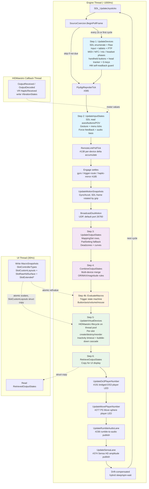

# Input Pipeline

*The six-step polling loop that runs at up to 1000 Hz (1 ms default interval) and turns raw device input into virtual controller output.*

---

The input pipeline runs on a dedicated background thread at ~1000 Hz with the default 1 ms interval. It processes physical device input through six steps to produce virtual controller output.



The pipeline is a `partial class InputManager` split across sixteen files:

| File | Step | Purpose |
|---|---|---|
| `InputManager.cs` | Main | Fields, Start/Stop, PollingLoop, trigger-route settle, motion snapshots, DSU broadcast |
| `InputManager.MenuRuntime.cs` | Steps 2–4b | Radial / touch menu runtime (#9): `MenuContexts` keyed (slot, device, menu), ticked in Step 2, fired items read by Step 3 rows and activators, direct bindings delivered in Step 4b |
| `InputManager.Step1.UpdateDevices.cs` | Step 1 | Device enumeration and lifecycle |
| `InputManager.Step1.UsbipVhciGuard.cs` | Step 1 | Composite-persona self-readback guard: walks the device path's PnP ancestry for HIDMaestro's stamped usbip-vhci host-controller hardware id (or, as a fallback, the `usbip2_ude` service), because a persona carries no other marker |
| `InputManager.Step2.UpdateInputStates.cs` | Step 2 | Input state reading and force feedback |
| `InputManager.Step3.UpdateOutputStates.cs` | Step 3 | Mapping engine (input -> Gamepad) |
| `InputManager.Step3.MappingSetEval.cs` | Step 3 | MappingSet evaluator (multi-source row resolve, combine modes, formula eval, shift-layer dispatch) |
| `InputManager.Step3.SteeringLockFeedback.cs` | Step 3 | Steering at-lock feedback (#94): AT-resistance ramp plus lock-entry lightbar / rumble / trigger-vibration pulses |
| `InputManager.Step4.CombineOutputStates.cs` | Step 4 | Multi-device merge per slot |
| `InputManager.Step4b.EvaluateMacros.cs` | Step 4b | Macro trigger/action state machine |
| `InputManager.Step5.VirtualDevices.cs` | Step 5 | Virtual controller output |
| `InputManager.Step6.RetrieveOutputStates.cs` | Step 6 | Copy output for UI display |
| `InputManager.GyroTilt.cs` | Steps 2–3 | Gyro Tilt gravity estimate per (device, slot): Step 2 updates it after each device read, and Step 3 reads it through `SourceCoercion.GyroTiltGravityProvider` |
| `InputManager.MenuPublication.cs` | Steps 2–5 | `MenuPublicationSync` gate. Each poll frame holds it from Step 2 through Step 5, and UI menu edits take it too, so an edit never lands mid-frame. It must be taken before the device and settings locks |
| `InputManager.SteeringAngleRumble.cs` | Steps 6, 2 | Steering Angle Rumble: Step 6 publishes each Xbox / PlayStation slot's combined frame, and the next Step 2 force-feedback pass turns the chosen axis into rumble |
| `InputManager.Tablets.cs` | Step 1 | Pen tablets: `Start()` starts the reader and `Stop()` stops it, Step 1 adds and removes tablet devices, and `TabletCaptureChanged` reports capture changes |

All files are in `PadForge.App/Common/Input/`.

## Contents

- [InputManager.cs. Main Class](#inputmanagercs-main-class)
- [Step 1: UpdateDevices](#step-1-updatedevices)
- [Step 2: UpdateInputStates](#step-2-updateinputstates)
- [Trigger Rumble Routing](#trigger-rumble-routing)
- [Step 3: UpdateOutputStates](#step-3-updateoutputstates)
- [Mouse Cursor as a Mapping Source](#mouse-cursor-as-a-mapping-source)
- [Shift Layer Activators and the Cycle Cursor](#shift-layer-activators-and-the-cycle-cursor)
- [Step 4: CombineOutputStates](#step-4-combineoutputstates)
- [Step 4b: EvaluateMacros](#step-4b-evaluatemacros)
- [Step 5: VirtualDevices](#step-5-virtualdevices)
- [Step 6: RetrieveOutputStates](#step-6-retrieveoutputstates)
- [Thread Safety Summary](#thread-safety-summary)
- [Data Flow Summary](#data-flow-summary)
- [Key Types Reference](#key-types-reference)

---

## InputManager.cs. Main Class

**Namespace:** `PadForge.Common.Input`

### Class Declaration

```csharp
public partial class InputManager : IDisposable
```

### Constants and Properties

| Member | Type | Default | Description |
|---|---|---|---|
| `PollingIntervalMs` | `int` (property) | `1` | Target polling interval (ms), clamped to 1–16. InputService sets it from Settings, or from the active profile's polling-rate override when one is set (#365). |
| `EnumerationIntervalMs` | `const int` | `2000` | Device re-enumeration interval (ms). Idle mode enumerates every 5000 ms instead |
| `MaxPads` | `const int` | `16` | Maximum virtual controller slots |
| `HmInactivityTimeoutSeconds` | `int` (property) | `60` | Seconds a virtual controller stays up while its mapped devices are offline. `0` disables the teardown. InputService copies it from the `HmInactivityDestroyTimeoutSeconds` setting |

### State Fields

| Field | Type | Description |
|---|---|---|
| `_pollingThread` | `Thread` | Background thread running PollingLoop (AboveNormal priority, IsBackground=true) |
| `_mouseInjectorThread` | `Thread` | Background thread running `MouseInjectorLoop` (AboveNormal priority, IsBackground=true) |
| `_running` | `volatile bool` | Loop control flag. Set false by `Stop()` to terminate |
| `_runGeneration` | `int` | Run stamp. `Start()` and `Stop()` each increment it, and a mouse-injector loop whose stamp is stale exits |
| `SuspendWhenBackground` / `HostIsForeground` | `public volatile bool` | Focus-suspend inputs, written by the UI tick. `SuspendWhenBackground` is true when "Continue Polling When Window Loses Focus" is unchecked. `HostIsForeground` defaults to true |
| `_focusSuspended` | `bool` | True while focus suspend holds the loop |
| `_idle` | `volatile bool` | When true, skips Steps 3–6 and sleeps at ~20 Hz. Step 2 still runs for Devices page preview. |
| `_sdlInitialized` | `bool` | Whether `SDL_Init` succeeded |
| `_disposed` | `bool` | Disposal guard |
| `_enumerationTimer` | `Stopwatch` | Time since last device enumeration |
| `_frequencyTimer` | `Stopwatch` | Time tracking for frequency measurement |
| `_frequencyCounter` | `int` | Cycle counter for frequency measurement |
| `_deviceSnapshotBuffer` | `UserDevice[]` | Pre-allocated buffer for Step 2 device snapshot (avoids LINQ/closure allocations). Grows dynamically. |
| `_settingSnapshotBuffer` | `UserSetting[]` | Pre-allocated buffer for Step 3 settings snapshot |
| `_padIndexBuffer` | `UserSetting[]` (starts at 64) | Pre-allocated buffer for `FindByPadIndex` lookups (Steps 2–5). Starts at 64, deliberately not `MaxPads`: it holds one slot's mappings, and `FindByPadIndex` silently truncates at the buffer length, so a slot-count constant here capped a slot at 16 device mappings. Step 2 and the motion snapshot grow it to the settings count. Poll thread only. The async create-failure validation passes its own buffer. |
| `_instanceGuidBuffer` | `UserSetting[MaxPads]` | Pre-allocated buffer for `FindByInstanceGuid` lookups (Step 2 FFB) |

### Public State Arrays

| Property | Type | Written By | Read By | Description |
|---|---|---|---|---|
| `CombinedOutputStates` | `Gamepad[MaxPads]` | Step 4, then Step 4b (engine) | Step 5, Step 6, UI | Combined gamepad state per slot |
| `CombinedRawHidStates` | `RawHidState[MaxPads]` | Step 4 (engine) | Step 5 | Combined raw HID state for Extended / Nintendo raw-surface slots |
| `CombinedMidiRawStates` | `MidiRawState[MaxPads]` | Step 4 (engine) | Step 5 | Combined MIDI raw state |
| `CombinedKbmRawStates` | `KbmRawState[MaxPads]` | Step 4 (engine) | Step 5 | Combined KBM raw state |
| `CombinedVrRawStates` | `VrRawState[MaxPads]` | Step 4 (engine) | Step 5 | Combined VR hand-pair raw state for VR slots (#49) |
| `CombinedTouchpadStates` | `TouchpadState[MaxPads]` | Step 4 (engine) | Step 5 | Combined touchpad state for PlayStation slots and for Extended raw-surface slots on a Valve profile |
| `SlotRawTouchpadClick` | `bool[MaxPads]` | Step 3 (engine) | InputReactive lightbar | Raw physical touchpad click OR'd across the slot's devices, independent of VC type and click mapping |
| `RetrievedOutputStates` | `Gamepad[MaxPads]` | Step 6 (engine) | UI timer | Copy of combined states for UI display |
| `RetrievedKbmRawStates` | `KbmRawState[MaxPads]` | Step 6 (engine) | UI timer | Copy of KBM raw states for UI preview |
| `RetrievedTouchpadStates` | `TouchpadState[MaxPads]` | Step 6 (engine) | UI timer | Copy of touchpad states for UI display |
| `FinalVibrationStates` | `Vibration[MaxPads]` | Step 2 (engine) | UI | Per-slot post-processed vibration, each motor the max across the slot's devices with each device's own tuning applied. Drives the Controller preview tab's motor meter |
| `SelectedDeviceVibrationStates` | `Vibration[MaxPads]` | Step 2 (engine) | UI | Per-slot vibration scaled by the tuning of the device selected on the FFB tab. Drives that tab's Motor Activity meter |
| `VibrationStates` | `Vibration[MaxPads]` | HIDMaestro output threads, UI (test rumble), Step 5 (teardown) | Step 2 (engine) | Per-slot rumble from games. **Cross-thread**: `HMController.OutputReceived` and, on Sony profiles, `OutputDecoded` write it (registered through `IVirtualController.RegisterFeedbackCallback`), and a VR slot's `HMVRController.HapticReceived` does the same. Test Rumble writes it from the UI thread, and Step 5 zeroes it when a controller is torn down. |
| `MotionSnapshots` | `MotionSnapshot[MaxPads]` | Engine (after Step 2) | Step 5, UI | Per-slot gyro and accel reconciled from the slot's motion mapping rows, grip applied, sent with the virtual controller's report. The DSU broadcast reads the internal `DsuMotionSnapshots` (four slots), which combines every assigned sensor when a slot has no motion rows. |
| `MacroSnapshots` | `MacroItem[][MaxPads]` | UI timer (30 Hz) | Step 4b (engine) | Per-slot macro definitions. **Cross-thread**: atomic reference swap. |
| `TestRumbleTargetGuid` | `Guid[MaxPads]` | UI | Step 2 | When non-empty, restricts test rumble to one device GUID in the slot |
| `CurrentFrequency` | `double` | Engine | UI | Measured polling frequency (Hz). Updated ~once/second. |
| `IsRunning` | `bool` | `Start()` / `Stop()` | UI | Whether the polling loop is active |
| `IsIdle` | `bool` | UI (InputService) | Engine | When true, skips Steps 3–6 and runs at ~20 Hz. InputService sets it when no created, enabled slot has an online mapped device, no Remote Link peer is connected, and no live virtual controller is waiting on its inactivity timeout. |
| `DsuServer` | `DsuMotionServer` | InputService | Engine | DSU motion server. When set, broadcasts motion data after Step 2. |
| `AudioBassDetector` | `AudioBassDetector` | InputService | Engine | Audio bass detector. When set, bass energy is combined with game rumble via `max()`. |

### Events

```csharp
public event EventHandler DevicesUpdated;
public event EventHandler FrequencyUpdated;
public event EventHandler<InputExceptionEventArgs> ErrorOccurred;
public event EventHandler<int> HmVcInactivityDestroyed;
public event EventHandler<int> HmVcWentNonActive;
public event Action<TouchpadInputState> RecordingTick;
public event Action<WindowsTabletDevice, int, bool, string> TabletCaptureChanged;
```

| Event | Thread | Description |
|---|---|---|
| `DevicesUpdated` | Engine thread, the caller of the external-device register and unregister methods, and the tablet reader thread | Fired when the device list changes: a connect or disconnect, a Remote Link peer coming back, a tablet capture change, or the Flydigi Space Station service starting or stopping. UI must marshal to dispatcher. |
| `FrequencyUpdated` | Engine thread | Fired about once per second with the updated `CurrentFrequency`. Idle and focus-suspended passes fire it every pass with `CurrentFrequency` at 0. |
| `ErrorOccurred` | Engine thread, Step 5 create workers on the thread pool, and the thread calling `Start()` or `Stop()` | Non-fatal errors, plus the SDL init failures that stop `Start()`. `InputExceptionEventArgs` carries `Message` and `Exception`, which is null when there is no exception (for example an `SDL_Init` failure). |
| `HmVcInactivityDestroyed` | Engine thread | An HM-backed virtual controller reached its inactivity timeout. The argument is the pad index. InputService hops to the UI thread and runs the teardown and bubble-down cascade (see [Step 5](#step-5-virtualdevices)) |
| `HmVcWentNonActive` | Engine thread | An HM-backed slot's virtual controller was torn down for a non-delete reason (sidebar disable, every device unassigned). InputService runs the bubble-down cascade on the UI thread |
| `RecordingTick` | Engine thread | Raw touchpad state of the gesture recorder's target pad, fired each tick while the recorder is open |
| `TabletCaptureChanged` | Tablet reader thread | A pen tablet's capture state changed |

### Constructor

```csharp
public InputManager()
```

Initializes `VibrationStates[]`, `FinalVibrationStates[]`, and `SelectedDeviceVibrationStates[]` with a `new Vibration()` per slot.

### SDL Initialization

```csharp
private bool InitializeSdl()
```

Sets SDL hints, then calls `SDL_Init` with flags:

```csharp
SDL_INIT_JOYSTICK | SDL_INIT_GAMEPAD | SDL_INIT_VIDEO | SDL_INIT_HAPTIC
```

Key hints (not exhaustive):
- `SDL_HINT_JOYSTICK_ALLOW_BACKGROUND_EVENTS = "1"`. Receive input without window focus
- `SDL_HINT_JOYSTICK_XINPUT = "1"`. Enable Xbox controller enumeration via XInput backend
- `SDL_HINT_JOYSTICK_HIDAPI_FLYDIGI`. Set by `ApplyFlydigiEnhancedProtocol` before `SDL_Init` ("1" by default), following the Flydigi Enhanced Protocol setting (#395)
- `SDL_HINT_JOYSTICK_BLACKLIST_DEVICES = InputManager.JoystickBlacklistDevices` (`"0x054c/0x03d5,0x054c/0x0c5e,0x054c/0x042f"`). Keeps SDL's own rows for the PS Move ZCM1, ZCM2 and the Navigation controller out of the list, because `PsMoveDirectService` and `Ds3DirectService` surface them (#277)
- `SDL_HINT_JOYSTICK_HIDAPI_SWITCH2 = "1"`. Enable SDL's Switch 2 HIDAPI driver for USB-connected Pro Controller 2, Joy-Con 2 and NSO GameCube controllers, through libusb (no Bluetooth)
- `SDL_HINT_JOYSTICK_HIDAPI_WII = "1"`. Enable the Wii Remote / Nunchuk / Classic / Wii U Pro HIDAPI driver (#116). Relies on the fork's `HidD_SetOutputReport` fix
- `SDL_HINT_JOYSTICK_BLE_SWITCH2 = "1"`. Enable the fork's Bluetooth-LE Switch 2 driver (Pro Controller 2, Joy-Con 2 L/R, NSO GameCube), which speak BLE GATT, not HID-over-Bluetooth
- `SDL_HINT_JOYSTICK_BLE_SWITCH2_MOUSE = "1"`. Post Joy-Con 2 optical-mouse 16-bit counters on joystick axes 6/7 (#154)
- `SDL_HINT_JOYSTICK_HIDAPI_SWITCH_SHAPED_RUMBLE = "1"`. The fork's frequency-shaped classic Switch rumble (#271 item 4). Each motor's intensity also sweeps its frequency band (low motor roughly 41-160 Hz, high 160-320 Hz) with attack and decay transients. Classic LRA packet only, Switch 2 encoding untouched
- `SDL_HINT_JOYSTICK_BLE_SWITCH2_MAGNETOMETER = "1"`. The fork's Switch 2 BLE magnetometer channel: three raw int16 axes after the mouse counters, availability signaled by the raw axis count (9 = magnetometer, 11 = mouse plus magnetometer). PadForge reads them for Anchor Yaw to Compass (#271 item 5), which pulls gyro yaw toward the magnetic heading once a magnetometer calibration is stored
- `SDL_HINT_HIDAPI_IGNORE_DEVICES = InputManager.HidapiIgnoreDevices` (`"0x146b/0x0603"`). Keeps SDL's hidapi layer from probing the Nacon PS4 Compact, which froze the enumerating thread on connect (#235). The leading explanation in the code is a Sony third-party detection FEATURE read that never returns on Windows. Ignored pads ride the XInput / DirectInput lanes instead
- `SDL_HINT_JOYSTICK_HIDAPI_JOYCON_IR_SENSOR` is **not** set at init. The right Joy-Con's NIR camera and its NFC reader share one MCU (camera = mode 5, NFC = mode 4), so an always-on hint silently killed standalone right Joy-Con NFC. `InputService.RefreshSwitchNfcArming` sets it only while a configured "IR Brightness" input has been read within the last 10 s, a right Joy-Con or combined Joy-Con pair is online, and no NFC tag registration is capturing (#151, #248)
- `SDL_HINT_JOYSTICK_HIDAPI_PS3_SIXAXIS_DRIVER = "1"`. Claim a DS3 running DsHidMini SixaxisCompatible mode for motion, pressure axes, and accel/gyro (#194). Do **not** also set `SDL_HINT_JOYSTICK_HIDAPI_PS3`
- `SDL_HINT_VIDEO_ALLOW_SCREENSAVER = "1"`. Do not block screensaver
- **Never** set `SDL_HINT_JOYSTICK_RAWINPUT`. Conflicts with XInput enumeration and hides Xbox controllers

Post-init:
1. Calls `LoadEmbeddedGamepadMappings()`. Reads the `gamecontrollerdb_padforge.txt` resource embedded in the single-file exe and applies each non-comment line via `SDL_AddGamepadMapping`. The file-path overload (`SDL_AddGamepadMappingsFromFile`) is unusable when the file ships inside the exe rather than as a loose file next to it. `EmbeddedMappingsLoaded` records the applied count, and the same count goes to the diagnostics log as `MAPPINGS embedded applied=N`
2. Calls `SDL_EnableScreenSaver()`. SDL_INIT_VIDEO disables the screensaver by default
3. Calls `SetThreadExecutionState(ES_CONTINUOUS)`. Clears execution-state flags so the PC can sleep
4. Starts the side-band device services, each of which surfaces its hardware as a virtual joystick to the normal pipeline. Start failures are caught and logged and never fail SDL init. The two `Ds3DirectService` instances, `PsMoveDirectService`, and the provider wiring share one try/catch, so a DS3 start failure also skips the Navigation and Move services. `SpaceMouseService` and `OpenVrConsumerService` each have their own:
   - `Ds3DirectService` (Bluetooth DS3 behind BthPS3, no DsHidMini)
   - A second `Ds3DirectService` with `navigation: true`. The PlayStation Navigation controller is a half sixaxis on the same BthPS3 stack (#277)
   - `PsMoveDirectService`. The Move motion controller's own protocol lane, ZCM1 (49-byte report) and ZCM2 (44-byte) (#277). It also supplies `SdlDeviceWrapper.ExternalPowerInfoProvider` and `ExternalDevicePathProvider` alongside `Ds3DirectService`, because SDL has no power or path channel for virtual joysticks
   - `SpaceMouseService`. 3Dconnexion 6DoF pucks, HID usage 0x08 Multi-axis Controller, invisible to SDL's raw-input backend (#288)
   - `OpenVrConsumerService`. Headset pose and tracked controllers through a background OpenVR client, a 5 s registry-file poll until SteamVR exists and runs, and it never launches SteamVR itself (#287)

**Error handling:** Catches `DllNotFoundException` (SDL3.dll missing) and generic exceptions. Raises `ErrorOccurred` but does not throw. `Start()` checks the return value and aborts on failure.

```csharp
private void ShutdownSdl()
```

Returns at once if SDL never initialized. Otherwise stops the side-band services (both `Ds3DirectService` instances, `PsMoveDirectService`, `SpaceMouseService`, `OpenVrConsumerService`), calls `SDL_Quit()`, and clears `_sdlInitialized`. Called only by `Dispose()`.

### Start / Stop

```csharp
public void Start()
```

1. Returns at once if `_running` is set or the manager is disposed
2. Calls `InitializeSdl()`. Returns on failure
3. Replaces the composite-persona audio owner if the last `Stop()` closed it
4. Calls `RawInputListener.Start()`. Starts the `PadForge.RawInputListener` thread, whose hidden message-only window receives keyboard, mouse, and consumer-control input with `RIDEV_INPUTSINK`, so input arrives without focus
5. Calls `MidiEndpointJanitor.ScheduleSweep(0)`. A background sweep removes MIDI endpoint devnodes a previous run left behind
6. Creates and starts `_ptpReader`. Precision-touchpad reader, always on so the Devices page can preview touchpad input
7. Calls `StartTabletReader()`
8. Clears the steering-angle rumble frames, sets `_running = true`, restarts the enumeration and frequency stopwatches, and zeroes `_frequencyCounter`
9. Increments `_runGeneration`, then creates and starts the polling thread (`PollingLoop(generation)`, named `PadForge.InputManager`, AboveNormal, background)
10. Creates and starts the mouse-injector thread (`MouseInjectorLoop(generation)`, named `PadForge.MouseInjector`, AboveNormal, background). It batches the mouse-move and scroll deltas from macros and the keyboard+mouse virtual controller into one `SendInput` per flush, off the 1000 Hz poll thread. Injected movement runs synchronously through every low-level mouse hook, so a per-poll call would collapse the poll rate to ~200 Hz

**Thread safety:** Call it from the UI thread. `SDL_Init` runs on the calling thread, and `PumpSdlEvents` must run on that same thread for hot-plug to work. The `_running` guard takes no lock. A call while the engine runs returns at once.

```csharp
public void Stop()
```

1. Returns at once unless `_running` is set
2. Sets `_running = false` and clears the steering-angle rumble frames
3. Calls `AudioPassthroughService.ClosePersonaOwner`, which retires the composite-persona audio feeds this run owns
4. Calls `SoundMacroService.StopAll()`, which releases the macro-sound WASAPI clients, then `AudioPassthroughService.Shutdown()`
5. Calls `WiiSpeakerService.Shutdown()` and `HapticToneService.Shutdown()`. Both streams die with the engine, not with a profile apply, because their suppression latch clears only in `EnsureStarted` at engine start
6. Calls `RumbleAudioService.SilenceAll()` then `StopAll()`. Engine stop is an explicit #236 silence edge, and the renderer dies here rather than inside `SoundMacroService.StopAll`, which also runs on every profile apply and would otherwise silence the shakers on every profile switch
7. Increments `_runGeneration`. A mouse-injector loop that outlives its join exits on the stale stamp. `PollingLoop` receives its stamp but tests only `_running`
8. Joins the polling thread with a 3-second timeout. A timeout is logged and teardown continues
9. Signals `MouseWorkSignal` to unpark an idle injector, then joins the mouse-injector thread with a 1-second timeout
10. Stops `RawInputListener`
11. Stops and disposes `_ptpReader`, then calls `StopTabletReader()`
12. Calls `StopAllForceFeedback()`. Best-effort stop on all devices
13. Calls `AwaitPendingLifecycleTasks()`. Waits (bounded, 30 s) for in-flight HM connect/dispose tasks so a late connect can't orphan a controller in the kernel device tree
14. Calls `DestroyAllVirtualControllers()`. Disconnects and disposes all VCs
15. Clears every `_slotInitializing` flag so post-stop reads return false
16. Calls `DisposeHMaestroContextOnShutdown()`. Tears down the shared `HMContext`
17. Calls `CloseAllDevices()`. Disposes every open device wrapper and clears its runtime state
18. Stops the enumeration and frequency stopwatches and zeroes `CurrentFrequency`

`IVirtualController.Disconnect()` takes no parameters. For a HIDMaestro slot it disposes the `HMController`, which removes the device. HIDMaestro itself has no disconnect call. The v2 vJoy "preserve nodes" path is gone. HM creates and destroys virtual devices dynamically without leaving stale joy.cpl entries behind.

### Main Polling Loop

```csharp
private void PollingLoop(int generation)
```

Background thread entry point. Sets `timeBeginPeriod(1)` for the loop duration (restored via `timeEndPeriod(1)` in `finally`).

**Per-cycle execution order:**

```
SDL_UpdateJoysticks()         -- pump SDL event queue
  |
  v
SourceCoercion.BeginPollFrame() -- advance the evaluator poll-frame gate once
  |
  v (every 2 seconds, or first cycle)
Step 1: UpdateDevices()       -- enumerate, open/close devices
  |
  v
FlydigiReprobeTick()          -- ask SDL to re-probe an unclaimed Flydigi vendor interface while
  |                              Flydigi Enhanced Protocol is on (#395)
  v
Step 2: UpdateInputStates()   -- read axes/buttons/POV from SDL, apply FFB
  |
  v
RemoteLinkPollTick?.Invoke()  -- fold this poll's fresh snapshots into the #138 per-device delta accumulators
  |
  v
UpdateGyroEngageStates()      -- settle per-slot gyro engage bits
UpdateTriggerRouteEngageStates() -- settle per-slot trigger-route engage bits
UpdateHapticMirrorEngageStates() -- settle each (slot, device) haptic-mirror engage cell (#185)
  |
  v
UpdateMotionSnapshots()       -- capture gyro/accel for Step 5 and DSU, plus the per-slot battery scan
BroadcastDsuMotion()          -- send to Cemuhook clients via UDP
  |
  v
Step 3: UpdateOutputStates()  -- map CustomInputState to Gamepad via the slot's MappingSet rows
                                 (PadSetting fields when the set is empty)
  |
  v
Step 4: CombineOutputStates() -- merge multiple devices per slot
  |
  v
Step 4b: EvaluateMacros()     -- trigger/action state machine, inject into Gamepad
  |
  v
Step 5: UpdateVirtualDevices()-- create/destroy VCs, submit reports
  |
  v
Step 6: RetrieveOutputStates()-- copy combined output for UI consumption
  |
  v
UpdateDs3PlayerNumber()       -- rate-limited player-LED refresh for the bridged Bluetooth DS3 (#191)
  |
  v
UpdateMovePlayerNumber()      -- same 500 ms cadence for the bridged PS Move sphere's player color (#277)
  |
  v
UpdateRumbleAudioLane()       -- publish per-slot rumble-to-audio packs (#236), after Step 5 so a
  |                              slot destroyed this tick publishes zeros the same tick
  v
UpdateSensaLane()             -- publish the max feedback voice across all slots, 0..1,
  |                              for the Sensa HD haptics worker (#374)
  v
Frequency measurement (~1/second)
  |
  v
Drift-compensated hybrid sleep/spin-wait
```

Each iteration first checks the idle gate (`BeginIdlePoll()`) and then focus suspend (`ApplyFocusSuspension()`), both described below. Step 2 through Step 5 run inside `EnterMenuPublication()`, the `MenuPublicationSync` gate, so a radial or touch menu never observes a half-written frame. After `UpdateSensaLane()` a stall watchdog writes a `STALL` line to the diagnostics ring when the SDL pump or enumeration takes 25 ms or more, or the cycle 50 ms or more, and a `HEARTBEAT` line every 10 s.

**Poll-frame gate:**

`SourceCoercion.BeginPollFrame()` (`SourceCoercion.cs` line 657) is called once per active cycle, right after `SDL_UpdateJoysticks()` and before Step 1 (`InputManager.cs` line 1694). The idle branch does not call it. It increments a shared `_pollFrameSeq` counter that gates every state-carrying evaluator cache in `SourceCoercion`: the dual-threshold gyro smoothing ring, the legacy gyro EMA, the IR pointer EMA, the Joy-Con 2 mouse velocity window, the trackball momentum state, and the touchpad relative-delta trackers. Each cache compares its stored sequence against `_pollFrameSeq` and re-serves the frame's value on repeat reads, so it advances once per poll no matter how many mapping rows read the same source. Without the gate, two gyro rows would halve the smoothing window the Gyro tab promises, and a second relative-touchpad row would consume the first one's delta. The counter and the caches it gates are polling-thread only.

**3-Tier Polling Sleep Strategy:**

The polling loop uses a tiered sleep strategy, falling through to the next tier if the preferred timer is unavailable:

| Tier | Mechanism | Availability | CPU Cost |
|---|---|---|---|
| **Tier 1** | High-Resolution Waitable Timer | Windows 10 1803+ | Near-zero (kernel sleep) |
| **Tier 2** | Multimedia Timer + ManualResetEvent | All Windows | Near-zero (event wait) |
| **Tier 3** | Thread.Sleep(1) + SpinWait | All Windows | ~1–3% of one core |

**Tier 1: High-Resolution Waitable Timer**. `CreateWaitableTimerExW` with `CREATE_WAITABLE_TIMER_HIGH_RESOLUTION` (0x00000002). Sleeps at sub-ms granularity via the kernel scheduler without busy-waiting. The timer is set as a negative relative due time (100 ns intervals) via `SetWaitableTimerEx`, then the thread blocks on `WaitForSingleObject`. Leaves a 0.1 ms (`spinThresholdTicks`) gap before the target to spin-finish.

**Tier 2: Multimedia Timer Fallback**. `timeSetEvent` creates a periodic callback (period `Math.Max(1, PollingIntervalMs)`, fixed when the loop starts) that signals a `ManualResetEvent`. The thread blocks on `WaitOne(50)` until the callback fires. This is the x360ce-style approach. Precision is ~1–2 ms with `timeBeginPeriod(1)`. The callback delegate is prevented from GC via `GC.KeepAlive(mmTimerCb)` in `finally`.

**Tier 3: Thread.Sleep(1) + SpinWait**. Legacy fallback when both timers fail. `Thread.Sleep(1)` absorbs bulk wait when >1.5 ms remains (`sleepThresholdTicks`).

A Tier 1 timer that fails to arm falls back to `Thread.Sleep(1)` for that cycle. When a cycle's work overruns the interval (`remaining <= 0`), no wait runs and the loop calls `Thread.Yield()`, so lower-priority threads, the UI thread included, still get a scheduling gap (#331).

All three tiers finish with a spin-wait loop for the final sub-ms portion:

```csharp
while (cycleTimer.ElapsedTicks < adjustedTarget)
    Thread.SpinWait(1);
```

**Wall-clock drift compensation:**

Instead of per-cycle overshoot tracking, the loop compares cumulative expected time against a wall-clock `Stopwatch`:

```csharp
expectedTicks += targetTicks;
long drift = wallClock.ElapsedTicks - expectedTicks;
long adjustedTarget = targetTicks - drift;
```

If behind (positive drift), future cycles shorten. If ahead (negative drift), they lengthen. This converges the long-term average rate to the target Hz.

Safety mechanisms:
- If drift exceeds 10x the target interval in either direction (e.g., after sleep/resume), the wall clock resets instead of sprinting to catch up
- `adjustedTarget` floors at `targetTicks / 4` to prevent negative or near-zero waits

**Idle mode:**

When `IsIdle` is true, the loop enters low-power mode. `InputService.UpdateIdleState` sets it when no created, enabled slot has an online assigned device, no Remote Link peer is connected, and (with the inactivity timeout above zero) no created, enabled slot still holds a virtual controller:
- Calls `RumbleAudioService.SilenceAll()` every iteration. The #236 feedback lane does not run in idle, so idle entry is an explicit silence edge and every iteration republishes it
- Pumps `SDL_UpdateJoysticks()`
- Runs `UpdateDevices()` every 5 seconds (instead of 2) so new controllers still appear on the Devices page
- Runs `UpdateInputStates()` for Devices page raw input preview
- Fires `RemoteLinkPollTick?.Invoke()` so shared devices keep streaming their #138 delta accumulation while no slot is active on this end
- Runs `EvaluateGlobalMacros()` so profile shortcuts still work from an empty profile
- Calls `ReleaseAllLatchedMacroKeys()`. The slot macro evaluator's latched-key reconcile does not run in idle, so any `ToggleKey` latch is released rather than left stuck down. Latch bits stay set on the actions and re-assert when the pipeline wakes
- Skips Steps 3–6, apart from one neutral Step 5 submit on the idle entry edge
- Sleeps at ~20 Hz (`Thread.Sleep(50)`)
- Reports `CurrentFrequency = 0`
- Sets `firstCycle = true` and resets the drift state on every idle iteration, so the first active cycle enumerates at once and does not burst

**Focus suspend:**

The engine half of the "Continue Polling When Window Loses Focus" setting. When `SuspendWhenBackground` is set (the user unchecked the box) and the host window is not foreground, the loop suspends instead of polling: on the entry edge it zeros every combined surface (`NeutralizeCombinedOutputs`), submits once, and releases latched macro keys, so the game left behind is not stuck holding whatever was pressed when focus moved. Each suspended iteration republishes the #236 silence edge and still runs `UpdateVirtualDevices()` at the loop's ~10 Hz so create/dispose gates and both watchdogs keep advancing on neutral state. Suspension stops the engine driving inputs. It does not stop the lifecycle machinery. Distinct from `_idle`, which engages when nothing is active. Focus suspend engages because things are active and the user wants them off while away.

**Sleep guard:** Every 5 seconds of active polling, calls `SetThreadExecutionState(ES_CONTINUOUS)` to clear execution-state flags SDL may re-assert, so the PC can still sleep.

### Slot Reorder

Pad indices are data identity. A slot's mappings, profile, devices, and settings live at its pad index and never move. Visual position is the kernel-slot anchor: in an HM-backed group the VC at visual position V holds kernel slot V. There is no per-slot data-array shuffle. Nothing in `InputManager` swaps `SlotControllerTypes[]`, `VibrationStates[]`, or the `Combined*States` arrays between pad indices, and there is no `SwapSlots` / `SwapSlotData` method on `InputManager`.

The UI-facing reorder verbs live on `InputService`: `SwapSlots(int, int)` (`InputService.cs` line 17980), `MoveSlot(int, int)` (line 18013), and `MoveSlotToGroupTail(int)` (line 18060). `SwapSlots` and `MoveSlot` mutate `SettingsManager.SlotOrders` for the new visual order, then route through `InputService.RebuildKernelOrderAfterReorder` to the sole `InputManager` reorder entry point. `MoveSlotToGroupTail` changes only the group order (see below):

```csharp
public void RerouteVirtualControllersForReorder(
    VirtualControllerType groupType, IReadOnlyList<int> oldOrder, IReadOnlyList<int> newOrder)
```

`InputManager.Step5.VirtualDevices.cs` line 2992. It runs on the UI thread under the VC lifecycle lock. Intra-group only, and only for the four HM-backed groups (Xbox / PlayStation / Nintendo / Extended). It early-returns for any other group and for null or length-mismatched orders. For each visual position V it decides per position:

- **Same profile at V**: reuse the kernel VC in place. The pad-index pointer in `_virtualControllers[]` moves so the new pad-at-position-V feeds V's kernel slot, and `FeedbackPadIndex` is updated on the surviving VC so the rumble callback writes the right `VibrationStates[]` entry. No teardown.
- **Different profile at V**: destroy the old VC via the regular async-dispose path. Pass 2's visual-order gate plus `ApplyAscendingIndexPreemption` recreate it with the new pad's profile at the lowest free kernel slot, which is V because every surviving VC at positions below V keeps its slot.
- **Inactive pad at V**: when the new pad at V has no VC and no online assigned device, the position is skipped and the old VC stays at its pad index. A VC displaced by that skip is destroyed before a reused VC takes its index.

Same-profile cycles collapse to a pure pointer rotation across `_virtualControllers[]` with zero kernel teardown. Cross-group moves go through `MoveSlotToGroupTail` and fall back to Pass 1 destroy / Pass 2 recreate. See [Services Layer#slot-reordering](services-layer.md#slot-reordering).

### Motion Snapshots

```csharp
private void UpdateMotionSnapshots()
```

Called after Step 2 (`InputManager.cs` line 1720). Iterates all 16 pad slots. A slot with `!SlotCreated` clears any stale snapshot and skips. The same walk also runs the per-slot battery scan (first-online-with-data reading into `BatteryPercents` / `BatteryCharging`, plus an all-device change signature that kicks the Battery lightbar repaint), independent of motion, and reads the first assigned DualSense's trigger-feedback bytes into `Ds5StatusBytes` (#433).

**Source resolution.** The gyro channel and the accel channel resolve **separately** from the slot's `MappingSet` rows. `ReconcileMappedMotion` (`InputManager.cs` line 3387) tries the target's rows in order (the engaged layer's row, then the Base row, then any other row naming the target) and keeps the first whose combined sample has motion. Inside a row, `ReconcileMotionRow` reads every motion source. A source pinned to a device reads it while it is online, and a source with no device reads every enabled, online device assigned to the slot. The values combine per axis by the row's `CombineMode`: largest magnitude by default, or Sum, Average, or a Custom expression:

```csharp
var gyro = _motionHasGyroRow[padIndex]
    ? ReconcileMappedMotion(ms, MappingSetMigrator.MotionGyroTarget,
        requireGyro: true, padIndex, timestampUs) : default;
var accel = _motionHasAccelRow[padIndex]
    ? ReconcileMappedMotion(ms, MappingSetMigrator.MotionAccelTarget,
        requireGyro: false, padIndex, timestampUs) : default;
var mapped = JoinMotionChannels(gyro, accel, timestampUs);
```

The two sub-channels can land on different devices. A 250 ms row-presence gate caches, per channel, whether the slot's `MappingSet` has a gyro row and an accel row, so a channel without a row skips its per-tick walk (a new set reference or a changed row count re-scans immediately). Motion rows exist only on motion-capable slot families: `MappingSetMigrator.EnsureMotionRows` (`MappingSetMigrator.cs` line 692) backfills them on load and on device assignment for **PlayStation and Nintendo** slots (the virtual Switch Pro gained a real IMU surface in HIDMaestro v1.3.18) and for Extended slots on a Valve profile. Other slot types have no motion rows, so `MotionSnapshots` gets `HasMotion = false`. DSU keeps a separate `DsuMotionSnapshots` array: while the DSU server runs, a slot in DSU range (0 to 3) with neither motion row takes the largest-magnitude value per axis across every enabled, online device assigned to it, reading a device's aux sensor only when it has no primary one. The pre-v3.2.3 "first online device with sensors" walk is retired: the source now follows the mapping rows, and the per-tick walk hands off cleanly as devices come and go. A `"Motion Accel L"` source reads the aux (Nunchuk / left Joy-Con) accelerometer via `s.AccelAux` instead of the body IMU (#199 follow-up). A `"Motion Gyro L"` source does the same for the gyro channel (#252): `MappingSetMigrator.IsMotionGyroAuxDescriptor` flips a `gyroAux` flag, the read comes from `s.GyroAux`, and the flag is passed through to `GetPassthroughGyro` so the aux IMU keeps its own bias, gravity, and smoothing state.

**Delivery.** `BroadcastDsuMotion` sends `DsuMotionSnapshots` right after the snapshot pass (below). Step 5 delivers `MotionSnapshots[padIndex]` through `SubmitRawHidState`'s IMU channel on Nintendo and Extended raw-surface slots, through `ValveReportPackers` and `SubmitRawReport` on Extended slots with a Valve profile, through the `SonyReportPackers` raw report on PlayStation slots with a USB Sony profile, and through the extended `SubmitGamepadState` overload on the other PlayStation profiles. An Extended layout with more than 32 buttons or more than one hat goes through `ExtendedReportPacker` and carries no motion. `HasMotion = false` submits zeroes.

**No sign transform, one grip rotation.** The native SDL sensor frame is preserved apart from the (device, slot) grip. Accel is a raw scaled read, then rotated for the grip. Gyro goes through `GetPassthroughGyro`, whose calibrated read subtracts the (device, slot) bias and applies the same rotation. The Gyro tab's discretionary tuning runs on top only when Apply Gyro Tuning to Motion Passthrough is checked, which it is not by default:

```csharp
// Accel. MsToG = 1/9.80665, no negation:
ax = accel[0] * MsToG;   ay = accel[1] * MsToG;   az = accel[2] * MsToG;
// Grip (#392), body accelerometer only. The aux (Nunchuk / left Joy-Con)
// sensor is a separate body in the other hand and keeps its own frame:
if (!accelAux)
    SourceCoercion.ApplyMotionGrip(guid, padIndex, ref ax, ref ay, ref az);

// Gyro. GetPassthroughGyro always subtracts the calibration bias and
// applies the grip. Deadzone / sensitivity / smoothing / curve / invert
// run only with Apply Gyro Tuning to Motion Passthrough on.
// Then RadToDeg = 180/PI, no negation:
SourceCoercion.GetPassthroughGyro(s, guid, padIndex,
    out float tunedPitch, out float tunedYaw, out float tunedRoll, gyroAux);
gx = tunedPitch * RadToDeg;   gy = tunedYaw * RadToDeg;   gz = tunedRoll * RadToDeg;
```

**Grip rotation (#392).** `SourceCoercion.RotateForGrip` (`SourceCoercion.cs` line 3598) turns a body-frame vector into the frame the game expects for the hold the user picked on the Gyro tab. The driver delivers every controller in the frame of its natural hold, a Wii Remote aimed at the screen, +X right, +Y out of the face, +Z toward the player. Three other holds have tables, all proper rotations, so the same one serves gyro, accelerometer, and the gravity estimate alike:

| Grip | Hold | `(x, y, z)` becomes |
|---|---|---|
| `Sideways` | quarter turn about the vertical, top edge left, face up | `(z, y, -x)` |
| `WiiWheel` | top edge left and the face turned toward the player | `(z, x, y)` |
| `Upright` | top edge pointed up | `(x, -z, y)` |

An unknown or empty grip is the identity. `ApplyMotionGrip` (line 3653) is the in-place wrapper the snapshot builder and the Gyro tab readout call. The rotation applies to the body sensor only. `GripAxis` (line 3613) is the per-axis form, which lets a single-axis read debias its source axis before applying the sign. The hat turns with the hold too: see [D-Pad from POV](#d-pad-from-pov).

A source's `Invert` flips all three axes of its channel. On the gyro channel it stacks with the Gyro tab's per-axis invert, which applies only while Apply Gyro Tuning to Motion Passthrough is on (an axis inverted in both places has no net flip). An `InvertOnHold` modifier on the row flips the row's combined result while it is held. The DSU frame flips live downstream in `DsuMotionServer.BuildPadDataPacket` (accel `-X, -Y, -Z`, gyro `X, -Y, -Z`), and the Steam Deck axis map lives in `ValveReportPackers`. The Sony report packers write the snapshot's frame unchanged, and HIDMaestro's packers set the wire frame on the `SubmitRawHidState` and extended `SubmitGamepadState` paths.

Timestamp: microseconds, computed as `(long)(GetTimestamp() * (1_000_000.0 / Stopwatch.Frequency))`. The multiply runs in `double` because `GetTimestamp() * 1_000_000` overflows `Int64` once the machine has been up long enough (~10 days at a 10 MHz QPC).

```csharp
private void BroadcastDsuMotion()
```

Iterates the four DSU slots (`DsuMotionServer.MaxSlots`) and calls `DsuServer.BroadcastMotion(padIndex, DsuMotionSnapshots[padIndex], IsSlotActive(padIndex))`. While focus suspend is engaged it stamps each snapshot with the current time first. The DSU server may be null (no-op).

### IDisposable

```csharp
public void Dispose()
```

Returns at once if already disposed. Otherwise calls `Stop()`, then shuts down the NFC readers, microphone devices, headset motion inputs, handheld inputs, head-tracker inputs, and Logitech G-key inputs (after the poll loop stops, before `ShutdownSdl()` tears down the device list their retire paths walk), then calls `ShutdownSdl()`, clears the gyro tilt states, and marks the instance disposed. The finalizer calls `Dispose()` as a safety net. The normal path calls `GC.SuppressFinalize`.

### Win32 P/Invoke

```csharp
// Timer resolution
[DllImport("winmm.dll", ExactSpelling = true)]
private static extern uint timeBeginPeriod(uint uPeriod);

[DllImport("winmm.dll", ExactSpelling = true)]
private static extern uint timeEndPeriod(uint uPeriod);

// Multimedia timer (Tier 2 fallback)
private delegate void TimerCallback(uint uTimerID, uint uMsg,
    IntPtr dwUser, IntPtr dw1, IntPtr dw2);

[DllImport("winmm.dll", ExactSpelling = true)]
private static extern uint timeSetEvent(uint uDelay, uint uResolution,
    TimerCallback lpTimeProc, IntPtr dwUser, uint fuEvent);

[DllImport("winmm.dll", ExactSpelling = true)]
private static extern uint timeKillEvent(uint uTimerID);

private const uint TIME_PERIODIC = 1;

// High-resolution waitable timer (Tier 1)
[DllImport("kernel32.dll", SetLastError = true)]
private static extern IntPtr CreateWaitableTimerExW(
    IntPtr lpTimerAttributes, IntPtr lpTimerName, uint dwFlags, uint dwDesiredAccess);

[DllImport("kernel32.dll", SetLastError = false)]
private static extern bool SetWaitableTimerEx(
    IntPtr hTimer, ref long lpDueTime, int lPeriod,
    IntPtr pfnCompletionRoutine, IntPtr lpArgToCompletionRoutine,
    IntPtr WakeContext, uint TolerableDelay);

[DllImport("kernel32.dll")]
private static extern uint WaitForSingleObject(IntPtr hHandle, uint dwMilliseconds);

[DllImport("kernel32.dll")]
private static extern bool CloseHandle(IntPtr hObject);

private const uint CREATE_WAITABLE_TIMER_HIGH_RESOLUTION = 0x00000002;
private const uint TIMER_ALL_ACCESS = 0x1F0003;
private const uint INFINITE = 0xFFFFFFFF;

// Power management
[DllImport("kernel32.dll")]
private static extern uint SetThreadExecutionState(uint esFlags);

private const uint ES_CONTINUOUS = 0x80000000;
```

---

## Step 1: UpdateDevices

**File:** `InputManager.Step1.UpdateDevices.cs`

Enumerates connected devices at 2-second intervals (5-second in idle mode). Opens new devices, marks disconnected ones offline, and fires `DevicesUpdated` on changes. It returns at once when SDL is not initialized. Otherwise it runs these phases in order (`InputManager.Step1.UpdateDevices.cs` lines 115-554):

| Phase | Source |
|---|---|
| 1 | SDL joysticks and gamepads |
| 1b | Raw Input keyboards |
| 1c | Raw Input mice |
| (unnumbered) | Drawing tablets from `WindowsTabletReader`, via `UpdateTabletDevices` (`InputManager.Tablets.cs`) |
| 1d | Precision touchpads, per hardware device |
| 1e | Windows MIDI Services input endpoints (#128) |
| 1f | NFC PC/SC readers (#150) |
| 1f2 | Standalone Windows capture endpoints, the voice-macro microphones (#317) |
| 1g | Sony headset head trackers (#188) |
| 1h | Handheld PC hidden buttons plus the system motion sensor (#343) |
| 1i | Head tracker: OpenTrack UDP and FreeTrack shared memory (#355), plus an OpenXR headset and its left and right controller rows (#403) |
| 1j | Logitech G-keys (#454) |
| 2 | Debounced disconnect detection for SDL devices |

The Raw Input disconnect sweep (2b, 2c) runs inside the 1b/1c block, before the tablet phase. Phases 1d through 1j retire their own vanished rows. Raw Input Consumer Control HID collections (#168) ride the same background pass as keyboards and mice and are consumed alongside them in phases 1b/1c. Every 10 s after Phase 2, `FlydigiServiceWatch.Refresh()` flags a change when Flydigi's Space Station service starts or stops (#395).

Phases 1e through 1j share one shape: an `_opened*` dictionary keyed by the source's stable id (a single device field in 1h, 1i, and 1j), an open that runs through `FindOrCreateUserDevice` then `LoadFromExternalDevice` then `IsOnline = true`, a vanished-entry sweep that marks offline and neutralizes mapped outputs, and a `Shutdown*` method that suppresses the phase for the rest of the session. The shared `NfcReaderService` monitor is a separate object with its own lifecycle (started lazily from phase 1f, retried about every 5 s while the Smart Card service is absent), but each visible reader still becomes an `NfcReaderDevice` registered here like any other source.

Phases 1g and 1h split their work by cost. Blocking I/O (feature-report qualification, vendor HID enumeration, the sensor-stack probe) runs on a worker. The poll thread only registers what the worker finished and retires what vanished. Phase 1i needs no worker: a UDP bind and a file mapping do not block, and the OpenXR source starts its own thread, so the poll thread runs the whole lifecycle itself. Retiring the row does wait, up to 50 ms for the UDP receive thread and up to 2 s for the OpenXR thread. Phase 1j follows the 1i shape.

### Method Signature

```csharp
private void UpdateDevices()
```

**Called by:** `PollingLoop(int generation)`, on the first cycle and every 2 seconds (`EnumerationIntervalMs`), and every 5 seconds in idle mode

**Thread safety:** Runs on the engine thread only. Collection modifications use `UserDevices.SyncRoot` locking. `UpdateDevices` raises `DevicesUpdated` on the engine thread. The registration methods below and the tablet capture callback raise it on their callers' threads. UI consumers must marshal to the dispatcher.

**Error handling:** Each device open is try/catch-guarded. A single failure does not abort enumeration. The error is reported via `RaiseError` and the next device is processed. The touchpad and tablet lanes have no per-device guard.

### Tracking Fields

| Field | Type | Description |
|---|---|---|
| `_openedSdlInstanceIds` | `Dictionary<uint, SdlDeviceWrapper>` | SDL instance IDs of currently opened joysticks, skipped during enumeration. It holds the wrapper rather than the id alone, so the disconnect sweep can dispose an orphan no `UserDevice` points at anymore (after a UI Remove) instead of leaving SDL handles to a finalizer racing the poll loop. A replug rebind is skipped: `LoadFromSdlDevice` already disposed the stale wrapper when it swapped `ud.Device` |
| `_suppressedSelfVirtualIds` | `HashSet<uint>` | Instance IDs the self-readback guard rejected as PadForge's own HM virtuals. Kept so each pass skips them rather than reopening and re-probing every 2 s |
| `_sdlDisconnectCandidateSince` | `Dictionary<uint, DateTime>` | First tick each instance ID looked gone. Phase 2's debounce clock |
| `_openedKeyboardHandles` | `HashSet<IntPtr>` | Raw Input handles for tracked keyboards |
| `_openedMouseHandles` | `HashSet<IntPtr>` | Raw Input handles for tracked mice |
| `_openedConsumerHandles` | `HashSet<IntPtr>` | Raw Input handles for tracked Consumer Control collections (#168) |
| `_rawInputEnumPending` | `volatile bool` | True when fresh enumeration results, from the background task or the first synchronous pass, wait in the cache for the poll thread |
| `_rawInputEnumRunning` | `volatile bool` | True from dispatch until the background enumeration task finishes |
| `_cachedKeyboards` | `RawInputListener.DeviceInfo[]` | Cached keyboard enumeration results from the background thread |
| `_cachedMice` | `RawInputListener.DeviceInfo[]` | Cached mouse enumeration results from the background thread |
| `_cachedConsumerControls` | `RawInputListener.DeviceInfo[]` | Cached Consumer Control enumeration results from the background thread |
| `_rawInputCacheLock` | `object` | Lock protecting `_cachedKeyboards`, `_cachedMice`, and `_cachedConsumerControls` reads/writes |
| `_handheldDevice` | `volatile HandheldButtonsDevice` | The machine's hidden-buttons row while the feature is on (#343) |
| `_systemMotionDevice` / `_systemMotionPending` | `volatile SystemMotionDevice` | The handheld's built-in sensor row, and the worker's finished open waiting for the poll thread to register it |
| `_handheldLock` | `object` | Guards both handheld rows against the worker sweep |
| `_handheldNextSweepTicks` | `long` | Next due time for the 4 s worker sweep (`_handheldSweepIntervalMs`) |
| `_headTrackerDevice` | `volatile HeadTrackerDevice` | The head tracker row while any Dashboard head-tracking input (OpenTrack UDP, FreeTrack, OpenXR) is on, per `HeadTrackingRuntime.AnyEnabled` (#355, #403) |
| `_headTrackerLock` | `object` | Guards the head tracker row's open / retire |

### Algorithm

**Phase 1: Open newly connected joystick devices**

```csharp
uint[] joystickIds = SDL_GetJoysticks();  // SDL3 API: returns array of instance IDs
var currentInstanceIds = new HashSet<uint>(joystickIds);
```

For each SDL instance ID:
1. Skip if in `_openedSdlInstanceIds` (already open) or `_suppressedSelfVirtualIds` (a rejected self-virtual)
2. Create `SdlDeviceWrapper` and call `wrapper.Open(instanceId)`. Opens as gamepad if recognized, joystick otherwise. A failed open disposes the wrapper and skips the ID
3. Self-readback guard: reject the device as a PadForge HIDMaestro virtual when its serial starts with `HM-CTL-`, when its device path contains `HIDMAESTRO` (case-insensitive), or when it has Sony VID 0x054C and `IsOnUsbipVhci` finds the usbip-win2 emulated host controller among its first eight PnP parents (a parent whose Hardware IDs contain `HIDMAESTRO`, the `ROOT\HIDMAESTRO_UDE` id HIDMaestro 1.4.3 and later adds to `ROOT\USB\0000`, or whose service is `usbip2_ude`). A rejected ID is logged, added to `_suppressedSelfVirtualIds`, and disposed
4. `FindOrCreateUserDevice(wrapper.InstanceGuid, wrapper.ProductGuid, currentInstanceIds, wrapper.SerialNumber)`. Find existing or create new
5. If the row's InstanceGuid differs from the wrapper's (a same-serial twin), call `wrapper.OverrideInstanceGuid(ud.InstanceGuid)`
6. `ud.LoadFromSdlDevice(wrapper)`. Populate capabilities, name, VID/PID, and store the wrapper as `ud.Device`
7. Mark `ud.IsOnline = true`
8. Track in `_openedSdlInstanceIds`

PadForge's SDL3 fork keeps HIDMaestro virtual controllers out of `SDL_GetJoysticks` on its HID paths: the HIDAPI, RawInput, and DirectInput backends skip any HID interface whose path contains `HIDMAESTRO`, or whose devnode or any of its next four parents lists `HIDMAESTRO` in its Hardware IDs. The bundled OpenXInput-derived `xinput1_4.dll` filters XInput slots, since SDL's XInput backend has no such check. A virtual that slips past both, such as one a driver upgrade recreated with fresh instance paths, meets the self-readback guard in step 3. See [SDL3 Integration](sdl3-integration.md) for the fork-side patch.

**Phase 1b: Enumerate keyboards** via `EnumerateKeyboards(keyboards)`

Consumes the cached `RawInputListener.EnumerateKeyboards()` result. It first prunes tracked handles whose `UserDevice` is gone (removed via the UI while still connected), so the loop reopens them. Then, for each handle not in `_openedKeyboardHandles`:
1. Create `SdlKeyboardWrapper`, call `Open(kb)`
2. `FindOrCreateUserDevice(wrapper.InstanceGuid)`, load and mark online

> **Async enumeration:** Raw Input enumeration (`CreateFile` + `HidD_GetAttributes` + registry reads per device) is expensive, and on the polling thread it cost a spike of roughly 2-5 ms every 2 seconds. The first cycle runs synchronously to ensure devices are ready for Step 2. Every cycle, the first included, dispatches the next enumeration to a background `Task.Run` unless one is still running (`_rawInputEnumRunning`), and consumes the cache only when a finished one waits (`_rawInputEnumPending`). The polling thread consumes cached results from `_cachedKeyboards`, `_cachedMice`, and `_cachedConsumerControls`, protected by `_rawInputCacheLock`. This keeps that enumeration cost off the polling thread.

**Phase 1c: Enumerate mice** via `EnumerateMice(mice)`

Same pattern as keyboards using `SdlMouseWrapper`, with one extra skip: a mouse whose device path already belongs to an online row (one the touchpad phase redirected to handle zero) is not reopened.

**Enumerate Consumer Controls** via `EnumerateConsumerControls()`

Consumer Control HID collections (media / browser keys, issue #168) enumerate on the same background Raw Input pass as keyboards and mice, cached in `_cachedConsumerControls` and consumed in `UpdateDevices` (`InputManager.Step1.UpdateDevices.cs` lines 245 and 251). `EnumerateConsumerControls` (lines 1335-1373) mirrors `EnumerateKeyboards`: for each new handle not in `_openedConsumerHandles`, it opens a `ConsumerControlWrapper`, runs `FindOrCreateUserDevice`, calls `ud.LoadFromConsumerDevice(wrapper)`, and marks the device online. `DetectDisconnectedHandles(_openedConsumerHandles, ...)` marks removed collections offline.

`FindOnlineDeviceByHandle` (line 3133) resolves a Raw Input handle back to its `UserDevice` by testing `RawInputHandle` on each raw-input wrapper kind. `ConsumerControlWrapper` was missing from that list, so `PruneOrphanedHandles` found no online record for any consumer handle, dropped every one, and the lane re-opened them on the same pass: three device flips every five seconds on an idle bench, each raising `DevicesUpdated` and a full hiding apply. The wrapper is in the list now, and the DEVCHG trace line that named the flap stays in the prune path.

**Tablet phase** via `UpdateTabletDevices(ref changed)` (`InputManager.Tablets.cs`)

`WindowsTabletReader` runs its own reader thread and skips HIDMaestro instances. This pass mirrors each attached tablet into a row through `FindOrCreateUserDevice(device.InstanceGuid)`, `LoadFromExternalDevice`, and `IsOnline = true`, and marks a vanished tablet offline and neutralizes its mapped outputs.

**Phase 1e: Enumerate MIDI inputs** via `UpdateMidiInputDevices()`

Windows MIDI Services endpoints become input devices. Enumeration is async (the WinRT device query is expensive and is kept off the poll loop) and gated on Windows MIDI Services being present. Each endpoint becomes a `MidiInputDevice` and runs through `FindOrCreateUserDevice`, `LoadFromExternalDevice`, and `IsOnline = true`, the same as any other source. The device exposes no gamepad axes or buttons. Its mappable surface is the MIDI namespace in `CustomInputState.Midi`. See [MIDI Input Internals](midi-input-internals.md).

**Phase 1h: Handheld PC hidden buttons and system motion** via `UpdateHandheldDevices()`

Two rows, both gated on the Settings toggle (`HandheldButtonRegistry.FeatureEnabled`). Off with nothing to retire, the phase reads the suppression flag, the toggle, and the three row fields, then returns with no lock or I/O, so a machine that never uses it pays nothing. Turning the toggle off retires the rows under `_handheldLock`, then calls `HandheldChordRuntime.Stop()` after releasing it, because Stop takes the runtime's own lock and joins its worker for up to 1 s, and holding `_handheldLock` across that would nest the two locks.

The button row is a `HandheldButtonsDevice`, a synthetic `ISdlInputDevice` whose buttons are the entries of `HandheldButtonRegistry`, each at its stable index. It opens with no I/O, so the poll thread creates it directly. A press asserts its button for at least 175 ms (`PulseMs`), since a firmware chord goes down and up within milliseconds and a macro poll still has to catch the edge. Three delivery paths feed it:

- **Chords.** `HandheldChordRuntime.Engine`, fed by the low-level keyboard hooks.
- **Vendor HID reports.** Collections the device keeps open, exactly the ones a definition names, or every present one while a Learn dialog captures. A `Value`-kind report button releases `VendorReportLearner.ValueHoldMs` after its last matching report, because event-style firmware sends no release.
- **WMI events.** `WmiEventRuntime` (`WmiEventRuntime.cs`) subscribes to vendor ACPI-WMI event classes in `root\WMI` and raises `EventReceived` on a WMI callback thread. Keys such as Lenovo's Vantage and Smart Connect arrive only as `LENOVO_UTILITY_EVENT` instances with a `PressTypeDataVal`, never as a keyboard or HID report.

The WMI subscription is scoped by firmware declaration, not by vendor name. `AcpiWmi.ReadEventGuids` (`AcpiWmi.cs`) parses the `_WDG` objects out of the DSDT and the first SSDT through `GetSystemFirmwareTable`, using the 20-byte `guid_block` layout Linux's `drivers/platform/x86/wmi.c` documents, and keeps the GUIDs whose flags carry `ACPI_WMI_EVENT` (0x08). Every SSDT shares one signature and the API returns only the first, so a `_WDG` in a later SSDT is never read and the gate fails closed. `WmiEventRuntime.EnumerateEventClasses` then returns only the `WmiEvent` subclasses whose GUID qualifier matches one of those entries. Every other WMI event class on the machine belongs to a kernel driver behind a Microsoft class driver, and subscribing to one of those sent an enable request that a driver completed twice and bug-checked the bench machine (0x44, `WmipSendWmiIrp`). A class the firmware gate turns down enters `_refused` so the 4 s sweep does not re-ask and re-log forever.

The motion row is a `SystemMotionDevice`, opened by the worker after one `SystemMotionDevice.IsAvailable()` probe and handed to the poll thread through `_systemMotionPending`. A failed open latches `_systemMotionOpenFailed` so the probe does not repeat. A dead or user-removed row clears `_systemMotionProbed`, so the next sweep re-probes and the sensor can come back.

The worker (`HandheldSweep`) runs at most every 4 s off the poll thread and carries every blocking call: `HandheldDaemonWatch.Refresh()` for the vendor daemon scan, `VendorHidRuntime.Enumerate()` plus `SyncReaders` for the collections, `SyncWmi()` for the subscriptions, and the sensor probe.

**Phase 1i: Head tracker** via `UpdateHeadTrackerDevice()`

One row while any Dashboard head-tracking input is on (`HeadTrackingRuntime.AnyEnabled`), created through `HeadTrackerDevice.FromCurrentSettings()`. It is a synthetic `ISdlInputDevice` with six absolute axes, named Head Yaw / Pitch / Roll / X / Y / Z, fed by up to three inputs, each with its own toggle. The first is OpenTrack's "UDP over network" output, decoded from 48-byte datagrams by `HeadPose.TryDecodeOpenTrackUdp` on one receive thread bound to every IPv4 interface at the configured port. The second is the FreeTrack 2.0 `FT_SharedMem` mapping, polled from the read path with a changed `DataID` marking a new pose. The third is an OpenXR headset (#403), read on its own thread. The most recent pose drives the axes. UDP and FreeTrack carry the same pose from the same tracker, so interleaving them is harmless. With OpenXR on, the row also registers a left and a right controller row from the same session, and they retire with it.

A tracker that stops must not leave a stick pinned, so after `SilenceMs` (1000 ms) with no pose the axes return to center. The row itself stays online, which is what lets mappings be authored before the tracker is started.

The row is torn down on three conditions: every input going off, the user removing it or either OpenXR controller row from the Devices page (the NFC recreate pattern), and a config change, detected by comparing the device's `ConfigVersion` against `HeadTrackingRuntime.Version`. The next pass rebuilds it in the last two cases. The config check is how a port change, an input toggle, or a new OpenXR runtime choice takes effect without an app restart.

**Phase 1j: Logitech G-keys** via `UpdateLogitechGKeysDevice()` (#454)

One row while `LogitechGKeysRuntime.Enabled` is on. It opens even when the G-key SDK is absent, so the Devices list can say why the keys are quiet. The row is rebuilt when the user removes it, when `LogitechGKeysRuntime.Version` moves, and every 5 s while the SDK is not running. The poll thread runs the whole lifecycle, and `ShutdownLogitechGKeysInputs` suppresses the phase. See [Logitech G-Keys Internals](logitech-g-keys-internals.md).

**Phase 2: Detect disconnected joystick devices (debounced)**

Iterates `_openedSdlInstanceIds`. Three signals suggest a device is gone: the row's `ud.Device` is null, `ud.Device.IsAttached` is false, or the SDL ID no longer appears in `SDL_GetJoysticks` (the belt-and-suspenders case for SDL keeping a stale `JoystickID` after the kernel device is gone, HIDMaestro#11).

Any one signal starts a countdown in `_sdlDisconnectCandidateSince`, and the device is marked offline only if the condition holds for the full `SdlDisconnectDebounceMs` window (2000 ms). That rides out the xinputhid slot-assignment transients a HIDMaestro virtual's creation induces on a coexisting physical Xbox, which resolve in tens to low hundreds of milliseconds, so the physical pad's SDL handle survives and its Devices-page preview keeps moving. A real unplug or pair-drop stays missing past the window and surfaces with only the debounce latency added.

One case skips the debounce: a device Step 2 already flipped offline (its `GetCurrentState` returned null on a detached handle) is finished off immediately, because detachment is permanent for a handle. Without that path `MarkDeviceOffline` became unreachable for real SDL unplugs once the detached-read guard shipped, so the handle leaked, the wheel-replug writer resets never ran, and per-slot output was never neutralized.

**Phase 2b-2c: Detect disconnected keyboards/mice**

```csharp
changed |= DetectDisconnectedHandles(_openedKeyboardHandles, keyboards);
changed |= DetectDisconnectedHandles(_openedMouseHandles, mice);
changed |= DetectDisconnectedHandles(_openedConsumerHandles, consumers);
```

The sweep runs inside the same Phase 1b/1c consume block, fed the cached background-enumeration arrays (`_cachedKeyboards` / `_cachedMice` / `_cachedConsumerControls`, read under `_rawInputCacheLock`), the latest background enumeration, or on the first pass the synchronous enumeration that primed the cache. It compares tracked handles against that set and marks a missing device offline, with one exception: while the Precision Touchpad reader is available, a missing mouse stays online and its wrapper is redirected to handle zero, because Windows then delivers the touchpad's synthetic mouse input with `hDevice` 0.

### UserDevice Lookup Helpers

```csharp
private UserDevice FindOnlineDeviceByInstanceGuid(Guid instanceGuid)
```
Manual loop under `SyncRoot` lock. Despite the name it matches on `InstanceGuid` alone and returns offline rows too, so the phases' `== null` checks detect a deleted row, not an offline one. Used in Steps 1, 2, 3, 4b, and 5.

```csharp
private UserDevice FindOnlineDeviceBySdlInstanceId(uint sdlInstanceId)
```
Manual loop under `SyncRoot` lock. Only matches online devices with non-null `Device`.

```csharp
private UserDevice FindDeviceBySdlInstanceIdAnyState(uint sdlInstanceId)
```
The same loop without the online filter. Phase 2 uses it to finish off a device Step 2 already flipped offline, whose row still holds the dead SDL wrapper `MarkDeviceOffline` must dispose.

```csharp
internal UserDevice FindOrCreateUserDevice(Guid instanceGuid, Guid productGuid = default,
    HashSet<uint> livePresentSdlIds = null, string serialNumber = null)
```

Resolution under `SyncRoot` lock:

1. **Flapped-unit rebind, hoisted above everything else.** A same-product, same-serial row still marked online whose claiming wrapper's SDL instance has left the present set is this same physical unit re-identifying inside the disconnect debounce. One physical device is never two present instances.
2. **Exact match** by InstanceGuid, subject to the same-serial twin gate: serial outranks device path in `BuildInstanceGuid`, so two units reporting an identical serial string build the same InstanceGuid. An exact-GUID row counts as a live twin's row only while its claiming wrapper's SDL instance is still present, which keeps the second unit from stealing the first one's row and disposing its live wrapper.
3. **Twin resolution**: when the exact row belongs to a live same-serial twin, the resolver adopts an offline same-product row with a non-empty InstanceGuid and keeps that row's identity. With no such row it adds a row with a fresh session GUID and the ProductGuid stamped. Neither path migrates settings.
4. **Fallback match**: offline device with the same ProductGuid (a Bluetooth controller reconnecting on a new device path). Restamps the row with the new InstanceGuid, moves every `UserSetting` row linked to the old GUID (one per slot) through `MigrateUserSettingGuid`, dropping a row that would duplicate an existing (new GUID, slot) pair, and queues the pair in `PendingDeviceGuidMigrations` so the UI thread re-keys device-pinned mapping rows, activator legs, menu entries, and per-pad slot configs.
5. **Create new**: adds a new `UserDevice` to `devices.Items`.

`livePresentSdlIds` and `serialNumber` are supplied by the SDL sweep only. Every other caller omits both. Callers that pass a ProductGuid get exact, then product, then create. The Raw Input, touchpad, and tablet lanes pass none and get exact, then create.

```csharp
private void MarkDeviceOffline(UserDevice ud)
```

Detaches gyro-tilt gravity, logs `DEV -`, stops rumble (best effort), and disposes the device wrapper (best effort). It then clears the per-device write caches keyed on `DevicePath` (applied wheel settings, LEDs, and wheel FFB, plus the Logitech, Thrustmaster, and raw HID writer state) so a replug re-applies them. Next it runs `NeutralizeMappedOutputsFor`, which calls `ud.ClearRuntimeState()` (`IsOnline = false`, and `Device`, `InputState`, `OldInputState`, and `ForceFeedbackState` nulled), resets the device's trackball momentum and voice pulses, and zeroes `OutputState` and `RawMappedState` on every linked `UserSetting`. Last, it invalidates the Xbox impulse writer's cached targets.

### External Device Registration

```csharp
public void RegisterExternalDevice(WebControllerDevice device)
public void RegisterPeerDevice(RemotePeerDevice device)
public void RegisterOverlayDevice(TouchpadOverlayDevice device)
public void UnregisterExternalDevice(Guid instanceGuid)
```

`InputService` calls `RegisterExternalDevice` from `WebControllerServer.DeviceConnected`, and the method subscribes to the web pad's `CapabilitiesChanged`. `RegisterPeerDevice` registers a Remote Link peer's shared controller (#138), and `RegisterOverlayDevice` the touchpad overlay. `UnregisterExternalDevice` handles `WebControllerServer.DeviceDisconnected`, a Remote Link peer's disconnect, and removal of the touchpad overlay device. Row lookups run under `UserDevices.SyncRoot`, except the capability-unsubscribe lookup, and `MarkDeviceOffline` runs outside the lock.

### Supporting Collection Classes

```csharp
public class DeviceCollection
{
    public List<UserDevice> Items { get; }
    public object SyncRoot { get; }
}

public class SettingsCollection
{
    public List<UserSetting> Items { get; }
    public object SyncRoot { get; }
    public int Count { get; }                                          // Locking
    public UserSetting FindByInstanceGuid(Guid instanceGuid)          // Locking, first match, no allocation
    public List<UserSetting> FindByPadIndex(int padIndex)              // Locking, allocates
    public int FindByInstanceGuid(Guid instanceGuid, UserSetting[] buffer)  // Locking, non-allocating, skips MapTo < 0
    public int FindByPadIndex(int padIndex, UserSetting[] buffer)           // Locking, non-allocating
}
```

**Hot-path optimization:** Non-allocating overloads fill pre-allocated buffers, stop at `buffer.Length`, and return a count. The poll thread uses them every cycle in Steps 2, 4, and 5 and the motion-snapshot pass, one call per online device or created slot, to avoid GC pressure. `Count` sizes the buffers. The allocating overload exists for UI-thread use where convenience matters more.

### SettingsManager Partial

Declared in this file:

```csharp
public static partial class SettingsManager
{
    public static DeviceCollection UserDevices { get; set; }
    public static SettingsCollection UserSettings { get; set; }
}
```

---

## Step 2: UpdateInputStates

**File:** `InputManager.Step2.UpdateInputStates.cs`

Reads current input state from all online devices and applies force feedback (rumble). Runs even in idle mode so the Devices page raw input preview works.

### Method Signature

```csharp
private void UpdateInputStates()
```

**Called by:** `PollingLoop(int generation)`, every active cycle and every idle pass (about 20 Hz). It does not run while focus suspension holds the loop (`SuspendWhenBackground` on and PadForge not in the foreground).

**Thread safety:** Snapshots online devices under `SyncRoot`, then iterates without the lock. `ud.InputState` is swapped via atomic reference assignment.

**Error handling:** Per-device try/catch. An exception raises an error (`RaiseError`) and the loop moves to the next device. A null state from the reader, or a device with no handle, marks the device offline. SDL returning null is treated as disconnection.

### Algorithm

Once per tick, before the device loop: when `AudioBassDetector` is set, it is decayed and handed its settings (see the audio bass rumble notes under [Force Feedback](#force-feedback)). Then `ComputeFinalVibrationStates()` fills `FinalVibrationStates` and `SelectedDeviceVibrationStates` for every created slot, the post-mix, post-gain feeds the Controller-preview and Force Feedback tab motor meters read.

1. **Snapshot online devices** into `_deviceSnapshotBuffer` under `SyncRoot` lock:
   ```csharp
   lock (SettingsManager.UserDevices.SyncRoot)
   {
       PruneGyroTiltGravity(devices);
       // Grow buffer if needed
       if (_deviceSnapshotBuffer.Length < devices.Count)
           _deviceSnapshotBuffer = new UserDevice[devices.Count];
       // Online devices, plus an attached Remote Link peer that can recover
       snapshotCount = 0;
       for (int i = 0; i < devices.Count; i++)
           if (devices[i].IsOnline
               || devices[i].Device is RemotePeerDevice { IsAttached: true })
               _deviceSnapshotBuffer[snapshotCount++] = devices[i];
   }
   ```

2. **For each online device** (outside lock):
   a. Save previous state for change detection:
      ```csharp
      ud.OldInputState = ud.InputState;
      ```
   b. Read new state. Two code paths:
      ```csharp
      if (ud.IsTouchpad && ud.Device == null && _ptpReader != null && _ptpReader.IsAvailable)
      {
          // Windows Precision Touchpad, no SDL wrapper. Pooled per-device
          // state pair, no per-tick allocation.
          newState = ud.PtpStatePool.Next();
          if (ud.InstanceGuid == PtpMergedGuid)
              _ptpReader.ReadInto(newState);
          else
          {
              IntPtr ptpHandle = FindPtpHandle(ud.InstanceGuid);
              if (ptpHandle != IntPtr.Zero)
                  _ptpReader.ReadInto(ptpHandle, newState);
          }
      }
      else if (ud.Device != null)
      {
          // SDL gamepad / joystick / keyboard / mouse / overlay / web client.
          newState = ud.Device.GetCurrentState(ud.ForceRawJoystickMode);
      }
      ```
      For SDL devices, `ForceRawJoystickMode` uses `SDL_GetJoystickAxis`/`SDL_GetJoystickButton` instead of `SDL_GetGamepadAxis`/`SDL_GetGamepadButton`, bypassing SDL's gamecontrollerdb remapping. Used for devices like DS3 via DsHidMini SDF where the gamepad API drops buttons.
      For PTP devices, `_ptpReader.ReadInto` allocates `state.Touchpads[0]` if absent and copies the last committed frame. See [Engine Library](engine-library.md#precisiontouchpadreader) for the reader's tip-switch, multi-report frame assembly, and HID-contact-id-stable slot assignment.
   c. **Atomic reference swap**: `ud.InputState = newState` (thread-safe for UI readers)
   d. Increment `ud.InputStateSeq`, then run `UpdateGyroTiltGravity(ud, inputDevice, newState, timestamp)`, which updates the device's per-slot gyro-tilt gravity estimate
   e. **Tick the disconnect lanes**: `UpdateIdleDisconnect(ud, newState)` runs the #162 idle countdown and, inside it, the #372 Quick Charge edge (both below)
   f. **Drive the gesture engines**: `UpdateGestureContexts(ud, newState)` ticks the per-(slot, device, padIdx) touchpad recognizer for every slot the device is assigned to (see [Touchpad](../features/touchpad.md) for the per-slot fan-out semantics), then `UpdateMouseGestureContexts(ud, newState)` runs the mouse-gesture recognizer (#200), the sibling lane for mouse-class devices.
   g. **Tick the menu runtime**: `UpdateMenuContexts(ud, newState)` advances the per-(slot, device, menu) hover-commit state for every slot the device is assigned to. Unlike the touchpad walk it is not gated on the device having touchpads, because sticks host menus too. Fired items are read back through `SourceCoercion.MenuItemFiredProvider` by mapping rows, shift activators, and macro descriptor triggers.
   h. Call `ApplyForceFeedback(ud)`. Apply rumble to the physical device.

### Pointer and Mouse-Sensor Reads

**File:** `PadForge.Engine/Common/SdlDeviceWrapper.cs`

The Wii IR pointer, right-Joy-Con NIR camera scalar, and Joy-Con 2 optical mouse ride dedicated raw joystick axes that SDL's gamepad mapping does not surface. `SdlDeviceWrapper.GetCurrentState` (line 789, the sensor reads at 816-844) reads them joystick-direct after the gamepad-or-joystick state is built, each gated on a capability flag:

| Source | Reader | Axes | Populates |
|---|---|---|---|
| Wii IR pointer (#146) | `ReadIrPointer` (~1057-1080, math in `ComputeIrAim` ~1096-1127) | 6-9 (two sensor-bar dots) | `CustomInputState.Ir` (~132): `Ir.X` / `Ir.Y` in `[-1, +1]`, `Ir.Detected` |
| Right Joy-Con IR brightness (#151) | `ReadJoyConIr` (~1044-1048) | 6 (MCU average intensity) | `CustomInputState.JoyConIrIntensity` (~140) |
| Joy-Con 2 mouse (#154) | `ReadJoyCon2Mouse` (~1005-1036) | 6/7 (16-bit position counters) | `CustomInputState.JoyCon2MouseDX` / `DY` (~149-150) |
| Switch 2 magnetometer (#271 item 5) | `ReadSwitch2Magnetometer` (~988-1003) | Three axes after the mouse pair (8-10), or 6-8 when the device has no mouse pair | Wrapper-local fields only, deliberately not `CustomInputState` |
| NFC tag reader (#241) | `ReadNfcTag` (~890-950, `NfcPulseMs` at 886) | Gamepad-layer, not an axis | `CustomInputState.NfcTag[]`, gated on `NfcArmedProvider` so the MCU stays off until a slot arms an NFC trigger. A held tag streams present, and the button releases `NfcPulseMs` (175 ms) after removal so a single-poll gap smooths into one clean momentary edge |

`ReadIrPointer` averages the two detected dots, mirrors X (not Y), and normalizes the 1024x768 camera frame to the stick range. Pointer-tab tuning (sensor-bar offset, smoothing) is applied later at the slot-scoped `SourceCoercion.ReadTunedIrPointer`, not here, because one remote can feed several slots. `ReadJoyCon2Mouse` turns the absolute 16-bit counters into signed per-poll deltas with wraparound, priming its previous value on the first poll so connect emits no spurious jump. All three fields are per device, so two remotes or Joy-Cons on one slot stay independent.

### Device Object Enumeration

```csharp
public DeviceObjectItem[] GetDeviceObjects()
```

Returns the list of axes, buttons, and POVs exposed by the device for mapping UI. Uses `Math.Max(NumButtons, RawButtonCount)` to include raw buttons beyond the standardized gamepad surface. For SDL-recognized gamepads `NumButtons` is 22, so positions 0–21 carry gamepad names (A through Guide, Misc 1, the four paddles, Touchpad, Misc 2–6), each gated on `SDL_GamepadHasButton` so a pad without paddles never lists them. Raw passthrough buttons at 22 and above are labeled "Button N", and a raw index the gamepad mapping already consumes is skipped so it is not listed twice. This ensures devices like DS3 via DsHidMini SDF that report more raw buttons than the gamepad mapping consumes have all buttons available for mapping.

### Force Feedback

```csharp
private void ApplyForceFeedback(UserDevice ud)
```

Applies rumble to a physical device based on vibration data from games via HIDMaestro.

**Pre-conditions:**
- `ud.ForceFeedbackState != null` (device has FFB tracking)
- `OutputsQuiesced` is false (the abnormal-exit quiesce, discussion #179)
- Xbox One+ impulse pads and the Padix PSX/USB converter need `ud.Device != null`. Vendor wheels and pedals need no device handle. Every other device needs `ud.Device != null` and `HasRumble || HasHaptic`

A device with no slot left takes a separate branch: it gets one final zero on the tick its last slot goes (#402), unless a Remote Link peer holds its output.

**Multi-slot vibration combination:**

A physical device can map to multiple VC slots. Each slot's vibration runs through this device's own chain for that slot, and the results combine via `max()` per motor:

```csharp
int slotCount = settings.FindByInstanceGuid(ud.InstanceGuid, _instanceGuidBuffer);
for (int i = 0; i < slotCount; i++)
{
    var us = _instanceGuidBuffer[i];
    int padIndex = us.MapTo;
    // skipped when TestRumbleTargetGuid[padIndex] names another device
    var raw = VibrationStates[padIndex];
    var devicePs = us.GetPadSetting();
    var withMacro = ResolveUserRumble(padIndex, devicePs, raw, _macroRumbleScratch, ...); // macro + steering-angle rumble
    var effective = ConstantForceEvaluator.Resolve(withMacro, devicePs, _constantForceScratch);
    effective = ConstantTriggerForceEvaluator.Resolve(effective, devicePs, _constantTriggerForceScratch);
    ScaleRumbleForDevice(effective.LeftMotorSpeed, effective.RightMotorSpeed,
        devicePs, out ushort scaledL, out ushort scaledR);
    // trigger routing (#102), then:
    if (scaledL > combinedL) combinedL = scaledL;
    if (scaledR > combinedR) combinedR = scaledR;
    // trigger motors: scaled impulse, routed, steering pulse, AT translation, all max()
}
```

The trigger-motor channel max-combines four inputs per slot: the scaled impulse motors, the [routed](#trigger-rumble-routing) main-motor amplitude, the steering at-lock pulse (#94, injected unscaled), and the #271 adaptive-trigger-to-impulse translation when the device has trigger motors and `AtVibrationToImpulseEnabled` is on.

**TestRumbleTargetGuid:** When non-empty, only the device with that GUID receives rumble for the slot. Set by the pad page's Test Rumble and impulse-trigger test buttons (for the selected device) and by the Devices page's Identify buzz (#293), so a test reaches one device without rumbling the others on the slot. The Controller preview's motor tests clear it and rumble every device on the slot.

**Audio bass rumble combination:**

Two parts, on two cadences. Once per tick at the top of `UpdateInputStates`, when `AudioBassDetector` is set:
1. Calls `detector.DecayIfSilent()` to apply the decay curve when no audio is playing
2. `ApplyDetectorSettingsForTick` pushes sensitivity and cutoff Hz from the first audio-enabled PadSetting found, scanning slots in order and checking each slot's selected device first (main and trigger filter chains are walked separately)

Then per device inside `ScaleRumbleForDevice`, gated on that device's own `ps.AudioRumbleEnabled == "1"`:
3. Scales `detector.MotorValue` by `AudioRumbleLeftMotor` / `AudioRumbleRightMotor` percentages
4. Combines with game vibration via `max()`. Audio rumble fills gaps without overriding native game FFB

`ScaleRumbleForDevice` only consumes `MotorValue`. Calling `DecayIfSilent` or the setters there would multiply the decay rate across devices and race the WASAPI callback.

**Output:** `ApplyForceFeedback(ud)` early-routes by source-pad VID/PID before any SDL call. Sony pads (DualShock 4 / DualSense) get skipped here entirely. `UserEffectsDispatcher` writes the Sony effect packet (rumble, lightbar, adaptive triggers, mic LED) on its own 33 ms per-slot timer, and `ApplyForceFeedback` never sends these pads SDL rumble. On a slot running a virtual DualSense, `DualSensePassthroughDispatcher` also forwards the game's own effect reports (USB 0x02, Bluetooth 0x31) to the physical DualSense, and the dispatcher zeroes its rumble bytes for that pad while the game drives rumble. Xbox One+ pads (Xbox One / Elite / Series) are diverted to `XboxImpulseHidWriter.Write`, which scales each motor to 0..100 (value / 655) and writes one 9-byte report (`03 0F LT RT LM RM FF 00 EB`) with `WriteFile` to the pad's XUSB device interface, the one matching SDL's `XInput#N` path. SDL rumble is also skipped on this family. The Padix PSX/USB converter (#440) gets the same sole-writer treatment through `PadixConverterRawHidWriter`: a 9-byte report whose byte 1 switches the small motor and byte 2 sets the big motor's level (0, or `0x7F` plus half the level). Logitech, Fanatec, and Thrustmaster wheels and pedals (gated by `IsLogitechWheel` / `IsFanatecWheel` / `IsThrustmasterWheel` / `IsFanatecPedal`) are diverted to their native vendor writers, which re-encode the decoded force into each vendor's own HID protocol and drive rotation range, auto-center, and RPM LEDs. See [Wheel Force Feedback Internals](wheel-ffb-internals.md).

A Remote Link `peer://` device (#138) ships its combined vibration, or the semantic wheel frame for a vendor wheel, to the PC that owns it instead of writing locally. A local write is skipped when the device's `OutputSync` gate is contended or a remote peer holds the device's output lease.

Everything else falls through to the standard scratch-vibration handoff:
```csharp
ud.ForceFeedbackState.SetDeviceForces(ud, ud.Device, firstPadSetting, _combinedVibration);
```

`ForceFeedbackState.SetDeviceForces` then picks `SDL_RumbleJoystick` (with `uint.MaxValue` duration + change-detection) for the scalar-rumble path, or SDL haptic effects (LeftRight > Sine > Constant) when the device has an open haptic handle. PadForge opens one for every SDL haptic device except a rumble-capable pad whose haptic interface offers LeftRight. A device with trigger motors also gets `SDL_RumbleGamepadTriggers`, and a device without them can fold the trigger channels into its body motors (`TriggerRumbleFold`). The directional-haptic branch handles HID PID joysticks / wheels.

**Sony dispatcher keepalive:** Step 2 also walks the created slots to keep each Sony `UserEffectsDispatcher`'s 33 ms timer running while anything needs its per-tick write: game or test rumble (main or impulse-trigger motors), an active macro rumble override, a steering at-lock trigger pulse (#94), a live touchpad swipe-haptic burst (`TouchpadPulseService.IsSlotActive(padIndex)`, #219), steering-angle rumble with a nonzero steering frame, audio rumble on the motors or the triggers, or an enabled constant force or constant trigger force with a nonzero value. Config facts come from a snapshot refreshed every 250 ms (`RefreshSonyPokeCfg`). A second pass pokes each slot with the OR across its Sony share group, so the owner slot of a pad on several slots keeps writing while any of them needs it. The swipe-haptic poke matters on an otherwise idle slot: the burst rides the dispatcher's rumble bytes, so a parked timer would silently drop it.

### Idle Detection

**File:** `PadForge.Engine/Common/IdleInputDetector.cs`

Step 2 feeds the #162 idle-disconnect countdown. `UpdateIdleDisconnect` (called from `UpdateInputStates` for each device) asks `IdleInputDetector` (`InputManager.Step2.UpdateInputStates.cs` 471-473) whether the device counts as idle this poll. It skips the test when `IdleDisconnectSeconds` is 0 and on the first tick of a new connection:

```csharp
bool idle = ud.CapType == InputDeviceType.Gamepad
    ? IdleInputDetector.IsGamepadIdle(state, ud.OldInputState)
    : IdleInputDetector.IsUnchanged(state, ud.OldInputState);
```

`IsGamepadIdle` (`IdleInputDetector.cs` line 34) is an absolute test on the auto-map axis layout: no button pressed, no POV deflected, sticks (axes 0/1/3/4) inside a slop band around 32767 (`StickSlop` 16384), triggers (axes 2/5) at or below `TriggerSlop` 1024, no touchpad finger, and no NFC tag held on the reader. Extra axes past 5 (#193 pressure) and sliders fall back to change-detection against `OldInputState`. `IsUnchanged` (line 79) is a change-detection test for devices whose layout and rest positions are unknown (raw joysticks, wheels, remotes): idle means nothing moved since the previous poll within `DeltaSlop` 1024, and a MIDI note, CC, or pitch-bend change counts as movement (#128). Both ignore gyro/accel (idle hand tremor never settles) but count the post-3.5.0 pointer families as activity through `PointerOrMouseActive`, so aiming the Wii IR pointer (#146), moving a Joy-Con 2 as a mouse (#154), or raw mouse motion (#200) does not read as idle. The countdown itself runs at ~1 Hz. A non-idle poll resets `ud.LastActiveTick`. The shape follows DS4Windows `isDS4Idle()`. See [Services Layer](services-layer.md) for the disconnect action the countdown drives.

### Quick Charge

`UpdateIdleDisconnect` also carries Quick Charge (#372, discussion #367): plug a Bluetooth pad into a charger and its radio link drops, so the pad charges instead of holding a wireless connection. `CheckQuickCharge` (`InputManager.Step2.UpdateInputStates.cs` line 522) runs before the idle countdown and independent of it, so a device with `IdleDisconnectSeconds` at 0 still gets Quick Charge.

The trigger is the pad's own charging report, not a scan for a USB twin. The wrapper reads `SDL_GetGamepadPowerInfo` every 5 s (CHARGING or CHARGED counts as charging) on the same record the checkbox lives on, so a wall charger fires exactly like a PC port.

`QuickChargeStep(ud, charging, now)` (line 610) is the pure decision, three gates in order:

1. **First observation seeds, never fires.** With `ud.LastQuickChargeCheckTick` still zero, the read is written into `QuickChargePrevCharging` and the tick stamped, and the method returns false. Both fields are `[XmlIgnore]`, so after an app restart the memory is the default `false`, and comparing a plugged-in pad's first read against that default fired a drop on a link the user had deliberately re-made with the cable in. The same rule means turning the checkbox on while already plugged does not drop the link. The trigger is the charging edge, never the charging state.
2. **~1 Hz cadence**, the idle countdown's own discipline: reads closer together than 1000 ms return false.
3. **`QuickChargeEdge`** (line 585): true exactly when the charging read goes false to true. A `false` read re-arms. The edge memory lives on the record and deliberately survives a reconnect, so a user who re-links Bluetooth while the cable stays in reads charging with no edge and is left alone until the next unplug re-arms it.

Turning the checkbox off zeroes `LastQuickChargeCheckTick`, so the next enable seeds afresh from the live read rather than firing on a stale unplugged memory.

Past the edge, two shapes reach the drop. `BuildInstanceGuid` keys identity on `serial:{vid}:{pid}:{serial}` and Sony pads report the same MAC serial on both transports, so the cable does not create a twin record. The USB arrival rebinds this record and overwrites `DevicePath` with the USB path:

- **Still Bluetooth-pathed**: the wall-charger shape, power with no USB data. It runs the full #162 lane through `FireIdleDisconnect`, after `BluetoothLinkHelper.IsDisconnectTarget` confirms the pad is one.
- **Wired-pathed**: the cable-into-PC shape. The record now reads through the USB wrapper, but the radio link may still be up, because SDL's de-dup removes only the joystick. The link is addressed by the record's own MAC serial, which the rebind preserves, and `BluetoothLinkHelper.TryDisconnect(serial)` runs on the thread pool. A pad that was never on Bluetooth makes this a cheap radio query that finds nothing.

Both paths write a `QUICKCHARGE` line to the diagnostics log, including the two refusals (a Bluetooth path that is not a disconnect target, a wired path with no parseable address).

---

## Trigger Rumble Routing

*What this section covers: how a slot's main-motor rumble (the left/right vibration a game sends through XInput) gets copied or moved onto the two trigger feedback channels, Xbox impulse triggers and the DualSense adaptive-trigger (AT) Vibration, per issue #102.*

Routing sits on the force-feedback write path, not the input-mapping path. It reads each device's own post-gain main-motor amplitudes for each slot the device is on, the values Step 2's [Force Feedback](#force-feedback) already resolved, and injects a derived value into the trigger output. The math lives in `InputManager.cs` (`UpdateTriggerRouteEngageStates`, `FindRouteCell`, `ParseRouteSource`, `RouteSideActive`, `ParseRouteScale`, `ApplyTriggerRouting`, `RouteMain`, `MarkRedirect`, `SettleRouteActivator`, `ApplyTriggerRoutingForSony`, `GetTriggerRouteMainRedirect`). Step 2's physical write applies it for every non-Sony device in `InputManager.Step2.UpdateInputStates.cs`, so a Redirect also silences a generic pad's main motors. The routed LT/RT reaches an Xbox pad's impulse triggers through `XboxImpulseHidWriter`, `SDL_RumbleGamepadTriggers` on another device with trigger motors, or the body motors when `TriggerRumbleFold` is on. On Sony pads, `InputService.SlotImpulseTriggerForDeviceProvider` carries the routed amplitude to a DualSense's AT Vibration, and `SlotRumbleForDeviceProvider` applies the Redirect silencing on DualShock 4 and DualSense alike. Both feed `UserEffectsDispatcher`.

State settles once per poll. `PollingLoop(int generation)` calls `UpdateTriggerRouteEngageStates()` at line 1718, after `UpdateInputStates()`, the Remote Link poll tick, and `UpdateGyroEngageStates()`. Step 2's FFB write therefore consumes the engaged bits the previous poll settled. At 1000 Hz that is sub-millisecond staleness.

### Route Source

```csharp
internal static byte ParseRouteSource(string s) => s switch
{
    "MainLeft" => 1, "MainRight" => 2, "MaxOfBoth" => 3, "SumOfBoth" => 4, _ => 0,
};
```

The per-trigger source string parses to a byte that `RouteMain` switches on:

| Byte | Source | Amplitude fed to the trigger |
|---|---|---|
| 0 | `None` | Nothing routed (impulse-only behavior preserved) |
| 1 | `MainLeft` | Left main motor |
| 2 | `MainRight` | Right main motor |
| 3 | `MaxOfBoth` | `Math.Max(mainL, mainR)` |
| 4 | `SumOfBoth` | `Math.Min(mainL + mainR, 65535)` |

### Side-Active Gate

```csharp
internal static bool RouteSideActive(string source, string mode)
    => ParseRouteSource(source) != 0 && mode != "Off";
```

A trigger's routing is live only when its source is not `None` and its mode is not `Off`. Source `None` and mode `Off` are two separate off switches (the UI exposes both), and either one disables the side. Modes:

| Mode | Effect |
|---|---|
| `Off` | Routing disabled for the side |
| `Duplicate` (default) | Main motor keeps spinning on the physical device and the trigger gets a copy |
| `Redirect` | Main motor is silenced on the physical device, its energy moves to the trigger |

Each route cell caches `mode == "Redirect"` in `RedirectLeft` / `RedirectRight` for the write path.

### Scale

```csharp
private static double ParseRouteScale(string s)
    => System.Math.Clamp(int.TryParse(s, out int v) ? v : 100, 0, 200) / 100.0;
```

The per-trigger Scale slider is an integer percent string in `0..200`, parsed to a `0.0..2.0` multiplier. Out-of-range values clamp into the band, and an unparseable string reads as 100 (1.0). Default `"100"` maps to `1.0`.

### Per-Tick Settle: UpdateTriggerRouteEngageStates

```csharp
private void UpdateTriggerRouteEngageStates()
```

Runs once per poll across all 16 slots (`InputManager.cs` 2251-2361). The route lives on each device's own PadSetting, so the runtime keys it per (slot, device). A `TriggerRouteCell` holds one device's config plus its engaged and edge state.

1. (4 Hz, `_triggerRouteCfgRefreshTick`, 250 ms, mirroring `UpdateHapticMirrorEngageStates`) For each created slot, under `UserSettings.SyncRoot`, every UserSetting mapped to the slot whose left or right side passes `RouteSideActive` gets a cell from `_routeCells`, keyed by (slot, InstanceGuid) so its engaged and edge state survive the refresh. The cell takes the per-side source byte (`ParseRouteSource`, zeroed when that side fails `RouteSideActive`), scale (`ParseRouteScale`), Redirect flag, and activator descriptor / device / mode. The slot publishes its cells as `_triggerRouteCfg[slot]`, or null when none is active. A cell missing from the new snapshot is disengaged, its edge state cleared, and dropped.
2. (per poll) A null row clears `TriggerRouteEngagedLeft/Right[slot]` and continues. Otherwise each cell settles each side's activator with `SettleRouteActivator`, then ANDs it with the source-active flag: `cell.EngagedLeft = srcL && leftSettled`. The activator is settled **unconditionally** (its edge state must advance even when the source is `None`) and gated afterward.

`TriggerRouteEngagedLeft` / `TriggerRouteEngagedRight` (`volatile bool[MaxPads]`) are a summary, true when any device on the slot is engaged. The write paths read the cell for their own device.

### Activator: SettleRouteActivator

```csharp
internal static bool SettleRouteActivator(int slot, string descriptor, string deviceGuid,
    string mode, bool prevDown, bool curEngaged, out bool buttonDown)
```

Reads the activator's held state cross-device through `SourceCoercion.ButtonHeldProvider(deviceGuid, descriptor, slot)`, the same picker Gyro Aim Engage uses. Mode behavior:

| Activator mode | Engaged when |
|---|---|
| `Hold` (default) | Descriptor empty (always on) or the button is held |
| `Toggle` | Sticky bit flips on each rising edge (`buttonDown && !prevDown`) |
| `ReleaseToEngage` | Descriptor empty (always on) or the button is **not** held. Picker label **Release to Aim** |
| `AlwaysOn` | Always engaged, descriptor ignored |

`ResetTriggerRouteEngageStates()` runs on every profile switch (`InputService.ResetRuntimeStateForProfileSwitch`). It clears the slot bits and drops every published row and route cell, engaged and edge state included, so a new profile's `Toggle` activator does not inherit the prior profile's sticky state. It also zeroes `_triggerRouteCfgRefreshTick` so the next poll re-snapshots the new profile's config instead of settling from the stale one for up to 250 ms. It mirrors `ResetGyroEngageStates()`.

### Injection: ApplyTriggerRouting / RouteMain / MarkRedirect

```csharp
private void ApplyTriggerRouting(int slot, Guid device, ushort mainL, ushort mainR,
    out ushort routedLeft, out ushort routedRight, out bool zeroMainL, out bool zeroMainR)
```

Given one device's post-gain main-motor amplitudes on a slot, it emits the routed trigger amplitudes plus flags for which main motors to silence (`InputManager.cs` 2406-2430). It reads only that device's route cell (`FindRouteCell(slot, device)`). For each engaged side it calls `RouteMain(source, scale, mainL, mainR)` and, when Redirect is set, `MarkRedirect`:

```csharp
private static ushort RouteMain(byte source, double scale, ushort mainL, ushort mainR)
{
    int v = source switch
    {
        1 => mainL, 2 => mainR,
        3 => System.Math.Max(mainL, mainR),
        4 => System.Math.Min(mainL + mainR, 65535),
        _ => 0,
    };
    if (v <= 0 || scale <= 0) return 0;
    return (ushort)System.Math.Clamp((long)System.Math.Round(v * scale), 0, 65535);
}

private static void MarkRedirect(byte source, ref bool zeroL, ref bool zeroR)
{
    if (source == 1 || source >= 3) zeroL = true;   // MainLeft, Max, Sum
    if (source == 2 || source >= 3) zeroR = true;   // MainRight, Max, Sum
}
```

The routed value is computed from the **pre-redirect** main motor. Redirect moves the energy to the trigger rather than dropping it: the caller zeroes the physical main motor only after `RouteMain` has already read its amplitude.

After the routed value, the macro trigger override is max-combined in:

```csharp
MacroTriggerRumbleOverrides[slot].ComputeMotors(out ushort macroLT, out ushort macroRT);
if (macroLT > routedLeft) routedLeft = macroLT;
if (macroRT > routedRight) routedRight = macroRT;
```

`MacroTriggerRumbleOverrides[slot]` (a `MacroRumbleOverride`, populated by the Rumble Trigger Override macro action in Step 4b) is independent of the route activator, so it contributes even when both routing sides are disengaged. It max-combines the same way `MacroRumbleOverride` layers onto the main motors.

### Xbox Physical Write

In Step 2's physical-write path (`InputManager.Step2.UpdateInputStates.cs` 897-917), after the main motors are scaled per device and before the impulse motors are:

```csharp
ApplyTriggerRouting(padIndex, ud.InstanceGuid, scaledL, scaledR,
    out ushort routedLT, out ushort routedRT,
    out bool zeroMainL, out bool zeroMainR);
if (zeroMainL) scaledL = 0;
if (zeroMainR) scaledR = 0;
// ... main + impulse max-combine ...
if (routedLT > combinedLT) combinedLT = routedLT;   // routed layers onto the
if (routedRT > combinedRT) combinedRT = routedRT;    // impulse-trigger output
```

The routed amplitude layers onto the impulse-trigger output via `max()`, and the Redirect flags silence the physical main motors. A second call at 1662, in `ComputeFinalVibrationStates`, mirrors the same math for the motor meters (the Force Feedback tab and the Controller preview), so the meter reflects what the Scale slider is being tuned against.

### Sony Write

DS4 / DualSense output belongs to `UserEffectsDispatcher`, which runs on its own 33 ms per-slot timer (the virtual-DualSense passthrough in [Force Feedback](#force-feedback) is the one other writer). Two `InputManager` entry points serve it:

```csharp
internal void ApplyTriggerRoutingForSony(int slot, Guid device, PadSetting devicePs, Vibration raw,
    Vibration macroScratch, Vibration cfScratch, ref ushort triggerL, ref ushort triggerR)

internal void GetTriggerRouteMainRedirect(int slot, Guid device, out bool zeroMainL, out bool zeroMainR)
```

`ApplyTriggerRoutingForSony` (`InputManager.cs` 2465-2477) takes caller-owned scratch `Vibration` instances to stay off the input thread's buffers. It rebuilds the main-motor amplitude the same way the Sony main-rumble provider does (`ResolveUserRumble`, which is `MacroRumbleOverride.Merge` plus the steering-angle rumble merge, then `ConstantForceEvaluator.Resolve`, then `ScaleRumbleForDevice`), runs `ApplyTriggerRouting` for that device, and max-combines the routed amplitudes into the caller's `triggerL` / `triggerR`. `GetTriggerRouteMainRedirect` reports whether that device's engaged Redirect routing should silence each main motor on the physical Sony pad, DualShock 4 included. The game-facing virtual-controller state is left untouched.

The dispatcher reaches `ApplyTriggerRoutingForSony` through `InputService.SlotImpulseTriggerForDeviceProvider` (`InputService.cs` 1151-1237) and `GetTriggerRouteMainRedirect` through `SlotRumbleForDeviceProvider` (986-1121). The impulse provider deliberately carries **no output-VC gate**. It walks every UserSetting row for the device across all slots (honoring each slot's `TestRumbleTargetGuid`), runs the constant-trigger / scale / routing chain per row, and max-combines the results. It falls back to the padIndex-only path, with a null PadSetting and no route of its own, only when the device has no assignment rows at all:

```csharp
UserEffectsDispatcher.SlotImpulseTriggerForDeviceProvider = (padIndex, deviceGuid) =>
{
    ushort maxL = 0, maxR = 0; bool anyRow = false, sawRow = false;
    lock (settings.SyncRoot)
        foreach us in settings.Items where us.InstanceGuid == deviceGuid:
            int slot = us.MapTo;
            sawRow = true;                 // before the test-target skip
            // skip when TestRumbleTargetGuid[slot] names another device
            var slotRaw = _inputManager.VibrationStates[slot];
            var rowPs = us.GetPadSetting();
            var effective = ConstantTriggerForceEvaluator.Resolve(slotRaw, rowPs, _constantTriggerForceScratchSony);
            _inputManager.ScaleTriggerRumbleForDevice(
                effective.LeftTriggerMotorSpeed, effective.RightTriggerMotorSpeed,
                rowPs, out ushort rowL, out ushort rowR);
            _inputManager.ApplyTriggerRoutingForSony(slot, deviceGuid, rowPs, slotRaw,
                _routeMainScratchSony, _routeCfScratchSony, ref rowL, ref rowR);
            maxL = max(maxL, rowL); maxR = max(maxR, rowR); anyRow = true;
    if (!anyRow && !sawRow) { /* same chain once on VibrationStates[padIndex], null PadSetting, Guid.Empty so no route applies */ }
    return ((byte)(maxR >> 8), (byte)(maxL >> 8));   // high byte, right then left
};
```

Only a DualSense consumes the impulse byte. It becomes an 11-byte AT Vibration block (`06 0F <strength> 00`: mode 0x06, frequency 15), held 100 ms after the last nonzero sample, and it applies only when no game-driven trigger effect already fills that trigger. A DualShock 4 has no trigger actuators, so routing reaches it only through Redirect zeroing and `TriggerRumbleFold`.

Game-written impulse triggers only ever arrive on Xbox-class VCs, so `raw.*TriggerMotorSpeed` is zero for a slot running a DualShock 4 / DualSense / generic VC, apart from the 500 ms impulse-trigger test pulses. The main-motor -> trigger routing and the macro override, on the other hand, source from the main motor that every VC type drives. Omitting the gate is what lets them reach a physical DualSense's AT Vibration regardless of the slot's output VC type. The provider returns the high byte of each scaled `ushort`, right channel first.

> One asymmetry: a DualSense's AT Vibration only carries a game's own impulse-trigger feedback when the slot runs an Xbox-class VC. Main-motor routing, the macro override, constant trigger force, and audio trigger rumble reach it on any VC type.

### PadSetting Fields

Twelve string fields on `PadSetting` back the feature (`PadForge.Engine/Data/PadSetting.cs` lines 446-485), all serialized as `[XmlElement]`, included in `ComputeChecksum`, and listed in the dirty-tracking allowlist:

| Field (Left / Right) | Default | Meaning |
|---|---|---|
| `*TriggerRouteSource` | `None` | Route source enum string |
| `*TriggerRouteMode` | `Duplicate` | `Off` / `Duplicate` / `Redirect` |
| `*TriggerRouteScale` | `100` | Scale percent (0..200) |
| `*TriggerRouteActivator` | `""` | Activator descriptor (empty = always on) |
| `*TriggerRouteActivatorDeviceGuid` | `""` | Device the activator reads from |
| `*TriggerRouteActivatorMode` | `Hold` | `Hold` / `Toggle` / `ReleaseToEngage` / `AlwaysOn` |

A per-pad route persists only because all twelve fields sit in `ComputeChecksum`, in `CopyablePropertyNames` (the list `CloneDeep` copies on load and on copy/paste), and in the `MarkDirty` allowlist in `MainWindow.xaml.cs`. See [Settings and Serialization](settings-and-serialization.md) for the dirty-gate mechanism.

**Hardware test status:** the routed-rumble path (Xbox impulse triggers and DualSense AT Vibration) is hypothesis-under-test. It has not been verified on physical hardware. See [Force Feedback](../features/force-feedback.md) for the trigger-feedback channels it writes into.

---

## Step 3: UpdateOutputStates

**File:** `InputManager.Step3.UpdateOutputStates.cs`

Maps each device's `CustomInputState` to a `Gamepad` struct, plus a `RawHidState`, `MidiRawState`, `KbmRawState`, `VrRawState`, or `TouchpadState` where the slot type calls for one. Mapping reads the slot's `MappingSet` rows, or the legacy `PadSetting` descriptors when the set has no rows. Contains the mapping engine, deadzone processing, sensitivity curves, and center offset corrections.

**Companion file (v3.2):** `InputManager.Step3.MappingSetEval.cs` holds `ApplyMappingSetToGamepad`, the evaluator for slots whose `MappingSet` has rows. Its caller, `MapInputToGamepadFromMappingSet` in `InputManager.Step3.UpdateOutputStates.cs`, runs it to resolve each row's multiple sources against the active shift layer, apply the selected combine mode, and write straight into the `Gamepad`, then runs the shared `ApplyPadSettingTuning` (trigger deadzones, center offsets, the #174 circular reshape, stick deadzones and curves). `MapInputToGamepad` is the no-rows branch and shares the same tuning pass. No synthesized `PadSetting` is involved. The mode is `row.CombineMode`, one of `MaxAbs` (UI label "Strongest"), `Sum` ("Combined"), `Average`, `OR` ("Either"), `AND` ("Both"), `XOR` ("Only One"), `StickTrim` ("Stick Trim", #155), or `Custom` (formula editor). The default, an empty string, acts as `MaxAbs` on axes and `OR` on buttons. A slot whose `MappingSet` has no rows skips the evaluator and maps through `MapInputToGamepad` and the legacy `PadSetting` fields.

### Method Signature

```csharp
private void UpdateOutputStates()
```

**Called by:** `PollingLoop(int generation)` (every active cycle, skipped in idle mode and while focus suspension parks the loop)

**Thread safety:** Snapshots UserSettings under `SyncRoot`, then iterates without the lock. `OutputState` is written in Steps 1 and 3 and read in Step 4, all on the poll thread, so the unlocked writes need no synchronization.

**Error handling:** Per-setting try/catch. On exception, `OutputState` is NOT zeroed. The last valid state is preserved to prevent transient zeros from propagating through Steps 4–6.

### Algorithm

Before the snapshot the pass arms the per-pass device-state memo (`BeginDeviceStateMemo`), rebuilds the consumed macro-trigger sources (`RebuildConsumedTriggerSources`), resets the per-slot multi-source tracking (`BeginFrameMultiSourceTracking`, which bumps `FrameSeq` and stamps the frame's dt), and clears `SlotRawTouchpadClick`. `EndDeviceStateMemo()` disarms the memo after the loop.

1. **Snapshot all UserSettings** into `_settingSnapshotBuffer` under `SyncRoot` lock
2. **For each UserSetting:**
   a. Find online device by `us.InstanceGuid` via `FindOnlineDeviceByInstanceGuid`
   b. If device not found: set `us.OutputState` and `us.RawMappedState` to `default` (zero), continue
   c. If device found but offline or `InputState == null`: **keep last valid OutputState** (no zero), continue
   d. Get `PadSetting` via `us.GetPadSetting()`: tuning, plus the legacy descriptors used when the `MappingSet` has no rows. A null `PadSetting` skips the device
   e. Map to gamepad. A slot whose `MappingSet` has rows takes `us.OutputState = MapInputToGamepadFromMappingSet(ud.InputState, ms, us.InstanceGuidString, ps, slotIndex, out rawMapped)`. Otherwise `us.OutputState = MapInputToGamepad(ud.InputState, ps, us.InstanceGuidString, slotIndex, out rawMapped)`
   f. Save `us.RawMappedState = rawMapped` (pre-deadzone snapshot for UI preview). The device's raw touchpad click (`Buttons[16]`) is OR'd into `SlotRawTouchpadClick[slot]`, and a slot with `MappingSet` rows runs `ApplySteeringLockFeedback`
   g. **Type-specific raw mapping** based on `SlotControllerTypes[slot]`:
      - Extended / Nintendo raw surface (`SlotControllerTypes[slot] is Extended or Nintendo && SlotRawHidSurface[slot]`): `EnsureRawShape(ref us.RawHidScratch, cfg)` then `MapInputToExtendedRaw(ref us.RawHidScratch, ud.InputState, ps, cfg, ms, deviceGuid, slot)`. The map builds into the poll-owned scratch, and a fresh copy is published to `us.RawHidOutputState` only on content change (`RawContentEquals` / `RawCopyOf`), because published arrays are read cross-thread by the UI and must stay immutable after publish
      - MIDI: same scratch/publish-on-change contract via `EnsureMidiShape` + `MapInputToMidiRaw(ref us.MidiRawScratch, ud.InputState, ps, ccCount, noteCount, ms, deviceGuid, slot)`
      - KeyboardMouse: `us.KbmRawOutputState = MapInputToKbmRaw(ud.InputState, ps, ms, deviceGuid, slot).WithSurfaces(keyboardEnabled, mouseEnabled)`, which drops the keyboard or mouse half the slot's surface mode turns off (#408). `KbmRawState` is all value fields, so a struct assign is already a copy
      - Vr: `us.VrRawOutputState = MapInputToVrRaw(ud.InputState, ps, ms, deviceGuid, slot)`
      - Touchpad (every slot where `SlotCarriesTouchpad(slot)`: PlayStation, and Valve frames on the raw surface): `us.TouchpadOutputState = MapInputToTouchpad(ud.InputState, ps, us.TouchpadOutputState, ms, deviceGuid, slot)`

      All five carry the `MappingSet` context so their per-target evaluators resolve rows shift-layer aware (#221, see [Shift Layer Activators](#shift-layer-activators-and-the-cycle-cursor)).

### MapInputToGamepad

```csharp
private static Gamepad MapInputToGamepad(CustomInputState state, PadSetting ps, string deviceGuid, int slotIndex, out Gamepad rawMapped)
```

Legacy mapping function, used only when the slot's `MappingSet` has no rows. Processing order:

1. **Buttons** (17 total): A, B, X, Y, LB, RB, Back, Start, LS, RS, and Guide set bits in the 16-bit mask. Share, Mute (`ButtonMute`), Left/Right Paddle, and Left/Right Function set the `Gamepad` bool fields outside it (`Share`, `MicMute`, `LeftPaddle`, `RightPaddle`, `LeftFunction`, `RightFunction`). Each calls `MapToButtonPressed(state, ps.ButtonX, deviceGuid, slotIndex, TryParseIntStatic(ps.GetMappingDeadZone("ButtonX"), 0), gt, ps.GetMappingBidirectional("ButtonX") == "1")`, passing the per-mapping deadzone, the global threshold `gt`, and the bidirectional flag
2. **D-Pad**: If individual direction descriptors (`DPadUp`/`DPadDown`/`DPadLeft`/`DPadRight`) are set, each maps independently. Otherwise, the combined `DPad` descriptor extracts all 4 directions from a single POV hat via `MapDPadFromPov`.
3. **Triggers**: `MapToTrigger(state, ps.LeftTrigger)` -> unsigned 0–65535
4. **Thumbsticks**: `MapToThumbAxisWithNeg(state, ps.LeftThumbAxisX, ps.LeftThumbAxisXNeg)` -> signed short. Y axes negated via `NegateAxis()` to convert from unsigned pipeline (0=up) to XInput convention (positive Y = up).
5. **Snapshot raw mapped state** (`rawMapped = gp`). Captured before deadzone processing so the UI preview avoids double-processing
6. **Trigger deadzones**: `ApplyTriggerDeadZone` with deadzone, anti-deadzone, max range, and optional sensitivity curve LUT
7. **Center offsets**: `ApplyCenterOffset(value, offsetPercent)`. Shifts the axis by `offsetPercent` of the center-to-edge span (100% = 32768 counts), clamped to `short`. Applied before deadzone. Compensates for stick drift.
8. **Circular reshaping** (#174): `StickBoundary.Reshape` warps the measured stick boundary (`LeftThumbBoundaryMap` / `RightThumbBoundaryMap`) onto a unit circle before the deadzone. A stick with no boundary map passes through.
9. **Stick deadzones**: `ApplyDeadZone` with full parameter set: deadzone X/Y, anti-deadzone X/Y, linear, max range X/Y (both positive and negative directions independently), sensitivity curve LUT X/Y, deadzone shape

### Mapping Descriptor Format

`PadSetting` string fields (e.g., `ButtonA`, `LeftThumbAxisX`) contain mapping descriptors:

```
[Prefix]{MapType} {Index} [Direction]
```

**Prefixes (optional, combinable):**

| Prefix | Meaning |
|---|---|
| `I` | Inverted. Axis values flipped |
| `H` | Half-axis. On a trigger target the upper half (32768–65535) is rescaled to 0–65535. On a button target the threshold is measured inside the half. The thumbstick path ignores it |
| `IH` | Inverted half-axis |

`SourceCoercion.IsPrefixExemptDescriptor` names the three families whose own names begin with `I` (`IR Pointer X/Y`, `IR Brightness`, `IR Offscreen`), and the legacy prefix grammar checks it before reading a leading `I` as Invert, so those descriptors are read as the named sensor, not as an inverted axis. Step 3's per-key path has a second grammar, `TryGetEngineOwnedSource`, which strips an `I`, `IH`, or `H` prefix only when the remainder is itself an engine-owned family. `DescriptorGrammarTests` pins the predicate and the migrator round-trip for `IR Pointer X/Y` and `IR Brightness`, and `PointerModeTests` pins `IR Offscreen`. A new I- or H-leading family has to be added to both grammars and to those tests by hand.

**MapType values:**

| MapType | Example | Description |
|---|---|---|
| `Axis` | `"Axis 1"` | Joystick axis (unsigned 0–65535) |
| `Button` | `"Button 0"` | Button press (digital, true/false -> 0 or 65535) |
| `Slider` | `"Slider 0"` | Slider control (unsigned 0–65535) |
| `POV` | `"POV 0 Up"` | POV hat direction |

**Pipe-separated OR logic:**

```
"Button 0|Button 5"   . Pressed if EITHER is pressed (buttons: OR)
"Axis 4|Button 8"     . Trigger: max of axis value or button (0 or 65535)
"Axis 1|Axis 3"       . Thumbstick: largest absolute magnitude wins
```

### MappingDescriptor Struct

```csharp
private struct MappingDescriptor
{
    public MapType Type;
    public int Index;
    public bool Inverted;
    public bool HalfAxis;
    public string PovDirection;  // "Up", "Down", "Left", "Right" (for POV)
    public bool IsValid;
}
```

### ParseDescriptor

```csharp
private static MappingDescriptor ParseDescriptor(string descriptor)
```

Parses `"IHAxis 2"` into `{Type=Axis, Index=2, Inverted=true, HalfAxis=true, IsValid=true}`.

Invalid/empty descriptors return `IsValid = false`. The strings `"0"` and `""` are treated as empty.

### Button Mapping

```csharp
private static bool MapToButtonPressed(CustomInputState state, string descriptor,
    string deviceGuid, int slotIndex,
    int deadZonePercent = 0, int globalThresholdPercent = 50, bool bidirectional = false)
private static bool MapToButtonPressedSingle(CustomInputState state, string descriptor,
    string deviceGuid, int slotIndex,
    int deadZonePercent = 0, int globalThresholdPercent = 50, bool bidirectional = false)
```

Parameters:
- `deadZonePercent`. Per-mapping deadzone (0–100). When greater than zero, overrides the global threshold for this mapping. Enables per-axis activation thresholds on individual mapping rows.
- `globalThresholdPercent`. Global `AxisToButtonThreshold` (default 50%). Used when `deadZonePercent` is zero.
- `bidirectional`. On a half-axis source, the button presses on either side of center: `|value - 32768| > 32767 * t`.

Before `ParseDescriptor`, `MapToButtonPressedSingle` returns false for a source the consume / postpone set suppresses, sends `Touchpad N Click` and `Touchpad N Finger M Down` to `MapTouchpadButton`, and sends the engine-owned families (`IR Pointer`, `IR Offscreen`, `IR Brightness`, `Balance`, `Mouse Position`, `Mouse Motion`, `Midi`, legacy prefix forms included) to `SourceCoercion.EvaluateForButtonTarget`.

| Source | Logic |
|---|---|
| Button | `state.Buttons[index]` |
| Axis | Per-mapping deadzone if set (`deadZonePercent > 0`), otherwise global `AxisToButtonThreshold` (`globalThresholdPercent`, default 50%). Full-axis: threshold applied over 0–65535. Half-axis: threshold applies within the active half range only (see below). |
| Slider | Same as axis |
| POV | `IsPovDirectionActive(SourceCoercion.GripPov(deviceGuid, slotIndex, state.Povs[index]), direction)` |

**Half-axis threshold adjustment**: When `desc.HalfAxis` is true, the threshold percentage applies within the active half range (center-to-edge), not the full 0–65535 range. This correctly maps centered joystick axes where the rest position is at midpoint (32768). The formula differs by direction:
- **Non-inverted** (positive half, 32768–65535): `threshold = 32768 + 32767 * t` where `t` is the normalized threshold (0.0–1.0). For example, 50% threshold = 49151.
- **Inverted** (negative half, 0–32767): `threshold = 32767 * (1 - t)`. For example, 50% threshold = 16383.

Multiple descriptors separated by `|` are OR'd.

### POV Direction Matching

```csharp
private static bool IsPovDirectionActive(int povValue, string direction)
```

Uses centidegree ranges with sector-based tolerances:
- **Cardinals** (Up, Right, Down, Left): +/-67.5-degree tolerance (135-degree sector including adjacent diagonals). Example: "Up" matches 29250–35999 and 0–6750.
- **Diagonals** (UpRight, DownRight, DownLeft, UpLeft): +/-22.5-degree tolerance (45-degree sector). Example: "UpRight" matches 2250–6750.

### D-Pad from POV

```csharp
private static void MapDPadFromPov(CustomInputState state, string descriptor, ref Gamepad gp,
    string deviceGuid, int slotIndex)
private static void MapDPadFromPovSingle(CustomInputState state, string descriptor, ref Gamepad gp,
    string deviceGuid, int slotIndex)
```

When individual D-pad directions (`DPadUp`, `DPadDown`, `DPadLeft`, `DPadRight`) are set, they take priority. Otherwise, the combined `DPad` descriptor reads a single POV hat and sets all 4 direction flags, supporting 8-way diagonals.

**The hat turns with the grip (#392).** Every POV read in Step 3 goes through `SourceCoercion.GripPov(deviceGuid, slotIndex, centidegrees)` (`SourceCoercion.cs` line 3641) before the direction match: `MapToButtonPressedSingle` (line 1328), `MapDPadFromPovSingle` (line 1404), `MapToTriggerSingle` (line 1498), and `GetRawValue` (line 1727). The `MappingSet` evaluator does the same through `SourceCoercion`, `SourceEvaluator`, and `SourceKindRuntime`, and Step 4b's macro POV triggers read the rotated value too. The D-pad is a vector in the same body frame as the sensors, so the hold that turns the gyro turns the hat. With the top edge to the left (`Sideways` and `WiiWheel` alike) the pad's physical Right points up in the world, so the reading is `((centidegrees - 9000) mod 36000)`: physical 9000 reads as 0 (Up), 0 as 27000 (Left), 18000 as 9000 (Right), 27000 as 18000 (Down). That is Dolphin's sideways D-pad table (`WiimoteEmu.cpp`, `dpad_sideways_bitmasks`), and the angle arithmetic carries the diagonals for free. `Upright` keeps the pad's Up pointing up and passes through, as does a centered (negative) reading.

### Trigger Mapping

```csharp
private static ushort MapToTrigger(CustomInputState state, string descriptor,
    string deviceGuid, int slotIndex)
private static ushort MapToTriggerSingle(CustomInputState state, string descriptor,
    string deviceGuid, int slotIndex)
```

Returns unsigned 16-bit (0–65535). Multiple descriptors: highest value wins (MAX).

- Full axis: `rawValue` directly (already 0–65535)
- Half axis: upper half rescaled: `(rawValue - 32768) * 65535 / 32767`
- Inverted: `65535 - rawValue` applied before conversion
- POV: digital. 65535 while the direction is active, else 0, and `Inverted` flips it. It does not use `GetRawValue`'s 32767 rest
- A suppressed source reads 0, and the engine-owned families go through `SourceCoercion.EvaluateForTriggerTarget`

### Thumbstick Axis Mapping

```csharp
private static short MapToThumbAxis(CustomInputState state, string descriptor,
    string deviceGuid, int slotIndex)
private static short MapToThumbAxisSingle(CustomInputState state, string descriptor,
    string deviceGuid, int slotIndex)
private static short MapToThumbAxisWithNeg(CustomInputState state, string posDescriptor, string negDescriptor,
    string deviceGuid, int slotIndex)
```

Converts unsigned (0–65535) to signed (-32768 to 32767): `signed = rawValue - 32768`.

When both `posDescriptor` and `negDescriptor` are set (typically for buttons mapped to axes):
- Positive pressed only: `+32767`
- Negative pressed only: `-32768`
- Both pressed: `0` (cancel out)
- Neither pressed: `0`

The pair reads through `MapToButtonPressed` at its defaults: no per-mapping deadzone and a 50% threshold, not the slot's `AxisToButtonThreshold`. The engine-owned families go through `SourceCoercion.EvaluateForBipolarAxisTarget`.

Y-axis negation (`NegateAxis()`) applied to ThumbLY and ThumbRY:
```csharp
private static short NegateAxis(short value)
    => value == short.MinValue ? short.MaxValue : (short)-value;
```
Clamps `short.MinValue` to `short.MaxValue` to avoid overflow (since -(-32768) overflows short).

### Source Kinds and the Ramped Envelope

*How `SourceEvaluator` dispatches each source by its `Kind` before the combine layer merges them, and the time-based Ramped axis envelope added in #111.*

Every source on a `MappingRow` carries a `Kind` discriminator (`MappingSource.Kind`, default `"Direct"`). The Step 3 combine layer in `InputManager.Step3.MappingSetEval.cs` does not read a source's raw value itself. It calls `SourceEvaluator` (`PadForge.Engine/Common/Mapping/SourceEvaluator.cs`) per source, per row: a single-source row on each device pass whose device the source matches, and a multi-source row once per frame across devices. `SourceEvaluator` switches on `Kind` to produce the per-source contribution that the row's combine mode then folds together.

Two gates run before the `Kind` switch. A blank `Direct` source reads nothing (`IsUnmappedDirect`), and a set `GateDescriptor` or `Gate2Descriptor` must also read held (`GateHeld`). The button lane checks the gates against its caller's threshold, and the axis and trigger lanes use 50%.

**Three target-shaped entry points.** The target's output class picks the method, so each kind returns a value already shaped for the destination:

| Method | Return | Used by row targets |
|---|---|---|
| `EvaluateForButtonTarget` | `bool` | Buttons, D-pad directions, POV directions |
| `EvaluateForBipolarAxisTarget` | `float` in [-1, +1] | Thumbstick axes, extended bipolar axes, KBM mouse/scroll, VR stick axes, MIDI CCs |
| `EvaluateForTriggerTarget` | `float` in [0, 1] | Triggers, unipolar extended axes, VR trigger and grip |

**Kind dispatch.** `src.Kind ?? "Direct"` selects the branch. Unknown values fall through to Direct (forward-compatible).

| Kind | Evaluation |
|---|---|
| `Direct` | Delegates to `SourceCoercion.EvaluateFor*Target`. On a bipolar target, a gyro rate source other than a pitch axis (the gravity-lean pair excluded) feeding `LeftThumbAxisX` or `RightThumbAxisX` is then negated (`ShouldFlipForAxisFrame`). No per-frame state. |
| `Incremental` | `SourceKindRuntime.TickIncremental` accumulator. `ParamUp`/`ParamDown` ramp a value between `ParamMin` and `ParamMax` at `ParamRate` of that range per second (0.5 sweeps it in 2 s). `ParamSticky` holds vs. snaps to `ParamMin` on release. |
| `InvertOnHold` | A row modifier in Step 3, not a contribution. `IsRowModifierSource` keeps it out of the combine and the multi-source count, and `IsInvertOnHoldActive` flips the row's combined value while the `ParamModifier` input is held: negated on bipolar rows, `1 - v` on trigger rows. Button rows ignore it. `SourceEvaluator`'s own branch (`CloneAsDirect` with `Invert` XOR'd against the modifier) is not reached from the Step 3 row loops. Stateless. |
| `WindingStick`, `AngleToAxisX`, `AngleToAxisY`, `MotionLeanX`, `MotionLeanAuxX` | Steering kinds: read a whole 2D stick (or gravity) and project to one channel. `MotionLeanAuxX` is the same lean math over the aux (Nunchuk / left Joy-Con) gravity (#199). See [Steering Source Kinds](#steering-source-kinds) below and [Steering](../guides/steering.md). |
| `MotionShake`, `MotionShakeAux` | Bipolar targets only. `SourceCoercion.ReadShakeEnvelope`, unsigned `[0, 1]`, `Invert` not applied (#364). |
| `Ramped` | `SourceKindRuntime.TickRamped` time-based bipolar envelope (#111). Detailed below. |

`EvaluateForBipolarAxisTarget` promotes a `Direct` source by descriptor: `"Motion Lean"` to `MotionLeanX`, `"Motion Lean L"` to `MotionLeanAuxX`, `"Motion Shake"` to `MotionShake`, and `"Motion Shake L"` to `MotionShakeAux`. Those inputs reach the lean or shake math with no Kind stamped on the source. A source stamped with another Kind is not promoted, and the button and trigger entry points do not promote.

#### TickRamped: the ramped axis envelope (#111)

`SourceKindRuntime.TickRamped` (`PadForge.Engine/Common/Mapping/SourceKindRuntime.cs`, lines 277-348) maintains a signed `[-1, +1]` envelope per source. `SourceKindRuntime` is a sealed instance class, one per slot runtime, not a static. It models a keyboard-to-axis throttle: two keys drive a value that ramps over time instead of snapping.

State lives in `_rampedAccum`, a `Dictionary<(int slot, string target, int srcIdx), double>` keyed the same way as the Incremental accumulator (`_incrementalAccum`). Two Ramped sources on one row keep independent envelopes because `srcIdx` differs. A second device pass in the same frame replays that frame's value from `_rampedReplay`, keyed on `FrameSeq`, instead of ramping again. Each frame:

1. Read intent buttons: `up = ReadButtonLikeBool(state, src.ParamUp, gripGuid, slotIndex)` (positive direction), `down = ReadButtonLikeBool(state, src.ParamDown, gripGuid, slotIndex)` (negative direction). `Button N` and `POV N Dir` read directly, the hat in the held grip (#392). Any other descriptor falls to `SourceCoercion.ReadHardwareBoolDescriptor`, which reads the plain hardware-bool families (capsense, NFC tag, voice phrase, touchpad contact or click, and `IR Brightness` at a fixed 50%). Axes, rings, and mouse motion read false, because an analog input is not a sensible up/down trigger.
2. Compute per-tick fractions of full travel: `attackStep = dt / ParamAttackTime` and `releaseStep = dt / ParamReleaseTime`. A time of 0 means instant (step = 1.0).
3. Drive the envelope:
   - **`up` only.** If the value is still on the negative side (`v < 0`), return toward zero at the release rate first, then attack `+1` once it crosses zero. Otherwise attack `+1` at `attackStep`.
   - **`down` only.** Mirror image: cross back through zero from the positive side, then attack `-1`.
   - **neither (or both) held, `ParamAutocenter == true`.** Ramp back toward zero at `releaseStep`.
   - **neither (or both) held, `ParamAutocenter == false`.** Cruise: hold the last value.
4. Clamp to `[-1, +1]`, store, return.

**Reverse speed-up.** When the opposite key is pressed while the value is still on the original side, the toward-zero step is multiplied by `ParamReverseMultiplier` (clamped to >= 1), but only when `ParamAutocenter` is on. With autocenter off the reverse uses the plain release rate. This is the `src.ParamAutocenter ? rev : 1.0` factor on the cross-zero branches.

Ramps are linear. The FreePIE `center_reduction` curvature shaping referenced in the issue is out of scope.

**Per-target folding.** The same envelope is read three ways depending on the target:

| Target method | Ramped handling |
|---|---|
| `EvaluateForButtonTarget` | Returns `false` unconditionally. A bipolar envelope has no defensible boolean reading, and picking a threshold would surprise the author. |
| `EvaluateForTriggerTarget` | Folds to `[0, 1]`: negative values clamp to 0, so the negative-direction key reads as a released trigger and only the positive key drives it. No `Invert` applied. |
| `EvaluateForBipolarAxisTarget` | Returns the full signed value, negated when `src.Invert` is set. |

#### Ramped fields on MappingSource

| Field | Default | Meaning |
|---|---|---|
| `Kind` | `"Direct"` | Set to `"Ramped"` to select the envelope |
| `ParamUp` | `""` | Positive-direction key descriptor (attacks toward +1) |
| `ParamDown` | `""` | Negative-direction key descriptor (attacks toward -1) |
| `ParamAttackTime` | `0.30` | Seconds to travel 0 to ±1 while the matching key is held (0 = instant) |
| `ParamReleaseTime` | `0.30` | Seconds to travel ±1 back to 0 after release (and the base reverse rate) |
| `ParamReverseMultiplier` | `4.0` | Toward-zero step multiplier on a direction switch (gated on autocenter, min 1) |
| `ParamAutocenter` | `true` | `true` releases back to zero. `false` cruises (holds the last value) |

`_rampedAccum` is dropped three ways. `Clear()` drops it wholesale on every profile switch (`InputService.ResetRuntimeStateForProfileSwitch` calls `InputManager.ClearSourceKindRuntime`), so a ramped axis snaps to neutral on the next read after one. An engine stop leaves it alone. `ResetForSlot(slot)` drops every entry for one slot, and that is what the row-replacement path calls, because PadForge replaces a slot's rows wholesale rather than editing one in place. `ResetForRow(slot, target)` is the finer-grained twin, kept for a caller that edits a single row. Dropping the accumulator itself, rather than its frame-replay stamp alone, is deliberate: a re-authored row otherwise resumed the previous occupant's cruise position on the next tick.

Every one of those methods swaps in a fresh dictionary instead of clearing in place. The dictionaries are mutated by the 1 kHz poll thread while `Clear` runs on the UI thread, and clearing a plain `Dictionary` under a concurrent writer can corrupt its buckets and hang a later lookup in an infinite loop. A poll tick still holding the old reference writes into an orphan that is about to be collected, which is exactly the state the reset wanted dropped.

#### UI surface

`MappingSourceItem.cs` (the `MappingSourceItem` ViewModel) exposes `Ramped` in the Kind dropdown via `KindOptions` (label `Pad_Mapping_Kind_Ramped`). `IsRampedKind` and `UsesUpDownKeys` (true for both Incremental and Ramped) gate the Up/Down key pickers. The envelope controls bind to `ParamAttackTime` (UI slider 0-2 s, clamped 0-5), `ParamReleaseTime`, `ParamReverseMultiplier` (1-10), and `ParamAutocenter`. Because a stateful kind is keyed by `(slot, target, srcIdx)` and needs a concrete `DeviceGuid` to avoid being ticked once per assigned device on a multi-device slot, `StampDeviceFromParamChoice` stamps the source's device from the picked Up/Down input when it has none (#111 audit fix A).

### Steering Source Kinds

A bipolar-axis row whose source carries a steering `Kind` (`WindingStick`, `AngleToAxisX`, `AngleToAxisY`, `MotionLeanX`, `MotionLeanAuxX`) is evaluated by `SourceKindRuntime` instead of read directly. The source reads the whole 2D stick (X from `Descriptor`, Y from `ParamYDescriptor`) or, for `MotionLeanX` / `MotionLeanAuxX`, gravity from `GravityProvider`, and projects to the row's virtual-stick channel:

- **WindingStick** accumulates signed angular travel (`atan2` delta × deflection) into a per-row winding angle, unwinds it below full deflection, and remaps `|angle| / range × 2` raised to `Wind Power` to the output. The accumulator is unclamped, so an overwind holds lock until it unwinds back through the overshoot.
- **AngleToAxisX / AngleToAxisY** project the stick's half-plane angle (`atan2(x, |y|)` or `atan2(y, |x|)`) through the inner/outer angle deadzones, scaled by deflection. No accumulator. Only the at-lock state described below updates.
- **MotionLeanX** derives a lean angle from the gravity vector and the controller orientation (`asin` of the side component), through the lean deadzones. **MotionLeanAuxX** runs the same `TickMotionLean` with `aux: true` over the aux (Nunchuk / left Joy-Con) gravity twin.

Each tick also updates a per-row at-lock state machine (Enter/Exit edges + saturation magnitude). After the bipolar writes, `InputManager.Step3.SteeringLockFeedback` reads those edges and fires the opt-in feedback channels (rumble, impulse, lightbar, adaptive-trigger resistance). See [Steering](../guides/steering.md).

The steering math is original C# written from the geometry described in JoyShockMapper (`src/JoyShock.cpp`, `src/main.cpp`). No GPL code is incorporated.

### Motion Shake

Two descriptors read an accelerometer shake as a source (#364): `"Motion Shake"` on the body sensor and `"Motion Shake L"` on the aux sensor, which the picker labels contextually ("Nunchuk Shake" on a Wii Remote). Both constants live on `SourceCoercion` (`SourceCoercion.cs` lines 2101 and 2106), with `IsMotionShakeDescriptor` / `IsMotionShakeAuxDescriptor` as the predicates.

The envelope is computed App-side, beside the gravity EMA on the same tick under the same lock (`InputService.UpdateShakeState`, `InputService.cs` line 13661), and handed to the engine through `SourceCoercion.ShakeEnvelopeProvider` / `ShakeEnvelopeProviderAux`. The math is a slow magnitude baseline (EMA, alpha 0.02) subtracted from the instantaneous accel magnitude, normalized against 2 g of deviation (19.6 m/s²) and clamped at 1, then max-combined with the previous envelope decayed at a 150 ms time constant. The decay is what bridges the magnitude's zero crossings during an oscillating shake: Dolphin's canonical emulated shake is 10 cm of travel at 6 Hz (`InputCommon` `Force.cpp`, `Shake::Shake`), so raw thresholding would flutter at twice that rate. An unknown device or a device with no accel yet reads 0.

`ReadShakeEnvelope` (line 2131) applies the per-source sensitivity and clamps to `[0, 1]`. The envelope is unsigned by nature, so `HalfAxis` and `Invert` have nothing to point at and are not applied. Per target class:

| Target class | Shake handling |
|---|---|
| Bipolar axis (`SourceEvaluator.EvaluateForBipolarAxisTarget`, kinds `MotionShake` / `MotionShakeAux`, lines 225-235) | The envelope straight through, `[0, 1]` |
| Trigger | No shake branch. `EvaluateForTriggerTarget` falls through to `SourceCoercion`, whose unipolar read does not recognize the descriptor and returns 0 |
| Button (`SourceCoercion`, line 4994) | Fires above the per-source `DeadZone`, or `ShakeButtonDefaultThresholdPercent` (25, about 0.5 g of deviation) when none is set. The generic axis default would make a gentle bump a press |

### TryParseIntStatic

```csharp
private static int TryParseIntStatic(string value, int defaultValue)
```

Memoized integer parse for tuning strings. It runs `int.TryParse` (invariant culture) once per distinct string, caches the outcome in `s_intParseCache` (4096 entries, past which values still parse but are not cached), and returns `defaultValue` for null, empty, or unparseable input. Step 3 uses it for `AxisToButtonThreshold` and the per-mapping deadzones (`GetMappingDeadZone`). `ParseDescriptor` reads the index with `int.TryParse` directly.

### Deadzone Processing

```csharp
private static void ApplyDeadZone(ref short axisX, ref short axisY,
    double deadZoneX, double deadZoneY,
    double antiDeadZoneX, double antiDeadZoneY, double linear,
    double maxRangeX, double maxRangeY,
    double maxRangeXNeg, double maxRangeYNeg,
    double[] lutX, double[] lutY,
    DeadZoneShape shape)
```

Six deadzone shapes, selected via `PadSetting.LeftThumbDeadZoneShape` / `RightThumbDeadZoneShape`:

| Shape | Algorithm | Use Case |
|---|---|---|
| `Axial` | Independent per-axis deadzone (`ApplySingleDeadZone` on X and Y separately) | Simple per-axis (legacy) |
| `Radial` | Elliptical distance check `(nx/dzX)^2 + (ny/dzY)^2 < 1`, raw pass-through outside | Circular deadzone |
| `ScaledRadial` | Same elliptical check + rescales magnitude from `[dzR, mrR]` to `[0, 1]` | Smooth circular with no jump at deadzone edge. Default (`"2"`), and the fallback for an empty or out-of-range value |
| `SlopedAxial` | Per-axis DZ scales with other axis magnitude: `effDzX = dzXn * magY` | Cardinal direction locking |
| `SlopedScaledAxial` | Same + rescale from `[effDz, mr]` to `[0, 1]` | Cardinal lock without jump |
| `Hybrid` | Stage 1: Scaled Radial (center noise removal) then Stage 2: Sloped Scaled Axial (cardinal precision) | Best of both approaches |

**Post-deadzone pipeline.** `Axial` runs the per-axis `ApplySingleDeadZone`, which is unchanged: curve, then `output = adzNorm + remapped * (1.0 - adzNorm)`, then linear, then `sign * output * 32767.0` clamped to `short`.

The five shaped paths run `ApplyPostDeadZone`, and since 4.3.0 (#330) their anti-deadzone floors the stick **pair** by radial magnitude rather than each axis on its own:

1. **Sensitivity curve**, per axis, and only past the deadzone gate (`rem > 0`). An authored curve may carry a point at x=0 with y > 0, so looking it up at rest would reopen the rest drift the guard exists to stop
2. **Pair magnitude**: `pairMag = sqrt(remLutX^2 + remLutY^2)`, taken post-curve so the floor stays exact at every curve
3. **Ramp factor**: the raw pair's elliptical distance `sqrt((nx/dzX)^2 + (ny/dzY)^2)`, clamped at 1, scaling the configured anti-deadzone. Outside the deadzone ellipse it is 1 and the floor is the plain radial floor. Inside it scales down linearly, so a Sloped shape's center passthrough cannot snap to 20% of range the moment a pull crosses the ellipse. Both axes at zero deadzone ramp at full strength
4. **Radial floor** per axis: the vector magnitude maps `pairMag -> adz + pairMag * (1 - adz)` with direction preserved, computed as `remapped * ((adzNorm + pairMag * (1 - adzNorm)) / pairMag)`. On-axis (`pairMag <= remapped`) it collapses to the scalar formula so single-axis output is bit-identical to the pre-#330 pipeline, and at or past full deflection the floor adds nothing. `remapped <= 0` returns 0 outright, anti-deadzone or not
5. **Linear adjustment**: `output = remapped * linearFactor + floored * (1.0 - linearFactor)`
6. **Scale and clamp**: `sign * output * 32767.0`, clamped to `short` range

Flooring each axis alone forbade the band (0, anti) per axis, which cut wedge-shaped gaps out of a slow circle at every cardinal: the minor axis jumped from `-anti` to `+anti` as it crossed zero.

**Independent max range:** Each axis has separate positive and negative values. Input sign selects: `nx >= 0 ? maxRangeX : maxRangeXNeg`. Allows asymmetric stick range (e.g., less travel in one direction).

### Trigger Deadzone

```csharp
internal static ushort ApplyTriggerDeadZone(ushort value, double deadZone, double antiDeadZone,
    double maxRange, double[] lut = null)
```

The value passes through unchanged when `deadZone <= 0`, `antiDeadZone <= 0`, `maxRange >= 100`, and there is no LUT. Otherwise:

1. Normalize to 0.0–1.0
2. Zero guard: a released trigger (`norm <= 0`) returns 0 before anything else. With the shipped `deadZone == 0` default the strict `<` below never fired, so an anti-deadzone shipped a permanent phantom pull while the preview showed zero (#330 audit)
3. Deadzone: values below threshold zeroed
4. Max range: cap input ceiling
5. Remap from `[dzNorm, maxNorm]` to `[0, 1]`
6. Sensitivity curve LUT (if provided)
7. Anti-deadzone: offset output minimum
8. Scale to 0–65535 and clamp

### Raw Value Extraction

```csharp
private static int GetRawValue(CustomInputState state, MappingDescriptor desc,
    string deviceGuid, int slotIndex)
```

Returns unsigned 0–65535. The device GUID and slot index are there for the POV case, which reads through `GripPov`:

| Source | Value |
|---|---|
| Axis | `state.Axis[index]` |
| Slider | `state.Sliders[index]` |
| Button | 65535 (pressed) or 0 (released) |
| POV | `PovDirectionToAxisValue`. Up/Left = 0, Down/Right = 65535, inactive = 32767 |

### Raw-HID Mapping (Extended / Nintendo)

```csharp
internal static void MapInputToExtendedRaw(ref RawHidState raw,
    CustomInputState state, PadSetting ps,
    CustomControllerLayout cfg,
    MappingSet mappingSet, string thisDeviceGuid, int slotIndex)
```

`InputManager.Step3.UpdateOutputStates.cs` line 2292. Serves both Extended raw-surface slots and Nintendo slots (which ride the same raw-HID data path with a fixed catalog profile). Writes into the caller-owned `raw` (the per-setting `us.RawHidScratch`), starting with `raw.Clear()` so POVs begin centered. The caller republishes into `us.RawHidOutputState` only on content change, keeping the published arrays immutable after publish. Uses dictionary-based mappings (`ps.GetRawMapping("RawAxis0")`, etc.) instead of fixed gamepad field names. Sizes its axis, button, and POV arrays from `CustomControllerLayout`, capped at 8 axes, 128 buttons, and 4 POVs (`EnsureRawShape`). The trailing `mappingSet` / `thisDeviceGuid` / `slotIndex` arguments hand the v3.2 `MappingSet` evaluator the context it needs to resolve multi-source rows that target Extended channels.

- **Axes**: `MappingSet` row first (`TryEvaluateMappingSetRawTrigger` for trigger slots, `TryEvaluateMappingSetBipolarAxis` for the rest), then the legacy `RawAxis{i}` / `RawAxis{i}Neg` pair through `MapToRawTriggerAxis` (trigger slots, which rest at `short.MinValue`) or `MapToThumbAxisWithNeg`. No `NegateAxis`: `SubmitGamepadState` flips stick Y on the gamepad path, and the raw submit paths (`SubmitRawHidState`, `ExtendedReportPacker`) do not.
- **Buttons**: `TryEvaluateMappingSetButton` first, then the legacy `RawBtn{i}` descriptor through `MapToButtonPressed`, set via `raw.SetButton(i, true)`. Buttons in the layout's `TriggerClickButtonMask` (ZL/ZR on the Switch Pro) default to a 0% threshold, so any nonzero trigger value presses them. An explicit per-row threshold still applies.
- **POVs**: Direction buttons (`RawPov0Up`, etc., `MappingSet` row first through `EvalRawDirection`) combine into an eight-way POV value (0, 4500, … 31500 centidegrees, -1 = centered) via `DirectionToContinuousPov()`
- **Deadzones**: Each stick runs `ApplyCenterOffset`, the #174 circular reshape (sticks 0 and 1 only), and the shaped `ApplyDeadZone`, reading the Left/Right Thumb fields for sticks 0 and 1 and the `RawStick{g}*` keys for the rest. Each trigger runs `ApplyTriggerDeadZone` from the Left/Right Trigger fields or the `RawTrigger{g}*` keys. The pre-tuning axes are copied to `HardwareAxes` first.

### KBM Mouse Lanes: Flick Stick and the Absolute Touchpad Pointer

`MapInputToKbmRaw` fills several mouse lanes besides the relative deflection lane (`MouseDeltaX/Y`): gyro counts (`MouseGyroX/Y`, #79), touchpad rate counts (`MouseTouchX/Y`), the flick stick, the Wii IR absolute pointer (#146, Base row only, checked first), the absolute touchpad pointer, and the stick trackball coast (`MouseStickCoastX/Y`, #291). This section covers the flick stick and the touchpad pointer, both resolved layer-aware through `FindActiveRowForTarget`.

**Flick stick (#225).** `TickFlickStickSources(state, mappingSet, thisDeviceGuid, slotIndex)` ticks every "Flick Stick" source on the active `KbmMouseX` row through `SourceKindRuntime.TickFlickStick` and sums the result into `KbmRawState.MouseFlickX`, a dedicated exact-counts lane, additive and independent of the velocity/absolute chain. The tick emits calibrated mouse counts (counts-per-360 on the source), not a `[-1..+1]` deflection. The same sources read as 0 through the coercion path, so a mixed gyro+flick row still sums its other sources normally. `KeyboardMouseVirtualController` forwards the counts 1:1 via `AccumulateMouseMoveInput`, bypassing the deflection lane's cursor rate (`MouseStickPixels`) and its sub-pixel accumulator, because the engine tick already carries its own sub-count residual and scaling would break the flick = exact camera angle contract. Layer hosting is the headline: while the hosting layer is off the row never evaluates, the tick's frame-sequence gap detection re-arms on the next engage, and no residual counts are emitted.

**Absolute touchpad pointer (#9 B-15).** `FindEngagedTouchpadPointerSource` looks for an engaged "Touchpad N Pointer" source on the active `KbmMouseX` / `KbmMouseY` row and, while a finger is in contact inside the source's window, routes the evaluated position to the absolute-cursor channel (`KbmRawState.MouseAbsX/Y` + `MouseAbsValid`), the same channel the Wii IR pointer drives. The claim is engagement-gated so a row mixing relative sources (gyro, a stick) with a pointer source keeps its relative delta while no finger is down. Only the `MouseDeltaX/Y` lane yields to the claim: the gyro, touchpad-rate, and flick count lanes tick before it and are not gated by it, and an IR pointer source on the Base row is checked before the touchpad pointer. The moment a finger lands, the row routes absolute and warps the cursor (Steam's `mouse_region` behavior). Delivery is `SetCursorPos` over the primary monitor in `KeyboardMouseVirtualController`. A lifted finger leaves the lane unclaimed and contributes no delta, so the cursor holds its last position.

---

## Mouse Cursor as a Mapping Source

*How the desktop cursor position becomes a `[-1..+1]` mapping source (#107): a 200 Hz App-side sampler publishes the normalized position, and the engine reads it per row through `SourceCoercion`.*

"Mouse Position X" / "Mouse Position Y" are absolute-position sources, not the relative `Mouse Speed X/Y` motion deltas a mouse already exposes. They read the desktop cursor's distance from the primary-monitor center, normalized so a stick target tracks the cursor. The feature splits across two layers: `CursorControlService` (App) samples and publishes, `SourceCoercion` (Engine) reads and tunes. They communicate through one static delegate hook, `SourceCoercion.MouseCursorProvider`, with no engine dependency on the App's Win32 code.

### CursorControlService (the sampler)

**File:** `PadForge.App/Services/CursorControlService.cs`

A single `System.Threading.Timer` ticks every `SampleIntervalMs = 5` (200 Hz) while there is demand, and idles at `IdleIntervalMs = 250` (4 Hz) otherwise. The demand gate at the top of `Tick()`: with no pin or clamp engaged and no `MouseCursorProvider` read for `ProviderIdleMs = 2000`, the timer period switches to 250 ms and the tick returns before any monitor or cursor syscall. A provider read (`WakeSampler`) or a pin/clamp engage restores the 5 ms period at once, so the first read after an idle stretch sees at most one stale sample. While awake, each `Tick()`:

1. Resolves the primary monitor via `TryGetPrimaryRect`: `MonitorFromPoint((0,0), MONITOR_DEFAULTTOPRIMARY)` then `GetMonitorInfo`, returning `rcMonitor`. Re-queried every tick, so a resolution change is picked up on the next sample with no `WM_DISPLAYCHANGE` hook. Returns early if the monitor can't be resolved (the previously published sample stays).
2. Enforces the cursor-write contracts (`EnforcePin`, `EnforceClamp`) **before** sampling, so the published value reflects the post-write position.
3. Samples the cursor with `GetCursorPos`.
4. Normalizes against the stick range (±1 at 10% of screen width, unclamped) and publishes. A failed `GetCursorPos` or a zero-width rect returns first and leaves the previous sample.

**Normalization.** Center is the monitor-rect midpoint. The divisor is `div = w / 10f` where `w` is the monitor **width**, used on both axes:

```csharp
_normX = (p.X - centerX) / div;
_normY = (p.Y - centerY) / div;   // same width/10 divisor, not height
```

So sensitivity 1.0 reaches full deflection at 10% of screen width from center, and the vertical full-deflection distance equals that same pixel span (10% of width, not 10% of height). The published value is **unclamped**. A cursor near the edge or on a secondary monitor reads past `±1` and pins at the boundary only after the engine-side clamp.

**DPI.** The app declares PerMonitorV2 awareness in `app.manifest`, so `GetCursorPos` and `GetMonitorInfo` both return physical pixels. The normalization is straight pixel arithmetic with no DPI conversion, and it stays correct on a scaled primary monitor.

**Lock-free publish.** The sample is two independent `volatile float` fields, `_normX` and `_normY`, not a struct or tuple. A reader that catches a torn pair (X from tick N, Y from tick N−1) sees at worst one stale axis for one 5 ms tick. The axes are independent, so this is acceptable and avoids a lock on the read path.

**Lifecycle and the provider hook.** `InputService` owns the instance: it constructs `CursorControlService` when the engine starts and disposes it on stop.

| Step | Action |
|---|---|
| Constructor | Sets the static `Active = this`, wires `SourceCoercion.MouseCursorProvider` to a lambda that stamps `_lastProviderReadMs`, calls `WakeSampler()`, and returns `(_normX, _normY)`, then starts the timer (due time 0, period 5 ms) |
| `Dispose` | Sets `_disposed`, clears `Active` (only if it is this instance), sets `MouseCursorProvider = null`, disposes the timer |

While no service is alive the provider is null, and every engine-side reader returns 0 (center).

### Cursor-write ownership (pin / clamp / recenter)

The same service owns the cursor-**write** macro actions (#108 recenter, #109 pin, #110 region clamp, and the #9 Move Mouse to Position warp). Pin and clamp are enforced inside the sampler's tick before it samples, so those writes cannot race the read. Recenter and the warp are one-shot `SetCursorPos` calls made on the engine thread when the macro action runs. Each write entry point is invoked from a Step 4b macro action through the static `Active` instance, and all four are skipped while `_currentMacroSlotRestricted` is set (a restricted peer feeds the slot or triggers one of its macros):

| Macro action (`MacroActionType`) | Service method | Behavior |
|---|---|---|
| `MouseRecenter` | `RecenterCursor(centerX, centerY)` | Fires once per press. `SetCursorPos` snaps the selected axes to primary-monitor center. An unselected axis keeps its current coordinate |
| `MouseFixPosition` | `TogglePin(mode, x, y)` | Sticky toggle. While engaged, `EnforcePin` checks the pinned axes each tick before sampling and moves the cursor back to the pin target when it has moved off it |
| `MouseLimitRegion` | `ToggleClamp(mode, insetX, insetY)`, or `SetClamp(engaged, mode, insetX, insetY)` when `LatchDirection` is `On` or `Off` | Toggle (the default) flips the clamp. On and Off set it outright, so an engage and release pair cannot invert. While engaged, `EnforceClamp` keeps the cursor inside the per-edge inset rectangle on the clamped axes, writing only when an axis is outside |
| `MoveMouseToScreenPosition` | `MoveCursorTo(x, y)` | Fires once per press. One `SetCursorPos` to a coordinate the action's `MouseX` / `MouseY` setters already clamped on-screen |

`EnforcePin` and `EnforceClamp` run after the demand gate and the monitor lookup, before the cursor is sampled, so the next published sample already reflects the write. A pinned axis reports its pin coordinate, and a clamped axis never reports a position outside the inset rectangle. The `_isPinned` / `_isClamped` enable flags are `volatile bool`. The mode and coordinate fields are published before the flag is set true, so a tick that sees the flag turn on also sees a consistent config (release-on-write, acquire-on-read on the bool). An On-direction `SetClamp` on an engaged clamp rewrites the mode and insets in place while the flag stays true. See [Step 4b: EvaluateMacros](#step-4b-evaluatemacros) for the macro state machine that calls these.

### Engine read side (SourceCoercion)

**File:** `PadForge.Engine/Common/Mapping/SourceCoercion.cs`

A "Mouse Position" descriptor is a first-class `MappingSource` like any other, resolved through the same multi-source row machinery as Step 3's `MappingSet` evaluator (combine modes, custom formulas, shift layers). Three pieces wire it in:

- **Classification.** `ClassifyDescriptor` returns `SourceType.MouseCursor` for any descriptor starting with `"Mouse Position "`. The check sits after the `Gyro ` check and before `Midi ` so the prefix ordering is unambiguous.
- **Predicate.** `IsMouseCursorDescriptor(descriptor)` is a prefix test for `"Mouse Position "`. Its one caller is the Sticks-tab preview, `InputService.MouseCursorStickValue`. The per-source Sensitivity slider's visibility binds the view models' own `IsMouseCursorSource` check, and the three reader branches test the prefix inline.
- **Reader.** `ReadTunedMouseCursor(MappingSource src)`:

```csharp
var (normX, normY) = MouseCursorProvider();          // (0,0) when unwired
float baseVal = descriptorEndsWith(" X") ? normX
              : descriptorEndsWith(" Y") ? normY : 0f;
float v = baseVal * (float)src.MouseCursorSensitivity; // per-source multiplier
return Clamp(v, -1f, +1f);
```

`MappingSource.MouseCursorSensitivity` is a per-source `double` (default `1.0`, stored as an XML attribute). Invert is **not** applied here. The public `Evaluate*` wrappers apply it, matching the gyro and generic-axis paths.

The three internal readers dispatch to `ReadTunedMouseCursor` per target class:

| Reader (target class) | Mouse Position handling |
|---|---|
| `ReadAsBipolar` (stick / bipolar axis) | Returns `ReadTunedMouseCursor(src)` directly. `EvaluateForBipolarAxisTarget` then negates for Invert |
| `ReadAsUnipolar` (trigger) | Returns `Math.Abs(ReadTunedMouseCursor(src))`. `EvaluateForTriggerTarget` applies `1 - raw` for Invert |
| `ReadAsBool` (button / D-pad) | Fires when `Math.Abs(ReadTunedMouseCursor(src))` > `Max(threshold, 1) / 100`. The threshold is the per-source `DeadZone`, except that 0 and the untouched default 50 fall back to the global activation threshold (`EffectiveThresholdPercent`) |

This matches the gyro source, which is read by its own tuned reader (`ReadTunedGyroRate`) rather than the generic axis path. The Sticks-tab live preview, `InputService.MouseCursorStickValue`, reads each matching Mouse Position source through `SourceEvaluator.EvaluateForBipolarAxisTarget` (component select, sensitivity, clamp, Invert, and the per-source gates), skips postponed or consumed sources, and negates Y, so the preview tracks the cursor without re-running the per-slot multi-source dedup.

> **Status:** the cursor → stick runtime is hypothesis-under-test. The sampler, normalization, and reader paths are verified against the code, but the end-to-end cursor-to-virtual-stick behavior has not been validated in a live game.

### 3.6.0 device-family sources

The 3.6.0 device work added four `SourceType` values to `SourceCoercion.SourceType` (`SourceCoercion.cs` ~24-174), each a first-class `MappingSource` resolved through the same multi-source row machinery as Mouse Position:

| `SourceType` | Descriptor strings | Read from | Range |
|---|---|---|---|
| `IrPointer` (#146) | `"IR Pointer X"` / `"IR Pointer Y"` | `CustomInputState.Ir` (per device) | bipolar `[-1, +1]` |
| `BalanceBoard` (#146) | `"Balance Total Weight"` / `"Balance Lean X"` / `"Balance Lean Y"` | Wii Balance Board corner load cells on the stick axes + per-board kg calibration | weight unipolar `[0, 1]`, lean bipolar `[-1, +1]` |
| `JoyConIr` (#151) | `"IR Brightness"` | `CustomInputState.JoyConIrIntensity` (per device) | unipolar `[0, 1]` |
| `JoyCon2Mouse` (#154) | `"Mouse Motion X"` / `"Mouse Motion Y"` | `CustomInputState.JoyCon2MouseDX` / `DY` (per device) | bipolar `[-1, +1]` windowed velocity (16,000 counts/s = full scale, #331) |

`ClassifyDescriptor` (`SourceCoercion.cs` lines 1202-1293) matches these prefixes in order after the `Mouse Position ` check: `Mouse Motion ` → `JoyCon2Mouse`, `Mouse Gesture ` → `MouseGesture`, `IR Pointer ` → `IrPointer`, exact `IR Offscreen` → `IrOffscreen`, exact `IR Brightness` → `JoyConIr`, `Balance ` → `BalanceBoard`, then `Midi `. IR Pointer, IR Brightness, and Mouse Motion read per device, so two remotes or two Joy-Cons on one slot keep separate pointers / deltas. `IrPointer` is read through its own tuned, slot-scoped reader `ReadTunedIrPointer` (sensor-bar offset and smoothing are per-(device, slot) Pointer-tab settings), the same pattern as `ReadTunedMouseCursor` and `ReadTunedGyroRate`.

---

## Shift Layer Activators and the Cycle Cursor

*How a slot's `MappingSet` decides which shift layer is active each frame, and how the #119 Cycle cursor walks a queue of layers.*

This is the Step 3 companion path. At the start of each per-device pass, `ApplyMappingSetToGamepad` (in `InputManager.Step3.MappingSetEval.cs`) calls `ResolveActiveLayerMask` to pick the layer mask in force for this slot and device, then rows whose `LayerMask` does not match are skipped. The activator configuration is static data in `MappingSet.ShiftActivators`. The engaged/latched/cursor state is per-slot runtime that resets on launch, profile switch, and slot-index compaction. See [Shift Layers](../guides/shift-layers.md) for the user-facing configuration.

Since 4.1.0 the gamepad pass is not the only layer-aware dispatch. The five non-gamepad per-VC output evaluators (Extended, MIDI, Keyboard+Mouse, VR, Touchpad) resolve each target's row through `FindActiveRowForTarget`, which picks the same row `ApplyMappingSetToGamepad` would: the engaged layer's row when it has sources, the Base row under `InheritUnmapped` fallthrough, or a suppressed result (replace mode / `NoInherit`) that tells the caller to skip the legacy per-key descriptor fallback so replace-mode suppression cannot leak the Base mapping back in (#221). They previously hard-filtered to Base via `FindBaseRowForTarget`. The engaged mask is read through the pure `GetEngagedLayerMask`. The activator tick already ran on the slot's gamepad pass, so these reads never re-tick the state machine.

### The ShiftActivator DTO

**File:** `PadForge.Engine/Data/ShiftActivator.cs`

A `MappingSet` carries a list of `ShiftActivator` objects, one per layer. Each activator names the layer it engages via `LayerMask` (default `"Shift"`) and the input that engages it (`DeviceGuid` + `Descriptor`). `DeviceGuid` may differ from the device the gated sources live on, so cross-device activation is allowed. `LayerName` is the display label, defaulting to `LayerMask` on creation but editable independently (e.g. `LayerMask="Shift1"`, `LayerName="Pit Stop"`).

| Field | Default | Purpose |
|---|---|---|
| `DeviceGuid` / `Descriptor` | `""` | Device + input that owns the activator. Empty `Descriptor` = input-less Passive layer |
| `Mode` | `"Hold"` | `Hold` / `Toggle` / `Custom` (Latch) / `Cycle` / `Sticky` / `Passive` (No Button) |
| `LayerMask` | `"Shift"` | Layer this activator engages, matched against each `MappingRow.LayerMask` |
| `LayerName` | `""` | Display name on the layer tab |
| `InheritUnmapped` | `false` | `false` = layer REPLACES Base. `true` = overlay-with-fallthrough (see below) |
| `Kind` | `"Button"` | `Button` / `Chord` / `Axis` read mode (v2) |
| `ChordSecondDeviceGuid` / `ChordSecondDescriptor` | `""` | Second half of a `Chord` activator (cross-device allowed) |
| `AxisThreshold` | `0.5` | `Axis` kind engages when `|axis| >= AxisThreshold` (normalized [-1, 1]), or `pull >= AxisThreshold` on a trigger-class source read 0..1 (#443) |
| `AxisHalf` / `AxisInvert` | `false` | `AxisHalf` makes the `Axis` kind direction-aware: only one signed half engages, `AxisInvert` picks the negative half |
| `GateDescriptor` | `""` | A second button that must also be held for an `Axis` activator to engage. Ignored by `Button` / `Chord` |
| `Gate2Descriptor` | `""` | A third input that must also be held, on every kind. Read against the activator's own device and checked before the `Kind` dispatch |
| `DelayMs` | `0` | Hold-to-engage debounce. The input must stay down this long before the layer changes. The edge modes other than `Cycle` fire through `ComputeActivatorFire` (long-press fires once at `DelayMs`) |
| `DoublePressMs` | `0` | When greater than zero, only the second press of a press-release-press pair inside this window counts as engaged |
| `FireOnRelease` | `false` | Edge modes fire on the release instead of the press. `Toggle`, `Custom`, and `Sticky` do it through `ComputeActivatorFire(..., fireOnRelease)`, where `DelayMs` gates the press that arms the release. `Cycle` moves both step edges to the release through `CycleStepEdge` and ignores `DelayMs` |
| `ReleaseDelayMs` | `0` | `Hold` keeps the layer engaged this long past the release. A re-press inside the window cancels the pending disengage |
| `HostLayerMask` | `""` | The layer that must be engaged for this activator's press to count. Empty = any layer, every pre-v9 activator's behavior. `"Base"` = only from Base |
| `AutoCancelMs` | `0` | `Toggle` only. The toggle disengages by itself after this long with none of the layer's own rows active |
| `PostponeMapping` | `false` | `true` lets the activator's own source row fire alongside the layer change |
| `JumpToLayer` / `Color` | `""` | Legacy v2 jump target (now unused) and per-layer tab color |
| `CycleLayers` | `""` | Pipe-separated queue of layer masks for `Cycle` mode (`"Shift1\|Shift2\|Shift3"`) |
| `CyclePrevDeviceGuid` / `CyclePrevDescriptor` | `""` | The Previous button for `Cycle` mode (cross-device allowed) |
| `CycleWrap` | `true` | Cursor loops the ends together vs clamps |
| `CycleIncludeBase` | `false` | Whether Base is a stop in the rotation (see `ShiftCycleStepper`) |
| `Icon` | `""` | Single-grapheme glyph on the engaged-layer overlay. Empty falls back to `⇧` |

**Host-layer conditions (`HostLayerMask`).** An activator with a non-empty `HostLayerMask` engages only from that layer, which is what makes a Steam-style action-set graph expressible in the activator machinery itself: the same physical button carries a different activator per engaged layer. `UpdateActivatorState` (`InputManager.Step3.MappingSetEval.cs` line 1492) samples the gate on the raw rising edge, through `HostGateSatisfied` (line 1832), and latches the verdict for the whole press in `rt.HostGateOpen[actIdx]`, cleared on the release. The latch matters both ways. A press that opens the gate stays open even though its own firing changes the layer, which `Hold` would otherwise oscillate on at tick rate. A press that finds the gate closed stays closed even if that layer becomes the host mid-hold, so entering a layer never conscripts an already-held button. A closed press also writes `false` into `WasDown`, which keeps the postpone suppression from consuming it, so the button's own mapping rows on the engaged layer fire instead. `Cycle`'s Previous button gets the same treatment through `HostGatePrevOpen` / `HostGatePrevRawWasDown` (lines 1702-1710). `HostGateSatisfied` compares the host mask against the same engaged layer `ResolveActiveLayerMask` would return: `CustomLayer` when non-empty, otherwise the `LayerMask` of the activator at the tail of `Stack`, otherwise `"Base"`. A mask the slot no longer declares can never match, so the activator goes inert, and a same-named layer re-add revives it.

**Overlay vs replace (`InheritUnmapped`).** When a non-Base layer is active, the default (`false`) is REPLACE: only rows on that layer fire and every target the layer does not map outputs zero/false. Setting `InheritUnmapped = true` switches to overlay-with-fallthrough, so Base rows fall through for any target the active layer does not cover. In `ApplyMappingSetToGamepad`, "cover" means a matching-mask row that has at least one source or carries an explicit `MappingRow.NoInherit` flag. These covered targets are collected into a `shiftCoveredTargets` set each frame, and a Base row whose target is in that set is skipped. A matching-mask row with zero sources and `NoInherit = false` is transparent, so an author can write an "intentionally inherit" row without source data.

### Per-slot runtime state (`ShiftRuntime`)

The activator latch state does not live on the DTO. `InputManager.Step3.MappingSetEval.cs` holds a `private static readonly ShiftRuntime[] _shiftRuntime = new ShiftRuntime[MaxPads]`, one `ShiftRuntime` per VC slot, allocated lazily and sized to the activator count via `EnsureSize`.

| `ShiftRuntime` field | Meaning |
|---|---|
| `WasDown[i]` | Previous-frame down latch for activator `i` (also the Next-button latch in Cycle) |
| `ToggleOn[i]` | Toggle-mode engaged flag |
| `EngageStartTicks[i]` | Tick when the input went down, for the `DelayMs` debounce |
| `Stack` (`List<int>`) | Engaged-activator stack. Tail = most-recently-engaged (last-engaged-wins) |
| `CustomLayer` | Single-valued override set by Latch, Cycle, and the Switch Layer macro action (`ApplyMacroLayerSwitch`, #377). Non-empty wins over `Stack` |
| `CycleIndex[i]` | The shared Cycle cursor: `0` = Base, `1..N` index `CycleLayers` |
| `CyclePrevWasDown[i]` | Previous-button down latch (Next reuses `WasDown`) |
| `CycleLayersSplit[i]` / `CycleLayersSource[i]` | Cached split of `CycleLayers`, recomputed only when the source string changes (zero-alloc tick) |
| `StickyEngaged[i]` / `StickyConsumerActive[i]` / `StickyBaselines[i]` | Sticky engagement flag, consumer-held latch, and the cross-device engage-time snapshot |
| `HostGateOpen[i]` / `HostGateRawWasDown[i]` | The latched `HostLayerMask` verdict for the press, and the raw down state that detects its rising edge |
| `HostGatePrevOpen[i]` / `HostGatePrevRawWasDown[i]` | The same pair for a `Cycle` activator's Previous button |
| `DoublePressRawWasDown[i]` / `DoublePressAnchorTicks[i]` / `DoublePressActive[i]` | The `DoublePressMs` pair-detection state |
| `LongPressFired[i]` | One-shot latch for the `DelayMs` long-press fire |
| `AutoCancelLastActivityTicks[i]` | Last tick a layer row was active, for `AutoCancelMs` |
| `HoldLingerUntilTicks[i]` | Pending disengage deadline for `ReleaseDelayMs` |
| `LayerOutputTicks` | Per-layer last-output ticks (`ConcurrentDictionary<string, long>`). `StampLayerActivity` writes it from the gamepad row write sites (a button pressed, an axis past 10%, a trigger past 5%), and the `Toggle` auto-cancel reads it |
| `Version` | Bumped under `SyncRoot` on every `Stack` / `CustomLayer` write. `GetEngagedLayerMask` keys its per-slot memo on it, so repeated per-target lookups skip the lock while the engaged state is unchanged |
| `SyncRoot` | Per-instance lock guarding `Stack`, `CustomLayer`, and `CycleIndex` against UI-thread reads |

`SyncRoot` exists because the UI thread reads the live layer through `GetEngagedLayerMask` (used by the v3 visual overlay) while the polling thread mutates `Stack` / `CustomLayer`. `ClearAllShiftRuntime` (called from `InputService.ApplyProfile`, which `CompactSlotsForGaps` drives, and from `ResetRuntimeStateForProfileSwitch`) zeroes every slot's runtime so a profile or topology change starts un-engaged. `ClearShiftRuntime(slot)` does one slot when a single activator topology changes.

### ResolveActiveLayerMask and the dispatch loop

`ResolveActiveLayerMask(slotIndex, mappingSet, thisDeviceState, thisDeviceGuid)` runs once per device pass. It walks `mappingSet.ShiftActivators` and:

1. Updates latch state via `UpdateActivatorState` **only on the activator's owning-device pass** (`act.DeviceGuid` matches `thisDeviceGuid`). An activator with an empty `DeviceGuid` updates on every pass whose device answers "(Any Device)" and reads whichever slot device has it down (`PickWildcardActivatorState`), so every pass in a frame sees the same input. A pinned activator whose device has gone offline is settled as released from another device's pass. Other passes skip the update but still read the resolved mask below, which is how a cross-device activator gates this slot's sources on every device's pass.
2. Rebuilds the "Postpone the mapping" suppression set in a per-slot scratch set and publishes it to `_suppressedSourcesBySlot[slot]` only when its contents change. An activator that exerted this frame (its `WasDown[i]` is true) and has `PostponeMapping = false` adds `(deviceGuid, descriptor)` keys for its `Descriptor`, a chord's second half, and its `GateDescriptor` / `Gate2Descriptor` legs, plus an any-device-row twin when it pins a device, so its own press does not also fire those sources' normal rows. A `Cycle` activator suppresses each of its two buttons by its own latch (Next via `WasDown`, Previous via `CyclePrevWasDown`).
3. Returns `CustomLayer` if non-empty (Latch, Cycle, or Switch Layer macro override), otherwise the `LayerMask` of the activator at the tail of `Stack`, otherwise `"Base"`.

### UpdateActivatorState mode machine

`UpdateActivatorState` reads the activator input through `ReadActivatorInput` (an empty `Descriptor` reads false, and `Gate2Descriptor` is checked before the `Kind` dispatch), applies the `HostLayerMask` gate, then the `DoublePressMs` gate, then the `DelayMs` gate and `ComputeActivatorFire`, then switches on `Mode`. `ReadActivatorInput` takes the true slot index, so an activator descriptor reads the same slot-scoped source families (menu-item fires, per-(device, slot) tuning) a mapping row on the slot would (#9 B-17). The shared engagement helper is `UpdateStack(rt, actIdx, engaged)`, which keeps `Stack`'s tail at the most-recently-engaged activator. Re-engaging an already-held activator does not churn the stack, but a release-then-press moves it to the tail, giving last-engaged-wins.

| `Kind` | Engaged when |
|---|---|
| `Button` | `Descriptor` reads down (button-class read via `SourceEvaluator.EvaluateForButtonTarget`) |
| `Chord` | both `Descriptor` and `ChordSecondDescriptor` are down (second half read against `ChordSecondDeviceGuid` via `LookupDeviceState` when set) |
| `Axis` | `GateDescriptor`, when set, is held, and `\|axis\|` at `Descriptor` `>= AxisThreshold` (one signed half with `AxisHalf`). A trigger-class source (gamepad trigger, slider, VR trigger or grip) reads 0..1 and engages at `pull >= AxisThreshold` (#443) |

| `Mode` (XML) | UI label | Behavior |
|---|---|---|
| `Hold` | Hold | `engaged = inputDown && delayMet`, then `UpdateStack` follows the input |
| `Toggle` | Toggle | rising edge flips `ToggleOn[i]`, then `UpdateStack` follows the flag |
| `Custom` | Latch | rising edge toggles `rt.CustomLayer` between this activator's own `LayerMask` and `""` |
| `Cycle` | Cycle | Next / Previous step the shared `CycleIndex` cursor (below) |
| `Sticky` | Sticky (One-Shot) | press engages, next consumer input fires the layer, release of that input disengages |
| `Passive` | No Button | never self-engages. Reachable through a Cycle queue or a Switch Layer macro action (#377) |

**Latch (`Custom`).** Displayed as "Latch" since #119. A rising edge sets `rt.CustomLayer` to this activator's own `LayerMask`, or back to `""` if it is already that layer. Because `CustomLayer` is single-valued, pressing this Latch again clears the override, so the slot falls back to the stack tail's layer, or to Base when the stack is empty, and pressing a *different* Latch switches the active layer outright. The legacy `Custom` jump-to-a-separate-target behavior is gone. The stored value `"Custom"` is kept only for config round-trip.

**Sticky.** Typewriter-shift. A rising edge engages the layer (`UpdateStack(true)`, `StickyEngaged = true`) and captures a cross-device snapshot via `CaptureStickyEngagementSnapshot(slotIndex)`. That snapshot walks every `UserSetting` whose `MapTo == slotIndex`, gathering device GUIDs under `UserSettings.SyncRoot`, then snapshotting each device's state via `LookupDeviceState` outside that lock (the GUIDs are gathered and the lock released before `LookupDeviceState` takes `UserDevices.SyncRoot`, to avoid inverting the codebase's `UserDevices -> UserSettings` lock order). Each frame, `ComputeStickyConsumerHeldAcrossSlot` OR's `ComputeStickyConsumerHeld` over every snapshotted device. A consumer is "held" when any channel deviates from its baseline: a newly-pressed button, an axis or slider that moved more than `StickyAxisDeltaThreshold` (`8192`, about 12.5% of full range), a POV that left center or changed direction, a touchpad-finger rising edge, or a touchpad-click rising edge (Buttons[16]). Gyro and accel are excluded so idle hand movement never releases the layer. The layer disengages on the consumer's falling edge, the frame where `StickyConsumerActive` was true last frame and is false now, so the shifted mapping fires for the full duration the consumer input is held.

### The Cycle cursor (#119)

One `Cycle` activator holds the entire queue and both buttons. The Next button is the activator's own `Descriptor` / `DeviceGuid` (reuses `WasDown`). The Previous button is `CyclePrevDescriptor` / `CyclePrevDeviceGuid`, read cross-device through `LookupDeviceState` exactly like a chord's second half. Both buttons step a single shared cursor `rt.CycleIndex[actIdx]` on the press edge:

```csharp
bool nextRising = CycleStepEdge(inputDown, rt.WasDown[actIdx], act.FireOnRelease);
bool prevRising = CycleStepEdge(prevDown, rt.CyclePrevWasDown[actIdx], act.FireOnRelease);
```

`CycleStepEdge` (line 1992) is `fireOnRelease ? (!down && wasDown) : (down && !wasDown)`. Both legs have to move to the falling edge together when `FireOnRelease` is set, or a release-hosted import steps on the press instead. `DelayMs` does not apply. Cycle is a press-to-step control, not a hold-to-engage one, which is why it does not ride `ComputeActivatorFire`. On a rising edge of either button the code locks `rt.SyncRoot`, calls `ShiftCycleStepper.Step` (Next first, then Previous if both rose the same frame), writes back `CycleIndex`, and maps the cursor to the override: `rt.CustomLayer = pos == 0 ? "" : layers[pos - 1]`. The pipe-split of `CycleLayers` is cached in `CycleLayersSplit[actIdx]` and recomputed only when `CycleLayers` changes, so the tick allocates nothing. The step runs only when the split queue is non-empty. A Latch press that clears or replaces the override leaves `CycleIndex` unchanged, so the next Cycle press steps from the old cursor. A Switch Layer macro set to Base resets it to 0.

### ShiftCycleStepper.Step

**File:** `PadForge.Engine/Common/ShiftCycleStepper.cs`

Pure cursor math, extracted so it unit-tests without a controller. Position `0` = Base, `1..N` index the queued layers (`N = layers.Length`). `Step(pos, n, previous, wrap, includeBase)` returns the new position. It returns 0 when `n < 1`, and it clamps a stale `pos` into `[0..n]` before stepping, which covers a queue edited shorter.

| `includeBase` | `wrap` | `previous` (Previous) | `!previous` (Next) |
|---|---|---|---|
| `true` (Base is a ring stop over `[0..N]`) | `true` | `(pos + n) % (n + 1)` | `(pos + 1) % (n + 1)` |
| `true` | `false` | `max(pos - 1, 0)` | `min(pos + 1, n)` |
| `false` (layers-only `[1..N]`) | `true` | `pos - 1`, wrapping `1 -> n` | `pos + 1`, wrapping `n -> 1` |
| `false` | `false` | `pos - 1`, clamped at `1` | `pos + 1`, clamped at `n` |

When `includeBase = false` and `pos <= 0` (the resting Base state), the first press jumps to layer `1` for Next, or to `n` (wrap) / `1` (clamp) for Previous.

With `includeBase = false` (the default, `CycleIncludeBase = false`), Base is only the pre-first-press resting state. The first press jumps to a layer and the cursor never re-enters Base via cycling. These are weapon-cursor semantics, where a weapon switch stays on a weapon. Whatever this flag says, Hold, Toggle, and Sticky activators cannot take a Cycle-set layer off, because a non-empty `CustomLayer` wins over the stack. A Latch press replaces or clears the override (clearing it falls back to the stack tail, or to Base), and a Switch Layer macro action set to Base returns the slot to Base outright. With `includeBase = true`, Base is a real stop in the ring and cycling can land back on it.

> **Implementation notes.** The two cycle directions share one cursor (`CycleIndex`). Next and Previous are not separate positions. The default behavior is not a Base-inclusive wrap. `CycleIncludeBase` defaults to `false`, so Base drops out of the rotation after the first press. The runtime is hypothesis-under-test. The stepper math is unit-tested (`ShiftCycleStepperTests`), `FireOnReleaseTests` pins `CycleStepEdge`, and `ShiftHostLayerGateTests` drives Next and Previous presses through `ResolveActiveLayerMask` in process, but the live press-edge wiring has not been hardware-verified.

---

## Step 4: CombineOutputStates

**File:** `InputManager.Step4.CombineOutputStates.cs`

Merges mapped `Gamepad` states from all devices assigned to each VC slot into a single combined state. Handles five output types (Gamepad, RawHidState, MidiRawState, KbmRawState, VrRawState) plus per-slot touchpad state (`CombinedTouchpadStates`) for PlayStation slots and for Extended slots on a Valve profile (`SlotCarriesTouchpad`).

### Method Signature

```csharp
private void CombineOutputStates()
```

**Called by:** `PollingLoop(int generation)` (every active cycle)

**Thread safety:** Uses non-allocating `FindByPadIndex` for zero-allocation lookups. `CombinedOutputStates[]` is written by this step and then modified in place by the menu direct outputs and Step 4b, all on the engine thread. Steps 4b, 5, and 6, the UI timer, and the effects dispatcher's `SlotButtonsProvider` read it. No tearing on aligned word-sized fields.

**Error handling:** Per-slot try/catch. On exception, calls `RaiseError` and clears only the slot's combined Gamepad (`CombinedOutputStates[padIndex].Clear()`). The raw, MIDI, KBM, VR, and touchpad states are not reset.

### Algorithm

For each of the 16 slots (a slot with no created VC is skipped before the lookup, and its combined state is left untouched):

1. Find all UserSettings mapped to this slot via `FindByPadIndex(padIndex, _padIndexBuffer)`
2. Determine slot type flags: `isExtended` (an Extended or Nintendo slot on the raw-HID surface), `isMidi`, `isKbm`, `isVr`, `isDs4` (PlayStation), and `isTouch` (`isDs4 || SlotCarriesTouchpad(padIndex)`)
3. **0 devices**: clear all applicable state arrays for this slot
4. **1 device**: direct copy, no merge (optimization for the common case). Gamepad, KBM, VR, and touchpad states are struct-assigned. The Extended raw state and the MIDI state go through `CopyRawInto` / `CopyMidiInto`, so the slot owns its arrays and never aliases the device's published state
5. **N devices**: iterate and call `MergeGamepad()` for each. Also merge type-specific raw states:
   - Extended Custom HID: `MergeRawHid()` (first populated device seeds the combine, subsequent are merged). Takes the slot's `CustomControllerLayout` so trigger axes use pressed-wins and stick axes use magnitude-wins.
   - MIDI: `MidiRawState.CombineInto(combinedMidi, us.MidiRawOutputState, _midiCombineScratch[padIndex])` (static method) writes into the per-slot scratch buffer, which is safe to pass as the destination while it is also the left operand because index `i` of both inputs is read before index `i` of the result is written. The result is copied into the slot array through `CopyMidiInto`, never assigned. The loop runs `CombineInto` for every device after the first, so on a multi-device slot the local already holds the per-slot scratch, and the copy keeps that scratch unpublished
   - KBM: `KbmRawState.Combine()` (static method)
   - VR: first contributor seeds `combinedVr`, each later one folds in through the instance method `combinedVr.Merge(us.VrRawOutputState)`
6. **Touchpad (PlayStation slots, and Extended slots on a Valve profile)**: write `CombinedTouchpadStates[slot]`. The first assigned device with an active finger or click wins (single-source, so if one device drops out the next takes over). When that state carries `Click`, OR `Gamepad.TOUCHPAD` into the combined `Buttons` bitmap so every downstream consumer (Step 5 submit, Step 6 copy, dispatcher click detection) sees the press. The single-device branch sets `Gamepad.TOUCHPAD` on PlayStation slots only. The multi-device branch sets it on any touch slot.

### Merge Rules

```csharp
private static void MergeGamepad(ref Gamepad dest, ref Gamepad src)
```

| Field | Merge Rule | Rationale |
|---|---|---|
| `Buttons` | OR (`dest.Buttons \|= src.Buttons`) | Any device can activate any button |
| `Share`, `MicMute`, `LeftPaddle`, `RightPaddle`, `LeftFunction`, `RightFunction` | OR | These live outside the 16-bit `Buttons` mask and combine the same way |
| `LeftTrigger` | MAX (`if (src > dest) dest = src`) | Highest trigger value wins |
| `RightTrigger` | MAX | Highest trigger value wins |
| `ThumbLX` | Largest absolute magnitude wins | Allows one device to control left stick, another right stick, without interference |
| `ThumbLY` | Largest absolute magnitude wins | |
| `ThumbRX` | Largest absolute magnitude wins | |
| `ThumbRY` | Largest absolute magnitude wins | |

```csharp
private static void MergeRawHid(ref RawHidState dest, ref RawHidState src, CustomControllerLayout layout)
```

| Field | Merge Rule |
|---|---|
| `Axes[]` | Layout-aware, per axis, with `Math.Min` on array lengths. Trigger-slot axes (`layout.IsTriggerSlot(i)`): highest value wins (pressed-wins). Stick axes: largest absolute magnitude wins. Pressed-wins keeps a released trigger at `short.MinValue` from beating a partial press. |
| `Buttons[]` | OR (per uint word) |
| `Povs[]` | First non-centered wins (dest centered + src non-centered -> use src) |

`HardwareAxes[]` is not merged, so the combined copy keeps the seeding device's values. Device states Step 3 never populated are skipped, and when no device contributes, the combined raw state is set to `default`.

---

## Step 4b: EvaluateMacros

**File:** `InputManager.Step4b.EvaluateMacros.cs`

Evaluates macro trigger conditions and injects macro actions into the combined gamepad / Extended-raw state. Runs after Step 4 and before Step 5. Also contains Windows Core Audio COM interfaces for volume control and Win32 `SendInput` helpers for keyboard/mouse output.

### Method Signature

```csharp
private void EvaluateMacros()
```

**Called by:** `PollingLoop(int generation)` (every active cycle)

**Thread safety:** Reads `MacroSnapshots[i]` atomically (reference read). UI writes the reference at 30 Hz. While the engine runs, only the engine thread writes mutable `MacroItem` state (`IsExecuting`, `CurrentActionIndex`, etc.). `InputService.Start()` resets that state and the actions' latch bits before it creates the engine. The UI thread reads it for display only.

**Error handling:** Per-slot try/catch. A macro error does not affect other slots.

### Algorithm

For each slot (0–15):
1. Read `MacroSnapshots[i]`. If null or empty, skip
2. Set `_currentMacroSlotRestricted = IsSlotRestricted(i) || AnyMacroTriggerRestricted(macros)` (#138). It suppresses keyboard, mouse, cursor, and text output for that slot
3. Delegate to type-specific evaluator:
   - `EvaluateSlotMacros(ref Gamepad, MacroItem[])` for every slot without the raw-HID surface (Xbox / PlayStation / KBM / MIDI / VR)
   - `EvaluateSlotMacrosExtended(ref RawHidState, MacroItem[])` for raw-surface slots, which are every Extended and Nintendo slot (operates on `uint[]` button words instead of `ushort` Gamepad.Buttons)

Before the per-slot pass, `CollectMenuDirectOutputs()` delivers menu direct bindings. After it, `ReconcileLatchedKeys()` and `ReconcileLatchedMouseButtons()` settle the frame's latched sets once for all slots (all below).

### Menu Direct Outputs and the Latched-Key Reconcile

`EvaluateMacros()` bumps `MacroPassTick`, runs `EvaluateGlobalMacros()`, then clears `_desiredLatchedKeys` and `_desiredLatchedMouseButtons`, the sets of virtual keys and mouse buttons the frame wants held down. `CollectMenuDirectOutputs()` then runs **before** the per-slot evaluators, so a macro triggering on a virtual button can see and consume a button a menu cell pressed this frame, exactly as it would a physically-mapped button (#9 B-17). It adds fired menu items: a hand-authored menu cell carries one binding, a virtual key that joins the desired set (held while the item is fired, released the frame the fire ends), a VC button, or a macro name (#390). A VC button ORs into `CombinedOutputStates[slot].Buttons` like a macro ButtonPress on slots without the raw surface, and sets its 1-based `ExtendedButton` bit in `CombinedRawHidStates[slot].Buttons` on Extended and Nintendo slots. A lone Xbox mask converts to its numbered equivalent there, and a lone button number converts back on mask slots. A macro cell stamps the named macro's `MenuTriggerTick` with the pass's `MacroPassTick`, and the slot evaluators OR a current stamp into that macro's trigger. Imported Workshop menus carry no direct bindings. Their items deliver through mapping rows and macro descriptor triggers keyed on the item's fired descriptor.

The per-slot evaluators then add every enabled macro's latched `ToggleKey` action (#9 wave 1b). `ReconcileLatchedKeys()` runs once after every slot has contributed, and `ReconcileLatchedMouseButtons()` does the same for the mouse-button set. It diffs the desired set against `_latchedKeysDown` and sends only the boundary transitions: one KeyUp per key that left the set, one KeyDown per key that entered. Steady-state frames send nothing. Rebuild-and-diff is what releases a latched key when its macro is disabled, deleted, or replaced by a profile switch, since the key simply stops appearing in the desired set. Restriction is enforced at collection time (a restricted slot's latches never enter the set), so a KeyUp is always deliverable.

### Trigger Detection

**Combo trigger evaluation**. All active components must match simultaneously (AND logic across categories):

1. **Button flags**: Three sub-types (checked via priority):
   - **Raw device buttons** (`UsesRawTrigger`, both evaluators, checked first): `CheckRawButtonTrigger` reads each entry's `RawButton` from `FindSlotDeviceByInstanceGuid(e.DeviceGuid, macro.PadIndex).InputState.Buttons` (any device on the slot for a device-free entry). A macro with no entry list falls back to `FindSlotDeviceByInstanceGuid(macro.TriggerDeviceGuid, macro.PadIndex)` and `TriggerRawButtons`. Bypasses the mapping pipeline.
   - **Extended Custom HID button words** (`UsesCustomTrigger`, raw-surface evaluator only): Checks `(raw.Buttons[w] & tw[w]) == tw[w]` against the combined RawHidState.
   - **Xbox bitmask** (standard evaluator only): `(gp.Buttons & triggerButtons) == triggerButtons` against the combined Gamepad. On a raw-surface slot a bitmask-only trigger never reads as pressed.

2. **Axis thresholds** (`macro.TriggerAxisTargets[]`): Each axis target is evaluated:
   - `MacroAxisDirection.Positive`: fires when axis is in positive half (>= 0.5 + threshold*0.5)
   - `MacroAxisDirection.Negative`: fires when axis is in negative half (<= 0.5 - threshold*0.5)
   - `MacroAxisDirection.Any` (default): fires when normalized axis value >= threshold
   - ALL specified axes must exceed their threshold (AND logic within axis group)

3. **POV directions** (`TriggerInputEntry.Pov`, falling back to the legacy `macro.TriggerPovs[]` when the macro has no entry list): Stored as `"povIndex:centidegrees"` strings (e.g., `"0:0"` for POV 0 Up). Each POV must be within a 45-degree sector (+/-2250 centidegrees) of the target direction, read in the held frame (`SourceCoercion.GripPov`, #392). Reads the raw POV through `FindSlotDeviceByInstanceGuid`, or from any device on the slot for a device-free entry.

4. **Descriptor entries** (#9 B-9): Trigger entries carrying a mapping-source descriptor evaluate through the same `SourceCoercion.EvaluateForButtonTarget` reader a mapping row gets, with the row's per-(device, slot) tuning and engage gates and a 50% default threshold (`DescriptorTriggerThresholdPercent`, matching `MappingSource.DeadZone`'s default). Any source family a row can read, including menu-item fires, can arm a macro.

**Device-free entries** (#9 B-9): A trigger entry with an empty `DeviceGuid` means "the device on the macro's slot", the macro-side mirror of the mapping engine's empty `MappingSource.DeviceGuid` contract (the Workshop translator emits it on every binding). Where a concrete entry reads one device, a device-free entry is satisfied when ANY online device on the macro's slot satisfies it. Only device types that answer any-device sources count (`InputDeviceType.AnswersAnyDeviceSources`, #431): head trackers, NFC readers, microphones, handheld button devices, consumer-control strips, tablets, VR controllers, and Logitech G-key devices are left out. A slot with no online devices satisfies nothing, matching the offline-concrete-device behavior.

Four more inputs shape `triggerActive`. Touchpad (#177) and mouse (#200) gesture entries are a fifth AND category, checked by `CheckGestureTrigger`. A current `MenuTriggerTick` stamp from a fired menu cell (#390) is OR'd into the result, custom-expression mode included. Per-device axis entries compare against `max(DeadZone, 1) / 100` with the entry's `HalfAxis`, `Bidirectional`, and `Invert` handling. Last, `MacroLayerGateOpen` (#254 `LayerMask`: empty means any layer, `"Base"`, or a named layer mask) forces `triggerActive` false while the macro's layer is not engaged.

**Always trigger mode**: When `TriggerMode == Always`, trigger check is skipped and `triggerActive = true`. Runs every frame. Useful for continuous axis-to-mouse or axis-to-volume mappings.

**Custom-expression mode**: When `TriggerMode == CustomExpression`, the combo check is skipped and `triggerActive = EvaluateCustomExpressionTrigger(macro, in gp)`. The compiled formula binds `a`/`b`/`c`/... to input-device inputs or virtual-controller channels, evaluates to a float per frame, and reports active when the result is >= 0.5.

### Trigger Modes

```csharp
public enum MacroTriggerMode
{
    OnPress,          // Fire once when trigger transitions inactive -> active
    OnRelease,        // Fire once when trigger transitions active -> inactive
    WhileHeld,        // Fire continuously while trigger is active
    Always,           // Skips trigger check, runs every frame until stopped
    CustomExpression, // Rising edge of a user formula over a/b/c inputs, active when result >= 0.5
    // Appended with pinned ordinals: HoldForMs (#9), DoublePress (translator v17),
    // TriplePress through Turbo (#238), ShortPress (#253)
    HoldForMs = 5,    // On Long Press: fires once the hold crosses TriggerHoldMs
    DoublePress = 6,  // Fires on the second press inside TriggerDoublePressMs
    TriplePress = 7,  // Fires on the third press inside the window
    SinglePress = 8,  // Deferred single: fires only when no second press follows
    Toggle = 9,       // Each press flips the macro between running and stopped
    Turbo = 10,       // Refires on an interval while the trigger is held
    ShortPress = 11   // On Short Press: fires on release BEFORE TriggerHoldMs,
                      // the tap half of tap-vs-hold with HoldForMs (#253)
}
```

State tracking via `macro.WasTriggerActive`: each pass captures the previous value, then stores the new `triggerActive` and stamps `LastEvaluatedUtc` before the trigger-mode switch reads the captured edge. A gap over 250 ms since the last evaluation marks the edge unobserved, and `ShortPress` does not arm from it.

### Repeat Modes

```csharp
public enum MacroRepeatMode
{
    Once,         // Execute action sequence once then stop
    FixedCount,   // Execute N times (macro.RepeatCount) then stop
    UntilRelease  // Keep repeating until the trigger releases. Every trigger mode
                  // stops on release except Always, which never does
}
```

Toggle and Turbo repeat until release whatever `RepeatMode` says, and outside Always mode a macro whose actions are all continuous stops on release in every `RepeatMode`.

Repeat delay: after the action sequence completes, waits `macro.RepeatDelayMs` before restarting the sequence.

### Action Types

```csharp
// APPEND-ONLY. The macro clipboard leg serializes this enum NUMERICALLY, so
// a new member re-meanings every previously copied clipboard payload if
// inserted mid-list. New members go at the end. The settings XML writes names
// and is insertion-safe.
public enum MacroActionType
{
    // Original sequential / continuous output set (0-11)
    ButtonPress,           // OR button flags into Gamepad for DurationMs
    ButtonRelease,         // AND-NOT button flags (clear immediately)
    KeyPress,              // SendInput VK down, hold for DurationMs, then up
    KeyRelease,            // SendInput VK up immediately
    Delay,                 // Wait for DurationMs (no output modification)
    AxisSet,               // Set a specific axis to a specific value
    SystemVolume,          // Map axis value to Windows system master volume
    AppVolume,             // Map axis value to per-app volume in the Windows mixer
    MouseMove,             // Map source axis deflection to mouse cursor movement
    MouseButtonPress,      // Press a mouse button via SendInput, hold for DurationMs
    MouseButtonRelease,    // Release a mouse button via SendInput immediately
    MouseScroll,           // Map source axis deflection to mouse scroll wheel
    // Appended across v3.x / v4 (12-32)
    ToggleTouchpadOverlay, // Toggle the touchpad overlay window
    LightbarColor,         // Override the slot's PlayStation lightbar (Reactive / Sticky hold)
    LightbarColorClear,    // Release an active lightbar override
    LightbarModeSet,       // Set the slot's LightbarMode to a fixed value
    LightbarModeCycle,     // Advance LightbarMode through a checked subset
    SetGyroEngaged,        // Toggle / On / Off the slot's gyro engage bit
    Rumble,                // Macro main-motor override (Reactive / Sticky, max-combined)
    RumbleStop,            // Release an active main-motor override
    RumbleTrigger,         // Macro trigger override (#102), trigger-channel sibling of Rumble
    RumbleTriggerStop,     // Release an active macro trigger override
    PlaySound,             // Play a sound file to the slot's audio device (#83)
    SoundStop,             // Stop every macro sound on the slot
    MouseRecenter,         // Snap the desktop cursor to primary-monitor center (#108)
    MouseFixPosition,      // Toggle a sticky cursor pin (#109)
    MouseLimitRegion,      // Toggle a cursor region clamp (#110)
    DisconnectController,  // Disconnect a Bluetooth controller so it sleeps (#162)
    RunProgram,            // Launch an external program / file (ShellExecute, fire-and-forget)
    TextBlock,             // Type Unicode text via SendInput KEYEVENTF_UNICODE (#201)
    PointerModeCycle,      // Advance the Wii pointer mode through a checked subset (#203)
    PointerModeSet,        // Set the Wii pointer mode to a fixed mode (#203 follow-up)
    GuideLedBrightness,    // Set the Guide/Home LED brightness on capable pads (#209)
    // Appended in 4.1.0 (#9, members 33–38, ordinals pinned from 34)
    MoveMouseToScreenPosition, // Warp the cursor to a fixed primary-monitor pixel (one SetCursorPos per fire)
    RepeatKeyWhileHeld,    // Keyboard turbo: full key pulse every IntervalMs while the trigger is held
    RepeatVcButtonWhileHeld, // VC-button turbo: 50% duty-cycle square wave on the target buttons
    ToggleVcButton,        // Latch/unlatch VC buttons, OR'd into the combined output every frame
    ToggleKey,             // Latch/unlatch keyboard keys via the per-frame latched-key reconcile
    GyroRecenter,          // Re-reference the slot's gyro-aim state to the current pose (B-18)
    // Appended for the translator v15-v18 waves and #237/#251 (ordinals pinned)
    AxisHold = 39,         // Assert a VC axis value for a duration (hold-until-release via RepeatMode)
    MouseWheelTap = 40,    // One discrete wheel detent per fire, signed tick count, horizontal lane option
    MouseNudge = 41,       // One fixed-pixel cursor nudge per fire, batched through the injector lane
    CycleTapList = 42,     // Each fire executes the NEXT step of a CSV tap list, with optional wrap
    ToggleMouseButton = 43,// Latch/unlatch a mouse button, per-frame reconcile like ToggleKey
    ToggleVcAxis = 44,     // Latch a VC axis at a value (AxisHold shape driven by a latch)
    RepeatVcAxisWhileHeld = 45, // Axis turbo on the 50% duty square wave while the trigger is held
    ToggleWheel = 46,      // Latch/unlatch a continuous wheel scroll
    AxisAdd = 47,          // Add a signed delta to a VC axis each fire (#237 relative deflection)
    ComboBreak = 48,       // Cancel the containing combo's remaining actions (#237)
    AxisSetLatched = 49,   // Latched value ladder: set-and-hold an axis value (#251)
    AxisLatchRelease = 50, // Release an AxisSetLatched hold (#251)
    AxisScale = 51,        // Proportional scale on a VC axis while engaged (#251)
    // Appended in 4.2.0
    HeadphoneVolumeUp = 52,  // Raise DeviceSlotConfig.HeadphoneVolume by 10%, clamped at 100
    HeadphoneVolumeDown = 53, // Lower it by 10%, clamped at 0
    // Appended in 4.3.0
    VoiceListenWhileHeld = 54, // Voice-macro push-to-talk (#315): holds the recognizer's
                               // listen gate open. Continuous, parameterless, and the gate
                               // is a decaying heartbeat, so a macro that dies mid-hold
                               // closes it about 100 ms later instead of latching on
    // Appended in 4.4.0
    SwitchLayer = 55           // Switch the slot's engaged shift layer (#377). One-shot,
                               // writes the shift runtime's CustomLayer override with the
                               // Latch activator's own lock-and-version discipline
}
```

The cursor actions, the rumble/trigger overrides, the sound actions, and the lightbar / pointer / gyro-engage actions each have their own execution path documented in the sections above and in [Button and Axis Mappings](../features/mappings.md).

### Action Execution Architecture

Actions are classified as either **sequential** or **continuous**:

- **Continuous** (`IsContinuousAction`: SystemVolume, AppVolume, MouseMove, MouseScroll, RepeatKeyWhileHeld, RepeatVcButtonWhileHeld, RepeatVcAxisWhileHeld, VoiceListenWhileHeld): Run **every frame** regardless of sequence position. Allows MouseMove X + MouseMove Y in the same macro to execute simultaneously.
- **Sequential** (every other `MacroActionType`): Execute one at a time. Timed types (ButtonPress, KeyPress, MouseButtonPress, Delay, AxisHold, AxisAdd, AxisScale) call `AdvanceAction(macro)` once `DurationMs` elapses, and CycleTapList holds its VC-button and VC-axis parts for `DurationMs` before it advances. ButtonRelease, KeyRelease, AxisSet, MouseButtonRelease, and the other one-shot types advance on the frame they run. TextBlock advances once its text is typed, and ComboBreak parks the sequence instead of advancing.

```csharp
private void ExecuteMacroActions(ref Gamepad gp, MacroItem macro)
```

1. **Run ALL continuous actions** every frame (iterate entire action list, skip non-continuous)
2. **Process current sequential action** (skip over continuous ones in the sequence):
   - `ExecuteSequentialAction(ref gp, macro, action)`. Handles per-type logic
3. **Sequence complete**: If all actions are continuous, stay executing (a SinglePress or ShortPress run that started with the trigger already up ends after one pass). Otherwise, handle repeat logic:
   - When another pass is due (`RemainingRepeats > 1`, `UntilRelease`, or a Toggle or Turbo trigger mode), return until `RepeatDelayMs` has passed since the last action finished
   - Decrement `RemainingRepeats`
   - If repeats remain, or the run repeats until release, restart at action 0 and run it the same frame
   - Otherwise, set `IsExecuting = false`

### Mouse Action Execution

- **MouseMove**: Uses `MouseAccumulator` (per-action `float` field) for sub-pixel precision. Each frame:
  ```csharp
  action.MouseAccumulator += deflection * action.MouseSensitivity;
  int delta = (int)action.MouseAccumulator;
  action.MouseAccumulator -= delta;
  ```
  The integer part goes to `SendMouseMoveInput(dx, dy)`, which adds it to the pending mouse delta that the mouse-injector thread flushes with one `SendInput`. The fractional remainder stays in the accumulator for the next frame. LeftStickY/RightStickY drive Y with the sign flipped (`SendMouseMoveInput(0, -delta)`), other targets drive X, and a device-axis source always drives X.

- **MouseScroll**: Same accumulator pattern. Non-zero integer part sent via `SendMouseScrollInput(delta * 120)` (120 = WHEEL_DELTA).

- **Axis source**: When `action.AxisSource == MacroAxisSource.InputDevice`, the action reads the physical device instead of the combined state: `ReadAxisFromDeviceAsMouse(action)` for MouseMove and MouseScroll (-1..+1, and 0 when the source is offline or unbound), `ReadAxisFromDevice(action)` for the volume actions (0..1). `InvertAxis` flips the value.

### Macro Clipboard Codec and Cursor Macro Actions

*Covers the JSON clipboard format and deep-copy roundtrip behind macro Copy/Paste/Duplicate (#112), the three cursor-write macro actions (#108/#109/#110), and the slot fire-guard that keeps a copied macro from firing off a foreign device.*

The macro QOL work (#112) moved copy, paste, and duplicate onto a shared serialize/rebuild pair, and #108/#109/#110 added three macro actions that drive the desktop cursor through the same `CursorControlService` that feeds the Mouse Position sources.

#### Macro clipboard codec (#112)

Copy and paste cross the Windows clipboard as JSON. The envelope is defined in `SettingsService.cs` (~5085):

```csharp
public sealed class MacroClipboardEnvelope
{
    public string Type { get; set; }      // "PadForgeMacro"
    public int Version { get; set; }       // 1
    public MacroData[] Macros { get; set; }
}
```

| Field | Value | Purpose |
|---|---|---|
| `Type` | `"PadForgeMacro"` (const `MacroClipboardType`) | Discriminator. Paste rejects clipboard text whose `Type` is anything else. |
| `Version` | `1` | Schema version stamp for forward compatibility. |
| `Macros` | `MacroData[]` | One or more serialized macro snapshots. Copy writes a single-element array. |

`SerializeMacrosToClipboard(MacroData[])` wraps the snapshots in the envelope and calls `System.Text.Json.JsonSerializer.Serialize`. `TryParseMacroClipboard(string)` is the matching reader and **never throws**: it returns `null` on null/whitespace input, on any deserialization exception, when `Type` is not `"PadForgeMacro"` (ordinal compare), or when `Macros` is null. Arbitrary clipboard contents (a copied PadSetting JSON, plain text, anything) never fault the paste handler in `MainWindow.xaml.cs`: `OnPasteMacro` adds nothing and shows the status "Clipboard does not contain a copied macro." `TryParseMacroClipboard` never reads `Version`.

**Deep-copy roundtrip.** Copy/Paste, Duplicate, and cross-pad transfer all reuse one serialize-then-rebuild pair so a pasted macro is an independent object rebound to the destination pad:

- `BuildMacroDataForMacro(MacroItem macro, int padIndex)` -> `MacroData`. Produces a fully serializable DTO snapshot of the macro and every action, including the cursor fields `CursorRecenterMode`, `CursorPinMode` / `CursorPinX` / `CursorPinY`, and `CursorClampMode` / `CursorClampInsetX` / `CursorClampInsetY`. Extracted from the save path's `BuildMacroData`, so the in-memory copy and the on-disk save use the same mapping.
- `LoadMacroFromData(MacroData md, VirtualControllerType outputType, int? extendedButtonCount, string extendedProfileId = null)` -> `MacroItem`. Builds a fresh `MacroItem` plus fresh `MacroAction` objects (no shared references with the source). It then rebinds the copy to the target slot's output: `MacroButtonNames.DeriveStyle(outputType)` sets `ButtonStyle`, `CustomButtonCount` is set to `extendedButtonCount` (11 when that is null) for an Extended or Nintendo slot, otherwise `11`, propagated onto the macro and every action, and `RawProfileId` is stamped from `extendedProfileId` for those two slot types (null elsewhere).

Copy uses only the serialize half. Paste and Duplicate run the full roundtrip and stamp the destination `PadIndex`:

| Path | Site | Flow |
|---|---|---|
| Copy | `OnCopyMacro` (`MainWindow.xaml.cs` line 8062) | `BuildMacroDataForMacro` -> `SerializeMacrosToClipboard` -> `Clipboard.SetText` |
| Paste | `OnPasteMacro` (`MainWindow.xaml.cs` line 8121) | `TryParseMacroClipboard` -> per-`MacroData` `LoadMacroFromData(.., padVm.OutputType, padVm.ExtendedConfig?.ButtonCount, padVm.ProfileId)` -> set `PadIndex` -> clear `LayerMask` unless `DestinationDeclaresLayer` -> add |
| Duplicate | `DuplicateMacroCommand` (`PadViewModel.cs` ~5581) | `BuildMacroDataForMacro` -> `LoadMacroFromData` -> set `PadIndex` + copy name |

`LoadMacroFromData` rebinds only the display side to the destination: button naming (`ButtonStyle`), the custom-button width, and the raw profile id. Trigger and action button values travel verbatim, so an Xbox-slot macro copied into an Extended slot keeps its Xbox bitmask and reads as inert until it is re-bound.

#### Cursor-write macro actions (#108 / #109 / #110)

Three `MacroActionType` members (#108/#109/#110) drive the desktop cursor through `CursorControlService`, and `MoveMouseToScreenPosition` (#9) is a fourth (`MoveCursorTo`, one `SetCursorPos` per fire). They are handled in `ExecuteSequentialAction` (the standard-slot path, cases from line 3055) and mirrored in `ExecuteSequentialActionRaw` (the custom-Extended path, cases from line 5234), so they work on Xbox/PlayStation/KBM slots and on custom Extended HID slots alike. Each is a one-shot sequential action: unless the slot is restricted (`_currentMacroSlotRestricted`, #138), it calls into `CursorControlService.Active` (the running service, null while the engine is stopped), then `AdvanceAction(macro)`, so with an `OnPress` trigger it fires once per press.

| `MacroActionType` | Service call | Behavior |
|---|---|---|
| `MouseRecenter` (#108) | `RecenterCursor(centerX, centerY)` | One-shot snap of the cursor to the primary-monitor center. `centerX = mode != CursorRecenterMode.YOnly`, `centerY = mode != CursorRecenterMode.XOnly`, so `XAndY` recenters both axes and a single-axis mode leaves the other coordinate where it is. |
| `MouseFixPosition` (#109) | `TogglePin(CursorPinMode, CursorPinX, CursorPinY)` | Toggles a sticky pin. First press engages the pin at the stored coordinate on the selected axes, the second press releases it. |
| `MouseLimitRegion` (#110) | `ToggleClamp(CursorClampMode, CursorClampInsetX, CursorClampInsetY)`, or `SetClamp(engaged, …)` when `LatchDirection` is On or Off | Toggles a region clamp that keeps the cursor inside an inset rectangle on the selected axes. First press engages, second releases. With `LatchDirection` On or Off the action sets that state outright, so an engage and release pair cannot invert. |

All three `*Mode` enums (`CursorRecenterMode`, `CursorPinMode`, `CursorClampMode`, defined in `MacroItem.cs`) use the same `XOnly = 0` / `YOnly = 1` / `XAndY = 2` shape, which is why the recenter call maps X+Y as "not Y-only" and "not X-only".

**Shared 200 Hz timeline.** `CursorControlService` (`PadForge.App/Services/CursorControlService.cs`) owns one `Timer` ticking every `SampleIntervalMs = 5` (200 Hz) while a Mouse Position source has been read within the last 2000 ms (`ProviderIdleMs`) or a pin/clamp is engaged, and every 250 ms (`IdleIntervalMs`) otherwise (see the demand gate above). The same `Tick` that samples the cursor for the Mouse Position sources also enforces the cursor writes, in this order:

1. `EnforcePin(r)`. If pinned, write the cursor back to the pin target on the pinned axes (`SetCursorPos` only when a coordinate differs).
2. `EnforceClamp(r)`. If clamped, push the cursor inside the inset rectangle on the clamped axes (write-only-when-different).
3. `GetCursorPos` + normalize by `width/10`, publish `_normX` / `_normY` through `SourceCoercion.MouseCursorProvider`.

Because the pin/clamp writes and the source sample run on this one thread in that fixed order, the value `ReadTunedMouseCursor` later reads for a Mouse Position source is always the post-write position. The pin/clamp toggles from the macro evaluator only flip a `volatile` enable flag and publish config (released before the flag is set), so the timer never reads a half-set target. `RecenterCursor` and `MoveCursorTo` are the exceptions: each is a one-shot `SetCursorPos` issued from the engine thread with no ongoing enforcement, and the next tick (<=5 ms later) re-samples so the recentered axes report 0. See [Button and Axis Mappings](../features/mappings.md) for the Mouse Position X/Y sources these actions pair with.

#### Slot device fire-guard (`FindSlotDeviceByInstanceGuid`)

A macro must fire only from a device assigned to its own slot. `FindSlotDeviceByInstanceGuid(Guid instanceGuid, int slotIndex)` (`InputManager.Step4b.EvaluateMacros.cs:1804`) enforces this with two checks before returning a device:

1. `SettingsManager.FindSettingByInstanceGuidAndSlot(instanceGuid, slotIndex)` must be non-null, confirming the device is assigned to this macro's slot.
2. `FindOnlineDeviceByInstanceGuid(instanceGuid)` must find the device in `UserDevices`. It matches on GUID alone, so the trigger checks then require `IsOnline` and a live `InputState` with a `Buttons` / `Povs` array.

`Guid.Empty` short-circuits to `null`. Both raw-trigger checks route every device lookup through this guard: `CheckRawButtonTrigger` uses it on each `MacroItem.GetTriggerInputEntries()` entry (the multi-device path) and on the legacy `TriggerDeviceGuid` single-device fallback, and `CheckRawPovTrigger` does the same for POV entries. Without it, a macro copied (via the codec above) into a slot that does not hold its trigger device would still fire from that foreign device on another slot's controller (#112).

### Switch Layer

`MacroActionType.SwitchLayer` (#377, asked in discussion #370) writes the slot's engaged shift layer from a macro. Both evaluators carry it: `ExecuteSequentialAction` (`InputManager.Step4b.EvaluateMacros.cs`, case at line 2972) for standard slots and `ExecuteSequentialActionRaw` (case at line 5469) for raw-HID surface slots. Slot routing is exclusive, so a raw-HID surface runs only the second one, and without that case the macro editor still offered the action on an Extended slot while it did nothing. Worse than inert, in fact: with no case the default branch never advanced the action, so the run re-dispatched the same no-op every tick with `CurrentActionIndex` frozen. Both cases call `AdvanceAction(macro)`, so the action is one-shot per fire.

The work happens in `ApplyMacroLayerSwitch(slotIndex, mask)` (`InputManager.Step3.MappingSetEval.cs` line 1158), which lives with the shift runtime rather than with the macro engine. The slot is always the macro's own `PadIndex`, the #254 per-layer macro scope identity:

- **The mask is validated inside the operation.** A mask no `ShiftActivator` on the slot's `MappingSet` declares is a no-op, so an action left behind by a layer rename or delete goes inert instead of engaging a rowless layer.
- **A declared mask** is written to `rt.CustomLayer` under `rt.SyncRoot` with a version bump, the Latch (`Custom`) activator's own discipline. The layer stays engaged until another switch, a Latch or Cycle transition, or a profile switch.
- **`"Base"` (or empty)** clears `CustomLayer`, the activator stack, and the per-activator engagement state that feeds it: the Cycle cursor (`CycleIndex`), `ToggleOn`, the Sticky trio, the Hold linger, and the auto-cancel epoch. Clearing the stack alone held Base for one tick, because the `Toggle` case runs `UpdateStack` from `ToggleOn` every tick and pushed the engaged activator straight back, and a Sticky left `StickyEngaged` orphaned. `WasDown` deliberately stays, so a `Hold` activator still physically held re-engages on the next tick, which is what Hold means.

The runtime is created on demand, the same as in `ResolveActiveLayerMask`, because a macro can fire before the resolver's first pass over the slot has built it.

Combined with the #254 per-layer macro scope, the same physical button can jump to a different layer per engaged layer, which is the action-set-layer graph shape. The activator-side twin is [`HostLayerMask`](#the-shiftactivator-dto).

### ConsumeTriggerButtons

When `macro.ConsumeTriggerButtons` is true (the default), each macro adds its trigger bits to a per-pass mask while the consume condition holds: trigger active and the macro executing, the raw button held for `Toggle`, and trigger active or executing for `ShortPress`. After the walk the evaluator strips the mask once and re-asserts every bit a macro wrote this pass:
- For standard slots: `gp.Buttons = (gp.Buttons & ~consumed) | _macroPassOutputButtons`, for Xbox-bitmask triggers
- For custom Extended slots: the same strip on `raw.Buttons[w]` with `_macroPassConsumedWords` / `_macroPassOutputWords`, for custom button-word triggers (`UsesCustomTrigger`)
- Raw device-button and descriptor triggers are consumed at the Step 3 source read (`RebuildConsumedTriggerSources`): while the macro's full trigger reads active and its layer gate is open, the matching mapping sources on the macro's slot read as released. Axis-conditioned triggers and the Always and CustomExpression modes never consume. POV and gesture entries are not consumed

### System Volume Control

```csharp
private void SetSystemVolume(float volume, bool showOsd = true)
```

Uses Windows Core Audio COM (`IAudioEndpointVolume.SetMasterVolumeLevelScalar`).

| Feature | Detail |
|---|---|
| Change detection | Skips redundant COM calls when delta < 0.4% |
| OSD trigger | Net-zero `VK_VOLUME_UP` + `VK_VOLUME_DOWN` pair to show Windows flyout, rate-limited to ~5 Hz |
| Correction window | Corrects for 150 ms after OSD to counteract async VK_VOLUME drift (~2%) |
| Lazy init | COM endpoint created on first call, cached thereafter |
| Failure backoff | A COM failure drops the cached endpoint and sets `_audioEndpointRetryAtMs` to now plus `AudioComRetryCooldownMs` (2000 ms). It is a retry deadline, not a permanent latch: audio-service restarts and default-device switches are transient, and dropping the interface makes the retry re-resolve the current default endpoint |
| Landed-write stamp | `_lastSetVolume` is recorded only after the COM write returns, so a skipped or throwing write does not register the target as applied and get swallowed by the dedup at the top |

### Per-App Volume Control

```csharp
private void SetAppVolume(float volume, string processName)
```

Enumerates audio sessions via `IAudioSessionManager2`, identifies by process ID, sets volume via `ISimpleAudioVolume`. Uses direct vtable calls to bypass QueryInterface limitations that appear when the caller runs with administrator rights. Per-process change detection via `_lastAppVolumes` (0.4% tolerance).

### SendInput Helpers

```csharp
private static void SendKeyInput(ushort virtualKeyCode, bool keyUp)
private static void SendMouseMoveInput(int dx, int dy)
private static void SendMouseButtonInput(MacroMouseButton button, bool down)
private static void SendMouseScrollInput(int amount)
```

`SendKeyInput` and `SendMouseButtonInput` call Win32 `SendInput` directly with `INPUT_KEYBOARD` or `INPUT_MOUSE`. `SendMouseMoveInput` and `SendMouseScrollInput` only add to pending deltas with `Interlocked.Add`, and the mouse-injector thread's `FlushPendingMouseInput()` sends one `SendInput` per lane (move, wheel, horizontal wheel). All four return without sending while `_currentMacroSlotRestricted` is set (#138). VK mapped to scan code via `MapVirtualKey(MAPVK_VK_TO_VSC)`, with `KEYEVENTF_EXTENDEDKEY` added for the E0 keys (`InputHookManager.IsExtendedKey`). Multi-key sequences press forward, release in reverse.

### Global Macro Evaluation (Profile Shortcuts)

`EvaluateGlobalMacros()` runs at the start of `EvaluateMacros()`, before per-slot macro evaluation, and on every idle pass (~20 Hz) so the user can switch away from an empty profile. It reads `SettingsManager.GlobalMacros` (a `GlobalMacroData[]` reference) and checks each entry's trigger combo against all online devices. An "Any Device" entry (`DeviceInstanceGuid == Guid.Empty`) matches any online device with the same `DeviceProductGuid` and skips `aggregate://` devices.

**Suppression:** When `SuppressGlobalMacros` is `true` (set during shortcut recording), the method returns immediately. This prevents a shortcut from firing while the user is recording its combo.

**Trigger detection** uses `CheckGlobalMacroTrigger(GlobalMacroData gm)`, which iterates `gm.TriggerEntries[]`. A `TriggerButtonEntry[]` where each entry tracks which physical device it was recorded from. This enables cross-device combos (e.g., Button 0 on a gamepad + a key on a keyboard). Each entry can be either a button (`IsAxis = false`) or an axis deflection (`IsAxis = true`) with direction and threshold.

For axis entries, the check normalizes the raw axis value to 0.0–1.0 and compares against the threshold:
- `AxisTriggerDirection.Positive`. Fires when `normalized >= threshold`
- `AxisTriggerDirection.Negative`. Fires when `normalized <= threshold` (inverted sense)

**State tracking:** `gm.WasTriggerActive` implements edge detection. The action fires only on the rising edge (`triggerActive && !wasTriggerActive`).

#### `HandleGlobalMacroAction(GlobalMacroData gm)`

Dispatches the global macro action based on `gm.SwitchMode`:

```csharp
public enum SwitchProfileMode
{
    Specific,          // Switch to gm.TargetProfileId
    Next,              // Cycle forward through profiles (+1)
    Previous,          // Cycle backward through profiles (-1)
    ToggleWindow,      // Show/hide the main window (no profile change)
    ToggleVCsDisabled  // Toggle the bulk VC disable/enable state (no profile change)
}
```

| Mode | Action |
|------|--------|
| `ToggleWindow` | Sets `PendingToggleWindow = true` and returns immediately. No profile switch. |
| `ToggleVCsDisabled` | Sets `PendingToggleVCsDisabled = true` and returns immediately. No profile switch. |
| `Specific` | Sets `PendingProfileSwitchId = gm.TargetProfileId`. |
| `Next` / `Previous` | Calls `GetNextProfileId(+1)` / `GetNextProfileId(-1)`, which steps from `SettingsManager.ActiveProfileId` around a ring of the default profile followed by `SettingsManager.Profiles`, wrapping around. The default profile comes back as `null`, which `UiTimer_Tick` applies as a switch to the default (`"\0"` means no switch is pending). Sets `PendingProfileSwitchId`. |

`PendingProfileSwitchId`, `PendingToggleWindow`, and `PendingToggleVCsDisabled` are `volatile` fields on `InputManager`, written by the engine thread and consumed by `InputService.UiTimer_Tick` on the UI thread. `PendingProfileSwitchIsManual` is set `true` alongside profile switches so the foreground monitor treats it as a manual override.

---

## Step 5: VirtualDevices

**File:** `InputManager.Step5.VirtualDevices.cs`

Submits combined states to virtual controllers. HIDMaestro slots use `HMController.SubmitState` (the gamepad path, the touchpad / IMU / battery fields on PlayStation profiles without a USB packer, and the Extended / Nintendo raw surface) and `HMController.SubmitRawReport` (packed Sony USB Report 0x01 on DS4 / DualSense USB profiles, Extended layouts past 32 buttons or one hat, and Valve persona frames, which use `SubmitRawExtendedReport` when the frame carries its own report ID). `MidiVirtualController`, `KeyboardMouseVirtualController`, and `HMaestroVRController` (SteamVR hands, through `HMVRController.SubmitState`) cover the other categories. Manages VC lifecycle: creation, destruction, type changes, activity tracking, and the inactivity-destroy + bubble-down cascade documented in [HIDMaestro Deep Dive](hidmaestro-deep-dive.md). Every VC create, and every HM and MIDI teardown outside engine stop, runs on the thread pool so the polling thread does not block on driver IPC.

### Method Signature

```csharp
private void UpdateVirtualDevices()
```

**Called by:** `PollingLoop(int generation)` every active cycle. It also runs once on the idle entry edge (`BeginIdlePoll`) and while focus-suspended (`ApplyFocusSuspension`: the suspend edge and every suspended iteration, about 10 Hz), with the combined outputs neutralized.

**Thread safety:** `UpdateVirtualDevices` holds `_vcLifecycleLock` for the whole cycle. `SlotControllerTypes[]` written by UI at 30 Hz, read at ~1000 Hz. Single-word enum writes are torn-write-safe on x64. Slot reorder never shuffles per-slot data arrays: pad indices are data identity, and `RerouteVirtualControllersForReorder` rotates the `_virtualControllers[]` pointers plus each surviving VC's `FeedbackPadIndex` so the rumble callback still targets the right slot. See [Slot Reorder](#slot-reorder).

**Error handling:** Pass 3 (report submission) wraps each slot in try/catch. A submission failure for one slot is logged but does not abort the cycle for the remaining slots.

### Fields

| Field | Type | Description |
|---|---|---|
| `_hmaestroContext` | `static HMContext` | Shared HIDMaestro context (one per process), lazy-initialized |
| `_hmaestroContextLock` | `static object` | Lock for double-checked lazy init |
| `_hmaestroContextFailed` | `static bool` | Sticky: a failed init is not retried until the engine stops. `DisposeHMaestroContextOnShutdown` clears it, so the next engine start tries again |
| `_vcLifecycleLock` | `object` | One lock over VC lifecycle state (`_virtualControllers`, `_pendingDisposeTask`, the applied-state arrays, the inactivity latch). `UpdateVirtualDevices` holds it for a whole cycle |
| `_virtualControllers` | `IVirtualController[MaxPads]` | VC instances per slot. `null` = no VC |
| `SlotControllerTypes` | `VirtualControllerType[MaxPads]` (property) | Type per slot. UI writes at 30 Hz, Step 5 reads at ~1000 Hz. |
| `SlotProfileIds` | `string[MaxPads]` (property) | Per-slot HIDMaestro profile slug. Empty falls back to the category default |
| `SlotCustomLayouts` | `CustomControllerLayout[MaxPads]` (property) | Per-slot raw HID layout: axis, stick, trigger, button, and POV counts plus the trigger-click button mask. Step 3 and Step 5 read it for Extended and Nintendo slots, customized or not. FFB is `SlotExtendedFfbEnabled` |
| `SlotRawHidSurface` | `bool[MaxPads]` (property) | True for Extended and Nintendo slots, which ride the raw-HID surface instead of the `Gamepad` struct |
| `SlotExtendedCustomize` | `bool[MaxPads]` (property) | Per-slot Customize toggle, Extended only. When true, the VC is built with the user's product string, VID/PID, `SlotCustomLayouts[]` shape, and FFB choice instead of the catalog profile as-is, and the OEM-name override can apply. Valve profiles keep their own descriptor |
| `SlotExtendedFfbEnabled` | `bool[MaxPads]` (property) | Per-slot toggle for the HID PID FFB descriptor block. Default `true`, honored only when Customize is on |
| `_midiConfigs` | `MidiSlotConfig[MaxPads]` | Per-slot MIDI config snapshot |
| `_slotInactiveCounter` | `int[MaxPads]` | Consecutive inactive cycles per slot |
| `_slotInactiveSinceMs` | `long[MaxPads]` | Wall-clock start of the slot's current offline window, the base the inactivity timeout measures from |
| `HmInactivityTimeoutSeconds` | `int` (property, on `InputManager`) | Consecutive-inactivity destroy timeout in seconds. Default `60`, `0` = never. Measured in wall-clock milliseconds against `_slotInactiveSinceMs`, not in polling cycles, so changing the polling rate mid-grace cannot rescale a pending timeout. One contract for every VC type. The former non-HM `SlotDestroyGraceCycles` (10 s) is retired. |
| `_slotInitializing` | `bool[MaxPads]` | True while a VC is being created/reconfigured. UI reads for the flashing indicator. |
| `_createFailed` | `bool[MaxPads]` | Latch set when a slot's create fails for its current type and profile (for example, driver missing). Pass 2 skips the slot while it is set. Cleared when the slot's type, profile, or Extended configuration changes, when the slot is disabled or deleted, or when its devices come back online after going offline. |
| `_hmInactivityFired` | `bool[MaxPads]` | Latch set when the slot's inactivity timeout fires, so the polling thread raises `HmVcInactivityDestroyed` once per offline window. Cleared when the slot goes active again. The UI-thread teardown (`TryInactivityTeardown`) re-checks it under `_vcLifecycleLock` and does nothing once it is clear. |
| `_pendingDisposeTask` | `Task[MaxPads]` | Off-polling-thread dispose task per slot, for HM and MIDI teardowns. A second dispose chains onto one still running. Pass 2 creates nothing while any is pending. |
| `_pendingConnectTask` | `Task[MaxPads]` | Off-polling-thread Connect task. |

The v2 vJoy-era fields (`_activeVigemCount`, `_activeXbox360Count`, `_activeDs4Count`, `_expectedXbox360Count`, `_expectedDs4Count`, `_vJoySyncCycleCount`, `ExtendedSyncLock`, `ExtendedStartupGraceCycles`, `_createCooldown`, `CreateCooldownCycles`) are gone in v3. HIDMaestro creates and destroys virtual devices dynamically without the vJoy descriptor-count sync that motivated those counters.

### UpdateVirtualDevices Architecture

Four-pass architecture. The cycle returns at once when `VirtualControllersEnabled` is false. Otherwise `ApplyLiveOemOverrideUpdates()` applies any OEM-name edit on a live Extended slot before Pass 1.

**Pass 1: Handle type changes, destruction, and activity tracking**

For each slot (a slot with a connect task in flight is skipped):
- **Type change** (`vc.Type != SlotControllerTypes[padIndex]`): Destroy the old VC (async for HM and MIDI), clear the `_createFailed` latch, drop a profile slug that belongs to the old type, and raise `_slotInitializing` if the slot is active (clear it otherwise)
- **Profile change** on a live HM VC (`SlotProfileIds[padIndex]` differs from the VC's profile): Destroy async and clear the latch, so Pass 2 recreates on the new profile
- **Extended configuration change** (`ExtendedConfigurationChanged`: product string, the four layout counts, FFB, VID/PID, or Customize): Destroy async and rebuild
- **Slot deleted/disabled** (`!SlotCreated || !SlotEnabled`): Destroy immediately (async for HM and MIDI), zero vibration, clear the counter and latches, and raise `HmVcWentNonActive` for an HM VC so the UI runs the bubble-down cascade
- **Slot active** (`IsSlotActive`): Reset the inactive counter and clear `_hmInactivityFired`. With no VC and no `_createFailed` latch, flag `anyNeedsCreate` and raise `_slotInitializing`.
- **No devices mapped** (`!HasAnyDeviceMapped`): Destroy immediately, zero vibration, and raise `HmVcWentNonActive` for an HM VC
- **Device mapped but offline** (transient disconnect): Increment `_slotInactiveCounter` and time the outage from `_slotInactiveSinceMs`. After `HmInactivityTimeoutSeconds` (default 60 s, `0` = never), Pass 1 destroys a non-HM VC (MIDI, KBM, VR) itself. For an HM VC it latches `_hmInactivityFired`, zeroes vibration, and raises `HmVcInactivityDestroyed`, and the UI thread's `TryInactivityTeardown` destroys the VC and runs the bubble-down cascade under `_vcLifecycleLock`. The grace period preserves rumble through brief USB hiccups.

**Pass 1.5: Ascending-index preemption (`ApplyAscendingIndexPreemption`)**

HIDMaestro gives each new controller the lowest free controller index, and xinputhid claims XInput slots in creation order. For each HM group (Xbox, PlayStation, Nintendo, Extended), the pass finds the first position in the group's order list (`SettingsManager.SlotOrders`) whose pad needs a VC and destroys (async) every live VC at a later position, so Pass 2 recreates them in visual order.

**Pass 2: Create virtual controllers in each group's visual order**

The pass runs only when some slot needs a create and no dispose is pending, no connect is pending, and no slot is retiring. A slot qualifies when it has no VC, its inactive counter is 0, it is created and enabled, it is not latched failed, and (for the HM types) at least one of its devices is online. A slot waits while an earlier position in its group's order list still needs a create, bounded at 45 s against one unchanged blocker, after which it creates out of order.

Every slot type creates on the thread pool. Pass 2 kicks one create per polling cycle, and the connect gate keeps one create in flight across all slots. The worker publishes through `TryPublishCreatedController`, which takes `_vcLifecycleLock` and installs the VC only if the slot is still empty, so a UI-thread reorder that installs a reused VC at the same index while the connect is in flight is never overwritten:

```csharp
_pendingConnectTask[padIndex] = Task.Run(() =>
{
    try
    {
        var vcAsync = CreateVirtualController(capturedIndex, capturedType,
            capturedProfile, capturedBuild);
        if (vcAsync != null && vcAsync.IsConnected)
        {
            bool closed = !TryPublishCreatedController(capturedIndex, vcAsync,
                out var prior, out var effects, out var personaFeed, capturedPersonaOwner);
            if (closed || prior != null)
                vcAsync.Dispose();   // engine stopped, or a reorder filled the slot
            else
            {
                AudioPassthroughService.RequestPersonaReconcile(personaFeed);
                effects?.StartDeferredEffects();
                if (vcAsync is HMaestroVirtualController) _hmaestroContext?.FinalizeNames();
            }
        }
        // null: latch _createFailed only if the slot is still eligible.
        // Not connected: dispose and latch.
    }
    finally
    {
        ReleasePendingOemOverrideClaim(capturedIndex);
        _slotInitializing[capturedIndex] = false;
    }
});
break;   // one create kicked off per cycle
```

Keyboard+Mouse, MIDI, and VR take the same thread-pool path. MIDI's Connect can block on Windows MIDI Services, VR's first Connect registers the SteamVR driver, and effects startup after publication can block on physical output. See [HIDMaestro Deep Dive](hidmaestro-deep-dive.md) for the full lifecycle invariants.

**Pass 3: Submit reports for active slots**

`_slotInitializing` clears once a slot's VC reports connected. Then, for each slot with a VC whose inactive counter is 0 or 1 (on the first offline poll, counter 1, Pass 3 clears the slot's `Combined*` states and submits that neutral frame once, so an input held at unplug is released):
```csharp
if (vc is MidiVirtualController midiVc)
    midiVc.SubmitMidiRawState(CombinedMidiRawStates[padIndex]);
else if (vc is KeyboardMouseVirtualController kbmVc)
{
    kbmVc.ApplySocdConfig(kbmCfg.SocdMode, kbmCfg.SocdPairs);
    // A gamepad-only-restricted peer must not reach the OS: submit neutral.
    kbmVc.SubmitKbmState(IsSlotRestricted(padIndex)
        ? default : CombinedKbmRawStates[padIndex]);
}
else if (vc is HMaestroVRController vrVc)
{
    // Same restricted-peer rule: a restricted slot submits a default
    // VrRawState so it never reaches SteamVR.
    var vrOut = IsSlotRestricted(padIndex) ? default : CombinedVrRawStates[padIndex];
    vrVc.SubmitVrState(in vrOut);
}
else if (SlotControllerTypes[padIndex] is VirtualControllerType.Extended
             or VirtualControllerType.Nintendo
         && SlotRawHidSurface[padIndex]
         && vc is HMaestroVirtualController hmExt)
{
    var layout = SlotCustomLayouts[padIndex];
    // Button SOCD (#240): clean the final combined raw buttons
    // right before submit, flat-index grammar on the word array.
    var socdExt = ResolveSlotSocd(padIndex, extendedIndices: true);
    if (socdExt != null)
        socdExt.ApplyExtended(CombinedRawHidStates[padIndex].Buttons);
    var valvePacker = ValveReportPackers.ForProfile(hmExt.ProfileId);
    if (valvePacker != null)
    {
        // Valve personas (#338) submit the pad's native frame.
        valvePacker.Pack(CombinedRawHidStates[padIndex], CombinedTouchpadStates[padIndex],
            MotionSnapshots[padIndex], unchecked((uint)_deckFrameCounter++), _deckReportScratch);
        hmExt.SubmitRawReport(new ReadOnlySpan<byte>(_deckReportScratch, 0, valvePacker.Size));
    }
    else if (ExtendedReportPacker.NeedsRawReport(layout))   // > 32 buttons or > 1 hat
    {
        int packedLen = ExtendedReportPacker.Pack(
            CombinedRawHidStates[padIndex], layout, _extendedReportScratch);
        if (packedLen > 0)
            hmExt.SubmitPackedExtendedReport(
                new ReadOnlySpan<byte>(_extendedReportScratch, 0, packedLen));
    }
    else
        hmExt.SubmitRawHidState(CombinedRawHidStates[padIndex], layout.Sticks,
            layout.Triggers, MotionSnapshots[padIndex]);   // IMU channel (HM v1.3.18)
}
else
{
    // Copy the combined Gamepad, OR the touchpad click into Gamepad.TOUCHPAD
    // on PlayStation slots, apply Keep Controller Awake (live frames only) and
    // button SOCD, then submit. A PlayStation USB profile (a Sony packer
    // exists) sends only the packed Report 0x01 through SubmitRawReport, with
    // a DualSense's bytes 40..47 carried from the physical pad. A
    // PlayStation Bluetooth profile uses the extended SubmitGamepadState
    // overload (touchpad / IMU / battery). Other slots:
    vc.SubmitGamepadState(gpOut);
}
```

### Virtual Controller Creation

```csharp
private IVirtualController CreateVirtualController(int padIndex, VirtualControllerType controllerType,
    string capturedProfileId, in ExtendedBuild build)
```

Runs on the Pass 2 worker. The type, profile slug, and Extended build are captured on the polling thread when the create is kicked.

1. For Xbox, PlayStation, Nintendo, and Extended, `EnsureHMaestroContext()` initializes the shared `HMContext` (stale-device sweep, profile load, driver install). The create returns null if that failed. MIDI, KBM, and VR skip it
2. Create the concrete controller for the captured `controllerType`. The profile slug is the captured one, or the category default when empty (`xbox-series-xs-bt`, `dualsense-composite`, `padforge-custom`, `switch-pro`):
   - `CreateHMaestroController(VirtualControllerType.Xbox, profileId, padIndex, in build)` for Xbox slots
   - `CreateHMaestroController(VirtualControllerType.PlayStation, profileId, padIndex, in build)` for PlayStation slots
   - `CreateHMaestroController(VirtualControllerType.Extended, profileId, padIndex, in build)` for Extended slots. For every HM type it resolves the profile through `_hmaestroContext.GetProfile(profileId)`, falling back to `HMaestroProfileCatalog.GetProfileById` for synthetic entries like `padforge-custom`. On a customized Extended slot it applies product-string / VID/PID / layout / FFB overrides through `HMProfileBuilder` + `HidDescriptorBuilder`. It returns `new HMaestroVirtualController(_hmaestroContext, effectiveProfile, type, identityKey)`, where `identityKey` comes from `IdentityKeyForPad` and the pad's position in its group's order list
   - `CreateHMaestroController(VirtualControllerType.Nintendo, profileId, padIndex, in build)` for Nintendo slots (`switch-pro` by default, or `switch2-pro-controller`, with no Customize)
   - `CreateMidiController(padIndex)`. Creates virtual MIDI endpoint with computed instance number
   - `KeyboardMouseVirtualController(padIndex)`
   - `HMaestroVRController()` for VR slots. Takes no pad index at construction. `RegisterFeedbackCallback` supplies it afterward, the same as every other type
3. An Extended slot with the OEM-name override on claims the DirectInput OEM-name entry, then the create calls `vc.Connect()`. HIDMaestro's `CreateController` runs `SetupController`, which waits in `WaitForHidChild` and `WaitForDeviceStarted` and, on profiles that use xinputhid or the XUSB companion, polls up to 500 ms for the new XInput slot, so there is no consumer-side mask snapshot or spin-wait. A VR slot's `Connect()` throws when `HMVR.IsSteamVRInstalled` is false or `HMVR.EnsureDriverRegistered()` fails, since the OpenVR driver has no host to register with. The create catches it, raises an error, and returns null
4. Register feedback callback: `vc.RegisterFeedbackCallback(padIndex, VibrationStates)`. An HM VC subscribes `HMController.OutputDecoded` (Sony and Switch Pro decoded motors) and `HMController.OutputReceived` (XUSB, Xbox HID rumble and impulse triggers, Steam Deck haptics, PID FFB) and writes `VibrationStates[padIndex]`. A DualSense virtual also starts its pass-through dispatcher. A VR VC routes `HMVRController.HapticReceived` pulses into the same entry
5. Publication, in the worker: `TryPublishCreatedController` takes `_vcLifecycleLock` and installs the VC only if the slot is still empty. It registers effects (`PrepareDeviceEffectsForPublication` on an HM VC, or a new `UserEffectsDispatcher` in `_nonHmDispatchers` for a KBM, MIDI, or VR VC when the slot has a `DeviceSlotConfig`, so a Sony pad mapped to it still receives effect packets) and, when the controller exposes USB audio, the composite-persona feed (`AudioPassthroughService.RegisterPersonaFeed`). After publication the worker runs `RequestPersonaReconcile`, `StartDeferredEffects`, and, for HM, `FinalizeNames`. No counters are incremented

### Virtual Controller Destruction

```csharp
private void DestroyVirtualController(int padIndex)   // => (padIndex, asyncDispose: false)
private void DestroyVirtualController(int padIndex, bool asyncDispose)
```

1. Retire the slot's persona audio feed and silence its rumble-audio lane. On an HM VC, `UnregisterFeedback()` parks `FeedbackPadIndex` at -1 so late driver callbacks do nothing.
2. Zero all four motors and the PID FFB fields in `VibrationStates[padIndex]`, reset the slot's button SOCD, dispose a non-HM effects dispatcher, release OEM-name claims, and clear the applied Extended snapshot.
3. With `asyncDispose` (always used for MIDI), run `vc.Disconnect()` + `vc.Dispose()` on a thread-pool task, record it in `_pendingDisposeTask[padIndex]`, then set `_virtualControllers[padIndex] = null`. Pass 2 creates nothing until every pending dispose finishes.
4. Without it, call `vc.Disconnect()` and `vc.Dispose()` inline, best effort. The caller clears `_virtualControllers[padIndex]`.

`HMaestroVirtualController.Disconnect()` disposes the `HMController`, which removes the HIDMaestro device. A controller that is never disposed stays on the bus until the engine stops and the context disposes its remaining controllers. Destruction leaves `_slotInitializing` alone.

### Slot Activity Check

```csharp
private bool IsSlotActive(int padIndex)
```

Returns true if:
1. `SettingsManager.SlotCreated[padIndex] && SettingsManager.SlotEnabled[padIndex]`
2. At least one online device is mapped to this slot (found via `FindByPadIndex` + `FindOnlineDeviceByInstanceGuid`)

```csharp
private bool HasAnyDeviceMapped(int padIndex)
```

Returns true if any UserSetting (online or offline) has `MapTo == padIndex`. Distinguishes "user unassigned all devices" (destroy immediately) from "device temporarily offline" (grace period).

---

## Step 6: RetrieveOutputStates

**File:** `InputManager.Step6.RetrieveOutputStates.cs`

Copies combined gamepad states for UI display. The simplest pipeline step.

### Method Signature

```csharp
private void RetrieveOutputStates()
```

**Called by:** `PollingLoop(int generation)` (every active cycle)

**Thread safety:** Writes `RetrievedOutputStates[]`, `RetrievedKbmRawStates[]`, and `RetrievedTouchpadStates[]` (struct copies), plus `_steeringAngleFrames[]` under `_vcLifecycleLock`. UI reads at 30 Hz. Individual field reads are atomic on x64. A full struct read could see mixed old/new fields during a concurrent write, but visual impact is negligible (one frame at worst).

**Error handling:** Per-slot try/catch. On exception, zeroes the slot's steering-angle frame, raises an error, and clears `RetrievedOutputStates[padIndex]`. The KBM and touchpad copies keep their last values.

### Algorithm

For each of the 16 slots:
1. `PublishSteeringAngleFrame(padIndex)` takes `_vcLifecycleLock` and writes `_steeringAngleFrames[padIndex]`, which is nonzero only for a live, active Xbox or PlayStation slot
2. Read `_virtualControllers[padIndex]`
3. If VC is non-null and connected:
   - `RetrievedOutputStates[padIndex] = CombinedOutputStates[padIndex]` (struct copy)
   - For KBM VCs: also copy `RetrievedKbmRawStates[padIndex] = CombinedKbmRawStates[padIndex]`
   - For PlayStation slots: also forward `RetrievedTouchpadStates[padIndex] = CombinedTouchpadStates[padIndex]`
4. Otherwise, and only on the transition: `RetrievedOutputStates[padIndex].Clear()`, `RetrievedKbmRawStates[padIndex].Clear()`, and `RetrievedTouchpadStates[padIndex] = default`. A per-slot `_retrievedCleared[]` one-shot gates it, because re-zeroing already-zero state cost 15 struct clears per tick on a one-slot config. The flag resets whenever the slot publishes real state again

This replaced the original XInput readback, which only covered Xbox 360 virtual controllers because PlayStation virtuals do not appear in the XInput stack. Direct copy works for every output type.

---

## Thread Safety Summary

Main threads that share pipeline state:

| Thread | Role | Writes | Reads |
|---|---|---|---|
| **Engine** (`PadForge.InputManager`, AboveNormal) | 6-step pipeline at ~1000 Hz | All `Combined*States`, `Retrieved*States`, `MotionSnapshots`, device InputState, VCs, and `VibrationStates` zeroing on VC teardown plus PID re-evaluation (`TickFfb`) | `MacroSnapshots`, `SlotControllerTypes`, `VibrationStates`, `IsIdle`, `PollingIntervalMs` |
| **UI** (WPF Dispatcher, 30 Hz timer) | Read output for display, write config | `MacroSnapshots`, `SlotControllerTypes`, `SlotCustomLayouts`, `SlotExtended*`, `TestRumbleTargetGuid`, `IsIdle`, and `_virtualControllers` under `_vcLifecycleLock` (reorder, bubble-down cascade, inactivity teardown) | `Retrieved*States`, `CurrentFrequency`, device InputState |
| **VC lifecycle workers** (thread pool) | Pass 2 creates, async disposes | `_virtualControllers` (publication under `_vcLifecycleLock`), `_slotInitializing`, `_createFailed` | `SettingsManager` slot flags, `SlotControllerTypes` |
| **HIDMaestro callbacks** (SDK threads: `HMOutputReader_{index}` per controller, `HMVRController.HapticLoop` for VR) | Game rumble and FFB feedback | `VibrationStates[padIndex]`: body motors, impulse-trigger motors, PID FFB fields | (none) |

A `PadForge.MouseInjector` thread (AboveNormal) flushes macro mouse deltas through SendInput.

**Synchronization mechanisms:**
- `SyncRoot` locks on `UserDevices`/`UserSettings` for collection access
- `_vcLifecycleLock` serializes VC lifecycle changes: `UpdateVirtualDevices` holds it for a whole cycle, and create publication, the UI's reorder, the bubble-down cascade, and the inactivity teardown each take it for their whole change. `SlotControllerTypes[]` writes are single-word enum stores, torn-write-safe on x64
- A `Volatile` handshake on `_hmInactivityFired` between the polling thread's fire and the UI thread's teardown
- `_hmaestroContextLock` for double-checked lazy init of the shared `HMContext`
- `volatile` on `_running`/`_idle` for cross-thread visibility
- Atomic reference swaps for `ud.InputState` and `MacroSnapshots[i]`
- Struct value copies for `Gamepad` and other small value types. A single aligned field read or write is atomic on x64, but a whole `Gamepad` copy (20 bytes) is not, so the UI can read one frame that mixes two polls' fields

---

## Data Flow Summary

```
Physical Device (SDL3 / Raw Input / WebController)
    |
    v  [Step 2: GetCurrentState]
CustomInputState (unsigned axes 0–65535, bool[] buttons, centidegree POVs, gyro/accel)
    |
    v  [Step 3: MapInputToGamepad / MapInputToExtendedRaw / MapInputToMidiRaw / MapInputToKbmRaw / MapInputToVrRaw]
    |     Parse mapping descriptors, apply axis conversions, apply deadzones + curves
    |
    v  per-UserSetting OutputState
Gamepad struct (signed axes, XInput button bitmask, ushort triggers)
  -- or --
RawHidState (signed short[] axes, uint[] button words, int[] POVs)
  -- or --
MidiRawState (byte[] cc values, bool[] note states)
  -- or --
KbmRawState (VK codes, mouse delta/buttons)
  -- or --
VrRawState (SteamVR hand pair)
    |
    v  [Step 4: CombineOutputStates]
    |     Merge multiple devices per slot (OR/MAX/magnitude rules)
    |
    v  per-slot combined state
CombinedOutputStates[slot]  /  CombinedRawHidStates[slot]  /  etc.
    |
    v  [Step 4b: EvaluateMacros]
    |     Trigger state machine, inject button/axis/volume/mouse actions (in-place modification)
    |
    v  [Step 5: UpdateVirtualDevices]
    |     Create/destroy VCs, submit reports
    |
    +--> HMaestroVirtualController: SubmitGamepadState / SubmitRawHidState / SubmitRawReport
    |        -> HIDMaestro Xbox / PlayStation / Nintendo / Extended (XInput / DirectInput / raw HID)
    +--> MidiVirtualController.SubmitMidiRawState  -> Windows MIDI Services endpoint
    +--> KeyboardMouseVirtualController.SubmitKbmState  -> Win32 SendInput (keyboard + mouse)
    +--> HMaestroVRController.SubmitVrState  -> HIDMaestro OpenVR driver (SteamVR hands)
    |
    v  [Step 6: RetrieveOutputStates]
RetrievedOutputStates[slot]  ->  UI Display (dashboard gauges, axis bars, button indicators)

    <--- Feedback path (game -> controller -> PadForge -> physical device) --->
Game writes output (XInputSetState, HID output report, PID FFB)  ->  HMController.OutputReceived / OutputDecoded  ->  VibrationStates[slot]
    ->  Step 2: ApplyForceFeedback()  ->  per-pad-family output:
            - Sony (DS4/DualSense): UserEffectsDispatcher (sole writer, SDL skipped)
            - Xbox One+ (One/Elite/Series): XboxImpulseHidWriter raw HID (sole writer, SDL skipped)
            - Logitech / Fanatec / Thrustmaster wheels, Fanatec pedals, Padix converters: vendor raw HID writers (SDL skipped)
            - Everything else: SDL_RumbleJoystick / SDL haptic effects
```

---

## Key Types Reference

### Gamepad Struct

```csharp
public struct Gamepad
{
    public ushort Buttons;
    public ushort LeftTrigger;     // 0-65535
    public ushort RightTrigger;    // 0-65535
    public short ThumbLX;          // -32768 to 32767
    public short ThumbLY;
    public short ThumbRX;
    public short ThumbRY;

    // Out-of-mask extras. All 16 XInput-equivalent bits in Buttons are
    // taken, so these ride their own bools.
    public bool Share;         // Xbox Series Share. HM exposes it as HMButton.Share (bit 12)
    public bool MicMute;       // DualSense mic mute. SDL calls it misc1, HM carries HMButton.Misc1
    public bool LeftPaddle;    // DualSense Edge BACK paddles (wire bits 0x40 / 0x80)
    public bool RightPaddle;
    public bool LeftFunction;  // Edge front Fn buttons (0x10 / 0x20), SDL's LEFT/RIGHT_PADDLE2
    public bool RightFunction;

    // Button flag constants
    public const ushort DPAD_UP        = 0x0001;
    public const ushort DPAD_DOWN      = 0x0002;
    public const ushort DPAD_LEFT      = 0x0004;
    public const ushort DPAD_RIGHT     = 0x0008;
    public const ushort START          = 0x0010;
    public const ushort BACK           = 0x0020;
    public const ushort LEFT_THUMB     = 0x0040;
    public const ushort RIGHT_THUMB    = 0x0080;
    public const ushort LEFT_SHOULDER  = 0x0100;
    public const ushort RIGHT_SHOULDER = 0x0200;
    public const ushort GUIDE          = 0x0400;
    public const ushort TOUCHPAD       = 0x0800;  // PlayStation slots only, used by macros
    public const ushort A              = 0x1000;
    public const ushort B              = 0x2000;
    public const ushort X              = 0x4000;
    public const ushort Y              = 0x8000;

    public bool IsButtonPressed(ushort flag);
    public void SetButton(ushort flag, bool pressed);
    public void Clear();
}
```

### RawHidState Struct

```csharp
public struct RawHidState
{
    public short[] Axes;     // Signed short range, up to 8 axes
    public uint[] Buttons;   // 4 x 32-bit words = 128 buttons max
    public int[] Povs;       // Up to 4, -1=centered, 0-35900=direction (centidegrees)

    // Pre-tuning snapshot of Axes, taken before center offset / boundary
    // reshape / deadzone / curve, so the calibration capture and the
    // preview's cold dot read the frame the samples were recorded in.
    // Runtime-only and absent from every wire and persistence mirror:
    // null when the producer did not populate it, in which case
    // consumers fall back to Axes.
    public short[] HardwareAxes;

    public static RawHidState Create(int nAxes, int nButtons, int nPovs);
    public void SetButton(int index, bool pressed);
    public bool IsButtonPressed(int index);
    public void Clear();     // Zeros axes and HardwareAxes, clears buttons, sets POVs to -1 (centered)
    public void ClearToRest(in CustomControllerLayout layout);   // Clear(), then trigger axes to short.MinValue (rest)
}
```

### CustomInputState Class

```csharp
public class CustomInputState
{
    public const int MaxAxis = 24;
    public const int MaxSliders = 8;
    public const int MaxPovs = 4;
    public const int MaxButtons = 256;

    public int[] Axis;      // Unsigned 0-65535
    public int[] Sliders;   // Unsigned 0-65535
    public int[] Povs;      // Centidegrees, -1=centered
    public bool[] Buttons;  // true=pressed
    public float[] Gyro;    // [X,Y,Z] rad/s (SDL standard)
    public float[] Accel;   // [X,Y,Z] m/s^2 (SDL standard, Y=up has gravity)
}
```

That is the gamepad core only. `CustomInputState` also carries the optional sub-states each device family populates: `Touchpads`, `Midi`, `Ir`, `JoyConIrIntensity`, `JoyCon2MouseDX` / `DY`, `AccelAux`, `GyroAux`, `MouseRawDX` / `DY`, `CapSense`, `NfcTag`, and the battery pair. Most are null or zero unless the device exposes the capability, which is what keeps the per-poll allocation cost at zero for a plain gamepad. See [Engine Library](engine-library.md) for the full field list.

### IVirtualController Interface

```csharp
public interface IVirtualController : IDisposable
{
    VirtualControllerType Type { get; }
    bool IsConnected { get; }
    int FeedbackPadIndex { get; set; }
    void Connect();
    void Disconnect();
    void SubmitGamepadState(Gamepad gp);
    void RegisterFeedbackCallback(int padIndex, Vibration[] vibrationStates);
}
```

### VirtualControllerType Enum

```csharp
public enum VirtualControllerType
{
    // XmlEnum preserves the v2 on-disk names ("Microsoft"/"Sony") so old
    // PadForge.xml still deserializes. The in-code identifiers are Xbox /
    // PlayStation to match the Xbox / PlayStation / Extended family naming.
    [XmlEnum("Microsoft")] Xbox = 0,        // Xbox family (360, One, Series, Elite, Adaptive)
    [XmlEnum("Sony")]      PlayStation = 1, // PlayStation family (DS3/DS4, DualSense, PS Move)
    Extended = 2,      // Any other HIDMaestro profile, or a custom HID descriptor
    Midi = 3,          // Windows MIDI Services virtual endpoint
    KeyboardMouse = 4, // Win32 SendInput keyboard + mouse
    Nintendo = 5,      // Virtual Switch Pro or Switch 2 Pro via HM, rides the raw-HID path
    Vr = 6             // SteamVR left+right hand pair via HM's OpenVR driver (#49)
}
```

Numeric values are persisted. Never reorder them, and append new members at the tail.

The concrete device identity (Xbox 360 Wired, DualSense, Logitech G920, ...) is picked within each category by a per-slot preset config or, for Extended, a custom HID descriptor.

---

## See Also

- [Architecture Overview](architecture-overview.md): Solution structure, threading model, design philosophy
- [Engine Library](engine-library.md): `Gamepad`, `CustomInputState`, `ISdlInputDevice`, `Vibration`, `PadSetting`
- [Services Layer](services-layer.md): `InputService` (UI-engine bridge), `SettingsService`, `RecorderService`
- [Virtual Controllers](../features/virtual-controllers.md): `IVirtualController` implementations consumed by Step 5
- [HIDMaestro Deep Dive](hidmaestro-deep-dive.md): Extended HID descriptors, FFB callbacks, device lifecycle (Step 5 details)
- [SDL3 Integration](sdl3-integration.md): SDL3 P/Invoke, `SdlDeviceWrapper`, sensor reading, haptic
- [Settings and Serialization](settings-and-serialization.md): `SettingsManager` slot arrays, `PadSetting` mapping descriptors
- [DSU Protocol Implementation](dsu-protocol.md): `DsuMotionServer` broadcast called after Step 2

---

*Last updated for PadForge 4.5.3.*
