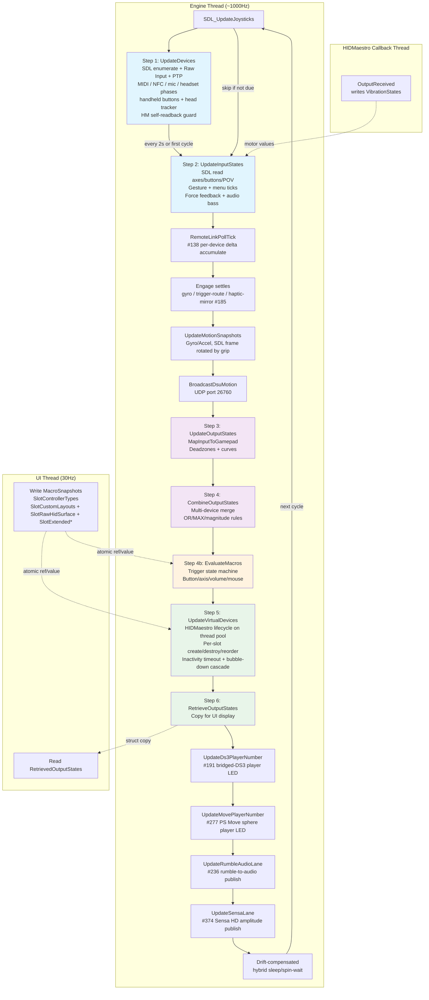

# Input Pipeline

*The six-step polling loop that runs at 1000 Hz and turns raw device input into virtual controller output.*

---

The input pipeline runs on a dedicated background thread at ~1000 Hz. It processes physical device input through six steps to produce virtual controller output.



The pipeline is a `partial class InputManager` split across twelve files:

| File | Step | Purpose |
|---|---|---|
| `InputManager.cs` | Main | Fields, Start/Stop, PollingLoop, trigger-route settle, motion snapshots, DSU broadcast |
| `InputManager.MenuRuntime.cs` | Steps 2–4b | Radial / touch menu runtime (#9): `MenuContexts` keyed (slot, device, menu), ticked in Step 2, fired items read by Step 3 rows and activators, direct bindings delivered in Step 4b |
| `InputManager.Step1.UpdateDevices.cs` | Step 1 | Device enumeration and lifecycle |
| `InputManager.Step1.UsbipVhciGuard.cs` | Step 1 | Composite-persona self-readback guard: walks the device path's PnP ancestry for HIDMaestro's stamped usbip-vhci host-controller hardware id, because a persona carries no other marker |
| `InputManager.Step2.UpdateInputStates.cs` | Step 2 | Input state reading and force feedback |
| `InputManager.Step3.UpdateOutputStates.cs` | Step 3 | Mapping engine (input -> Gamepad) |
| `InputManager.Step3.MappingSetEval.cs` | Step 3 | MappingSet evaluator (multi-source row resolve, combine modes, formula eval, shift-layer dispatch) |
| `InputManager.Step3.SteeringLockFeedback.cs` | Step 3 | Steering at-lock feedback (#94): AT-resistance ramp plus lock-entry lightbar / rumble / trigger-vibration pulses |
| `InputManager.Step4.CombineOutputStates.cs` | Step 4 | Multi-device merge per slot |
| `InputManager.Step4b.EvaluateMacros.cs` | Step 4b | Macro trigger/action state machine |
| `InputManager.Step5.VirtualDevices.cs` | Step 5 | Virtual controller output |
| `InputManager.Step6.RetrieveOutputStates.cs` | Step 6 | Copy output for UI display |

All files are in `PadForge.App/Common/Input/`.

## Contents

- [InputManager.cs. Main Class](#inputmanagercs-main-class)
- [Step 1: UpdateDevices](#step-1-updatedevices)
- [Step 2: UpdateInputStates](#step-2-updateinputstates)
- [Trigger Rumble Routing](#trigger-rumble-routing)
- [Step 3: UpdateOutputStates](#step-3-updateoutputstates)
- [Mouse Cursor as a Mapping Source](#mouse-cursor-as-a-mapping-source)
- [Shift Layer Activators and the Cycle Cursor](#shift-layer-activators-and-the-cycle-cursor)
- [Step 4: CombineOutputStates](#step-4-combineoutputstates)
- [Step 4b: EvaluateMacros](#step-4b-evaluatemacros)
- [Step 5: VirtualDevices](#step-5-virtualdevices)
- [Step 6: RetrieveOutputStates](#step-6-retrieveoutputstates)
- [Thread Safety Summary](#thread-safety-summary)
- [Data Flow Summary](#data-flow-summary)
- [Key Types Reference](#key-types-reference)

---

## InputManager.cs. Main Class

**Namespace:** `PadForge.Common.Input`

### Class Declaration

```csharp
public partial class InputManager : IDisposable
```

### Constants and Properties

| Member | Type | Default | Description |
|---|---|---|---|
| `PollingIntervalMs` | `int` (property) | `1` | Target polling interval (ms). Runtime-adjustable via Settings UI. |
| `EnumerationIntervalMs` | `const int` | `2000` | Device re-enumeration interval (ms) |
| `MaxPads` | `const int` | `16` | Maximum virtual controller slots |

### State Fields

| Field | Type | Description |
|---|---|---|
| `_pollingThread` | `Thread` | Background thread running PollingLoop (AboveNormal priority, IsBackground=true) |
| `_running` | `volatile bool` | Loop control flag. Set false by `Stop()` to terminate |
| `_idle` | `volatile bool` | When true, skips Steps 3–6 and sleeps at ~20 Hz. Step 2 still runs for Devices page preview. |
| `_sdlInitialized` | `bool` | Whether `SDL_Init` succeeded |
| `_disposed` | `bool` | Disposal guard |
| `_enumerationTimer` | `Stopwatch` | Time since last device enumeration |
| `_frequencyTimer` | `Stopwatch` | Time tracking for frequency measurement |
| `_frequencyCounter` | `int` | Cycle counter for frequency measurement |
| `_deviceSnapshotBuffer` | `UserDevice[]` | Pre-allocated buffer for Step 2 device snapshot (avoids LINQ/closure allocations). Grows dynamically. |
| `_settingSnapshotBuffer` | `UserSetting[]` | Pre-allocated buffer for Step 3 settings snapshot |
| `_padIndexBuffer` | `UserSetting[64]` | Pre-allocated buffer for `FindByPadIndex` lookups (Steps 2–5). Sized 64, deliberately not `MaxPads`: it holds one slot's mappings, and `FindByPadIndex` silently truncates at the buffer length, so a slot-count constant here capped a slot at 16 device mappings. Poll thread only. The async create-failure validation passes its own buffer. |
| `_instanceGuidBuffer` | `UserSetting[MaxPads]` | Pre-allocated buffer for `FindByInstanceGuid` lookups (Step 2 FFB) |

### Public State Arrays

| Property | Type | Written By | Read By | Description |
|---|---|---|---|---|
| `CombinedOutputStates` | `Gamepad[MaxPads]` | Step 4 (engine) | Step 5, Step 6, UI | Combined gamepad state per slot |
| `CombinedRawHidStates` | `RawHidState[MaxPads]` | Step 4 (engine) | Step 5 | Combined raw HID state for Extended / Nintendo raw-surface slots |
| `CombinedMidiRawStates` | `MidiRawState[MaxPads]` | Step 4 (engine) | Step 5 | Combined MIDI raw state |
| `CombinedKbmRawStates` | `KbmRawState[MaxPads]` | Step 4 (engine) | Step 5 | Combined KBM raw state |
| `CombinedVrRawStates` | `VrRawState[MaxPads]` | Step 4 (engine) | Step 5 | Combined VR hand-pair raw state for VR slots (#49) |
| `CombinedTouchpadStates` | `TouchpadState[MaxPads]` | Step 4 (engine) | Step 5 | Combined touchpad state for PlayStation slots |
| `SlotRawTouchpadClick` | `bool[MaxPads]` | Step 3 (engine) | InputReactive lightbar | Raw physical touchpad click OR'd across the slot's devices, independent of VC type and click mapping |
| `RetrievedOutputStates` | `Gamepad[MaxPads]` | Step 6 (engine) | UI timer | Copy of combined states for UI display |
| `RetrievedKbmRawStates` | `KbmRawState[MaxPads]` | Step 6 (engine) | UI timer | Copy of KBM raw states for UI preview |
| `VibrationStates` | `Vibration[MaxPads]` | HIDMaestro callback thread | Step 2 (engine) | Per-slot rumble from games. **Cross-thread**: `HMController.OutputReceived` (via `IVirtualController.RegisterFeedbackCallback`) writes, engine reads. |
| `MotionSnapshots` | `MotionSnapshot[MaxPads]` | Engine (polling loop) | DSU broadcast | Per-slot motion sensor data for Cemuhook |
| `MacroSnapshots` | `MacroItem[][MaxPads]` | UI timer (30 Hz) | Step 4b (engine) | Per-slot macro definitions. **Cross-thread**: atomic reference swap. |
| `TestRumbleTargetGuid` | `Guid[MaxPads]` | UI | Step 2 | When non-empty, restricts test rumble to one device GUID in the slot |
| `CurrentFrequency` | `double` | Engine | UI | Measured polling frequency (Hz). Updated ~once/second. |
| `IsRunning` | `bool` | Engine | UI | Whether the polling loop is active |
| `IsIdle` | `bool` | UI (InputService) | Engine | When true, skips Steps 3–6 and runs at ~20 Hz. Set when no VC slots exist. |
| `DsuServer` | `DsuMotionServer` | InputService | Engine | DSU motion server. When set, broadcasts motion data after Step 2. |
| `AudioBassDetector` | `AudioBassDetector` | InputService | Engine | Audio bass detector. When set, bass energy is combined with game rumble via `max()`. |

### Events

```csharp
public event EventHandler DevicesUpdated;
public event EventHandler FrequencyUpdated;
public event EventHandler<InputExceptionEventArgs> ErrorOccurred;
```

| Event | Thread | Description |
|---|---|---|
| `DevicesUpdated` | Engine thread | Fired on device connect/disconnect. UI must marshal to dispatcher. |
| `FrequencyUpdated` | Engine thread | Fired ~once per second with updated `CurrentFrequency` |
| `ErrorOccurred` | Engine thread | Non-fatal polling errors. Handlers receive message + exception. |

### Constructor

```csharp
public InputManager()
```

Initializes `VibrationStates[]`, `FinalVibrationStates[]`, and `SelectedDeviceVibrationStates[]` with a `new Vibration()` per slot.

### SDL Initialization

```csharp
private bool InitializeSdl()
```

Sets SDL hints, then calls `SDL_Init` with flags:

```csharp
SDL_INIT_JOYSTICK | SDL_INIT_GAMEPAD | SDL_INIT_VIDEO | SDL_INIT_HAPTIC
```

Key hints (not exhaustive):
- `SDL_HINT_JOYSTICK_ALLOW_BACKGROUND_EVENTS = "1"`. Receive input without window focus
- `SDL_HINT_JOYSTICK_XINPUT = "1"`. Enable Xbox controller enumeration via XInput backend
- `SDL_HINT_JOYSTICK_HIDAPI_SWITCH2 = "1"`. Enable Switch 2 Pro Controller HIDAPI driver
- `SDL_HINT_JOYSTICK_HIDAPI_WII = "1"`. Enable the Wii Remote / Nunchuk / Classic / Wii U Pro HIDAPI driver (#116). Relies on the fork's `HidD_SetOutputReport` fix
- `SDL_HINT_JOYSTICK_BLE_SWITCH2 = "1"`. Enable the fork's Bluetooth-LE Switch 2 driver (Pro Controller 2, Joy-Con 2 L/R, NSO GameCube), which speak BLE GATT, not HID-over-Bluetooth
- `SDL_HINT_JOYSTICK_BLE_SWITCH2_MOUSE = "1"`. Post Joy-Con 2 optical-mouse 16-bit counters on joystick axes 6/7 (#154)
- `SDL_HINT_JOYSTICK_HIDAPI_SWITCH_SHAPED_RUMBLE = "1"`. The fork's frequency-shaped classic Switch rumble (#271 item 4). Each motor's intensity also sweeps its frequency band (low motor roughly 41-160 Hz, high 160-320 Hz) with attack and decay transients. Classic LRA packet only, Switch 2 encoding untouched
- `SDL_HINT_JOYSTICK_BLE_SWITCH2_MAGNETOMETER = "1"`. The fork's Switch 2 BLE magnetometer channel: three raw int16 axes after the mouse counters, availability signalled by the raw axis count (9 = magnetometer, 11 = mouse plus magnetometer). PadForge does not consume them yet
- `SDL_HINT_HIDAPI_IGNORE_DEVICES = InputManager.HidapiIgnoreDevices` (`"0x146b/0x0603"`). Keeps SDL's hidapi layer from probing the Nacon PS4 Compact, whose HID interface wedges the Sony third-party detection FEATURE report forever on Windows and freezes the enumerating thread (#235). Ignored pads ride the XInput / DirectInput lanes instead
- `SDL_HINT_JOYSTICK_HIDAPI_JOYCON_IR_SENSOR` is **not** set at init. The right Joy-Con's NIR camera and its NFC reader share one MCU (camera = mode 5, NFC = mode 4), so an always-on hint silently killed standalone right Joy-Con NFC. `InputService.RefreshSwitchMcuArming` sets it only while an "IR Brightness" input is actually configured (#151, #248)
- `SDL_HINT_JOYSTICK_HIDAPI_PS3_SIXAXIS_DRIVER = "1"`. Claim a DS3 running DsHidMini SixaxisCompatible mode for motion, pressure axes, and accel/gyro (#194). Do **not** also set `SDL_HINT_JOYSTICK_HIDAPI_PS3`
- `SDL_HINT_VIDEO_ALLOW_SCREENSAVER = "1"`. Do not block screensaver
- **Never** set `SDL_HINT_JOYSTICK_RAWINPUT`. Conflicts with XInput enumeration and hides Xbox controllers

Post-init:
1. Calls `LoadEmbeddedGamepadMappings()`. Reads the `gamecontrollerdb_padforge.txt` resource embedded in the single-file exe and applies each non-comment line via `SDL_AddGamepadMapping`. The file-path overload (`SDL_AddGamepadMappingsFromFile`) is unusable when the file ships inside the exe rather than as a loose file next to it. `EmbeddedMappingsLoaded` records the applied count for the About / Settings diagnostic
2. Calls `SDL_EnableScreenSaver()`. SDL_INIT_VIDEO disables the screensaver by default
3. Calls `SetThreadExecutionState(ES_CONTINUOUS)`. Clears execution-state flags so the PC can sleep
4. Starts the side-band device services, each of which surfaces its hardware as a virtual joystick to the normal pipeline. Every one is wrapped in its own try/catch, so a failure logs and leaves the rest running:
   - `Ds3DirectService` (Bluetooth DS3 behind BthPS3, no DsHidMini)
   - A second `Ds3DirectService` with `navigation: true`. The PlayStation Navigation controller is a half sixaxis on the same BthPS3 stack (#277)
   - `PsMoveDirectService`. The Move motion controller's own protocol lane, ZCM1 (49-byte report) and ZCM2 (44-byte) (#277). It also supplies `SdlDeviceWrapper.ExternalPowerInfoProvider` and `ExternalDevicePathProvider` alongside `Ds3DirectService`, because SDL has no power or path channel for virtual joysticks
   - `SpaceMouseService`. 3Dconnexion 6DoF pucks, HID usage 0x08 Multi-axis Controller, invisible to SDL's raw-input backend (#288)
   - `OpenVrConsumerService`. Headset pose and tracked controllers through a background OpenVR client, a 5 s registry-file poll until SteamVR exists and runs, and it never launches SteamVR itself (#287)

**Error handling:** Catches `DllNotFoundException` (SDL3.dll missing) and generic exceptions. Raises `ErrorOccurred` but does not throw. `Start()` checks the return value and aborts on failure.

```csharp
private void ShutdownSdl()
```

Calls `SDL_Quit()`. Called by `Dispose()`.

### Start / Stop

```csharp
public void Start()
```

1. Guards against double-start (`_running`) or disposed state
2. Calls `InitializeSdl()`. Aborts on failure
3. Calls `RawInputListener.Start()`. Starts hidden message-only window for keyboard/mouse enumeration
4. Calls `_ptpReader.Start()`. Precision-touchpad reader, always on so the Devices page can preview touchpad input
5. Creates and starts the polling thread (`PollingLoop`, AboveNormal)
6. Creates and starts the mouse-injector thread (`MouseInjectorLoop`, AboveNormal). It batches macro mouse-move `SendInput` off the 1000 Hz poll thread, because injected movement runs synchronously through every low-level mouse hook and a per-poll call would collapse the poll rate to ~200 Hz

**Thread safety:** Safe to call from any thread. Subsequent calls are no-ops.

```csharp
public void Stop()
```

1. Sets `_running = false`
2. Calls `SoundMacroService.StopAll()`. Releases the macro-sound WASAPI clients
3. Calls `WiiSpeakerService.Shutdown()` and `HapticToneService.Shutdown()`. Both streams die with the engine, not with a profile apply, because their suppression latch clears only in `EnsureStarted` at engine start
4. Calls `RumbleAudioService.SilenceAll()` then `StopAll()`. Engine stop is an explicit #236 silence edge, and the renderer dies here rather than inside `SoundMacroService.StopAll`, which also runs on every profile apply and would otherwise silence the shakers on every profile switch
5. Joins the polling thread with a 3-second timeout
6. Signals `MouseWorkSignal` to unpark an idle injector, then joins the mouse-injector thread with a 1-second timeout
7. Stops `RawInputListener`
8. Stops and disposes `_ptpReader`
9. Calls `StopAllForceFeedback()`. Best-effort stop on all devices
10. Calls `AwaitPendingLifecycleTasks()`. Waits (bounded, 30 s) for in-flight HM connect/dispose tasks so a late connect can't orphan a controller in the kernel device tree
11. Calls `DestroyAllVirtualControllers()`. Disconnects and disposes all VCs
12. Clears every `_slotInitializing` flag so post-stop reads return false
13. Calls `DisposeHMaestroContextOnShutdown()`. Tears down the shared `HMContext`
14. Calls `CloseAllDevices()`. Disposes all SDL handles and clears runtime state
15. Stops the enumeration and frequency stopwatches and zeroes `CurrentFrequency`

In v3 HIDMaestro takes a parameter-free `Disconnect()`. The v2 vJoy "preserve nodes" path is gone. HM creates and destroys virtual devices dynamically without leaving stale joy.cpl entries behind.

### Main Polling Loop

```csharp
private void PollingLoop()
```

Background thread entry point. Sets `timeBeginPeriod(1)` for the loop duration (restored via `timeEndPeriod(1)` in `finally`).

**Per-cycle execution order:**

```
SDL_UpdateJoysticks()         -- pump SDL event queue
  |
  v
SourceCoercion.BeginPollFrame() -- advance the evaluator poll-frame gate once
  |
  v (every 2 seconds, or first cycle)
Step 1: UpdateDevices()       -- enumerate, open/close devices
  |
  v
Step 2: UpdateInputStates()   -- read axes/buttons/POV from SDL, apply FFB
  |
  v
RemoteLinkPollTick?.Invoke()  -- fold this poll's fresh snapshots into the #138 per-device delta accumulators
  |
  v
UpdateGyroEngageStates()      -- settle per-slot gyro engage bits
UpdateTriggerRouteEngageStates() -- settle per-slot trigger-route engage bits
UpdateHapticMirrorEngageStates() -- settle per-slot haptic-mirror engage bits (#185)
  |
  v
UpdateMotionSnapshots()       -- capture gyro/accel for DSU
BroadcastDsuMotion()          -- send to Cemuhook clients via UDP
  |
  v
Step 3: UpdateOutputStates()  -- map CustomInputState to Gamepad via PadSetting rules
  |
  v
Step 4: CombineOutputStates() -- merge multiple devices per slot
  |
  v
Step 4b: EvaluateMacros()     -- trigger/action state machine, inject into Gamepad
  |
  v
Step 5: UpdateVirtualDevices()-- create/destroy VCs, submit reports
  |
  v
Step 6: RetrieveOutputStates()-- copy combined output for UI consumption
  |
  v
UpdateDs3PlayerNumber()       -- rate-limited player-LED refresh for the bridged Bluetooth DS3 (#191)
  |
  v
UpdateMovePlayerNumber()      -- same 500 ms cadence for the bridged PS Move sphere's player color (#277)
  |
  v
UpdateRumbleAudioLane()       -- publish per-slot rumble-to-audio packs (#236), after Step 5 so a
  |                              slot destroyed this tick publishes zeros the same tick
  v
UpdateSensaLane()             -- publish the max feedback voice across all slots, 0..1,
  |                              for the Sensa HD haptics worker (#374)
  v
Frequency measurement (~1/second)
  |
  v
Drift-compensated hybrid sleep/spin-wait
```

**Poll-frame gate:**

`SourceCoercion.BeginPollFrame()` (`SourceCoercion.cs` line 652) is called once per cycle, right after `SDL_UpdateJoysticks()` and before Step 1 (`InputManager.cs` line 1573). It increments a shared `_pollFrameSeq` counter that gates every state-carrying evaluator cache in `SourceCoercion`: the dual-threshold gyro smoothing ring, the legacy gyro EMA, the IR pointer EMA, the trackball momentum state, and the touchpad relative-delta trackers. Each cache compares its stored sequence against `_pollFrameSeq` and re-serves the frame's value on repeat reads, so it advances once per poll no matter how many mapping rows read the same source. Without the gate, two gyro rows would halve the smoothing window the Gyro tab promises, and a second relative-touchpad row would consume the first one's delta. The counter and the caches it gates are polling-thread only.

**3-Tier Polling Sleep Strategy:**

The polling loop uses a tiered sleep strategy, falling through to the next tier if the preferred timer is unavailable:

| Tier | Mechanism | Availability | CPU Cost |
|---|---|---|---|
| **Tier 1** | High-Resolution Waitable Timer | Windows 10 1803+ | Near-zero (kernel sleep) |
| **Tier 2** | Multimedia Timer + ManualResetEvent | All Windows | Near-zero (event wait) |
| **Tier 3** | Thread.Sleep(1) + SpinWait | All Windows | ~1–3% of one core |

**Tier 1: High-Resolution Waitable Timer**. `CreateWaitableTimerExW` with `CREATE_WAITABLE_TIMER_HIGH_RESOLUTION` (0x00000002). Sleeps at sub-ms granularity via the kernel scheduler without busy-waiting. The timer is set as a negative relative due time (100 ns intervals) via `SetWaitableTimerEx`, then the thread blocks on `WaitForSingleObject`. Leaves a 0.1 ms (`spinThresholdTicks`) gap before the target to spin-finish.

**Tier 2: Multimedia Timer Fallback**. `timeSetEvent` creates a periodic callback that signals a `ManualResetEvent`. The thread blocks on `WaitOne(50)` until the callback fires. This is the x360ce-style approach. Precision is ~1–2 ms with `timeBeginPeriod(1)`. The callback delegate is prevented from GC via `GC.KeepAlive(mmTimerCb)` in `finally`.

**Tier 3: Thread.Sleep(1) + SpinWait**. Legacy fallback when both timers fail. `Thread.Sleep(1)` absorbs bulk wait when >1.5 ms remains (`sleepThresholdTicks`).

All three tiers finish with a spin-wait loop for the final sub-ms portion:

```csharp
while (cycleTimer.ElapsedTicks < adjustedTarget)
    Thread.SpinWait(1);
```

**Wall-clock drift compensation:**

Instead of per-cycle overshoot tracking, the loop compares cumulative expected time against a wall-clock `Stopwatch`:

```csharp
expectedTicks += targetTicks;
long drift = wallClock.ElapsedTicks - expectedTicks;
long adjustedTarget = targetTicks - drift;
```

If behind (positive drift), future cycles shorten. If ahead (negative drift), they lengthen. This converges the long-term average rate to the target Hz.

Safety mechanisms:
- If drift exceeds 10x the target interval (e.g., after sleep/resume), the wall clock resets instead of sprinting to catch up
- `adjustedTarget` floors at `targetTicks / 4` to prevent negative or near-zero waits

**Idle mode:**

When no VC slots exist (`IsIdle == true`), the loop enters low-power mode:
- Calls `RumbleAudioService.SilenceAll()` every iteration. The #236 feedback lane does not run in idle, so idle entry is an explicit silence edge and every iteration republishes it
- Pumps `SDL_UpdateJoysticks()`
- Runs `UpdateDevices()` every 5 seconds (instead of 2) so new controllers still appear on the Devices page
- Runs `UpdateInputStates()` for Devices page raw input preview
- Fires `RemoteLinkPollTick?.Invoke()` so shared devices keep streaming their #138 delta accumulation while no slot is active on this end
- Runs `EvaluateGlobalMacros()` so profile shortcuts still work from an empty profile
- Calls `ReleaseAllLatchedMacroKeys()`. The slot macro evaluator's latched-key reconcile does not run in idle, so any `ToggleKey` latch is released rather than left stuck down. Latch bits stay set on the actions and re-assert when the pipeline wakes
- Skips Steps 3–6
- Sleeps at ~20 Hz (`Thread.Sleep(50)`)
- Reports `CurrentFrequency = 0`
- On transition back to active: sets `firstCycle = true` for immediate enumeration, resets drift state to prevent burst cycles

**Focus suspend:**

The engine half of the "continue polling when window loses focus" setting. When `SuspendWhenBackground` is set (the user unchecked the box) and the host window is not foreground, the loop suspends instead of polling: on the entry edge it zeros every combined surface (`NeutralizeCombinedOutputs`), submits once, and releases latched macro keys, so the game left behind is not stuck holding whatever was pressed when focus moved. Each suspended iteration republishes the #236 silence edge and still runs `UpdateVirtualDevices()` at the loop's ~10 Hz so create/dispose gates and both watchdogs keep advancing on neutral state. Suspension stops the engine driving inputs. It does not stop the lifecycle machinery. Distinct from `_idle`, which engages when nothing is active. Focus suspend engages because things are active and the user wants them off while away.

**Sleep guard:** Every 5 seconds, calls `SetThreadExecutionState(ES_CONTINUOUS)` to clear execution-state flags SDL may re-assert, so the PC can still sleep.

### Slot Reorder

Pad indices are data identity. A slot's mappings, profile, devices, and settings live at its pad index and never move. Visual position is the kernel-slot anchor: in an HM-backed group the VC at visual position V holds kernel slot V. There is no per-slot data-array shuffle. Nothing in `InputManager` swaps `SlotControllerTypes[]`, `VibrationStates[]`, or the `Combined*States` arrays between pad indices, and there is no `SwapSlots` / `SwapSlotData` method on `InputManager`.

The UI-facing reorder verbs live on `InputService`: `SwapSlots(int, int)` (`InputService.cs` line 17045), `MoveSlot(int, int)` (line 17078), and `MoveSlotToGroupTail(int)` (line 17125). Each mutates `SettingsManager.SlotOrders` for the new visual order, then routes through `InputService.RebuildKernelOrderAfterReorder` to the sole `InputManager` reorder entry point:

```csharp
public void RerouteVirtualControllersForReorder(
    VirtualControllerType groupType, IReadOnlyList<int> oldOrder, IReadOnlyList<int> newOrder)
```

`InputManager.Step5.VirtualDevices.cs` line 2642. Intra-group only, and only for the four HM-backed groups (Xbox / PlayStation / Nintendo / Extended). It early-returns for any other group and for null or length-mismatched orders. For each visual position V it decides per position:

- **Same profile at V**: reuse the kernel VC in place. The pad-index pointer in `_virtualControllers[]` moves so the new pad-at-position-V feeds V's kernel slot, and `FeedbackPadIndex` is updated on the surviving VC so the rumble callback writes the right `VibrationStates[]` entry. No teardown.
- **Different profile at V**: destroy the old VC via the regular async-dispose path. Pass 2's visual-order gate plus `ApplyAscendingIndexPreemption` recreate it with the new pad's profile at the lowest free kernel slot, which is V because every surviving VC at positions below V keeps its slot.

Same-profile cycles collapse to a pure pointer rotation across `_virtualControllers[]` with zero kernel teardown. Cross-group moves go through `MoveSlotToGroupTail` and fall back to Pass 1 destroy / Pass 2 recreate. See [Services Layer#slot-reordering](services-layer.md#slot-reordering).

### Motion Snapshots

```csharp
private void UpdateMotionSnapshots()
```

Called after Step 2 (`InputManager.cs` line 1596). Iterates all 16 pad slots. A slot with `!SlotCreated` clears any stale snapshot and skips. The same walk also runs the per-slot battery scan (first-online-with-data reading into `BatteryPercents` / `BatteryCharging`, plus an all-device change signature that kicks the Battery lightbar repaint), independent of motion.

**Source resolution.** The gyro channel and the accel channel resolve **separately** from the slot's `MappingSet` rows. `ResolveMotionSource` (`InputManager.cs` ~3000) walks the rows for a target name and returns the first source whose owning device is online and, for gyro, has gyro capability:

```csharp
var gyroSrc  = ResolveMotionSource(ms, MappingSetMigrator.MotionGyroTarget,  requireGyro: true,  padIndex);
var accelSrc = ResolveMotionSource(ms, MappingSetMigrator.MotionAccelTarget, requireGyro: false, padIndex);
```

The two sub-channels can land on different devices. A 250 ms row-presence gate caches whether the slot's `MappingSet` has any motion rows at all, so slots without them skip both per-tick row walks (a set-reference change re-scans immediately). Motion rows exist only on motion-capable slot families: `MappingSetMigrator.EnsureMotionRows` (`MappingSetMigrator.cs` ~667) backfills them on load and on device assignment for **PlayStation and Nintendo** slots (the virtual Switch Pro gained a real IMU surface in HIDMaestro v1.3.18). Other slot types have no motion rows, so both resolves return null and the snapshot is written `HasMotion = false`. The pre-v3.2.3 "first online device with sensors" walk is retired: the source now follows the mapping rows, and the per-tick walk hands off cleanly as devices come and go. A `"Motion Accel L"` source reads the aux (Nunchuk / left Joy-Con) accelerometer via `s.AccelAux` instead of the body IMU (#199 follow-up). A `"Motion Gyro L"` source does the same for the gyro channel (#252): `MappingSetMigrator.IsMotionGyroAuxDescriptor` flips a `gyroAux` flag, the read comes from `s.GyroAux`, and the flag is passed through to `GetPassthroughGyro` so the aux IMU gets its own tuning state.

**Delivery.** The DSU server reads `MotionSnapshots` after Step 2 (below). Step 5 additionally delivers `MotionSnapshots[padIndex]` to HIDMaestro through `SubmitRawHidState`'s IMU channel on Nintendo / Extended raw-surface slots, and through the extended `SubmitGamepadState` overload on PlayStation slots. `HasMotion = false` submits zeroes.

**No sign transform, one grip rotation.** The native SDL sensor frame is preserved apart from the (device, slot) grip. Accel is a raw scaled read, then rotated for the grip. Gyro passes through the per-(device, slot) Gyro tab tuning chain, which applies the same rotation inside its calibrated read:

```csharp
// Accel. MsToG = 1/9.80665, no negation:
ax = accel[0] * MsToG;   ay = accel[1] * MsToG;   az = accel[2] * MsToG;
// Grip (#392), body accelerometer only. The aux (Nunchuk / left Joy-Con)
// sensor is a separate body in the other hand and keeps its own frame:
if (!accelAux)
    SourceCoercion.ApplyMotionGrip(guid, padIndex, ref ax, ref ay, ref az);

// Gyro. GetPassthroughGyro applies bias / deadzone / sensitivity /
// smoothing / invert / grip, then RadToDeg = 180/PI, no negation:
SourceCoercion.GetPassthroughGyro(s, guid, padIndex,
    out float tunedPitch, out float tunedYaw, out float tunedRoll, gyroAux);
gx = tunedPitch * RadToDeg;   gy = tunedYaw * RadToDeg;   gz = tunedRoll * RadToDeg;
```

**Grip rotation (#392).** `SourceCoercion.RotateForGrip` (`SourceCoercion.cs` line 3489) turns a body-frame vector into the frame the game expects for the hold the user picked on the Gyro tab. The driver delivers every controller in the frame of its natural hold, a Wii Remote aimed at the screen, +X right, +Y out of the face, +Z toward the player. Three other holds have tables, all proper rotations, so the same one serves gyro, accelerometer, and the gravity estimate alike:

| Grip | Hold | `(x, y, z)` becomes |
|---|---|---|
| `Sideways` | quarter turn about the vertical, top edge left, face up | `(z, y, -x)` |
| `WiiWheel` | top edge left and the face turned toward the player | `(z, x, y)` |
| `Upright` | top edge pointed up | `(x, -z, y)` |

An unknown or empty grip is the identity. `ApplyMotionGrip` (line 3544) is the in-place wrapper the snapshot builder and the Gyro tab readout call. The rotation applies to the body sensor only. `GripAxis` (line 3504) is the per-axis form, which lets a single-axis read debias its source axis before applying the sign. The hat turns with the hold too: see [D-Pad from POV](#d-pad-from-pov).

A per-row `Invert` on the mapping source flips all three axes of its channel uniformly, stacking on top of the Gyro tab's own invert (both set = no net flip). The DSU and Sony coordinate-frame flips are applied downstream in `DsuMotionServer.BuildPadDataPacket` and the Sony report packers, not here.

Timestamp: microseconds, computed as `(long)(GetTimestamp() * (1_000_000.0 / Stopwatch.Frequency))`. The multiply runs in `double` because `GetTimestamp() * 1_000_000` overflows `Int64` once the machine has been up long enough (~10 days at a 10 MHz QPC).

```csharp
private void BroadcastDsuMotion()
```

Iterates all 16 slots and calls `DsuServer.BroadcastMotion(padIndex, snapshot, isConnected)`. The DSU server may be null (no-op).

### IDisposable

```csharp
public void Dispose()
```

Calls `Stop()` then `ShutdownSdl()`. The finalizer calls `Dispose()` as a safety net. The normal path calls `GC.SuppressFinalize`.

### Win32 P/Invoke

```csharp
// Timer resolution
[DllImport("winmm.dll")]
private static extern uint timeBeginPeriod(uint uPeriod);

[DllImport("winmm.dll")]
private static extern uint timeEndPeriod(uint uPeriod);

// Multimedia timer (Tier 2 fallback)
private delegate void TimerCallback(uint uTimerID, uint uMsg,
    IntPtr dwUser, IntPtr dw1, IntPtr dw2);

[DllImport("winmm.dll")]
private static extern uint timeSetEvent(uint uDelay, uint uResolution,
    TimerCallback lpTimeProc, IntPtr dwUser, uint fuEvent);

[DllImport("winmm.dll")]
private static extern uint timeKillEvent(uint uTimerID);

// High-resolution waitable timer (Tier 1)
[DllImport("kernel32.dll")]
private static extern IntPtr CreateWaitableTimerExW(
    IntPtr lpTimerAttributes, IntPtr lpTimerName, uint dwFlags, uint dwDesiredAccess);

[DllImport("kernel32.dll")]
private static extern bool SetWaitableTimerEx(
    IntPtr hTimer, ref long lpDueTime, int lPeriod,
    IntPtr pfnCompletionRoutine, IntPtr lpArgToCompletionRoutine,
    IntPtr WakeContext, uint TolerableDelay);

[DllImport("kernel32.dll")]
private static extern uint WaitForSingleObject(IntPtr hHandle, uint dwMilliseconds);

[DllImport("kernel32.dll")]
private static extern bool CloseHandle(IntPtr hObject);

// Power management
[DllImport("kernel32.dll")]
private static extern uint SetThreadExecutionState(uint esFlags);
```

---

## Step 1: UpdateDevices

**File:** `InputManager.Step1.UpdateDevices.cs`

Enumerates connected devices at 2-second intervals (5-second in idle mode). Opens new devices, marks disconnected ones offline, and fires `DevicesUpdated` on changes. It runs eleven phases in order (`InputManager.Step1.UpdateDevices.cs` lines 115-426):

| Phase | Source |
|---|---|
| 1 | SDL joysticks and gamepads |
| 1b | Raw Input keyboards |
| 1c | Raw Input mice |
| 1d | Precision touchpads, per hardware device |
| 1e | Windows MIDI Services input endpoints (#128) |
| 1f | NFC PC/SC readers (#150) |
| 1f2 | Standalone Windows capture endpoints, the voice-macro microphones (#317) |
| 1g | Sony headset head trackers (#188) |
| 1h | Handheld PC hidden buttons plus the system motion sensor (#343) |
| 1i | Head tracker, OpenTrack UDP and FreeTrack shared memory (#355) |
| 2 (and 2b, 2c) | Disconnect detection for each of the above |

Raw Input Consumer Control HID collections (#168) ride the same background pass as keyboards and mice and are consumed alongside them in phases 1b/1c.

Phases 1e through 1i share one shape: an `_opened*` dictionary or field keyed by the source's stable id, an open that runs through `FindOrCreateUserDevice` then `LoadFromExternalDevice` then `IsOnline = true`, a vanished-entry sweep that marks offline and neutralizes mapped outputs, and a `Shutdown*` method that suppresses the phase for the rest of the session. The shared `NfcReaderService` monitor is a separate object with its own lifecycle (started lazily from phase 1f, retried about every 5 s while the Smart Card service is absent), but each visible reader still becomes an `NfcReaderDevice` registered here like any other source.

Phases 1g, 1h, and 1i split their work by cost. Blocking I/O (feature-report qualification, vendor HID enumeration, the sensor-stack probe) runs on a worker. The poll thread only registers what the worker finished and retires what vanished. Phase 1i is the exception: a UDP bind and a file mapping do not block, so the poll thread runs that whole lifecycle itself.

### Method Signature

```csharp
private void UpdateDevices()
```

**Called by:** `PollingLoop()` (every 2 seconds or on first cycle)

**Thread safety:** Runs on the engine thread only. Collection modifications use `UserDevices.SyncRoot` locking. `DevicesUpdated` fires on the engine thread. UI consumers must marshal to the dispatcher.

**Error handling:** Each device open is try/catch-guarded. A single failure does not abort enumeration. The error is reported via `RaiseError` and the next device is processed.

### Tracking Fields

| Field | Type | Description |
|---|---|---|
| `_openedSdlInstanceIds` | `Dictionary<uint, SdlDeviceWrapper>` | SDL instance IDs of currently opened joysticks, skipped during enumeration. It holds the wrapper rather than the id alone, so the disconnect sweep can dispose an orphan whose `UserDevice` no longer points at it (a UI Remove, or a replug rebind that swapped `ud.Device`) instead of leaving SDL handles to a finalizer racing the poll loop |
| `_suppressedSelfVirtualIds` | `HashSet<uint>` | Instance IDs the self-readback guard rejected as PadForge's own HM virtuals. Kept so each pass skips them rather than reopening and re-probing every 2 s |
| `_sdlDisconnectCandidateSince` | `Dictionary<uint, DateTime>` | First tick each instance ID looked gone. Phase 2's debounce clock |
| `_openedKeyboardHandles` | `HashSet<IntPtr>` | Raw Input handles for tracked keyboards |
| `_openedMouseHandles` | `HashSet<IntPtr>` | Raw Input handles for tracked mice |
| `_openedConsumerHandles` | `HashSet<IntPtr>` | Raw Input handles for tracked Consumer Control collections (#168) |
| `_rawInputEnumPending` | `volatile bool` | True when a background enumeration task has been dispatched |
| `_rawInputEnumRunning` | `bool` | True while the background task is actively enumerating |
| `_cachedKeyboards` | `RawInputListener.DeviceInfo[]` | Cached keyboard enumeration results from the background thread |
| `_cachedMice` | `RawInputListener.DeviceInfo[]` | Cached mouse enumeration results from the background thread |
| `_cachedConsumerControls` | `RawInputListener.DeviceInfo[]` | Cached Consumer Control enumeration results from the background thread |
| `_rawInputCacheLock` | `object` | Lock protecting `_cachedKeyboards`, `_cachedMice`, and `_cachedConsumerControls` reads/writes |
| `_handheldDevice` | `volatile HandheldButtonsDevice` | The machine's hidden-buttons row while the feature is on (#343) |
| `_systemMotionDevice` / `_systemMotionPending` | `volatile SystemMotionDevice` | The handheld's built-in sensor row, and the worker's finished open waiting for the poll thread to register it |
| `_handheldLock` | `object` | Guards both handheld rows against the worker sweep |
| `_handheldNextSweepTicks` | `long` | Next due time for the 4 s worker sweep (`_handheldSweepIntervalMs`) |
| `_headTrackerDevice` | `volatile HeadTrackerDevice` | The head tracker row while the Dashboard toggle is on (#355) |
| `_headTrackerLock` | `object` | Guards the head tracker row's open / retire |

### Algorithm

**Phase 1: Open newly connected joystick devices**

```csharp
uint[] joystickIds = SDL_GetJoysticks();  // SDL3 API: returns array of instance IDs
var currentInstanceIds = new HashSet<uint>(joystickIds);
```

For each SDL instance ID:
1. Skip if in `_openedSdlInstanceIds` (already open)
2. Create `SdlDeviceWrapper` and call `wrapper.Open(instanceId)`. Opens as gamepad if recognized, joystick otherwise
3. `FindOrCreateUserDevice(wrapper.InstanceGuid, wrapper.ProductGuid)`. Find existing or create new
4. `ud.LoadFromSdlDevice(wrapper)`. Populate capabilities, name, VID/PID
5. Mark `ud.IsOnline = true`
6. Track in `_openedSdlInstanceIds`

HIDMaestro virtual controllers never reach this loop: PadForge's SDL3 fork filters them out of `SDL_GetJoysticks` by walking each device's PnP parent chain for `HIDMAESTRO` in the Hardware ID list. See [SDL3 Integration](sdl3-integration.md) for the fork-side patch.

**Phase 1b: Enumerate keyboards** via `EnumerateKeyboards()`

Uses `RawInputListener.EnumerateKeyboards()` to get device info. For each new handle not in `_openedKeyboardHandles`:
1. Create `SdlKeyboardWrapper`, call `Open(kb)`
2. `FindOrCreateUserDevice(wrapper.InstanceGuid)`, load and mark online
3. Prunes orphaned handles (device removed via UI while still connected)

> **Async enumeration:** Raw Input enumeration (`CreateFile` + `HidD_GetAttributes` + registry reads per device) is expensive and caused polling dips as low as ~60 Hz on systems with many HID devices. The first cycle runs synchronously to ensure devices are ready for Step 2. Subsequent cycles dispatch enumeration to a background `Task.Run` thread via `_rawInputEnumPending`/`_rawInputEnumRunning` flags. The polling thread consumes cached results from `_cachedKeyboards`, `_cachedMice`, and `_cachedConsumerControls`, protected by `_rawInputCacheLock`. This keeps the effective polling rate at a stable 1000 Hz regardless of HID device count.

**Phase 1c: Enumerate mice** via `EnumerateMice()`

Same pattern as keyboards using `SdlMouseWrapper`.

**Enumerate Consumer Controls** via `EnumerateConsumerControls()`

Consumer Control HID collections (media / browser keys, issue #168) enumerate on the same background Raw Input pass as keyboards and mice, cached in `_cachedConsumerControls` and consumed in `UpdateDevices` (`InputManager.Step1.UpdateDevices.cs` line 238, line 241). `EnumerateConsumerControls` (~1180-1218) mirrors `EnumerateKeyboards`: for each new handle not in `_openedConsumerHandles`, it opens a `ConsumerControlWrapper`, runs `FindOrCreateUserDevice`, calls `ud.LoadFromConsumerDevice(wrapper)`, and marks the device online. `DetectDisconnectedHandles(_openedConsumerHandles, ...)` marks removed collections offline.

`FindOnlineDeviceByHandle` (line 2834) resolves a Raw Input handle back to its `UserDevice` by testing `RawInputHandle` on each raw-input wrapper kind. `ConsumerControlWrapper` was missing from that list, so `PruneOrphanedHandles` found no online record for any consumer handle, dropped every one, and the lane re-opened them on the same pass: three device flips every five seconds on an idle bench, each raising `DevicesUpdated` and a full hiding apply. The wrapper is in the list now, and the DEVCHG trace line that named the flap stays in the prune path.

**Phase 1e: Enumerate MIDI inputs** via `UpdateMidiInputDevices()`

Windows MIDI Services endpoints become input devices. Enumeration is async (the WinRT device query is expensive and is kept off the poll loop) and gated on Windows MIDI Services being present. Each endpoint becomes a `MidiInputDevice` and runs through `FindOrCreateUserDevice`, `LoadFromExternalDevice`, and `IsOnline = true`, the same as any other source. The device exposes no gamepad axes or buttons. Its mappable surface is the MIDI namespace in `CustomInputState.Midi`. See [MIDI Input Internals](midi-input-internals.md).

**Phase 1h: Handheld PC hidden buttons and system motion** via `UpdateHandheldDevices()`

Two rows, both gated on the Settings toggle (`HandheldButtonRegistry.FeatureEnabled`). Off with nothing to retire, the phase is two volatile reads and a return, so a machine that never uses it pays nothing. Turning the toggle off retires the rows and calls `HandheldChordRuntime.Stop()` outside the lock, because Stop takes the runtime's own lock and joins its worker, and the poll thread must not carry that.

The button row is a `HandheldButtonsDevice`, a synthetic `ISdlInputDevice` whose buttons are the entries of `HandheldButtonRegistry`, each at its stable index. It opens with no I/O, so the poll thread creates it directly. A press asserts its button for at least 175 ms (`PulseMs`), since a firmware chord goes down and up within milliseconds and a macro poll still has to catch the edge. Three delivery paths feed it:

- **Chords.** `HandheldChordRuntime.Engine`, fed by the low-level keyboard hooks.
- **Vendor HID reports.** Collections the device keeps open, exactly the ones a definition names, or every present one while a Learn dialog captures. A `Value`-kind report button releases `VendorReportLearner.ValueHoldMs` after its last matching report, because event-style firmware sends no release.
- **WMI events.** `WmiEventRuntime` (`WmiEventRuntime.cs`) subscribes to vendor ACPI-WMI event classes in `root\WMI` and raises `EventReceived` on a WMI callback thread. Keys such as Lenovo's Vantage and Smart Connect arrive only as `LENOVO_UTILITY_EVENT` instances with a `PressTypeDataVal`, never as a keyboard or HID report.

The WMI subscription is scoped by firmware declaration, not by vendor name. `AcpiWmi.ReadBlocks` (`AcpiWmi.cs`) parses the `_WDG` object out of the DSDT and every SSDT through `GetSystemFirmwareTable`, using the 20-byte `guid_block` layout Linux's `drivers/platform/x86/wmi.c` documents, and keeps the entries whose flags carry `ACPI_WMI_EVENT` (0x08). `WmiEventRuntime.EnumerateEventClasses` then returns only the `WmiEvent` subclasses whose GUID qualifier matches one of those entries. Every other WMI event class on the machine belongs to a kernel driver behind a Microsoft class driver, and subscribing to one of those sent an enable request that a driver completed twice and bug-checked the bench machine (0x44, `WmipSendWmiIrp`). A class the firmware gate turns down enters `_refused` so the 4 s sweep does not re-ask and re-log forever.

The motion row is a `SystemMotionDevice`, opened by the worker after one `SystemMotionDevice.IsAvailable()` probe and handed to the poll thread through `_systemMotionPending`. A failed open latches `_systemMotionOpenFailed` so the probe does not repeat. A dead or user-removed row clears `_systemMotionProbed`, so the next sweep re-probes and the sensor can come back.

The worker (`HandheldSweep`) runs at most every 4 s off the poll thread and carries every blocking call: `HandheldDaemonWatch.Refresh()` for the vendor daemon scan, `VendorHidRuntime.Enumerate()` plus `SyncReaders` for the collections, `SyncWmi()` for the subscriptions, and the sensor probe.

**Phase 1i: Head tracker** via `UpdateHeadTrackerDevice()`

One row while the Dashboard toggle is on (`HeadTrackingRuntime.Enabled`), created through `HeadTrackerDevice.FromCurrentSettings()`. It is a synthetic `ISdlInputDevice` with six absolute axes, named Head Yaw / Pitch / Roll / X / Y / Z, fed by two sources at once: OpenTrack's "UDP over network" output, decoded from 48-byte datagrams by `HeadPose.TryDecodeOpenTrackUdp` on one receive thread bound to every interface at the configured port, and the FreeTrack 2.0 `FT_SharedMem` mapping, polled from the read path with a changed `DataID` marking a new pose. Both carry the same pose from the same tracker, so interleaving them is harmless.

A tracker that stops must not leave a stick pinned, so after `SilenceMs` (1000 ms) with no pose the axes return to center. The row itself stays online, which is what lets mappings be authored before the tracker is started.

The row is torn down and rebuilt on three conditions: the feature going off, the user removing it from the Devices page (the NFC recreate pattern), and a config change, detected by comparing the device's `ConfigVersion` against `HeadTrackingRuntime.Version`. That last one is how a port change or a FreeTrack toggle takes effect without an app restart.

**Phase 2: Detect disconnected joystick devices (debounced)**

Iterates `_openedSdlInstanceIds`. Three signals suggest a device is gone: the wrapper handle is null, `ud.Device.IsAttached` is false, or the SDL ID no longer appears in `SDL_GetJoysticks` (the belt-and-suspenders case for SDL keeping a stale `JoystickID` after the kernel device is gone, HIDMaestro#11).

Any one signal starts a countdown in `_sdlDisconnectCandidateSince`, and the device is marked offline only if the condition holds for the full `SdlDisconnectDebounceMs` window (2000 ms). That rides out the xinputhid slot-assignment transients a HIDMaestro virtual's creation induces on a coexisting physical Xbox, which resolve in tens to low hundreds of milliseconds, so the physical pad's SDL handle survives and its Devices-page preview keeps moving. A real unplug or pair-drop stays missing past the window and surfaces with only the debounce latency added.

One case skips the debounce: a device Step 2 already flipped offline (its `GetCurrentState` returned null on a detached handle) is finished off immediately, because detachment is permanent for a handle. Without that path `MarkDeviceOffline` became unreachable for real SDL unplugs once the detached-read guard shipped, so the handle leaked, the wheel-replug writer resets never ran, and per-slot output was never neutralized.

**Phase 2b-2c: Detect disconnected keyboards/mice**

```csharp
changed |= DetectDisconnectedHandles(_openedKeyboardHandles, keyboards);
changed |= DetectDisconnectedHandles(_openedMouseHandles, mice);
changed |= DetectDisconnectedHandles(_openedConsumerHandles, consumers);
```

The sweep runs inside the same Phase 1b/1c consume block, fed the cached background-enumeration arrays (`_cachedKeyboards` / `_cachedMice` / `_cachedConsumerControls`, read under `_rawInputCacheLock`), never a fresh synchronous `RawInputListener.Enumerate*` call. Compares tracked handles against that cached Raw Input device set. Marks missing devices offline.

### UserDevice Lookup Helpers

```csharp
private UserDevice FindOnlineDeviceByInstanceGuid(Guid instanceGuid)
```
Manual loop under `SyncRoot` lock. Used throughout all steps.

```csharp
private UserDevice FindOnlineDeviceBySdlInstanceId(uint sdlInstanceId)
```
Manual loop under `SyncRoot` lock. Only matches online devices with non-null `Device`.

```csharp
internal UserDevice FindOrCreateUserDevice(Guid instanceGuid, Guid productGuid = default,
    HashSet<uint> livePresentSdlIds = null, string serialNumber = null)
```

Resolution under `SyncRoot` lock:

1. **Flapped-unit rebind, hoisted above everything else.** A same-product, same-serial row still marked online whose claiming wrapper's SDL instance has left the present set is this same physical unit re-identifying inside the disconnect debounce. One physical device is never two present instances.
2. **Exact match** by InstanceGuid, subject to the same-serial twin gate: serial outranks device path in `BuildInstanceGuid`, so two units reporting an identical serial string build the same InstanceGuid. An exact-GUID row counts as a live twin's row only while its claiming wrapper's SDL instance is still present, which keeps the second unit from stealing the first one's row and disposing its live wrapper.
3. **Fallback match**: offline device with the same ProductGuid (a Bluetooth controller reconnecting on a new device path). Migrates the `UserDevice` and its linked `UserSetting` to the new InstanceGuid via `MigrateUserSettingGuid`.
4. **Create new**: adds a new `UserDevice` to `devices.Items`.

`livePresentSdlIds` and `serialNumber` are supplied by the SDL sweep only. Every non-SDL caller passes null and gets the plain exact-then-product resolution.

```csharp
private void MarkDeviceOffline(UserDevice ud)
```

Stops rumble (best-effort), disposes SDL handle (best-effort), calls `ud.ClearRuntimeState()` to reset runtime fields including `IsOnline = false`.

### External Device Registration

```csharp
public void RegisterExternalDevice(WebControllerDevice device)
public void UnregisterExternalDevice(Guid instanceGuid)
```

Called by `WebControllerServer` on browser controller client connect/disconnect. Thread-safe via `UserDevices.SyncRoot`.

### Supporting Collection Classes

```csharp
public class DeviceCollection
{
    public List<UserDevice> Items { get; }
    public object SyncRoot { get; }
}

public class SettingsCollection
{
    public List<UserSetting> Items { get; }
    public object SyncRoot { get; }
    public UserSetting FindByInstanceGuid(Guid instanceGuid)          // Locking, allocates
    public List<UserSetting> FindByPadIndex(int padIndex)              // Locking, allocates
    public int FindByInstanceGuid(Guid instanceGuid, UserSetting[] buffer)  // Non-allocating
    public int FindByPadIndex(int padIndex, UserSetting[] buffer)           // Non-allocating
}
```

**Hot-path optimization:** Non-allocating overloads fill pre-allocated buffers and return a count. Used in Steps 2–5 (~1000 calls/s) to avoid GC pressure. Allocating overloads exist for UI-thread use where convenience matters more.

### SettingsManager Partial

Declared in this file:

```csharp
public static partial class SettingsManager
{
    public static DeviceCollection UserDevices { get; set; }
    public static SettingsCollection UserSettings { get; set; }
}
```

---

## Step 2: UpdateInputStates

**File:** `InputManager.Step2.UpdateInputStates.cs`

Reads current input state from all online devices and applies force feedback (rumble). Runs even in idle mode so the Devices page raw input preview works.

### Method Signature

```csharp
private void UpdateInputStates()
```

**Called by:** `PollingLoop()` (every cycle, including idle mode)

**Thread safety:** Snapshots online devices under `SyncRoot`, then iterates without the lock. `ud.InputState` is swapped via atomic reference assignment.

**Error handling:** Per-device try/catch. A read failure marks the device offline and continues. SDL returning null is treated as disconnection.

### Algorithm

1. **Snapshot online devices** into `_deviceSnapshotBuffer` under `SyncRoot` lock:
   ```csharp
   lock (SettingsManager.UserDevices.SyncRoot)
   {
       // Grow buffer if needed
       if (_deviceSnapshotBuffer.Length < devices.Count)
           _deviceSnapshotBuffer = new UserDevice[devices.Count];
       // Copy only online devices
       snapshotCount = 0;
       for (int i = 0; i < devices.Count; i++)
           if (devices[i].IsOnline)
               _deviceSnapshotBuffer[snapshotCount++] = devices[i];
   }
   ```

2. **For each online device** (outside lock):
   a. Save previous state for change detection:
      ```csharp
      ud.OldInputState = ud.InputState;
      ```
   b. Read new state. Two code paths:
      ```csharp
      if (ud.IsTouchpad && ud.Device == null && _ptpReader != null && _ptpReader.IsAvailable)
      {
          // Windows Precision Touchpad, no SDL wrapper. Pooled per-device
          // state pair, no per-tick allocation.
          newState = ud.PtpStatePool.Next();
          if (ud.InstanceGuid == PtpMergedGuid)
              _ptpReader.ReadInto(newState);
          else
          {
              IntPtr ptpHandle = FindPtpHandle(ud.InstanceGuid);
              if (ptpHandle != IntPtr.Zero)
                  _ptpReader.ReadInto(ptpHandle, newState);
          }
      }
      else if (ud.Device != null)
      {
          // SDL gamepad / joystick / keyboard / mouse / overlay / web client.
          newState = ud.Device.GetCurrentState(ud.ForceRawJoystickMode);
      }
      ```
      For SDL devices, `ForceRawJoystickMode` uses `SDL_GetJoystickAxis`/`SDL_GetJoystickButton` instead of `SDL_GetGamepadAxis`/`SDL_GetGamepadButton`, bypassing SDL's gamecontrollerdb remapping. Used for devices like DS3 via DsHidMini SDF where the gamepad API drops buttons.
      For PTP devices, `_ptpReader.ReadInto` allocates `state.Touchpads[0]` if absent and copies the in-progress committed frame state. See [Engine Library](engine-library.md#precisiontouchpadreader) for the reader's tip-switch, multi-report frame assembly, and HID-contact-id-stable slot assignment.
   c. **Atomic reference swap**: `ud.InputState = newState` (thread-safe for UI readers)
   d. Increment `ud.InputStateSeq`
   e. **Tick the disconnect lanes**: `UpdateIdleDisconnect(ud, newState)` runs the #162 idle countdown and, inside it, the #372 Quick Charge edge (both below)
   f. **Drive the gesture engines**: `UpdateGestureContexts(ud, newState)` ticks the per-(slot, device, padIdx) touchpad recognizer for every slot the device is assigned to (see [Touchpad](../features/touchpad.md) for the per-slot fan-out semantics), then `UpdateMouseGestureContexts(ud, newState)` runs the mouse-gesture recognizer (#200), the sibling lane for mouse-class devices.
   g. **Tick the menu runtime**: `UpdateMenuContexts(ud, newState)` advances the per-(slot, device, menu) hover-commit state for every slot the device is assigned to. Unlike the touchpad walk it is not gated on the device having touchpads, because sticks host menus too. Fired items are read back through `SourceCoercion.MenuItemFiredProvider` by mapping rows, shift activators, and macro descriptor triggers.
   h. Call `ApplyForceFeedback(ud)`. Apply rumble to the physical device.

### Pointer and Mouse-Sensor Reads

**File:** `PadForge.Engine/Common/SdlDeviceWrapper.cs`

The Wii IR pointer, right-Joy-Con NIR camera scalar, and Joy-Con 2 optical mouse ride dedicated raw joystick axes that SDL's gamepad mapping does not surface. `SdlDeviceWrapper.GetCurrentState` (line 747, the sensor reads at 778-802) reads them joystick-direct after the gamepad-or-joystick state is built, each gated on a capability flag:

| Source | Reader | Axes | Populates |
|---|---|---|---|
| Wii IR pointer (#146) | `ReadIrPointer` (~1004-1041) | 6-9 (two sensor-bar dots) | `CustomInputState.Ir` (~132): `Ir.X` / `Ir.Y` in `[-1, +1]`, `Ir.Detected` |
| Right Joy-Con IR brightness (#151) | `ReadJoyConIr` (~991-1002) | 6 (MCU average intensity) | `CustomInputState.JoyConIrIntensity` (~140) |
| Joy-Con 2 mouse (#154) | `ReadJoyCon2Mouse` (~952-989) | 6/7 (16-bit position counters) | `CustomInputState.JoyCon2MouseDX` / `DY` (~149-150) |
| Switch 2 magnetometer (#271 item 5) | `ReadSwitch2Magnetometer` (~935-950) | The three axes after the mouse pair | Wrapper-local fields only, deliberately not `CustomInputState` |
| NFC tag reader (#241) | `ReadNfcTag` (~848-923) | Gamepad-layer, not an axis | `CustomInputState.NfcTag[]`, gated on `NfcArmedProvider` so the MCU stays off until a slot arms an NFC trigger. A held tag streams present, and the button releases `NfcPulseMs` (175 ms) after removal so a single-poll gap smooths into one clean momentary edge |

`ReadIrPointer` averages the two detected dots, mirrors X (not Y), and normalizes the 1024x768 camera frame to the stick range. Pointer-tab tuning (sensor-bar offset, smoothing) is applied later at the slot-scoped `SourceCoercion.ReadTunedIrPointer`, not here, because one remote can feed several slots. `ReadJoyCon2Mouse` turns the absolute 16-bit counters into signed per-poll deltas with wraparound, priming its previous value on the first poll so connect emits no spurious jump. All three fields are per device, so two remotes or Joy-Cons on one slot stay independent.

### Device Object Enumeration

```csharp
public DeviceObjectItem[] GetDeviceObjects()
```

Returns the list of axes, buttons, and POVs exposed by the device for mapping UI. Uses `Math.Max(NumButtons, RawButtonCount)` to include raw buttons beyond the standardized gamepad surface. For SDL-recognized gamepads `NumButtons` is 22, so positions 0–21 carry gamepad names (A through Guide, Misc 1, the four paddles, Touchpad, Misc 2–6), each gated on `SDL_GamepadHasButton` so a pad without paddles never lists them. Raw passthrough buttons at 22 and above are labeled "Button N". This ensures devices like DS3 via DsHidMini SDF that report more raw buttons than the gamepad mapping consumes have all buttons available for mapping.

### Force Feedback

```csharp
private void ApplyForceFeedback(UserDevice ud)
```

Applies rumble to a physical device based on vibration data from games via HIDMaestro.

**Pre-conditions:**
- `ud.ForceFeedbackState != null` (device has FFB tracking)
- `ud.Device.HasRumble || ud.Device.HasHaptic`

**Multi-slot vibration combination:**

A physical device can map to multiple VC slots. Vibration from all mapped slots is combined via `max()` per motor:

```csharp
int slotCount = settings.FindByInstanceGuid(ud.InstanceGuid, _instanceGuidBuffer);
ushort combinedL = 0, combinedR = 0;
for (int i = 0; i < slotCount; i++)
{
    var vib = VibrationStates[padIndex];
    if (vib.LeftMotorSpeed > combinedL)  combinedL = vib.LeftMotorSpeed;
    if (vib.RightMotorSpeed > combinedR) combinedR = vib.RightMotorSpeed;
}
```

**TestRumbleTargetGuid:** When non-empty, only the device with that GUID receives rumble for the slot. Allows the Settings page to test rumble on one device without affecting others.

**Audio bass rumble combination:**

Two parts, on two cadences. Once per tick at the top of `UpdateInputStates`, when `AudioBassDetector` is set:
1. Calls `detector.DecayIfSilent()` to apply the decay curve when no audio is playing
2. `ApplyDetectorSettingsForTick` pushes sensitivity and cutoff Hz from the first audio-enabled slot's PadSetting (main and trigger filter chains are walked separately)

Then per device inside `ScaleRumbleForDevice`, gated on that device's own `ps.AudioRumbleEnabled == "1"`:
3. Scales `detector.MotorValue` by `AudioRumbleLeftMotor` / `AudioRumbleRightMotor` percentages
4. Combines with game vibration via `max()`. Audio rumble fills gaps without overriding native game FFB

`ScaleRumbleForDevice` only consumes `MotorValue`. Calling `DecayIfSilent` or the setters there would multiply the decay rate across devices and race the WASAPI callback.

**Output:** `ApplyForceFeedback(ud)` early-routes by source-pad VID/PID before any SDL call. Sony pads (DualShock 4 / DualSense) get skipped here entirely. `UserEffectsDispatcher` is the sole writer of Sony output packets (rumble + lightbar + adaptive triggers + mic LED) and runs on its own per-device tick. Xbox One+ pads (Xbox One / Elite / Series) are diverted to `XboxImpulseHidWriter.Write` which writes the raw HID output report (9-byte BT or 13-byte GIP) directly. SDL rumble is also skipped on this family. Logitech, Fanatec, and Thrustmaster wheels and pedals (gated by `IsLogitechWheel` / `IsFanatecWheel` / `IsThrustmasterWheel` / `IsFanatecPedal`) are diverted to their native vendor writers, which re-encode the decoded force into each vendor's own HID protocol and drive rotation range, auto-center, and RPM LEDs. See [Wheel Force Feedback Internals](wheel-ffb-internals.md).

Everything else falls through to the standard scratch-vibration handoff:
```csharp
ud.ForceFeedbackState.SetDeviceForces(ud, ud.Device, firstPadSetting, _combinedVibration);
```

`ForceFeedbackState.SetDeviceForces` then picks `SDL_RumbleJoystick` (with `uint.MaxValue` duration + change-detection) for the scalar-rumble path, or falls back to SDL haptic effects (LeftRight > Sine > Constant) for devices without native rumble. The directional-haptic branch handles HID PID joysticks / wheels.

**Sony dispatcher keepalive:** Step 2 also walks all 16 slots to keep the Sony `UserEffectsDispatcher`'s 33 ms timer running while anything needs its per-tick write: game or test rumble (main or impulse-trigger motors), an active macro rumble override, a steering at-lock trigger pulse (#94), a live touchpad swipe-haptic burst (`TouchpadPulseService.IsSlotActive(padIndex)`, #219), audio rumble, or a nonzero constant force. The swipe-haptic poke matters on an otherwise idle slot: the burst rides the dispatcher's rumble bytes, so a parked timer would silently drop it.

### Idle Detection

**File:** `PadForge.Engine/Common/IdleInputDetector.cs`

Step 2 feeds the #162 idle-disconnect countdown. After reading each device's new state, `UpdateInputStates` calls `IdleInputDetector` (`InputManager.Step2.UpdateInputStates.cs` ~451-453) to decide whether the device counts as idle this poll:

```csharp
bool idle = ud.CapType == InputDeviceType.Gamepad
    ? IdleInputDetector.IsGamepadIdle(state, ud.OldInputState)
    : IdleInputDetector.IsUnchanged(state, ud.OldInputState);
```

`IsGamepadIdle` (`IdleInputDetector.cs` line 34) is an absolute test on the auto-map axis layout: no button pressed, no POV deflected, sticks (axes 0/1/3/4) inside a slop band around 32767, triggers (axes 2/5) near 0, no touchpad finger. Extra axes past 5 (#193 pressure) and sliders fall back to change-detection against `OldInputState`. `IsUnchanged` (line 79) is a change-detection test for devices whose layout and rest positions are unknown (raw joysticks, wheels, remotes): idle means nothing moved since the previous poll within a small slop. Both ignore gyro/accel (idle hand tremor never settles) but count the post-3.5.0 pointer families as activity through `PointerOrMouseActive`, so aiming the Wii IR pointer (#146) or moving a Joy-Con 2 as a mouse (#154) does not read as idle. The countdown itself runs at ~1 Hz. A non-idle poll resets `ud.LastActiveTick`. The shape follows DS4Windows `isDS4Idle()`. See [Services Layer](services-layer.md) for the disconnect action the countdown drives.

### Quick Charge

`UpdateIdleDisconnect` also carries Quick Charge (#372, discussion #367): plug a Bluetooth pad into a charger and its radio link drops, so the pad charges instead of holding a wireless connection. `CheckQuickCharge` (`InputManager.Step2.UpdateInputStates.cs` line 502) runs before the idle countdown and independent of it, so a device with `IdleDisconnectSeconds` at 0 still gets Quick Charge.

The trigger is the pad's own charging report, not a scan for a USB twin. SDL surfaces the plug within its ~5 s battery refresh (`SDL_GetGamepadPowerInfo`, CHARGING or CHARGED) on the same record the checkbox lives on, so a wall charger fires exactly like a PC port.

`QuickChargeStep(ud, charging, now)` (line 590) is the pure decision, three gates in order:

1. **First observation seeds, never fires.** With `ud.LastQuickChargeCheckTick` still zero, the read is written into `QuickChargePrevCharging` and the tick stamped, and the method returns false. Both fields are `[XmlIgnore]`, so after an app restart the memory is the default `false`, and comparing a plugged-in pad's first read against that default fired a drop on a link the user had deliberately re-made with the cable in. The same rule means turning the checkbox on while already plugged does not drop the link. The trigger is the charging edge, never the charging state.
2. **~1 Hz cadence**, the idle countdown's own discipline: reads closer together than 1000 ms return false.
3. **`QuickChargeEdge`** (line 565): true exactly when the charging read goes false to true. A `false` read re-arms. The edge memory lives on the record and deliberately survives a reconnect, so a user who re-links Bluetooth while the cable stays in reads charging with no edge and is left alone until the next unplug re-arms it.

Turning the checkbox off zeroes `LastQuickChargeCheckTick`, so the next enable seeds afresh from the live read rather than firing on a stale unplugged memory.

Past the edge, two shapes reach the drop. `BuildInstanceGuid` keys identity on `serial:{vid}:{pid}:{serial}` and Sony pads report the same MAC serial on both transports, so the cable does not create a twin record. The USB arrival rebinds this record and overwrites `DevicePath` with the USB path:

- **Still Bluetooth-pathed**: the wall-charger shape, power with no USB data. It runs the full #162 lane through `FireIdleDisconnect`, after `BluetoothLinkHelper.IsDisconnectTarget` confirms the pad is one.
- **Wired-pathed**: the cable-into-PC shape. The record now reads through the USB wrapper, but the radio link may still be up, because SDL's de-dup removes only the joystick. The link is addressed by the record's own MAC serial, which the rebind preserves, and `BluetoothLinkHelper.TryDisconnect(serial)` runs on the thread pool. A pad that was never on Bluetooth makes this a cheap radio query that finds nothing.

Both paths write a `QUICKCHARGE` line to the diagnostics log, including the two refusals (a Bluetooth path that is not a disconnect target, a wired path with no parseable address).

---

## Trigger Rumble Routing

*What this section covers: how a slot's main-motor rumble (the left/right vibration a game sends through XInput) gets copied or moved onto the two trigger feedback channels, Xbox impulse triggers and the DualSense adaptive-trigger (AT) Vibration, per issue #102.*

Routing sits on the force-feedback write path, not the input-mapping path. It reads the same per-slot main-motor amplitudes Step 2's [Force Feedback](#force-feedback) already resolved and injects a derived value into the trigger output. The math lives in `InputManager.cs` (`UpdateTriggerRouteEngageStates`, `ParseRouteSource`, `RouteSideActive`, `ParseRouteScale`, `ApplyTriggerRouting`, `RouteMain`, `MarkRedirect`, `SettleRouteActivator`, `ApplyTriggerRoutingForSony`, `GetTriggerRouteMainRedirect`). The Xbox physical write applies it in `InputManager.Step2.UpdateInputStates.cs`. The Sony (DS4 / DualSense) write applies it through `InputService.SlotImpulseTriggerForDeviceProvider`, which feeds `UserEffectsDispatcher`.

State settles once per poll. `PollingLoop()` calls `UpdateTriggerRouteEngageStates()` at line 1594, right after `UpdateInputStates()` and `UpdateGyroEngageStates()`. Step 2's FFB write therefore consumes the engaged bits the previous poll settled. At 1000 Hz that is sub-millisecond staleness.

### Route Source

```csharp
internal static byte ParseRouteSource(string s) => s switch
{
    "MainLeft" => 1, "MainRight" => 2, "MaxOfBoth" => 3, "SumOfBoth" => 4, _ => 0,
};
```

The per-trigger source string parses to a byte that `RouteMain` switches on:

| Byte | Source | Amplitude fed to the trigger |
|---|---|---|
| 0 | `None` | Nothing routed (impulse-only behavior preserved) |
| 1 | `MainLeft` | Left main motor |
| 2 | `MainRight` | Right main motor |
| 3 | `MaxOfBoth` | `Math.Max(mainL, mainR)` |
| 4 | `SumOfBoth` | `Math.Min(mainL + mainR, 65535)` |

### Side-Active Gate

```csharp
internal static bool RouteSideActive(string source, string mode)
    => ParseRouteSource(source) != 0 && mode != "Off";
```

A trigger's routing is live only when its source is not `None` and its mode is not `Off`. Source `None` and mode `Off` are two separate off switches (the UI exposes both), and either one disables the side. Modes:

| Mode | Effect |
|---|---|
| `Off` | Routing disabled for the side |
| `Duplicate` (default) | Main motor keeps spinning on the physical device and the trigger gets a copy |
| `Redirect` | Main motor is silenced on the physical device, its energy moves to the trigger |

`_routeRedirectLeft[slot]` / `_routeRedirectRight[slot]` cache `mode == "Redirect"` for the write path.

### Scale

```csharp
private static double ParseRouteScale(string s)
    => System.Math.Clamp(int.TryParse(s, out int v) ? v : 100, 0, 200) / 100.0;
```

The per-trigger Scale slider is an integer percent string in `0..200`, parsed to a `0.0..2.0` multiplier. Unparseable or out-of-range values clamp into the band. Default `"100"` maps to `1.0`.

### Per-Tick Settle: UpdateTriggerRouteEngageStates

```csharp
private void UpdateTriggerRouteEngageStates()
```

Runs once per poll across all 16 slots (`InputManager.cs` 2118-2209). Steps 1–2 refresh a per-slot config snapshot (`_triggerRouteCfg[slot]`) at 4 Hz (`_triggerRouteCfgRefreshTick`, 250 ms, mirroring `UpdateHapticMirrorEngageStates`). The per-poll loop consumes that cache and settles the activators:

1. (4 Hz) Under `UserSettings.SyncRoot`, pick the **first** UserSetting mapped to the slot whose left or right side passes `RouteSideActive`. A slot with no active route source gets a null snapshot. Per poll, a null snapshot clears `TriggerRouteEngagedLeft/Right[slot]`, the edge-detection scratch (`_prevTriggerRouteLeftDown/RightDown`), and `_routeSourceLeft/Right[slot]`, then continues.
2. (4 Hz) Resolve into the snapshot the per-side source byte (`ParseRouteSource`, zeroed when that side fails `RouteSideActive`), scale (`ParseRouteScale`), Redirect flag, and activator descriptor / device / mode. Per poll, publish the cached values into `_routeSourceLeft/Right`, `_routeScaleLeft/Right`, and `_routeRedirectLeft/Right`.
3. (per poll) Settle each side's activator with `SettleRouteActivator`, then AND it with the source-active flag: `TriggerRouteEngagedLeft[slot] = srcL && leftSettled`. The activator is settled **unconditionally** (its edge state must advance even when the source is `None`) and gated afterward.

`TriggerRouteEngagedLeft` / `TriggerRouteEngagedRight` are `volatile bool[MaxPads]`.

### Activator: SettleRouteActivator

```csharp
internal static bool SettleRouteActivator(int slot, string descriptor, string deviceGuid,
    string mode, bool[] prevDown, bool curEngaged, out bool buttonDown)
```

Reads the activator's held state cross-device through `SourceCoercion.ButtonHeldProvider(deviceGuid, descriptor, slot)`, the same picker Gyro Aim Engage uses. Mode behavior:

| Activator mode | Engaged when |
|---|---|
| `Hold` (default) | Descriptor empty (always on) or the button is held |
| `Toggle` | Sticky bit flips on each rising edge (`buttonDown && !prevDown[slot]`) |
| `ReleaseToEngage` | Descriptor empty (always on) or the button is **not** held. Picker label **Release to Aim** |
| `AlwaysOn` | Always engaged, descriptor ignored |

`ResetTriggerRouteEngageStates()` clears the engaged bits and edge scratch on profile switch / settings reload so a new profile's `Toggle` activator does not inherit the prior profile's sticky state. It also zeroes `_triggerRouteCfgRefreshTick` so the next poll re-snapshots the new profile's config instead of settling from the stale one for up to 250 ms. It mirrors `ResetGyroEngageStates()`.

### Injection: ApplyTriggerRouting / RouteMain / MarkRedirect

```csharp
private void ApplyTriggerRouting(int slot, ushort mainL, ushort mainR,
    out ushort routedLeft, out ushort routedRight, out bool zeroMainL, out bool zeroMainR)
```

Given a slot's post-gain main-motor amplitudes, it emits the routed trigger amplitudes plus flags for which main motors to silence (`InputManager.cs` 2239-2259). For each engaged side it calls `RouteMain(source, scale, mainL, mainR)` and, when Redirect is set, `MarkRedirect`:

```csharp
private static ushort RouteMain(byte source, double scale, ushort mainL, ushort mainR)
{
    int v = source switch
    {
        1 => mainL, 2 => mainR,
        3 => System.Math.Max(mainL, mainR),
        4 => System.Math.Min(mainL + mainR, 65535),
        _ => 0,
    };
    if (v <= 0 || scale <= 0) return 0;
    return (ushort)System.Math.Clamp((long)System.Math.Round(v * scale), 0, 65535);
}

private static void MarkRedirect(byte source, ref bool zeroL, ref bool zeroR)
{
    if (source == 1 || source >= 3) zeroL = true;   // MainLeft, Max, Sum
    if (source == 2 || source >= 3) zeroR = true;   // MainRight, Max, Sum
}
```

The routed value is computed from the **pre-redirect** main motor. Redirect moves the energy to the trigger rather than dropping it: the caller zeroes the physical main motor only after `RouteMain` has already read its amplitude.

After the routed value, the macro trigger override is max-combined in:

```csharp
MacroTriggerRumbleOverrides[slot].ComputeMotors(out ushort macroLT, out ushort macroRT);
if (macroLT > routedLeft) routedLeft = macroLT;
if (macroRT > routedRight) routedRight = macroRT;
```

`MacroTriggerRumbleOverrides[slot]` (a `MacroRumbleOverride`, populated by the Rumble Trigger Override macro action in Step 4b) is independent of the route activator, so it contributes even when both routing sides are disengaged. It max-combines the same way `MacroRumbleOverride` layers onto the main motors.

### Xbox Physical Write

In Step 2's physical-write path (`InputManager.Step2.UpdateInputStates.cs` 779-800), after the main and impulse amplitudes are scaled per device:

```csharp
ApplyTriggerRouting(padIndex, scaledL, scaledR,
    out ushort routedLT, out ushort routedRT,
    out bool zeroMainL, out bool zeroMainR);
if (zeroMainL) scaledL = 0;
if (zeroMainR) scaledR = 0;
// ... main + impulse max-combine ...
if (routedLT > combinedLT) combinedLT = routedLT;   // routed layers onto the
if (routedRT > combinedRT) combinedRT = routedRT;    // impulse-trigger output
```

The routed amplitude layers onto the impulse-trigger output via `max()`, and the Redirect flags silence the physical main motors. A second call at 1463 mirrors the same math for the Force Feedback tab's motor meter, so the meter reflects what the Scale slider is being tuned against.

### Sony Write

DS4 / DualSense output is the sole domain of `UserEffectsDispatcher`, which runs on its own per-device dispatcher thread. Two `InputManager` entry points serve it:

```csharp
internal void ApplyTriggerRoutingForSony(int slot, PadSetting devicePs, Vibration raw,
    Vibration macroScratch, Vibration cfScratch, ref ushort triggerL, ref ushort triggerR)

internal void GetTriggerRouteMainRedirect(int slot, out bool zeroMainL, out bool zeroMainR)
```

`ApplyTriggerRoutingForSony` (`InputManager.cs` 2294-2311) takes caller-owned scratch `Vibration` instances to stay off the input thread's buffers. It rebuilds the main-motor amplitude the same way the Sony main-rumble provider does (`MacroRumbleOverride.Merge` -> `ConstantForceEvaluator.Resolve` -> `ScaleRumbleForDevice`), runs `ApplyTriggerRouting`, and max-combines the routed amplitudes into the caller's `triggerL` / `triggerR`. `GetTriggerRouteMainRedirect` reports whether engaged Redirect routing should silence each physical DualSense main motor. The game-facing virtual-controller state is left untouched.

The dispatcher reaches these through `InputService.SlotImpulseTriggerForDeviceProvider` (`InputService.cs` 1034-1106). That provider deliberately carries **no output-VC gate**. It walks every UserSetting row for the device across all slots (honoring each slot's `TestRumbleTargetGuid`), runs the constant-trigger / scale / routing chain per row, and max-combines the results. It falls back to the padIndex-only path, with a null PadSetting, only when no row matched:

```csharp
UserEffectsDispatcher.SlotImpulseTriggerForDeviceProvider = (padIndex, deviceGuid) =>
{
    ushort maxL = 0, maxR = 0; bool anyRow = false;
    lock (settings.SyncRoot)
        foreach us in settings.Items where us.InstanceGuid == deviceGuid:
            int slot = us.MapTo;           // skip when TestRumbleTargetGuid[slot] names another device
            var slotRaw = _inputManager.VibrationStates[slot];
            var rowPs = us.GetPadSetting();
            var effective = ConstantTriggerForceEvaluator.Resolve(slotRaw, rowPs, _constantTriggerForceScratchSony);
            _inputManager.ScaleTriggerRumbleForDevice(
                effective.LeftTriggerMotorSpeed, effective.RightTriggerMotorSpeed,
                rowPs, out ushort rowL, out ushort rowR);
            _inputManager.ApplyTriggerRoutingForSony(slot, rowPs, slotRaw,
                _routeMainScratchSony, _routeCfScratchSony, ref rowL, ref rowR);
            maxL = max(maxL, rowL); maxR = max(maxR, rowR); anyRow = true;
    if (!anyRow) { /* same chain once on VibrationStates[padIndex] with a null PadSetting */ }
    return ((byte)(maxR >> 8), (byte)(maxL >> 8));   // high byte, right then left
};
```

Game-written impulse triggers only ever arrive on Xbox-class VCs, so `raw.*TriggerMotorSpeed` is zero for a slot running a DualShock 4 / DualSense / generic VC. The main-motor -> trigger routing and the macro override, on the other hand, source from the main motor that every VC type drives. Omitting the gate is what lets them reach a physical DualSense's AT Vibration regardless of the slot's output VC type. The provider returns the high byte of each scaled `ushort`, right channel first.

> One asymmetry: a DualSense's AT Vibration only carries a game's own impulse-trigger feedback when the slot runs an Xbox-class VC. Main-motor routing and the macro override reach it on any VC type.

### PadSetting Fields

Twelve string fields on `PadSetting` back the feature (`PadForge.Engine/Data/PadSetting.cs` lines 440-479), all serialized as `[XmlElement]`, included in `ComputeChecksum`, and listed in the dirty-tracking allowlist:

| Field (Left / Right) | Default | Meaning |
|---|---|---|
| `*TriggerRouteSource` | `None` | Route source enum string |
| `*TriggerRouteMode` | `Duplicate` | `Off` / `Duplicate` / `Redirect` |
| `*TriggerRouteScale` | `100` | Scale percent (0..200) |
| `*TriggerRouteActivator` | `""` | Activator descriptor (empty = always on) |
| `*TriggerRouteActivatorDeviceGuid` | `""` | Device the activator reads from |
| `*TriggerRouteActivatorMode` | `Hold` | `Hold` / `Toggle` / `ReleaseToEngage` / `AlwaysOn` |

Both sides being persisted means a per-pad route survives only if it sits in both `ComputeChecksum` and the `MarkDirty` allowlist. See [Settings and Serialization](settings-and-serialization.md) for the dirty-gate mechanism.

**Hardware test status:** the routed-rumble path (Xbox impulse triggers and DualSense AT Vibration) is hypothesis-under-test. It has not been verified on physical hardware. See [Force Feedback](../features/force-feedback.md) for the trigger-feedback channels it writes into.

---

## Step 3: UpdateOutputStates

**File:** `InputManager.Step3.UpdateOutputStates.cs`

Maps each device's `CustomInputState` to a `Gamepad` struct (and optionally `RawHidState`, `MidiRawState`, or `KbmRawState`) via `PadSetting` mapping descriptors. Contains the mapping engine, deadzone processing, sensitivity curves, and center offset corrections.

**Companion file (v3.2):** `InputManager.Step3.MappingSetEval.cs` holds the evaluator for slots that carry a `MappingSet`. Its entry point is `MapInputToGamepadFromMappingSet`, which calls `ApplyMappingSetToGamepad` to resolve each row's multiple sources against the active shift layer, apply the selected combine mode, and write straight into the `Gamepad`, then runs the shared `ApplyPadSettingTuning` (trigger and stick deadzones, curves, center offsets). `MapInputToGamepad` is the no-MappingSet branch and shares the same tuning pass. No synthesized `PadSetting` is involved. The mode is `row.CombineMode`, one of `MaxAbs` (UI label "Strongest"), `Sum` ("Combined"), `Average`, `OR` ("Either"), `AND` ("Both"), `XOR` ("Only one"), `StickTrim` ("Stick Trim", #155), or `Custom` (formula editor). Slots without a MappingSet skip the evaluator and fall straight into the per-device pass.

### Method Signature

```csharp
private void UpdateOutputStates()
```

**Called by:** `PollingLoop()` (every active cycle, skipped in idle mode)

**Thread safety:** Snapshots UserSettings under `SyncRoot`, then iterates without the lock. `OutputState` is a struct, so aligned field writes are atomic.

**Error handling:** Per-setting try/catch. On exception, `OutputState` is NOT zeroed. The last valid state is preserved to prevent transient zeros from propagating through Steps 4–6.

### Algorithm

1. **Snapshot all UserSettings** into `_settingSnapshotBuffer` under `SyncRoot` lock
2. **For each UserSetting:**
   a. Find online device by `us.InstanceGuid` via `FindOnlineDeviceByInstanceGuid`
   b. If device not found: set `us.OutputState = default` (zero), continue
   c. If device found but offline or `InputState == null`: **keep last valid OutputState** (no zero), continue
   d. Get `PadSetting` via `us.GetPadSetting()`. Contains all mapping rules
   e. Map to gamepad. A slot whose `MappingSet` has rows takes `us.OutputState = MapInputToGamepadFromMappingSet(ud.InputState, ms, us.InstanceGuidString, ps, slotIndex, out rawMapped)`. Otherwise `us.OutputState = MapInputToGamepad(ud.InputState, ps, us.InstanceGuidString, slotIndex, out rawMapped)`
   f. Save `us.RawMappedState = rawMapped` (pre-deadzone snapshot for UI preview)
   g. **Type-specific raw mapping** based on `SlotControllerTypes[slot]`:
      - Extended / Nintendo raw surface (`SlotControllerTypes[slot] is Extended or Nintendo && SlotRawHidSurface[slot]`): `EnsureRawShape(ref us.RawHidScratch, cfg)` then `MapInputToExtendedRaw(ref us.RawHidScratch, ud.InputState, ps, cfg, ms, deviceGuid, slot)`. The map builds into the poll-owned scratch, and a fresh copy is published to `us.RawHidOutputState` only on content change (`RawContentEquals` / `RawCopyOf`), because published arrays are read cross-thread by the UI and must stay immutable after publish
      - MIDI: same scratch/publish-on-change contract via `EnsureMidiShape` + `MapInputToMidiRaw(ref us.MidiRawScratch, ud.InputState, ps, ccCount, noteCount, ms, deviceGuid, slot)`
      - KeyboardMouse: `us.KbmRawOutputState = MapInputToKbmRaw(ud.InputState, ps, ms, deviceGuid, slot)`. `KbmRawState` is all value fields, so a struct assign is already a copy

      All three carry the `MappingSet` context so their per-target evaluators resolve rows shift-layer aware (#221, see [Shift Layer Activators](#shift-layer-activators-and-the-cycle-cursor)).

### MapInputToGamepad

```csharp
private static Gamepad MapInputToGamepad(CustomInputState state, PadSetting ps, string deviceGuid, int slotIndex, out Gamepad rawMapped)
```

Core mapping function. Processing order:

1. **Buttons** (11 total): A, B, X, Y, LB, RB, Back, Start, LS, RS, Guide. Each calls `MapToButtonPressed(state, ps.ButtonX, deviceGuid, slotIndex, TryParseIntStatic(ps.GetMappingDeadZone("ButtonX"), 0), gt, ps.GetMappingBidirectional("ButtonX") == "1")`, passing the per-mapping deadzone, the global threshold `gt`, and the bidirectional flag
2. **D-Pad**: If individual direction descriptors (`DPadUp`/`DPadDown`/`DPadLeft`/`DPadRight`) are set, each maps independently. Otherwise, the combined `DPad` descriptor extracts all 4 directions from a single POV hat via `MapDPadFromPov`.
3. **Triggers**: `MapToTrigger(state, ps.LeftTrigger)` -> unsigned 0–65535
4. **Thumbsticks**: `MapToThumbAxisWithNeg(state, ps.LeftThumbAxisX, ps.LeftThumbAxisXNeg)` -> signed short. Y axes negated via `NegateAxis()` to convert from unsigned pipeline (0=up) to XInput convention (positive Y = up).
5. **Snapshot raw mapped state** (`rawMapped = gp`). Captured before deadzone processing so the UI preview avoids double-processing
6. **Trigger deadzones**: `ApplyTriggerDeadZone` with deadzone, anti-deadzone, max range, and optional sensitivity curve LUT
7. **Center offsets**: `ApplyCenterOffset(value, offsetPercent)`. Shifts axis by a percentage of full range. Applied before deadzone. Compensates for stick drift.
8. **Stick deadzones**: `ApplyDeadZone` with full parameter set: deadzone X/Y, anti-deadzone X/Y, linear, max range X/Y (both positive and negative directions independently), sensitivity curve LUT X/Y, deadzone shape

### Mapping Descriptor Format

`PadSetting` string fields (e.g., `ButtonA`, `LeftThumbAxisX`) contain mapping descriptors:

```
[Prefix]{MapType} {Index} [Direction]
```

**Prefixes (optional, combinable):**

| Prefix | Meaning |
|---|---|
| `I` | Inverted. Axis values flipped |
| `H` | Half-axis. Upper half (32768–65535) rescaled to full range |
| `IH` | Inverted half-axis |

`SourceCoercion.IsPrefixExemptDescriptor` exempts descriptors whose own name begins with `I`/`H` from prefix parsing, so `IR Pointer X/Y` and `IR Brightness` are read as the named sensor, not as an inverted axis. A round-trip test guards each new I/H-leading source family against this collision.

**MapType values:**

| MapType | Example | Description |
|---|---|---|
| `Axis` | `"Axis 1"` | Joystick axis (unsigned 0–65535) |
| `Button` | `"Button 0"` | Button press (digital, true/false -> 0 or 65535) |
| `Slider` | `"Slider 0"` | Slider control (unsigned 0–65535) |
| `POV` | `"POV 0 Up"` | POV hat direction |

**Pipe-separated OR logic:**

```
"Button 0|Button 5"   . Pressed if EITHER is pressed (buttons: OR)
"Axis 4|Button 8"     . Trigger: max of axis value or button (0 or 65535)
"Axis 1|Axis 3"       . Thumbstick: largest absolute magnitude wins
```

### MappingDescriptor Struct

```csharp
private struct MappingDescriptor
{
    public MapType Type;
    public int Index;
    public bool Inverted;
    public bool HalfAxis;
    public string PovDirection;  // "Up", "Down", "Left", "Right" (for POV)
    public bool IsValid;
}
```

### ParseDescriptor

```csharp
private static MappingDescriptor ParseDescriptor(string descriptor)
```

Parses `"IHAxis 2"` into `{Type=Axis, Index=2, Inverted=true, HalfAxis=true, IsValid=true}`.

Invalid/empty descriptors return `IsValid = false`. The strings `"0"` and `""` are treated as empty.

### Button Mapping

```csharp
private static bool MapToButtonPressed(CustomInputState state, string descriptor,
    string deviceGuid, int slotIndex,
    int deadZonePercent = 0, int globalThresholdPercent = 50, bool bidirectional = false)
private static bool MapToButtonPressedSingle(CustomInputState state, string descriptor,
    string deviceGuid, int slotIndex,
    int deadZonePercent = 0, int globalThresholdPercent = 50, bool bidirectional = false)
```

Parameters:
- `deadZonePercent`. Per-mapping deadzone (0–100). When greater than zero, overrides the global threshold for this mapping. Enables per-axis activation thresholds on individual mapping rows.
- `globalThresholdPercent`. Global `AxisToButtonThreshold` (default 50%). Used when `deadZonePercent` is zero.

| Source | Logic |
|---|---|
| Button | `state.Buttons[index]` |
| Axis | Per-mapping deadzone if set (`deadZonePercent > 0`), otherwise global `AxisToButtonThreshold` (`globalThresholdPercent`, default 50%). Full-axis: threshold applied over 0–65535. Half-axis: threshold applies within the active half range only (see below). |
| Slider | Same as axis |
| POV | `IsPovDirectionActive(state.Povs[index], direction)` |

**Half-axis threshold adjustment**: When `desc.HalfAxis` is true, the threshold percentage applies within the active half range (center-to-edge), not the full 0–65535 range. This correctly maps centered joystick axes where the rest position is at midpoint (32768). The formula differs by direction:
- **Non-inverted** (positive half, 32768–65535): `threshold = 32768 + 32767 * t` where `t` is the normalized threshold (0.0–1.0). For example, 50% threshold = 49151.
- **Inverted** (negative half, 0–32767): `threshold = 32767 * (1 - t)`. For example, 50% threshold = 16383.

Multiple descriptors separated by `|` are OR'd.

### POV Direction Matching

```csharp
private static bool IsPovDirectionActive(int povValue, string direction)
```

Uses centidegree ranges with sector-based tolerances:
- **Cardinals** (Up, Right, Down, Left): +/-67.5-degree tolerance (135-degree sector including adjacent diagonals). Example: "Up" matches 29250–35999 and 0–6750.
- **Diagonals** (UpRight, DownRight, DownLeft, UpLeft): +/-22.5-degree tolerance (45-degree sector). Example: "UpRight" matches 2250–6750.

### D-Pad from POV

```csharp
private static void MapDPadFromPov(CustomInputState state, string descriptor, ref Gamepad gp,
    string deviceGuid, int slotIndex)
private static void MapDPadFromPovSingle(CustomInputState state, string descriptor, ref Gamepad gp,
    string deviceGuid, int slotIndex)
```

When individual D-pad directions (`DPadUp`, `DPadDown`, `DPadLeft`, `DPadRight`) are set, they take priority. Otherwise, the combined `DPad` descriptor reads a single POV hat and sets all 4 direction flags, supporting 8-way diagonals.

**The hat turns with the grip (#392).** Every POV read in Step 3 goes through `SourceCoercion.GripPov(deviceGuid, slotIndex, centidegrees)` (`SourceCoercion.cs` line 3532) before the direction match: `MapToButtonPressedSingle` (line 1320), `MapDPadFromPovSingle` (line 1396), `MapToTriggerSingle` (line 1490), and `GetRawValue` (line 1719). The `MappingSet` evaluator does the same through `SourceCoercion`, `SourceEvaluator`, and `SourceKindRuntime`, and Step 4b's macro POV triggers read the rotated value too. The D-pad is a vector in the same body frame as the sensors, so the hold that turns the gyro turns the hat. With the top edge to the left (`Sideways` and `WiiWheel` alike) the pad's physical Right points up in the world, so the reading is `((centidegrees - 9000) mod 36000)`: physical 9000 reads as 0 (Up), 0 as 27000 (Left), 18000 as 9000 (Right), 27000 as 18000 (Down). That is Dolphin's sideways D-pad table (`WiimoteEmu.cpp`, `dpad_sideways_bitmasks`), and the angle arithmetic carries the diagonals for free. `Upright` keeps the pad's Up pointing up and passes through, as does a centered (negative) reading.

### Trigger Mapping

```csharp
private static ushort MapToTrigger(CustomInputState state, string descriptor,
    string deviceGuid, int slotIndex)
private static ushort MapToTriggerSingle(CustomInputState state, string descriptor,
    string deviceGuid, int slotIndex)
```

Returns unsigned 16-bit (0–65535). Multiple descriptors: highest value wins (MAX).

- Full axis: `rawValue` directly (already 0–65535)
- Half axis: upper half rescaled: `(rawValue - 32768) * 65535 / 32767`
- Inverted: `65535 - rawValue` applied before conversion

### Thumbstick Axis Mapping

```csharp
private static short MapToThumbAxis(CustomInputState state, string descriptor,
    string deviceGuid, int slotIndex)
private static short MapToThumbAxisSingle(CustomInputState state, string descriptor,
    string deviceGuid, int slotIndex)
private static short MapToThumbAxisWithNeg(CustomInputState state, string posDescriptor, string negDescriptor,
    string deviceGuid, int slotIndex)
```

Converts unsigned (0–65535) to signed (-32768 to 32767): `signed = rawValue - 32768`.

When both `posDescriptor` and `negDescriptor` are set (typically for buttons mapped to axes):
- Positive pressed only: `+32767`
- Negative pressed only: `-32768`
- Both pressed: `0` (cancel out)
- Neither pressed: `0`

Y-axis negation (`NegateAxis()`) applied to ThumbLY and ThumbRY:
```csharp
private static short NegateAxis(short value)
    => value == short.MinValue ? short.MaxValue : (short)-value;
```
Clamps `short.MinValue` to `short.MaxValue` to avoid overflow (since -(-32768) overflows short).

### Source Kinds and the Ramped Envelope

*How `SourceEvaluator` dispatches each source by its `Kind` before the combine layer merges them, and the time-based Ramped axis envelope added in #111.*

Every source on a `MappingRow` carries a `Kind` discriminator (`MappingSource.Kind`, default `"Direct"`). The Step 3 combine layer in `InputManager.Step3.MappingSetEval.cs` does not read a source's raw value itself. It calls `SourceEvaluator` (`PadForge.Engine/Common/Mapping/SourceEvaluator.cs`) once per source, per row, per frame, and `SourceEvaluator` switches on `Kind` to produce the per-source contribution that the row's combine mode then folds together.

**Three target-shaped entry points.** The target's output class picks the method, so each kind returns a value already shaped for the destination:

| Method | Return | Used by row targets |
|---|---|---|
| `EvaluateForButtonTarget` | `bool` | Buttons, D-pad directions, POV directions |
| `EvaluateForBipolarAxisTarget` | `float` in [-1, +1] | Thumbstick axes, extended bipolar axes, KBM mouse/scroll |
| `EvaluateForTriggerTarget` | `float` in [0, 1] | Triggers, unipolar extended axes |

**Kind dispatch.** `src.Kind ?? "Direct"` selects the branch. Unknown values fall through to Direct (forward-compatible).

| Kind | Evaluation |
|---|---|
| `Direct` | Delegates straight to `SourceCoercion.EvaluateFor*Target`. No per-frame state. |
| `Incremental` | `SourceKindRuntime.TickIncremental` accumulator. `ParamUp`/`ParamDown` ramp a value at `ParamRate` units/s between `ParamMin` and `ParamMax`. `ParamSticky` holds vs. snaps to `ParamMin` on release. |
| `InvertOnHold` | `CloneAsDirect` rebuilds the source as Direct with `Invert` XOR'd against the live state of the `ParamModifier` button (`ReadButtonLikeBool`), then runs it through `SourceCoercion`. Stateless. |
| `WindingStick`, `AngleToAxisX`, `AngleToAxisY`, `MotionLeanX`, `MotionLeanAuxX` | Steering kinds: read a whole 2D stick (or gravity) and project to one channel. `MotionLeanAuxX` is the same lean math over the aux (Nunchuk / left Joy-Con) gravity (#199). See [Steering Source Kinds](#steering-source-kinds) below and [Steering](../guides/steering.md). |
| `Ramped` | `SourceKindRuntime.TickRamped` time-based bipolar envelope (#111). Detailed below. |

A `Direct` source whose descriptor is the `"Motion Lean"` input (matched by `SourceCoercion.IsMotionLeanDescriptor`) is promoted to `MotionLeanX` inside `EvaluateForBipolarAxisTarget`, so the lean descriptor routes through the steering math regardless of the row's stamped Kind.

#### TickRamped: the ramped axis envelope (#111)

`SourceKindRuntime.TickRamped` (`PadForge.Engine/Common/Mapping/SourceKindRuntime.cs`, lines 277-348) maintains a signed `[-1, +1]` envelope per source. `SourceKindRuntime` is a sealed instance class, one per slot runtime, not a static. It models a keyboard-to-axis throttle: two keys drive a value that ramps over time instead of snapping.

State lives in `_rampedAccum`, a `Dictionary<(int slot, string target, int srcIdx), double>` keyed the same way as the Incremental accumulator (`_incrementalAccum`). Two Ramped sources on one row keep independent envelopes because `srcIdx` differs. Each frame:

1. Read intent buttons: `up = ReadButtonLikeBool(state, src.ParamUp)` (positive direction), `down = ReadButtonLikeBool(state, src.ParamDown)` (negative direction). Only `Button N` and `POV N Dir` descriptors read as true. Analog inputs are not a sensible up/down trigger.
2. Compute per-tick fractions of full travel: `attackStep = dt / ParamAttackTime` and `releaseStep = dt / ParamReleaseTime`. A time of 0 means instant (step = 1.0).
3. Drive the envelope:
   - **`up` only.** If the value is still on the negative side (`v < 0`), return toward zero at the release rate first, then attack `+1` once it crosses zero. Otherwise attack `+1` at `attackStep`.
   - **`down` only.** Mirror image: cross back through zero from the positive side, then attack `-1`.
   - **neither (or both) held, `ParamAutocenter == true`.** Ramp back toward zero at `releaseStep`.
   - **neither held, `ParamAutocenter == false`.** Cruise: hold the last value.
4. Clamp to `[-1, +1]`, store, return.

**Reverse speed-up.** When the opposite key is pressed while the value is still on the original side, the toward-zero step is multiplied by `ParamReverseMultiplier` (clamped to >= 1), but only when `ParamAutocenter` is on. With autocenter off the reverse uses the plain release rate. This is the `src.ParamAutocenter ? rev : 1.0` factor on the cross-zero branches.

Ramps are linear. The FreePIE `center_reduction` curvature shaping referenced in the issue is out of scope.

**Per-target folding.** The same envelope is read three ways depending on the target:

| Target method | Ramped handling |
|---|---|
| `EvaluateForButtonTarget` | Returns `false` unconditionally. A bipolar envelope has no defensible boolean reading, and picking a threshold would surprise the author. |
| `EvaluateForTriggerTarget` | Folds to `[0, 1]`: negative values clamp to 0, so the negative-direction key reads as a released trigger and only the positive key drives it. No `Invert` applied. |
| `EvaluateForBipolarAxisTarget` | Returns the full signed value, negated when `src.Invert` is set. |

#### Ramped fields on MappingSource

| Field | Default | Meaning |
|---|---|---|
| `Kind` | `"Direct"` | Set to `"Ramped"` to select the envelope |
| `ParamUp` | `""` | Positive-direction key descriptor (attacks toward +1) |
| `ParamDown` | `""` | Negative-direction key descriptor (attacks toward -1) |
| `ParamAttackTime` | `0.30` | Seconds to travel 0 to ±1 while the matching key is held (0 = instant) |
| `ParamReleaseTime` | `0.30` | Seconds to travel ±1 back to 0 after release (and the base reverse rate) |
| `ParamReverseMultiplier` | `4.0` | Toward-zero step multiplier on a direction switch (gated on autocenter, min 1) |
| `ParamAutocenter` | `true` | `true` releases back to zero. `false` cruises (holds the last value) |

`_rampedAccum` is dropped three ways. `Clear()` drops it wholesale on profile switch and engine stop, so a ramped axis snaps to neutral on the next read after either event. `ResetForSlot(slot)` drops every entry for one slot, and that is what the row-replacement path calls, because PadForge replaces a slot's rows wholesale rather than editing one in place. `ResetForRow(slot, target)` is the finer-grained twin, kept for a caller that edits a single row. Dropping the accumulator and not only its frame-replay stamp is deliberate: a re-authored row otherwise resumed the previous occupant's cruise position on the next tick.

Every one of those methods swaps in a fresh dictionary instead of clearing in place. The dictionaries are mutated by the 1 kHz poll thread while `Clear` runs on the UI thread, and clearing a plain `Dictionary` under a concurrent writer can corrupt its buckets and hang a later lookup in an infinite loop. A poll tick still holding the old reference writes into an orphan that is about to be collected, which is exactly the state the reset wanted dropped.

#### UI surface

`MappingSourceItem.cs` (the `MappingSourceItem` ViewModel) exposes `Ramped` in the Kind dropdown via `KindOptions` (label `Pad_Mapping_Kind_Ramped`). `IsRampedKind` and `UsesUpDownKeys` (true for both Incremental and Ramped) gate the Up/Down key pickers. The envelope controls bind to `ParamAttackTime` (UI slider 0-2 s, clamped 0-5), `ParamReleaseTime`, `ParamReverseMultiplier` (1-10), and `ParamAutocenter`. Because a stateful kind is keyed by `(slot, target, srcIdx)` and needs a concrete `DeviceGuid` to avoid being ticked once per assigned device on a multi-device slot, `StampDeviceFromParamChoice` stamps the source's device from the picked Up/Down input when it has none (#111 audit fix A).

### Steering Source Kinds

A bipolar-axis row whose source carries a steering `Kind` (`WindingStick`, `AngleToAxisX`, `AngleToAxisY`, `MotionLeanX`, `MotionLeanAuxX`) is evaluated by `SourceKindRuntime` instead of read directly. The source reads the whole 2D stick (X from `Descriptor`, Y from `ParamYDescriptor`) or, for `MotionLeanX` / `MotionLeanAuxX`, gravity from `GravityProvider`, and projects to the row's virtual-stick channel:

- **WindingStick** accumulates signed angular travel (`atan2` delta × deflection) into a per-row winding angle, unwinds it below full deflection, and remaps `|angle| / range × 2` raised to `Wind Power` to the output. The accumulator is unclamped, so an overwind holds lock until it unwinds back through the overshoot.
- **AngleToAxisX / AngleToAxisY** project the stick's half-plane angle (`atan2(x, |y|)` or `atan2(y, |x|)`) through the inner/outer angle deadzones, scaled by deflection. No state.
- **MotionLeanX** derives a lean angle from the gravity vector and the controller orientation (`asin` of the side component), through the lean deadzones. **MotionLeanAuxX** runs the same `TickMotionLean` with `aux: true` over the aux (Nunchuk / left Joy-Con) gravity twin.

Each tick also updates a per-row at-lock state machine (Enter/Exit edges + saturation magnitude). After the bipolar writes, `InputManager.Step3.SteeringLockFeedback` reads those edges and fires the opt-in feedback channels (rumble, impulse, lightbar, adaptive-trigger resistance). See [Steering](../guides/steering.md).

The steering math is original C# written from the geometry described in JoyShockMapper (`src/JoyShock.cpp`, `src/main.cpp`). No GPL code is incorporated.

### Motion Shake

Two descriptors read an accelerometer shake as a source (#364): `"Motion Shake"` on the body sensor and `"Motion Shake L"` on the aux sensor, which the picker labels contextually ("Nunchuk Shake" on a Wii Remote). Both constants live on `SourceCoercion` (`SourceCoercion.cs` lines 2092 and 2097), with `IsMotionShakeDescriptor` / `IsMotionShakeAuxDescriptor` as the predicates.

The envelope is computed App-side, beside the gravity EMA on the same tick under the same lock (`InputService.UpdateShakeState`, `InputService.cs` line 12872), and handed to the engine through `SourceCoercion.ShakeEnvelopeProvider` / `ShakeEnvelopeProviderAux`. The math is a slow magnitude baseline (EMA, alpha 0.02) subtracted from the instantaneous accel magnitude, normalized against 2 g of deviation (19.6 m/s²) and clamped at 1, then max-combined with the previous envelope decayed at a 150 ms time constant. The decay is what bridges the magnitude's zero crossings during an oscillating shake: Dolphin's canonical emulated shake is 10 cm of travel at 6 Hz (`InputCommon` `Force.cpp`, `Shake::Shake`), so raw thresholding would flutter at twice that rate. An unknown device or a device with no accel yet reads 0.

`ReadShakeEnvelope` (line 2122) applies the per-source sensitivity and clamps to `[0, 1]`. The envelope is unsigned by nature, so `HalfAxis` and `Invert` have nothing to point at and are not applied. Per target class:

| Target class | Shake handling |
|---|---|
| Axis / trigger (`SourceEvaluator`, kinds `MotionShake` / `MotionShakeAux`, line 227) | The envelope straight through, `[0, 1]` |
| Button (`SourceCoercion`, line 4845) | Fires above the per-source `DeadZone`, or `ShakeButtonDefaultThresholdPercent` (25, about 0.5 g of deviation) when none is set. The generic axis default would make a gentle bump a press |

### TryParseIntStatic

```csharp
private static bool TryParseIntStatic(string s, out int result)
```

Allocation-free integer parser used by `ParseDescriptor`, `MapToButtonPressedSingle`, and threshold percentage parsing in Step 3. Avoids `int.TryParse` heap allocations in the hot path (~1000 calls/s per mapped axis).

### Deadzone Processing

```csharp
private static void ApplyDeadZone(ref short axisX, ref short axisY,
    double deadZoneX, double deadZoneY,
    double antiDeadZoneX, double antiDeadZoneY, double linear,
    double maxRangeX, double maxRangeY,
    double maxRangeXNeg, double maxRangeYNeg,
    double[] lutX, double[] lutY,
    DeadZoneShape shape)
```

Six deadzone shapes, selected via `PadSetting.LeftThumbDeadZoneShape` / `RightThumbDeadZoneShape`:

| Shape | Algorithm | Use Case |
|---|---|---|
| `Axial` | Independent per-axis deadzone (`ApplySingleDeadZone` on X and Y separately) | Default, simple |
| `Radial` | Elliptical distance check `(nx/dzX)^2 + (ny/dzY)^2 < 1`, raw pass-through outside | Circular deadzone |
| `ScaledRadial` | Same elliptical check + rescales magnitude from `[dzR, mrR]` to `[0, 1]` | Smooth circular with no jump at deadzone edge |
| `SlopedAxial` | Per-axis DZ scales with other axis magnitude: `effDzX = dzXn * magY` | Cardinal direction locking |
| `SlopedScaledAxial` | Same + rescale from `[effDz, mr]` to `[0, 1]` | Cardinal lock without jump |
| `Hybrid` | Stage 1: Scaled Radial (center noise removal) then Stage 2: Sloped Scaled Axial (cardinal precision) | Best of both approaches |

**Post-deadzone pipeline.** `Axial` runs the per-axis `ApplySingleDeadZone`, which is unchanged: curve, then `output = adzNorm + remapped * (1.0 - adzNorm)`, then linear, then `sign * output * 32767.0` clamped to `short`.

The five shaped paths run `ApplyPostDeadZone`, and since 4.3.0 (#330) their anti-deadzone floors the stick **pair** by radial magnitude rather than each axis on its own:

1. **Sensitivity curve**, per axis, and only past the deadzone gate (`rem > 0`). An authored curve may carry a point at x=0 with y > 0, so looking it up at rest would reopen the rest drift the guard exists to stop
2. **Pair magnitude**: `pairMag = sqrt(remLutX^2 + remLutY^2)`, taken post-curve so the floor stays exact at every curve
3. **Ramp factor**: the raw pair's elliptical distance `sqrt((nx/dzX)^2 + (ny/dzY)^2)`, clamped at 1, scaling the configured anti-deadzone. Outside the deadzone ellipse it is 1 and the floor is the plain radial floor. Inside it scales down linearly, so a Sloped shape's center passthrough cannot snap to 20% of range the moment a pull crosses the ellipse. Both axes at zero deadzone ramp at full strength
4. **Radial floor** per axis: the vector magnitude maps `pairMag -> adz + pairMag * (1 - adz)` with direction preserved, computed as `remapped * ((adzNorm + pairMag * (1 - adzNorm)) / pairMag)`. On-axis (`pairMag <= remapped`) it collapses to the scalar formula so single-axis output is bit-identical to the pre-#330 pipeline, and at or past full deflection the floor adds nothing. `remapped <= 0` returns 0 outright, anti-deadzone or not
5. **Linear adjustment**: `output = remapped * linearFactor + floored * (1.0 - linearFactor)`
6. **Scale and clamp**: `sign * output * 32767.0`, clamped to `short` range

Flooring each axis alone forbade the band (0, anti) per axis, which cut wedge-shaped gaps out of a slow circle at every cardinal: the minor axis jumped from `-anti` to `+anti` as it crossed zero.

**Independent max range:** Each axis has separate positive and negative values. Input sign selects: `nx >= 0 ? maxRangeX : maxRangeXNeg`. Allows asymmetric stick range (e.g., less travel in one direction).

### Trigger Deadzone

```csharp
private static ushort ApplyTriggerDeadZone(ushort value, double deadZone, double antiDeadZone,
    double maxRange, double[] lut = null)
```

1. Normalize to 0.0–1.0
2. Zero guard: a released trigger (`norm <= 0`) returns 0 before anything else. With the shipped `deadZone == 0` default the strict `<` below never fired, so an anti-deadzone shipped a permanent phantom pull while the preview showed zero (#330 audit)
3. Deadzone: values below threshold zeroed
4. Max range: cap input ceiling
5. Remap from `[dzNorm, maxNorm]` to `[0, 1]`
6. Sensitivity curve LUT (if provided)
7. Anti-deadzone: offset output minimum
8. Scale to 0–65535 and clamp

### Raw Value Extraction

```csharp
private static int GetRawValue(CustomInputState state, MappingDescriptor desc,
    string deviceGuid, int slotIndex)
```

Returns unsigned 0–65535. The device GUID and slot index are there for the POV case, which reads through `GripPov`:

| Source | Value |
|---|---|
| Axis | `state.Axis[index]` |
| Slider | `state.Sliders[index]` |
| Button | 65535 (pressed) or 0 (released) |
| POV | `PovDirectionToAxisValue`. Up/Left = 0, Down/Right = 65535, inactive = 32767 |

### Raw-HID Mapping (Extended / Nintendo)

```csharp
internal static void MapInputToExtendedRaw(ref RawHidState raw,
    CustomInputState state, PadSetting ps,
    CustomControllerLayout cfg,
    MappingSet mappingSet, string thisDeviceGuid, int slotIndex)
```

`InputManager.Step3.UpdateOutputStates.cs` line 2284. Serves both Extended raw-surface slots and Nintendo slots (which ride the same raw-HID data path with a fixed catalog profile). Writes into the caller-owned `raw` (the per-setting `us.RawHidScratch`), starting with `raw.Clear()` so POVs begin centered. The caller republishes into `us.RawHidOutputState` only on content change, keeping the published arrays immutable after publish. Uses dictionary-based mappings (`ps.GetRawMapping("RawAxis0")`, etc.) instead of fixed gamepad field names. Supports arbitrary axis/button/POV counts from `CustomControllerLayout`. The trailing `mappingSet` / `thisDeviceGuid` / `slotIndex` arguments hand the v3.2 `MappingSet` evaluator the context it needs to resolve multi-source rows that target Extended channels.

- **Axes**: Uses `MapToThumbAxisWithNeg` for each axis (signed short range). No `NegateAxis` needed. Unlike the gamepad path, the raw path has no second inversion in `SubmitRawState`.
- **Buttons**: Uses `MapToButtonPressed` for each button, sets via `raw.SetButton(i, true)`
- **POVs**: Direction buttons (`ExtendedPov0Up`, etc.) mapped to continuous POV values (0–35900 centidegrees, 0xFFFFFFFF = centered) via `DirectionToContinuousPov()`
- **Deadzones**: Applied per-stick and per-trigger using the same `ApplySingleDeadZone` / `ApplyTriggerDeadZone` methods

### KBM Mouse Lanes: Flick Stick and the Absolute Touchpad Pointer

`MapInputToKbmRaw` runs two 4.1.0 lanes ahead of the relative mouse-delta chain, both resolved layer-aware through `FindActiveRowForTarget`.

**Flick stick (#225).** `TickFlickStickSources(state, mappingSet, thisDeviceGuid, slotIndex)` ticks every "Flick Stick" source on the active `KbmMouseX` row through `SourceKindRuntime.TickFlickStick` and sums the result into `KbmRawState.MouseFlickX`, a dedicated exact-counts lane, additive and independent of the velocity/absolute chain. The tick emits calibrated mouse counts (counts-per-360 on the source), not a `[-1..+1]` deflection. The same sources read as 0 through the coercion path, so a mixed gyro+flick row still sums its other sources normally. `KeyboardMouseVirtualController` forwards the counts 1:1 via `AccumulateMouseMoveInput`, bypassing `MouseSensitivity` and the sub-pixel velocity accumulator, because the engine tick already carries its own sub-count residual and scaling would break the flick = exact camera angle contract. Layer hosting is the headline: while the hosting layer is off the row never evaluates, the tick's frame-sequence gap detection re-arms on the next engage, and no residual counts are emitted.

**Absolute touchpad pointer (#9 B-15).** `FindEngagedTouchpadPointerSource` looks for an engaged "Touchpad N Pointer" source on the active `KbmMouseX` / `KbmMouseY` row and, while a finger is in contact inside the source's window, routes the evaluated position to the absolute-cursor channel (`KbmRawState.MouseAbsX/Y` + `MouseAbsValid`), the same channel the Wii IR pointer drives. The claim is engagement-gated so a row mixing relative sources (gyro, a stick) with a pointer source keeps its relative delta while no finger is down. The moment a finger lands, the row routes absolute and warps the cursor (Steam's `mouse_region` behavior). Delivery is `SetCursorPos` over the primary monitor in `KeyboardMouseVirtualController`. A lifted finger leaves the lane unclaimed and contributes no delta, so the cursor holds its last position.

---

## Mouse Cursor as a Mapping Source

*How the desktop cursor position becomes a `[-1..+1]` mapping source (#107): a 200 Hz App-side sampler publishes the normalized position, and the engine reads it per row through `SourceCoercion`.*

"Mouse Position X" / "Mouse Position Y" are absolute-position sources, not the relative `Mouse Speed X/Y` motion deltas a mouse already exposes. They read the desktop cursor's distance from the primary-monitor center, normalized so a stick target tracks the cursor. The feature splits across two layers: `CursorControlService` (App) samples and publishes, `SourceCoercion` (Engine) reads and tunes. They communicate through one static delegate hook, `SourceCoercion.MouseCursorProvider`, with no engine dependency on the App's Win32 code.

### CursorControlService (the sampler)

**File:** `PadForge.App/Services/CursorControlService.cs`

A single `System.Threading.Timer` ticks every `SampleIntervalMs = 5` (200 Hz) while there is demand, and idles at `IdleIntervalMs = 250` (4 Hz) otherwise. The demand gate at the top of `Tick()`: with no pin or clamp engaged and no `MouseCursorProvider` read for `ProviderIdleMs = 2000`, the timer period switches to 250 ms and the tick returns before any monitor or cursor syscall. A provider read (`WakeSampler`) or a pin/clamp engage restores the 5 ms period at once, so the first read after an idle stretch sees at most one stale sample. While awake, each `Tick()`:

1. Resolves the primary monitor via `TryGetPrimaryRect`: `MonitorFromPoint((0,0), MONITOR_DEFAULTTOPRIMARY)` then `GetMonitorInfo`, returning `rcMonitor`. Re-queried every tick, so a resolution change is picked up on the next sample with no `WM_DISPLAYCHANGE` hook. Returns early if the monitor or a width `<= 0` can't be resolved (the previously published sample stays).
2. Enforces the cursor-write contracts (`EnforcePin`, `EnforceClamp`) **before** sampling, so the published value reflects the post-write position.
3. Samples the cursor with `GetCursorPos`.
4. Normalizes to `[-1..+1]` and publishes.

**Normalization.** Center is the monitor-rect midpoint. The divisor is `div = w / 10f` where `w` is the monitor **width**, used on both axes:

```csharp
_normX = (p.X - centerX) / div;
_normY = (p.Y - centerY) / div;   // same width/10 divisor, not height
```

So sensitivity 1.0 reaches full deflection at 10% of screen width from center, and the vertical full-deflection distance equals that same pixel span (10% of width, not 10% of height). The published value is **unclamped**. A cursor near the edge or on a secondary monitor reads past `±1` and pins at the boundary only after the engine-side clamp.

**DPI.** The app declares PerMonitorV2 awareness in `app.manifest`, so `GetCursorPos` and `GetMonitorInfo` both return physical pixels. The normalization is straight pixel arithmetic with no DPI conversion, and it stays correct on a scaled primary monitor.

**Lock-free publish.** The sample is two independent `volatile float` fields, `_normX` and `_normY`, not a struct or tuple. A reader that catches a torn pair (X from tick N, Y from tick N−1) sees at worst one stale axis for one 5 ms tick. The axes are independent, so this is acceptable and avoids a lock on the read path.

**Lifecycle and the provider hook.** `InputService` owns the instance: it constructs `CursorControlService` when the engine starts and disposes it on stop.

| Step | Action |
|---|---|
| Constructor | Sets the static `Active = this`, wires `SourceCoercion.MouseCursorProvider = () => (_normX, _normY)`, starts the timer (due time 0, period 5 ms) |
| `Dispose` | Sets `_disposed`, clears `Active` (only if it is this instance), sets `MouseCursorProvider = null`, disposes the timer |

While no service is alive the provider is null, and every engine-side reader returns 0 (center).

### Cursor-write ownership (pin / clamp / recenter)

The same service owns the cursor-**write** macro actions (#108 recenter, #109 pin, #110 region clamp), so reads and writes run on the one 200 Hz thread and cannot race. Each write entry point is invoked from a Step 4b macro action through the static `Active` instance:

| Macro action (`MacroActionType`) | Service method | Behavior |
|---|---|---|
| `MouseRecenter` | `RecenterCursor(centerX, centerY)` | Fires once per press. `SetCursorPos` snaps the selected axes to primary-monitor center. An unselected axis keeps its current coordinate |
| `MouseFixPosition` | `TogglePin(mode, x, y)` | Sticky toggle. While engaged, `EnforcePin` writes the cursor to the pin target on the pinned axes each tick before sampling |
| `MouseLimitRegion` | `ToggleClamp(mode, insetX, insetY)` | Sticky toggle. While engaged, `EnforceClamp` keeps the cursor inside the per-edge inset rectangle on the clamped axes, writing only when an axis is outside |

`EnforcePin` and `EnforceClamp` run at the top of `Tick()`, so the next published sample already reflects the write. A pinned axis reports its pin coordinate, a clamped axis reports a boundary value. The `_isPinned` / `_isClamped` enable flags are `volatile bool`. The mode and coordinate fields are published before the flag is set true, so a tick that observes the flag also observes a consistent config (release-on-write, acquire-on-read on the bool). See [Step 4b: EvaluateMacros](#step-4b-evaluatemacros) for the macro state machine that calls these.

### Engine read side (SourceCoercion)

**File:** `PadForge.Engine/Common/Mapping/SourceCoercion.cs`

A "Mouse Position" descriptor is a first-class `MappingSource` like any other, resolved through the same multi-source row machinery as Step 3's `MappingSet` evaluator (combine modes, custom formulas, shift layers). Three pieces wire it in:

- **Classification.** `ClassifyDescriptor` returns `SourceType.MouseCursor` for any descriptor starting with `"Mouse Position "`. The check sits after the `Gyro ` check and before `Midi ` so the prefix ordering is unambiguous.
- **Predicate.** `IsMouseCursorDescriptor(descriptor)` is true for `"Mouse Position X"` / `"Mouse Position Y"`. It drives both the per-source Mouse Cursor Sensitivity slider's UI visibility and the reader-branch dispatch.
- **Reader.** `ReadTunedMouseCursor(MappingSource src)`:

```csharp
var (normX, normY) = MouseCursorProvider();          // (0,0) when unwired
float baseVal = descriptorEndsWith(" X") ? normX
              : descriptorEndsWith(" Y") ? normY : 0f;
float v = baseVal * (float)src.MouseCursorSensitivity; // per-source multiplier
return Clamp(v, -1f, +1f);
```

`MappingSource.MouseCursorSensitivity` is a per-source `double` (default `1.0`, stored as an XML attribute). Invert is **not** applied here. The public `Evaluate*` wrappers apply it, matching the gyro and generic-axis paths.

The three internal readers dispatch to `ReadTunedMouseCursor` per target class:

| Reader (target class) | Mouse Position handling |
|---|---|
| `ReadAsBipolar` (stick / bipolar axis) | Returns `ReadTunedMouseCursor(src)` directly. `EvaluateForBipolarAxisTarget` then negates for Invert |
| `ReadAsUnipolar` (trigger) | Returns `Math.Abs(ReadTunedMouseCursor(src))`. `EvaluateForTriggerTarget` applies `1 - raw` for Invert |
| `ReadAsBool` (button / D-pad) | Fires when `Math.Abs(ReadTunedMouseCursor(src))` clears the per-source `DeadZone`, or the global activation threshold when no per-source deadzone is set (`> Max(deadZone, 1) / 100`) |

This matches the gyro source, which is read by its own tuned reader (`ReadTunedGyroRate`) rather than the generic axis path. The Sticks-tab live preview mirrors the same math in `InputService.MouseCursorStickValue` (component select, per-source sensitivity, clamp, Invert, Y-negate) so the preview tracks the cursor without re-running the per-slot multi-source dedup.

> **Status:** the cursor → stick runtime is hypothesis-under-test. The sampler, normalization, and reader paths are verified against the code, but the end-to-end cursor-to-virtual-stick behavior has not been validated in a live game.

### 3.6.0 device-family sources

The 3.6.0 device work added four `SourceType` values to `SourceCoercion.SourceType` (`SourceCoercion.cs` ~24-174), each a first-class `MappingSource` resolved through the same multi-source row machinery as Mouse Position:

| `SourceType` | Descriptor strings | Read from | Range |
|---|---|---|---|
| `IrPointer` (#146) | `"IR Pointer X"` / `"IR Pointer Y"` | `CustomInputState.Ir` (per device) | bipolar `[-1, +1]` |
| `BalanceBoard` (#146) | `"Balance Total Weight"` / `"Balance Lean X"` / `"Balance Lean Y"` | Wii Balance Board corner load cells on the stick axes + per-board kg calibration | weight unipolar `[0, 1]`, lean bipolar `[-1, +1]` |
| `JoyConIr` (#151) | `"IR Brightness"` | `CustomInputState.JoyConIrIntensity` (per device) | unipolar `[0, 1]` |
| `JoyCon2Mouse` (#154) | `"Mouse Motion X"` / `"Mouse Motion Y"` | `CustomInputState.JoyCon2MouseDX` / `DY` (per device) | bipolar `[-1, +1]` per-poll velocity |

`ClassifyDescriptor` (`SourceCoercion.cs` lines 1193-1284) matches these prefixes in order after the `Mouse Position ` check: `Mouse Motion ` → `JoyCon2Mouse`, `Mouse Gesture ` → `MouseGesture`, `IR Pointer ` → `IrPointer`, exact `IR Offscreen` → `IrOffscreen`, exact `IR Brightness` → `JoyConIr`, `Balance ` → `BalanceBoard`, then `Midi `. IR Pointer, IR Brightness, and Mouse Motion read per device, so two remotes or two Joy-Cons on one slot keep separate pointers / deltas. `IrPointer` is read through its own tuned, slot-scoped reader `ReadTunedIrPointer` (sensor-bar offset and smoothing are per-slot Pointer-tab settings), the same pattern as `ReadTunedMouseCursor` and `ReadTunedGyroRate`.

---

## Shift Layer Activators and the Cycle Cursor

*How a slot's `MappingSet` decides which shift layer is active each frame, and how the #119 Cycle cursor walks a queue of layers.*

This is the Step 3 companion path. At the start of each per-device pass, `ApplyMappingSetToGamepad` (in `InputManager.Step3.MappingSetEval.cs`) calls `ResolveActiveLayerMask` to pick the layer mask in force for this slot and device, then rows whose `LayerMask` does not match are skipped. The activator configuration is static data in `MappingSet.ShiftActivators`. The engaged/latched/cursor state is per-slot runtime that resets on launch, profile switch, and slot-index compaction. See [Shift Layers](../guides/shift-layers.md) for the user-facing configuration.

Since 4.1.0 the gamepad pass is not the only layer-aware dispatch. The four non-gamepad per-VC output evaluators (Extended, MIDI, Keyboard+Mouse, Touchpad) resolve each target's row through `FindActiveRowForTarget`, which picks the same row `ApplyMappingSetToGamepad` would: the engaged layer's row when it has sources, the Base row under `InheritUnmapped` fallthrough, or a suppressed result (replace mode / `NoInherit`) that tells the caller to skip the legacy per-key descriptor fallback so replace-mode suppression cannot leak the Base mapping back in (#221). They previously hard-filtered to Base via `FindBaseRowForTarget`. The engaged mask is read through the pure `GetEngagedLayerMask`. The activator tick already ran on the slot's gamepad pass, so these reads never re-tick the state machine.

### The ShiftActivator DTO

**File:** `PadForge.Engine/Data/ShiftActivator.cs`

A `MappingSet` carries a list of `ShiftActivator` objects, one per layer. Each activator names the layer it engages via `LayerMask` (default `"Shift"`) and the input that engages it (`DeviceGuid` + `Descriptor`). `DeviceGuid` may differ from the device the gated sources live on, so cross-device activation is allowed. `LayerName` is the display label, defaulting to `LayerMask` on creation but editable independently (e.g. `LayerMask="Shift1"`, `LayerName="Pit Stop"`).

| Field | Default | Purpose |
|---|---|---|
| `DeviceGuid` / `Descriptor` | `""` | Device + input that owns the activator. Empty `Descriptor` = input-less Passive layer |
| `Mode` | `"Hold"` | `Hold` / `Toggle` / `Custom` (Latch) / `Cycle` / `Sticky` / `Passive` (No-Button) |
| `LayerMask` | `"Shift"` | Layer this activator engages, matched against each `MappingRow.LayerMask` |
| `LayerName` | `""` | Display name on the layer tab |
| `InheritUnmapped` | `false` | `false` = layer REPLACES Base. `true` = overlay-with-fallthrough (see below) |
| `Kind` | `"Button"` | `Button` / `Chord` / `Axis` read mode (v2) |
| `ChordSecondDeviceGuid` / `ChordSecondDescriptor` | `""` | Second half of a `Chord` activator (cross-device allowed) |
| `AxisThreshold` | `0.5` | `Axis` kind engages when `|axis| >= AxisThreshold` (normalized [-1, 1]) |
| `AxisHalf` / `AxisInvert` | `false` | `AxisHalf` makes the `Axis` kind direction-aware: only one signed half engages, `AxisInvert` picks the negative half |
| `GateDescriptor` | `""` | A second button that must also be held for an `Axis` activator to engage. Ignored by `Button` / `Chord` |
| `DelayMs` | `0` | Hold-to-engage debounce. The input must stay down this long before the layer changes. Edge modes fire through `ComputeActivatorFire` (long-press fires once at `DelayMs`) |
| `DoublePressMs` | `0` | When greater than zero, only the second press of a press-release-press pair inside this window counts as engaged |
| `FireOnRelease` | `false` | Edge modes (`Toggle` / `Custom` / `Cycle` / `Sticky`) fire on the release instead of the press, via `ComputeActivatorFire(..., fireOnRelease)`. `DelayMs` gates the press that arms the release |
| `ReleaseDelayMs` | `0` | `Hold` keeps the layer engaged this long past the release. A re-press inside the window cancels the pending disengage |
| `HostLayerMask` | `""` | The layer that must be engaged for this activator's press to count. Empty = any layer, every pre-v9 activator's behavior. `"Base"` = only from Base |
| `AutoCancelMs` | `0` | `Toggle` only. The toggle disengages by itself after this long with none of the layer's own rows active |
| `PostponeMapping` | `false` | `true` lets the activator's own source row fire alongside the layer change |
| `JumpToLayer` / `Color` | `""` | Legacy v2 jump target (now unused) and per-layer tab color |
| `CycleLayers` | `""` | Pipe-separated queue of layer masks for `Cycle` mode (`"Shift1\|Shift2\|Shift3"`) |
| `CyclePrevDeviceGuid` / `CyclePrevDescriptor` | `""` | The Previous button for `Cycle` mode (cross-device allowed) |
| `CycleWrap` | `true` | Cursor loops the ends together vs clamps |
| `CycleIncludeBase` | `false` | Whether Base is a stop in the rotation (see `ShiftCycleStepper`) |
| `Icon` | `""` | Single-grapheme glyph on the engaged-layer overlay. Empty falls back to `⇧` |

**Host-layer conditions (`HostLayerMask`).** An activator with a non-empty `HostLayerMask` engages only from that layer, which is what makes a Steam-style action-set graph expressible in the activator machinery itself: the same physical button carries a different activator per engaged layer. `UpdateActivatorState` (`InputManager.Step3.MappingSetEval.cs` line 1390) samples the gate on the raw rising edge, through `HostGateSatisfied` (line 1701), and latches the verdict for the whole press in `rt.HostGateOpen[actIdx]`, cleared on the release. The latch matters both ways. A press that opens the gate stays open even though its own firing changes the layer, which `Hold` would otherwise oscillate on at tick rate. A press that finds the gate closed stays closed even if that layer becomes the host mid-hold, so entering a layer never conscripts an already-held button. A closed press also writes `false` into `WasDown`, which keeps the postpone suppression from consuming it, so the button's own mapping rows on the engaged layer fire instead. `Cycle`'s Previous button gets the same treatment through `HostGatePrevOpen` / `HostGatePrevRawWasDown` (line 1571). `HostGateSatisfied` compares the host mask against the same engaged layer `ResolveActiveLayerMask` would return: `CustomLayer` when non-empty, otherwise the `LayerMask` of the activator at the tail of `Stack`, otherwise `"Base"`. A mask the slot no longer declares can never match, so the activator goes inert, and a same-named layer re-add revives it.

**Overlay vs replace (`InheritUnmapped`).** When a non-Base layer is active, the default (`false`) is REPLACE: only rows on that layer fire and every target the layer does not map outputs zero/false. Setting `InheritUnmapped = true` switches to overlay-with-fallthrough, so Base rows fall through for any target the active layer does not cover. In `ApplyMappingSetToGamepad`, "cover" means a matching-mask row that has at least one source or carries an explicit `MappingRow.NoInherit` flag. These covered targets are collected into a `shiftCoveredTargets` set each frame, and a Base row whose target is in that set is skipped. A matching-mask row with zero sources and `NoInherit = false` is transparent, so an author can write an "intentionally inherit" row without source data.

### Per-slot runtime state (`ShiftRuntime`)

The activator latch state does not live on the DTO. `InputManager.Step3.MappingSetEval.cs` holds a `private static readonly ShiftRuntime[] _shiftRuntime = new ShiftRuntime[MaxPads]`, one `ShiftRuntime` per VC slot, allocated lazily and sized to the activator count via `EnsureSize`.

| `ShiftRuntime` field | Meaning |
|---|---|
| `WasDown[i]` | Previous-frame down latch for activator `i` (also the Next-button latch in Cycle) |
| `ToggleOn[i]` | Toggle-mode engaged flag |
| `EngageStartTicks[i]` | Tick when the input went down, for the `DelayMs` debounce |
| `Stack` (`List<int>`) | Engaged-activator stack. Tail = most-recently-engaged (last-engaged-wins) |
| `CustomLayer` | Single-valued override set by Latch and Cycle. Non-empty wins over `Stack` |
| `CycleIndex[i]` | The shared Cycle cursor: `0` = Base, `1..N` index `CycleLayers` |
| `CyclePrevWasDown[i]` | Previous-button down latch (Next reuses `WasDown`) |
| `CycleLayersSplit[i]` / `CycleLayersSource[i]` | Cached split of `CycleLayers`, recomputed only when the source string changes (zero-alloc tick) |
| `StickyEngaged[i]` / `StickyConsumerActive[i]` / `StickyBaselines[i]` | Sticky engagement flag, consumer-held latch, and the cross-device engage-time snapshot |
| `HostGateOpen[i]` / `HostGateRawWasDown[i]` | The latched `HostLayerMask` verdict for the press, and the raw down state that detects its rising edge |
| `HostGatePrevOpen[i]` / `HostGatePrevRawWasDown[i]` | The same pair for a `Cycle` activator's Previous button |
| `DoublePressRawWasDown[i]` / `DoublePressAnchorTicks[i]` / `DoublePressActive[i]` | The `DoublePressMs` pair-detection state |
| `LongPressFired[i]` | One-shot latch for the `DelayMs` long-press fire |
| `AutoCancelLastActivityTicks[i]` | Last tick a layer row was active, for `AutoCancelMs` |
| `HoldLingerUntilTicks[i]` | Pending disengage deadline for `ReleaseDelayMs` |
| `Version` | Bumped on every engagement write, so a UI reader can tell a stale read from a settled one |
| `SyncRoot` | Per-instance lock guarding `Stack`, `CustomLayer`, and `CycleIndex` against UI-thread reads |

`SyncRoot` exists because the UI thread reads the live layer through `GetEngagedLayerMask` (used by the v3 visual overlay) while the polling thread mutates `Stack` / `CustomLayer`. `ClearAllShiftRuntime` (called from `InputService.ApplyProfile` and `CompactSlotsForGaps`) zeroes every slot's runtime so a profile or topology change starts un-engaged. `ClearShiftRuntime(slot)` does one slot when a single activator topology changes.

### ResolveActiveLayerMask and the dispatch loop

`ResolveActiveLayerMask(slotIndex, mappingSet, thisDeviceState, thisDeviceGuid)` runs once per device pass. It walks `mappingSet.ShiftActivators` and:

1. Updates latch state via `UpdateActivatorState` **only on the activator's owning-device pass** (`act.DeviceGuid` matches `thisDeviceGuid`, or `act.DeviceGuid` is empty). Other device passes skip the update but still read the resolved mask below, which is how a cross-device activator gates this slot's sources on every device's pass.
2. Rebuilds `_suppressedSourcesBySlot[slot]`, the "Postpone the mapping" suppression set. An activator that exerted this frame (its `WasDown[i]` is true) and has `PostponeMapping = false` adds its `deviceGuid|descriptor` key so its own press does not also fire that source's normal row. A `Cycle` activator suppresses each of its two buttons by its own latch (Next via `WasDown`, Previous via `CyclePrevWasDown`).
3. Returns `CustomLayer` if non-empty (Latch / Cycle override), otherwise the `LayerMask` of the activator at the tail of `Stack`, otherwise `"Base"`.

### UpdateActivatorState mode machine

`UpdateActivatorState` reads the activator input through `ReadActivatorInput` (which dispatches on `Kind`), applies the `DelayMs` gate, then switches on `Mode`. `ReadActivatorInput` takes the true slot index, so an activator descriptor reads the same slot-scoped source families (menu-item fires, per-(device, slot) tuning) a mapping row on the slot would (#9 B-17). The shared engagement helper is `UpdateStack(rt, actIdx, engaged)`, which keeps `Stack`'s tail at the most-recently-engaged activator. Re-engaging an already-held activator does not churn the stack, but a release-then-press moves it to the tail, giving last-engaged-wins.

| `Kind` | Engaged when |
|---|---|
| `Button` | `Descriptor` reads down (button-class read via `SourceEvaluator.EvaluateForButtonTarget`) |
| `Chord` | both `Descriptor` and `ChordSecondDescriptor` are down (second half read against `ChordSecondDeviceGuid` via `LookupDeviceState` when set) |
| `Axis` | `\|axis\|` at `Descriptor` `>= AxisThreshold` |

| `Mode` (XML) | UI label | Behavior |
|---|---|---|
| `Hold` | Hold | `engaged = inputDown && delayMet`, then `UpdateStack` follows the input |
| `Toggle` | Toggle | rising edge flips `ToggleOn[i]`, then `UpdateStack` follows the flag |
| `Custom` | Latch | rising edge toggles `rt.CustomLayer` between this activator's own `LayerMask` and `""` |
| `Cycle` | Cycle | Next / Previous step the shared `CycleIndex` cursor (below) |
| `Sticky` | Sticky | press engages, next consumer input fires the layer, release of that input disengages |
| `Passive` | (No-Button) | never self-engages. Reachable only via a Cycle queue |

**Latch (`Custom`).** Displayed as "Latch" since #119. A rising edge sets `rt.CustomLayer` to this activator's own `LayerMask`, or back to `""` if it is already that layer. Because `CustomLayer` is single-valued, pressing this Latch again releases to Base and pressing a *different* Latch switches the active layer outright. The legacy `Custom` jump-to-a-separate-target behavior is gone. The stored value `"Custom"` is kept only for config round-trip.

**Sticky.** Typewriter-shift. A rising edge engages the layer (`UpdateStack(true)`, `StickyEngaged = true`) and captures a cross-device snapshot via `CaptureStickyEngagementSnapshot(slotIndex)`. That snapshot walks every `UserSetting` whose `MapTo == slotIndex`, gathering device GUIDs under `UserSettings.SyncRoot`, then snapshotting each device's state via `LookupDeviceState` outside that lock (the GUIDs are gathered and the lock released before `LookupDeviceState` takes `UserDevices.SyncRoot`, to avoid inverting the codebase's `UserDevices -> UserSettings` lock order). Each frame, `ComputeStickyConsumerHeldAcrossSlot` OR's `ComputeStickyConsumerHeld` over every snapshotted device. A consumer is "held" when any channel deviates from its baseline: a newly-pressed button, an axis or slider that moved more than `StickyAxisDeltaThreshold` (`8192`, about 12.5% of full range), a POV that left center or changed direction, a touchpad-finger rising edge, or a touchpad-click rising edge (Buttons[16]). Gyro and accel are excluded so idle hand movement never releases the layer. The layer disengages on the consumer's falling edge, the frame where `StickyConsumerActive` was true last frame and is false now, so the shifted mapping fires for the full duration the consumer input is held.

### The Cycle cursor (#119)

One `Cycle` activator holds the entire queue and both buttons. The Next button is the activator's own `Descriptor` / `DeviceGuid` (reuses `WasDown`). The Previous button is `CyclePrevDescriptor` / `CyclePrevDeviceGuid`, read cross-device through `LookupDeviceState` exactly like a chord's second half. Both buttons step a single shared cursor `rt.CycleIndex[actIdx]` on the press edge:

```csharp
bool nextRising = CycleStepEdge(inputDown, rt.WasDown[actIdx], act.FireOnRelease);
bool prevRising = CycleStepEdge(prevDown, rt.CyclePrevWasDown[actIdx], act.FireOnRelease);
```

`CycleStepEdge` (line 1838) is `fireOnRelease ? (!down && wasDown) : (down && !wasDown)`. Both legs have to move to the falling edge together when `FireOnRelease` is set, or a release-hosted import steps on the press instead. `DelayMs` does not apply. Cycle is a press-to-step control, not a hold-to-engage one, which is why it does not ride `ComputeActivatorFire`. On a rising edge of either button the code locks `rt.SyncRoot`, calls `ShiftCycleStepper.Step` (Next first, then Previous if both rose the same frame), writes back `CycleIndex`, and maps the cursor to the override: `rt.CustomLayer = pos == 0 ? "" : layers[pos - 1]`. The pipe-split of `CycleLayers` is cached in `CycleLayersSplit[actIdx]` and recomputed only when `CycleLayers` changes, so the tick allocates nothing.

### ShiftCycleStepper.Step

**File:** `PadForge.Engine/Common/ShiftCycleStepper.cs`

Pure cursor math, extracted so it unit-tests without a controller. Position `0` = Base, `1..N` index the queued layers (`N = layers.Length`). `Step(pos, n, previous, wrap, includeBase)` returns the new position.

| `includeBase` | `wrap` | `previous` (Previous) | `!previous` (Next) |
|---|---|---|---|
| `true` (Base is a ring stop over `[0..N]`) | `true` | `(pos + n) % (n + 1)` | `(pos + 1) % (n + 1)` |
| `true` | `false` | `max(pos - 1, 0)` | `min(pos + 1, n)` |
| `false` (layers-only `[1..N]`) | `true` | `pos - 1`, wrapping `1 -> n` | `pos + 1`, wrapping `n -> 1` |
| `false` | `false` | `pos - 1`, clamped at `1` | `pos + 1`, clamped at `n` |

When `includeBase = false` and `pos <= 0` (the resting Base state), the first press jumps to layer `1` for Next, or to `n` (wrap) / `1` (clamp) for Previous.

With `includeBase = false` (the default, `CycleIncludeBase = false`), Base is only the pre-first-press resting state. The first press jumps to a layer and the cursor never re-enters Base via cycling. These are weapon-cursor semantics, where a weapon switch stays on a weapon. A separate Latch or activator can always return to Base regardless of this flag. With `includeBase = true`, Base is a real stop in the ring and cycling can land back on it.

> **Implementation notes.** The two cycle directions share one cursor (`CycleIndex`). Next and Previous are not separate positions. The default behavior is not a Base-inclusive wrap. `CycleIncludeBase` defaults to `false`, so Base drops out of the rotation after the first press. The runtime is hypothesis-under-test: the stepper math is unit-tested but the live press-edge wiring has not been hardware-verified.

---

## Step 4: CombineOutputStates

**File:** `InputManager.Step4.CombineOutputStates.cs`

Merges mapped `Gamepad` states from all devices assigned to each VC slot into a single combined state. Handles five output types (Gamepad, RawHidState, MidiRawState, KbmRawState, VrRawState) plus per-slot touchpad state (`CombinedTouchpadStates`) for PlayStation slots.

### Method Signature

```csharp
private void CombineOutputStates()
```

**Called by:** `PollingLoop()` (every active cycle)

**Thread safety:** Uses non-allocating `FindByPadIndex` for zero-allocation lookups. `CombinedOutputStates[]` is written by this step and read by Steps 4b, 5, 6, and the UI timer. The engine thread is the sole writer. No tearing on aligned word-sized fields.

**Error handling:** Per-slot try/catch. On exception, clears the slot's combined state to zero.

### Algorithm

For each of the 16 slots:

1. Find all UserSettings mapped to this slot via `FindByPadIndex(padIndex, _padIndexBuffer)`
2. Determine slot type flags: `isExtended` (custom), `isMidi`, `isKbm`, `isVr`, `isDs4` (PlayStation)
3. **0 devices**: clear all applicable state arrays for this slot
4. **1 device**: direct struct copy. No merge needed (optimization for the common case)
5. **N devices**: iterate and call `MergeGamepad()` for each. Also merge type-specific raw states:
   - Extended Custom HID: `MergeRawHid()` (first populated device seeds the combine, subsequent are merged). Takes the slot's `CustomControllerLayout` so trigger axes use pressed-wins and stick axes use magnitude-wins.
   - MIDI: `MidiRawState.CombineInto(combinedMidi, us.MidiRawOutputState, _midiCombineScratch[padIndex])` (static method) writes into the per-slot scratch buffer, which is safe to pass as the destination while it is also the left operand because index `i` of both inputs is read before index `i` of the result is written. The result is copied into the slot array through `CopyMidiInto`, never assigned. With several devices on the slot but only one of them MIDI, no combine ever runs and the local still aliases that device's published state, so a bare assign would let the empty-slot `Clear()` write through it
   - KBM: `KbmRawState.Combine()` (static method)
   - VR: first contributor seeds `combinedVr`, each later one folds in through the instance method `combinedVr.Merge(us.VrRawOutputState)`
6. **Touchpad (PlayStation slots only)**: write `CombinedTouchpadStates[slot]`. The first assigned device with an active finger or click wins (single-source, so if one device drops out the next takes over). When that state carries `Click`, OR `Gamepad.TOUCHPAD` into the combined `Buttons` bitmap so every downstream consumer (Step 5 submit, Step 6 copy, dispatcher click detection) sees the press.

### Merge Rules

```csharp
private static void MergeGamepad(ref Gamepad dest, ref Gamepad src)
```

| Field | Merge Rule | Rationale |
|---|---|---|
| `Buttons` | OR (`dest.Buttons \|= src.Buttons`) | Any device can activate any button |
| `LeftTrigger` | MAX (`if (src > dest) dest = src`) | Highest trigger value wins |
| `RightTrigger` | MAX | Highest trigger value wins |
| `ThumbLX` | Largest absolute magnitude wins | Allows one device to control left stick, another right stick, without interference |
| `ThumbLY` | Largest absolute magnitude wins | |
| `ThumbRX` | Largest absolute magnitude wins | |
| `ThumbRY` | Largest absolute magnitude wins | |

```csharp
private static void MergeRawHid(ref RawHidState dest, ref RawHidState src, CustomControllerLayout layout)
```

| Field | Merge Rule |
|---|---|
| `Axes[]` | Layout-aware, per axis, with `Math.Min` on array lengths. Trigger-slot axes (`layout.IsTriggerSlot(i)`): highest value wins (pressed-wins). Stick axes: largest absolute magnitude wins. Pressed-wins keeps a released trigger at `short.MinValue` from beating a partial press. |
| `Buttons[]` | OR (per uint word) |
| `Povs[]` | First non-centered wins (dest centered + src non-centered -> use src) |

---

## Step 4b: EvaluateMacros

**File:** `InputManager.Step4b.EvaluateMacros.cs`

Evaluates macro trigger conditions and injects macro actions into the combined gamepad / Extended-raw state. Runs after Step 4 and before Step 5. Also contains Windows Core Audio COM interfaces for volume control and Win32 `SendInput` helpers for keyboard/mouse output.

### Method Signature

```csharp
private void EvaluateMacros()
```

**Called by:** `PollingLoop()` (every active cycle)

**Thread safety:** Reads `MacroSnapshots[i]` atomically (reference read). UI writes the reference at 30 Hz. Mutable `MacroItem` state (`IsExecuting`, `CurrentActionIndex`, etc.) is only written by the engine thread. The UI thread reads it for display only.

**Error handling:** Per-slot try/catch. A macro error does not affect other slots.

### Algorithm

For each slot (0–15):
1. Read `MacroSnapshots[i]`. If null or empty, skip
2. Delegate to type-specific evaluator:
   - `EvaluateSlotMacros(ref Gamepad, MacroItem[])` for standard slots (Xbox / PlayStation / Gamepad-preset Extended / KBM)
   - `EvaluateSlotMacrosExtended(ref RawHidState, MacroItem[])` for raw-surface slots (operates on `uint[]` button words instead of `ushort` Gamepad.Buttons)

Before the per-slot pass, `CollectMenuDirectOutputs()` delivers menu direct bindings. After it, `ReconcileLatchedKeys()` and `ReconcileLatchedMouseButtons()` settle the frame's latched sets once for all slots (all below).

### Menu Direct Outputs and the Latched-Key Reconcile

`EvaluateMacros()` opens each frame by clearing `_desiredLatchedKeys` and `_desiredLatchedMouseButtons`, the sets of virtual keys and mouse buttons the frame wants held down. `CollectMenuDirectOutputs()` then runs **before** the per-slot evaluators, so a macro triggering on a virtual button can see and consume a button a menu cell pressed this frame, exactly as it would a physically-mapped button (#9 B-17). It adds fired menu items: a hand-authored menu cell can carry one direct binding, either a virtual key that joins the desired set (held while the item is fired, released the frame the fire ends) or a VC button mask OR'd into `CombinedOutputStates[slot].Buttons` like a macro ButtonPress (skipped for custom Extended slots). Imported Workshop menus carry no direct bindings. Their items deliver through mapping rows and macro descriptor triggers keyed on the item's fired descriptor.

The per-slot evaluators then add every enabled macro's latched `ToggleKey` action (#9 wave 1b). `ReconcileLatchedKeys()` runs once after every slot has contributed, and `ReconcileLatchedMouseButtons()` does the same for the mouse-button set. It diffs the desired set against `_latchedKeysDown` and sends only the boundary transitions: one KeyUp per key that left the set, one KeyDown per key that entered. Steady-state frames send nothing. Rebuild-and-diff is what releases a latched key when its macro is disabled, deleted, or replaced by a profile switch, since the key simply stops appearing in the desired set. Restriction is enforced at collection time (a restricted slot's latches never enter the set), so a KeyUp is always deliverable.

### Trigger Detection

**Combo trigger evaluation**. All active components must match simultaneously (AND logic across categories):

1. **Button flags**: Three sub-types (checked via priority):
   - **Raw device buttons** (`UsesRawTrigger`): Reads `FindOnlineDeviceByInstanceGuid(macro.TriggerDeviceGuid).InputState.Buttons[rawIndices[i]]`. Bypasses the mapping pipeline. Reads directly from the physical device's raw button state.
   - **Extended Custom HID button words** (`UsesCustomTrigger`): Checks `(raw.Buttons[w] & tw[w]) == tw[w]` against the combined RawHidState.
   - **Xbox bitmask** (default): `(gp.Buttons & triggerButtons) == triggerButtons` against the combined Gamepad.

2. **Axis thresholds** (`macro.TriggerAxisTargets[]`): Each axis target is evaluated:
   - `MacroAxisDirection.Positive`: fires when axis is in positive half (>= 0.5 + threshold*0.5)
   - `MacroAxisDirection.Negative`: fires when axis is in negative half (<= 0.5 - threshold*0.5)
   - `MacroAxisDirection.Any` (default): fires when normalized axis value >= threshold
   - ALL specified axes must exceed their threshold (AND logic within axis group)

3. **POV directions** (`macro.TriggerPovs[]`): Stored as `"povIndex:centidegrees"` strings (e.g., `"0:0"` for POV 0 Up). Each POV must be within a 45-degree sector (+/-2250 centidegrees) of the target direction. Uses `FindOnlineDeviceByInstanceGuid` to read raw POV from the trigger device.

4. **Descriptor entries** (#9 B-9): Trigger entries carrying a mapping-source descriptor evaluate through the same `SourceCoercion.EvaluateForButtonTarget` reader a mapping row gets, with the row's per-(device, slot) tuning and engage gates and a 50% default threshold (`DescriptorTriggerThresholdPercent`, matching `MappingSource.DeadZone`'s default). Any source family a row can read, including menu-item fires, can arm a macro.

**Device-free entries** (#9 B-9): A trigger entry with an empty `DeviceGuid` means "the device on the macro's slot", the macro-side mirror of the mapping engine's empty `MappingSource.DeviceGuid` contract (the Workshop translator emits it on every binding). Where a concrete entry reads one device, a device-free entry is satisfied when ANY online device on the macro's slot satisfies it. A slot with no online devices satisfies nothing, matching the offline-concrete-device behavior.

**Always trigger mode**: When `TriggerMode == Always`, trigger check is skipped and `triggerActive = true`. Runs every frame. Useful for continuous axis-to-mouse or axis-to-volume mappings.

**Custom-expression mode**: When `TriggerMode == CustomExpression`, the combo check is skipped and `triggerActive = EvaluateCustomExpressionTrigger(macro, in gp)`. The compiled formula binds `a`/`b`/`c`/... to input-device inputs or virtual-controller channels, evaluates to a float per frame, and reports active when the result is >= 0.5.

### Trigger Modes

```csharp
public enum MacroTriggerMode
{
    OnPress,          // Fire once when trigger transitions inactive -> active
    OnRelease,        // Fire once when trigger transitions active -> inactive
    WhileHeld,        // Fire continuously while trigger is active
    Always,           // Skips trigger check, runs every frame until stopped
    CustomExpression, // Rising edge of a user formula over a/b/c inputs, active when result >= 0.5
    // Activation modes appended for #238/#244 and #253 (ordinals pinned)
    HoldForMs = 5,    // On Long Press: fires once the hold crosses TriggerHoldMs
    DoublePress = 6,  // Fires on the second press inside TriggerDoublePressMs
    TriplePress = 7,  // Fires on the third press inside the window
    SinglePress = 8,  // Deferred single: fires only when no second press follows
    Toggle = 9,       // Each press flips the macro between running and stopped
    Turbo = 10,       // Refires on an interval while the trigger is held
    ShortPress = 11   // On Short Press: fires on release BEFORE TriggerHoldMs,
                      // the tap half of tap-vs-hold with HoldForMs (#253)
}
```

State tracking via `macro.WasTriggerActive` (set to `triggerActive` at end of each evaluation cycle).

### Repeat Modes

```csharp
public enum MacroRepeatMode
{
    Once,         // Execute action sequence once then stop
    FixedCount,   // Execute N times (macro.RepeatCount) then stop
    UntilRelease  // Keep repeating until trigger released (WhileHeld/Always modes)
}
```

Repeat delay: after the action sequence completes, waits `macro.RepeatDelayMs` before restarting the sequence.

### Action Types

```csharp
// APPEND-ONLY. The macro clipboard leg serializes this enum NUMERICALLY, so
// a new member re-meanings every previously copied clipboard payload if
// inserted mid-list. New members go at the end. The settings XML writes names
// and is insertion-safe.
public enum MacroActionType
{
    // Original sequential / continuous output set (0-11)
    ButtonPress,           // OR button flags into Gamepad for DurationMs
    ButtonRelease,         // AND-NOT button flags (clear immediately)
    KeyPress,              // SendInput VK down, hold for DurationMs, then up
    KeyRelease,            // SendInput VK up immediately
    Delay,                 // Wait for DurationMs (no output modification)
    AxisSet,               // Set a specific axis to a specific value
    SystemVolume,          // Map axis value to Windows system master volume
    AppVolume,             // Map axis value to per-app volume in the Windows mixer
    MouseMove,             // Map source axis deflection to mouse cursor movement
    MouseButtonPress,      // Press a mouse button via SendInput, hold for DurationMs
    MouseButtonRelease,    // Release a mouse button via SendInput immediately
    MouseScroll,           // Map source axis deflection to mouse scroll wheel
    // Appended across v3.x / v4 (12-32)
    ToggleTouchpadOverlay, // Toggle the touchpad overlay window
    LightbarColor,         // Override the slot's PlayStation lightbar (Reactive / Sticky hold)
    LightbarColorClear,    // Release an active lightbar override
    LightbarModeSet,       // Set the slot's LightbarMode to a fixed value
    LightbarModeCycle,     // Advance LightbarMode through a checked subset
    SetGyroEngaged,        // Toggle / On / Off the slot's gyro engage bit
    Rumble,                // Macro main-motor override (Reactive / Sticky, max-combined)
    RumbleStop,            // Release an active main-motor override
    RumbleTrigger,         // Macro trigger override (#102), trigger-channel sibling of Rumble
    RumbleTriggerStop,     // Release an active macro trigger override
    PlaySound,             // Play a sound file to the slot's audio device (#83)
    SoundStop,             // Stop every macro sound on the slot
    MouseRecenter,         // Snap the desktop cursor to primary-monitor center (#108)
    MouseFixPosition,      // Toggle a sticky cursor pin (#109)
    MouseLimitRegion,      // Toggle a cursor region clamp (#110)
    DisconnectController,  // Disconnect a Bluetooth controller so it sleeps (#162)
    RunProgram,            // Launch an external program / file (ShellExecute, fire-and-forget)
    TextBlock,             // Type Unicode text via SendInput KEYEVENTF_UNICODE (#201)
    PointerModeCycle,      // Advance the Wii pointer mode through a checked subset (#203)
    PointerModeSet,        // Set the Wii pointer mode to a fixed mode (#203 follow-up)
    GuideLedBrightness,    // Set the Guide/Home LED brightness on capable pads (#209)
    // Appended in 4.1.0 (#9, members 33–38, ordinals pinned from 34)
    MoveMouseToScreenPosition, // Warp the cursor to a fixed primary-monitor pixel (one SetCursorPos per fire)
    RepeatKeyWhileHeld,    // Keyboard turbo: full key pulse every IntervalMs while the trigger is held
    RepeatVcButtonWhileHeld, // VC-button turbo: 50% duty-cycle square wave on the target buttons
    ToggleVcButton,        // Latch/unlatch VC buttons, OR'd into the combined output every frame
    ToggleKey,             // Latch/unlatch keyboard keys via the per-frame latched-key reconcile
    GyroRecenter,          // Re-reference the slot's gyro-aim state to the current pose (B-18)
    // Appended for the translator v15-v18 waves and #237/#251 (ordinals pinned)
    AxisHold = 39,         // Assert a VC axis value for a duration (hold-until-release via RepeatMode)
    MouseWheelTap = 40,    // One discrete wheel detent per fire, signed tick count, horizontal lane option
    MouseNudge = 41,       // One fixed-pixel cursor nudge per fire, batched through the injector lane
    CycleTapList = 42,     // Each fire executes the NEXT step of a CSV tap list, with optional wrap
    ToggleMouseButton = 43,// Latch/unlatch a mouse button, per-frame reconcile like ToggleKey
    ToggleVcAxis = 44,     // Latch a VC axis at a value (AxisHold shape driven by a latch)
    RepeatVcAxisWhileHeld = 45, // Axis turbo on the 50% duty square wave while the trigger is held
    ToggleWheel = 46,      // Latch/unlatch a continuous wheel scroll
    AxisAdd = 47,          // Add a signed delta to a VC axis each fire (#237 relative deflection)
    ComboBreak = 48,       // Cancel the containing combo's remaining actions (#237)
    AxisSetLatched = 49,   // Latched value ladder: set-and-hold an axis value (#251)
    AxisLatchRelease = 50, // Release an AxisSetLatched hold (#251)
    AxisScale = 51,        // Proportional scale on a VC axis while engaged (#251)
    // Appended in 4.2.0
    HeadphoneVolumeUp = 52,  // Raise DeviceSlotConfig.HeadphoneVolume by 10%, clamped at 100
    HeadphoneVolumeDown = 53, // Lower it by 10%, clamped at 0
    // Appended in 4.3.0
    VoiceListenWhileHeld = 54, // Voice-macro push-to-talk (#315): holds the recognizer's
                               // listen gate open. Continuous, parameterless, and the gate
                               // is a decaying heartbeat, so a macro that dies mid-hold
                               // closes it about 100 ms later instead of latching on
    // Appended in 4.4.0
    SwitchLayer = 55           // Switch the slot's engaged shift layer (#377). One-shot,
                               // writes the shift runtime's CustomLayer override with the
                               // Latch activator's own lock-and-version discipline
}
```

The three cursor actions, the rumble/trigger overrides, the sound actions, and the lightbar / pointer / gyro-engage actions each have their own execution path documented in the sections above and in [Button and Axis Mappings](../features/mappings.md).

### Action Execution Architecture

Actions are classified as either **sequential** or **continuous**:

- **Continuous** (`IsContinuousAction`: SystemVolume, AppVolume, MouseMove, MouseScroll, RepeatKeyWhileHeld, RepeatVcButtonWhileHeld, RepeatVcAxisWhileHeld, VoiceListenWhileHeld): Run **every frame** regardless of sequence position. Allows MouseMove X + MouseMove Y in the same macro to execute simultaneously.
- **Sequential** (every other `MacroActionType`, such as ButtonPress, ButtonRelease, KeyPress, KeyRelease, Delay, AxisSet, MouseButtonPress, MouseButtonRelease): Execute one at a time, advancing via `AdvanceAction(macro)` when `DurationMs` elapses.

```csharp
private void ExecuteMacroActions(ref Gamepad gp, MacroItem macro)
```

1. **Run ALL continuous actions** every frame (iterate entire action list, skip non-continuous)
2. **Process current sequential action** (skip over continuous ones in the sequence):
   - `ExecuteSequentialAction(ref gp, macro, action)`. Handles per-type logic
3. **Sequence complete**: If all actions are continuous, stay executing. Otherwise, handle repeat logic:
   - Decrement `RemainingRepeats`
   - If repeats remain (or `UntilRelease`), wait for `RepeatDelayMs` then restart
   - Otherwise, set `IsExecuting = false`

### Mouse Action Execution

- **MouseMove**: Uses `MouseAccumulator` (per-action `float` field) for sub-pixel precision. Each frame:
  ```csharp
  action.MouseAccumulator += deflection * action.MouseSensitivity;
  int delta = (int)action.MouseAccumulator;
  action.MouseAccumulator -= delta;
  ```
  The integer part is sent via `SendMouseMoveInput(dx, dy)`. The fractional remainder stays in the accumulator for the next frame. Axis source determines direction: LeftStickY/RightStickY map to Y, others to X.

- **MouseScroll**: Same accumulator pattern. Non-zero integer part sent via `SendMouseScrollInput(delta * 120)` (120 = WHEEL_DELTA).

- **Axis source**: When `action.AxisSource == MacroAxisSource.InputDevice`, reads from the physical device via `ReadAxisFromDevice(action)` instead of the combined Gamepad. `InvertAxis` flips the value.

### Macro Clipboard Codec and Cursor Macro Actions

*Covers the JSON clipboard format and deep-copy roundtrip behind macro Copy/Paste/Duplicate (#112), the three cursor-write macro actions (#108/#109/#110), and the slot fire-guard that keeps a copied macro from firing off a foreign device.*

The macro QOL work (#112) moved copy, paste, and duplicate onto a shared serialize/rebuild pair, and #108/#109/#110 added three macro actions that drive the desktop cursor through the same `CursorControlService` that feeds the Mouse Position sources.

#### Macro clipboard codec (#112)

Copy and paste cross the Windows clipboard as JSON. The envelope is defined in `SettingsService.cs` (~4763):

```csharp
public sealed class MacroClipboardEnvelope
{
    public string Type { get; set; }      // "PadForgeMacro"
    public int Version { get; set; }       // 1
    public MacroData[] Macros { get; set; }
}
```

| Field | Value | Purpose |
|---|---|---|
| `Type` | `"PadForgeMacro"` (const `MacroClipboardType`) | Discriminator. Paste rejects clipboard text whose `Type` is anything else. |
| `Version` | `1` | Schema version stamp for forward compatibility. |
| `Macros` | `MacroData[]` | One or more serialized macro snapshots. Copy writes a single-element array. |

`SerializeMacrosToClipboard(MacroData[])` wraps the snapshots in the envelope and calls `System.Text.Json.JsonSerializer.Serialize`. `TryParseMacroClipboard(string)` is the matching reader and **never throws**: it returns `null` on null/whitespace input, on any deserialization exception, when `Type` is not `"PadForgeMacro"` (ordinal compare), or when `Macros` is null. Arbitrary clipboard contents (a copied PadSetting JSON, plain text, anything) are silently ignored rather than faulting the paste handler in `MainWindow.xaml.cs`.

**Deep-copy roundtrip.** Copy/Paste, Duplicate, and cross-pad transfer all reuse one serialize-then-rebuild pair so a pasted macro is an independent object rebound to the destination pad:

- `BuildMacroDataForMacro(MacroItem macro, int padIndex)` -> `MacroData`. Produces a fully serializable DTO snapshot of the macro and every action, including the cursor fields `CursorRecenterMode`, `CursorPinMode` / `CursorPinX` / `CursorPinY`, and `CursorClampMode` / `CursorClampInsetX` / `CursorClampInsetY`. Extracted from the save path's `BuildMacroData`, so the in-memory copy and the on-disk save use the same mapping.
- `LoadMacroFromData(MacroData md, VirtualControllerType outputType, int? extendedButtonCount, string extendedProfileId = null)` -> `MacroItem`. Builds a fresh `MacroItem` plus fresh `MacroAction` objects (no shared references with the source). It then rebinds the copy to the target slot's output: `MacroButtonNames.DeriveStyle(outputType)` sets `ButtonStyle`, `CustomButtonCount` is set to `extendedButtonCount` for an Extended or Nintendo slot, otherwise `11`, propagated onto the macro and every action, and `RawProfileId` is stamped from `extendedProfileId` for those two slot types (null elsewhere).

Copy uses only the serialize half. Paste and Duplicate run the full roundtrip and stamp the destination `PadIndex`:

| Path | Site | Flow |
|---|---|---|
| Copy | `OnCopyMacro` (`MainWindow.xaml.cs` line 7833) | `BuildMacroDataForMacro` -> `SerializeMacrosToClipboard` -> `Clipboard.SetText` |
| Paste | `OnPasteMacro` (`MainWindow.xaml.cs` line 7892) | `TryParseMacroClipboard` -> per-`MacroData` `LoadMacroFromData(.., padVm.OutputType, padVm.ExtendedConfig?.ButtonCount, padVm.ProfileId)` -> set `PadIndex` -> add |
| Duplicate | `DuplicateMacroCommand` (`PadViewModel.cs` ~5272) | `BuildMacroDataForMacro` -> `LoadMacroFromData` -> set `PadIndex` + copy name |

Because `LoadMacroFromData` rebinds button naming and count to the destination, copying an Xbox-slot macro into an Extended slot relabels its button targets for that slot rather than carrying the source slot's layout.

#### Cursor-write macro actions (#108 / #109 / #110)

Three `MacroActionType` members drive the desktop cursor. They are handled in `ExecuteSequentialAction` (the standard-slot path, ~2819) and mirrored in `ExecuteSequentialActionRaw` (the custom-Extended path, ~4923), so they work on Xbox/PlayStation/KBM slots and on custom Extended HID slots alike. Each is a one-shot sequential action: it calls into `CursorControlService.Active` (the running service, null while the engine is stopped) and then `AdvanceAction(macro)`, so with an `OnPress` trigger it fires once per press.

| `MacroActionType` | Service call | Behavior |
|---|---|---|
| `MouseRecenter` (#108) | `RecenterCursor(centerX, centerY)` | One-shot snap of the cursor to the primary-monitor center. `centerX = mode != CursorRecenterMode.YOnly`, `centerY = mode != CursorRecenterMode.XOnly`, so `XAndY` recenters both axes and a single-axis mode leaves the other coordinate where it is. |
| `MouseFixPosition` (#109) | `TogglePin(CursorPinMode, CursorPinX, CursorPinY)` | Toggles a sticky pin. First press engages the pin at the stored coordinate on the selected axes, the second press releases it. |
| `MouseLimitRegion` (#110) | `ToggleClamp(CursorClampMode, CursorClampInsetX, CursorClampInsetY)` | Toggles a region clamp that keeps the cursor inside an inset rectangle on the selected axes. First press engages, second releases. |

All three `*Mode` enums (`CursorRecenterMode`, `CursorPinMode`, `CursorClampMode`, defined in `MacroItem.cs`) use the same `XOnly = 0` / `YOnly = 1` / `XAndY = 2` shape, which is why the recenter call maps X+Y as "not Y-only" and "not X-only".

**Shared 200 Hz timeline.** `CursorControlService` (`PadForge.App/Services/CursorControlService.cs`) owns one `Timer` ticking every `SampleIntervalMs = 5` (200 Hz) while a Mouse Position source is being read or a pin/clamp is engaged, and 250 ms otherwise (see the demand gate above). The same `Tick` that samples the cursor for the Mouse Position sources also enforces the cursor writes, in this order:

1. `EnforcePin(r)`. If pinned, write the cursor back to the pin target on the pinned axes (`SetCursorPos` only when a coordinate differs).
2. `EnforceClamp(r)`. If clamped, push the cursor inside the inset rectangle on the clamped axes (write-only-when-different).
3. `GetCursorPos` + normalize by `width/10`, publish `_normX` / `_normY` through `SourceCoercion.MouseCursorProvider`.

Because the pin/clamp writes and the source sample run on this one thread in that fixed order, the value `ReadTunedMouseCursor` later reads for a Mouse Position source is always the post-write position. The pin/clamp toggles from the macro evaluator only flip a `volatile` enable flag and publish config (released before the flag is set), so the timer never reads a half-set target. `RecenterCursor` is the exception: it is a one-shot `SetCursorPos` issued from the engine thread with no ongoing enforcement, and the next tick (<=5 ms later) re-samples so the recentered axes report 0. See [Button and Axis Mappings](../features/mappings.md) for the Mouse Position X/Y sources these actions pair with.

#### Slot device fire-guard (`FindSlotDeviceByInstanceGuid`)

A macro must fire only from a device assigned to its own slot. `FindSlotDeviceByInstanceGuid(Guid instanceGuid, int slotIndex)` (`InputManager.Step4b.EvaluateMacros.cs:1593`) enforces this with two checks before returning a device:

1. `SettingsManager.FindSettingByInstanceGuidAndSlot(instanceGuid, slotIndex)` must be non-null, confirming the device is assigned to this macro's slot.
2. `FindOnlineDeviceByInstanceGuid(instanceGuid)` must resolve an online device, after which the trigger checks additionally require a live `InputState` with a `Buttons` / `Povs` array.

`Guid.Empty` short-circuits to `null`. Both raw-trigger checks route every device lookup through this guard: `CheckRawButtonTrigger` uses it on each `MacroItem.GetTriggerInputEntries()` entry (the multi-device path) and on the legacy `TriggerDeviceGuid` single-device fallback, and `CheckRawPovTrigger` does the same for POV entries. Without it, a macro copied (via the codec above) into a slot that does not hold its trigger device would still fire from that foreign device on another slot's controller (#112).

### Switch Layer

`MacroActionType.SwitchLayer` (#377, asked in discussion #370) writes the slot's engaged shift layer from a macro. Both evaluators carry it: `ExecuteSequentialAction` (`InputManager.Step4b.EvaluateMacros.cs` line 2736) for standard slots and `ExecuteSequentialActionRaw` (line 5141) for raw-HID surface slots. Slot routing is exclusive, so a raw-HID surface runs only the second one, and without that case the macro editor still offered the action on an Extended slot while it did nothing. Worse than inert, in fact: with no case the default branch never advanced the action, so the run re-dispatched the same no-op every tick with `CurrentActionIndex` frozen. Both cases call `AdvanceAction(macro)`, so the action is one-shot per fire.

The work happens in `ApplyMacroLayerSwitch(slotIndex, mask)` (`InputManager.Step3.MappingSetEval.cs` line 1102), which lives with the shift runtime rather than with the macro engine. The slot is always the macro's own `PadIndex`, the #254 per-layer macro scope identity:

- **The mask is validated inside the operation.** A mask no `ShiftActivator` on the slot's `MappingSet` declares is a no-op, so an action left behind by a layer rename or delete goes inert instead of engaging a rowless layer.
- **A declared mask** is written to `rt.CustomLayer` under `rt.SyncRoot` with a version bump, the Latch (`Custom`) activator's own discipline. The layer stays engaged until another switch, a Latch or Cycle transition, or a profile switch.
- **`"Base"` (or empty)** clears `CustomLayer`, the activator stack, and the per-activator engagement state that feeds it: `ToggleOn`, the Sticky trio, the Hold linger, and the auto-cancel epoch. Clearing the stack alone held Base for one tick, because the `Toggle` case runs `UpdateStack` from `ToggleOn` every tick and pushed the engaged activator straight back, and a Sticky left `StickyEngaged` orphaned. `WasDown` deliberately stays, so a `Hold` activator still physically held re-engages on the next tick, which is what Hold means.

The runtime is created on demand, the same as in `ResolveActiveLayerMask`, because a macro can fire before the resolver's first pass over the slot has built it.

Combined with the #254 per-layer macro scope, the same physical button can jump to a different layer per engaged layer, which is the action-set-layer graph shape. The activator-side twin is [`HostLayerMask`](#the-shiftactivator-dto).

### ConsumeTriggerButtons

When `macro.ConsumeTriggerButtons` is true and the trigger is active:
- For standard slots: `gp.Buttons &= (ushort)~macro.TriggerButtons`. AND-NOT the trigger button flags out of the combined Gamepad
- For custom Extended slots: `raw.Buttons[w] &= ~tw[w]`. Clear trigger button words
- Only applies to non-raw triggers (raw device buttons are not part of the combined state)

### System Volume Control

```csharp
private void SetSystemVolume(float volume, bool showOsd = true)
```

Uses Windows Core Audio COM (`IAudioEndpointVolume.SetMasterVolumeLevelScalar`).

| Feature | Detail |
|---|---|
| Change detection | Skips redundant COM calls when delta < 0.4% |
| OSD trigger | Net-zero `VK_VOLUME_UP` + `VK_VOLUME_DOWN` pair to show Windows flyout, rate-limited to ~5 Hz |
| Correction window | Corrects for 150 ms after OSD to counteract async VK_VOLUME drift (~2%) |
| Lazy init | COM endpoint created on first call, cached thereafter |
| Failure backoff | A COM failure drops the cached endpoint and sets `_audioEndpointRetryAtMs` to now plus `AudioComRetryCooldownMs` (2000 ms). It is a retry deadline, not a permanent latch: audio-service restarts and default-device switches are transient, and dropping the interface makes the retry re-resolve the current default endpoint |
| Landed-write stamp | `_lastSetVolume` is recorded only after the COM write returns, so a skipped or throwing write does not register the target as applied and get swallowed by the dedup at the top |

### Per-App Volume Control

```csharp
private void SetAppVolume(float volume, string processName)
```

Enumerates audio sessions via `IAudioSessionManager2`, identifies by process ID, sets volume via `ISimpleAudioVolume`. Uses direct vtable calls to bypass QueryInterface limitations that appear when the caller runs with administrator rights. Per-process change detection via `_lastAppVolumes` (0.4% tolerance).

### SendInput Helpers

```csharp
private static void SendKeyInput(ushort virtualKeyCode, bool keyUp)
private static void SendMouseMoveInput(int dx, int dy)
private static void SendMouseButtonInput(MacroMouseButton button, bool down)
private static void SendMouseScrollInput(int delta)
```

All use Win32 `SendInput` with `INPUT_KEYBOARD` or `INPUT_MOUSE`. VK mapped to scan code via `MapVirtualKey(MAPVK_VK_TO_VSC)`. Multi-key sequences press forward, release in reverse.

### Global Macro Evaluation (Profile Shortcuts)

`EvaluateGlobalMacros()` runs at the start of `EvaluateMacros()`, before per-slot macro evaluation. It reads `SettingsManager.GlobalMacros` (a `GlobalMacroData[]` reference) and checks each entry's trigger combo against all online devices.

**Suppression:** When `SuppressGlobalMacros` is `true` (set during shortcut recording), the method returns immediately. This prevents a shortcut from firing while the user is recording its combo.

**Trigger detection** uses `CheckGlobalMacroTrigger(GlobalMacroData gm)`, which iterates `gm.TriggerEntries[]`. A `TriggerButtonEntry[]` where each entry tracks which physical device it was recorded from. This enables cross-device combos (e.g., Button 0 on a gamepad + a key on a keyboard). Each entry can be either a button (`IsAxis = false`) or an axis deflection (`IsAxis = true`) with direction and threshold.

For axis entries, the check normalizes the raw axis value to 0.0–1.0 and compares against the threshold:
- `AxisTriggerDirection.Positive`. Fires when `normalized >= threshold`
- `AxisTriggerDirection.Negative`. Fires when `normalized <= threshold` (inverted sense)

**State tracking:** `gm.WasTriggerActive` implements edge detection. The action fires only on the rising edge (`triggerActive && !wasTriggerActive`).

#### `HandleGlobalMacroAction(GlobalMacroData gm)`

Dispatches the global macro action based on `gm.SwitchMode`:

```csharp
public enum SwitchProfileMode
{
    Specific,          // Switch to gm.TargetProfileId
    Next,              // Cycle forward through profiles (+1)
    Previous,          // Cycle backward through profiles (-1)
    ToggleWindow,      // Show/hide the main window (no profile change)
    ToggleVCsDisabled  // Toggle the bulk VC disable/enable state (no profile change)
}
```

| Mode | Action |
|------|--------|
| `ToggleWindow` | Sets `PendingToggleWindow = true` and returns immediately. No profile switch. |
| `ToggleVCsDisabled` | Sets `PendingToggleVCsDisabled = true` and returns immediately. No profile switch. |
| `Specific` | Sets `PendingProfileSwitchId = gm.TargetProfileId`. |
| `Next` / `Previous` | Calls `GetNextProfileId(+1)` / `GetNextProfileId(-1)` to cycle through `SettingsManager.Profiles`, wrapping around. Sets `PendingProfileSwitchId`. |

`PendingProfileSwitchId`, `PendingToggleWindow`, and `PendingToggleVCsDisabled` are `volatile` fields on `InputManager`, written by the engine thread and consumed by `InputService.UiTimer_Tick` on the UI thread. `PendingProfileSwitchIsManual` is set `true` alongside profile switches so the foreground monitor treats it as a manual override.

---

## Step 5: VirtualDevices

**File:** `InputManager.Step5.VirtualDevices.cs`

Submits combined gamepad states to virtual controllers via `HMController.SubmitState` (gamepad path) and `HMController.SubmitRawReport` (Sony Report 0x01 passthrough on DS4 / DualSense, plus Extended raw HID), plus `MidiVirtualController` and `KeyboardMouseVirtualController` for the non-HM categories. Manages VC lifecycle: creation, destruction, type changes, activity tracking, and the inactivity-destroy + bubble-down cascade documented in [HIDMaestro Deep Dive](hidmaestro-deep-dive.md). HM lifecycle (create / destroy) is dispatched to the thread pool so the polling thread does not block on driver IPC.

### Method Signature

```csharp
private void UpdateVirtualDevices()
```

**Called by:** `PollingLoop()` (every active cycle)

**Thread safety:** `SlotControllerTypes[]` written by UI at 30 Hz, read at ~1000 Hz. Single-word enum writes are torn-write-safe on x64. Slot reorder never shuffles per-slot data arrays: pad indices are data identity, and `RerouteVirtualControllersForReorder` rotates the `_virtualControllers[]` pointers plus each surviving VC's `FeedbackPadIndex` so the rumble callback still targets the right slot. See [Slot Reorder](#slot-reorder).

**Error handling:** Pass 3 (report submission) wraps each slot in try/catch. A submission failure for one slot is logged but does not abort the cycle for the remaining slots.

### Fields

| Field | Type | Description |
|---|---|---|
| `_hmaestroContext` | `static HMContext` | Shared HIDMaestro context (one per process), lazy-initialized |
| `_hmaestroContextLock` | `static object` | Lock for double-checked lazy init |
| `_hmaestroContextFailed` | `static bool` | Sticky: a failed init is not retried for the process lifetime |
| `_virtualControllers` | `IVirtualController[MaxPads]` | VC instances per slot. `null` = no VC |
| `SlotControllerTypes` | `VirtualControllerType[MaxPads]` | Type per slot. UI writes at 30 Hz, Step 5 reads at ~1000 Hz. |
| `SlotCustomLayouts` | `CustomControllerLayout[MaxPads]` | Per-slot HID descriptor layout (axes, buttons, POVs, FFB) for Extended Custom profile |
| `SlotExtendedCustomize` | `bool[MaxPads]` | Per-slot Customize toggle: when true the catalog profile is overridden with the user's `SlotCustomLayouts[]` shape |
| `SlotExtendedFfbEnabled` | `bool[MaxPads]` | Per-slot toggle for the HID PID FFB descriptor block |
| `_midiConfigs` | `MidiSlotConfig[MaxPads]` | Per-slot MIDI config snapshot |
| `_slotInactiveCounter` | `int[MaxPads]` | Consecutive inactive cycles per slot |
| `HmInactivityTimeoutSeconds` | `int` (property, on `InputManager`) | Consecutive-inactivity destroy timeout in seconds. Default `60`, `0` = never. Measured in wall-clock milliseconds against `_slotInactiveSinceMs`, not in polling cycles, so changing the polling rate mid-grace cannot rescale a pending timeout. One contract for every VC type. The former non-HM `SlotDestroyGraceCycles` (10 s) is retired. |
| `_slotInitializing` | `bool[MaxPads]` | True while a VC is being created/reconfigured. UI reads for the flashing indicator. |
| `_createFailed` | `bool[MaxPads]` | Sticky flag set when a slot's VC failed to create (e.g. driver missing). Cleared on retry. |
| `_hmInactivityFired` | `bool[MaxPads]` | Tracks whether the slot's HM virtual has already been torn down by the inactivity grace timer, so the next cycle does not redundantly destroy it. |
| `_pendingDisposeTask` | `Task[MaxPads]` | Off-polling-thread disposal task for each slot (HM lifecycle is async). |
| `_pendingConnectTask` | `Task[MaxPads]` | Off-polling-thread Connect task. |

The v2 vJoy-era fields (`_activeVigemCount`, `_activeXbox360Count`, `_activeDs4Count`, `_expectedXbox360Count`, `_expectedDs4Count`, `_vJoySyncCycleCount`, `ExtendedSyncLock`, `ExtendedStartupGraceCycles`, `_createCooldown`, `CreateCooldownCycles`) are gone in v3. HIDMaestro creates and destroys virtual devices dynamically without the vJoy descriptor-count sync that motivated those counters.

### UpdateVirtualDevices Architecture

Four-pass architecture:

**Pass 1: Handle type changes, destruction, and activity tracking**

For each slot:
- **Type change** (`vc.Type != SlotControllerTypes[padIndex]`): Destroy old VC, reset cooldown, mark `_slotInitializing`
- **Slot deleted/disabled** (`!SlotCreated || !SlotEnabled`): Destroy immediately, zero vibration
- **Slot active** (`IsSlotActive`): Reset inactive counter, flag `anyNeedsCreate` if no VC
- **No devices mapped** (`!HasAnyDeviceMapped`): Destroy immediately
- **Device mapped but offline** (transient disconnect): Increment `_slotInactiveCounter`. Destroy after `HmInactivityTimeoutSeconds` (default 60 s, `0` = never destroys). The grace period preserves rumble through brief USB hiccups. Non-HM (MIDI / KBM) and HM VCs both ride this one timeout. The HM path additionally latches `_hmInactivityFired` and runs the bubble-down cascade.

**Pass 1b: Ensure HIDMaestro VC ordering across cycles**

HIDMaestro assigns XInput/DS4 indices by `Connect()` call order. When a lower slot needs a new VC but higher slots already have same-type VCs, the new VC would get a higher index. Fix: destroy same-type VCs at higher slots so they recreate in ascending order in Pass 2.

**Pass 2: Create virtual controllers in ascending slot order**

HM-backed slots do not create inline. The pass kicks one async connect per polling cycle and claims the slot with an interlocked compare-exchange, so a UI-thread reorder that installs a reused VC at the same index while the connect is in flight cannot be overwritten:

```csharp
_pendingConnectTask[padIndex] = Task.Run(() =>
{
    try {
        var vcAsync = CreateVirtualController(capturedIndex);
        if (vcAsync != null && vcAsync.IsConnected)
        {
            var prior = System.Threading.Interlocked.CompareExchange(
                ref _virtualControllers[capturedIndex], vcAsync, null);
            if (prior != null) { vcAsync.Dispose(); /* + re-attach prior's config */ }
        }
    }
    finally { _slotInitializing[capturedIndex] = false; }
});
break;   // one HM connect kicked off per cycle
```

Keyboard+Mouse is the exception: it has no driver or service bring-up, so it still creates inline and assigns `_virtualControllers[padIndex]` directly. See [HIDMaestro Deep Dive](hidmaestro-deep-dive.md) for the full lifecycle invariants.

**Pass 3: Submit reports for active slots**

For each slot with a connected VC and zero inactive counter:
```csharp
if (vc is MidiVirtualController midiVc)
    midiVc.SubmitMidiRawState(CombinedMidiRawStates[padIndex]);
else if (vc is KeyboardMouseVirtualController kbmVc)
{
    kbmVc.ApplySocdConfig(kbmCfg.SocdMode, kbmCfg.SocdPairs);
    // A gamepad-only-restricted peer must not reach the OS: submit neutral.
    kbmVc.SubmitKbmState(IsSlotRestricted(padIndex)
        ? default : CombinedKbmRawStates[padIndex]);
}
else if (vc is HMaestroVRController vrVc)
{
    // Same restricted-peer rule: a restricted slot submits a default
    // VrRawState so it never reaches SteamVR.
    var vrOut = IsSlotRestricted(padIndex) ? default : CombinedVrRawStates[padIndex];
    vrVc.SubmitVrState(in vrOut);
}
else if (SlotControllerTypes[padIndex] is VirtualControllerType.Extended
             or VirtualControllerType.Nintendo
         && SlotRawHidSurface[padIndex]
         && vc is HMaestroVirtualController hmExt)
{
    var layout = SlotCustomLayouts[padIndex];
    // Button SOCD (#240): clean the final combined raw buttons
    // right before submit, flat-index grammar on the word array.
    var socdExt = ResolveSlotSocd(padIndex, extendedIndices: true);
    if (socdExt != null)
        socdExt.ApplyExtended(CombinedRawHidStates[padIndex].Buttons);
    hmExt.SubmitRawHidState(
        CombinedRawHidStates[padIndex],
        layout.Sticks,
        layout.Triggers,
        // IMU channel (HM v1.3.18): the slot's aggregated motion
        // snapshot rides beside the raw surface.
        MotionSnapshots[padIndex]);
}
else
{
    // Xbox / PlayStation / non-raw slots take the standard
    // XInput-shaped path, with the same slot SOCD cleaning applied
    // to the Gamepad button bitmap before submit. PlayStation slots
    // additionally submit Sony Report 0x01 (touchpad / gyro / accel
    // / battery) via SubmitRawReport after SubmitGamepadState in
    // the same poll.
    vc.SubmitGamepadState(CombinedOutputStates[padIndex]);
}
```

### Virtual Controller Creation

```csharp
private IVirtualController CreateVirtualController(int padIndex)
```

1. Check prerequisites: HIDMaestro client required for Xbox, PlayStation, Nintendo, and Extended (not for MIDI / KBM). A VR slot additionally refuses early when `HMVR.IsSteamVRInstalled` is false, since the OpenVR driver has no host to register with
2. Create concrete controller instance based on `SlotControllerTypes[padIndex]`:
   - `CreateHMaestroController(VirtualControllerType.Xbox, profileId, padIndex)` for Xbox slots
   - `CreateHMaestroController(VirtualControllerType.PlayStation, profileId, padIndex)` for PlayStation slots
   - `CreateHMaestroController(VirtualControllerType.Extended, profileId, padIndex)` for Extended slots. Resolves the slot's HIDMaestro profile slug via `_hmaestroContext.GetProfile(profileId)` (falling back to `HMaestroProfileCatalog.GetProfileById` for synthetic entries like `padforge-custom`), applies per-slot product-string / layout / FFB overrides through `HMProfileBuilder` + `HidDescriptorBuilder` for customized Extended slots, then returns `new HMaestroVirtualController(_hmaestroContext, effectiveProfile, type)`
   - `CreateHMaestroController(VirtualControllerType.Nintendo, profileId, padIndex)` for Nintendo slots (fixed `switch-pro` catalog profile, no Customize)
   - `CreateMidiController(padIndex)`. Creates virtual MIDI endpoint with computed instance number
   - `KeyboardMouseVirtualController(padIndex)`
   - `HMaestroVRController()` for VR slots. Takes no pad index at construction. `RegisterFeedbackCallback` supplies it afterward, the same as every other type
3. Call `vc.Connect()`. XInput slot claim for Xbox slots waits inside HIDMaestro's `CreateController` (`WaitForHidChild` / `WaitForDeviceStarted` / `WaitForXInputSlotClaim`), so there is no consumer-side mask snapshot or spin-wait.
4. Register feedback callback: `vc.RegisterFeedbackCallback(padIndex, VibrationStates)`. Wires HIDMaestro's `HMController.OutputReceived` to `VibrationStates[padIndex]`
5. On an HM VC, attach the slot's `DeviceSlotConfig` (`AttachDeviceConfig`) and, when the profile carries USB audio, the composite-persona feed (`AudioPassthroughService.AttachPersonaFeed`). A KBM / MIDI slot instead creates an inline `UserEffectsDispatcher` so a Sony pad mapped to it still receives effect packets. No counters are incremented

### Virtual Controller Destruction

```csharp
private void DestroyVirtualController(int padIndex)
```

1. `vc.Disconnect()`
2. `vc.Dispose()`. Releases the HIDMaestro device through `HMController.Dispose()`. Without this, devices leak as phantom HID nodes until the next launch.
3. **In `finally`**: Clear `_virtualControllers[padIndex]` and `_slotInitializing[padIndex]` even if Disconnect/Dispose throws, so the next Pass 2 can re-create the slot cleanly.

### Slot Activity Check

```csharp
private bool IsSlotActive(int padIndex)
```

Returns true if:
1. `SettingsManager.SlotCreated[padIndex] && SettingsManager.SlotEnabled[padIndex]`
2. At least one online device is mapped to this slot (found via `FindByPadIndex` + `FindOnlineDeviceByInstanceGuid`)

```csharp
private bool HasAnyDeviceMapped(int padIndex)
```

Returns true if any UserSetting (online or offline) has `MapTo == padIndex`. Distinguishes "user unassigned all devices" (destroy immediately) from "device temporarily offline" (grace period).

---

## Step 6: RetrieveOutputStates

**File:** `InputManager.Step6.RetrieveOutputStates.cs`

Copies combined gamepad states for UI display. The simplest pipeline step.

### Method Signature

```csharp
private void RetrieveOutputStates()
```

**Called by:** `PollingLoop()` (every active cycle)

**Thread safety:** Writes `RetrievedOutputStates[]`, `RetrievedKbmRawStates[]`, and `RetrievedTouchpadStates[]` (struct copies). UI reads at 30 Hz. Individual field reads are atomic on x64. A full struct read could see mixed old/new fields during a concurrent write, but visual impact is negligible (one frame at worst).

**Error handling:** Per-slot try/catch. On exception, clears the slot to zero.

### Algorithm

For each of the 16 slots:
1. Read `_virtualControllers[padIndex]`
2. If VC is non-null and connected:
   - `RetrievedOutputStates[padIndex] = CombinedOutputStates[padIndex]` (struct copy)
   - For KBM VCs: also copy `RetrievedKbmRawStates[padIndex] = CombinedKbmRawStates[padIndex]`
   - For PlayStation slots: also forward `RetrievedTouchpadStates[padIndex] = CombinedTouchpadStates[padIndex]`
3. Otherwise, and only on the transition: `RetrievedOutputStates[padIndex].Clear()`, `RetrievedKbmRawStates[padIndex].Clear()`, and `RetrievedTouchpadStates[padIndex] = default`. A per-slot `_retrievedCleared[]` one-shot gates it, because re-zeroing already-zero state cost 15 struct clears per tick on a one-slot config. The flag resets whenever the slot publishes real state again

This replaced the original XInput readback (`XInputGetStateEx`). Direct copy works for every output type and avoids the ~1 ms XInput round-trip.

---

## Thread Safety Summary

Three concurrent threads:

| Thread | Role | Writes | Reads |
|---|---|---|---|
| **Engine** (`PadForge.InputManager`, AboveNormal) | 6-step pipeline at ~1000 Hz | All `Combined*States`, `Retrieved*States`, `MotionSnapshots`, device InputState, VCs | `MacroSnapshots`, `SlotControllerTypes`, `VibrationStates`, `IsIdle`, `PollingIntervalMs` |
| **UI** (WPF Dispatcher, 30 Hz timer) | Read output for display, write config | `MacroSnapshots`, `SlotControllerTypes`, `SlotCustomLayouts`, `SlotExtended*`, `TestRumbleTargetGuid`, `IsIdle` | `Retrieved*States`, `CurrentFrequency`, device InputState |
| **HIDMaestro callback** (Thread pool) | Game rumble feedback | `VibrationStates[padIndex].LeftMotorSpeed/RightMotorSpeed` | (none) |

**Synchronization mechanisms:**
- `SyncRoot` locks on `UserDevices`/`UserSettings` for collection access
- Single-word `SlotControllerTypes[]` writes (torn-write-safe on x64) coordinate the UI's reorder with the polling thread's read
- `_hmaestroContextLock` for double-checked lazy init of the shared `HMContext`
- `volatile` on `_running`/`_idle` for cross-thread visibility
- Atomic reference swaps for `ud.InputState` and `MacroSnapshots[i]`
- Struct value copies for `Gamepad` and small value types (word-aligned, atomic on x64)

---

## Data Flow Summary

```
Physical Device (SDL3 / Raw Input / WebController)
    |
    v  [Step 2: GetCurrentState]
CustomInputState (unsigned axes 0–65535, bool[] buttons, centidegree POVs, gyro/accel)
    |
    v  [Step 3: MapInputToGamepad / MapInputToExtendedRaw / MapInputToMidiRaw / MapInputToKbmRaw]
    |     Parse mapping descriptors, apply axis conversions, apply deadzones + curves
    |
    v  per-UserSetting OutputState
Gamepad struct (signed axes, XInput button bitmask, ushort triggers)
  -- or --
RawHidState (signed short[] axes, uint[] button words, int[] POVs)
  -- or --
MidiRawState (byte[] cc values, bool[] note states)
  -- or --
KbmRawState (VK codes, mouse delta/buttons)
    |
    v  [Step 4: CombineOutputStates]
    |     Merge multiple devices per slot (OR/MAX/magnitude rules)
    |
    v  per-slot combined state
CombinedOutputStates[slot]  /  CombinedRawHidStates[slot]  /  etc.
    |
    v  [Step 4b: EvaluateMacros]
    |     Trigger state machine, inject button/axis/volume/mouse actions (in-place modification)
    |
    v  [Step 5: UpdateVirtualDevices]
    |     Create/destroy VCs, submit reports
    |
IVirtualController.SubmitGamepadState()  /  SubmitRawHidState()  /  SubmitMidiRawState()  /  SubmitKbmState()
    |                                               |                        |                       |
    v                                               v                        v                       v
HIDMaestro Xbox / PlayStation / Extended            MIDI (Windows MIDI Services)    Win32 SendInput
(XInput / DirectInput)                              (MIDI endpoint)                 (keyboard + mouse)
    |
    v  [Step 6: RetrieveOutputStates]
RetrievedOutputStates[slot]  ->  UI Display (dashboard gauges, axis bars, button indicators)

    <--- Feedback path (game -> controller -> PadForge -> physical device) --->
Game calls XInputSetState()  ->  HMController.OutputReceived  ->  VibrationStates[slot]
    ->  Step 2: ApplyForceFeedback()  ->  per-pad-family output:
            - Sony (DS4/DualSense): UserEffectsDispatcher (sole writer, SDL skipped)
            - Xbox One+ (One/Elite/Series): XboxImpulseHidWriter raw HID (sole writer, SDL skipped)
            - Everything else: SDL_RumbleJoystick / SDL haptic effects
```

---

## Key Types Reference

### Gamepad Struct

```csharp
public struct Gamepad
{
    public ushort Buttons;
    public ushort LeftTrigger;     // 0-65535
    public ushort RightTrigger;    // 0-65535
    public short ThumbLX;          // -32768 to 32767
    public short ThumbLY;
    public short ThumbRX;
    public short ThumbRY;

    // Out-of-mask extras. All 16 XInput-equivalent bits in Buttons are
    // taken, so these ride their own bools.
    public bool Share;         // Xbox Series Share. HM exposes it as HMButton.Share (bit 12)
    public bool MicMute;       // DualSense mic mute. SDL calls it misc1, HM carries HMButton.Misc1
    public bool LeftPaddle;    // DualSense Edge BACK paddles (wire bits 0x40 / 0x80)
    public bool RightPaddle;
    public bool LeftFunction;  // Edge front Fn buttons (0x10 / 0x20), SDL's LEFT/RIGHT_PADDLE2
    public bool RightFunction;

    // Button flag constants
    public const ushort DPAD_UP        = 0x0001;
    public const ushort DPAD_DOWN      = 0x0002;
    public const ushort DPAD_LEFT      = 0x0004;
    public const ushort DPAD_RIGHT     = 0x0008;
    public const ushort START          = 0x0010;
    public const ushort BACK           = 0x0020;
    public const ushort LEFT_THUMB     = 0x0040;
    public const ushort RIGHT_THUMB    = 0x0080;
    public const ushort LEFT_SHOULDER  = 0x0100;
    public const ushort RIGHT_SHOULDER = 0x0200;
    public const ushort GUIDE          = 0x0400;
    public const ushort TOUCHPAD       = 0x0800;  // PlayStation slots only, used by macros
    public const ushort A              = 0x1000;
    public const ushort B              = 0x2000;
    public const ushort X              = 0x4000;
    public const ushort Y              = 0x8000;

    public bool IsButtonPressed(ushort flag);
    public void SetButton(ushort flag, bool pressed);
    public void Clear();
}
```

### RawHidState Struct

```csharp
public struct RawHidState
{
    public short[] Axes;     // Signed short range, up to 8 axes
    public uint[] Buttons;   // 4 x 32-bit words = 128 buttons max
    public int[] Povs;       // Up to 4, -1=centered, 0-35900=direction (centidegrees)

    // Pre-tuning snapshot of Axes, taken before center offset / boundary
    // reshape / deadzone / curve, so the calibration capture and the
    // preview's cold dot read the frame the samples were recorded in.
    // Runtime-only and absent from every wire and persistence mirror:
    // null when the producer did not populate it, in which case
    // consumers fall back to Axes.
    public short[] HardwareAxes;

    public static RawHidState Create(int nAxes, int nButtons, int nPovs);
    public void SetButton(int index, bool pressed);
    public bool IsButtonPressed(int index);
    public void Clear();     // Zeros axes, clears buttons, sets POVs to -1 (centered)
}
```

### CustomInputState Class

```csharp
public class CustomInputState
{
    public const int MaxAxis = 24;
    public const int MaxSliders = 8;
    public const int MaxPovs = 4;
    public const int MaxButtons = 256;

    public int[] Axis;      // Unsigned 0-65535
    public int[] Sliders;   // Unsigned 0-65535
    public int[] Povs;      // Centidegrees, -1=centered
    public bool[] Buttons;  // true=pressed
    public float[] Gyro;    // [X,Y,Z] rad/s (SDL standard)
    public float[] Accel;   // [X,Y,Z] m/s^2 (SDL standard, Y=up has gravity)
}
```

That is the gamepad core only. `CustomInputState` also carries the optional sub-states each device family populates: `Touchpads`, `Midi`, `Ir`, `JoyConIrIntensity`, `JoyCon2MouseDX` / `DY`, `AccelAux`, `GyroAux`, `MouseRawDX` / `DY`, `CapSense`, `NfcTag`, and the battery pair. Most are null or zero unless the device exposes the capability, which is what keeps the per-poll allocation cost at zero for a plain gamepad. See [Engine Library](engine-library.md) for the full field list.

### IVirtualController Interface

```csharp
public interface IVirtualController : IDisposable
{
    VirtualControllerType Type { get; }
    bool IsConnected { get; }
    int FeedbackPadIndex { get; set; }
    void Connect();
    void Disconnect();
    void SubmitGamepadState(Gamepad gp);
    void RegisterFeedbackCallback(int padIndex, Vibration[] vibrationStates);
}
```

### VirtualControllerType Enum

```csharp
public enum VirtualControllerType
{
    // XmlEnum preserves the v2 on-disk names ("Microsoft"/"Sony") so old
    // PadForge.xml still deserializes. The in-code identifiers are Xbox /
    // PlayStation to match the Xbox / PlayStation / Extended family naming.
    [XmlEnum("Microsoft")] Xbox = 0,        // Xbox family (360, One, Series, Elite, Adaptive)
    [XmlEnum("Sony")]      PlayStation = 1, // PlayStation family (DS3/DS4, DualSense, PS Move)
    Extended = 2,      // Any other HIDMaestro profile, or a custom HID descriptor
    Midi = 3,          // Windows MIDI Services virtual endpoint
    KeyboardMouse = 4, // Win32 SendInput keyboard + mouse
    Nintendo = 5,      // Virtual Switch Pro via HM, rides the raw-HID path
    Vr = 6             // SteamVR left+right hand pair via HM's OpenVR driver (#49)
}
```

Numeric values are persisted. Never reorder them, and append new members at the tail.

The concrete device identity (Xbox 360 Wired, DualSense, Logitech G920, ...) is picked within each category by a per-slot preset config or, for Extended, a custom HID descriptor.

---

## See Also

- [Architecture Overview](architecture-overview.md): Solution structure, threading model, design philosophy
- [Engine Library](engine-library.md): `Gamepad`, `CustomInputState`, `ISdlInputDevice`, `Vibration`, `PadSetting`
- [Services Layer](services-layer.md): `InputService` (UI-engine bridge), `SettingsService`, `RecorderService`
- [Virtual Controllers](../features/virtual-controllers.md): `IVirtualController` implementations consumed by Step 5
- [HIDMaestro Deep Dive](hidmaestro-deep-dive.md): Extended HID descriptors, FFB callbacks, device lifecycle (Step 5 details)
- [SDL3 Integration](sdl3-integration.md): SDL3 P/Invoke, `SdlDeviceWrapper`, sensor reading, haptic
- [Settings and Serialization](settings-and-serialization.md): `SettingsManager` slot arrays, `PadSetting` mapping descriptors
- [DSU Protocol Implementation](dsu-protocol.md): `DsuMotionServer` broadcast called after Step 2

---

*Last updated for PadForge 4.4.0.*
