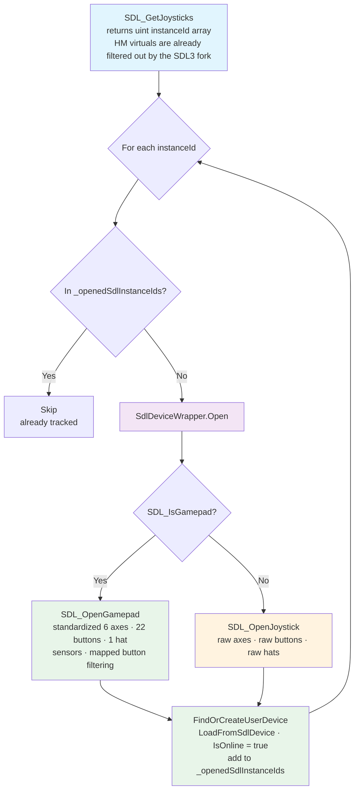

# SDL3 Integration

*How PadForge talks to every physical controller: the SDL3 P/Invoke layer, the custom fork, and the code that turns SDL devices into mappable inputs.*

PadForge uses SDL3 as its sole input backend for all controller types, including Xbox/XInput. This page covers the P/Invoke layer, device enumeration, state reading, sensors, haptic force feedback, virtual joysticks, and the custom SDL3 fork (HIDMaestro filter, Switch 2 controllers over USB and BLE, Wii and Joy-Con support, the Switch NFC reader, DualShock 3 motion, 16-XInput, and XInput Share).



**Source files:**
- `PadForge.Engine/Common/SDL3Minimal.cs`. SDL3 P/Invoke declarations
- `PadForge.Engine/Common/SdlDeviceWrapper.cs`. Joystick/gamepad wrapper (state, rumble, haptic, GUID)
- `PadForge.Engine/Common/SdlKeyboardWrapper.cs`. Keyboard device wrapper
- `PadForge.Engine/Common/SdlMouseWrapper.cs`. Mouse device wrapper
- `PadForge.Engine/Common/RawInputListener.cs`. Windows Raw Input for keyboard/mouse
- `PadForge.Engine/Common/ISdlInputDevice.cs`. Common device interface
- `PadForge.App/Common/Input/InputManager.cs`. SDL initialization, hints, polling loop
- `PadForge.App/Common/Input/InputManager.Step1.UpdateDevices.cs`. Device enumeration loop (HM virtuals are filtered upstream by the SDL3 fork)
- `PadForge.App/Common/Input/InputManager.Step2.UpdateInputStates.cs`. State reading, force feedback
- `PadForge.App/gamecontrollerdb_padforge.txt`. Custom gamepad mappings

## Contents

- [SDL3 P/Invoke Layer](#sdl3-pinvoke-layer)
- [SDL3 Initialization and Hints](#sdl3-initialization-and-hints)
- [Device Enumeration Flow (Step 1)](#device-enumeration-flow-step-1)
- [Device Filtering (HIDMaestro)](#device-filtering-hidmaestro)
- [SdlDeviceWrapper Class](#sdldevicewrapper-class)
- [Gamepad vs Joystick API](#gamepad-vs-joystick-api)
- [Sensor Support (Gyro / Accelerometer)](#sensor-support-gyro-accelerometer)
- [GUID Construction](#guid-construction)
- [HID Product String Fallback](#hid-product-string-fallback)
- [Rumble Implementation](#rumble-implementation)
- [State Reading (Step 2)](#state-reading-step-2)
- [SDL Virtual Joysticks (DualShock 3 Bridge)](#sdl-virtual-joysticks-dualshock-3-bridge)
- [ISdlInputDevice Interface](#isdlinputdevice-interface)
- [Keyboard and Mouse via Raw Input](#keyboard-and-mouse-via-raw-input)
- [Custom Gamepad Mappings (gamecontrollerdb_padforge.txt)](#custom-gamepad-mappings-gamecontrollerdb_padforgetxt)
- [Device Change Detection (IsAttached, MarkDeviceOffline)](#device-change-detection-isattached-markdeviceoffline)
- [SDL3 Fork](#sdl3-fork)

---

## SDL3 P/Invoke Layer

**File:** `PadForge.Engine/Common/SDL3Minimal.cs`
**Namespace:** `SDL3`

All SDL3 functions are `[DllImport("SDL3")]` P/Invoke bindings in the static class `SDL3.SDL`. Only functions PadForge uses are declared. Not a complete binding. The shipped `SDL3.dll` at `PadForge.App/Resources/SDL3/x64/SDL3.dll` is a custom fork build (see [SDL3 Fork](#sdl3-fork)).

### Key SDL3 vs SDL2 API Changes

| SDL2 | SDL3 | Notes |
|------|------|-------|
| `SDL_NumJoysticks()` + device index | `SDL_GetJoysticks()` returning `uint[]` of instance IDs | Instance IDs stable per session |
| `SDL_IsGameController()` | `SDL_IsGamepad()` | Renamed |
| `SDL_GameControllerOpen()` | `SDL_OpenGamepad()` | Takes instance ID, not device index |
| `SDL_JoystickGetGUID()` | `SDL_GetJoystickGUID()` | Returns `SDL_GUID` (was `SDL_JoystickGUID`) |
| `SDL_INIT_GAMECONTROLLER` | `SDL_INIT_GAMEPAD` | Renamed flag |
| Return `int` (negative = error) | Return `bool` | SDL3 uses C `bool` returns |
| `SDL_JoystickCurrentPowerLevel` | `SDL_GetGamepadPowerInfo()` | Returns `SDL_PowerState` value + percentage (PadForge binds the gamepad variant) |
| `SDL_JoystickHasRumble()` | Properties system | Via `SDL_GetJoystickProperties()` + `SDL_GetBooleanProperty()` |
| `SDL_GetVersion(SDL_version*)` | `SDL_GetVersion()` returning packed int | `major * 1000000 + minor * 1000 + patch` |

### Init Flags

```csharp
public const uint SDL_INIT_VIDEO    = 0x00000020;  // Required for keyboard/mouse
public const uint SDL_INIT_JOYSTICK = 0x00000200;
public const uint SDL_INIT_HAPTIC   = 0x00001000;
public const uint SDL_INIT_GAMEPAD  = 0x00002000;  // Was SDL_INIT_GAMECONTROLLER
```

### Bool Marshaling Pattern

SDL3 returns C `bool` (1 byte). P/Invoke pattern:

```csharp
[DllImport(lib, CallingConvention = CallingConvention.Cdecl, EntryPoint = "SDL_IsGamepad")]
[return: MarshalAs(UnmanagedType.U1)]
private static extern bool _SDL_IsGamepad(uint instance_id);

public static bool SDL_IsGamepad(uint instance_id) => _SDL_IsGamepad(instance_id);
```

The private `_`-prefixed extern uses `MarshalAs(UnmanagedType.U1)` for correct bool marshaling. The public wrapper provides a clean API surface.

### String Marshaling

SDL3 returns UTF-8 `const char*` pointers. Pattern:

```csharp
[DllImport(lib, CallingConvention = CallingConvention.Cdecl, EntryPoint = "SDL_GetJoystickNameForID")]
private static extern IntPtr _SDL_GetJoystickNameForID(uint instance_id);

public static string SDL_GetJoystickNameForID(uint instance_id)
{
    return Marshal.PtrToStringUTF8(_SDL_GetJoystickNameForID(instance_id)) ?? string.Empty;
}
```

### Memory-Owning Array Returns

`SDL_GetJoysticks()` returns a heap-allocated array the caller must free with `SDL_free()`. The C# wrapper handles this transparently:

```csharp
public static uint[] SDL_GetJoysticks()
{
    IntPtr ptr = _SDL_GetJoysticks(out int count);
    if (ptr == IntPtr.Zero || count <= 0)
        return Array.Empty<uint>();
    try
    {
        var ids = new uint[count];
        for (int i = 0; i < count; i++)
            ids[i] = unchecked((uint)Marshal.ReadInt32(ptr, i * 4));
        return ids;
    }
    finally
    {
        SDL_free(ptr);
    }
}
```

### Key Functions Declared

```csharp
// Init / Quit
public static bool SDL_Init(uint flags);
public static void SDL_Quit();
public static bool SDL_SetHint(string name, string value);
public static string SDL_GetError();

// Joystick enumeration (instance-ID-based)
public static uint[] SDL_GetJoysticks();
public static IntPtr SDL_OpenJoystick(uint instance_id);
public static void SDL_CloseJoystick(IntPtr joystick);
public static void SDL_UpdateJoysticks();
public static uint SDL_GetJoystickID(IntPtr joystick);
public static bool SDL_JoystickConnected(IntPtr joystick);

// Joystick properties (from opened handle)
public static string SDL_GetJoystickName(IntPtr joystick);
public static ushort SDL_GetJoystickVendor(IntPtr joystick);
public static ushort SDL_GetJoystickProduct(IntPtr joystick);
public static ushort SDL_GetJoystickProductVersion(IntPtr joystick);
public static SDL_JoystickType SDL_GetJoystickType(IntPtr joystick);
public static string SDL_GetJoystickPath(IntPtr joystick);
public static string SDL_GetJoystickSerial(IntPtr joystick);
public static int SDL_GetNumJoystickAxes(IntPtr joystick);
public static int SDL_GetNumJoystickButtons(IntPtr joystick);
public static int SDL_GetNumJoystickHats(IntPtr joystick);
public static uint SDL_GetJoystickProperties(IntPtr joystick);
public static bool SDL_GetBooleanProperty(uint props, string name, bool default_value);

// Joystick state polling
public static short SDL_GetJoystickAxis(IntPtr joystick, int axis);
public static bool SDL_GetJoystickButton(IntPtr joystick, int button);
public static byte SDL_GetJoystickHat(IntPtr joystick, int hat);

// Joystick rumble
public static bool SDL_RumbleJoystick(IntPtr joystick, ushort low, ushort high, uint duration_ms);

// Gamepad (was GameController)
public static bool SDL_IsGamepad(uint instance_id);
public static IntPtr SDL_OpenGamepad(uint instance_id);
public static void SDL_CloseGamepad(IntPtr gamepad);
public static IntPtr SDL_GetGamepadJoystick(IntPtr gamepad);
public static short SDL_GetGamepadAxis(IntPtr gamepad, int axis);
public static bool SDL_GetGamepadButton(IntPtr gamepad, int button);

// Gamepad sensors
public static bool SDL_GamepadHasSensor(IntPtr gamepad, int type);
public static bool SDL_SetGamepadSensorEnabled(IntPtr gamepad, int type, bool enabled);
public static bool SDL_GetGamepadSensorData(IntPtr gamepad, int type, float[] data, int num_values);

// Haptic force feedback
public static IntPtr SDL_OpenHapticFromJoystick(IntPtr joystick);
public static void SDL_CloseHaptic(IntPtr haptic);
public static uint SDL_GetHapticFeatures(IntPtr haptic);
public static bool SDL_SetHapticGain(IntPtr haptic, int gain);
public static int SDL_CreateHapticEffect(IntPtr haptic, ref SDL_HapticEffect effect);
public static bool SDL_UpdateHapticEffect(IntPtr haptic, int effect, ref SDL_HapticEffect data);
public static bool SDL_RunHapticEffect(IntPtr haptic, int effect, uint iterations);
public static bool SDL_StopHapticEffect(IntPtr haptic, int effect);
public static void SDL_DestroyHapticEffect(IntPtr haptic, int effect);
public static int SDL_GetNumHapticAxes(IntPtr haptic);

// Keyboard/Mouse enumeration
public static uint[] SDL_GetKeyboards();
public static uint[] SDL_GetMice();

// Power info
public static int SDL_GetGamepadPowerInfo(IntPtr gamepad, out int percent);

// Player LED (hidapi drivers with player LEDs light them, Windows backends no-op)
public static bool SDL_SetJoystickPlayerIndex(IntPtr joystick, int player_index);

// Trigger (impulse) rumble, Xbox One+ family
public static bool SDL_RumbleGamepadTriggers(IntPtr gamepad, ushort left, ushort right, uint duration_ms);

// Vendor effect output (DualSense adaptive triggers / lightbar / audio, PadForge owns the byte layout)
public static bool SDL_SendGamepadEffect(IntPtr gamepad, byte[] data, int offset, int length);

// Switch NFC tag UID (fork export SDL#15. On stock SDL the wrapper probes once and permanently returns false)
public static bool SDL_TryGetGamepadNfcTagUid(IntPtr gamepad, out string uid);

// Joystick LED (Switch-family HOME LED brightness via equal-RGB writes, #226)
public static bool SDL_SetJoystickLED(IntPtr joystick, byte red, byte green, byte blue);

// Gamepad touchpad
public static int SDL_GetNumGamepadTouchpads(IntPtr gamepad);
public static int SDL_GetNumGamepadTouchpadFingers(IntPtr gamepad, int touchpad);
public static bool SDL_GetGamepadTouchpadFinger(IntPtr gamepad, int touchpad, int finger,
    out bool down, out float x, out float y, out float pressure);

// String property (e.g. Wii Balance Board calibration blob)
public static string SDL_GetStringProperty(uint props, string name, string defaultValue);

// Virtual joystick (DS3 Bluetooth bridge surfaced through the normal pipeline)
public static uint SDL_AttachVirtualJoystick(ref SDL_VirtualJoystickDesc desc);
public static bool SDL_DetachVirtualJoystick(uint instance_id);
public static bool SDL_SetJoystickVirtualAxis(IntPtr joystick, int axis, short value);
public static bool SDL_SetJoystickVirtualButton(IntPtr joystick, int button, bool down);
public static bool SDL_SetJoystickVirtualHat(IntPtr joystick, int hat, byte value);
public static bool SDL_SendJoystickVirtualSensorData(IntPtr joystick, int type, ulong ts, float[] data, int num);
public static bool SDL_IsJoystickVirtual(uint instance_id);
```

### SDL_HapticCondition

```csharp
[StructLayout(LayoutKind.Sequential)]
public struct SDL_HapticCondition
{
    public ushort type;              // SDL_HAPTIC_SPRING / DAMPER / INERTIA / FRICTION
    private ushort _pad;
    public SDL_HapticDirection direction;
    public uint length;              // Duration in ms
    public ushort delay, button, interval;
    // NO padding here: right_sat0 follows interval directly (offset 30). A stray
    // pad shifts every condition parameter 2 bytes and SDL reads coeff/saturation as 0.
    // Per-axis arrays (3 axes max). Flattened as individual fields
    public ushort right_sat0, right_sat1, right_sat2;   // Positive saturation 0-65535
    public ushort left_sat0, left_sat1, left_sat2;      // Negative saturation 0-65535
    public short right_coeff0, right_coeff1, right_coeff2; // Positive coefficient
    public short left_coeff0, left_coeff1, left_coeff2;   // Negative coefficient
    public ushort deadband0, deadband1, deadband2;      // Dead band 0-65535
    public short center0, center1, center2;             // Center point
} // 68 bytes
```

Used for Spring, Damper, Friction, and Inertia effects. Each axis has independent coefficients, saturation, center, and deadband. SDL supports up to 3 axes. PadForge uses 2 (X and Y). Data flows from `HMaestroFfbDecoder` (parsing PID FFB packets emitted by the HM driver) through `Vibration.ConditionAxes[]` into `ForceFeedbackState.SetConditionHapticForces()`, which populates this struct.

### SDL_HapticRamp

```csharp
[StructLayout(LayoutKind.Sequential)]
public struct SDL_HapticRamp
{
    public ushort type;              // SDL_HAPTIC_RAMP
    private ushort _pad;
    public SDL_HapticDirection direction;
    public uint length;              // Duration in ms
    public ushort delay, button, interval;
    public short start;              // Start level -32767 to 32767
    public short end;                // End level -32767 to 32767
    public ushort attack_length, attack_level;
    public ushort fade_length, fade_level;
} // 44 bytes
```

Ramp force effect (linearly changing force from start to end level). Declared in `SDL3Minimal.cs` and included in the `SDL_HapticEffect` union. `HMaestroFfbDecoder.DecodeSetRamp` handles the PID Set Ramp Force report (output report ID 0x16, `[EBI][Start:2][End:2]`), scaling both endpoints to canonical units and taking `max(abs(start), abs(end))` as magnitude.

### SDL_HapticEffect Union Struct

```csharp
[StructLayout(LayoutKind.Explicit, Size = 72)]
public struct SDL_HapticEffect
{
    [FieldOffset(0)] public ushort type;
    [FieldOffset(0)] public SDL_HapticLeftRight leftright;
    [FieldOffset(0)] public SDL_HapticConstant constant;
    [FieldOffset(0)] public SDL_HapticPeriodic periodic;
    [FieldOffset(0)] public SDL_HapticCondition condition;
    [FieldOffset(0)] public SDL_HapticRamp ramp;
}
```

Uses `LayoutKind.Explicit, Size=72` with overlaid sub-structs matching the C union. The 72-byte size provides a safety margin (largest member `SDL_HapticCondition` is 68 bytes on x64).

### Sensor Type Constants

```csharp
public const int SDL_SENSOR_ACCEL   = 1;  // Accelerometer (m/s^2)
public const int SDL_SENSOR_GYRO    = 2;  // Gyroscope (rad/s)
public const int SDL_SENSOR_ACCEL_L = 3;  // Left Joy-Con accel
public const int SDL_SENSOR_GYRO_L  = 4;  // Left Joy-Con gyro
public const int SDL_SENSOR_ACCEL_R = 5;  // Right Joy-Con accel
public const int SDL_SENSOR_GYRO_R  = 6;  // Right Joy-Con gyro
```

---

## SDL3 Initialization and Hints

**File:** `PadForge.App/Common/Input/InputManager.cs`
**Method:** `private bool InitializeSdl()`

SDL3 initialization runs once before the polling thread starts. Hints must be set **before** `SDL_Init()` because SDL reads them during subsystem initialization.

### Subsystem Flags

```csharp
SDL_Init(SDL_INIT_JOYSTICK | SDL_INIT_GAMEPAD | SDL_INIT_VIDEO | SDL_INIT_HAPTIC)
```

| Flag | Hex | Purpose |
|------|-----|---------|
| `SDL_INIT_JOYSTICK` | `0x0200` | Joystick enumeration, polling, rumble |
| `SDL_INIT_GAMEPAD` | `0x2000` | Loads gamecontrollerdb. Enables `SDL_IsGamepad()` / `SDL_OpenGamepad()` |
| `SDL_INIT_VIDEO` | `0x0020` | Required for `SDL_GetKeyboards()` / `SDL_GetMice()`. **Side effect:** disables screensaver and system sleep |
| `SDL_INIT_HAPTIC` | `0x1000` | Haptic force feedback for wheels, flight sticks, and devices without rumble |

### Post-Init Fixups

After `SDL_Init()` succeeds, two fixups counteract `SDL_INIT_VIDEO` side effects:

1. **`SDL_EnableScreenSaver()`**. Re-enables the screensaver SDL disabled
2. **`SetThreadExecutionState(ES_CONTINUOUS)`**. Clears execution-state flags SDL set, restoring system sleep

A periodic sleep guard (`sleepGuardTimer`, every 5s) re-applies `SetThreadExecutionState(ES_CONTINUOUS)` because SDL may re-assert these flags during `SDL_UpdateJoysticks()`.

### Custom Gamepad Mappings

After initialization, PadForge loads its custom mappings to extend SDL's built-in gamecontrollerdb for unrecognized devices. The mappings ship as an embedded resource inside `PadForge.exe`, not as a loose file, so `LoadEmbeddedGamepadMappings()` streams the resource and applies each line via `SDL_AddGamepadMapping()`. The file-path overload (`SDL_AddGamepadMappingsFromFile`) is unusable when nothing but `PadForge.xml` and `crash.log` sits beside the single-file exe. See [Custom Gamepad Mappings](#custom-gamepad-mappings-gamecontrollerdb_padforgetxt) for format and entries.

```csharp
private static void LoadEmbeddedGamepadMappings()
{
    var asm = typeof(InputManager).Assembly;
    // Resource name is "<RootNamespace>.<filename>"; RootNamespace is "PadForge".
    using var stream = asm.GetManifestResourceStream("PadForge.gamecontrollerdb_padforge.txt");
    if (stream == null) return;
    using var reader = new StreamReader(stream);
    string line;
    while ((line = reader.ReadLine()) != null)
    {
        string trimmed = line.Trim();
        if (trimmed.Length == 0 || trimmed[0] == '#') continue;
        SDL_AddGamepadMapping(trimmed);  // one P/Invoke per mapping line
    }
}
```

### SDL Hints (Complete Reference)

`InitializeSdl` sets these before `SDL_Init()`. SDL reads them during subsystem startup. Two fork HIDAPI hints are deliberately absent from this table and toggled at runtime instead, covered in [Runtime-Managed Hints](#runtime-managed-hints-mcu-demand-latch) below.

| Hint | Value | Rationale |
|------|-------|-----------|
| `SDL_HINT_JOYSTICK_ALLOW_BACKGROUND_EVENTS` | `"1"` | **Required.** Without this, SDL stops reading input when PadForge loses focus. A remapper must read input while games have focus. |
| `SDL_HINT_JOYSTICK_XINPUT` | `"1"` | Enables SDL's XInput backend for Xbox controller enumeration. Without this, Xbox controllers (USB or wireless adapter) do not appear in `SDL_GetJoysticks()`. Was `SDL_HINT_XINPUT_ENABLED` in SDL2. |
| `SDL_HINT_HIDAPI_IGNORE_DEVICES` | `"0x146b/0x0603"` | Devices SDL's hidapi layer must never enumerate or probe. Connecting a Nacon PS4 Compact (146B:0603) froze the app until unplug (#235). The leading explanation, refined by the fork SDL#19 audit, is a Sony third-party capabilities feature-report probe that never returns, on the UI thread that runs enumeration. PID-scoped seatbelt: other Nacon PIDs stay untouched. The value is the `InputManager.HidapiIgnoreDevices` constant. |
| `SDL_HINT_JOYSTICK_BLACKLIST_DEVICES` | `"0x054c/0x03d5,0x054c/0x0c5e,0x054c/0x042f"` | Devices no SDL joystick backend may enumerate. The PS Move family (#277): a docked Move exposes three HID collections and no SDL driver claims the PIDs, so each collection surfaced as its own dead joystick row. PadForge drives these pads itself (`PsMoveDirectService`, and the DS3 service's navigation profile) and feeds SDL virtual joysticks, which are exempt because the virtual backend never calls `SDL_ShouldIgnoreJoystick`. The value is the `InputManager.JoystickBlacklistDevices` constant. |
| `SDL_HINT_JOYSTICK_HIDAPI_SWITCH2` | `"1"` | Activates the HIDAPI driver for the wired Switch 2 Pro Controller (PadForge's custom fork). Gates `SDL_hidapi_switch2.c`. Without it, the controller is ignored even though the driver code is compiled in. |
| `SDL_HINT_JOYSTICK_HIDAPI_WII` | `"1"` | Enables SDL's Wii HIDAPI driver (#116). Surfaces the Bluetooth-paired Wii Remote / Nunchuk / Classic / Wii U Pro and lights the player LED. Relies on the fork's `hid_write` fix (`hifihedgehog/SDL#2`). |
| `SDL_HINT_JOYSTICK_BLE_SWITCH2` | `"1"` | Enables the fork's Bluetooth-LE Switch 2 driver (`hifihedgehog/SDL#5`, #153). Switch 2 controllers speak a custom BLE GATT service, not HID-over-Bluetooth, so hidapi can't see them. Runs a BLE advertisement scan while PadForge is open. |
| `SDL_HINT_JOYSTICK_BLE_SWITCH2_MOUSE` | `"1"` | Enables the fork's Joy-Con 2 optical-mouse axes (`hifihedgehog/SDL#8`, #154). The BLE driver posts absolute 16-bit mouse counters on joystick axes 6/7 (raw axis count 8), read as "Mouse Motion X/Y" sources. |
| `SDL_HINT_JOYSTICK_HIDAPI_SWITCH_SHAPED_RUMBLE` | `"1"` | Enables the fork's frequency-shaped Switch rumble (#271 item 4, `hifihedgehog/SDL#25`). Upstream drives the Switch LRAs at two fixed carriers with amplitude-only tables. With the hint on, each motor's intensity also sweeps its frequency band (low ~41-160 Hz, high 160-320 Hz) with attack and decay transients. Classic LRA packet only, Switch 2 encoding untouched. |
| `SDL_HINT_JOYSTICK_BLE_SWITCH2_MAGNETOMETER` | `"1"` | Enables the fork's Switch 2 BLE magnetometer channel (#271 item 5, same fork commit). Three raw int16 axes after the mouse counters, availability riding the raw axis count (9 = magnetometer, 11 = mouse plus magnetometer). PadForge does not consume them yet. The hint keeps the axes observable on a bench. |
| `SDL_HINT_JOYSTICK_HIDAPI_PS3_SIXAXIS_DRIVER` | `"1"` | Enables SDL's Sony-sixaxis PS3 driver (#194). Claims a DualShock 3 in DsHidMini SXS mode, the only mode that serves motion, and reads its accelerometer, yaw gyro, and 10 pressure axes. Do **not** also set `SDL_HINT_JOYSTICK_HIDAPI_PS3` (the regular PS3 driver outranks sixaxis and writes at the device). |
| `SDL_HINT_VIDEO_ALLOW_SCREENSAVER` | `"1"` | Counteracts `SDL_INIT_VIDEO`'s default screensaver suppression. PadForge only needs VIDEO for keyboard/mouse enumeration. |
| `SDL_HINT_JOYSTICK_RAWINPUT` | **NOT SET** | **Must not be "1".** SDL3's raw input backend conflicts with XInput. Raw input claims Xbox controllers first, leaving XInput with no unclaimed devices. Discovered via Cemu comparison. Omitted (not "0" either) so SDL defaults to XInput for Xbox and HIDAPI for others. |

> **Hint timing:** subsystem-init hints (`SDL_HINT_JOYSTICK_XINPUT`, `SDL_HINT_JOYSTICK_RAWINPUT`, background events) must precede `SDL_Init()` because SDL reads them during subsystem startup. HIDAPI driver hints stay live after init. SDL re-evaluates them when a hint change enables or disables a driver (`SDL_HIDAPIDriverHintChanged`), and the fork applies the two MCU hints below on the sensors-enable edge. The [Wii rescan](#sdl-hint-sdl_hint_joystick_hidapi_wii) and the runtime-managed hints both depend on that.

### Runtime-Managed Hints (MCU Demand Latch)

Two fork HIDAPI hints are toggled at runtime by `InputService.RefreshSwitchNfcArming()` (on the auto-idle cadence), never set at init:

| Hint | ON while | OFF effect |
|------|----------|------------|
| `SDL_HINT_JOYSTICK_HIDAPI_SWITCH_NFC` | An NFC tag registration capture is running, or a Bluetooth-linked reader-capable pad (right Joy-Con `0x2007`, combined pair `0x2008`, Pro Controller `0x2009`) is online and a configured NFC consumer (local or Remote Link peer) polled an NFC descriptor within the demand window | MCU powers down. `ReadNfcTag` reports "no tag" |
| `SDL_HINT_JOYSTICK_HIDAPI_JOYCON_IR_SENSOR` | An "IR Brightness" consumer (`hifihedgehog/SDL#7`, #151: a right Joy-Con posts its NIR MCU average-intensity byte on joystick axis 6) polled within the demand window, no NFC registration capture is active, and an IR-capable Joy-Con is online (standalone right `0x2007`, or a combined gen-1 pair `0x2008` whose right half runs the same camera machine, fork SDL#26 / #275) | Camera stops, freeing the MCU for NFC |

How the latch works:

- **Demand comes from reads.** `SourceCoercion` stamps `LastNfcReadRequestTick` / `LastJoyConIrReadRequestTick` whenever a configured, enabled mapping evaluates an NFC or IR descriptor. Configured inputs are read every tick, so an active binding keeps the latch continuously fresh. A deleted or disabled one lapses after `McuDemandWindowMs` (10 s).
- **Why not init-time.** The right Joy-Con camera and the NFC reader share the one MCU (camera = mode 5, NFC = mode 4, and the fork's `UpdateNfc` abandons while the camera streams). A globally-on IR hint silently killed standalone right Joy-Con NFC (#248 audit). Do not move either hint back into the init table.
- **Registration preempts the camera.** A tag-registration capture with the camera streaming would wait forever for a UID, so `RegistrationCaptureActive` forces IR off. The camera resumes when the dialog closes and IR demand re-latches.
- **The sensors-enable edge.** The fork decides the camera's fate only at `SetSensorsEnabled`, so after an IR flip the service drives every open IR-capable Joy-Con (`0x2007` or `0x2008`) through `SdlDeviceWrapper.BounceMotionSensors()` (all four sensor streams off, then on) on a worker thread. Without the bounce, a runtime flip would only take effect on reconnect.
- **Latch only on success.** The managed flag updates only when `SDL_SetHint` accepts the value. A rejected write retries on the next cadence instead of leaving the flag and the MCU disagreeing.
- When both the camera and NFC are configured for one standalone right Joy-Con, the camera wins by fork arbitration. That conflict is the mapping author's own choice.

---

## Device Enumeration Flow (Step 1)

**File:** `PadForge.App/Common/Input/InputManager.Step1.UpdateDevices.cs`
**Method:** `private void UpdateDevices()`

Runs every ~2s (`EnumerationIntervalMs = 2000`) on the background polling thread. The first cycle runs immediately (`firstCycle = true`) for instant controller detection. Two phases for joysticks, plus keyboard/mouse enumeration.

### Phase 1: Open Newly Connected Joystick Devices

```
SDL_GetJoysticks() -> uint[] joystickIds
    |
    Build HashSet<uint> currentInstanceIds (used by Phase 2 to detect disconnects)
    |
    For each instanceId in joystickIds:
    |       (HIDMaestro virtuals never reach here. The SDL3 fork's
    |        substring-list filter drops them before SDL_GetJoysticks returns.
    |        Every instance ID at this point is a real device.)
    |
    |   1. Is it in _openedSdlInstanceIds?
    |       YES -> Skip (already open and tracked)
    |
    |   2. new SdlDeviceWrapper().Open(instanceId)
    |       |
    |       Open() internally:
    |       |   SDL_IsGamepad(instanceId)?
    |       |   |-- YES: SDL_OpenGamepad(instanceId)
    |       |   |        Joystick = SDL_GetGamepadJoystick(GameController)
    |       |   |-- NO:  SDL_OpenJoystick(instanceId)
    |       |
    |       |   Populate: Name, VID, PID, Path, Serial, Type
    |       |   RawButtonCount = SDL_GetNumJoystickButtons(Joystick)
    |       |   RawAxisCount   = SDL_GetNumJoystickAxes(Joystick)
    |       |   If gamepad: NumAxes=6, NumButtons=22 (0-10 standard + 11-21 SDL extended), NumHats=1
    |       |               ParseMappedButtonIndices(GameController)
    |       |               Detect v4 capabilities (rumble triggers, aux accel,
    |       |               touchpads, Wii IR / Joy-Con cameras, extra generic axes)
    |       |   Else:       NumAxes/Buttons/Hats from raw joystick
    |       |   HID name fallback if Name is raw VID/PID
    |       |   Check rumble via SDL properties system
    |       |   Enable gyro/accel sensors (gamepad only)
    |       |   OpenHaptic() for force feedback
    |       |   Build ProductGuid + InstanceGuid
    |       |
    |       Open() failed? -> Dispose wrapper, continue to next
    |
    |   3. FindOrCreateUserDevice(wrapper.InstanceGuid, wrapper.ProductGuid)
    |       |   Exact match by InstanceGuid? -> return existing
    |       |   Fallback match by ProductGuid (offline device)? -> migrate GUID
    |       |   No match? -> create new UserDevice
    |
    |   4. ud.LoadFromSdlDevice(wrapper)  -- populates UserDevice runtime state
    |      ud.IsOnline = true
    |      _openedSdlInstanceIds[wrapper.SdlInstanceId] = wrapper
    |      changed = true
```

**Why instance IDs, not GUIDs:** `_openedSdlInstanceIds` uses SDL instance IDs (`uint`) because serial-based GUIDs (Bluetooth devices) are unavailable until the device is opened. Instance IDs are assigned at connection time and unique per session.

### Phase 1b/1c: Keyboard and Mouse Enumeration

Keyboards and mice use `RawInputListener.EnumerateKeyboards()` / `EnumerateMice()` via Windows Raw Input (not SDL). Each new device gets a `SdlKeyboardWrapper` or `SdlMouseWrapper`, with `UserDevice` populated via `LoadFromKeyboardDevice()` / `LoadFromMouseDevice()`.

Tracking uses `_openedKeyboardHandles` and `_openedMouseHandles` (`HashSet<IntPtr>`) keyed on Raw Input handles.

**Why not SDL for keyboards/mice:** SDL's APIs report system-wide state without distinguishing physical devices. PadForge's per-device mapping requires per-device tracking, which only Windows Raw Input provides.

### Phase 2: Detect Disconnected Devices

Two paths, depending on whether Step 2 already flipped the device offline.

**Already offline (Step 2 saw a null read).** A tracked SDL ID whose `UserDevice` is no longer online means `GetCurrentState()` returned null when SDL reported the handle detached. Handle detachment is permanent, so no debounce applies. `MarkDeviceOffline()` runs immediately to finish the cleanup. An orphaned wrapper with no `UserDevice` at all is disposed here on the poll thread, except when the same physical device is already live under a rebound wrapper (disposing the stale HIDAPI context would clobber the live registration).

**Still online but looking disconnected.** A device counts as looking disconnected when `ud.Device == null`, `IsAttached` is false (`SDL_JoystickConnected()`), or the ID is missing from the current `SDL_GetJoysticks()` enumeration. This path is debounced. The first cycle it looks disconnected, Phase 2 records the tick in `_sdlDisconnectCandidateSince` and moves on. `MarkDeviceOffline()` runs only after the condition holds for the full window (`SdlDisconnectDebounceMs = 2000`). This rides out the transient drop that xinputhid's slot-assignment pass can induce on a coexisting physical Xbox pad while a HIDMaestro virtual is being created. If the device reappears inside the window, the pending entry is cleared and nothing happens.

`MarkDeviceOffline()` itself:

1. Stops rumble via `ForceFeedbackState.StopDeviceForces()` (best-effort)
2. Disposes the SDL handle via `ud.Device.Dispose()` (best-effort)
3. Clears the wheel/LED per-device caches keyed on `DevicePath` so a same-path replug re-applies rotation range and auto-center
4. Calls `NeutralizeMappedOutputsFor(ud)`, which runs `ud.ClearRuntimeState()` (nulls Device, InputState, OldInputState, ForceFeedbackState, sets `IsOnline = false`) and drives the device's per-slot mapped outputs to neutral
5. Calls `XboxImpulseHidWriter.InvalidateCachedTargets()`, because any confirmed disconnect can reshuffle the synthetic `XInput#N` paths the impulse writer caches handles under

After the loop, a follow-up pass removes every disconnected SDL instance ID from `_openedSdlInstanceIds` (`foreach (sdlId in disconnectedIds) _openedSdlInstanceIds.Remove(sdlId)`).

Keyboard/mouse disconnection is detected by comparing tracked handles against `RawInputListener.EnumerateKeyboards()`/`EnumerateMice()`, using the same `MarkDeviceOffline()` path.

### Opened-Device Tracking Set

```csharp
// Devices already opened. Keyed on SDL instance ID (uint); the value is the
// wrapper, so the disconnect sweep can dispose an orphaned handle.
private readonly Dictionary<uint, SdlDeviceWrapper> _openedSdlInstanceIds = new();
```

`_openedSdlInstanceIds` records every device PadForge has opened, keyed on SDL instance ID, so the engine does not re-open the same device twice per cycle. Each value is the device's `SdlDeviceWrapper`, which lets the Phase 2 disconnect sweep dispose an orphaned handle. There is no bulk prune. Phase 2 collects the IDs that disconnected this cycle and a follow-up loop calls `_openedSdlInstanceIds.Remove(sdlId)` for each.

HIDMaestro virtual controllers are filtered upstream by PadForge's SDL3 fork: the patched enumerator does a fast substring match for `HIDMAESTRO` against each device's interface symlink, then walks the PnP parent chain looking for `HIDMAESTRO` in the hardware-ID list. Any match is dropped before `SDL_GetJoysticks` returns. This avoids the rumble-killing close path that earlier in-engine filtering used to guard against (`SDL_CloseJoystick` calls `XInputSetState(slot, 0, 0)` as cleanup, which would trigger an `OutputReceived(0, 0)` packet on the HIDMaestro bus). The fork's filter means HM devices never enter the engine's open/close cycle at all.

### UserDevice Lookup and GUID Migration

**`FindOrCreateUserDevice(Guid instanceGuid, Guid productGuid)`**. Three-tier matching:

1. **Exact match** by `InstanceGuid`. Returns existing device with preserved settings
2. **Fallback match** by `ProductGuid` against offline devices. Handles Bluetooth reconnections with changed device paths/`InstanceGuid`. Migrates the old GUID and updates `UserSetting` via `MigrateUserSettingGuid()`
3. **Create new**. Adds a fresh `UserDevice`

All lookups use manual `for` loops (not LINQ) to avoid closure allocations in the hot path.

### Orphaned Handle Pruning

`PruneOrphanedHandles()` runs before keyboard/mouse enumeration. It removes tracked handles whose `UserDevice` was deleted via the UI "Remove" command. Without this, deleted devices could never be re-detected because stale handles would remain in `_openedKeyboardHandles` / `_openedMouseHandles`.

---

## Device Filtering (HIDMaestro)

HIDMaestro virtual controllers (Xbox / PlayStation / Nintendo / Extended) appear as real input devices to SDL3 by default. The Nintendo family is the virtual Switch Pro added in 4.1.0 (#215, #246) and rides the same filter as the other three. Without filtering, SDL would enumerate PadForge's own outputs as inputs, the engine would map them back to themselves, and a feedback loop would create controllers exponentially.

PadForge filters them at the SDL3 fork level. The fork's patched enumeration walks each device's PnP parent chain looking for `HIDMAESTRO` in the Hardware ID list, with a substring fast path against the interface symlink before falling back to the parent walk. Any device that matches is dropped before `SDL_GetJoysticks` returns. HM virtuals never appear in the enumeration the engine consumes.

The previous in-engine filter (`IsHIDMaestroVirtualDevice` in `InputManager.Step1`) is gone. The engine no longer needs the per-cycle classification by device path, VID/PID, or active/expected count. The fork-side filter is upstream of every consumer (engine, `SDL_OpenJoystick`, `SDL_CloseJoystick`), so the rumble-killing close path that the in-engine filter used to guard against can't fire on HM devices.

For the SDL3 fork patches, see PadForge's SDL3 fork branch `feat/hidmaestro-filter`. The OpenXInput fork carries its own complementary filter for the XInput API surface, documented in [HIDMaestro Deep Dive](hidmaestro-deep-dive.md).

---

## SdlDeviceWrapper Class

**File:** `PadForge.Engine/Common/SdlDeviceWrapper.cs`
**Implements:** `ISdlInputDevice`, `IDisposable`

Wraps an SDL joystick (and optionally its Gamepad overlay) for unified device access. One instance per physical device.

### Properties

| Property | Type | Description |
|----------|------|-------------|
| `Joystick` | `IntPtr` | Raw SDL joystick handle. Always valid when open |
| `GameController` | `IntPtr` | SDL Gamepad handle. `IntPtr.Zero` if not a gamepad |
| `SdlInstanceId` | `uint` | SDL instance ID (unique per session). 0 = invalid |
| `NumAxes` | `int` | 6 for gamepads, raw count for joysticks |
| `NumButtons` | `int` | 22 for gamepads (the standardized-range cap), raw count for joysticks |
| `RawButtonCount` | `int` | Raw button count before gamepad remapping |
| `RawAxisCount` | `int` | Raw joystick axis count before the gamepad layout caps `NumAxes` to 6 (#193) |
| `NumHats` | `int` | 1 for gamepads, raw count for joysticks |
| `HasRumble` | `bool` | Supports `SDL_RumbleJoystick` |
| `Haptic` | `IntPtr` | SDL haptic handle. Non-zero when FFB is open |
| `HapticFeatures` | `uint` | Bitmask of `SDL_HAPTIC_*` flags |
| `HasHaptic` | `bool` | `Haptic != IntPtr.Zero` |
| `HapticStrategy` | `HapticEffectStrategy` | Best strategy: LeftRight > Sine > Constant |
| `HasGyro` / `HasAccel` | `bool` | Device has motion sensors |
| `HasAccelAux` | `bool` | Auxiliary/left accelerometer (`SDL_SENSOR_ACCEL_L`): Nunchuk on a Nunchuk-attached remote, left half of a combined Joy-Con pair (#199) |
| `HasGyroAux` | `bool` | Auxiliary/left gyroscope (`SDL_SENSOR_GYRO_L`): left half of a combined Joy-Con pair, gen 1 or gen 2 (#252). Never a Nunchuk, which has no gyro |
| `HasNfcReader` | `bool` | Switch NFC reader the fork can drive (#241): right Joy-Con, Pro Controller, or a combined pair whose right child carries the MCU |
| `HasRumbleTriggers` | `bool` | Xbox One+ impulse-trigger motors. SDL trigger-rumble cap OR the Xbox-impulse VID/PID list |
| `HasTouchpad` | `bool` | Device has one or more touchpad surfaces |
| `NumTouchpads` | `int` | Touchpad surface count (Steam Controller 2026 / Deck = 2, DualSense / DS4 = 1) |
| `TouchpadFingerCounts` | `int[]` | Per-pad simultaneous-finger count from `SDL_GetNumGamepadTouchpadFingers` |
| `HasIrCamera` | `bool` | Wii Remote IR camera surfaced as an "IR Pointer" source (#146) |
| `IsBalanceBoard` | `bool` | Wii Balance Board (#146) |
| `HasJoyConIr` | `bool` | Right Joy-Con NIR camera surfaced as an "IR Brightness" source (#151). Standalone right Joy-Con (`0x2007`) or a combined gen-1 pair (`0x2008`), gated on raw axis count >= 7 |
| `HasJoyCon2Mouse` | `bool` | Joy-Con 2 L/R optical mouse surfaced as "Mouse Motion X/Y" sources (#154) |
| `HasSwitch2Magnetometer` | `bool` | Switch 2 BLE magnetometer stream (#271 item 5). Raw wire units land on the wrapper-local `Switch2MagX/Y/Z` fields, not on `CustomInputState`, so the Remote Link codec's full Block enum stays untouched |
| `Switch2MagActive` | `bool` | False until the first nonzero magnetometer sample, because a zero triple must not feed the compass |
| `HasExtraGenericAxes` | `bool` | Raw axes beyond the standard six, surfaced as generic "Axis N" sources (#193) |
| `SupportedButtonIndices` | `int[]` | Sparse list of button positions the device actually exposes (Devices preview gating) |
| `SupportedAxisIndices` | `int[]` | Sparse list of axis positions the device actually has. Null means dense. Exists because `NumAxes` is the standardized 6-slot gamepad space, not a count of physical axes |
| `GamepadHandle` | `IntPtr` | Alias of `GameController`, used by the DualSense passthrough dispatcher |
| `SdlGuid` | `string` | SDL joystick GUID (32 hex) for gamecontrollerdb matching and virtual-joystick identity |
| `Name` | `string` | Human-readable device name |
| `VendorId` | `ushort` | USB Vendor ID |
| `ProductId` | `ushort` | USB Product ID |
| `DevicePath` | `string` | Device file system path |
| `JoystickType` | `SDL_JoystickType` | Device classification |
| `SerialNumber` | `string` | Serial (e.g., BT MAC address) |
| `InstanceGuid` | `Guid` | Deterministic GUID for settings matching |
| `ProductGuid` | `Guid` | VID+PID-based GUID |
| `IsGameController` | `bool` | `GameController != IntPtr.Zero` |
| `IsAttached` | `bool` | `SDL_JoystickConnected(Joystick)` |

### Force Raw Mode

**Property:** `ForceRawJoystickMode` (per-device setting in `UserDevice`)

When SDL3's gamecontrollerdb mapping produces incorrect results, enable Force Raw Mode on the Devices page. It bypasses the Gamepad API and reads raw joystick indices.

**Behavior per layer:**

| Layer | Normal Mode | Force Raw Mode |
|-------|-------------|----------------|
| **Open** (`SdlDeviceWrapper.Open`) | `SDL_OpenGamepad()` if `SDL_IsGamepad()` | Same. Still opened as gamepad |
| **Read** (`GetCurrentState(forceRaw)`) | `GetGamepadState()` | `GetJoystickState()` via `forceRaw = true` |
| **UI** (Devices page) | Shows the standardized gamepad buttons (`SupportedButtonIndices` within the 22 slots) | Shows `RawButtonCount` buttons |
| **Auto-mapping** | Standard gamepad mapping | Skipped. User must manually record |

**Important:** Force Raw Mode only changes the read path, not how the device is opened. The device stays opened as a Gamepad (if recognized), with sensors enabled. Re-opening would require a close/open cycle that could cause input drops.

**Primary use case:** DualShock 3 via DsHidMini SDF mode, where SDL's built-in mapping incorrectly mapped buttons due to the non-standard HID layout.

**Files:** `SdlDeviceWrapper.cs` (read dispatch), `InputManager.Step2.UpdateInputStates.cs` (passes `ud.ForceRawJoystickMode`), `DeviceService.cs` (settings sync), `DevicesPage.xaml` (toggle UI)

### Open Flow

```csharp
public bool Open(uint instanceId)
```

1. **Try Gamepad first:** `SDL_IsGamepad()` -> `SDL_OpenGamepad()`, get joystick via `SDL_GetGamepadJoystick()`
2. **Fall back to Joystick:** `SDL_OpenJoystick()` if not a gamepad or open failed
3. **Populate properties:** name, VID, PID, path, serial, type, `SdlGuid` from joystick handle
4. **Capture raw counts** before the gamepad override: `RawButtonCount = SDL_GetNumJoystickButtons()`, `RawAxisCount = SDL_GetNumJoystickAxes()`
5. **Gamepad layout override:** NumAxes=6, NumButtons=22, NumHats=1. Parse `_mappedRawButtonIndices` and compute `SupportedButtonIndices`
6. **HID name fallback:** if Name is raw VID/PID (e.g., `"0x16c0/0x05e1"`), query `HidD_GetProductString`
7. **Check rumble** via `SDL_GetJoystickProperties()` + `SDL_GetBooleanProperty()`. Set `HasRumbleTriggers` (SDL trigger-rumble cap OR the Xbox-impulse VID/PID list)
8. **Enable sensors:** gyro, accel, the aux accel (`SDL_SENSOR_ACCEL_L`, sets `HasAccelAux`), and the aux gyro (`SDL_SENSOR_GYRO_L`, sets `HasGyroAux`) via `SDL_GamepadHasSensor()` -> `SDL_SetGamepadSensorEnabled(true)` (gamepad only)
9. **Detect v4 capabilities:** touchpads (`HasTouchpad` / `NumTouchpads` / `TouchpadFingerCounts`), Wii IR camera and Balance Board (`HasIrCamera` / `IsBalanceBoard`, #146), right Joy-Con NIR (`HasJoyConIr`, #151), Joy-Con 2 optical mouse (`HasJoyCon2Mouse`, #154), and extra generic axes (`HasExtraGenericAxes`, #193), keyed off the raw joystick axis count
10. **Open haptic:** `OpenHaptic()` for FFB devices
11. **Build GUIDs:** `BuildProductGuid()` + `BuildInstanceGuid()`

### Close Order (Critical)

```csharp
private void CloseInternal()
```

**Haptic must be closed before the joystick it was opened from.** Then close gamepad (which also closes its underlying joystick), or close joystick directly if not a gamepad.

### Haptic Opening Strategy

**Method:** `private void OpenHaptic()` in `SdlDeviceWrapper.cs`

Decision tree determining whether a device uses simple rumble (`SDL_RumbleJoystick`), haptic effects (`SDL_RunHapticEffect`), or neither. Decided once at open time and stored in `HapticStrategy`.

```
OpenHaptic()
    |
    SDL_OpenHapticFromJoystick(Joystick)
    |-- Failed (null)? -> return (no haptic support, use simple rumble if HasRumble)
    |
    features = SDL_GetHapticFeatures(haptic)
    |-- features == 0? -> Close haptic, return (empty feature set)
    |
    HasRumble AND (features & SDL_HAPTIC_LEFTRIGHT)?
    |-- YES: Close haptic, return
    |        Rationale: Simple rumble via SDL_RumbleJoystick is more reliable
    |        for gamepads than haptic LeftRight effects. Haptic is only needed
    |        for devices where simple rumble doesn't work.
    |
    |-- NO: Keep haptic open. Store Haptic, HapticFeatures, then
            |
            NumHapticAxes = SDL_GetNumHapticAxes(haptic)
            |   1 axis -> wheels (single-axis FFB: Spring/Damper on steering axis)
            |   2+ axes -> joysticks, gamepads (X+Y axis condition effects)
            |
            Pick best strategy:
            |
            (features & SDL_HAPTIC_LEFTRIGHT)?
            |-- YES: HapticStrategy = LeftRight (best. Independent L/R motors)
            |
            (features & SDL_HAPTIC_SINE)?
            |-- YES: HapticStrategy = Sine (good. Periodic vibration)
            |
            (features & SDL_HAPTIC_CONSTANT)?
            |-- YES: HapticStrategy = Constant (acceptable. Steady force)
            |
            None of the above?
            |-- Close haptic, clear Haptic + HapticFeatures, return
            |
            (features & SDL_HAPTIC_GAIN)?
            |-- YES: SDL_SetHapticGain(haptic, 100) -- maximize gain
```

| Priority | Feature Flag | Strategy | Typical Devices |
|----------|-------------|----------|-----------------|
| 1 (best) | `SDL_HAPTIC_LEFTRIGHT` | `HapticEffectStrategy.LeftRight` | Gamepads without simple rumble |
| 2 | `SDL_HAPTIC_SINE` | `HapticEffectStrategy.Sine` | Racing wheels, flight sticks |
| 3 | `SDL_HAPTIC_CONSTANT` | `HapticEffectStrategy.Constant` | Older FFB devices |

`NumHapticAxes` is critical for `ForceFeedbackState`: it determines whether condition effects (Spring, Damper, Friction, Inertia) use 1 axis (wheels: steering only) or 2 axes (joysticks: X and Y).

---

## Gamepad vs Joystick API

PadForge uses two SDL APIs depending on whether the device is in SDL's gamecontrollerdb. The choice is made at open time and cannot change without re-opening.

| Condition | API Used | State Method | Axis/Button Counts |
|-----------|----------|--------------|-------------------|
| `SDL_IsGamepad()` true and `ForceRawMode` false | Gamepad API | `GetGamepadState()` | 6 axes, 22 buttons, 1 hat (standardized) |
| `SDL_IsGamepad()` false, or `ForceRawMode` true | Joystick API | `GetJoystickState()` | Raw counts from HID descriptor |

`ForceRawMode` is a per-device setting (`UserDevice.ForceRawJoystickMode`), passed via `GetCurrentState(bool forceRaw)` in Step 2. When true, `GetJoystickState()` is called even if `GameController != IntPtr.Zero`.

### Gamepad API (`GetGamepadState()`)

Used when `GameController != IntPtr.Zero` and `forceRaw` is false. Reads through SDL's mapping layer, which remaps DualSense, DualShock, Switch Pro, DS3, etc. to a standardized Xbox-like layout.

**Axis layout (CustomInputState.Axis[0..5]):**

| Index | Gamepad Axis | SDL Enum | Range Conversion |
|-------|-------------|----------|------------------|
| 0 | Left Stick X | `SDL_GAMEPAD_AXIS_LEFTX` (0) | signed -> unsigned: `(ushort)(raw - short.MinValue)` |
| 1 | Left Stick Y | `SDL_GAMEPAD_AXIS_LEFTY` (1) | signed -> unsigned |
| 2 | Left Trigger | `SDL_GAMEPAD_AXIS_LEFT_TRIGGER` (4) | 0..32767 -> 0..65535: `raw * 65535L / 32767` |
| 3 | Right Stick X | `SDL_GAMEPAD_AXIS_RIGHTX` (2) | signed -> unsigned |
| 4 | Right Stick Y | `SDL_GAMEPAD_AXIS_RIGHTY` (3) | signed -> unsigned |
| 5 | Right Trigger | `SDL_GAMEPAD_AXIS_RIGHT_TRIGGER` (5) | 0..32767 -> 0..65535 |

SDL puts triggers at indices 4/5, but PadForge reorders them to indices 2/5 to match the `LX(0), LY(1), LT(2), RX(3), RY(4), RT(5)` convention used throughout the mapping pipeline.

**Button layout (CustomInputState.Buttons[0..21+]):**

| Index | Button | SDL Enum |
|-------|--------|----------|
| 0 | A (South) | `SDL_GAMEPAD_BUTTON_SOUTH` (0) |
| 1 | B (East) | `SDL_GAMEPAD_BUTTON_EAST` (1) |
| 2 | X (West) | `SDL_GAMEPAD_BUTTON_WEST` (2) |
| 3 | Y (North) | `SDL_GAMEPAD_BUTTON_NORTH` (3) |
| 4 | Left Bumper | `SDL_GAMEPAD_BUTTON_LEFT_SHOULDER` (9) |
| 5 | Right Bumper | `SDL_GAMEPAD_BUTTON_RIGHT_SHOULDER` (10) |
| 6 | Back/Select | `SDL_GAMEPAD_BUTTON_BACK` (4) |
| 7 | Start/Menu | `SDL_GAMEPAD_BUTTON_START` (6) |
| 8 | Left Stick | `SDL_GAMEPAD_BUTTON_LEFT_STICK` (7) |
| 9 | Right Stick | `SDL_GAMEPAD_BUTTON_RIGHT_STICK` (8) |
| 10 | Guide/Home | `SDL_GAMEPAD_BUTTON_GUIDE` (5) |
| 11 | Misc 1 (Share) | `SDL_GAMEPAD_BUTTON_MISC1` (15) |
| 12 | Right Paddle 1 | `SDL_GAMEPAD_BUTTON_RIGHT_PADDLE1` (16) |
| 13 | Left Paddle 1 | `SDL_GAMEPAD_BUTTON_LEFT_PADDLE1` (17) |
| 14 | Right Paddle 2 | `SDL_GAMEPAD_BUTTON_RIGHT_PADDLE2` (18) |
| 15 | Left Paddle 2 | `SDL_GAMEPAD_BUTTON_LEFT_PADDLE2` (19) |
| 16 | Touchpad click | `SDL_GAMEPAD_BUTTON_TOUCHPAD` (20) |
| 17 | Misc 2 | `SDL_GAMEPAD_BUTTON_MISC2` (21) |
| 18 | Misc 3 | `SDL_GAMEPAD_BUTTON_MISC3` (22) |
| 19 | Misc 4 | `SDL_GAMEPAD_BUTTON_MISC4` (23) |
| 20 | Misc 5 | `SDL_GAMEPAD_BUTTON_MISC5` (24) |
| 21 | Misc 6 | `SDL_GAMEPAD_BUTTON_MISC6` (25) |
| 22+ | Extra raw | `SDL_GetJoystickButton(Joystick, i)` (filtered) |

Button indices differ from SDL's `SDL_GamepadButton` enum. PadForge reorders to match `CreateDefaultPadSetting()` (e.g., Back at 6, Guide at 10 instead of SDL's 4 and 5).

**Guide button suppression:** When Back+Start+Guide are all pressed, Guide is forced false. This suppresses a Windows/XInput quirk where the system synthesizes Guide from Back+Start.

**Extra raw buttons (22+):** After the 22 standardized SDL gamepad-button positions (0-10 PadForge standard + 11-21 SDL extended), `GetGamepadState()` appends raw buttons via `SDL_GetJoystickButton()` for indices 22 through `RawButtonCount`. This exposes native device buttons that are not part of any SDL gamepad-button enum for use as macro triggers. Already-mapped buttons (raw indices SDL already consumed for the gamepad mapping) are skipped (see [Mapped Button Filtering](#mapped-button-filtering-parsemappedbuttonindices)).

**D-pad to POV[0]:** Four D-pad buttons synthesized into a single POV value via `DpadToCentidegrees()`, supporting all 8 directions.

**Sensors:** `SDL_GetGamepadSensorData()` populates `state.Gyro[3]` (rad/s) and `state.Accel[3]` (m/s^2). Only available via the Gamepad API. Must be enabled during `Open()`.

### Joystick API (`GetJoystickState()`)

Used for unrecognized devices (flight sticks, wheels, generic HID) or when ForceRawMode is enabled. Reads raw axes, buttons, and hats without remapping.

- **Axes:** First `MaxAxis` (24) go to `Axis[]`, overflow to `Sliders[]`. Signed -> unsigned: `(ushort)(raw - short.MinValue)` maps -32768..32767 to 0..65535
- **Hats:** SDL bitmask -> centidegrees via `HatToCentidegrees()`, stored in `Povs[]`
- **Buttons:** Uses `RawButtonCount` (not `NumButtons`) to read all physical buttons. Critical for gamepad devices switched to ForceRawMode. `NumButtons` caps at the 22 standardized slots, but `RawButtonCount` preserves the actual HID count. See [RawButtonCount vs NumButtons Fix](#rawbuttoncount-vs-numbuttons-fix)

### RawButtonCount vs NumButtons Fix

**Problem:** Gamepad open pins `NumButtons` to the 22 standardized slots. A device with more than 22 physical buttons (arcade sticks, flight HOTAS) read through `GetJoystickState()` on `NumButtons` alone would stop at 22 and silently drop the extras.

**Solution:** `RawButtonCount` is captured from `SDL_GetNumJoystickButtons()` **before** the gamepad override. `GetJoystickState()` prefers it when available:

```csharp
int btnCount = Math.Min(
    RawButtonCount > 0 ? RawButtonCount : NumButtons,
    state.Buttons.Length);
```

All physical buttons are readable regardless of open mode.

### Mapped Button Filtering (`ParseMappedButtonIndices`)

**Problem:** After the 22 standardized positions, `GetGamepadState()` appends raw buttons (index 22+) as macro triggers. A high raw index may already be consumed by the gamepad mapping. Without filtering, such a button is double-reported, once as its mapped gamepad element and again as a generic raw button. Low raw indices like DS3 SDF's b11/b12, which SDL maps to R1/Guide, sit below 22, so the standardized 0-21 layer handles them and they never reach this passthrough.

**Solution:** `ParseMappedButtonIndices()` parses the SDL mapping string once at `Open()` to build a `HashSet<int>` of every consumed raw index (all `bN` values):

```csharp
private static HashSet<int> ParseMappedButtonIndices(IntPtr gameController)
{
    string mapping = GetGamepadMapping(gameController);
    // Mapping format: "GUID,name,a:b2,b:b1,...,platform:Windows,"
    // Parse all "bN" values to find consumed raw button indices.
    foreach (var segment in mapping.Split(','))
    {
        int colonIdx = segment.IndexOf(':');
        if (colonIdx < 0) continue;
        string value = segment.Substring(colonIdx + 1);
        if (value.Length > 1 && value[0] == 'b' && int.TryParse(value.Substring(1), out int btnIdx))
            indices.Add(btnIdx);
    }
}
```

In the extra raw button loop, any index in `_mappedRawButtonIndices` is skipped:

```csharp
for (int i = 22; i < rawCount && i < CustomInputState.MaxButtons; i++)
{
    if (_mappedRawButtonIndices != null && _mappedRawButtonIndices.Contains(i))
        continue;  // Already mapped by gamepad API. Skip to avoid double-reporting
    state.Buttons[i] = SDL_GetJoystickButton(Joystick, i);
}
```

`_mappedRawButtonIndices` is populated during `Open()` for gamepads. Null for raw joystick devices.

### Hat/POV Conversion

| SDL Bitmask | Centidegrees | Direction |
|-------------|-------------|-----------|
| `SDL_HAT_CENTERED` (0x00) | -1 | Centered |
| `SDL_HAT_UP` (0x01) | 0 | North |
| `SDL_HAT_RIGHTUP` (0x03) | 4500 | Northeast |
| `SDL_HAT_RIGHT` (0x02) | 9000 | East |
| `SDL_HAT_RIGHTDOWN` (0x06) | 13500 | Southeast |
| `SDL_HAT_DOWN` (0x04) | 18000 | South |
| `SDL_HAT_LEFTDOWN` (0x0C) | 22500 | Southwest |
| `SDL_HAT_LEFT` (0x08) | 27000 | West |
| `SDL_HAT_LEFTUP` (0x09) | 31500 | Northwest |

---

## Sensor Support (Gyro / Accelerometer)

Sensor support is only available through the Gamepad API (`GameController != IntPtr.Zero`).

### Detection and Activation (in `Open()`)

```csharp
HasGyro = SDL_GamepadHasSensor(GameController, SDL_SENSOR_GYRO);
HasAccel = SDL_GamepadHasSensor(GameController, SDL_SENSOR_ACCEL);
if (HasGyro) SDL_SetGamepadSensorEnabled(GameController, SDL_SENSOR_GYRO, true);
if (HasAccel) SDL_SetGamepadSensorEnabled(GameController, SDL_SENSOR_ACCEL, true);

// Auxiliary (left-side) accelerometer, SDL_SENSOR_ACCEL_L (#199): the Nunchuk
// on a Nunchuk-attached Wii Remote, or the left half of a combined Joy-Con pair.
HasAccelAux = SDL_GamepadHasSensor(GameController, SDL_SENSOR_ACCEL_L);
if (HasAccelAux) SDL_SetGamepadSensorEnabled(GameController, SDL_SENSOR_ACCEL_L, true);

// Auxiliary (left-side) gyroscope, SDL_SENSOR_GYRO_L (#252): the left half of
// a combined Joy-Con pair. Only the Switch drivers register it, and on a pair
// the primary gyro is the right half, so this is a second physical sensor.
HasGyroAux = SDL_GamepadHasSensor(GameController, SDL_SENSOR_GYRO_L);
if (HasGyroAux) SDL_SetGamepadSensorEnabled(GameController, SDL_SENSOR_GYRO_L, true);
```

Sensors must be explicitly enabled before data can be read. `GetGamepadState()` reads gyro into `state.Gyro`, accel into `state.Accel`, the aux accel into `state.AccelAux`, and the aux gyro into `state.GyroAux`. The aux streams back the "Motion Accel L" (#199) and "Motion Gyro L" (#252) mapping sources, letting a slot source its IMU feed from the Nunchuk or the left Joy-Con of a pair instead of the body sensor. "Motion Gyro L" is Switch-only: the Nunchuk has no gyro.

### Motion Frame and the DSU Sign Transform

`InputManager.UpdateMotionSnapshots()` keeps the snapshot in SDL's native sensor frame. It scales units (rad/s -> deg/s, m/s^2 -> g) and applies the per-row mapping-source Invert, but it does **not** flip axis signs. This keeps `MotionSnapshot` faithful to a real controller, so the Sony HID report packers stay correct and the virtual Switch Pro's IMU channel (#215, HM v1.3.18) submits the g and deg/s values verbatim, with the per-profile packer owning the wire frame and scale.

```csharp
const float RadToDeg = 180f / MathF.PI;
const float MsToG = 1f / 9.80665f;

// Native frame preserved. No DSU sign flip here.
ax = accel[0] * MsToG;      // accel[] is SDL's m/s^2 triple
ay = accel[1] * MsToG;
az = accel[2] * MsToG;
gx = tunedPitch * RadToDeg; // tuned = post-Invert, still native frame
gy = tunedYaw   * RadToDeg;
gz = tunedRoll  * RadToDeg;

// ... written straight onto the snapshot:
AccelX = ax, AccelY = ay, AccelZ = az,
GyroPitch = gx, GyroYaw = gy, GyroRoll = gz,
```

The DSU/cemuhook convention negates accelerometer X/Y/Z and gyro pitch/roll relative to SDL's frame, leaving yaw unchanged. That transform is applied downstream, per DSU packet, in `DsuMotionServer.BuildPadDataPacket()`, so only DSU clients see it:

```csharp
WriteFloat(packet, o + 56, -snapshot.AccelX);   // Accel X inverted
WriteFloat(packet, o + 60, -snapshot.AccelY);   // Accel Y inverted
WriteFloat(packet, o + 64, -snapshot.AccelZ);   // Accel Z inverted
WriteFloat(packet, o + 68, -snapshot.GyroPitch); // Pitch inverted
WriteFloat(packet, o + 72,  snapshot.GyroYaw);   // Yaw unchanged
WriteFloat(packet, o + 76, -snapshot.GyroRoll);  // Roll inverted
```

Verified working with DualSense and Switch 2 Pro Controller. Derived from Switch Pro's BetterJoy-to-DSU mapping, translated through SDL standard coordinates.

---

## GUID Construction

### Product GUID

```csharp
public static Guid BuildProductGuid(ushort vid, ushort pid)
```

16-byte GUID: `VID(2 LE) + PID(2 LE) + zeros(12)`. Does NOT include the "PIDVID" ASCII signature DirectInput uses. PadForge detects XInput devices via SDL hints and VID/PID checks instead.

### Instance GUID

```csharp
public static Guid BuildInstanceGuid(string devicePath, ushort vid, ushort pid,
    uint instanceId, string serial = null, string sdlGuid = null)
```

Deterministic GUID from MD5 hash. Five tiers, in priority order:

1. **VID+PID+Serial** (`serial:{VID}:{PID}:{serial}`). Best for Bluetooth devices, where the serial (BT MAC address) is stable across reboots
2. **XInput path resolution.** When `devicePath` starts with `XInput#`, the slot-dependent SDL path and name-derived GUID are both unstable across slot reshuffles. `StableXInputInstance.FindAll(vid, pid)` resolves to the physical PnP instance (BT MAC / USB hub+port), keyed `pnp:{physicalPath}` (with `:slot{n}` appended when two same-model pads are paired). Falls back to `sdlguid:` then the path tier if no physical match is found
3. **Device path** (`{devicePath}:{VID}:{PID}`). Stable for wired/USB devices. VID/PID is included so different hardware in the same path stays distinct
4. **SDL GUID** (`sdlguid:{sdlGuid}`). For virtual joysticks with no path or serial (the DS3 BT bridge). SDL's joystick GUID is stable across reconnects, unlike the session instance ID
5. **VID+PID+SDL instance ID** (`sdl:{VID}:{PID}:{instanceId}`). Session-specific last resort

### Device Objects Enumeration

```csharp
public DeviceObjectItem[] GetDeviceObjects()
```

Returns `DeviceObjectItem[]` describing each axis, hat, and button. The button count uses `Math.Max(NumButtons, RawButtonCount)` so that raw buttons 22+ (beyond the 22 standardized gamepad slots) are exposed in the source dropdown for mapping. Maps to well-known GUIDs matching DirectInput convention:

| Axis Index | ObjectTypeGuid | Name |
|------------|---------------|------|
| 0 | `ObjectGuid.XAxis` | "X Axis" |
| 1 | `ObjectGuid.YAxis` | "Y Axis" |
| 2 | `ObjectGuid.ZAxis` | "Z Axis" |
| 3 | `ObjectGuid.RxAxis` | "X Rotation" |
| 4 | `ObjectGuid.RyAxis` | "Y Rotation" |
| 5 | `ObjectGuid.RzAxis` | "Z Rotation" |
| 6-23 | `ObjectGuid.ZAxis` | "Axis N" |
| 24+ | `ObjectGuid.Slider` | "Slider N" |

The names above are the raw-joystick set (`GetStandardAxisName`). An SDL-recognized gamepad gets the gamepad names instead (`GamepadObjectNames.Axis`): "Left Stick X", "Left Stick Y", "Left Trigger", "Right Stick X", "Right Stick Y", "Right Trigger". The GUIDs are the same either way.

For SDL-recognized gamepads the standard axis and button positions are capability-gated before they are emitted, so the table above is the maximum layout, not a guaranteed one. The next subsection covers the axis gate.

### Axis Capability Gating

How `GetDeviceObjects()` drops standard gamepad axis positions a controller does not physically have, so the auto-mapper never pins a virtual stick to a phantom axis.

`GetDeviceObjects()` is the device's capability list. For an SDL-recognized gamepad (`GameController != IntPtr.Zero`), each of the six standard axis positions (0-5) is gated on `SDL_GamepadHasAxis` before it is written, the same way the button loop gates positions 0-21 on `SDL_GamepadHasButton` (every standardized slot, including the standard eleven, since a Move Navigation declares a sparse gamepad mask). Raw joystick devices (`isGamepad == false`) keep the flat enumeration unchanged, emitting every axis `0..NumAxes-1`.

The position-to-enum lookup is `GamepadAxisForPosition(int position)` (`SdlDeviceWrapper.cs`), the axis counterpart of `GamepadButtonForPosition`. It returns the SDL axis enum for a standard position in PadForge's LX/LY/LT/RX/RY/RT order, or -1 for a non-standard position:

| Position | `GamepadAxisForPosition` | SDL enum value |
|----------|--------------------------|----------------|
| 0 | `SDL_GAMEPAD_AXIS_LEFTX` | 0 |
| 1 | `SDL_GAMEPAD_AXIS_LEFTY` | 1 |
| 2 | `SDL_GAMEPAD_AXIS_LEFT_TRIGGER` | 4 |
| 3 | `SDL_GAMEPAD_AXIS_RIGHTX` | 2 |
| 4 | `SDL_GAMEPAD_AXIS_RIGHTY` | 3 |
| 5 | `SDL_GAMEPAD_AXIS_RIGHT_TRIGGER` | 5 |
| 6+ | (returns -1) | Slider position, never gated |

The gate, in the axis loop:

```csharp
if (isGamepad && i < standardAxisGuids.Length)
{
    int sdlAxis = GamepadAxisForPosition(i);
    if (sdlAxis < 0 || !SDL_GamepadHasAxis(GameController, sdlAxis))
        continue;
}
```

Skipped positions are never written. After the axis, hat, and button loops, `GetDeviceObjects()` trims the array to `index` (the count actually written) so the caller can iterate `Length` without hitting nulls.

**Why the gate exists.** `DeviceObjects` is the capability list `SettingsManager.CreateDefaultPadSetting()` trusts. Its `HasAxis(idx)` closure binds the matching virtual stick or trigger only when `ud.DeviceObjects` contains an `AbsoluteAxis` whose `InputIndex == idx`:

```csharp
bool HasAxis(int idx) => !haveCaps || objs.Any(o => o != null
    && (o.ObjectType & DeviceObjectTypeFlags.AbsoluteAxis) != 0 && o.InputIndex == idx);
...
if (HasAxis(0)) ps.LeftThumbAxisX = "Axis 0";
if (HasAxis(1)) ps.LeftThumbAxisY = "Axis 1";
if (HasAxis(2)) ps.LeftTrigger    = "Axis 2";
```

Before the gate, a stickless gamepad still enumerated all six axes. A missing gamepad axis reads 0, and the stick mapper turns that 0 into a hard upper-left deflection instead of the resting 32768 center. The Wii Remote is the case that exposed this: it is an SDL-recognized gamepad with no analog sticks, so the unconditional six-axis layout made `CreateDefaultPadSetting` bind both virtual sticks to phantom axes 0/1 and 3/4 and pin them to the corner. Gating the enumeration on `SDL_GamepadHasAxis` makes `HasAxis(0)` through `HasAxis(5)` return false for axes the device does not report, so the auto-mapper leaves those stick and trigger bindings empty.

This is the same capability-assuming-defaults bug class as the Misc1/Share auto-bind gate in the same `CreateDefaultPadSetting` method, where the Xbox Share output binds only when the device exposes button 11: a generator that emits a device's default layout has to gate each binding on the target actually having that input, never assume the full standard set. The Wii Remote was the first recognized gamepad with a real hole in the standard axis range, so the assumption stayed latent until that device class arrived. See [Wii Controllers](../devices/wii-controllers.md) for the controller that exposed it and the [Engine Library](engine-library.md) `SdlDeviceWrapper` entry for the wrapper's place in the engine.

### Device Type Mapping

```csharp
public int GetInputDeviceType()
```

| SDL_JoystickType | InputDeviceType |
|------------------|----------------|
| `SDL_JOYSTICK_TYPE_GAMEPAD` | `Gamepad` |
| `SDL_JOYSTICK_TYPE_WHEEL` | `Driving` |
| `SDL_JOYSTICK_TYPE_FLIGHT_STICK` | `Flight` |
| `SDL_JOYSTICK_TYPE_ARCADE_STICK` | `Joystick` |
| `SDL_JOYSTICK_TYPE_ARCADE_PAD` | `Gamepad` |
| `SDL_JOYSTICK_TYPE_DANCE_PAD` | `Supplemental` |
| `SDL_JOYSTICK_TYPE_GUITAR` | `Supplemental` |
| `SDL_JOYSTICK_TYPE_DRUM_KIT` | `Supplemental` |
| `SDL_JOYSTICK_TYPE_THROTTLE` | `Flight` |
| Unknown / other | `Joystick` |

The `Gamepad` type triggers auto-mapping via `SettingsManager.CreateDefaultPadSetting()` with the standardized SDL3 gamepad layout.

---

## HID Product String Fallback

**File:** `PadForge.Engine/Common/SdlDeviceWrapper.cs`
**Methods:** `IsRawVidPidName()`, `TryGetHidProductString()`

SDL3 may return a raw VID/PID string (e.g., `"0x16c0/0x05e1"`) for devices not in its name database. Typically niche HID devices where SDL falls back to formatting the USB VID/PID.

### Detection

`IsRawVidPidName()` checks for names starting with `"0x"` containing `'/'`, minimum 11 characters. Matches SDL's fallback format without false positives on real names.

### Fallback Query

When detected, `TryGetHidProductString()` queries the Windows HID class driver for the product string:

```csharp
IntPtr handle = CreateFile(devicePath, 0, FILE_SHARE_READ | FILE_SHARE_WRITE,
    IntPtr.Zero, OPEN_EXISTING, 0, IntPtr.Zero);
HidD_GetProductString(handle, buffer, 512);
```

Details:
- Opened with **zero access rights** (`dwDesiredAccess = 0`). `HidD_GetProductString` needs no read/write access
- `FILE_SHARE_READ | FILE_SHARE_WRITE` allows querying while other processes hold the device
- 512-byte buffer, decoded as UTF-16, then run through `DeviceNameSanitizer.Clean` so embedded nulls and control bytes from cheap USB descriptors cannot break `XmlSerializer` at save time (#53)
- Failures swallowed. Returns `null`, keeping the raw VID/PID name
- P/Invoke declarations (`CreateFile`, `CloseHandle`, `HidD_GetProductString`) are private to `SdlDeviceWrapper`

---

## Rumble Implementation

**File:** `PadForge.Engine/Common/SdlDeviceWrapper.cs`

### API Surface

```csharp
public bool SetRumble(ushort lowFreq, ushort highFreq, uint durationMs = uint.MaxValue)
public bool StopRumble()  // SetRumble(0, 0, 0)
```

### Duration Strategy: `uint.MaxValue`

`SetRumble()` uses `uint.MaxValue` (~4,294,967,295 ms, ~49 days) as the default duration, making rumble effectively indefinite. The caller stops it by calling `StopRumble()` or `SetRumble(newL, newR)`.

Why not refresh each frame? `SDL_RumbleJoystick` restarts the motor on every call, even with identical values. On some hardware, this creates perceptible stutter. `uint.MaxValue` avoids this.

### Change Detection

`ForceFeedbackState` tracks last motor values sent. `SetRumble()` is only called when values change:

```
Frame 1: combinedL=30000, combinedR=20000 -> SetRumble(30000, 20000) -- sent
Frame 2: combinedL=30000, combinedR=20000 -> no-op (same values)
Frame 3: combinedL=30000, combinedR=0     -> SetRumble(30000, 0)    -- sent (highFreq changed)
Frame 4: combinedL=0,     combinedR=0     -> StopRumble()           -- sent (both zero)
```

This eliminates hardware restart gaps from calling `SDL_RumbleJoystick` every frame with unchanged values.

### Rumble Capability Detection

Detected during `Open()` via SDL3's properties system (replaces SDL2's `SDL_JoystickHasRumble()`):

```csharp
uint props = SDL_GetJoystickProperties(Joystick);
HasRumble = props != 0 && SDL_GetBooleanProperty(props, "SDL.joystick.cap.rumble", false);
```

`SetRumble()` returns `false` immediately if `HasRumble` is false or the joystick handle is invalid.

### Stop on Disconnect

On disconnect, `MarkDeviceOffline()` calls `ForceFeedbackState.StopDeviceForces()` before disposing the SDL handle, ensuring rumble stops cleanly.

---

## State Reading (Step 2)

**File:** `PadForge.App/Common/Input/InputManager.Step2.UpdateInputStates.cs`
**Method:** `private void UpdateInputStates()`

Runs once per polling cycle (~1000Hz). Uses a pre-allocated `_deviceSnapshotBuffer` to avoid LINQ allocations.

For each online device:

1. Save the current state as `OldInputState` (`ud.OldInputState = ud.InputState`) for change detection
2. Call `ud.Device.GetCurrentState()` (dispatches to `GetGamepadState()` or `GetJoystickState()`)
3. Atomic reference swap: `ud.InputState = newState` (safe for cross-thread reading)
4. Tick the touchpad gesture engine via `UpdateGestureContexts(ud, newState)`, once per device per tick, across every touchpad surface the device exposes. `UpdateMouseGestureContexts` (#200) and `UpdateMenuContexts` (#9 B-17) run beside it
5. Apply force feedback via `ApplyForceFeedback(ud)`

### Multi-Slot Force Feedback Combining

When a device maps to multiple virtual controller slots, vibration is combined using max-of-each-motor:

```csharp
ushort combinedL = 0, combinedR = 0;
for (int i = 0; i < slotCount; i++)
{
    // per-slot: VibrationStates[padIndex] -> macro merge -> constant-force
    // resolve -> ScaleRumbleForDevice -> scaledL / scaledR
    if (scaledL > combinedL) combinedL = scaledL;
    if (scaledR > combinedR) combinedR = scaledR;
}
```

The trigger motors (`combinedLT` / `combinedRT`) combine the same way, taking the max across the slot's own trigger rumble, the #102 trigger routing, and the shared-trigger sources.

Rumble from any mapped slot reaches the physical controller. Test rumble targeting via `TestRumbleTargetGuid[padIndex]` is also supported for multi-device slots.

---

## SDL Virtual Joysticks (DualShock 3 Bridge)

**Files:** `PadForge.Engine/Common/SDL3Minimal.cs` (virtual joystick P/Invokes), `PadForge.App/Common/Input/InputManager.cs` (`Ds3DirectService` wiring)

The fork build enables `SDL_JOYSTICK_VIRTUAL`. PadForge uses it to surface a device it reads natively as an ordinary SDL joystick, so the rest of the pipeline consumes it with no special-casing. Four services attach virtual joysticks: `Ds3DirectService` (the DualShock 3, and the PS Move Navigation controller on its navigation profile), `PsMoveDirectService` (#277), `OpenVrConsumerService` (#287 VR slots), and `SpaceMouseService` (#288). The DS3 is the reference case below.

### Attach and feed

`Ds3DirectService.Start()` runs a monitor loop that tries USB first (the inbox WinUSB interface) and falls back to the BthPS3 raw PDO. USB takes priority because the BthPS3 PDO node lingers present even after the pad leaves Bluetooth. On connect the service fills an `SDL_VirtualJoystickDesc` (16 axes, 15 buttons, no hats, VID/PID, button and axis masks, sensor descriptors, and Cdecl callback pointers for `Rumble`, `SetLED`, `SetPlayerIndex`, `SetSensorsEnabled`) and calls `SDL_AttachVirtualJoystick(ref desc)`. SDL returns an instance ID, and Step 1 opens it on the next enumeration like any real device.

Each frame the service pushes decoded HID state into SDL:

- `SDL_SetJoystickVirtualButton` for the face, shoulder, stick, system, and D-pad buttons. The desc declares no hats, so the D-pad rides buttons 11-14 in SDL's own gamepad button order
- `SDL_SetJoystickVirtualAxis` for the two sticks, the two analog triggers, and the ten button-pressure axes on 6-15, the same shape upstream SDL's PS3 driver uses, so #193's `HasExtraGenericAxes` surfaces them as "Axis 6" through "Axis 15"
- `SDL_SendJoystickVirtualSensorData` for the DS3's accelerometer and yaw gyro
- `SDL_LockJoysticks()` / `SDL_UnlockJoysticks()` batch a whole frame so the poll thread reads one atomic snapshot

### Telling the two DS3 transports apart

A DS3 driven by `Ds3DirectService` and a USB DS3 in DsHidMini SXS mode share VID/PID `054C:0268`. `SDL_IsJoystickVirtual(instanceId)` distinguishes them: the bridged pad is a virtual joystick owned by `Ds3DirectService`, the SXS pad is a real hidapi device owned by SDL's sixaxis driver. `SdlDeviceWrapper.SetPlayerIndex` uses exactly this test to keep one player-LED writer per transport, forwarding to `SDL_SetJoystickPlayerIndex` only for the non-virtual case.

### Filling in what a virtual joystick lacks

A virtual joystick has no SDL device path and no SDL power channel. `SdlDeviceWrapper` falls back to two external providers the service registers so identity, transport display, and battery still resolve:

- `ExternalDevicePathProvider` supplies the real transport interface path (the BthPS3 PDO over Bluetooth, the WinUSB interface over USB) for the Dossier view and USB/BT classification. `InputManager` wires it as `Ds3DirectService.GetDevicePath(id) ?? PsMoveDirectService.GetDevicePath(id)`
- `ExternalPowerInfoProvider` supplies battery when SDL reports unknown (#167), wired the same way as `Ds3DirectService.GetPowerInfo(id) ?? PsMoveDirectService.GetPowerInfo(id)`

Because the bridge has no path or serial, `BuildInstanceGuid` keys it on the `sdlguid:` tier (tier 4 above), which is stable across reconnects. The service also gives both transports one shared virtual-joystick name, since SDL folds the name into the joystick GUID, so a slot mapping made over USB survives a switch to Bluetooth.

---

## ISdlInputDevice Interface

**File:** `PadForge.Engine/Common/ISdlInputDevice.cs`

Common interface for all device wrappers. Enables uniform state reading across the pipeline.

```csharp
public interface ISdlInputDevice : IDisposable
{
    uint SdlInstanceId { get; }
    string Name { get; }
    int NumAxes { get; }
    int NumButtons { get; }
    int RawButtonCount { get; }
    int RawAxisCount { get; }              // default => NumAxes; SdlDeviceWrapper overrides (#193)
    bool HasExtraGenericAxes { get; }      // extra raw axes as generic "Axis N" sources (#193)
    int NumHats { get; }
    int[] SupportedButtonIndices { get; }  // sparse list of exposed button positions
    int[] SupportedAxisIndices => null;    // sparse list of exposed axis positions, null = dense
    IntPtr GamepadHandle { get; }          // SDL_Gamepad*, for SDL_SendGamepadEffect (passthrough)
    bool HasRumble { get; }
    bool HasRumbleTriggers { get; }        // Xbox One+ impulse-trigger motors
    bool HasHaptic { get; }
    bool HasGyro { get; }
    bool HasAccel { get; }
    bool HasAccelAux { get; }              // auxiliary/left accel, SDL_SENSOR_ACCEL_L (#199)
    bool HasGyroAux { get; }               // auxiliary/left gyro, SDL_SENSOR_GYRO_L (#252)
    bool HasTouchpad { get; }
    int NumTouchpads { get; }              // touchpad surface count
    int[] TouchpadFingerCounts { get; }    // per-pad simultaneous-finger count
    HapticEffectStrategy HapticStrategy { get; }
    IntPtr HapticHandle { get; }
    uint HapticFeatures { get; }
    int NumHapticAxes { get; }
    bool IsAttached { get; }
    ushort VendorId { get; }
    ushort ProductId { get; }
    Guid InstanceGuid { get; }
    Guid ProductGuid { get; }
    string DevicePath { get; }
    string SerialNumber { get; }
    string SdlGuid { get; }                // SDL joystick GUID (gamecontrollerdb / virtual identity)

    CustomInputState GetCurrentState(bool forceRaw = false);
    DeviceObjectItem[] GetDeviceObjects();
    int GetInputDeviceType();
    bool SetRumble(ushort low, ushort high, uint durationMs = uint.MaxValue);
    bool StopRumble();
}
```

`RawAxisCount`, `HasExtraGenericAxes`, `SupportedAxisIndices`, `HasAccelAux`, `HasGyroAux`, `NumTouchpads`, and `TouchpadFingerCounts` have default interface implementations. Keyboard and mouse wrappers inherit those defaults. `SdlDeviceWrapper` overrides all seven with live per-device values, and the Remote Link peer (`RemotePeerDevice`) mirrors the owner's `HasAccelAux`, `HasGyroAux`, `NumTouchpads`, and `TouchpadFingerCounts` off the device list so a shared Nunchuk's "Motion Accel L" source, a shared pair's "Motion Gyro L" source, and a shared touchpad stay pickable on the consumer (#199, #252).

### Implementations

| Class | Device Type | State Source | Rumble |
|-------|------------|-------------|--------|
| `SdlDeviceWrapper` | Joystick/Gamepad | SDL (gamepad or joystick API) | SDL rumble or haptic |
| `SdlKeyboardWrapper` | Keyboard | `RawInputListener.GetKeyboardState()` | None |
| `SdlMouseWrapper` | Mouse | `RawInputListener.ConsumeMouseDelta()` + `GetMouseButtons()` | None |

---

## Keyboard and Mouse via Raw Input

Keyboards and mice use Windows Raw Input (not SDL) for per-device tracking. SDL's keyboard/mouse APIs cannot distinguish multiple physical devices, which PadForge's per-device mapping requires.

**File:** `PadForge.Engine/Common/RawInputListener.cs`

- Hidden `HWND_MESSAGE` window on a dedicated background thread receives `WM_INPUT` messages
- `RegisterRawInputDevices(RIDEV_INPUTSINK)` registers for background input
- Per-device state stored in `ConcurrentDictionary<IntPtr, bool[]>` (keyboards) and `ConcurrentDictionary<IntPtr, MouseDeviceState>` (mice)
- Mouse deltas accumulated via `Interlocked.Add()` and consumed atomically via `Interlocked.Exchange()`

---

## Custom Gamepad Mappings (`gamecontrollerdb_padforge.txt`)

**File:** `PadForge.App/gamecontrollerdb_padforge.txt` (an `<EmbeddedResource>` shipped inside `PadForge.exe`, not a loose file)

SDL's Gamepad API looks up a device's SDL GUID in gamecontrollerdb and applies a mapping string to remap raw inputs to the standard layout. PadForge extends this with a custom file, loaded per line via `SDL_AddGamepadMapping()` after init (`LoadEmbeddedGamepadMappings`, see [SDL3 Initialization and Hints](#sdl3-initialization-and-hints)).

### File Format

Follows the [SDL_GameControllerDB](https://github.com/mdqinc/SDL_GameControllerDB) format:

```
GUID,Device Name,mapping_entries,platform:Windows,
```

Each mapping entry is a `target:source` pair where:
- **target** is a standard gamepad element (`a`, `b`, `x`, `y`, `back`, `start`, `guide`, `leftshoulder`, `rightshoulder`, `leftstick`, `rightstick`, `leftx`, `lefty`, `rightx`, `righty`, `lefttrigger`, `righttrigger`, `dpup`, `dpdown`, `dpleft`, `dpright`)
- **source** is a raw joystick input (`bN` = button N, `aN` = axis N, `hN.M` = hat N direction M)

### SDL GUID Format

The 32-character hex GUID encodes VID, PID, and a CRC of the device name. **Bytes 2–3 are a CRC16, not zero**. The same VID/PID can have different GUIDs depending on the driver-reported name. Introduced in SDL 2.0.12 to disambiguate devices with identical VID/PID but different capabilities.

### Current Mappings

#### Sony DualShock 3 (DsHidMini SDF and SXS modes)

```
0300d8234c0500006802000000000000,Sony DualShock 3 (DsHidMini SDF and SXS),
  a:b2,b:b1,x:b3,y:b0,
  back:b4,start:b7,guide:b12,
  leftshoulder:b10,rightshoulder:b11,
  leftstick:b5,rightstick:b6,
  leftx:a0,lefty:a1,rightx:a2,righty:a5,
  lefttrigger:a3,righttrigger:a4,
  dpup:h0.1,dpdown:h0.4,dpleft:h0.8,dpright:h0.2,
  platform:Windows,
```

DS3 via DsHidMini SDF has a non-standard button layout. SDL's built-in gamecontrollerdb excludes it because the GUID's CRC differs (DsHidMini reports a different device name). This mapping binds 11 raw buttons, 6 axes, and hat 0 to the standard layout.

**Key mappings:** b12 -> Guide (PS), b11/b10 -> RB/LB (R1/L1), a3/a4 -> LT/RT (analog), hat 0 -> D-pad.

Works with both SDF and SXS (sixaxis.sys emulation) modes. Same raw HID layout.

### Adding New Mappings

Two paths depending on whether you are a user contributing a mapping or a maintainer integrating one.

#### User submission path (preferred)

1. Plug the device in. The Devices page shows a **Submit Device Mapping** button on the card for any joystick-class HID that is not already recognized as a gamepad.
2. Click it. A pre-filled GitHub issue opens in the browser. The handler (`SubmitMapping_Click` in `PadForge.App/Views/DevicesPage.xaml.cs`) builds a URL against the `device_mapping.yml` template with `device_name`, `vid`, `pid`, `axes`, `buttons`, `hats`, and `sdl_guid` populated automatically from the live SDL enumeration. No manual GUID transcription, which is the field most prone to typos.
3. The user fills in the per-input mapping tables (raw axis index for each Xbox 360 axis, raw button index for each Xbox 360 button) by reading them off the same Devices page's raw input visualization while pressing each control.
4. The user submits the issue.

#### Maintainer integration path

1. Take the merged mapping submission. SDL GUID and raw indices are in the issue body.
2. Construct the SDL gamepad mapping string. Format: `GUID,Device Name,a:bN,b:bN,x:bN,y:bN,leftshoulder:bN,rightshoulder:bN,leftx:aN,lefty:aN,righttrigger:aN,…,platform:Windows,`. The file currently carries one entry, the DS3 DsHidMini line above. Use it as the shape reference.
3. Append the line to `PadForge.App/gamecontrollerdb_padforge.txt`.
4. Build and deploy locally. Restart PadForge with the device plugged in and confirm SDL recognizes it as a gamepad on the Devices page (the **Submit Device Mapping** button should now disappear, indicating SDL has it mapped).
5. Commit and push. The file is an `<EmbeddedResource>` in `PadForge.App.csproj`, so it ships inside `PadForge.exe`. No separate file deployment.

If working from raw indices without the device in hand (e.g., reviewing a community submission), [SDL2 Gamepad Tool](https://generalarcade.com/gamepadtool/) is a useful sanity check for the mapping string format.

---

## Device Change Detection (`IsAttached`, `MarkDeviceOffline`)

### Connection Check: `IsAttached`

**Property:** `SdlDeviceWrapper.IsAttached`

```csharp
public bool IsAttached
{
    get
    {
        if (Joystick == IntPtr.Zero)
            return false;
        return SDL_JoystickConnected(Joystick);
    }
}
```

`SDL_JoystickConnected()` returns `false` when disconnected. Phase 2 of `UpdateDevices()` checks it every 2s. A device that first looks disconnected (handle detached, or ID absent from `SDL_GetJoysticks()`) enters a debounce window (`SdlDisconnectDebounceMs = 2000`) and transitions offline only once the condition holds for the full window. The exception is a handle Step 2 already saw detached: `UpdateInputStates()` drops the device's `IsOnline` flag on a null `GetCurrentState()`, and Phase 2 finishes that permanent detachment immediately, with no debounce.

### Offline Transition: `MarkDeviceOffline()`

**Method:** `InputManager.MarkDeviceOffline(UserDevice ud)`

Full cleanup on disconnect:

1. **Stop force feedback:** `StopDeviceForces()`. Sends rumble stop before handle close (best-effort, try/catch)
2. **Dispose SDL handle:** `CloseInternal()`. Closes haptic, gamepad, joystick in order (best-effort)
3. **Reset per-device writer caches** keyed on `DevicePath` (wheel settings, LEDs, wheel FFB, the Logitech / Thrustmaster / raw HID writers)
4. **Neutralize and clear:** `NeutralizeMappedOutputsFor(ud)`, which calls `ClearRuntimeState()`. Nulls Device, InputState, OldInputState, ForceFeedbackState, and sets IsOnline=false, then drives the device's mapped outputs neutral so a held button or engaged trigger cannot freeze into the slot. The `UserDevice` record and its `DeviceObjects` remain for settings preservation
5. **Invalidate impulse-writer targets:** `XboxImpulseHidWriter.InvalidateCachedTargets()`

The SDL instance ID is removed from `_openedSdlInstanceIds` by the caller, enabling the device to be re-detected if reconnected.

---

## SDL3 Fork

PadForge ships a custom SDL3 fork at [hifihedgehog/SDL](https://github.com/hifihedgehog/SDL) on branch `feat/hidmaestro-filter`. The built binary lands at `PadForge.App/Resources/SDL3/x64/SDL3.dll`.

### Why a Fork

The branch began with six commits spanning four logical features. v4 consumes substantially more fork work on top. The original four are listed first, the v4 additions in the next subsection.

| # | Feature | SDL3 commits | Paired non-SDL work |
|---|---------|--------------|---------------------|
| 1 | **Switch 2 Pro Controller**: WinUSB bulk I/O on Windows. The controller is a USB composite device with two interfaces. SDL needs to drive HID Interface 0 for input and WinUSB Interface 1 for the bulk init sequence. | `7c4118c49` | None |
| 2 | **HIDMaestro virtual-controller filter** (PadForge-specific): `SDL_GetJoysticks` walks each device's PnP parent chain and drops any device whose hardware-ID list contains the `HIDMAESTRO` substring, with a fast-path substring match on the interface symlink. Stops SDL from re-enumerating the virtual controllers PadForge just created. | `60d06e2f4` (main filter) + `14f883872` (HMXINPUT dead-branch cleanup) | None |
| 3 | **16 XInput controllers**: bumps `XUSER_MAX_COUNT` from 4 to 16 so SDL3's XInput driver tracks all of PadForge's Xbox-category slots, not just the first four. | `ba25d3671` | [`hifihedgehog/OpenXinput`](https://github.com/hifihedgehog/OpenXinput) branch `OpenXinput1_4` commit `45c91b1` (CMake default bump) |
| 4 | **XInput Share button**: reads OpenXInput's `XInputGetSystemButtons` ordinal 109 and exposes Share at raw button 11 + the gamepad-db `misc1` mapping. | `1b266767c` (loader + dispatch) + `3fbf1429f` (gamepad-db `misc1:b11` mapping) | Uses an existing OpenXInput export. No OpenXInput change needed. |

The 2026 Steam Controller was originally a candidate fifth patch but Valve's upstream PR has since merged into `libsdl-org/SDL` mainline, so the fork just rebases against that work.

### Additional v4 fork behaviors

The hints in `InitializeSdl` and the axis readers in `SdlDeviceWrapper` depend on further fork work beyond the original four features. Grounded here in the PadForge code that consumes them:

| Fork ref | Behavior | Consumed by |
|----------|----------|-------------|
| `SDL#5` | Bluetooth-LE Switch 2 driver (Pro Controller 2, Joy-Con 2 L/R, NSO GameCube) over a custom BLE GATT service | `SDL_HINT_JOYSTICK_BLE_SWITCH2` (#153) |
| `SDL#6` | Wii Remote IR dots on dedicated joystick axes 6-9 | `HasIrCamera`, `ReadIrPointer` (#146) |
| `SDL#7` (extended by `SDL#26`) | Right Joy-Con NIR MCU intensity on joystick axis 6, standalone or as the right half of a combined gen-1 pair | `SDL_HINT_JOYSTICK_HIDAPI_JOYCON_IR_SENSOR`, `HasJoyConIr`, `ReadJoyConIr` (#151, #275) |
| `SDL#8` | Joy-Con 2 optical-mouse counters on joystick axes 6/7 | `SDL_HINT_JOYSTICK_BLE_SWITCH2_MOUSE`, `HasJoyCon2Mouse`, `ReadJoyCon2Mouse` (#154) |
| `SDL#9` | `SDL_SendGamepadEffect` output path for DualSense adaptive triggers / lightbar / audio | DualSense passthrough dispatcher |
| DS3 SixAxis | Correct gyro and accel scaling for a DsHidMini DS3 in SXS mode | `SDL_HINT_JOYSTICK_HIDAPI_PS3_SIXAXIS_DRIVER` (#194) |
| `SDL#11` / `SDL#12` / `SDL#13` | Wii MotionPlus coexistence, identify dead-window, and presence-churn fixes | `hidapi_wii` driver (#198, #208, #210) |

The three Wii Bluetooth fixes (`SDL#2` / `SDL#3` / `SDL#4`) are covered in the [Wii Controllers](#wii-controllers-hidapi_wii) subsection below.

If you change HM's enumerator name, hardware ID, or `ContainerID`, the filter substring on `feat/hidmaestro-filter` (commit 2 above) plus the same substring in the OpenXInput fork, `XboxImpulseHidWriter`'s HID-interface enumeration, and `HidHideController.IsHidMaestroDevice` all have to be kept in sync. See `hidmaestro-fork-resync-recipe.md` in project memory.

### Architecture

USB composite device with two interfaces:

| Interface | Protocol | Purpose |
|-----------|----------|---------|
| HID Interface 0 | Standard HID reports | Input reading + rumble (Pro Controller output report ID 0x02, Joy-Con 2 0x01, NSO GameCube 0x03) |
| Bulk Interface 1 | libusb over WinUSB | Flash calibration reads + initialization sequence (10 commands via `SendBulkData`) |

Windows binds Interface 1 to WinUSB from the controller's own MS OS 2.0 descriptors, so no INF ships with PadForge. The driver opens that interface through libusb (a standalone `libusb_context` of its own, because hidusb.sys holds Interface 0 and hidapi never opened the device over libusb) and claims the bulk endpoints it finds by walking the config descriptor. The bulk command sequence must run during init to put the controller into full-featured input mode.

### Key Fork Modifications

| File | Change |
|------|--------|
| `SDL_hidapi.c` | Route the Switch 2 PIDs away from libusb on Windows (libusb cannot claim HID interfaces owned by hidusb.sys), keeping input on the platform HID backend while the driver opens Interface 1 for bulk I/O separately |
| `SDL_hidapi_switch2.c` | New HIDAPI driver: libusb bulk init, HID input parsing, rumble output, stick/sensor calibration |

### Bulk I/O Details

- `SendBulkData` uses `libusb_bulk_transfer` on the OUT endpoint with a 1000 ms timeout, `RecvBulkData` reads the IN endpoint in 64-byte chunks with a 100 ms timeout
- Calibration comes from flash blocks read over the same bulk pipes (serial at `0x13000`, gyro and accel bias at `0x13040`, stick calibration at `0x13080` / `0x130C0`, user calibration at `0x1FC040` / `0x1FC080`). A failed read logs a warning and leaves the defaults in place rather than failing the open

### SDL Hint: `SDL_HINT_JOYSTICK_HIDAPI_SWITCH2`

Gates the Switch 2 driver. Set to `"1"` before `SDL_Init()`. Without it, the compiled-in driver is never activated.

### Steam Conflict

Steam exclusively locks WinUSB Interface 1 on detection. Since the init sequence requires exclusive access, Steam must be closed before PadForge can initialize the controller. HID input (Interface 0) works with Steam running, but the controller operates in limited mode without initialization.

### Wii Controllers (`hidapi_wii`)

What this section covers: the three SDL3 fork fixes and the gating hint that let SDL drive Bluetooth-paired Wii controllers. The Bluetooth pairing ceremony itself is PadForge's code, not SDL's. See [Wii Controllers Internals](wii-controllers-internals.md) for the pairing flow.

Reading a Wii Remote, Wii Remote Plus, Nunchuk, Classic Controller / Classic Controller Pro, or Wii U Pro Controller is SDL's job, handled by SDL's built-in `hidapi_wii` driver (`SDL_hidapi_wii.c`). PadForge only runs the Bluetooth pairing (`WiiPairingService`), then SDL enumerates and parses the device through PadForge's normal pipeline. Driving a Wii Remote over Bluetooth on Windows 8+ needs three fixes carried in the bundled `SDL3.dll`:

| Fix | File | Change |
|-----|------|--------|
| **BT `hid_write` fallback** (`hifihedgehog/SDL#2`) | `src/hidapi/windows/hid.c` | A Wii Remote's output reports (report length 22) fall under the 512-byte threshold where hidapi uses `WriteFile`, and the Microsoft Bluetooth stack rejects `WriteFile` for them with error 87 (`ERROR_INVALID_PARAMETER`). On that error `hid_write` sets `dev->use_hid_write_output_report` and retries through `HidD_SetOutputReport`, which first zero-pads the short report to `dev->output_report_length`. The fallback is success-gated, so devices that accept `WriteFile` stay on it. |
| **Connect-timeout seed** (`hifihedgehog/SDL#3`) | `SDL_hidapi_wii.c` | `HIDAPI_DriverWii_UpdateDevice` disconnects a device once `SDL_GetTicks() >= m_ulLastInput + INPUT_WAIT_TIMEOUT_MS` (3000 ms). `HIDAPI_DriverWii_InitDevice` `calloc`'d the context, leaving `m_ulLastInput = 0`, so a remote paired after the app's first three seconds was dropped before its first report (a Wii Remote does not stream until `OpenJoystick`). The fix seeds `ctx->m_ulLastInput = SDL_GetTicks()` in `InitDevice`. |
| **Extension hot-plug** (`hifihedgehog/SDL#4`) | `SDL_hidapi_wii.c` | Attaching or detaching a Nunchuk or Classic Controller on a connected remote was detected (`HandleStatus` set `m_bDisconnected`) but only disconnected the joystick. The extension type was read once at connect time. The fix re-identifies inside `UpdateDevice`: re-read `ReadExtensionControllerType`, re-run `UpdateDeviceIdentity`, re-seed `m_ulLastInput` (otherwise fix #3's timeout flaps), and re-add via `HIDAPI_JoystickConnected`. |

PadForge needs no code change for the extension swap. `SdlDeviceWrapper.BuildInstanceGuid` keys the device on `serial:VID:PID:<BT-MAC>`, which stays stable across the extension change, and the device's capabilities and `DeviceObjects` refresh when SDL re-adds it.

#### SDL Hint: `SDL_HINT_JOYSTICK_HIDAPI_WII`

Gates the `hidapi_wii` driver. `InputManager.InitializeSdl` sets it to `"1"` before `SDL_Init()` (`InputManager.cs:722`), next to the Switch 2 hint. The constant resolves to `"SDL_JOYSTICK_HIDAPI_WII"` (`SDL3Minimal.cs:51`). Enabling the driver also lights the player LED, which stops the remote's idle flashing.

`InputManager.RescanWiiControllers()` (`InputManager.cs:1165`) re-uses the hint as a per-driver restart after a pair. The `BluetoothSetServiceState` change during pairing invalidates the handle SDL grabbed mid-pairing, leaving a stale device that normally only a full app restart clears. The method toggles the hint `"0"` then `"1"` eight times on a background task (200 ms off, 1200 ms on, about 11 s total) so `SDL_HIDAPIDriverHintChanged` tears down the dead handle and re-enumerates the now-stable device. `MainWindow` calls it through `InputService` after the `PairDeviceDialog` closes (`MainWindow.xaml.cs:865`).

### Build Instructions

Clone the fork, check out `feat/hidmaestro-filter`, then build with CMake from a Developer Command Prompt (`vcvarsall.bat x64`):

```bash
git clone https://github.com/hifihedgehog/SDL.git
cd SDL
git checkout feat/hidmaestro-filter
cmake -B build -DCMAKE_BUILD_TYPE=Release
cmake --build build --config Release
```

Copy the output `SDL3.dll` into `PadForge.App/Resources/SDL3/x64/` before publishing PadForge.

---

## See Also

- [Architecture Overview](architecture-overview.md): Why SDL3 (not DirectInput or raw XInput), SDL3 hints
- [Engine Library](engine-library.md): `SdlDeviceWrapper`, `ISdlInputDevice`, `CustomInputState`, `HapticEffectStrategy`
- [Input Pipeline](input-pipeline.md): Step 1 (SDL enumeration), Step 2 (SDL state reading), force feedback
- [Build and Publish](build-and-publish.md): `SDL3.dll` and `libusb-1.0.dll` content items, native DLL deployment
- [Virtual Controllers](../features/virtual-controllers.md): HIDMaestro filtering in Step 1 to avoid re-opening virtual controllers

---

*Last updated for PadForge 4.3.2.*
