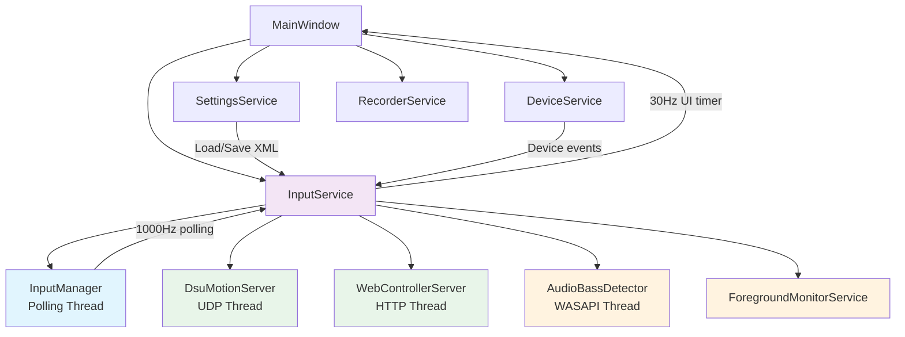

# Services Layer

*Five ViewModel-bridge services carry engine state to the WPF UI and back, with a bench of smaller workers beside them.*

Five service classes bridge **PadForge.Engine** with the **WPF UI layer** and get full sections on this page: `InputService`, `SettingsService`, `DeviceService`, `RecorderService`, and `ForegroundMonitorService`. They run on the WPF dispatcher thread unless noted otherwise. `PadForge.App/Services/` holds twenty-two more residents:

| Resident | Role |
|----------|------|
| `DsuMotionServer` | DSU motion server on its own UDP thread. Lifecycle [below](#dsu-server-lifecycle), protocol on [DSU Protocol Implementation](dsu-protocol.md) |
| `WebControllerServer` | Phone-as-controller HTTP/WebSocket server. Lifecycle [below](#web-controller-server-lifecycle) |
| `WebControllerTls` | The HTTPS lane for that server (#296). Generates a self-signed cert, installs it to `LocalMachine\My`, and binds it to the port through `netsh`. Motion sensors exist only in a secure context, so plain HTTP cannot carry gyro |
| `WebCustomLayoutStore` | The browser-built custom pad layouts (#296), machine-scoped. Holds one validated JSON array that rides `AppSettingsData` in PadForge.xml, deliberately not `ProfileData` |
| `QrCode` | Byte-mode QR generator ported from the Nayuki reference, used only to render the web controller's URL on the Dashboard card |
| `VoiceMacroService` | Voice macro recognition (#317). One session per microphone, no shared mic and no voice pseudo-device. Started and shut down by the engine's Step 1 device sweep, not by `InputService.Start()` |
| `VoskVoiceEngine` | The Vosk recognition engine behind the same session surface SAPI uses (#317). The model is an embedded resource, unpacked once to a re-creatable cache under TEMP because Vosk loads a model from a directory. Nothing is downloaded, so recognition works with no network. SAPI is the fallback until the unpack finishes |
| `NfcReaderService` | PC/SC monitor for NFC macro triggers (#150). [Below](#nfcreaderservice) |
| `WorkshopProfileMaterializer` | Workshop import to `ProfileData` bridge (#9). [Below](#workshopprofilematerializer-v41-9) |
| `WorkshopTuningApplier` | Folds a Workshop import's parked tuning stamps into the assigned device's own settings (#9). [Below](#workshoptuningapplier-v41-9) |
| `WiiPairingService` | In-app Bluetooth pairing ceremony for Wii controllers (#116), following the sequence Dolphin documents, over the Win32 Bluetooth API |
| `Ds3PairingService` | DualShock 3 guided USB pairing ceremony (#116): sixpair over WinUSB plus the radio-side device record BthPS3 needs |
| `Ds3DriverInstaller` | Installs and arms the embedded BthPS3 / BthPS3PSM drivers and binds a docked DS3 to WinUSB, reboot-free |
| `GyroCalibratorService` | Samples an at-rest controller and writes the per-(device, slot) gyro bias onto its `PadSetting` |
| `CursorControlService` | Owns the 200 Hz desktop-cursor timeline feeding the "Mouse Position X" / "Mouse Position Y" sources (#107) |
| `HeadsetTrackerRepair` | Rebinds a Sony headset whose head-tracker HID child is missing or parked at `CM_PROB_FAILED_START` (#188), ported from `sony-head-tracker`'s `bluetooth.cpp` |
| `StarterProfileCatalog` | Builds the bundled starter profiles (#256) in code as ordinary `ProfileData`, every source on the empty "(Any device)" GUID |
| `ExternalControlService` | Named-pipe profile control for launchers and scripts (#366). Detail on [External Control Internals](external-control-internals.md) |
| `ChromaLightbarService` | Mirrors a virtual Sony pad's lightbar into Razer Chroma (#373). Detail on [Lightbar Mirrors Internals](lightbar-mirrors-internals.md) |
| `LightsyncLightbarService` | The same mirror into Logitech LIGHTSYNC (#382). Detail on [Lightbar Mirrors Internals](lightbar-mirrors-internals.md) |
| `LogiLedEngineNative` | The registry-loader shim that finds and binds Logitech's LED engine DLL for that service |
| `SensaHapticsService` | Streams rumble into Razer Sensa HD haptics through the Interhaptics engine (#374). Detail on [Sensa Haptics Internals](sensa-haptics-internals.md) |

> **Engine-side subsystems (3.4).** Two more runtime subsystems sit alongside these services. `AudioPassthroughService` drives controller speaker output on its own worker and Bluetooth threads, and the Remote Link server runs the device-sharing transport. Both are wired through `InputService` and documented on their own pages: [Controller Audio Internals](controller-audio-internals.md) and [Remote Link Internals](remote-link-internals.md).

> **Head tracking (4.4.0, #355).** `HeadTrackingRuntime` and `HeadTrackerDevice` live in `PadForge.App/Common/Input/`, not in `Services/`, and `InputService` starts nothing for them. See [Head Tracking Internals](head-tracking-internals.md) for the runtime.

> **App-side helpers (3.6.0).** Five more App-side services and helpers, added in 3.6.0, run off the dispatcher thread on their own workers or as `static` P/Invoke surfaces. `HapticToneService` and `WiiSpeakerService` turn macro sounds into HD-haptic tones and Wii-speaker PCM. `NfcReaderService` (with `WinScard`) owns the PC/SC monitor for NFC macro triggers. `BluetoothLinkHelper` performs per-family Bluetooth disconnect. They live in `PadForge.Common.Input` (and `PadForge.Services` for `NfcReaderService`), and are documented in [App-Side Services and Helpers (3.6.0)](#app-side-services-and-helpers-360) below. 4.1.0 added three more to the same section: `TouchpadPulseService` (#219), `SwitchHomeLedSetter` (#226), and `RumbleAudioService` (#236, the Bass Shakers renderer). 4.3.0 added `SpaceMouseService` (#288), which opens 3Dconnexion 6DoF pucks directly and attaches them to SDL as virtual joysticks, because SDL's raw-input backend subscribes to the gamepad usage only and never turns a multi-axis controller into a joystick. It is owned by `InputManager`, not by `InputService`.



---

## Table of Contents

- [Architecture Overview](#architecture-overview)
- [Threading Model](#threading-model)
- [InputService](#inputservice)
  - [Constructor and Initialization](#constructor-and-initialization)
  - [Start / Stop / Dispose](#start-stop-dispose)
  - [30Hz UI Timer Tick](#30hz-ui-timer-tick)
  - [Dashboard Updates](#dashboard-updates)
  - [Devices Page Raw State](#devices-page-raw-state)
  - [Mapping Live Values](#mapping-live-values)
  - [Settings Sync (ViewModel to PadSetting)](#settings-sync-viewmodel-to-padsetting)
  - [Settings Forwarding (OnSettingsPropertyChanged)](#settings-forwarding-onsettingspropertychanged)
  - [Dashboard Forwarding (OnDashboardPropertyChanged)](#dashboard-forwarding-ondashboardpropertychanged)
  - [Engine Event Handlers](#engine-event-handlers)
  - [Device List Sync](#device-list-sync)
  - [Per-Device Settings Swap](#per-device-settings-swap)
  - [Copy / Paste Settings](#copy-paste-settings)
  - [Macro Snapshot Sync](#macro-snapshot-sync)
  - [Macro Trigger Recording](#macro-trigger-recording)
  - [DSU Server Lifecycle](#dsu-server-lifecycle)
  - [Web Controller Server Lifecycle](#web-controller-server-lifecycle)
  - [Audio Bass Detector Lifecycle](#audio-bass-detector-lifecycle)
  - [Device Hiding](#device-hiding)
  - [Auto-Idle](#auto-idle)
  - [Profile Switching](#profile-switching)
  - [Slot Reordering](#slot-reordering)
  - [Test Rumble](#test-rumble)
  - [All Public Methods](#inputservice-all-public-methods)
  - [All Events](#inputservice-all-events)
- [SettingsService](#settingsservice)
  - [Constructor and Initialization](#settingsservice-constructor-and-initialization)
  - [File Discovery](#file-discovery)
  - [Load](#load)
  - [Save](#save)
  - [MarkDirty and Autosave](#markdirty-and-autosave)
  - [Reset and Reload](#reset-and-reload)
  - [Profile Loading](#profile-loading)
  - [All Public Methods](#settingsservice-all-public-methods)
  - [All Events](#settingsservice-all-events)
- [DeviceService](#deviceservice)
  - [Constructor and Initialization](#deviceservice-constructor-and-initialization)
  - [Device Assignment](#device-assignment)
  - [Slot Management](#slot-management)
  - [Device Hiding Toggle](#device-hiding-toggle)
  - [All Public Methods](#deviceservice-all-public-methods)
  - [All Events](#deviceservice-all-events)
- [RecorderService](#recorderservice)
  - [Constructor](#recorderservice-constructor)
  - [Recording Flow](#recording-flow)
  - [Detection Algorithm](#detection-algorithm)
  - [All Public Methods](#recorderservice-all-public-methods)
  - [All Events](#recorderservice-all-events)
- [ForegroundMonitorService](#foregroundmonitorservice)
  - [How It Works](#how-it-works)
  - [All Public Methods](#foregroundmonitorservice-all-public-methods)
  - [All Events](#foregroundmonitorservice-all-events)
  - [The manual-switch funnel](#the-manual-switch-funnel)
- [App-Side Services and Helpers (3.6.0)](#app-side-services-and-helpers-360)
  - [HapticToneService](#haptictoneservice)
  - [TouchpadPulseService](#touchpadpulseservice)
  - [SwitchHomeLedSetter](#switchhomeledsetter)
  - [WiiSpeakerService](#wiispeakerservice)
  - [RumbleAudioService](#rumbleaudioservice)
  - [NfcReaderService](#nfcreaderservice)
  - [WinScard](#winscard)
  - [BluetoothLinkHelper](#bluetoothlinkhelper)
- [WorkshopProfileMaterializer (v4.1, #9)](#workshopprofilematerializer-v41-9)
- [WorkshopTuningApplier (v4.1, #9)](#workshoptuningapplier-v41-9)

---

## Architecture Overview

```
+-------------------+     30Hz Timer      +-------------------+
|   InputManager    | ==================> |   InputService    |
|  (background,     |   reads engine      |  (UI thread,      |
|   ~1000Hz poll)   |   state arrays      |   30Hz timer)     |
+-------------------+                     +---------+---------+
        ^                                           |
        |  writes PadSettings,                      | pushes to ViewModels
        |  slot types, macro snapshots              v
+-------------------+                     +-------------------+
| SettingsManager   |                     |   MainViewModel   |
|  (static, shared) | <================= |   PadViewModels   |
+-------------------+                     |   DashboardVM     |
        ^                                 |   DevicesVM       |
        |                                 |   SettingsVM      |
        |                                 +-------------------+
+-------------------+
| SettingsService   |
|  (XML load/save)  |
+-------------------+
```

### Data flow

| Direction | Mechanism | Frequency |
|-----------|-----------|-----------|
| Engine -> UI | InputService reads `CombinedOutputStates[]`, `FinalVibrationStates[]`, `SelectedDeviceVibrationStates[]`, `CombinedTouchpadStates[]`, `CombinedRawHidStates[]`, `CombinedMidiRawStates[]`, `CombinedKbmRawStates[]`, `CombinedVrRawStates[]` | 30 Hz (UI timer) |
| UI -> Engine | InputService writes `SlotControllerTypes[]`, `SlotProfileIds[]`, `MacroSnapshots[]`, `_midiConfigs[]`, `_kbmConfigs[]` (KBM SOCD #205), `_deviceSlotConfigs[]`, `_perDeviceSlotConfigs[]`, `SelectedDeviceGuids[]`, plus per-slot Extended config via `SyncExtendedConfigToSlot()` | 30 Hz (SyncViewModelToPadSettings) |
| UI -> PadSetting | InputService pushes deadzone, force feedback, mapping values to PadSetting objects | 30 Hz (SyncViewModelToPadSettings) |
| Engine event -> UI | `DevicesUpdated`, `FrequencyUpdated`, `ErrorOccurred` marshalled via `Dispatcher.BeginInvoke` | On engine event |
| Settings file -> Memory | SettingsService deserializes XML into SettingsManager collections | On load |
| Memory -> Settings file | SettingsService serializes SettingsManager + ViewModel state to XML | On MarkDirty (250 ms engine push, full save after 2 s quiet) |

> **Button SOCD (4.1.0, discussion #240).** KB+M slots get keyboard SOCD (#205) through the `_kbmConfigs[]` sync above. Controller slots (Xbox / PlayStation / Nintendo / Extended) have their own SOCD lane that bypasses the 30 Hz sync entirely: `MappingSet.SocdMode` / `SocdPairs` on the slot's MappingSet, read directly by the engine from `SettingsManager.SlotMappingSets` and applied to the slot's final combined output right before the Step 5 submit (`SlotButtonSocd`). Gamepad-surface slots pair buttons by mapping target name ("ButtonA:ButtonB"). Raw-surface slots (Extended, Nintendo) pair flat button indices ("12:13"). Pair semantics are the #205 `SocdCleaner` state machine: LastWins, Neutral, or FirstWins, with the winner's release re-pressing the still-held partner the same frame.

---

## Threading Model

PadForge uses three primary threads. Knowing which thread owns what prevents race conditions.

| Thread | Owner | Rate | Responsibilities |
|--------|-------|------|------------------|
| **UI thread** (WPF Dispatcher) | MainWindow | 30 Hz timer | All ViewModel property writes, device list sync, dashboard updates, macro recording, profile switching, settings forwarding |
| **Polling thread** | InputManager | ~1000 Hz | SDL input read, mapping, deadzone processing, virtual controller output, rumble, DSU broadcast |
| **Subsystem threads** | Various | Varies | DSU server (UDP), Web controller (HTTP/WebSocket), Audio bass detector (WASAPI), HidHide controller |

### Thread-safety conventions

| Data | Strategy |
|------|----------|
| **SettingsManager collections** (`UserDevices`, `UserSettings`) | `SyncRoot` lock on both UI and polling threads |
| **PadSetting string properties** | Atomic reference assignment. UI writes at 30 Hz, polling reads at ~870 Hz |
| **InputManager arrays** (`CombinedOutputStates[]`, `VibrationStates[]`, etc.) | Simple value copies, no locking |
| **Macro snapshots** | Atomic array reference swap by UI thread. Polling thread reads the reference |
| **Engine events** (`DevicesUpdated`, `FrequencyUpdated`) | Fire on polling thread, marshalled to UI via `Dispatcher.BeginInvoke` |

---

## InputService

**File:** `PadForge.App/Services/InputService.cs`
**Implements:** `IDisposable`

Central service bridging the InputManager engine with WPF ViewModels. Owns the InputManager instance, runs the 30 Hz UI timer, and manages all subsystem lifecycles (DSU, web server, audio bass detector, foreground monitor, device hiding).

### Constructor and Initialization

```csharp
public InputService(MainViewModel mainVm)
```

**Constructor:**
1. Stores `MainViewModel` reference, captures `Dispatcher.CurrentDispatcher`.
2. Subscribes to `Strings.CultureChanged` for language-change status refresh.
3. Subscribes to `SelectedDeviceChanged` and `MappingsRebuilt` on every `PadViewModel`.
4. Subscribes to `DevicesViewModel.PropertyChanged` for offline device detail display.
5. Initializes `_previousSelectedDevice` dictionary (tracks per-pad device GUID for save-before-switch).

### Start / Stop / Dispose

#### `Start()`

Startup sequence:

1. **Heal the slot topology**. `CompactSlotsForGaps()` closes pad-index gaps left by saves taken before compaction-on-delete landed, before the engine or the default snapshot sees the layout.
2. **Rebuild shift-layer tabs**. Each pad's tab strip is rebuilt from its loaded `MappingSet.ShiftActivators`, because PadViewModel constructors run before `SettingsService` parsed PadForge.xml.
3. **Reset macro runtime latches**. Every macro's trigger latches and every action's toggle latches are cleared, so a Toggle left latched at the previous stop cannot re-fire with no input.
4. **Create InputManager**. `ApplyEffectivePollingRate()` sets `PollingIntervalMs` through the #365 resolver, so an active profile's polling override outranks `SettingsViewModel.PollingRateMs`. `HmInactivityTimeoutSeconds` comes from `HmInactivityDestroyTimeoutSeconds`.
5. **Copy slot config**. Copies `SlotControllerTypes[]`, `SlotProfileIds[]`, Extended/MIDI/KBM configs, and the per-slot and per-device config bags from PadViewModels to the engine.
6. **Subscribe to the source registries**. `NfcTagRegistry.RegistryChanged` (#150), `VoicePhraseRegistry.RegistryChanged` (#317), and both `HandheldButtonRegistry.RegistryChanged` and `HandheldButtonRegistry.ActivityChanged` (#353). On an NFC tag register or remove, the handler re-reads each reader's `DeviceObjects` under `UserDevices.SyncRoot`, rebuilds every pad's input picker off the lock so the named tag appears or disappears as a bindable row, and refreshes the Devices-page tag preview if a reader is selected. Subscribed here, after settings load, so the load-time registry fan-out is not double-handled. `SdlDeviceWrapper.ExternalVoiceAugment` is pointed at `VoicePulse.Apply` in the same block. All four subscriptions are torn down in `Stop()`.
7. **Subscribe to engine events**. `DevicesUpdated`, `FrequencyUpdated`, `ErrorOccurred`, `HmVcInactivityDestroyed`, `HmVcWentNonActive`.
8. **Wire the static providers**. The `UserEffectsDispatcher` rumble / trigger / battery / test-target lambdas, the `SourceCoercion` gyro, gravity, balance, IR, gesture and menu providers, the `AudioPassthroughService` and `HapticToneService` hooks, and `InputManager.PointerModeCycleApply` / `GuideLedApply` / `GyroRecenterApply`. All are cleared again in `Stop()`.
9. **Create CursorControlService**. The 200 Hz cursor sampler backing the Mouse Position sources (#107).
10. **Start the self-healing sink workers**, unconditionally (cheap when nothing is configured): `RumbleAudioService.EnsureStarted()` (#236), `WiiSpeakerService.EnsureStarted()`, `HapticToneService.EnsureStarted()`. A one-shot `Reconcile()` on `AudioPassthroughService`, `WiiSpeakerService` and `HapticToneService` runs between them, and only when some device already has `AudioPassthroughEnabled`, so the audio threads stay off for users who never turn a mirror on.
11. **Subscribe to ViewModel changes**. `SettingsViewModel.PropertyChanged`, `DashboardViewModel.PropertyChanged`, and the touchpad-gesture provider / applier hooks on `SettingsService`.
12. **Create ForegroundMonitorService**. Subscribes `ProfileSwitchRequired` to `OnAutoProfileSwitchRequired`.
13. **Start the opt-in side services**, each behind its own setting: `StartExternalControlIfEnabled()` (#366), `StartChromaIfEnabled()` (#373), `StartLightsyncIfEnabled()` (#382), `StartSensaIfEnabled()` (#374).
14. **Capture default profile snapshot**. Uses `PendingDefaultSnapshot` (from prior XML) or creates one via `SnapshotCurrentProfile()`.
15. **Start engine**. `_inputManager.Start()` launches the polling thread.
16. **Start subsystems**. DSU, web controller, Remote Link, touchpad overlay, and the audio bass detector, each conditional on its Dashboard setting.
17. **Clear stale HidHide state**. `HidHideController.ClearAll()` removes leftover entries, unless `KeepHidHideCloaksBetweenLaunches` is on.
18. **Apply device hiding**. HidHide blacklist + input hooks.
19. **Start UI timer**. 30 Hz `DispatcherTimer` at `DispatcherPriority.Render` (`UiTimerIntervalMs` = 33).
20. **Update state**. Sets `IsEngineRunning = true`, refreshes commands, and runs `UpdateIdleState()` so an empty config starts idle.
21. **Run a pending command-line profile command**. `App.PendingProfileCommand` is cleared and handed to `ExecuteExternalControlCommand`. `App.ParseProfileCommand` maps `--profile "Name"` to `activate Name` and `--default-profile` to `deactivate`, so a cold start carrying either argument applies it once the engine exists (#366). A second instance forwards the same string over the pipe instead.

Raw Input enumeration is not part of this sequence. Keyboards, mice, and consumer-control devices are enumerated by the engine's Step 1 (`InputManager.Step1.UpdateDevices.cs`): synchronously on the first cycle so devices exist before Step 2, then on a `Task.Run` worker whose results the next 2-second cycle consumes.

#### `Stop()`

1. Latches `_stopped` with `Interlocked.Exchange` so a second call returns immediately, then calls `BluetoothLinkHelper.ReEnablePendingDevNodes()`.
2. On the dispatcher: stops the UI timer and unsubscribes its Tick, clears every mapping row's `IsInputActive` and each pad's pipeline liveness flags, unsubscribes `SettingsViewModel.PropertyChanged` and `DashboardViewModel.PropertyChanged`, and closes the touchpad, VC-toggle, shift-layer, and menu overlay windows.
3. Leaves the constructor-only handlers subscribed on purpose: `Devices.PropertyChanged` and the per-pad `SelectedDeviceChanged` / `MappingsRebuilt` / `LayerActivated`. `Start()` never re-adds them, so tearing them down on an engine stop would break device selection and mapping rebuilds until the app restarts.
4. Unsubscribes `ForegroundMonitorService.ProfileSwitchRequired` and drops the instance.
5. Stops the opt-in side services (external control, Chroma, LIGHTSYNC, Sensa), then the DSU server, the web controller server, Remote Link, and the audio bass detector.
6. Calls `RemoveDeviceHiding(keepCloaks: Settings.KeepHidHideCloaksBetweenLaunches)`, so the persistent-cloaks setting is honored on shutdown while a mid-session `EnableInputHiding` toggle still decloaks immediately.
7. Unsubscribes all four source registries (`NfcTagRegistry.RegistryChanged`, `VoicePhraseRegistry.RegistryChanged`, `HandheldButtonRegistry.RegistryChanged` and `.ActivityChanged`) and the engine events, drops the per-pad device-config and assign-offer handlers, calls `_inputManager.Stop()` and `_inputManager.Dispose()`, then nulls every static provider it wired in `Start()`, disarms the Switch NFC and Joy-Con IR hints, and disposes `CursorControlService`. `UpdateHeadTrackingStatus()` is re-run on the dispatcher so the Dashboard's head-tracking row goes cold with the engine.
8. Marshals back to the dispatcher for the final ViewModel state: engine status "Stopped", zeroed frequency and counts, cleared initializing / create-failed indicators, and every device row marked offline.

The v2 `preserveExtendedNodes` parameter is gone. HIDMaestro creates and destroys virtual devices dynamically, so there's no need for the v2-era "keep the vJoy node alive across a restart" path.

#### `Dispose()`

Calls `Stop()` in a try/catch (best-effort shutdown).

### 30Hz UI Timer Tick

`UiTimer_Tick` is the service layer heartbeat. Called ~30 times/second on the UI thread, it runs these steps in sequence:

```
UiTimer_Tick
  |-- Pending profile switch          [PendingProfileSwitchId, set by a shortcut activator]
  |-- Pending window toggle           [PendingToggleWindow]
  |-- Pending bulk VC toggle          [PendingToggleVCsDisabled, #91]
  |-- Update Pad ViewModels (gamepad state, vibration, raw HID / MIDI / KBM / VR state)
  |-- UpdateDashboard()               [skipped while the app is background-gated]
  |-- UpdateShiftLayerFlyout()        [SHIFT layer HUD, gated by EnableShiftLayerFlyout]
  |-- UpdateMenuOverlayWindow()       [radial / touch menu HUD, gated by EnableMenuOverlay]
  |-- UpdateDevicesRawState()         [only if Devices page visible]
  |-- UpdateMappingLiveValues()       [only if a Pad page visible]
  |-- Battery UI refresh (5 s) and Guide-LED reapply (30 s)
  |-- UpdateMacroTriggerRecording()   [only if recording active]
  |-- UpdateExpressionVariableRecording()
  |-- SyncViewModelToPadSettings()    [always, 30Hz]
  |-- SyncMacroSnapshots()            [always, 30Hz]
  |-- Audio rumble level meters       [only if detector active]
  |-- UpdateIdleState()               [auto-idle when no active slots]
  |-- ForegroundMonitor.CheckForegroundWindow()  [auto-profile switching]
```

#### Pad ViewModel updates (per slot)

For each of the 16 slots:

| Slot type | Source array | Update call |
|-----------|-------------|-------------|
| All | `CombinedOutputStates[i]`, `FinalVibrationStates[i]` (slot max, preview tab), `SelectedDeviceVibrationStates[i]` (FFB tab) | `padVm.UpdateFromEngineState()` |
| All | `CombinedTouchpadStates[i]` | `padVm.UpdateFromTouchpadState()` |
| Raw-HID surface (Extended, Nintendo), gated on `SlotRawHidSurface[i]` | `CombinedRawHidStates[i]` | `padVm.UpdateFromRawHidState()` |
| MIDI | `CombinedMidiRawStates[i]` | `padVm.UpdateFromMidiRawState()` |
| KB+M | `CombinedKbmRawStates[i]` | Sets `padVm.KbmOutputSnapshot` |
| VR | `CombinedVrRawStates[i]` | Sets `padVm.VrOutputSnapshot` |

The whole per-pad mirror block is skipped while the window is minimized (`AmbientMotionProbe.IsWindowMinimized`), because none of it can render. The `UpdateFrom*` mirrors do their own shadow-array change detection, so the first tick after restore refreshes in full.

Per-device stick/trigger previews read either KBM pre-deadzone values (synthesized into a `Gamepad` struct) or the selected device's `RawMappedState`.

KB+M cursor and scroll outputs are time-based rates, not per-poll displacements (4.1.0): full stick deflection moves the cursor at 1,200 px/s (`KeyboardMouseVirtualController.MouseFullScalePxPerSec`, the DS4Windows stick-as-mouse scale) and turns the wheel at ~33 notches/s, independent of the polling-rate setting. The per-stick KBM speed knob scales from those constants.

#### Visibility gating

Two flags gate expensive per-frame work:

| Flag | When true |
|------|-----------|
| **`IsDevicesPageVisible`** | Calls `UpdateDevicesRawState()` |
| **`IsPadPageVisible`** | Calls `UpdateMappingLiveValues()` |

Both are set by MainWindow navigation.

#### Menu overlay window (4.1.0, #9 B-17)

`UpdateMenuOverlayWindow()` pulls the poll thread's engaged-menu snapshot (`InputManager.ActiveMenuOverlay`, first-engaged menu wins) and drives the click-through `MenuOverlayWindow` HUD: lazily created on first engage, hidden when no menu is engaged, when `DashboardViewModel.EnableMenuOverlay` (default `true`) is off, or when the snapshot's `StampMs` is more than 250 ms old. That staleness gate is what takes the HUD down after a deleted, disabled, or emptied menu stops refreshing its snapshot without ever clearing it. Menus keep committing blind when the overlay is disabled. The read side is wired at engine start beside the touchpad and mouse gesture fired providers: `SourceCoercion.MenuItemFiredProvider` maps to `InputManager.IsMenuItemFired`, through which mapping rows, shift activators, and macro descriptor triggers all read fired menu items. Cleared with the other providers at `Stop()`.

### Dashboard Updates

#### `UpdateDashboard()` (private, 30Hz)

Pushes engine statistics to `DashboardViewModel`: state key ("Running"/"Idle"/"Stopped"), localized status, `PollingFrequency`, and device counts (`TotalDevices`, `OnlineDevices`, `MappedDevices`) computed under `UserDevices.SyncRoot` lock. Calls `RefreshSlotSummaryProperties()` and `RefreshNavItemConnectedCounts()`.

#### `RefreshSlotSummaryProperties(IEnumerable<UserDevice> devices = null)` (public)

Updates all `SlotSummary` items on the dashboard with per-slot status (`IsActive`, `DeviceName`, `MappedDeviceCount`, `ConnectedDeviceCount`, `IsVirtualControllerConnected`, `IsInitializing`, `IsEnabled`, `StatusText`) and per-type numbering (e.g., "Xbox 1", "PlayStation 2").

#### `RefreshNavItemConnectedCounts(IEnumerable<UserDevice>)` (private)

Updates sidebar `NavControllerItem.ConnectedDeviceCount` and `IsInitializing` for power icon color logic.

### Devices Page Raw State

#### `UpdateDevicesRawState()` (private, 30Hz, gated by `IsDevicesPageVisible`)

Updates the raw input state display for the selected device:
1. Finds `UserDevice` for the selected `DeviceRowViewModel`.
2. On device change: rebuilds axis/button/POV collections via `devVm.RebuildRawStateCollections()`.
3. Updates axes in-place (`NormalizedValue = Axis[i] / 65535.0`), buttons, keyboard keys, POV hats, mouse motion/scroll, and gyro/accel (if supported).

#### `OnDevicesVmPropertyChanged()` (private)

Handles `SelectedDevice` changes when the engine is not running. Populates the detail panel from cached `UserDevice` capabilities so the layout is visible offline.

### Mapping Live Values

#### `UpdateMappingLiveValues()` (private, 30Hz, gated by `IsPadPageVisible`)

For the active Pad page: finds the selected device, parses each `MappingItem.SourceDescriptor`, reads the raw value from `CustomInputState`, and sets `mapping.CurrentValueText`.

#### `ReadMappedValue(CustomInputState, string descriptor)` (private, static)

Simplified Step 3 parser for display. Strips the I / H / IH prefixes (honoring `SourceCoercion.IsPrefixExemptDescriptor`), decodes the touchpad family first ("Touchpad N Click", "Touchpad N Finger M X|Y|Pressure|Down", plus the #9 B-1 half-region variants), then parses "Axis N", "Button N", "Slider N", "POV N" and reads from the state arrays.

### Settings Sync (ViewModel to PadSetting)

#### `SyncViewModelToPadSettings()` (private, 30Hz)

Primary runtime sync path. For each pad slot:

1. **Always synced** (even with no device selected):
   - `SlotControllerTypes[i]` from `padVm.OutputType` and `SlotProfileIds[i]` from `padVm.ProfileId`
   - Extended config via `SyncExtendedConfigToSlot()`
   - MIDI, KBM, per-slot device config, and the per-(slot, device) config dictionary via `_midiConfigs[i]`, `_kbmConfigs[i]`, `_deviceSlotConfigs[i]`, `_perDeviceSlotConfigs[i]`
   - `SelectedDeviceGuids[i]`, cleared to `Guid.Empty` when the slot has no selection

2. **Per-device sync** (when a device is selected), dirty-gated:
   - Runs only when `padVm.SettingsSyncDirty` is set, the selected device changed, or the `PadSetting` instance itself was replaced (a device re-add rebuilds it). Idle pads raise no PropertyChanged, so the roughly eighty `ToString` writes never run on a quiet tick.
   - Calls `SaveViewModelToPadSetting(padVm, instanceGuid, syncMappings: false)`
   - Pushes deadzones (independent X/Y), anti-deadzones, linear, center offsets, max range (independent directions), trigger deadzones, force feedback gains, audio rumble settings
   - **Mapping descriptors are NOT synced** at 30 Hz to avoid a race condition. `ClearMappingDescriptors()` creates a window where the polling thread sees empty mappings

3. **Audio bass detector lifecycle**: detects when `AudioRumbleEnabled` or `AudioRumbleTriggersEnabled` toggles on any created slot and calls `SyncAudioBassDetector()`.

#### `SaveViewModelToPadSetting(PadViewModel, Guid, bool syncMappings)` (private, static)

Writes all tuning parameters from ViewModel to PadSetting. When `syncMappings` is true (explicit save, preset change, device switch), also clears and rewrites all mapping descriptors.

#### `LoadPadSettingToViewModel(PadViewModel, Guid)` (internal, static)

Reverse direction: reads PadSetting and populates the PadViewModel (deadzones, sensitivity curves, max ranges, center offsets, triggers, force feedback, audio rumble, mapping descriptors).

### Settings Forwarding (OnSettingsPropertyChanged)

```csharp
private void OnSettingsPropertyChanged(object sender, PropertyChangedEventArgs e)
```

Propagates `SettingsViewModel` changes to the engine at runtime:

| Property | Action |
|----------|--------|
| `PollingRateMs` | Sets `_inputManager.PollingIntervalMs` |
| `HmInactivityDestroyTimeoutSeconds` | Sets `_inputManager.HmInactivityTimeoutSeconds` |
| `EnableInputHiding` | Calls `ApplyDeviceHiding()` or `RemoveDeviceHiding()` |

### Dashboard Forwarding (OnDashboardPropertyChanged)

```csharp
private void OnDashboardPropertyChanged(object sender, PropertyChangedEventArgs e)
```

Propagates `DashboardViewModel` changes:

| Property | Action |
|----------|--------|
| `EnableDsuMotionServer` | Starts or stops DSU server |
| `DsuMotionServerPort` | Restarts DSU server if enabled |
| `EnableWebController` | Starts or stops web controller server |
| `WebControllerPort` | Restarts web controller server if enabled |
| `EnableRemoteLink` | Starts or stops the Remote Link server (#138) |
| `RemoteLinkPort` | Restarts Remote Link if enabled |
| `EnableTouchpadOverlay` | Shows or hides the touchpad overlay window |
| `TouchpadOverlayOpacity` | Sets the live overlay's surface opacity |

### Engine Event Handlers

All fire on the **polling thread** and are marshalled to UI via `Dispatcher.BeginInvoke`.

| Handler | Action |
|---------|--------|
| `OnDevicesUpdated` | `SyncDevicesList()`, `RefreshVoiceObjects()`, `UpdatePadDeviceInfo()`, `EvaluateAssignOffers()` (after the rosters, so "slot has devices" reads this walk's truth), a `BuildDeviceRegistrySignature()` diff that calls `MarkDirty()` only when the registry actually changed, `ApplyDeviceHiding()`, `ReseedPlayerIdentities(applySonyDispatchers: false)` (#191), `ApplyGuideLeds()` (#209), then a re-attach + `ReApplyUserEffects()` pass over every HM VC plus `ReApplyNonHmUserEffects()`, repeated on a delayed burst at 250 / 750 / 1500 / 3000 / 6000 / 12000 / 15000 ms so SDL's PS5 player-default lightbar writes lose |
| `OnFrequencyUpdated` | No-op (frequency read on next UI tick) |
| `OnErrorOccurred` | `_mainVm.SetStatus(..., persist: true)` |
| `OnHmVcInactivityDestroyed` | Raises `SlotInactivityTimedOut` so MainWindow tears the slot down and runs the cascade (#206) |
| `OnHmVcWentNonActive` | Runs the bubble-down cascade + `UpdatePadDeviceInfo()` after a non-delete VC teardown, sidebar disable or all-devices-unassigned (#206) |

### Device List Sync

#### `SyncDevicesList()` (private)

Synchronizes `DevicesViewModel.Devices` with `SettingsManager.UserDevices`:
1. Snapshots under lock.
2. Updates existing rows, adds new ones (skips virtual/shadow devices).
3. Removes stale or virtual rows.
4. Sorts physical devices first and merged `aggregate://` sources last, then by name, then VID:PID.
5. Calls `devVm.RefreshCounts()`.

#### `IsVirtualOrShadowDevice(UserDevice)` (private, static)

Filters legacy and shadow virtual controllers from the Devices-page list (defense-in-depth: Step 1 already filters HIDMaestro upstream). Returns true when any of these match on an online device: name contains "ViGEm" or "Virtual Gamepad" (case-insensitive), device path lowercase contains "vigem" or "virtual", or the device has `IsHidden = true`. Offline devices always return false because virtual controllers only exist while the engine is running.

#### `PopulateDeviceRow(DeviceRowViewModel, UserDevice)` (private)

Maps UserDevice properties to the ViewModel row: name, VID/PID, online status, capabilities, device type, slot assignments, HidHide state, instance path.

#### `UpdatePadDeviceInfo()` (public)

Rebuilds each PadViewModel's `MappedDevices` from `UserSettings.FindByPadIndex()`. Handles multi-device slots, auto-selects first device, refreshes sidebar and dashboard.

### Per-Device Settings Swap

#### `PopulateAvailableInputs(PadViewModel padVm, UserDevice ud)` (private)

Builds the input source dropdown for a pad slot. The list is cross-device and flat, ordered primary-device-first so the picker's group headers come out in slot-display order, and it always leads with the "(Any device)" group carrying the device-agnostic descriptors (the abstract `Gamepad *` family, gyro, the touchpad families) on the empty DeviceGuid. Per-device entries come from `MappingDisplayResolver.BuildInputChoices`, which prefers the live wrapper's sparse `SupportedButtonIndices` / `SupportedAxisIndices` so a device that populates only specific slots does not surface phantom "Button N" or "Axis N" rows, falls back to the positions `UserDevice` recorded when the device was last online (`CapButtonIndices` / `CapAxisIndices`, discussion #344), and reaches the dense `Math.Max(CapButtonCount, RawButtonCount)` / `CapAxeCount` range only for a device never seen online. Menu-item sources (#9 B-17) and enabled custom touchpad gestures are appended per device. The same flat list feeds `padVm.SlotAvailableInputs` (the Gyro tab's Aim Engage picker, trigger-route activators, mirror engage, mouse-gesture engage) and the macro trigger dropdown.

#### `RefreshMappingDropdowns()` (public)

Called when `ForceRawJoystickMode` is toggled on a device. Rebuilds the input source dropdown and mapping descriptors for all pad slots using that device, reflecting the change in available raw vs. gamepad inputs.

#### `OnSelectedDeviceChanged(object sender, PadViewModel.MappedDeviceInfo newDevice)` (private)

When the user selects a different device in a pad slot's dropdown:
1. **Saves** current ViewModel values to the previous device's PadSetting (skipped when re-adding the same device).
2. **Loads** the new device's PadSetting via `LoadPadSettingToViewModel()`.
3. Populates input dropdown via `PopulateAvailableInputs()`.
4. Updates the `_previousSelectedDevice` tracker.

#### `OnMappingsRebuilt(object sender, EventArgs e)` (private)

When mappings are rebuilt (OutputType or HIDMaestro profile change), reloads mapping descriptors from PadSetting without touching deadzone or force feedback settings.

### Copy / Paste Settings

#### `ApplyPadSettingToCurrentDevice(int padIndex, PadSetting source)` (public)

Applies a source PadSetting to the selected device. Used by Paste and "Copy From".

#### `ApplyPadSettingToCurrentDeviceTranslated(...)` (public)

Applies with cross-layout translation (e.g., Xbox to Extended mapping key conversion).

#### `BuildPerDeviceSettingsSnapshot(int sourcePadIndex, VirtualControllerType layoutType, bool layoutIsExtended)` (public static)

Snapshots every assigned device's full PadSetting on the source slot into a `PerDeviceSettingsEntry[]`. Each entry carries the device's `InstanceGuid`, `ProductGuid`, `ProductName`, and a nested `PadSettingJson` produced by `PadSetting.ToJson()` after clearing the outer-only slot-level payloads (`SlotDeviceConfigsJson`, `SlotExtendedConfigJson`, `SlotMidiConfigJson`, `SlotKbmConfigJson`, `SlotPerDeviceSettingsJson`, `SlotMultiSourceRows`, `DeviceScopedMultiSourceRows`) so the nesting doesn't recurse. Returns null when the source slot has zero UserSettings. The clipboard JSON path serializes the returned array as `__SlotPerDeviceSettings` on the wrapping PadSetting.

#### `ApplyPerDeviceSettingsToSlot(int targetPadIndex, PerDeviceSettingsEntry[] entries, VirtualControllerType sourceLayoutType, bool sourceLayoutIsExtended, VirtualControllerType targetLayoutType, bool targetLayoutIsExtended)` (public)

Applies the per-device payload to a target slot. Iterates each entry, matches it to a target-slot device by `InstanceGuid` first (perfect round-trip on the same machine), then `ProductGuid` as a fallback (same controller model, different physical unit). Entries that match nothing are skipped. Paste never auto-creates devices. Each matched entry's nested PadSetting is reapplied via `ApplyPadSettingToCurrentDeviceTranslated` per device, so cross-layout pastes (e.g. Xbox→PS) still get the layout translation that single-device paste enjoys. The outer Copy / Paste flow's wholesale MappingSet replacement runs before this helper. This method only carries per-device tuning (deadzones, sensitivity, FFB, gyro, impulse triggers, adaptive triggers, lighting, TouchpadSettings).

#### `FlushAllPadViewModels()` (public)

Flushes all active PadViewModel state to PadSettings. Call before reading PadSettings across slots (e.g., Copy From dialog).

#### `GetCurrentPadSetting(int padIndex)` (public)

Returns the PadSetting for the selected device after syncing ViewModel state.

### Macro Snapshot Sync

#### `SyncMacroSnapshots()` (private, 30Hz)

Creates a snapshot array of `MacroItem` objects per slot and assigns it to `_inputManager.MacroSnapshots[i]`. The engine reads these atomically each cycle. Empty lists set the snapshot to null.

### Macro Trigger Recording

#### `StartMacroTriggerRecording(MacroItem macro, int padIndex)` (public)

Starts recording button/axis/POV presses for a macro trigger combo. Captures axis baselines for delta detection.

#### `StopMacroTriggerRecording()` (public)

Finalizes recording. Writes accumulated data to the MacroItem by trigger path:

| Path | Data written |
|------|-------------|
| InputDevice | Raw device buttons (`TriggerRawButtons`) + device GUID |
| Custom Extended | Numbered button words (`TriggerCustomButtonWords`) |
| OutputController | Xbox button bitmask (`TriggerButtons`) |

Also writes axis targets/directions and POV triggers.

#### `UpdateMacroTriggerRecording()` (private, 30Hz)

Called each UI tick during recording. Reads state per `TriggerSource`:

| Source | Behavior |
|--------|----------|
| InputDevice | Scans raw buttons/POVs from mapped devices. First press locks `_recordingDeviceGuid` |
| Numbered (custom Extended) | Accumulates from `CombinedRawHidStates` |
| OutputController | Accumulates from `CombinedOutputStates` Xbox button bitmask |

Axis detection: 25% threshold, 3-cycle hold confirmation (same as RecorderService).

### DSU Server Lifecycle

#### `StartDsuServerIfEnabled()` (private)

1. Checks `Dashboard.EnableDsuMotionServer` and engine existence.
2. Creates `DsuMotionServer`, subscribes to `StatusChanged`.
3. Validates port (1024-65535, default 26760).
4. Starts server. On success it assigns to `_inputManager.DsuServer`. On failure it disposes.

#### `StopDsuServer()` (private)

1. Clears `_inputManager.DsuServer`.
2. Disposes server instance.

### Web Controller Server Lifecycle

#### `StartWebServerIfEnabled()` (private)

1. Checks `Dashboard.EnableWebController` and engine existence. Returns early if a server is already running.
2. Creates `WebControllerServer`, subscribes to `StatusChanged`, `DeviceConnected`, `DeviceDisconnected`.
3. Device connect/disconnect calls `_inputManager.RegisterExternalDevice()` / `UnregisterExternalDevice()`.
4. Validates port (1024-65535, default 8080).
5. Calls `Start(port)` on a `Task.Run`, not on the UI thread. `WebControllerTls.EnsureHttpsBinding` spawns `netsh` up to four times (show, delete, add, show), each capped at five seconds, and this method is reached straight from the checkbox's `PropertyChanged` handler. The firewall rule's own two spawns already run on the thread pool. It then hops back to the dispatcher, and if the start failed or the user has since toggled off or changed the port, it disposes the launching instance and clears `IsWebControllerRunning`.

`OnWebServerStatusChanged` publishes `WebControllerStatus`, `WebControllerClientCount`, and `IsWebControllerRunning` (from the lifecycle, never from the checkbox). It also publishes `WebControllerUrl` and rebuilds `WebControllerQr` through `WebControllerServer.RenderQr`, but only when the URL actually changed, since building a QR matrix is not free.

`WebControllerServer` itself caps at 16 clients, serves its browser assets from embedded resources under the `PadForge.WebAssets.` prefix, and asks `WebControllerTls.EnsureHttpsBinding(port)` for a certificate. That helper never deletes an sslcert binding it does not own (identified by PadForge's own `appid` GUID) and returns null on any failure, in which case the server falls back to plain HTTP. HTTPS matters because `DeviceMotionEvent` exists only in a secure context, so gyro from a phone requires it.

#### `StopWebServer()` (private)

Unsubscribes from `StatusChanged`, disposes server, clears status and client count.

### Audio Bass Detector Lifecycle

#### `SyncAudioBassDetector()` (internal)

Called on engine start, slot changes, and during 30 Hz sync when `AudioRumbleEnabled` toggles. Starts the detector if any slot enables audio rumble. Stops it if none do.

#### `StartAudioBassDetector()` (private)

Creates and starts `AudioBassDetector`. On success it assigns to `_inputManager.AudioBassDetector`. On failure it disposes.

#### `StopAudioBassDetector()` (private)

Clears `_inputManager.AudioBassDetector`, disposes detector, zeros all pad level meters.

#### Audio rumble level meter update (in UiTimer_Tick)

When `_audioBassDetector != null`, reads `BassEnergy` and pushes to `padVm.AudioRumbleLevelMeter` for each created slot with `AudioRumbleEnabled`.

### Device Hiding

#### `ApplyDeviceHiding()` (public)

Only acts if `EnableInputHiding` is on. Two mechanisms:

**HidHide (driver-level):**
1. Builds whitelist (PadForge exe + user paths). `SyncWhitelist()` adds/removes only PadForge-managed entries.
2. For each `UserDevice` with `HidHideEnabled`: converts `DevicePath` to HID instance ID (fallback: VID/PID lookup for synthetic paths like "XInput#0"). Caches resolved IDs for offline pre-emptive blacklisting.
3. `HidHideController.SyncManagedDevices(desiredIds)`. Atomic diff-based sync.
4. Activates cloaking if any devices are blacklisted.

**Input hooks (keyboard/mouse):**
1. For each device with `ConsumeInputEnabled` and a slot assignment: parses "Button {index}" descriptors to collect VKey codes or mouse button IDs.
2. Creates/updates `InputHookManager` if inputs need suppressing. Otherwise stops and disposes it.

#### `RemoveDeviceHiding(bool keepCloaks = false)` (public)

Calls `HidHideController.RemoveManagedDevices()` (best-effort), stops and disposes `InputHookManager`. With `keepCloaks: true` the HidHide blacklist removal and whitelist-tracking clear are skipped, so only the input hooks tear down.

#### `SyncWhitelist(HashSet<string> desiredWinPaths)` (private)

Converts Windows paths to DOS device paths. Only modifies PadForge-managed entries. Entries from HidHide Client or other tools are left untouched. Tracked via `_managedWhitelistDosPaths`.

### Auto-Idle

#### `UpdateIdleState()` (private, 30Hz)

Sets `_inputManager.IsIdle`. A slot counts as active when it is created, enabled, and has an **online** mapped device, so a slot whose every assigned pad is asleep idles the engine instead of reading as "Forging". Two overrides keep the engine awake with no active slot: a Remote Link server with live connections, and a pending HM teardown inside the inactivity window. Idle mode skips input/mapping/output and sleeps at ~20 Hz, reducing CPU to ~0%. Device enumeration continues at a reduced rate, every 5000 ms against the running loop's `EnumerationIntervalMs` of 2000, so new controllers still appear on the Devices page.

### Profile Switching

#### `SnapshotCurrentProfile()` (public) -> `ProfileData`

Captures current runtime state:
1. Flushes all PadViewModel values to PadSettings.
2. Collects `ProfileEntry` (InstanceGuid, ProductGuid, MapTo, checksum) and deduplicated `PadSetting` clones.
3. Captures `SlotCreated[]`, `SlotEnabled[]`, `SlotControllerTypes[]`, `SlotProfileIds[]` (per-slot HIDMaestro profile slug), a deep clone of every slot's `MappingSet`, the Extended / MIDI / KBM / per-device slot configs, DSU and web server settings (Remote Link is app-scoped, not per profile), all seven per-group slot orders (Xbox, PlayStation, Nintendo, Extended, Keyboard + Mouse, MIDI, VR), and the overlay settings (touchpad geometry and opacity, menu overlay, shift-layer flyout, profile overlay).
4. Captures `ProfileData.Macros` (`<ProfileMacros>`), a copy of the current macro set. A profile carries its own macros, so switching profiles swaps macros too. A `null` `Macros` marks a pre-macro-era profile and leaves the live macros untouched on apply.

#### `ApplyProfile(ProfileData profile)` (public)

Restores a profile, in this order:

1. **Clear the carried runtime.** `InputManager.ClearAllShiftRuntime()` drops toggle latches, was-down markers, the engagement stack and custom-layer state, so a held activator at swap time cannot leave the new profile mid-engagement. `SourceCoercion.ResetMcuDemandLatches()` frees the camera for NFC immediately instead of after a stale latch lapses (#248). `_inputManager?.ResetMenuRuntime()` drops menu contexts keyed on (slot, device, menu id), which would otherwise let the new profile's cell actions fire from the old profile's in-flight gesture.
2. **Restore the MappingSets by deep clone.** `SettingsManager.SlotMappingSets[s] = CloneMappingSetDeep(profile.SlotMappingSets[s])` (#61), so live mutations (auto-map on reassignment, in-tab edits) cannot poison the stored snapshot. A null `SlotMappingSets` marks a profile saved before multi-source rows landed and leaves the live array alone.
3. **Rebuild the gesture catalog.** `ApplyProfileTouchpadGestures(profile)` compiles the in-box templates plus this profile's recorded ones and swaps them onto the InputManager atomically.
4. **Topology**. Sets `SlotCreated[]`, `SlotEnabled[]`, `OutputType`, `ProfileId` (per-slot HM profile slug), and unassigns devices from destroyed slots. The HM slug update gates Step 5's per-slot diff: `UpdateVirtualDevices()` Pass 1 in `InputManager.Step5.VirtualDevices.cs` compares each slot's `SlotProfileIds[]` against the live `HMaestroVirtualController.ProfileId`. Slots whose new slug matches stay live untouched. Slots whose slug differs are destroyed and recreated with the new identity.
5. **Device assignments (single-pass transition)**. Builds the desired final assignment map from `profile.Entries` first, then transitions each `UserSetting` directly old → new `MapTo` (or → -1 for entries dropped from the new profile). The "find UserSetting" gate is "not yet consumed by a prior entry in this same apply pass," not the previous reset-MapTo-to-negative gate. This avoids the reset window where the polling thread could observe `HasAnyDeviceMapped == false` for surviving slots and fall into the `!HasAnyDeviceMapped` immediate-destroy branch of `UpdateVirtualDevices()` in `InputManager.Step5.VirtualDevices.cs`. Slots whose mapping is unchanged across profiles transition with zero teardown.
6. **Device-GUID remap for same-product reconnects**. When an entry binds by `ProductGuid` rather than `InstanceGuid`, the pairing is recorded and `RemapDeviceGuidsInSlotMappingSets` re-points the just-cloned rows at the instance that actually bound. The macro half of the map is held back and applied after `LoadMacros`, because that call clears and repopulates every pad's macros. `RekeyDeviceConfig` carries the same remap into the stored PadSetting device pins (gyro Aim Engage, both trigger-route activators, the per-device touchpad and mouse-gesture catalogs).
7. **Slot orders**. `SlotOrders.RebuildFromCurrentTopology` rebuilds all seven per-group lists from the profile's saved arrays, or ascending defaults when the profile predates them.
8. **Extended, MIDI and KB+M configs**. Restores per-slot Extended config (`Customize` toggle, axis/trigger/POV/button counts, OEM-name override, product string), MIDI config (channel, CC/note ranges, velocity), and the KB+M slot's `SocdMode` / `SocdPairs` (#205).
9. **Macros**. When `profile.Macros` is non-null, replaces the live macro set via `LoadMacros(profile.Macros)`. A null value leaves the current macros in place (pre-macro-era profile). Applied after the Extended configs so each macro rebuilds against the right per-pad button style and count.
10. **Service toggles**. `SettingsService.ApplyProfileServiceToggles(profile)` starts or stops the mirrors a profile has an opinion about. A null leg leaves the global value alone.
11. **Server and overlay settings**. DSU and web controller enable and port (ports validated to 1024-65535), plus `EnableTouchpadOverlay`, `EnableMenuOverlay`, `EnableShiftLayerFlyout`, `EnableProfileOverlay` and the touchpad overlay's monitor, position, size and opacity.
12. **Rebuilds UI**. `UpdatePadDeviceInfo()`, reloads PadSettings, refreshes mapping rows per pad through `RefreshMappingsToViewModel` and `PopulateAvailableInputs`, then `SyncDevicesList()`. The whole reconciliation runs under `VmMappingsStale = true` in a `try` / `finally`. That window closes only when the last pad has re-read its rows: clearing it earlier left every pad stale-but-pushable, and an autosave landing inside the window rebuilt the incoming profile's MappingSet from the outgoing profile's MappingItems.

#### `OnProfileSwitchRequired(string profileId)` (private)

The single switch funnel. Returns immediately when `profileId` already equals `SettingsManager.ActiveProfileId`. Saves outgoing state via `SaveActiveProfileState()`, sets `ActiveProfileId` before `ApplyProfile` so the topology label updates the right profile, applies the target profile (or `_defaultProfileSnapshot` when `profileId` is null), then runs `ResetRuntimeStateForProfileSwitch()`.

`ResetRuntimeStateForProfileSwitch()` is the one owner of the accumulators a switch must not carry: source-kind runtime (Incremental cruise, ramp throttle), shift-toggle latches, gyro engage stickies, trigger-route engage, and gesture contexts. It exists as one method because the set had drifted three ways, with the manual lanes running none of it while the foreground-monitor lane doing the same switch ran all five.

#### `OnAutoProfileSwitchRequired(string profileId)` (private)

The `ForegroundMonitorService` shim. Records the active profile id, calls `OnProfileSwitchRequired`, and raises `AutoProfileSwitchApplied` only when the id actually changed (#175). Manual paths call `OnProfileSwitchRequired` directly and never flare the pills.

#### `SaveActiveProfileState()` (public)

Snapshots current state. Default profile: updates `_defaultProfileSnapshot` and `PendingDefaultSnapshot`. Named profile: updates stored data in `SettingsManager.Profiles`.

#### `RefreshDefaultSnapshot()` (public)

Refreshes the default profile snapshot from current state. Called after saving when no profile is active.

#### `ApplyDefaultProfile()` (public)

Applies `_defaultProfileSnapshot` to revert to the pre-profile state.

### Slot Reordering

The reorder model rests on five rules:

- **Pad indices are data identity.** A pad's mappings, profile, devices, settings, and dirty flags live at its pad index and never move on reorder.
- **Visual position is the kernel-slot anchor.** Within an HM-backed group (Xbox / PlayStation / Nintendo / Extended), the VC at visual position V holds kernel slot V. `SlotOrders[group][V] = padIndex` says which pad's data the VC at slot V is serving.
- **Reorder repoints, not rebuilds.** `SwapSlots` / `MoveSlot` mutate `SlotOrders` (visual order). The kernel VC at each visual position stays put. The pad-index pointer in `_virtualControllers[]` moves so the data at the new pad-at-position-V feeds into V's kernel slot.
- **Same-profile reorders are zero-flicker.** Pointer swap in `_virtualControllers[]` plus `FeedbackPadIndex` update on the moved VC. Per-VC state arrays move with the VC.
- **Different-profile positions destroy + recreate.** Only the specific positions whose profile changed. Matching positions in the same reorder still pointer-swap.

Per-pad state (`_slotInactiveCounter`, `_createFailed`, `_createFailedType`, `_createFailedProfile`, `_hmInactivityFired`, `_slotInitializing`, `_pendingDisposeTask`, `_pendingConnectTask`) describes the pad's lifecycle and stays at the pad index. `_createFailedType` / `_createFailedProfile` record the type and profile the latch was set for, so Pass 1 can clear it once the slot is reconfigured. Per-VC state (`_extendedAppliedProductString`, `_extendedAppliedLayout`, `_extendedAppliedFfbEnabled`, `_extendedAppliedVendorId`, `_extendedAppliedProductId`, `_oemOverrideClaimedVidPid`, `_lastAppliedOemLabel`) moves with the VC.

#### `SwapSlots(int padIndexA, int padIndexB)` (public)

Swaps two slots' visual positions within their (shared) group. Early-returns on equal indices and on either index out of range. Snapshots the pre-swap order, mutates `SlotOrders` via `SwapWithinGroup`, then calls `RebuildKernelOrderAfterReorder(groupType, oldOrder)` followed by `RefreshAfterSlotReorder()`. Cross-group calls are rejected: the upstream drag affordance already prevents them.

#### `MoveSlot(int sourcePadIndex, int targetVisualPosition)` (public)

Moves a slot from its current visual position to a new visual position within the same group. Guards first: the source index must be in range and `SlotCreated`, the source must appear in its group's order list, and the target position must be inside that list and different from the source. Snapshots the pre-move order, mutates `SlotOrders` via `MoveWithinGroup`, then calls `RebuildKernelOrderAfterReorder(groupType, oldOrder)` and `RefreshAfterSlotReorder()`.

#### `RebuildKernelOrderAfterReorder(VirtualControllerType groupType, IReadOnlyList<int> oldOrder)` (private)

Thin delegator. Reads the new order from `SettingsManager.SlotOrders.GetOrderFor(groupType)` and calls `_inputManager.RerouteVirtualControllersForReorder(groupType, oldOrder, newOrder)`. The engine method accepts only the four kernel-slot groups (Xbox, PlayStation, Nintendo, Extended) and early-returns for the rest (Keyboard + Mouse, MIDI, VR), whose slot order is not tied to a kernel-side index allocation.

#### `InputManager.RerouteVirtualControllersForReorder(VirtualControllerType groupType, IReadOnlyList<int> oldOrder, IReadOnlyList<int> newOrder)` (public)

Lives on `InputManager` in `PadForge.App/Common/Input/InputManager.Step5.VirtualDevices.cs`, namespace `PadForge.Common.Input`. It is part of the App project, not `PadForge.Engine`.

Walks `oldOrder` against `newOrder` position by position and decides per visual position whether to reuse the existing VC at that kernel slot or destroy it.

Entry guards: the group must be Xbox, PlayStation, Nintendo, or Extended; `oldOrder` and `newOrder` must both be non-null and the same length; a zero-length order returns immediately.

Three-step implementation:

1. **Decide per position.** For each visual position V, compare the profile of the VC at `oldOrder[V]` against `SlotProfileIds[newOrder[V]]`. Same profile: the VC at V is reused. Different profile: the old VC is queued for destruction. An out-of-range `newPad` queues the old VC for destruction. A position whose `newPad` has no VC and is not active is skipped entirely, so the old VC is neither reused nor destroyed and the kernel VC simply stays at its old pad index. While walking, snapshot the per-VC state at each `oldPad` so it can travel with the VC.
2. **Destroy mismatched VCs.** Each goes through `DestroyVirtualController(oldPad, asyncDispose: true)`, which releases OEM override claims and queues HIDMaestro teardown to the thread pool. Per-pad state at these old pads is cleared.
3. **Re-route reused VCs.** For each reused VC, write the VC pointer plus its per-VC state snapshot into the destination pad's slot in the engine arrays, and update `FeedbackPadIndex` so vibration callbacks land in the right `VibrationStates[]` entry. Per-VC state cleared at the old pad if it differs from the new pad. Then `hm.RetargetToPad(newPad, _deviceSlotConfigs[newPad])` re-points the VC's effect dispatchers. They capture their pad in a readonly field and resolve physical targets from it, so without this a moved VC keeps driving the old pad's physical controllers.

The method runs on the UI thread and allocates its own `UserSetting[64]` scan buffer for the activity check. `IsSlotActive`'s parameterless overload reads the poll thread's preallocated scratch buffer, so any other thread must pass its own or the read races the poll thread's reuse. One allocation per reorder, and a reorder is a user action, not a tick.

Same-profile cycles (Example: insert a Profile-A slot at the top of an all-Profile-A group) collapse to a pure pointer rotation across `_virtualControllers[]` with no kernel teardown. Zero-flicker for the game side. Different-profile positions go through the regular destroy + recreate path. Pass 2's visual-order gate plus `ApplyAscendingIndexPreemption` recreate them with the new pad's profile, taking the lowest free kernel slot (which is V, because surviving VCs at positions < V keep theirs). The swap-only path does not engage Pass 2's preemption.

Group types outside the four kernel-slot groups are rejected at the entry. Cross-group moves do not route through here at all: they go through `MoveSlotToGroupTail`.

Reorders make per-position reuse decisions, so a same-profile rotation involves zero VC destroys.

#### `MoveSlotToGroupTail(int padIndex)` (public)

Moves a slot to the tail of its type group after the caller has already set the pad's new `OutputType`. This method does not write `SlotControllerTypes[padIndex]`. It reads `_mainVm.Pads[padIndex].OutputType` as the new type, finds the group whose order list currently contains the pad, and calls `SlotOrders.MoveToGroupTail(padIndex, oldType, newType)`, then `MarkDirty()` and `RefreshAfterSlotReorder()`.

Two branches short-circuit that path. A pad in no group's order list is simply appended to its target group (`SlotOrders.Add`), then marked dirty and refreshed. A pad whose old group already equals `newType` returns without doing anything.

The 30 Hz sync pushes the pad's new `OutputType` into `SlotControllerTypes[padIndex]`, which Step 5 Pass 1 detects as a type change and destroys the old-group VC. The new group's ordinary creation logic spins up the VC at the tail.

#### `OnSlotDeleted(int padIndex, VirtualControllerType deletedType, int oldGroupPosition, bool deletedSlotHadActiveVc = true)` (public)

Runs the bubble-down cascade after `DeviceService.DeleteSlot` removes a slot. Surviving HM VCs at higher visual positions in the same group drop to the lowest free kernel slot, matching the disconnect/reconnect shape an external observer sees. Takes the pre-removal group position captured by `DeleteSlot` (returned in its `SlotDeletionInfo`). The cascade is skipped when `deletedSlotHadActiveVc` is false, and `RunBubbleDownCascadeAfterDelete` itself returns early for any group other than Xbox, PlayStation, Nintendo, or Extended, and for a negative old position. MIDI, Keyboard + Mouse, and VR are no-ops.

Afterward the method compacts pad indices via `CompactSlotsForGaps()` so the controllers list stays contiguous from index 0, falling through to `RefreshAfterSlotReorder()` only when no compaction ran. It ends with `ReseedPlayerIdentities()`, because every surviving slot's display number may have shifted.

### Test Rumble

#### `SendTestRumble(int padIndex, Guid? deviceGuid)` (public)

Sets both main motors to 65535 (full-scale). Optional device GUID filter. Clears after 500 ms via a one-shot `DispatcherTimer`, generation-gated in two tiers: each motor field clears only if no newer pulse wrote that same field, while the shared state (the device filter and the directional block) clears only for the newest pulse on the slot. The two-argument overload delegates to the four-argument form with `left: true, right: true`.

```csharp
// Overload for selective motors
public void SendTestRumble(int padIndex, Guid? deviceGuid, bool left, bool right)
```

For Extended slots the four-argument form also emits a directional constant-force effect, but only when exactly one side is requested (`left != right`). It sets `HasDirectionalData = true`, `EffectType = 1` (`FfbEffectTypes.Const`), `SignedMagnitude = 10000`, `DeviceGain = 255`, and `Direction` 8192 for left or 24576 for right, on the "force comes from" convention, so wheels and joysticks push the correct way instead of only rattling. The clear path is gated on the same `isExtended && (left != right)` condition, so a both-motors test never wipes four directional fields it did not write on a shared `VibrationStates` entry. The scalar motors are still set for rumble-only devices sharing the slot.

When `deviceGuid` is non-null **and not `Guid.Empty`**, the call also stores the GUID in `_inputManager.TestRumbleTargetGuid[padIndex]`. Three consumers read that filter:

| Consumer | Where |
|----------|-------|
| The Sony effects dispatcher | `UserEffectsDispatcher.TestRumbleTargetGuidProvider`, wired in `Start()` and nulled in `Stop()`. A non-empty target also nulls `overrides.RumbleRight` / `RumbleLeft` so external-writer rumble mirroring cannot beat the user's test |
| SDL physical rumble | `InputManager.Step2.UpdateInputStates.cs` |
| Steering-lock feedback | `InputManager.Step3.SteeringLockFeedback.cs` |

The gate is `target == Guid.Empty || ud.InstanceGuid == target`, so per-device effects on the Impulse Triggers / Force Feedback / Adaptive Triggers / Lighting tabs only fire on the selected pad.

#### `SendTestImpulseTrigger(int padIndex, Guid? deviceGuid, bool left, bool right)` (public)

Trigger-motor sibling for Xbox One+ impulse triggers (#74). Sets `VibrationStates[padIndex].LeftTriggerMotorSpeed` / `RightTriggerMotorSpeed` to 65535 and lets the Step-2 `ApplyForceFeedback` path forward them via `SDL_RumbleGamepadTriggers`. Same device-GUID filter and 500 ms clear as `SendTestRumble`.

### Bulk Virtual Controller toggle (3.2, Issue #91)

`InputService.ToggleVCsDisabled` is an `Action` set by `MainWindow` so the engine can fan out a profile-shortcut combo into `DeviceService.SetSlotEnabled` calls for every created slot. The flow:

1. A profile-shortcut activator on the polling thread (Step 4b) sets `_inputManager.PendingToggleVCsDisabled`.
2. `UiTimer_Tick` (UI thread) consumes the flag, clears it, and calls `ToggleVCsDisabled?.Invoke()` when at least one slot is created.
3. The UI handler reads each `SlotCreated[i]`. If any `SlotEnabled[i]` is true it disables them all, else enables them all.
4. `MainViewModel.RefreshNavControllerItems()` updates the sidebar.
5. `UiTimer_Tick` itself calls `ShowVCsToggleOverlay(anyEnabled)`, which raises the `ProfileSwitchOverlay` flyout in green or red. MainWindow is not the caller. The enum member the shortcut carries is `SwitchProfileMode.ToggleVCsDisabled`.

The profile-switch flyout is gated differently: `ShowProfileSwitchOverlay` runs only when `Dashboard.EnableProfileOverlay` is true. The VC-toggle flyout is not gated on that setting.

### InputService All Public Methods

| Method | Signature | Description |
|--------|-----------|-------------|
| *(constructor)* | `InputService(MainViewModel mainVm)` | Captures the dispatcher and wires the app-lifetime ViewModel handlers |
| `Start` | `void Start()` | Creates engine, starts all subsystems, begins UI timer |
| `Stop` | `void Stop()` | Stops engine and all subsystems |
| `Dispose` | `void Dispose()` | Calls Stop() for cleanup |
| `RefreshSlotSummaryProperties` | `void RefreshSlotSummaryProperties(IEnumerable<UserDevice> devices = null)` | Updates dashboard slot summary cards |
| `RefreshDeviceList` | `void RefreshDeviceList()` | Full re-sync of device list UI |
| `UpdatePadDeviceInfo` | `void UpdatePadDeviceInfo()` | Refreshes PadViewModel device info for all pads |
| `ApplyDeviceHiding` | `void ApplyDeviceHiding()` | Applies HidHide + input hooks based on settings |
| `RemoveDeviceHiding` | `void RemoveDeviceHiding(bool keepCloaks = false)` | Removes all device hiding (`keepCloaks: true` leaves the HidHide blacklist in place) |
| `SendTestRumble` | `void SendTestRumble(int padIndex, Guid? deviceGuid)` | Sends brief test rumble (both motors 65535) |
| `SendTestRumble` | `void SendTestRumble(int padIndex, Guid? deviceGuid, bool left, bool right)` | Sends selective test rumble |
| `SendTestImpulseTrigger` | `void SendTestImpulseTrigger(int padIndex, Guid? deviceGuid, bool left, bool right)` | Test pulse on the impulse-trigger motors (#74) |
| `IdentifyDevice` | `void IdentifyDevice(Guid instanceGuid)` | Buzzes one device so the user can tell which physical pad a row is (#293). A mapped device rides the `SendTestRumble` lane, an unmapped one gets the direct train |
| `TestBatteryNotification` | `void TestBatteryNotification()` | Pushes a synthetic low-battery event through the real delivery pipeline (tray balloon, status line, identify buzz) without draining a pad (#293). Leaves the edge state untouched |
| `BatteryEdgeDecision` | `static (bool Fire, bool Notified) BatteryEdgeDecision(bool hadState, int lastPct, bool notified, int pct, bool charging, int threshold)` | The pure low-battery edge rule (#293). Fires only on a crossing to at-or-below the threshold, never while charging. Charging or a rise past threshold+5 re-arms |
| `AssignOfferDecision` | `static bool AssignOfferDecision(...)` | The pure assign-offer rule, sibling of `BatteryEdgeDecision`. Decides whether a newly seen online device raises the slot's assign offer |
| `ReEvaluateAssignOffersForNav` | `void ReEvaluateAssignOffersForNav()` | Re-runs the offer evaluation after a navigation change |
| `StartMacroActionAxisRecording` | `void StartMacroActionAxisRecording(ViewModels.MacroAction action, int padIndex)` | Records an axis source into a macro action's axis field |
| `StopMacroActionAxisRecording` | `void StopMacroActionAxisRecording()` | Ends that session |
| `ApplyPadSettingToCurrentDevice` | `void ApplyPadSettingToCurrentDevice(int padIndex, PadSetting source)` | Applies copied PadSetting |
| `ApplyPadSettingToCurrentDeviceTranslated` | `void ApplyPadSettingToCurrentDeviceTranslated(int padIndex, PadSetting source, VirtualControllerType sourceType, bool sourceIsExtended, VirtualControllerType targetType, bool targetIsExtended, Guid? targetDeviceGuidOverride = null)` | Applies with cross-layout translation. The override targets a device other than the slot's current selection |
| `ApplyPerDeviceSettingsToSlot` | `void ApplyPerDeviceSettingsToSlot(int targetPadIndex, PerDeviceSettingsEntry[] entries, VirtualControllerType sourceLayoutType, bool sourceLayoutIsExtended, VirtualControllerType targetLayoutType, bool targetLayoutIsExtended)` | Reapplies per-device tuning from a copied slot, matched by `InstanceGuid` then `ProductGuid` |
| `FlushAllPadViewModels` | `void FlushAllPadViewModels()` | Saves all ViewModel state to PadSettings |
| `GetCurrentPadSetting` | `PadSetting GetCurrentPadSetting(int padIndex)` | Gets PadSetting for selected device |
| `StartMacroTriggerRecording` | `void StartMacroTriggerRecording(MacroItem macro, int padIndex)` | Starts macro trigger recording |
| `StopMacroTriggerRecording` | `void StopMacroTriggerRecording()` | Stops macro trigger recording |
| `SnapshotCurrentProfile` | `ProfileData SnapshotCurrentProfile()` | Captures current state as profile |
| `ApplyProfile` | `void ApplyProfile(ProfileData profile)` | Loads a profile into runtime state |
| `SaveActiveProfileState` | `void SaveActiveProfileState()` | Saves current state into active profile |
| `RefreshDefaultSnapshot` | `void RefreshDefaultSnapshot()` | Refreshes default profile from current state |
| `ApplyDefaultProfile` | `void ApplyDefaultProfile()` | Reverts to default profile |
| `RefreshProfileTopology` | `void RefreshProfileTopology()` | Refreshes active profile topology label |
| `SwapSlots` | `void SwapSlots(int padIndexA, int padIndexB)` | Swaps two controller slots |
| `MoveSlot` | `void MoveSlot(int sourcePadIndex, int targetVisualPosition)` | Moves slot to visual position |
| `MoveSlotToGroupTail` | `void MoveSlotToGroupTail(int padIndex)` | Moves a slot to the tail of its type group |
| `OnSlotDeleted` | `void OnSlotDeleted(int padIndex, VirtualControllerType deletedType, int oldGroupPosition, bool deletedSlotHadActiveVc = true)` | Bubble-down cascade after `DeviceService.DeleteSlot` |
| `OnSlotInactivityTimedOut` | `void OnSlotInactivityTimedOut(int padIndex)` | Tears down the VC after the engine's HM inactivity timeout, runs the cascade (#206) |
| `ReseedPlayerIdentities` | `void ReseedPlayerIdentities(bool applySonyDispatchers = true)` | Re-seeds every assigned device's player number (#191) |
| `CreateEmptyProfile` | `ProfileData CreateEmptyProfile(string name, string pipeSeparatedExePaths, int pollingRateOverrideMs = 0)` | Creates a new empty profile. A non-zero override sets the profile's polling rate (#365) |
| `CreateSnapshotProfile` | `ProfileData CreateSnapshotProfile(string name, string pipeSeparatedExePaths, int pollingRateOverrideMs = 0)` | Snapshots current runtime state into a named profile |
| `DeleteProfile` | `bool DeleteProfile(string profileId)` | Deletes a profile. Returns true if the active profile reverted to default |
| `EditProfile` | `ProfileData EditProfile(string profileId, string newName, string newPipeSeparatedExePaths, int pollingRateOverrideMs = 0)` | Renames a profile and updates its exe paths and polling override |
| `LoadProfile` | `void LoadProfile(string profileId)` | Activates a profile, saving outgoing state first |
| `RevertToDefaultProfile` | `void RevertToDefaultProfile()` | Reverts to the default profile |
| `AddCustomTouchpadGesture` | `void AddCustomTouchpadGesture(TouchpadCustomGesture gesture)` | Adds a recorded gesture to the active profile's library |
| `DeleteCustomTouchpadGesture` | `void DeleteCustomTouchpadGesture(string name)` | Removes a custom gesture by name |
| `SetTouchpadRecordingTarget` | `void SetTouchpadRecordingTarget(Guid deviceGuid, int padIdx, Action<TouchpadInputState> onTick)` | Routes live touchpad frames to a gesture recorder |
| `ClearTouchpadRecordingTarget` | `void ClearTouchpadRecordingTarget()` | Stops touchpad-frame routing |
| `StartExpressionVariableRecording` | `void StartExpressionVariableRecording(MacroExpressionVariable variable, int padIndex)` | Records one input binding for a macro custom-expression variable |
| `StopExpressionVariableRecording` | `void StopExpressionVariableRecording()` | Stops a per-variable recording session |
| `RefreshAvailableInputsForSlot` | `void RefreshAvailableInputsForSlot(PadViewModel padVm)` | Rebuilds a slot's mapping input choices after an assignment change |
| `SetBalanceTare` | `void SetBalanceTare(Guid deviceGuid)` | Captures the Wii Balance Board's current weight as the tare zero (#146) |
| `PanicQuiesceOutputs` | `void PanicQuiesceOutputs()` | Zeros rumble and stops haptic tones on abnormal exit |
| `PurgeStaleHidHideCloaks` | `void PurgeStaleHidHideCloaks()` | Clears every HidHide blacklist entry (Reset to Defaults) |
| `ClearGyroAutoCalibLatch` | `void ClearGyroAutoCalibLatch(Guid instanceGuid, int slot)` | Re-arms auto-calibration for a (device, slot) pair, clearing both the dedup latch and the retry-attempts ledger under `UserDevices.SyncRoot` |
| `IsHmVcAt` | `bool IsHmVcAt(int padIndex)` | Whether the slot currently has an HM virtual controller |
| `NoteManualProfileSwitch` | `void NoteManualProfileSwitch()` | Records the foreground-monitor override and releases an external control hold. Every manual switch lane calls it. See [The manual-switch funnel](#the-manual-switch-funnel) |
| `ShutdownMidiInputs` | `void ShutdownMidiInputs()` | Tears down MIDI inputs before uninstalling Windows MIDI Services |
| `PumpSdlEvents` | `void PumpSdlEvents()` | Pumps SDL's event queue on the UI thread for hot-plug (#116) |
| `RescanWiiControllers` | `void RescanWiiControllers()` | Re-opens SDL's Wii hidapi devices after a pairing (#116) |
| `SeedIdentityProtectionDisplay` | `void SeedIdentityProtectionDisplay()` | Reflects the persisted Remote Link identity-protection mode in the Dashboard Remote Link card dropdown, through `SettingsViewModel.SetIdentityProtectionModeSilently` so no change event re-fires. Must run after `SettingsService.Initialize()`, the only point at which `RemoteLink.IdentityProtection` holds the stored choice |
| `RefreshMappingDropdowns` | `void RefreshMappingDropdowns()` | Rebuilds pickers and mapping descriptors after a `ForceRawJoystickMode` toggle |
| `ToggleMagCalibration` | `bool ToggleMagCalibration(Guid deviceGuid)` | Starts or stops a magnetometer calibration run for one device |
| `IsMagCalibrating` | `bool IsMagCalibrating(Guid deviceGuid)` | Whether that run is in progress |
| `RequestGyroAutoCalibration` | `void RequestGyroAutoCalibration()` | Forces an auto-calibration pass over eligible at-rest devices |
| `GetActiveTouchpadGestures` | `TouchpadCustomGesture[] GetActiveTouchpadGestures()` | The live custom-gesture list, read by `SettingsService` at save time |
| `BuildPerDeviceSettingsSnapshot` | `static PerDeviceSettingsEntry[] BuildPerDeviceSettingsSnapshot(int sourcePadIndex, VirtualControllerType layoutType, bool layoutIsExtended)` | Snapshots every assigned device's PadSetting on a slot for the clipboard |

The profile-CRUD, touchpad-gesture, and expression-variable methods are the domain logic behind MainWindow's UI handlers.

Beside them sit a set of `public static` helpers with no instance state, used by the pages and dialogs directly: `FormatExePaths`, `LocalizedDeviceName`, `CloneMappingSetDeep`, `SlotHasAnyMapping`, `ReplaceSlotMappingSet`, and the mapping-row Copy / Paste trio `ExtractAllRowsForSlot` (whole slot, every device's contribution), `ExtractDeviceScopedRowsForSlot` (one device's slice) and `ApplySlotMappingSetFromRows`.

Three Build / Apply JSON codec pairs ride the clipboard beside them: `BuildShiftLayerSnapshotJson` / `ApplyShiftLayerSnapshotJson`, `BuildMenusSnapshotJson` / `ApplyMenusSnapshotJson`, and `BuildSlotSetExtrasJson` / `ApplySlotSetExtrasJson` (4.3.2: Bass Shakers, SOCD and Keep Awake ride slot Copy / Paste as `PadSetting.SlotSetExtrasJson`, and `ApplySlotSetExtrasJson` gates SOCD on `sameLayout`). Two of them carry public nested DTOs, `InputService.ShiftLayerSnapshot` and `InputService.SlotSetExtrasSnapshot`. Both blobs round-trip through the `PadSetting` raw-mapping dictionary under the reserved keys `__SlotSetExtras` and `__SlotMacros`. Per-device tuning uses `__SlotPerDeviceSettings` the same way. Slot macros travel beside them as `PadSetting.SlotMacrosJson`.

### InputService All Events

| Event | Signature | Description |
|-------|-----------|-------------|
| `AutoProfileSwitchApplied` | `event Action AutoProfileSwitchApplied` | Raised on the UI thread after an auto (foreground-match) switch actually changes the active profile. Manual paths never raise it. The profile pills flare on it (#175) |
| `SlotInactivityTimedOut` | `event EventHandler<int> SlotInactivityTimedOut` | Raised (marshalled to the UI thread) after the engine reports an HM VC's inactivity timeout. MainWindow calls `OnSlotInactivityTimedOut` in response (#206). Argument is the pad index |

Beyond these two, UI updates flow through ViewModel properties and InputManager's marshalled events.

**Properties used as communication channels:**

| Property | Type | Description |
|----------|------|-------------|
| `Engine` | `InputManager` (get-only) | Access to underlying InputManager |
| `IsDevicesPageVisible` | `bool` (get/set) | Gates Devices page raw state updates |
| `IsPadPageVisible` | `bool` (get/set) | Gates mapping live value updates |
| `SettingsService` | `SettingsService` (set-only) | For triggering saves on cache updates |
| `GyroCalibrator` | `GyroCalibratorService` (get) | One lazily created sampler shared by every device and slot. It writes the at-rest bias onto the (device, slot)'s own `PadSetting`. The per-(device, slot) keying lives in InputService's `_gyroAutoCalibKicked` / `_gyroAutoCalibAttempts` ledgers, which `ClearGyroAutoCalibLatch` clears together |
| `ToggleMainWindow` | `Action` (get/set) | Callback to show/hide the main window. Set by MainWindow at startup. |
| `ToggleVCsDisabled` | `Action` (get/set) | Callback to bulk-toggle all created VC slots enabled/disabled (#91). Set by MainWindow. See [Bulk Virtual Controller toggle](#bulk-virtual-controller-toggle-32-issue-91). |

### Window Toggle via Global Macro

The `ToggleMainWindow` property is an `Action` delegate set by `MainWindow` during initialization. It handles three visibility states:

1. **Hidden** (system tray). Calls `RestoreFromTray()` + `ForceToForeground()`.
2. **Minimized or inactive**. Restores `WindowState`, honoring a full-screen session (`WindowStyle.None` + `Maximized`) instead of forcing `Normal`, then calls `Activate()` and `ForceToForeground()`.
3. **Foreground and visible**. Minimizes, or hides to the tray if `MinimizeToTray` is enabled.

The engine thread sets `InputManager.PendingToggleWindow = true` when a global macro with `SwitchProfileMode.ToggleWindow` fires. The UI thread consumes this volatile flag inside `UiTimer_Tick`, immediately after pending profile switch handling:

```csharp
if (_inputManager.PendingToggleWindow)
{
    _inputManager.PendingToggleWindow = false;
    ToggleMainWindow?.Invoke();
}
```

### Profile Switch Overlay

`ShowProfileSwitchOverlay(string profileId)` creates (or reuses) a `ProfileSwitchOverlay` window and wires two overlay properties that it polls at ~30 Hz to track virtual controller initialization. `ShowVCsToggleOverlay(bool enabled)` is a second entry point onto the same window and wires the same pair.

| Overlay property | Bound to (private) | Purpose |
|------------------|--------------------|---------|
| `CheckInitState` | `CheckAllSlotsInitState`, a `Func<(bool anyInitializing, bool allReady)>` | Whether any created and enabled slot is still initializing, and whether all are ready |
| `CheckAnyOffline` | `CheckAnyControllerOffline`, a `Func<bool>` | `true` when a created and enabled slot has no online physical device assigned. Shows a warning after the "Active" state |

`CheckAllSlotsInitState()` iterates all 16 slots. Where `SlotCreated[i] && SlotEnabled[i]`, it reads `IsVirtualControllerInitializing(i)` and `IsVirtualControllerConnected(i)`. `CheckAnyControllerOffline()` iterates the same slots, treats a slot with zero assigned settings as offline, and reads the device list under `lock (devices.SyncRoot)`.

### Profile Shortcut Recording (ProfilesPage Code-Behind)

Shortcut combo recording is implemented in `PadForge.App/Views/ProfilesPage.xaml.cs`, not InputService, because it requires direct access to the XAML `ItemsControl` and per-row `ProfileShortcutViewModel` instances.

**`ShortcutLearn_Click(object sender, RoutedEventArgs e)`**. Starts a 5-second recording window:
1. If the clicked row already reads `IsRecording`, it either stops the live session (when the row is the live one) or clears a stale flag by calling the row's own `CancelRecording()`, then returns.
2. Cancels any in-progress recording on a different shortcut row.
3. Snapshots the row's current entries into `_preRecordEntries` and clears the row for live display.
4. Snapshots axis baselines from all online devices (`_recordAxisBaselines`).
5. Sets `InputService.SetSuppressGlobalMacros(true)` (an `internal` method) so the combo cannot fire during recording.
6. Creates a 33 ms `DispatcherTimer` (`_recordTimer`).

**`RecordTimer_Tick(object sender, EventArgs e)`**. Fires at ~30 Hz during recording:
1. Updates the countdown display via `RecordingCountdown`.
2. Honors the row's `TriggerDeviceGuid` filter: with a filter set, every other device is skipped; with none set, merged `aggregate://` devices are skipped.
3. Scans buttons, and scans axes through the device's sparse `CapAxisIndices` (falling back to `CapAxeCount`, then the array length) so a device that populates only specific slots does not surface phantom axes.
4. Detects an axis on a normalized delta of at least `AxisRecordDeltaThreshold` (0.25), then stores a per-entry `AxisThreshold` derived from the recorded position clamped away from center: `max(0.6, position - 0.05)` for a positive push, `min(0.4, position + 0.05)` for a negative one.
5. Builds `TriggerButtonEntry[]` with per-button device tracking (`DeviceInstanceGuid`, `DeviceProductGuid`, `IsAxis`, `AxisIndex`, `AxisThreshold`, `AxisDirection`) and sets them on the ViewModel for live display.
6. Auto-stops after `RecordTimeoutSeconds` (5 seconds).

**`StopRecording()`**. Finalizes:
1. Stops `_recordTimer`.
2. If valid entries were captured, calls `_recordingShortcut.SetLearnedButtons(entries)`.
3. Otherwise restores `_preRecordEntries` and calls the row's `CancelRecording()`, so an abandoned recording leaves the row's existing combo intact.
4. Clears `_recordAxisBaselines` and calls `SetSuppressGlobalMacros(false)`.

**`CancelRecording()`** is the page's own abandon path, taken when another row starts recording or the page tears down. It restores `_preRecordEntries` the same way and clears the suppression flag.

---

## SettingsService

**File:** `PadForge.App/Services/SettingsService.cs`

Loads and saves PadForge settings to XML. Handles bidirectional sync between SettingsManager data and WPF ViewModels.

### SettingsService Constructor and Initialization

```csharp
public SettingsService(MainViewModel mainVm)
```

Stores reference to MainViewModel.

#### `Initialize()`

1. Ensures `UserDevices` and `UserSettings` collections exist.
2. Finds settings file via `FindSettingsFile()`.
3. Loads if found. Otherwise initializes with defaults.
4. Sets `SettingsFilePath`, clears dirty flag.

### File Discovery

Search order (all relative to `AppDomain.CurrentDomain.BaseDirectory`):
1. `PadForge.xml` (primary)
2. `Settings.xml` (fallback)
3. If neither exists, creates `PadForge.xml`.

### Load

#### `LoadFromFile(string filePath)` (public)

1. Deserializes `SettingsFileData` from XML.
2. Populates `UserDevices` and `UserSettings` under `SyncRoot` locks.
3. **PadSetting linking**: finds PadSetting by checksum and clones it. Cloning is critical. Without it, devices sharing a checksum would share one object.
4. Purges orphaned UserSettings (`MapTo == -1`).
5. Calls `LoadAppSettings()`, `LoadPadSettings()`, `LoadMacros()`, `LoadProfiles()`.

#### `LoadAppSettings(AppSettingsData)` (private)

Pushes to SettingsViewModel: `AutoStartEngine`, `MinimizeToTray`, `StartMinimized`, `StartAtLogin`, `EnablePollingOnFocusLoss`, `PollingRateMs`, theme, language, input hiding, auto-profile switching, slot types, Extended/MIDI configs, DSU/web server settings. It also seeds the machine-scoped web controller custom layouts with `WebCustomLayoutStore.LoadFrom(appSettings.WebCustomLayoutsJson)` (#296), which `BuildAppSettings` writes back from `WebCustomLayoutStore.Json`.

**Critical load order**: `SlotCreated[]` and `SlotEnabled[]` must load BEFORE `OutputType`, because OutputType fires PropertyChanged which reads SlotCreated.

#### `LoadPadSettings(UserSetting[], PadSetting[])` (private)

For each slot (first device only), loads all tuning parameters into PadViewModel: deadzones, sensitivity curves, max ranges, center offsets, triggers, force feedback, audio rumble, Extended HID custom configs, and mapping descriptors. Per-mapping deadzones are loaded with a default of 50 (centered, no effect) for mappings that lack a stored value.

#### `LoadMacros(MacroData[])` (internal)

Rebuilds each PadViewModel's macro list from `MacroData[]`, grouped by pad index.

### Touchpad custom-gesture plumbing (v3.3)

`SettingsService` doesn't own the live custom-gesture list. That lives on `InputService._activeTouchpadGestures`. Two callback hooks bridge the two services without a reverse reference:

- `TouchpadGesturesProvider` (`Func<TouchpadCustomGesture[]>`): SettingsService calls this at save time to get the current gestures. Returns null when there are none.
- `TouchpadGesturesApplier` (`Action<TouchpadCustomGesture[]>`): SettingsService calls this after a load to seed InputService's working list.

Startup order matters: `LoadFromFile` runs before `StartEngine` wires the applier, so the load path stashes loaded gestures in `_pendingTouchpadGesturesToApply`. The applier-setter property auto-flushes the pending slot on first assignment.

### Save

#### `Save()` (public)

Calls `SaveToFile(_settingsFilePath)`.

#### `SaveToFile(string filePath)` (public)

1. `UpdatePadSettingsFromViewModels()` pushes all ViewModel values to PadSettings.
2. Flushes Extended/MIDI/KBM mapping dictionaries to serializable arrays, recomputes checksums.
3. **`FlushMappingDeadZones()`**. Collects per-mapping deadzone values from all PadViewModels and writes them into the corresponding PadSetting objects before serialization.
4. Updates active profile snapshot via `UpdateActiveProfileSnapshot()`.
5. Collects devices, user settings, deduplicated pad settings (under locks), app settings, macros, profiles.
6. Serializes `SettingsFileData` to XML, clears dirty flag.

**Note**: When a named profile is active, `BuildAppSettings()` stores the default profile's slot state (from `PendingDefaultSnapshot`), not the current runtime state. This prevents the named profile's topology from contaminating the default.

### MarkDirty and Autosave

#### `MarkDirty()` (public)

Sets `IsDirty = true` and, from any thread (off-thread callers are marshalled to the dispatcher), arms a 250 ms `DispatcherTimer` that is started once and deliberately never restarted. Autosave is two-tier (#331). Every 250 ms tick pushes ViewModel state into the PadSettings and slot MappingSets (`UpdatePadSettingsFromViewModels` + `PushUiExtraSourcesIntoSlotMappingSets`), so the engine sees an edit within about 250 ms with no serialization and no disk write. Once 2 s (`PersistQuietMs`) have passed since the last `MarkDirty`, the timer stops and the full `Save()` runs, raising `AutoSaved`. One save per editing burst (e.g., a slider drag) instead of one per adjustment.

### Reset and Reload

#### `ResetToDefaults()` (public)

Clears all SettingsManager collections, resets all ViewModels to defaults, clears profiles, marks dirty.

#### `Reload()` (public)

Reloads from disk, discarding unsaved changes.

### Profile Loading

#### `LoadProfiles(ProfileData[], AppSettingsData)` (private)

1. Adds the built-in Default profile at the top.
2. Adds each saved profile with topology counts.
3. If a named profile was active at shutdown, restores its slot config and captures the default snapshot from XML (`PendingDefaultSnapshot`).

#### `UpdateActiveProfileSnapshot()` (private)

Called during Save. If a named profile is active, updates its stored snapshot from current state (entries, PadSettings, topology, server settings).

#### `UpdateTopologyCounts(ProfileListItem, bool[], int[])` (internal, static)

Counts Xbox/PlayStation/Nintendo/Extended/MIDI/KBM/VR slots and sets the topology label (e.g., "2x Xbox, 1x PlayStation").

### SettingsService All Public Methods

| Method | Signature | Description |
|--------|-----------|-------------|
| `Initialize` | `void Initialize()` | Finds settings file, loads, initializes collections |
| `LoadFromFile` | `void LoadFromFile(string filePath)` | Loads settings from XML |
| `Save` | `void Save()` | Saves to active settings file |
| `SaveToFile` | `void SaveToFile(string filePath)` | Saves to specified XML file |
| `MarkDirty` | `void MarkDirty()` | Marks dirty, arms the 250 ms engine push, full save after 2 s quiet |
| `Reload` | `void Reload()` | Reloads from disk |
| `ResetToDefaults` | `void ResetToDefaults()` | Resets all settings to defaults |
| `ApplyDeviceSlotConfigsToSlot` | `void ApplyDeviceSlotConfigsToSlot(int slotIndex, DeviceSlotConfigData[] configs)` | Applies per-device slot config (lighting, adaptive triggers, audio) to a slot |
| `ApplyKbmConfigToSlot` | `void ApplyKbmConfigToSlot(int slotIndex, KbmSlotConfigData cfg)` | Applies the KB+M slot config (SOCD #205) |
| `ApplyExtendedConfigToSlot` | `void ApplyExtendedConfigToSlot(int slotIndex, ExtendedSlotConfigData cfg)` | Applies the Extended custom-layout config |
| `ApplyMidiConfigToSlot` | `void ApplyMidiConfigToSlot(int slotIndex, MidiSlotConfigData cfg)` | Applies the MIDI slot config |
| `CopySlotConfigsAcrossSlots` | `void CopySlotConfigsAcrossSlots(int srcSlot, int dstSlot)` | Copies per-slot configs that live on PadViewModel between two slots |
| `BuildDeviceConfigSnapshotForSlot` | `DeviceSlotConfigData[] BuildDeviceConfigSnapshotForSlot(int slotIndex)` | The read half of the per-device slot config, used by profile capture and Copy |
| `BuildExtendedConfigSnapshotForSlot` | `ExtendedSlotConfigData BuildExtendedConfigSnapshotForSlot(int slotIndex)` | Same for the Extended custom-layout config |
| `BuildMidiConfigSnapshotForSlot` | `MidiSlotConfigData BuildMidiConfigSnapshotForSlot(int slotIndex)` | Same for the MIDI slot config |
| `BuildKbmConfigSnapshotForSlot` | `KbmSlotConfigData BuildKbmConfigSnapshotForSlot(int slotIndex)` | Same for the KB+M slot config |
| `IsDeviceSlotConfigDataConfigured` | `static bool IsDeviceSlotConfigDataConfigured(DeviceSlotConfigData c)` | Whether a serialized per-device config differs from defaults, so untouched slots serialize nothing |
| `IsDeviceConfigConfigured` | `static bool IsDeviceConfigConfigured(DeviceSlotConfig c)` | The live-object form of the same test |
| `RefreshMappingSetsFromLegacy` | `static void RefreshMappingSetsFromLegacy()` | Re-merges legacy per-device mappings into the slot MappingSets and raises `AfterMappingSetsRefreshed` |
| `StripDeviceFromAllSlots` | `static void StripDeviceFromAllSlots(Guid instanceGuid)` | Removes one device's rows from every slot's MappingSet |
| `LoadMacroFromData` | `static MacroItem LoadMacroFromData(MacroData md, VirtualControllerType outputType, int? extendedButtonCount, string extendedProfileId = null)` | Builds a live `MacroItem` from its serialized form |
| `BuildMacroDataForMacro` | `static MacroData BuildMacroDataForMacro(MacroItem macro, int padIndex)` | The reverse |
| `BuildMacroAction` / `BuildActionData` | `static MacroAction BuildMacroAction(ActionData ad)` / `static ActionData BuildActionData(MacroAction a)` | The per-action halves of the same pair |
| `SerializeMacrosToClipboard` | `static string SerializeMacrosToClipboard(MacroData[] macros)` | Macro clipboard envelope writer |
| `TryParseMacroClipboard` | `static MacroClipboardEnvelope TryParseMacroClipboard(string json)` | Reader. Returns null on anything unparseable |
| `GetUserProfileRows` | `IReadOnlyList<ImportedProfileRow> GetUserProfileRows()` | The imported-HIDMaestro-profile rows behind Manage Profiles |
| `AddUserProfile` | `string AddUserProfile(string extractedJson)` | Imports a user profile from JSON, suffixing its id. Returns the stored id |
| `RemoveUserProfile` | `void RemoveUserProfile(string id)` | Removes a saved user profile |
| `ExportUserProfile` | `void ExportUserProfile(string id, string filePath)` | Exports a saved profile to a file |

### SettingsService All Events

| Event | Signature | Description |
|-------|-----------|-------------|
| `AutoSaved` | `event EventHandler AutoSaved` | Raised after autosave completes |

**Properties:**

| Property | Type | Description |
|----------|------|-------------|
| `SettingsFilePath` | `string` (get) | Full path to active settings file |
| `IsDirty` | `bool` (get) | Whether unsaved changes exist |

---

## DeviceService

**File:** `PadForge.App/Services/DeviceService.cs`

Handles UI-triggered device management: assign/unassign, hide/show, create/delete virtual controller slots. Bridges DevicesViewModel commands to SettingsManager and SettingsService.

### DeviceService Constructor and Initialization

```csharp
public DeviceService(MainViewModel mainVm, SettingsService settingsService)
```

Stores MainViewModel and SettingsService references.

#### `WireEvents()` (public)

Subscribes to DevicesViewModel events:

| Event | Handler |
|-------|---------|
| `AssignToSlotRequested` | `OnAssignToSlot` |
| `ToggleSlotRequested` | `OnToggleSlot` |
| `HideDeviceRequested` | `OnHideDevice` |
| `RemoveDeviceRequested` | `OnRemoveDevice` |
| `DeviceHidingChanged` | `OnDeviceHidingChanged` |

#### `UnwireEvents()` (public)

Unsubscribes from all DevicesViewModel events.

### Device Assignment

#### `OnAssignToSlot(object sender, int slotIndex)` (private)

Assigns the selected device to a slot:
1. Auto-creates the slot if needed.
2. `SettingsManager.AssignDeviceToSlot()`, populates `ProductGuid`.
3. Creates default `PadSetting` if none exists.
4. `AutoEnableHidingDefaults()` for newly assigned devices.
5. Marks dirty, raises `DeviceAssignmentChanged`, `DeviceHidingStateChanged`, `NavigateToSlotRequested`.

#### `AssignDeviceToSlot(Guid instanceGuid, int slotIndex)` (public)

Public version for drag-and-drop. Same logic as `OnAssignToSlot` but takes a GUID directly.

#### `OnToggleSlot(object sender, int slotIndex)` (private)

Toggles device assignment for a slot (multi-slot support). If unassigning leaves no remaining slots, auto-disables hiding.

#### `UnassignDevice(Guid instanceGuid)` (public)

Removes all slot assignments for a device.

### Slot Management

#### `CreateSlot(VirtualControllerType type = Xbox)` (public) -> `int`

Creates the next available slot:
1. Rejects the create up front when the type is already at its cap: `SettingsManager.CanSlotTakeType(type, slotType)` returns -1. Only VR is capped below the global slot count (`MaxVrSlots` = 1), and the gate lives in `SettingsManager` rather than at each UI entry point because a type *switch* from the sidebar or dashboard would otherwise mint a second VR slot.
2. Sets `OutputType` before `SlotCreated` (order matters for sidebar rebuild).
3. Sets `ProfileId = GetDefaultProfileId(type)` so the profile picker shows a selection immediately. Per-category defaults (`InputManager.Step5.VirtualDevices.cs`): Xbox gets `DefaultXboxProfileId` (`xbox-series-xs-bt`), PlayStation gets `DefaultPlayStationProfileId` (`dualsense-composite`, the only PlayStation persona carrying the speaker, the microphone and the channel 3/4 voice-coil haptics), Nintendo gets `DefaultNintendoProfileId` (`switch-pro`, the category's only profile), Extended gets `DefaultRawProfileId`, the Custom entry (`padforge-custom`). MIDI, Keyboard + Mouse, and VR have no HIDMaestro catalog profile (null).
4. Sets `SlotEnabled = true`, appends the pad to its group's order list, marks dirty, raises `DeviceAssignmentChanged`, and returns the slot index (0–15) or -1 if full.

The `Nintendo` type (4.1.0, #246) is `VirtualControllerType.Nintendo = 5`: a console-family bucket like Xbox / PlayStation (own sidebar group, icon, fixed catalog profile) riding the Extended raw-HID data path. It has no Customize surface. The fixed group order across the sidebar and dashboard is Xbox / PlayStation / Nintendo / Extended / Keyboard + Mouse / MIDI / VR (`VirtualControllerGroups.InOrder`, with `Vr = 6` appended in 4.2.0), and Nintendo slots cap at `SettingsManager.MaxNintendoSlots` (all 16 pads, like the other HM groups).

#### `DeleteSlot(int slotIndex)` (public) -> `SlotDeletionInfo`

Clears `SlotCreated[slotIndex]`, resets `SlotEnabled[slotIndex]` to true (the default for the next occupant), removes the pad from its group's order list, calls `padVm.ResetAllSettings()` and nulls `SelectedMappedDevice` to prevent stale leaks, then removes all UserSettings mapped only to this slot. Returns a `SlotDeletionInfo` record struct (`VirtualControllerType Type`, `int OldGroupPosition`) carrying the deleted slot's type and its pre-removal index in the matching group's order list. Both are captured before `SlotOrders.Remove` mutates the list so `InputService.OnSlotDeleted` can drive the bubble-down cascade without re-querying. `OldGroupPosition` is -1 when the slot wasn't in any order list.

#### `SetSlotEnabled(int slotIndex, bool enabled)` (public)

Sets `SettingsManager.SlotEnabled[slotIndex]`.

### Device Hiding Toggle

#### `OnHideDevice(object sender, Guid instanceGuid)` (private)

Marks a device as hidden in SettingsManager and ViewModel.

#### `OnRemoveDevice(object sender, Guid instanceGuid)` (private)

Removes a device and all associated settings. The virtual controller slot persists empty.

#### `OnDeviceHidingChanged(object sender, Guid instanceGuid)` (private)

Handles HidHide/ConsumeInput/ForceRawJoystickMode toggles. Writes state to UserDevice, marks dirty, raises `DeviceHidingStateChanged`.

#### `AutoEnableHidingDefaults(UserDevice, DeviceRowViewModel)` (private)

Sets default hiding for newly assigned devices. Gamepads: auto-enables HidHide (if driver available). Keyboards/mice: does not auto-enable (blocking the only keyboard/mouse would lock out Windows).

### DeviceService All Public Methods

| Method | Signature | Description |
|--------|-----------|-------------|
| `WireEvents` | `void WireEvents()` | Subscribes to DevicesViewModel events |
| `UnwireEvents` | `void UnwireEvents()` | Unsubscribes from events |
| `AssignDeviceToSlot` | `void AssignDeviceToSlot(Guid instanceGuid, int slotIndex)` | Public assignment for drag-and-drop |
| `UnassignDevice` | `void UnassignDevice(Guid instanceGuid)` | Removes all slot assignments |
| `CreateSlot` | `int CreateSlot(VirtualControllerType type = Xbox)` | Creates next available slot |
| `DeleteSlot` | `SlotDeletionInfo DeleteSlot(int slotIndex)` | Deletes a slot, unassigns devices, returns deleted type + pre-removal group position |
| `SetSlotEnabled` | `void SetSlotEnabled(int slotIndex, bool enabled)` | Enables/disables a slot |
| `FillEmptyAutoMappingsForSlot` | `static void FillEmptyAutoMappingsForSlot(int padIndex, VirtualControllerType outputType, string profileId)` | Fills in the auto-map rows a slot is missing. Snapshots the slot under `UserSettings.SyncRoot` and resolves devices outside it, because `FindDeviceByInstanceGuid` takes `UserDevices` and the reverse order is an ABBA deadlock with the disconnect and migration paths |

`SlotDeletionInfo` is a `public readonly record struct (VirtualControllerType Type, int OldGroupPosition)` declared beside the service.

### DeviceService All Events

| Event | Signature | Description |
|-------|-----------|-------------|
| `DeviceAssignmentChanged` | `event EventHandler DeviceAssignmentChanged` | Fired after assign/unassign. MainWindow refreshes PadViewModel device info |
| `NavigateToSlotRequested` | `event EventHandler<int> NavigateToSlotRequested` | Fired after assignment. MainWindow opens the assigned slot's page |
| `DeviceHidingStateChanged` | `event EventHandler DeviceHidingStateChanged` | Fired when hiding toggles change. InputService re-applies device hiding |

---

## RecorderService

**File:** `PadForge.App/Services/RecorderService.cs`
**Implements:** `IDisposable`

Handles input recording for mapping assignment. When the user clicks "Record", captures current state as a baseline, polls at 30 Hz for changes, and writes the detected input descriptor to the MappingItem.

### RecorderService Constructor

```csharp
public RecorderService(MainViewModel mainVm)
```

Stores reference to MainViewModel.

### Recording Flow

```
User clicks Record
       |
StartRecording(mapping, padIndex, deviceGuid)
       |
       v
Capture baseline state (clone of CustomInputState)
       |
       v
Start 30Hz DispatcherTimer (PollTick)
       |
       v   [each tick]
PollTick:
  1. Check timeout (10 seconds)
  2. Read current state (clone)
  3. Wait-for-release phase (if neutralizeBaseline)
  4. Touchpad click, then voice phrases   -> CompleteRecordingWithDescriptor
  5. Check buttons (instant detection)
  6. Check POV hats (instant detection)
  7. Touchpad gestures                    -> CompleteRecordingWithDescriptor
  8. MIDI notes / CC / pitch bend         -> CompleteRecordingWithDescriptor
  9. Check axes (3-cycle hold confirmation)
       |
       v   [on detection]
CompleteRecording:
  1. Build descriptor string ("Button 0", "Axis 1", "POV 0 Up")
  2. Auto-detect inversion based on movement direction + target type
  3. Call mapping.LoadDescriptor(descriptor)
  4. Raise RecordingCompleted event
```

Two private completion paths exist. `CompleteRecording(MapType type, int index, string povDirection, bool axisPositive = false, Guid winningDevice = default)` builds a descriptor from a numbered input. `CompleteRecordingWithDescriptor(string descriptor, Guid winningDevice = default)` takes an already-shaped descriptor and is how the touchpad-click, voice-phrase, touchpad-gesture and MIDI families finish. Param recordings (Up / Down / Modifier) are gated to the button and POV families, so the MIDI and axis blocks are skipped for them.

#### `StartRecording(MappingItem, int padIndex, Guid deviceGuid, bool neutralizeBaseline, bool negRecording)` (public)

Cancels any existing recording, captures baseline `CustomInputState`, sets `mapping.IsRecording = true`, starts 30 Hz timer.
- `neutralizeBaseline`: waits for all buttons/POVs to return to neutral before detecting (for auto-prompt follow-ups).
- `negRecording`: records the negative direction of a bidirectional axis.
- `deviceGuid` is accepted but not forwarded to the shared `StartRecordingInternal`. The recorder listens to every device assigned to the slot, and the first to fire wins.

#### `CancelRecording()` (public)

Stops the timer, clears all recording state, sets `IsRecording = false`.

### Detection Algorithm

| Input type | Detection | Details |
|------------|-----------|---------|
| **Buttons** | Instant | Any button transitioning from unpressed to pressed |
| **POV hats** | Instant | Any POV transitioning from centered (-1) to a direction (8 sectors, 45 degrees each) |
| **Axes** | 3-cycle hold | Threshold: 16384 units (~25% of 65535 range). Largest absolute delta across axes and sliders wins. **Mouse exception**: instant accept (deltas return to center) |

**Auto-inversion**: `ShouldAutoInvert(MappingItem mapping, bool axisPositive, bool negRecording)` decides the "I" prefix. Rules, in evaluation order:

| Target | Result |
|--------|--------|
| Named stick axes (`LeftThumbAxisX/Y`, `RightThumbAxisX/Y`) | `negRecording ? axisPositive : !axisPositive` |
| `RawAxis*` on a row that has a negative direction | Same rule as the stick axes |
| KBM axes (`KbmMouse*`, `KbmScroll*`) | Never inverts. The screen convention is already correct |
| `LeftTrigger` / `RightTrigger` | Inverts when the axis value decreased |
| `RawAxis*` unidirectional, and every other target | Inverts when the user pushed negative |

KBM is checked before the triggers, so a KBM row never falls through to the trigger rule.

**Constants:**

| Constant | Value | Description |
|----------|-------|-------------|
| `PollIntervalMs` | 33 | ~30 Hz poll rate |
| `TimeoutSeconds` | 10 | Recording auto-cancels after this |
| `AxisThreshold` | 16384 | ~25% of full range |
| `AxisHoldCycles` | 3 | Cycles axis must be held |
| `MidiCcThreshold` | 10 | Minimum CC delta before a MIDI CC counts |
| `MidiPitchThreshold` | 6000 | Minimum pitch-bend delta |
| `MidiRelativeBand` | 16 | Band around center that reads a CC as relative |

### RecorderService All Public Methods

| Method | Signature | Description |
|--------|-----------|-------------|
| `StartRecording` | `void StartRecording(MappingItem mapping, int padIndex, Guid deviceGuid, bool neutralizeBaseline = false, bool negRecording = false)` | Starts input recording for a mapping row's primary source |
| `StartRecordingExtraSource` | `void StartRecordingExtraSource(MappingItem parent, MappingSourceItem extraSource, int padIndex, bool neutralizeBaseline = false, bool negRecording = false)` | Cross-device recording for a multi-source ExtraSource row. First device to fire wins |
| `StartRecordingExtraSourceParam` | `void StartRecordingExtraSourceParam(MappingItem parent, MappingSourceItem extraSource, int padIndex, ParamTarget target)` | Records a button descriptor into an ExtraSource's Up / Down / Modifier param field |
| `StartRecordingFreeform` | `void StartRecordingFreeform(int padIndex, Action<string, string> onComplete)` | Recording that delivers `(deviceGuid, descriptor)` to a callback without writing a MappingItem (shift activator dialog) |
| `CancelRecording` | `void CancelRecording()` | Cancels without assigning |
| `Dispose` | `void Dispose()` | Cancels recording, disposes resources |

**Properties and nested types:**

| Member | Type | Description |
|--------|------|-------------|
| `IsRecording` | `bool` (get) | True while a mapping or freeform recording is active |
| `ParamTarget` | `public enum { None, Up, Down, Modifier }` | Which param field `StartRecordingExtraSourceParam` writes |

### RecorderService All Events

| Event | Signature | Description |
|-------|-----------|-------------|
| `RecordingCompleted` | `event EventHandler<RecordingResult> RecordingCompleted` | Raised on successful detection |
| `RecordingTimedOut` | `event EventHandler RecordingTimedOut` | Raised after 10 second timeout |

**RecordingResult fields:** `Mapping` (`MappingItem`), `ExtraSource` (`MappingSourceItem`, non-null when the recording targeted an extra source), `Descriptor` (`string`), `Type` (`MapType`), `IsParamRecording` (`bool`, true when only an Up / Down / Modifier param field was updated).

`Dispose()` cancels any live recording, then marks the service disposed.

---

## ForegroundMonitorService

**File:** `PadForge.App/Services/ForegroundMonitorService.cs`

Monitors the foreground window and fires an event when the foreground process matches a profile's executable list. Not a standalone timer. Called at 30 Hz from InputService's UI timer tick.

### How It Works

#### `CheckForegroundWindow()` (public)

Called at 30 Hz by `UiTimer_Tick`:

1. Bails if `EnableAutoProfileSwitching` is false, if `SettingsManager.ExternalProfilePinActive` is set (a script holds the profile, #366), or if no profiles exist.
2. Gets foreground window handle via `GetForegroundWindow()`, then process ID and `MainModule.FileName`. The (hwnd, pid) pair is cached, so the same window costs no `Process.GetProcessById`.
3. Skips if exe path unchanged (`_lastExePath` deduplication).
4. Matches against all profiles' `ExecutableNames` (pipe-separated full paths, case-insensitive).
5. Fires `ProfileSwitchRequired` only when the matched profile changes (`_lastMatchedProfileId`). Null signals reversion to default. While a manual override is active, a match on the overridden profile returns without firing, and a match on anything else clears the override first.

### ForegroundMonitorService All Public Methods

| Method | Signature | Description |
|--------|-----------|-------------|
| `CheckForegroundWindow` | `void CheckForegroundWindow()` | Polls foreground window and fires event on profile change |
| `SetManualOverride` | `void SetManualOverride(string currentProfileId)` | Sets the manual-override flag so auto-switching won't re-trigger the profile the user just overrode. Called only through `InputService.NoteManualProfileSwitch` |
| `InvalidateCache` | `void InvalidateCache()` | Drops `_lastExePath` and `_lastMatchedProfileId` so the next tick re-evaluates the current foreground window from scratch |

**Properties:**

| Property | Type | Description |
|----------|------|-------------|
| `ManualOverrideActive` | `bool` (get) | True while a manual override suppresses re-triggering the overridden profile |
| `LastForegroundExePath` | `string` (get) | Last foreground exe path observed. Read-only UI feed (#175). Only updated on a tick that gets past the bails in step 1 |
| `LastMatchedProfileId` | `string` (get) | Profile id the last foreground exe matched, or null |

### ForegroundMonitorService All Events

| Event | Signature | Description |
|-------|-----------|-------------|
| `ProfileSwitchRequired` | `event Action<string> ProfileSwitchRequired` | Fired with profile ID (or null for default) when foreground process matches a different profile |

### The manual-switch funnel

Four lanes switch the profile by hand, and all four call `InputService.NoteManualProfileSwitch()` before the switch, so the recorded override id is the pre-switch active profile:

| Lane | Call site |
|------|-----------|
| Status-bar profile switcher | `MainWindow.ActivateProfileFromSwitcher` |
| Profiles page Load button | `MainWindow.OnLoadProfile` |
| Revert to Default | `MainWindow.OnRevertToDefault` |
| Controller shortcut | `InputService.UiTimer_Tick`, when the engine sets `PendingProfileSwitchIsManual` |

`NoteManualProfileSwitch` does two things: `_foregroundMonitor.SetManualOverride(SettingsManager.ActiveProfileId)` records the override, and `SettingsManager.ExternalProfilePinActive = false` releases a hold an external script placed over the pipe (#366). The user outranks the script. The shortcut lane no longer calls `SetManualOverride` directly, and `PadForge.Tests/ExternalControlTests.cs` pins that: `EveryManualSwitchLaneGoesThroughThatChokePoint` reads all four call sites and asserts the tick body carries no direct `SetManualOverride`. Until it was funneled here, a controller shortcut switched the profile while the script's pin stayed set, so the foreground monitor stayed suppressed and the tooltip's promise that switching by hand releases the hold was false on that lane.

---

## App-Side Services and Helpers (3.6.0)

These do not live in `PadForge.App/Services/` (except `NfcReaderService`) and do not run on the WPF dispatcher. The two speaker/haptic services and `NfcReaderService` reconcile off slot assignments like `AudioPassthroughService`. `WinScard` is a pure P/Invoke surface.

Thread ownership varies, so read it per service rather than assuming:

| Service | Owns |
|---------|------|
| `HapticToneService` | A 3 s reconcile `Timer` plus a stream thread per sink |
| `WiiSpeakerService` | A 3 s reconcile `Timer` plus a stream thread per sink |
| `RumbleAudioService` | A 5 s reconcile `Timer` plus one WASAPI render thread per endpoint |
| `SwitchHomeLedSetter` | One lazy background worker (`SwitchHomeLed`) that owns every `SDL_SetJoystickLED` call |
| `NfcReaderService` | One blocking PC/SC monitor thread |
| `TouchpadPulseService` | Nothing. It is a `ConcurrentDictionary` of pulse cells whose expiry is computed at read time |
| `BluetoothLinkHelper` | Nothing, but it is not stateless: a static per-device debounce dictionary and a static pending devnode re-enable set |
| `WinScard` | Nothing |

The Engine-side pieces these lean on (the `Haptics/` encoders and reducers, `ConsumerControlWrapper`, `ConsumerUsageTable`, `IdleInputDetector`) are documented on [Engine Library](engine-library.md), not here.

### HapticToneService

**File:** `PadForge.App/Common/Input/HapticToneService.cs`
**Namespace:** `PadForge.Common.Input`
**Type:** `internal static`

Turns macro sounds into HD-haptic tones on controllers whose haptics are LRAs (issue #147). Covers Nintendo Joy-Con and Pro (HD Rumble, report `0x10`), the Steam Controller 2015 (`0x8F` feature square wave), the Steam Deck, and the Steam Controller 2026 / Triton (`0x83` LFO-tone output report). An LRA cannot play PCM, so each rumble tick reduces the macro mix to one `(dominant frequency, amplitude)` pair via `HapticToneReducer` and encodes it per family through `HapticToneEncoder`. A pad with more than one actuator still plays that single mono tone. The combined Joy-Con pair is the exception since #223: its sink opens both children and drives both coils, routing the tone by the slot's active body motor (left motor → left coil, right motor → right, both or neither commanded → both coils), with each side staying hot for 300 ms after its motor drops so packet-rate rumble flapping doesn't strobe the audio.

Structurally the Valve/Nintendo analogue of the Sony speaker path: a controller assigned to a slot becomes an output sink whose `MacroMixer` is returned to `SoundMacroService`, so a macro `PlaySound` fans out to it with no macro-layer change. Family detection (`FamilyOf`) mirrors the bundled SDL's `controller_list.h` VID/PID table rather than a hand-picked PID list. Switch 2 is deliberately excluded (no reference plays an audible tone on its actuator).

Reconciled from `InputService.Start()`: `EnsureStarted()` starts a 3 s self-healing reconcile timer that builds and tears down sinks off the current slot assignments. `Reconcile()` runs once at start only when some device already has `AudioPassthroughEnabled`, so the audio threads stay off for users who never turn a mirror on. `EnsureStarted()` also subscribes `NfcTagRegistry.ControllerTagDetected`, and the handler re-asserts enable-vibration on every live gen-1 Joy-Con sink after a tag read, because the read leaves the controller's rumble disabled. `Shutdown()` unsubscribes it. Also carries a Remote Link lane (#138 x #147): `ApplyRemoteTone()` drives a device's tone from a paired peer's shipped `(freq, amp)` frame.

| Member | Signature | Description |
|--------|-----------|-------------|
| `DeviceHasHaptics` | `bool DeviceHasHaptics(UserDevice)` | Gates the Audio tab, and through `TouchpadPulseService.DeviceHasSwipePulse` the Touchpad tab's Swipe Haptics card. True for a Joy-Con (L / R / combined pair), Switch Pro, Steam Controller 2015, Steam Deck, or Steam Controller 2026 (Triton) family device |
| `EnsureStarted` | `void EnsureStarted()` | Starts the periodic reconcile. Idempotent |
| `Reconcile` | `void Reconcile()` | Rebuilds the sink set from current slot assignments |
| `GetSlotSinkMixers` | `List<MixingSampleProvider> GetSlotSinkMixers(int slot, Guid? deviceFilter = null)` | Live macro-sink mixers for `SoundMacroService` |
| `TriggerTestTone` | `bool TriggerTestTone(Guid deviceGuid, float freqHz = 880f, int durationMs = 350)` | Plays a fixed test tone by device GUID, bypassing the mixer/reducer |
| `QueueTouchpadPulse` | `void QueueTouchpadPulse(Guid deviceGuid, int padIdx, float amplitude)` | (4.1.0, #219) Queues one touchpad swipe-haptic tick for the device's pad-side actuator (pad 0 = left, pad 1 = right). Called from the polling thread. The sink's stream thread drains and sends the family-specific one-shot, so pulse writes never interleave with tone writes on the same handle |
| `ApplyRemoteTone` | `void ApplyRemoteTone(UserDevice, float toneHz, float amplitude)` | Remote Link owner lane. Drives a local device's tone from a peer's frame |
| `SubmitPersonaHaptics` | `void SubmitPersonaHaptics(int slot, ReadOnlySpan<byte> pcm, int stride, int lOff, int rOff)` | Feeds interleaved PCM from the USB persona audio lane into the slot's sink |
| `Shutdown` | `void Shutdown()` | Tears down every sink |

**Provider seams**, all `public static` settable delegates cleared with the rest at engine stop:

| Seam | Signature | Purpose |
|------|-----------|---------|
| `ToneFilterProvider` | `Func<int, Guid, (int Mode, int LimitHz)>` | Per-(slot, device) tone filter. Modes are `ToneFilterOff` = 0, `ToneFilterCut` = 1, `ToneFilterFold` = 2 |
| `PersonaHapticsProvider` | `Func<int, Guid, (bool Enabled, int GainPct)>` | Whether the USB-persona haptic lane is on for that pad, and at what gain |
| `TritonLowPassProvider` | `Func<int, Guid, int>` | The Steam Controller 2026 low-pass corner in Hz |
| `SlotRumbleActiveProvider` | `Func<int, (bool Left, bool Right)>` | The slot's merged body-motor state, read from `FinalVibrationStates`, that routes the Joy-Con pair's tone to a side |

**Internal seams**, split out so the pure rules are unit-testable without a device:

| Member | Value or signature |
|--------|--------------------|
| `PairSideHoldMs` | `const int` = 300 |
| `ResolvePairSides` | `(bool Left, bool Right) ResolvePairSides(bool leftActive, bool rightActive, long nowMs, ref long leftLastMs, ref long rightLastMs, int holdMs = PairSideHoldMs)` |
| `ApplyToneFilter` | `(float ToneHz, float Amp) ApplyToneFilter(int mode, int limitHz, float toneHz, float amp, ref float lastPassHz, ref bool aboveLatch)` |
| `SelectPairChildPaths` | `(string PrimaryPath, string SecondPath, bool PrimaryIsRight) SelectPairChildPaths(string leftPath, string rightPath)` |
| `FirstUnclaimed` | `string FirstUnclaimed(List<string> candidates, HashSet<string> claimed)` |
| `FindHidPath` / `FindHidPaths` | `string FindHidPath(ushort vid, ushort pid)` / `List<string> FindHidPaths(ushort vid, ushort pid)` |
| `ExtractStereoPairs` | `int ExtractStereoPairs(ReadOnlySpan<byte> pcm, int stride, int lOff, int rOff, ref byte[] scratch)` |
| `GetOrCreateEngageCell` / `HoldEngaged` | The per-(slot, device) mirror engage cell and its release-hold rule |
| `BuildJoyConRumblePacket` | `byte[] BuildJoyConRumblePacket(byte timer, byte[] left4, byte[] right4, int outLen)` |

**Steam Controller 2026 PCM seams** (#381): `PcmFramesPerTick` = 80, `PcmArmRetryGapMs` = 250, `ShouldRetryPcmArm(long nowMs, long lastFailMs)`, `IdleDrainKeepMs` = 15, `IdleDrainMaxBlocks` = 5, and `IdleCatchUpDrain(Func<double> deepestBufferedMs, Func<bool> drainBlockHasContent)`, which holds the idle catch-up drain to one tick of depth.

### TouchpadPulseService

**File:** `PadForge.App/Common/Input/TouchpadPulseService.cs`
**Namespace:** `PadForge.Common.Input`
**Type:** `internal static`

Sony-side delivery for touchpad swipe-haptic ticks (4.1.0, discussion #219). A tick from the Engine's `SwipeHapticsEvaluator` raises a short-lived pulse level per `(slot, device)`, and `InputService`'s per-device rumble provider mixes the level into the DS4 / DualSense rumble bytes via max(), the same idiom audio-bass rumble uses, so the effects dispatcher stays the sole rumble writer and a pulse coexists with live game rumble instead of replacing it. Burst shape: hold the intensity for `PulseDurationMs` = 80 ms, then drop to zero (DS4MapperTest's DS4 haptic burst duration). Repeated ticks re-arm the window, overlapping ticks max-combine, and 80 ms guarantees the dispatcher's 33 ms tick samples the pulse at least twice (on, then off). The Steam Controller family does NOT come through here. Its ticks ride `HapticToneService.QueueTouchpadPulse`'s per-side actuator commands.

| Member | Signature | Description |
|--------|-----------|-------------|
| `PulseDurationMs` | `const int` = 80 | Pulse hold time in ms (DS4MapperTest `HAPTICS_DURATION_DEFAULT`) |
| `IsSonyRumblePad` | `bool IsSonyRumblePad(UserDevice)` | The Sony pads the effects dispatcher is the sole rumble writer for. Mirrors the exact PID set of the SDL-rumble skip in `InputManager.Step2.ApplyForceFeedback` |
| `DeviceHasSwipePulse` | `bool DeviceHasSwipePulse(UserDevice)` | Gates the Touchpad tab's Swipe Haptics card: the device has a touchpad AND a haptic lane PadForge drives (`HapticToneService.DeviceHasHaptics` or a dispatcher-driven Sony pad) |
| `Pulse` | `void Pulse(int slot, Guid device, float amp)` | Raises the pulse level for `(slot, device)`. Called from the polling thread on a swipe tick |
| `CurrentLevel` | `float CurrentLevel(int slot, Guid device)` | Current pulse level 0..1, read by the dispatcher's per-device rumble provider. 0 once the burst expires |
| `MixIntoMotors` | `void MixIntoMotors(ref ushort scaledLeft, ref ushort scaledRight, float level)` | Max-merges a pulse level into the scaled motor pair. The DS4 / DS5 touchpad sits center, so the tick drives both motors |
| `IsSlotActive` | `bool IsSlotActive(int slot)` | True while any device on the slot has a live pulse. Keepalive input for Step 2's dispatcher poke, without which the dispatcher's 33 ms timer parks on an otherwise idle slot and the pulse never reaches the motors |
| `Clear` | `void Clear()` | Drops every live pulse. Called from `InputManager.ResetGestureContexts` (profile switch / engine stop) so a burst never outlives its source |

`Pulse`, `CurrentLevel` and `IsSlotActive` each have an `internal` overload taking a trailing `long nowMs`. The public forms supply `Environment.TickCount64`. The overloads let the tests drive the burst window without a clock.

### SwitchHomeLedSetter

**File:** `PadForge.App/Common/Input/SwitchHomeLedSetter.cs`
**Namespace:** `PadForge.Common.Input`
**Type:** `internal static`

HOME-button LED brightness for Nintendo Switch controllers (4.1.0, discussion #226), the third #209 Guide-LED lane beside `XboxGipGuideLedWriter` and `SteamHomeLedSetter`. Rides SDL's per-device `SDL_SetJoystickLED` through `SdlDeviceWrapper.SetHomeLedBrightness`: the Switch HIDAPI driver converts max(r,g,b) to a 0–100 brightness and builds a subcommand 0x38 Set HOME Light packet that holds the LED steady at a 4-bit intensity, so brightness is genuinely variable (15 nonzero hardware steps). Unlike the 2015 Steam Controller's process-global hint, this lane is per device: two Switch pads on different slots hold different brightness values.

PID gate (`IsSwitchHomeLedDevice`, Nintendo VID 0x057E): 0x2007 Joy-Con (R), 0x2008 combined Joy-Con pair (the write fans to both children and the right one acts), 0x2009 Pro Controller, 0x200E charging grip (right slot acts). The gate is PID-only, with no transport check (the Xbox GIP lane, by contrast, is USB-only). Excluded on the SDL source: the standalone Joy-Con (L) (no HOME LED), the Switch 2 family (SDL's driver refuses the write), NSO classic controllers, and third-party pads. A masquerading clone that probes as a licensed controller fails safely inside SDL's own type check.

The Switch driver's subcommand path waits for the controller's ACK (~30 ms typical, 100 ms worst case per attempt) while SDL's global joystick lock is held, so `TrySet` only enqueues: a lazy background worker owns every `SDL_SetJoystickLED` call, latest-wins per device (a slider drag or a flash-on-engage macro collapses to the newest value), change-detected per SDL instance id. Only a successful write is recorded in the ledger, so a failed write retries on the next apply pass. Instance ids are never reused, so a reconnected pad structurally misses the ledger and the configured brightness reapplies on the connect-window `ApplyGuideLeds` pass. Nothing here ever throws into a caller. `ShouldWrite` / `RecordWritten` split the ledger contract out as a unit-test seam (`GuideLedTests`), no SDL required.

| Member | Signature | Description |
|--------|-----------|-------------|
| `TrySet` | `bool TrySet(UserDevice ud, int percent0to100)` | Queues a HOME LED brightness write for one Switch device. Latest-wins per device. Never throws, never blocks on device I/O |
| `IsSwitchHomeLedDevice` | `bool IsSwitchHomeLedDevice(ushort vendorId, ushort productId)` | The PID gate above |
| `ShouldWrite` | `bool ShouldWrite(uint sdlInstanceId, int percent)` | The ledger read: true when this instance has no recorded value or a different one |
| `RecordWritten` | `void RecordWritten(uint sdlInstanceId, int percent)` | The ledger write, taken only after a successful `SDL_SetJoystickLED` |
| `ResetLedgerForTests` | `void ResetLedgerForTests()` | Clears the ledger and both log-dedup maps so a test starts clean |

### WiiSpeakerService

**File:** `PadForge.App/Common/Input/WiiSpeakerService.cs`
**Namespace:** `PadForge.Common.Input`
**Type:** `internal static`

Plays macro sounds through a Wii Remote's built-in speaker as low-rate PCM (issue #146, sub-feature 2). The 48 kHz macro mix is resampled to signed 8-bit PCM at 2000 Hz mono and written as one `0x18` speaker report (20 samples) per 10 ms tick. PCM is used over 4-bit ADPCM because it is memoryless: a dropped or late report on the SDL-shared Bluetooth link is a single click, not a cascading decoder desync. The wire protocol (I2C register map, `0x14`/`0x16`/`0x18`/`0x19` reports) is grounded in dolphin's `Speaker.cpp`. Write path is chosen per device by a `BuildSink` probe: overlapped `WriteFile` when the BT stack accepts it, else synchronous `HidD_SetOutputReport`.

Same sink shape as `HapticToneService`: a Wii Remote assigned to a slot exposes its `MacroMixer` to `SoundMacroService`, and a per-slot system-audio loopback mirror is available (same option DualSense exposes). Wired from `InputService.Start()`: `EnsureStarted()` starts the 3 s reconcile timer, and `Reconcile()` runs once at start to resume a persisted mirror on launch.

| Member | Signature | Description |
|--------|-----------|-------------|
| `DeviceHasSpeaker` | `bool DeviceHasSpeaker(UserDevice)` | Gates the Audio tab. True for a Wii Remote (RVL-CNT-01 / -TR) |
| `EnsureStarted` | `void EnsureStarted()` | Starts the periodic reconcile. Idempotent |
| `Reconcile` | `void Reconcile()` | Rebuilds the sink set from current slot assignments |
| `GetSlotSinkMixers` | `List<MixingSampleProvider> GetSlotSinkMixers(int slot, Guid? deviceFilter = null)` | Live macro-sink mixers for `SoundMacroService` |
| `Shutdown` | `void Shutdown()` | Tears down every speaker sink |

Writes go through the nested `internal sealed class WiiWritePool : IDisposable`, a serial (one slot, deliberately not pipelined) overlapped writer holding one pinned buffer, one manual-reset event and one native `OVERLAPPED`. `TrySend` blocks up to 1 s on the completion event. `Dispose` waits 100 ms per slot for the drain and deliberately leaks a slot's buffer and event if it times out, rather than freeing memory the kernel still owns.

### RumbleAudioService

**File:** `PadForge.App/Common/Input/RumbleAudioService.cs`
**Namespace:** `PadForge.Common.Input`
**Type:** `internal static`

Rumble-to-audio renderer for bass shakers and LFE channels (4.1.0, issue #236), surfaced in the UI as the Pad page's "Bass Shakers" tab. Routes the game feedback each slot's virtual controller receives to WASAPI render endpoints as low-frequency sine tones, four fixed voices per slot.

Data path: VC output callbacks fill a controller-local pack, the poll thread's feedback lane evaluates the slot's voice bindings once per tick and publishes the result (`PublishIfCurrent`), and the render thread reads the published packs as its only input. The class never reads `VibrationStates`, `FinalVibrationStates`, macro rumble, test rumble, or any per-physical-device projection, which makes the feedback loop (shaker tone to loopback to `AudioBassDetector` to audio rumble to louder tone) impossible by construction. Players are keyed by endpoint, not slot: all slots routed to one endpoint share a single `WasapiOut`, one sample clock, and one composite limiter.

Lifecycle: `EnsureStarted()` is called unconditionally from `InputService.Start()` (cheap when no slot has a config). Silence is an explicit edge, never an inference from callback inactivity. Every edge calls `SilenceSlot` / `SilenceAll`, and a per-slot generation makes a stale in-flight poll publish lose against a newer silence edge:

| Edge | Call site |
|------|-----------|
| Idle entry, and each idle iteration | `InputManager.cs` |
| Suspended / unfocused loop | `InputManager.cs` |
| Engine stop | `InputManager.Stop`, followed immediately by `StopAll` |
| Panic quiesce | `InputService.PanicQuiesceOutputs` |
| Virtual controller destruction | `InputManager.Step5.VirtualDevices.cs` |
| Slot reset / reload | `PadViewModel` |

A configured-but-unresolved endpoint fails closed, with no fallback device. The renderer dies with the engine (`StopAll` in `InputManager.Stop`), deliberately not with `SoundMacroService.StopAll`, which runs on every profile apply.

| Member | Signature | Description |
|--------|-----------|-------------|
| `EnsureStarted` | `void EnsureStarted()` | Starts the 5 s reconcile worker. Idempotent |
| `Reconcile` | `void Reconcile(bool armRerunOnBusy = true)` | Rebuilds the endpoint players from the current configs. The periodic tick passes `false`, because arming the rerun latch on a timer pinned a thread-pool thread |
| `RequestReconcile` | `void RequestReconcile()` | Nudges the worker after a config edit. Never touches WASAPI on the calling thread |
| `GetGeneration` | `int GetGeneration(int slot)` | The slot's current silence generation, read before the poll thread evaluates its voices |
| `PublishIfCurrent` | `void PublishIfCurrent(int slot, int generation, long packed)` | Poll-thread publish, discarded if a silence edge advanced the slot's generation since `GetGeneration` was read |
| `ReadPack` / `ReadLastPublishMs` | `long ReadPack(int slot)` / `long ReadLastPublishMs(int slot)` | The render thread's inputs: the last published voice pack and when it landed |
| `ReadTestPack` | `long ReadTestPack(int slot, out int sweepCarrierHz)` | The test / sweep pack that overrides the live pack while a test is running |
| `SilenceSlot` / `SilenceAll` | `void SilenceSlot(int slot)` / `void SilenceAll()` | Explicit per-slot / all-slot silence edges |
| `PulseTestVoice` | `void PulseTestVoice(int slot, int voice, int durationMs)` | Bass Shakers tab test button: plays one voice at full authored gain |
| `StartSweep` / `StopTest` | `void StartSweep(int slot, int durationMs)` / `void StopTest(int slot)` | 20–120 Hz resonance-finding sweep on the LOW voice, and its stop |
| `GetSlotStatus` | `string GetSlotStatus(int slot)` | Per-slot endpoint status for the UI: null = inactive, "!" prefix = fail-closed error marker |
| `StopAll` | `void StopAll()` | Fades and disposes every endpoint player, stops the worker. Engine stop / app exit |

### NfcReaderService

**File:** `PadForge.App/Services/NfcReaderService.cs`
**Namespace:** `PadForge.Services`
**Implements:** `IDisposable`
**Type:** `internal sealed`, singleton (`static Active` property)

Owns one PC/SC context and a single background monitor thread that blocks in `SCardGetStatusChange` and raises `TagDetected(reader, uid)` when a tag arrives on any reader (issue #150). Event-driven, not polled: NFC arrival is an event, so there is no fixed-rate timer. Tolerates a stopped Smart Card service or zero readers (treated as "no NFC devices", inert like absent MIDI services), and re-establishes a dead context in place if the service stops and restarts mid-session.

Started lazily from Step 1 device enumeration (`InputManager.Step1.UpdateDevices.cs`, `UpdateNfcReaderDevices()`), which calls `Start()` and reads `GetReaders()` to register each reader as a device. Disposed by `ShutdownNfcReaders()`. `RegisterNfcTagDialog` subscribes to `TagDetected` directly while open.

| Member | Signature | Description |
|--------|-----------|-------------|
| `Active` | `static NfcReaderService Active { get; }` | The running singleton, or null when NFC is absent |
| `TagDetected` | `event Action<string, string>` | Raised on the monitor thread with `(reader, uid)`. UID is uppercase hex |
| `Start` | `static NfcReaderService Start()` | Establishes the context, starts the monitor. Returns null when the Smart Card service is unavailable |
| `GetReaders` | `List<string> GetReaders()` | Snapshot of currently visible reader names |
| `Dispose` | `void Dispose()` | Cancels the blocking wait, joins the thread, releases the context |

### WinScard

**File:** `PadForge.App/Common/Input/WinScard.cs`
**Namespace:** `PadForge.Common.Input`
**Type:** `internal static`

Thin `winscard.dll` P/Invoke surface (the Windows PC/SC stack) used by `NfcReaderService`. Signatures and the call sequence are taken from pcsc-sharp (BSD-2-Clause). The tag identity is its UID: `ReadUid` connects to the card on a reader, sends the ISO 7816 "Get Data" APDU `FF CA 00 00 00`, and returns the UID as an uppercase hex string. No tag writing, no keyed sectors.

| Member | Signature | Description |
|--------|-----------|-------------|
| `ListReaders` | `List<string> ListReaders(IntPtr ctx)` | Enumerates reader names. Empty list (never throws) when the service is stopped or no reader is present. The raw `SCardListReaders` P/Invoke behind it is private, because the size-then-fill multi-string pattern is not something a caller should reproduce |
| `ReadUid` | `string ReadUid(string reader)` | Reads the tag UID on a reader as uppercase hex, or null on any failure. Uses a short-lived per-read context |

The `SCard*` DllImports live here as well: `SCardEstablishContext`, `SCardReleaseContext`, `SCardIsValidContext`, `SCardCancel`, `SCardConnect`, `SCardDisconnect`, `SCardTransmit` and `SCardGetStatusChange`, plus the status-flag and return-code constants and the `SCARD_READERSTATE` / `SCARD_IO_REQUEST` structs.

One constant carries behavior rather than a value: `PNP_NOTIFICATION`, the `\\?PnP?\Notification` pseudo-reader. Watching that entry in `SCardGetStatusChange` makes the blocking call wake on a reader being added or removed, so a monitor started before the reader was plugged in still sees it. pcsc-sharp's `MonitorReaderEvents` uses the same sentinel.

### BluetoothLinkHelper

**File:** `PadForge.App/Common/Input/BluetoothLinkHelper.cs`
**Namespace:** `PadForge.Common.Input`
**Type:** `public static`

Per-family Bluetooth disconnect / power-off (issue #162). `TryDisconnectDevice()` routes each family to its own lane:

Branches are evaluated in this order, after a 3 s per-path debounce:

| Family | Mechanism |
|--------|-----------|
| Xbox (XInput-backend, SDL path `XInput#N`) | `XInputPowerOff` (`xinput1_4.dll` ordinal 103), targeted by a VID/PID walk over `XInputGetCapabilitiesEx` (ordinal 108) rather than the stored slot digit, with a `BTHLEDEVICE` devnode disable-cycle fallback for BLE Series pads |
| Valve (VID 0x28DE) | Steam `0x9F` (`ID_TURN_OFF_CONTROLLER`) feature report on the device's own HID handle, in both generation framings |
| Switch 2 | SDL fork effect passthrough (`SDL_SendGamepadEffect`), with a direct WinRT GATT write fallback |
| Xbox (HID-pathed, VID 0x045E) | The same `XInputPowerOff` lane |
| Combined gen-1 Joy-Con pair (0x057E:0x2008) | Resolves both children's HID paths, reads each child's own serial, and drops both links with no short-circuit |
| Everything else, Sony / Wii / BthPS3 pads included (BR/EDR classic BT) | `IOCTL_BTH_DISCONNECT_DEVICE` to every host radio, target MAC parsed from the HID serial (the DS4Windows path). A devnode cycle is the final fallback |

There is no dedicated BthPS3 lane. `IsBthPs3Path` exists only so the gate can admit a BthPS3 PDO, which carries none of the inbox Bluetooth markers, and it admits one only when a serial is known, because that address is what the generic lane targets. The DualShock 3, PS Move, and Navigation controller therefore drop through the same radio IOCTL as a DualSense.

`IsDisconnectTarget()` gates the four #162 UI surfaces (macro candidates, idle countdown, Devices-page control, Specific-device picker) so all four agree. It has three overloads. The one-argument form is path-only. The three-argument form forwards to the four-argument form with a null serial. The four-argument form is where the rules live: it excludes `peer://` (Remote Link) devices first, admits a BthPS3 path when a serial is known, then adds the Switch 2 family (which the SDL BLE driver leaves without a `DevicePath` or serial) and the combined gen-1 Joy-Con pair, whose synthetic path the plain-path predicate cannot see.

The helper powers the idle-disconnect countdown and the Disconnect Controller macro action. `ReEnablePendingDevNodes()` is called at the top of `InputService.Stop()` to re-enable any devnode still inside its 30 s disable window.

| Member | Signature | Description |
|--------|-----------|-------------|
| `TryDisconnectDevice` | `bool TryDisconnectDevice(ushort vendorId, ushort productId, string devicePath, string serial, IReadOnlyList<string> bthInstanceIds = null, IntPtr gamepadHandle = default)` | Per-family disconnect. Debounced per device (3 s) |
| `IsDisconnectTarget` | `bool IsDisconnectTarget(string devicePath)` | Path-only. A Bluetooth HID path or an SDL `XInput#N` path |
| `IsDisconnectTarget` | `bool IsDisconnectTarget(string devicePath, ushort vendorId, ushort productId)` | Forwards to the four-argument form with a null serial |
| `IsDisconnectTarget` | `bool IsDisconnectTarget(string devicePath, ushort vendorId, ushort productId, string serial)` | The real rule. Excludes `peer://`, admits a BthPS3 PDO when a serial is known, includes Switch 2 and the combined gen-1 Joy-Con pair (0x2008) |
| `IsBthPs3Path` | `bool IsBthPs3Path(string devicePath)` | Case-insensitive test for a Nefarius BthPS3 PDO path |
| `IsJoyConPair` | `bool IsJoyConPair(ushort vendorId, ushort productId)` | 0x057E:0x2008, the SDL combined gen-1 pair |
| `IsSwitch2` | `bool IsSwitch2(ushort vendorId, ushort productId)` | The Switch 2 family, mirroring SDL `usb_ids.h` |
| `BuildSwitch2ShutdownCommand` | `byte[] BuildSwitch2ShutdownCommand()` | The 20-byte BLE shutdown packet (`06 91 01 02 00 0C` then twelve zeros) |
| `BuildSteamPowerOffReport` | `byte[] BuildSteamPowerOffReport(int featureReportLength, byte reportId, bool withOffMagic)` | The `0x9F` feature report, optionally with the 2015 Steam Controller's confirmation magic |
| `TryParseXInputSlot` | `bool TryParseXInputSlot(string devicePath, out uint slot)` | Parses SDL's `XInput#N` path, N under 16 |
| `TryDisconnect` | `bool TryDisconnect(string serial)` | BR/EDR radio-IOCTL disconnect by HID-serial MAC. A comma-joined serial recurses and drops every half |
| `TryParseAddress` | `bool TryParseAddress(string serial, out long address)` | Parses a HID serial into the 8-byte little-endian IOCTL address |
| `CapabilitiesExSize` | `int CapabilitiesExSize { get; }` | Marshaled size of the undocumented `XINPUT_CAPABILITIES_EX`, pinned by a test |
| `ReEnablePendingDevNodes` | `void ReEnablePendingDevNodes()` | Shutdown flush. Re-enables any devnode still in its disable window |

---

## WorkshopProfileMaterializer (v4.1, #9)

**File:** `PadForge.App/Services/WorkshopProfileMaterializer.cs`

Static bridge between the `PadForge.SteamWorkshop` translator and the app's profile model. `public static ProfileData Materialize(TranslatedProfile translated, SteamWorkshopSource source = null)` builds a `ProfileData` that carries only the slots the translation demands (`NeedsXboxSlot` / `NeedsKbmSlot`), packed from slot 0 with the Xbox VC first when present, so a split config lands Xbox at slot 0 and Keyboard + Mouse at slot 1 while a keyboard-only config imports as a single KbM VC at slot 0. Each created slot is enabled, gets its type's default HIDMaestro profile id, and carries no device assignment by design.

What it stamps on a claimed slot:

| Stamp | Where it lands |
|-------|----------------|
| `MappingSet.Authoritative = true` | Every claimed slot, Xbox and KbM alike |
| Workshop stick deadzone shapes | Xbox slot only. A keyboard slot has no sticks to shape |
| Gyro engage descriptor, invert, toggle | Every claimed slot |
| Gyro ratchet descriptors, pipe-joined into one string | Every claimed slot |
| `MacroData.LayerMask` | All three macro build legs: the single macro, both hold-pair legs, and both region-clamp legs |

Slots the translation does not claim get a fresh `MappingSet` left non-authoritative, so a user can author on them normally.

It clones each translated menu (`MenuDefinitionEntry`, #9 B-17) onto every created slot's `MappingSet.Menus`. The menu runtime and the fired-set provider are slot-keyed, so a split config's two slots each carry their own copy and the overlay publisher dedupes at display time.

Macros convert to `MacroData` on pad 0 with `OutputController` triggers. A macro carrying a device-free descriptor trigger converts instead through the exact picker path, `MacroItem.TryBuildTriggerEntry`, and is dropped when any descriptor fails to convert. The conversion returns an **empty** `MacroData[]`, never null, because null is the profile model's "this profile predates macros, leave the live set alone" sentinel and an import must not read as one. Two Steam constructs lower into pairs rather than single macros:

- A **hold pair** becomes a Set and a Clear latch macro sharing one `PairId`. The press leg latches On and repeats until release, the release leg fires `OnRelease` and latches Off.
- **MouseLimitRegion** becomes an engage / release clamp pair, `OnPress` and `OnRelease`.

Steam's normalized 0..65535 cursor coordinates convert to primary-monitor pixels for `MoveMouseToScreenPosition`, and the provenance block is stamped last. MainWindow's `AddWorkshopProfile` sink then mirrors the `.pfprofile` import path (name dedup, `Profiles` append, `MarkDirty`, optional `LoadProfile`). Full detail on [Steam Workshop Config Import Internals](steam-workshop-import-internals.md).

---

## WorkshopTuningApplier (v4.1, #9)

**File:** `PadForge.App/Services/WorkshopTuningApplier.cs`

Static companion to the materializer. A Steam config assumes one controller, so its tuning is per physical input, but the import runs before any device is assigned and device tuning is keyed by device GUID. The import therefore parks the values on the slot as `MappingSet.Workshop*` stamps. `public static bool ApplyToAssignedDevice(int slotIndex, PadSetting ps, string deviceGuid = null)` folds those stamps into the assigned device's own `PadSetting` at assignment time, then clears them, so from then on the values live in the user's settings and the existing cards show and edit them. It returns true when anything changed.

Rules:

- **Applied only where the user has not already chosen something.** Re-assigning a device cannot silently overwrite hand-set tuning.
- **Cleared unconditionally.** A stamp offered once has done its job. Leaving it would re-apply after the user deliberately changed the value back.
- **Called from every assignment funnel.** Both `DeviceService.OnAssignToSlot` (the device list's assign command) and `DeviceService.AssignDeviceToSlot` (drag-and-drop and programmatic). Idempotent and cheap, so over-calling is free and under-calling is a silent regression. A guard test in `WorkshopTuningApplierTests` enumerates the call sites, so a third funnel that forgets the call fails CI.
- **Also folds per-source response shaping** the import writes onto its rows (`FoldSourceShaping`), which had the same live-in-the-engine, absent-from-the-cards defect one level down.

Four folds run, three of them from `ApplyToAssignedDevice` directly:

| Fold | Called from |
|------|-------------|
| `FoldSourceShaping(MappingSet, PadSetting)` | `ApplyToAssignedDevice` |
| `FoldTouchpadAcceleration(MappingSet, PadSetting, string deviceGuid)` | `ApplyToAssignedDevice` |
| `FoldGyroAcceleration(MappingSet, PadSetting)` | `ApplyToAssignedDevice` |
| `FoldStickGeometry(MappingSource, ShapingCard)` | `FoldSourceShaping`, one level down |

The deadzone-shape and gyro-engage folds are inline in the method body, not extracted helpers.

Outer range is folded only when no stick geometry is stamped. With a geometry stamp present, `FoldStickGeometry` folds the outer range itself and clears all three fields as a unit, so the two paths never both write it.

The gyro engage mode is derived rather than copied: Toggle wins, else `ReleaseToEngage` when the invert stamp is set, else Hold. It runs only when the target `PadSetting` has no engage button yet, and it forces `GyroAimEngageDeviceGuid` to the empty string, so the engage source stays device-agnostic. The stamps clear unconditionally afterwards, making a second call a no-op.

Two stamps stay runtime overlays because no user-facing card exists to fold them into. `WorkshopGyroRatchetDescriptors` lives on `MappingSet` and has no ratchet field on `PadSetting`. `ParamFlickRotationOffsetDeg` lives on `MappingSource`, is read by `SourceKindRuntime`, and has no rotation-offset control. The second is a known gap, not a deliberate exclusion.

---

## MainWindow Service Wiring

**File:** `PadForge.App/MainWindow.xaml.cs`

MainWindow owns the service instances and wires them to ViewModels. Two notable behaviors:

### Theme changes

`OnThemeChanged(object sender, int themeIndex)` is wired to `SettingsViewModel.ThemeChanged`. It applies Light, Dark, or the system theme through `ApplicationThemeManager`, then re-pins the Ember accent (`EmberTheme.ApplyAccent()`, because a theme apply re-derives the accent from the system color) and re-evaluates the steel ground via `UpdateSteelLayer()`. The steel layer is a dark-theme surface: in Light the Mica backdrop stands alone (#175).

### AddController Popup Dismiss

The "Add Controller" popup auto-dismisses on navigation, window move, window resize, and window deactivation. This prevents the popup from floating over stale content when the user interacts with other parts of the application.

---

## Service Interaction Patterns

### Startup Sequence

```
App.OnStartup
  |-- MainWindow constructor
  |     |-- Creates MainViewModel, SettingsService, InputService, RecorderService, DeviceService
  |     |     (InputService.SettingsService is set in its object initializer, for save triggers)
  |     |-- DeviceService.WireEvents()          [subscribes to DevicesViewModel events]
  |     |-- SettingsService.Initialize()        [loads XML into SettingsManager, before Show()]
  |     |-- InputService.SeedIdentityProtectionDisplay()  [needs the parsed value]
  |     |-- LoadProfileShortcuts(), window placement restore, sidebar + dashboard rebuild
  |     |-- if (Settings.AutoStartEngine) InputService.Start()
  |     |     |-- EnsureStarted: RumbleAudioService / WiiSpeakerService / HapticToneService
  |     |     |-- InputManager.Start()          [launches polling thread]
  |     |     |-- StartDsuServerIfEnabled()
  |     |     |-- StartWebServerIfEnabled()
  |     |     |-- StartRemoteLinkIfEnabled()
  |     |     |-- SyncAudioBassDetector()
  |     |     |-- ApplyDeviceHiding()
  |     |     |-- UI timer starts (30Hz)
```

### Shutdown Sequence

`OnClosing` cancels the close, shows the shutdown overlay, and finishes asynchronously.

```
MainWindow.OnClosing
  |-- e.Cancel = true, ShutdownOverlay shown, window forced visible
  |-- Commit any in-progress TextBox edit, then SettingsService.Save() if dirty
  |-- Stop the driver-status and SDL pump timers, cancel the Workshop update check
  |-- Dispose the tray icon and its menu host
  |-- DeviceService.UnwireEvents()
  |-- await Task.Run:                     [off the UI thread: this can take seconds]
  |     |-- RecorderService.Dispose()
  |     |-- InputService.Dispose() -> Stop()
  |     |     |-- UI timer stops, overlays close, ViewModel events unsubscribed
  |     |     |-- StopDsuServer() / StopWebServer() / StopRemoteLink()
  |     |     |-- StopAudioBassDetector()
  |     |     |-- RemoveDeviceHiding(keepCloaks: KeepHidHideCloaksBetweenLaunches)
  |     |     |-- InputManager.Stop() + Dispose()
  |     |     |     |-- AwaitPendingLifecycleTasks, DestroyAllVirtualControllers,
  |     |     |         DisposeHMaestroContextOnShutdown
  |     |-- MidiInputRuntime.Shutdown(), MidiVirtualController.Shutdown()
  |-- _shutdownComplete = true, Close()
```

### Device Connected Flow

```
InputManager.UpdateDevices()              [polling thread, every 2s; 5s while idle]
  |-- SDL enumerates devices
  |-- DevicesUpdated event fires
  |-- Dispatcher.BeginInvoke:             [UI thread]
        |-- SyncDevicesList()
        |-- UpdatePadDeviceInfo()
        |-- ApplyDeviceHiding()           [blacklist newly connected devices]
```

### Settings Change Flow

```
User drags slider on Pad page
  |-- PadViewModel property updates (data binding)
  |-- [next 30Hz tick] SyncViewModelToPadSettings()
  |     |-- SaveViewModelToPadSetting(syncMappings: false)
  |     |     |-- PadSetting properties updated (string refs, atomic)
  |     |     |-- Polling thread reads new values next cycle
```

### Profile Switch Flow

```
[30Hz tick] ForegroundMonitor.CheckForegroundWindow()
  |-- Detects new foreground matches different profile
  |-- ProfileSwitchRequired event fires
  |-- InputService.OnAutoProfileSwitchRequired -> OnProfileSwitchRequired(profileId)
        |-- SaveActiveProfileState()        [snapshot outgoing profile]
        |-- ApplyProfile(target)            [load incoming profile]
        |     |-- Set SlotCreated/Enabled/OutputType
        |     |-- Transition device assignments (single-pass, survivors untouched)
        |     |-- Apply Extended/MIDI configs
        |     |-- Apply DSU/Web server settings
        |     |-- UpdatePadDeviceInfo()
        |     |-- Reload PadSettings into ViewModels
```

### Recording Flow

```
User clicks Record button
  |-- MainWindow calls RecorderService.StartRecording(mapping, padIndex, deviceGuid)
  |-- [30Hz timer] PollTick detects input change
  |-- CompleteRecording(type, index, povDirection, axisPositive, winningDevice)
  |     (descriptor-shaped inputs take CompleteRecordingWithDescriptor instead)
  |-- RecordingCompleted event fires
  |-- MainWindow receives result, optionally prompts for next mapping
```

---

## See Also

- [Architecture Overview](architecture-overview.md): Solution structure, threading model, `SettingsManager` vs `SettingsService`
- [Input Pipeline](input-pipeline.md): `InputManager` polling loop driven by `InputService`
- [Settings and Serialization](settings-and-serialization.md): `SettingsService` XML persistence, `PadSetting` data model
- [ViewModels](viewmodels.md): `PadViewModel`, `DashboardViewModel` consumed by service event handlers
- [XAML Views](xaml-views.md): `MainWindow.xaml.cs` wires services to ViewModels
- [Engine Library](engine-library.md): `Gamepad`, `CustomInputState`, `UserDevice`, `UserSetting`
- [DSU Protocol Implementation](dsu-protocol.md): `DsuMotionServer` lifecycle managed by `InputService`

---

*Last updated for PadForge 4.4.0.*
