# Settings and Serialization

*XML file format, data models, the SettingsManager, and the save/load pipeline that backs every persistent setting.*

> **v3 (2026-04-26):** Rewritten for v3. The HIDMaestro SDK surface, OpenXInput shim, thread-pool lifecycle, and bubble-up cascade live on [HIDMaestro Deep Dive](hidmaestro-deep-dive.md). If anything here drifts from the live source, the live source wins.

> **v3.4 additions.** `AppSettingsData` gains the Remote Link settings: the identity (protected private key, public key, protection mode), the paired-peer trust list (`RemoteLinkPeers`), `EnableRemoteLink`, `RemoteLinkAutoReconnect`, and `RemoteLinkPort`. `PadSetting` gains `RotationRange`, `AutoCenterStrength`, and `WheelRpmLeds` for the wheel tab (all in the checksum). The controller-audio mirror toggle and source persist on the per-device slot config. A MIDI input device persists as an ordinary `UserDevice` record. See [Remote Link Internals](remote-link-internals.md), [Wheel Force Feedback Internals](wheel-ffb-internals.md), and [Controller Audio Internals](controller-audio-internals.md) for how each field is consumed.

> **v4.0.0 additions.** The per-(slot, device) config bag was renamed from `PlayStationSlotConfigData` to `DeviceSlotConfigData`, and its on-disk element names changed to `<DeviceSlotConfigs><Config/>` (AppSettings) and `<ProfileDeviceSlotConfigs><Config/>` (Profiles). The old `PlayStationConfigs` / `ProfilePlayStationConfigs` spellings are read-only legacy aliases migrated forward on load (`ShouldSerialize` false), so one load-save cycle rewrites an old file. `AppSettingsData` and `ProfileData` gain the Keyboard+Mouse SOCD / Snap-Tap config (`KbmConfigs` of `KbmSlotConfigData`, #205), `SoundPackages` (#83), `SlotSoundVolumes`, the default-profile custom touchpad gestures, and `FirstRunTourCompleted` (which retires the `PadForge.firstrun` marker file). `PadSetting` gains the stick boundary-calibration pair (#174), the 12-field trigger rumble routing block (#102), and the Wii pointer-mode fields (#203), all in the checksum and clone list. `ShiftActivator` gains `AutoCancelMs` (Toggle-mode inactivity auto-cancel, #206). `MappingRow` gains the stick-trim trio (#155) and the `StickTrim` combine. `ActionData` grows the sound, rumble-detail, cursor, run-program, text-block, pointer-mode, and Guide-LED action fields.

> **v4.1.0 additions.** The raw-surface key grammar renamed from `Extended*` to `Raw*` (`RawAxis0`, `RawBtn0`, `RawPov0Up`). On-disk element names stay pinned and legacy keys normalize on load (see [Raw-Surface Custom Mappings](#raw-surface-custom-mappings)). `VirtualControllerType` gains `Nintendo` (5, the virtual Switch Pro, #215), with `NintendoSlotOrder`, `MaxNintendoSlots`, and its own positional raw auto-map. `MappingSet` gains the Base-layer appearance trio, `<RumbleAudio>` (bass shakers, #236), button SOCD (`SocdMode` / `SocdPairs`), the `Authoritative` flag, and the Workshop provenance stamps, all gated by `HasAuthoredContent`. `MacroData` gains seven activation modes (`MacroTriggerMode` 5–11, #253) plus `TriggerHoldMs`, `TriggerDoublePressMs`, the shift-layer `LayerMask` gate (#253/#254), `PairId`, and `ReleaseLingerMs`. `MacroActionType` runs through `AxisScale` (51, #251). `MappingSource` and `ShiftActivator` grow the per-source shaping / gating fields and the release / double-press activator fields listed in their tables. `DeviceSlotConfigData` gains the Guide Button LED pair and the synthetic touchpad pressure pair. `TouchpadGestureSettings` gains the Pointer Response block (libinput port) and the mouse-feel fields.

> **v4.2.0 additions.** `VirtualControllerType` gains `Vr` (6, the SteamVR hand pair, #49). It is the one type capped below the global slot count: `SettingsManager.MaxVrSlots` is 1, enforced centrally by `SettingsManager.CanSlotTakeType()`. `AppSettingsData` and `ProfileData` gain `VrSlotOrder` (`<VrSlotOrder>` / `<ProfileVrSlotOrder>`), and `PadSetting` gains a fifth dictionary lane, `<VrMappings>`, keyed on the `VrLayout` vocabulary. `MacroActionType` runs through `HeadphoneVolumeDown` (53). `AppSettingsData` and `ProfileData` gain `EnableShiftLayerFlyout` and `EnableProfileOverlay`. `AppSettingsData` alone gains `HeadsetTrackerAddresses` (#188). `MappingSet` gains the Keep Awake trio and the Workshop stick-shape / gyro-engage / gyro-ratchet stamps. `PadSetting` gains the DualSense mic-mute plus Edge paddle / Fn button descriptors, `TriggerRumbleFold` and `AtVibrationToImpulseEnabled` (#271), the per-stick `LeftThumbSensitivity` / `RightThumbSensitivity`, `Model3DAppearances`, and the aux-gyro bias / magnetometer calibration block. `TouchpadGestureSettings` replaces the pointer stretch pair with the four-field pointer region plus `PointerRegionAuthored` and `RegionSchema`. `PointerStretchX` / `PointerStretchY` survive as deserialize-only aliases.

---

This page is a developer reference for PadForge's settings persistence.

```mermaid
flowchart TD
    subgraph "Save Flow"
        S1[User Action<br/>slider drag · mapping change · toggle] --> S2[SettingsService.MarkDirty]
        S2 --> S3[250ms Debounce Timer<br/>restarts on each call]
        S3 --> S4[UpdatePadSettingsFromViewModels<br/>write ViewModel values to PadSettings]
        S4 --> S5[Flush Mappings + UpdateChecksum<br/>Raw · MIDI · KBM · VR dicts to arrays · MD5]
        S5 --> S6[UpdateActiveProfileSnapshot<br/>deep clone to active profile if named]
        S6 --> S7[Collect Data under SyncRoot<br/>Devices · Settings · PadSettings deduplicated]
        S7 --> S8[Build DTOs<br/>AppSettings · Macros · Profiles]
        S8 --> S9[XmlSerializer.Serialize<br/>write PadForge.xml]
        S9 --> S10[IsDirty = false<br/>raise AutoSaved event]
    end

    subgraph "Load Flow"
        L1[LoadFromFile] --> L2[XmlSerializer.Deserialize<br/>stream to SettingsFileData]
        L2 --> L3[Populate UserDevices<br/>lock · clear · add from XML]
        L3 --> L4[Populate UserSettings<br/>match PadSetting by checksum · CloneDeep]
        L4 --> L5[Purge Orphans<br/>remove stale MapTo entries]
        L5 --> L6[LoadAppSettings<br/>SlotCreated before OutputType]
        L6 --> L7[LoadPadSettings<br/>deadzones · curves · ranges · mappings]
        L7 --> L8[LoadMacros<br/>reconstruct from serialized data]
        L8 --> L9[LoadProfiles<br/>Default profile · restore active profile topology]
    end

    style S1 fill:#e1f5fe
    style S2 fill:#e1f5fe
    style S3 fill:#fff3e0
    style S9 fill:#e8f5e9
    style S10 fill:#e8f5e9
    style L1 fill:#f3e5f5
    style L2 fill:#f3e5f5
    style L4 fill:#fff3e0
    style L9 fill:#e8f5e9
```



**Source files:**
- `PadForge.App/Services/SettingsService.cs`. XML load/save, serialization DTOs
- `PadForge.App/Common/SettingsManager.cs`. Thread-safe collections, slot management
- `PadForge.Engine/Data/PadSetting.cs`. Mapping configuration model
- `PadForge.Engine/Data/UserDevice.cs`. Physical device record
- `PadForge.Engine/Data/UserSetting.cs`. Device-to-slot linkage
- `PadForge.Engine/Data/MappingSet.cs` + `MappingRow.cs` / `MappingSource.cs` / `ShiftActivator.cs`. (v3.2) Per-VC multi-source mapping + shift-layer schema
- `PadForge.Engine/Data/DeviceTuning.cs`. (v3.2) Per-device tuning placeholder for the future migration off `PadSetting`

---

## Table of Contents

- [PadForge.xml File Format](#padforgexml-file-format)
- [UserDevice](#userdevice)
- [UserSetting](#usersetting)
- [PadSetting](#padsetting)
- [MappingSet (v3.2)](#mappingset-v32)
- [AppSettingsData](#appsettingsdata)
- [MacroData and ActionData](#macrodata-and-actiondata)
- [ProfileData](#profiledata)
- [GlobalMacroData](#globalmacrodata)
- [SettingsManager](#settingsmanager)
- [Serialization Pipeline](#serialization-pipeline)
- [Cross-Layout Mapping Translation](#cross-layout-mapping-translation)
- [Backward Compatibility](#backward-compatibility)

---

## PadForge.xml File Format

XML document with `SettingsFileData` as the root element (serialized as `<PadForgeSettings>`). Lives next to the executable.

### File Discovery

`SettingsService.FindSettingsFile()` search order:

1. `PadForge.xml`. Preferred
2. `Settings.xml`. Legacy fallback
3. If neither exists, creates `PadForge.xml` in the application directory

### SettingsFileData (Root DTO)

```csharp
[XmlRoot("PadForgeSettings")]
public class SettingsFileData
{
    [XmlArray("Devices")][XmlArrayItem("Device")]
    public UserDevice[] Devices { get; set; }

    [XmlArray("UserSettings")][XmlArrayItem("Setting")]
    public UserSetting[] Settings { get; set; }

    [XmlArray("PadSettings")][XmlArrayItem("PadSetting")]
    public PadSetting[] PadSettings { get; set; }

    // v3.2: per-slot mapping tables (multi-source rows + shift layers)
    [XmlArray("SlotMappingSets")][XmlArrayItem("MappingSet")]
    public MappingSet[] SlotMappingSets { get; set; }

    // v3.2: per-device tuning placeholder (deadzones, curves, FFB,
    // audio-rumble), migrating off PadSetting in follow-up commits
    [XmlArray("DeviceTunings")][XmlArrayItem("DeviceTuning")]
    public DeviceTuning[] DeviceTunings { get; set; }

    [XmlElement("AppSettings")]
    public AppSettingsData AppSettings { get; set; }

    [XmlArray("Macros")][XmlArrayItem("Macro")]
    public MacroData[] Macros { get; set; }

    [XmlArray("Profiles")][XmlArrayItem("Profile")]
    public ProfileData[] Profiles { get; set; }
}
```

### Complete XML Structure

```xml
<PadForgeSettings>
  <!-- Physical input devices (persisted across sessions) -->
  <Devices>
    <Device>
      <InstanceGuid>00000000-0000-0000-0000-000000000000</InstanceGuid>
      <InstanceName>Xbox Controller</InstanceName>
      <ProductGuid>...</ProductGuid>
      <ProductName>Xbox One Controller</ProductName>
      <VendorId>1118</VendorId>
      <ProdId>654</ProdId>
      <DevRevision>0</DevRevision>
      <DevicePath>\\?\hid#vid_045e&amp;pid_028e...</DevicePath>
      <SerialNumber></SerialNumber>
      <CapAxeCount>6</CapAxeCount>
      <CapButtonCount>11</CapButtonCount>
      <RawButtonCount>11</RawButtonCount>
      <CapPovCount>1</CapPovCount>
      <CapType>21</CapType>
      <CapSubType>0</CapSubType>
      <CapFlags>0</CapFlags>
      <HasGyro>false</HasGyro>
      <HasAccel>false</HasAccel>
      <DateCreated>2026-01-15T10:30:00</DateCreated>
      <DateUpdated>2026-01-15T10:30:00</DateUpdated>
      <IsEnabled>true</IsEnabled>
      <IsHidden>false</IsHidden>
      <DisplayName></DisplayName>
      <HidHideEnabled>false</HidHideEnabled>
      <ConsumeInputEnabled>false</ConsumeInputEnabled>
      <ForceRawJoystickMode>false</ForceRawJoystickMode>
      <HidHideInstanceIds />
    </Device>
  </Devices>

  <!-- Device-to-slot assignments (links device to a virtual controller slot) -->
  <UserSettings>
    <Setting>
      <InstanceGuid>00000000-0000-0000-0000-000000000000</InstanceGuid>
      <InstanceName>Xbox Controller</InstanceName>
      <ProductGuid>...</ProductGuid>
      <ProductName>Xbox One Controller</ProductName>
      <MapTo>0</MapTo>
      <PadSettingChecksum>A1B2C3D4</PadSettingChecksum>
      <IsEnabled>true</IsEnabled>
      <DateCreated>2026-01-15T10:30:00</DateCreated>
      <DateUpdated>2026-01-15T10:30:00</DateUpdated>
    </Setting>
  </UserSettings>

  <!-- Mapping configurations (deduplicated by checksum) -->
  <PadSettings>
    <PadSetting>
      <PadSettingChecksum>A1B2C3D4</PadSettingChecksum>
      <!-- Button mappings -->
      <ButtonA>Button 0</ButtonA>
      <ButtonB>Button 1</ButtonB>
      <ButtonX>Button 2</ButtonX>
      <ButtonY>Button 3</ButtonY>
      <LeftShoulder>Button 4</LeftShoulder>
      <RightShoulder>Button 5</RightShoulder>
      <ButtonBack>Button 6</ButtonBack>
      <ButtonStart>Button 7</ButtonStart>
      <ButtonGuide>Button 10</ButtonGuide>
      <LeftThumbButton>Button 8</LeftThumbButton>
      <RightThumbButton>Button 9</RightThumbButton>
      <!-- D-Pad -->
      <DPad></DPad>
      <DPadUp>POV 0 Up</DPadUp>
      <DPadDown>POV 0 Down</DPadDown>
      <DPadLeft>POV 0 Left</DPadLeft>
      <DPadRight>POV 0 Right</DPadRight>
      <!-- Triggers -->
      <LeftTrigger>Axis 2</LeftTrigger>
      <RightTrigger>Axis 5</RightTrigger>
      <LeftTriggerDeadZone>0</LeftTriggerDeadZone>
      <RightTriggerDeadZone>0</RightTriggerDeadZone>
      <LeftTriggerAntiDeadZone>0</LeftTriggerAntiDeadZone>
      <RightTriggerAntiDeadZone>0</RightTriggerAntiDeadZone>
      <LeftTriggerMaxRange>100</LeftTriggerMaxRange>
      <RightTriggerMaxRange>100</RightTriggerMaxRange>
      <!-- Thumbstick axes -->
      <LeftThumbAxisX>Axis 0</LeftThumbAxisX>
      <LeftThumbAxisY>Axis 1</LeftThumbAxisY>
      <RightThumbAxisX>Axis 3</RightThumbAxisX>
      <RightThumbAxisY>Axis 4</RightThumbAxisY>
      <LeftThumbAxisXNeg></LeftThumbAxisXNeg>
      <LeftThumbAxisYNeg></LeftThumbAxisYNeg>
      <RightThumbAxisXNeg></RightThumbAxisXNeg>
      <RightThumbAxisYNeg></RightThumbAxisYNeg>
      <!-- Deadzones -->
      <LeftThumbDeadZoneX>0</LeftThumbDeadZoneX>
      <LeftThumbDeadZoneY>0</LeftThumbDeadZoneY>
      <RightThumbDeadZoneX>0</RightThumbDeadZoneX>
      <RightThumbDeadZoneY>0</RightThumbDeadZoneY>
      <LeftThumbDeadZoneShape>2</LeftThumbDeadZoneShape>
      <RightThumbDeadZoneShape>2</RightThumbDeadZoneShape>
      <LeftThumbAntiDeadZone>0</LeftThumbAntiDeadZone>
      <RightThumbAntiDeadZone>0</RightThumbAntiDeadZone>
      <LeftThumbAntiDeadZoneX>0</LeftThumbAntiDeadZoneX>
      <LeftThumbAntiDeadZoneY>0</LeftThumbAntiDeadZoneY>
      <RightThumbAntiDeadZoneX>0</RightThumbAntiDeadZoneX>
      <RightThumbAntiDeadZoneY>0</RightThumbAntiDeadZoneY>
      <LeftThumbLinear>0</LeftThumbLinear>
      <RightThumbLinear>0</RightThumbLinear>
      <!-- Sensitivity curves -->
      <LeftThumbSensitivityCurveX>0</LeftThumbSensitivityCurveX>
      <LeftThumbSensitivityCurveY>0</LeftThumbSensitivityCurveY>
      <RightThumbSensitivityCurveX>0</RightThumbSensitivityCurveX>
      <RightThumbSensitivityCurveY>0</RightThumbSensitivityCurveY>
      <LeftTriggerSensitivityCurve>0</LeftTriggerSensitivityCurve>
      <RightTriggerSensitivityCurve>0</RightTriggerSensitivityCurve>
      <!-- Max range -->
      <LeftThumbMaxRangeX>100</LeftThumbMaxRangeX>
      <LeftThumbMaxRangeY>100</LeftThumbMaxRangeY>
      <RightThumbMaxRangeX>100</RightThumbMaxRangeX>
      <RightThumbMaxRangeY>100</RightThumbMaxRangeY>
      <!-- Independent per-direction max range (null = symmetric) -->
      <LeftThumbMaxRangeXNeg>100</LeftThumbMaxRangeXNeg>
      <LeftThumbMaxRangeYNeg>100</LeftThumbMaxRangeYNeg>
      <RightThumbMaxRangeXNeg>100</RightThumbMaxRangeXNeg>
      <RightThumbMaxRangeYNeg>100</RightThumbMaxRangeYNeg>
      <!-- Center offset calibration -->
      <LeftThumbCenterOffsetX>0</LeftThumbCenterOffsetX>
      <LeftThumbCenterOffsetY>0</LeftThumbCenterOffsetY>
      <RightThumbCenterOffsetX>0</RightThumbCenterOffsetX>
      <RightThumbCenterOffsetY>0</RightThumbCenterOffsetY>
      <!-- Force feedback -->
      <ForceType>1</ForceType>
      <ForceOverall>100</ForceOverall>
      <ForceSwapMotor>0</ForceSwapMotor>
      <LeftMotorStrength>100</LeftMotorStrength>
      <RightMotorStrength>100</RightMotorStrength>
      <!-- Audio bass rumble -->
      <AudioRumbleEnabled>0</AudioRumbleEnabled>
      <AudioRumbleSensitivity>4</AudioRumbleSensitivity>
      <AudioRumbleCutoffHz>80</AudioRumbleCutoffHz>
      <AudioRumbleLeftMotor>100</AudioRumbleLeftMotor>
      <AudioRumbleRightMotor>100</AudioRumbleRightMotor>
      <!-- Axis inversion -->
      <LeftThumbAxisXInvert>0</LeftThumbAxisXInvert>
      <LeftThumbAxisYInvert>0</LeftThumbAxisYInvert>
      <RightThumbAxisXInvert>0</RightThumbAxisXInvert>
      <RightThumbAxisYInvert>0</RightThumbAxisYInvert>
      <!-- Other -->
      <AxisToButtonThreshold>50</AxisToButtonThreshold>
      <!-- Dictionary-based mappings (only present when non-empty) -->
      <ExtendedMappings>
        <Map Key="RawAxis0" Value="Axis 0" />
        <Map Key="RawBtn0" Value="Button 0" />
      </ExtendedMappings>
      <MidiMappings>
        <Map Key="MidiCC0" Value="Axis 0" />
        <Map Key="MidiNote0" Value="Button 0" />
      </MidiMappings>
      <KbmMappings>
        <Map Key="KbmKey41" Value="Button 0" />
        <Map Key="KbmMouseX" Value="Axis 0" />
      </KbmMappings>
      <VrMappings>
        <Map Key="VrLTrigger" Value="Axis 2" />
        <Map Key="VrLA" Value="Button 0" />
      </VrMappings>
      <MappingDeadZones>
        <Map Key="ButtonA" Value="30" />
        <Map Key="DPadUp" Value="75" />
      </MappingDeadZones>
    </PadSetting>
  </PadSettings>

  <!-- Application-level settings (single element) -->
  <AppSettings>
    <AutoStartEngine>true</AutoStartEngine>
    <MinimizeToTray>false</MinimizeToTray>
    <StartMinimized>false</StartMinimized>
    <StartAtLogin>false</StartAtLogin>
    <EnablePollingOnFocusLoss>true</EnablePollingOnFocusLoss>
    <PollingRateMs>1</PollingRateMs>
    <ThemeIndex>0</ThemeIndex>
    <Language></Language>
    <EnableAutoProfileSwitching>false</EnableAutoProfileSwitching>
    <ActiveProfileId />
    <SlotControllerTypes>
      <Type>0</Type>    <!-- VirtualControllerType enum: 0=Xbox (XmlEnum="Microsoft" on disk), 1=PlayStation (XmlEnum="Sony"), 2=Extended, 3=Midi, 4=KeyboardMouse, 5=Nintendo, 6=Vr -->
      <Type>1</Type>
    </SlotControllerTypes>
    <SlotCreated>
      <Created>true</Created>
      <Created>true</Created>
      <Created>false</Created>
      <!-- ... up to 16 entries -->
    </SlotCreated>
    <SlotEnabled>
      <Enabled>true</Enabled>
      <Enabled>true</Enabled>
      <Enabled>true</Enabled>
    </SlotEnabled>
    <EnableDsuMotionServer>false</EnableDsuMotionServer>
    <DsuMotionServerPort>26760</DsuMotionServerPort>
    <EnableWebController>false</EnableWebController>
    <WebControllerPort>8080</WebControllerPort>
    <Use2DControllerView>false</Use2DControllerView>
    <EnableInputHiding>true</EnableInputHiding>
    <HidHideWhitelistPaths>
      <Path>C:\Games\emulator.exe</Path>
    </HidHideWhitelistPaths>
    <ExtendedConfigs>
      <Config SlotIndex="2" ThumbstickCount="2" TriggerCount="2" PovCount="1"
              ButtonCount="11" Customize="true" ForceFeedbackEnabled="true" />
    </ExtendedConfigs>
    <MidiConfigs>
      <Config SlotIndex="3" Channel="1" CcCount="6" StartCc="1" NoteCount="11" StartNote="60" Velocity="127" />
    </MidiConfigs>
    <!-- Snapshot of default profile state when a named profile is active (null when default is active) -->
    <DefaultProfileSnapshot>
      <!-- Same structure as a Profile element -->
    </DefaultProfileSnapshot>
  </AppSettings>

  <!-- Macros (per-slot, PadIndex attribute identifies the slot) -->
  <Macros>
    <Macro PadIndex="0">
      <Name>Turbo A</Name>
      <IsEnabled>true</IsEnabled>
      <TriggerButtons>4096</TriggerButtons>
      <TriggerSource>OutputController</TriggerSource>
      <TriggerMode>Hold</TriggerMode>
      <ConsumeTriggerButtons>true</ConsumeTriggerButtons>
      <RepeatMode>WhileHeld</RepeatMode>
      <RepeatCount>1</RepeatCount>
      <RepeatDelayMs>50</RepeatDelayMs>
      <TriggerAxisThreshold>50</TriggerAxisThreshold>
      <Actions>
        <Action>
          <Type>Button</Type>
          <ButtonFlags>4096</ButtonFlags>
          <DurationMs>50</DurationMs>
        </Action>
      </Actions>
    </Macro>
  </Macros>

  <!-- Per-application profiles (self-contained snapshots) -->
  <Profiles>
    <Profile Id="abc123def456">
      <Name>Game Profile</Name>
      <ExecutableNames>C:\Games\game.exe|D:\Other\game2.exe</ExecutableNames>
      <Entries>
        <Entry>
          <InstanceGuid>00000000-0000-0000-0000-000000000000</InstanceGuid>
          <ProductGuid>...</ProductGuid>
          <MapTo>0</MapTo>
          <PadSettingChecksum>A1B2C3D4</PadSettingChecksum>
        </Entry>
      </Entries>
      <ProfilePadSettings>
        <PadSetting>
          <!-- Full PadSetting structure as above -->
        </PadSetting>
      </ProfilePadSettings>
      <ProfileMacros>
        <Macro PadIndex="0"><!-- ... --></Macro>
      </ProfileMacros>
      <ProfileSlotCreated>
        <Created>true</Created>
        <Created>false</Created>
      </ProfileSlotCreated>
      <ProfileSlotEnabled>
        <Enabled>true</Enabled>
        <Enabled>true</Enabled>
      </ProfileSlotEnabled>
      <ProfileSlotControllerTypes>
        <Type>0</Type>
        <Type>1</Type>
      </ProfileSlotControllerTypes>
      <ProfileExtendedConfigs>
        <ExtendedConfig SlotIndex="2"><!-- ... --></ExtendedConfig>
      </ProfileExtendedConfigs>
      <ProfileMidiConfigs>
        <MidiConfig SlotIndex="3" Channel="1" CcCount="6" StartCc="1" NoteCount="11" StartNote="60" Velocity="127" />
      </ProfileMidiConfigs>
      <EnableDsuMotionServer>false</EnableDsuMotionServer>
      <DsuMotionServerPort>26760</DsuMotionServerPort>
      <EnableWebController>false</EnableWebController>
      <WebControllerPort>8080</WebControllerPort>
    </Profile>
  </Profiles>
</PadForgeSettings>
```

### Key Design Decisions

1. **PadSettings deduplicated by checksum.** Multiple UserSettings may reference the same `PadSettingChecksum`. Only one copy is serialized. Keeps the file small when devices share identical mappings.

2. **All PadSetting mapping/numeric properties are string-typed.** Matches the original x360ce XML format. Empty strings represent "unmapped."

3. **Profiles are self-contained snapshots.** Each `ProfileData` stores its own `PadSettings[]`, `Entries[]`, slot topology, Extended/MIDI configs, and server settings independently. Switching profiles replaces runtime state wholesale.

4. **Default profile snapshot preservation.** When a named profile is active, `AppSettings.DefaultProfileSnapshot` stores the default profile's state for lossless restoration on restart. Root-level `SlotCreated`/`SlotEnabled`/`SlotControllerTypes` always represent the default profile. The active named profile's topology overwrites them at load time.

---

## UserDevice

**File:** `PadForge.Engine/Data/UserDevice.cs`
**Namespace:** `PadForge.Engine.Data`
**Implements:** `INotifyPropertyChanged`

Represents a physical input device. Contains serializable (XML-persisted) properties and runtime-only fields for the input pipeline.

### Serializable Identity Properties

| Property | Type | XML Element | Description |
|---|---|---|---|
| `InstanceGuid` | `Guid` | `<InstanceGuid>` | Deterministic GUID from device path. Unique per USB port + device. |
| `InstanceName` | `string` | `<InstanceName>` | Instance name (e.g., "Xbox Controller"). May differ from ProductName. |
| `ProductGuid` | `Guid` | `<ProductGuid>` | Product GUID (PIDVID format). Fallback when instance GUIDs change (e.g., different USB port). |
| `ProductName` | `string` | `<ProductName>` | Product name. |
| `VendorId` | `ushort` | `<VendorId>` | USB Vendor ID (e.g., 1118 = Microsoft). |
| `ProdId` | `ushort` | `<ProdId>` | USB Product ID. |
| `DevicePath` | `string` | `<DevicePath>` | File system device path. Used for `InstanceGuid` generation. |
| `SerialNumber` | `string` | `<SerialNumber>` | Serial number (e.g., Bluetooth MAC). Empty if unavailable. |
| `SdlGuid` | `string` | `<SdlGuid>` | SDL joystick GUID (32 hex chars). Used by `gamecontrollerdb` matching. |

### Serializable Capability Properties

| Property | Type | XML Element | Description |
|---|---|---|---|
| `CapAxeCount` | `int` | `<CapAxeCount>` | Axis count. |
| `CapButtonCount` | `int` | `<CapButtonCount>` | Button count (gamepad-mapped count for gamepads, always 11). |
| `RawButtonCount` | `int` | `<RawButtonCount>` | Raw joystick button count before gamepad remapping. For gamepads may exceed `CapButtonCount` when the HID descriptor reports more buttons than SDL's 22 standardized slots. Extras surface as raw passthrough indices ≥22 for macro triggers. Equals `CapButtonCount` on non-gamepads. |
| `RawAxisCount` | `int` | `<RawAxisCount>` | Raw joystick axis count, the axis twin of `RawButtonCount`. |
| `HasExtraGenericAxes` | `bool` | `<HasExtraGenericAxes>` | (#193) Device carries raw axes past the standard six that should surface as generic "Axis N" sources. Not derivable from the counts: it excludes devices whose extras are already sensor sources. |
| `CapPovCount` | `int` | `<CapPovCount>` | POV hat count. |
| `CapType` | `int` | `<CapType>` | `InputDeviceType` static-class constant (18=Mouse, 19=Keyboard, 20=Joystick, 21=Gamepad, 22=Driving, 23=Flight, 24=FirstPerson, 25=Supplemental, 26=Touchpad, 27=Midi, 28=Nfc, 29=ConsumerControl, 30=HeadsetMotion). 18–25 match DirectInput. 26–30 are PadForge extensions. |
| `HasGyro` | `bool` | `<HasGyro>` | Has gyroscope (DualSense, Switch Pro, DS4, Switch 2 Pro, Steam Controller, Steam Deck). |
| `HasAccel` | `bool` | `<HasAccel>` | Has accelerometer. |
| `HasAccelAux` | `bool` | `<HasAccelAux>` | (#199) Has an auxiliary (left-side) accelerometer: the Nunchuk's own sensor, or the left half of a combined Joy-Con pair. Mirrors `ISdlInputDevice.HasAccelAux`. |
| `HasGyroAux` | `bool` | `<HasGyroAux>` | (#252) Has an auxiliary (left-side) gyroscope: the left half of a combined Joy-Con pair. Never a Nunchuk, which has no gyro. Mirrors `ISdlInputDevice.HasGyroAux`. |
| `HasTouchpad` | `bool` | `<HasTouchpad>` | Has SDL-visible touchpad (DS4, DualSense, Steam Controller, Steam Deck). |
| `CapTouchpadCount` | `int` | `<CapTouchpadCount>` | Number of touchpad surfaces (Steam Controller 2026 / Steam Deck = 2, DualSense / DS4 = 1). Persisted so the picker offers every pad's descriptors offline. `0` on configs predating this field. Callers fall back to `HasTouchpad`. |
| `CapTouchpadFingerCounts` | `int[]` | `<CapTouchpadFingerCounts>` | Per-touchpad simultaneous-contact count, index-aligned with the touchpad index. Persisted so the picker offers only the fingers each pad supports offline. Null/empty on older configs. Callers fall back to two fingers. |
| `HasRumbleTriggers` | `bool` | `<HasRumbleTriggers>` | Has impulse-trigger motors (Xbox One / Elite / Series). Driven by `SDL_PROP_JOYSTICK_CAP_TRIGGER_RUMBLE_BOOLEAN`. |
| `DeviceObjects` | `DeviceObjectItem[]` | `<DeviceObjects>` | Axis/button/hat metadata. Populated in Step 1 and persisted so mapping dropdowns remain populated when devices are offline. |

### Serializable Metadata

| Property | Type | XML Element | Description |
|---|---|---|---|
| `DateCreated` | `DateTime` | `<DateCreated>` | Record creation time (set in constructor). |
| `DateUpdated` | `DateTime` | `<DateUpdated>` | Last update time (set by `LoadInstance()`/`LoadCapabilities()`). |
| `IsEnabled` | `bool` | `<IsEnabled>` | Enabled for mapping (default: true). |
| `IsHidden` | `bool` | `<IsHidden>` | Hidden from UI. Remains in SettingsManager but filtered from device list. |
| `DisplayName` | `string` | `<DisplayName>` | User-assigned name. Overrides `InstanceName` in UI when set. |
| `HidHideEnabled` | `bool` | `<HidHideEnabled>` | Hide from games via HidHide driver (default: false). |
| `ConsumeInputEnabled` | `bool` | `<ConsumeInputEnabled>` | Suppress mapped inputs via low-level hooks (default: false). Keyboards/mice only. |
| `IdleDisconnectSeconds` | `int` | `<IdleDisconnectSeconds>` | (v3.6, #162) Bluetooth idle-disconnect timeout in seconds. When the device is Bluetooth-connected and its input stays idle this long, the host radio drops the link so the controller sleeps. `0` disables (default). Over USB there is no radio link to drop. Unlike DS4Windows there is no charging gate: an idle pad on a charger still disconnects, because dropping Bluetooth does not interrupt charging. |

### Input Hiding

| XML Element | Type | Default | Description |
|-------------|------|---------|-------------|
| `HidHideEnabled` | `bool` | `false` | Hide device from games via HidHide |
| `ConsumeInputEnabled` | `bool` | `false` | Suppress mapped keyboard/mouse inputs via hooks |
| `ForceRawJoystickMode` | `bool` | `false` | Bypass SDL3 gamepad remapping |
| `HidHideInstanceIds` | `List<string>` | empty | Cached HID instance IDs for offline blacklisting. `[XmlArray]` + `[XmlArrayItem("Id")]`. |

### Runtime-Only Properties (`[XmlIgnore]`)

| Property | Type | Description |
|---|---|---|
| `Device` | `ISdlInputDevice` | Opened SDL device wrapper. Live handle for reads and rumble. Set in Step 1, cleared on disconnect. |
| `IsOnline` | `bool` | Physically connected and opened. |
| `InputState` | `CustomInputState` | Current state snapshot. Written by background thread (Step 2), read by UI. Atomic reference assignment. |
| `OldInputState` | `CustomInputState` | Previous state for change detection. |
| `LastActiveTick` | `long` | (#162) `Environment.TickCount64` of the last non-idle input, for the idle-disconnect countdown. Polling thread only. `0` = not yet tracked this connection. |
| `IdleTrackedConnection` | `object` | (#162) The wrapper instance the idle countdown last stamped against. A mismatch marks a fresh connection and restarts the countdown. Polling thread only. |
| `LastIdleCheckTick` | `long` | (#162) Last tick the idle countdown was checked, so the check runs about once a second instead of at poll rate. Polling thread only. |
| `ActuatorCount` | `int` | FFB actuator axis count. Computed from `DeviceObjects` in `LoadFromDevice`. |
| `ForceFeedbackState` | `ForceFeedbackState` | FFB/haptic state tracker. Created for devices with rumble or haptic. |

### Convenience Properties (`[XmlIgnore]`)

| Property | Type | Description |
|---|---|---|
| `IsMouse` | `bool` | `CapType == InputDeviceType.Mouse` |
| `IsKeyboard` | `bool` | `CapType == InputDeviceType.Keyboard` |
| `IsTouchpad` | `bool` | `CapType == InputDeviceType.Touchpad` |
| `IsConsumerControl` | `bool` | `CapType == InputDeviceType.ConsumerControl` (#168) |
| `HasIrCamera` | `bool` | `VendorId == 0x057E` and `ProductName` starts with "Nintendo Wii Remote". Gates the IR Pointer sources / Pointer tab (#146). |
| `IsBalanceBoard` | `bool` | `VendorId == 0x057E` and `ProductName` contains "Balance Board". Gates the Balance sources (#146). |
| `HasJoyConIr` | `bool` | `VendorId == 0x057E` and `ProductName` is exactly "Nintendo Switch Joy-Con (R)". Gates the IR Brightness source (#151). |
| `HasJoyCon2Mouse` | `bool` | `VendorId == 0x057E` and `ProductName` is a Switch 2 Joy-Con (L)/(R). Gates the Mouse Motion sources (#154). |
| `HasForceFeedback` | `bool` | `ActuatorCount > 0 \|\| Device.HasRumble \|\| Device.HasHaptic` |
| `ResolvedName` | `string` | `DisplayName` > `InstanceName` > `ProductName` > "(Unknown Device)" |
| `StatusText` | `string` | "Disabled", "Online", or "Offline" |

### Loading Methods

```csharp
public void LoadFromSdlDevice(SdlDeviceWrapper wrapper)
public void LoadFromKeyboardDevice(SdlKeyboardWrapper wrapper)
public void LoadFromConsumerDevice(ConsumerControlWrapper wrapper)   // #168
public void LoadFromMouseDevice(SdlMouseWrapper wrapper)
public void LoadFromWebDevice(WebControllerDevice wrapper)
public void LoadFromExternalDevice(ISdlInputDevice wrapper)          // MIDI input + other non-SDL sources
public void LoadFromOverlayDevice(TouchpadOverlayDevice wrapper)
```

Entry points for each device family. All call into the shared `LoadFromDevice(ISdlInputDevice)` helper. The web-controller and touchpad-overlay entry points cover the v3.2 in-browser pad and on-screen touchpad surfaces. `LoadFromConsumerDevice` covers HID Consumer Control collections (#168, media remotes / headset strips). `LoadFromExternalDevice` covers any `ISdlInputDevice` the App layer registers directly, such as a MIDI input endpoint.

```csharp
private void LoadFromDevice(ISdlInputDevice wrapper)
```

Shared logic:
1. `LoadInstance()`. Identity (InstanceGuid, Name, ProductGuid)
2. Compute the gated button count (sparse `SupportedButtonIndices`, falling back to `NumButtons`)
3. Compute the effective axis count (#193: extra generic axes past the standard six)
4. `LoadCapabilities()`. Axes, buttons, hats, type
5. `RawButtonCount = Math.Max(wrapper.RawButtonCount, wrapper.NumButtons)`
6. Sensor / touchpad caps: `HasGyro`, `HasAccel`, `HasAccelAux`, `HasTouchpad`, `CapTouchpadCount`, `CapTouchpadFingerCounts`, `HasRumbleTriggers`
7. `VendorId`, `ProdId`, `DevicePath`, `SerialNumber`, `SdlGuid`
8. `DeviceObjects = wrapper.GetDeviceObjects()`
9. Compute `ActuatorCount` via `CustomInputState.GetAxisMask()`, keeping only the actuator count and discarding the axis/slider masks it also returns
10. Create `ForceFeedbackState` if rumble/haptic supported
11. Store wrapper as `Device`, disposing any prior wrapper first

```csharp
public void ClearRuntimeState()
```

Called on disconnect. Nulls runtime fields, sets `IsOnline = false`, raises `NotifyStateChanged()`.

---

## UserSetting

**File:** `PadForge.Engine/Data/UserSetting.cs`
**Namespace:** `PadForge.Engine.Data`
**Implements:** `INotifyPropertyChanged`

Links a physical device (`InstanceGuid`) to a virtual controller slot (`MapTo`) and a mapping configuration (`PadSettingChecksum`). One UserSetting per device-to-slot assignment.

### Serializable Properties

| Property | Type | XML Element | Default | Description |
|---|---|---|---|---|
| `InstanceGuid` | `Guid` | `<InstanceGuid>` | `Guid.Empty` | Must match `UserDevice.InstanceGuid`. |
| `InstanceName` | `string` | `<InstanceName>` | `""` | Name at creation time. Shown when device is offline. |
| `ProductGuid` | `Guid` | `<ProductGuid>` | `Guid.Empty` | Fallback matching when instance GUIDs change (e.g., different USB port). |
| `ProductName` | `string` | `<ProductName>` | `""` | Product name. |
| `MapTo` | `int` | `<MapTo>` | `-1` | Slot index (0–15). -1 = unmapped. Fires `PropertyChanged`. |
| `PadSettingChecksum` | `string` | `<PadSettingChecksum>` | `""` | Links to a PadSetting record. Multiple UserSettings can share one checksum. |
| `IsEnabled` | `bool` | `<IsEnabled>` | `true` | Active mapping. Disabled mappings are skipped. |
| `DateCreated` | `DateTime` | `<DateCreated>` | `DateTime.Now` | Creation time. |
| `DateUpdated` | `DateTime` | `<DateUpdated>` | `DateTime.Now` | Last modified time. |

### Runtime-Only Properties (`[XmlIgnore]`)

| Property | Type | Description |
|---|---|---|
| `OutputState` | `Gamepad` | Mapped output from Step 3. Written by background thread, read by Step 4 and UI. |
| `RawMappedState` | `Gamepad` | Axis-selected and Y-negated but before deadzone/anti-deadzone/linear/max range. Used by UI preview to avoid double-processing. |
| `RawHidOutputState` | `RawHidState` | Raw HID output for the raw surface. Populated only for Extended and Nintendo slots whose `SlotRawHidSurface[slot]` flag is set. Published as a fresh instance only when the content changed, so an idle slot allocates nothing. |
| `MidiRawOutputState` | `MidiRawState` | Raw MIDI output. Populated only for MIDI slots. |
| `RawHidScratch` / `MidiRawScratch` | `RawHidState` / `MidiRawState` (fields) | Poll-thread-owned scratch the mapper rebuilds every tick. Never published: readers take the two `*OutputState` properties above, whose instances stay immutable after publish. |
| `KbmRawOutputState` | `KbmRawState` | Raw KB+M output. Populated only for KeyboardMouse slots. |
| `VrRawOutputState` | `VrRawState` | (#49) Raw VR output. Populated only for Vr slots. All-value struct, so assignment publishes atomically enough for the Step 4 reader. |
| `TouchpadOutputState` | `TouchpadState` | Touchpad output state for this device. Written by the background thread (Step 3), read by Step 4. |
| `_cachedPadSetting` | `PadSetting` (internal) | Cached PadSetting. Set during load, accessed via `GetPadSetting()`/`SetPadSetting()`. |

### Multi-Slot Assignment Design

Multiple UserSettings can share the same `InstanceGuid` with different `MapTo` values, letting one physical device feed multiple virtual controllers. Each assignment has an independent PadSetting (cloned during load to prevent shared-mutation bugs).

Example: DualSense assigned to slot 0 and slot 2 produces two entries:
- `{ InstanceGuid = "abc...", MapTo = 0, PadSettingChecksum = "X1Y2Z3A4" }`
- `{ InstanceGuid = "abc...", MapTo = 2, PadSettingChecksum = "B5C6D7E8" }`

---

## PadSetting

**File:** `PadForge.Engine/Data/PadSetting.cs`
**Namespace:** `PadForge.Engine.Data`
**Partial class**

Complete mapping configuration for a device-to-slot assignment. All mapping properties are **string-typed descriptors** consumed by InputManager Step 3.

### Checksum System

```csharp
[XmlElement]
public string PadSettingChecksum { get; set; } = string.Empty;
```

8-character uppercase hex string from an MD5 hash of all mapping/setting properties. Serves three purposes:
- **Linking:** UserSettings reference PadSettings by checksum (not index or GUID)
- **Deduplication:** On save, identical checksums serialize only once
- **Change detection:** Any property change produces a new checksum

#### ComputeChecksum(). What Is Included

`ComputeChecksum()` builds a pipe-delimited string from **all** behavior-affecting properties in fixed order:

1. **Button mappings** (17): ButtonA, ButtonB, ButtonX, ButtonY, LeftShoulder, RightShoulder, ButtonBack, ButtonStart, ButtonGuide, LeftThumbButton, RightThumbButton, then the appended extras in order: ButtonShare (Xbox Series Share), ButtonMute (DualSense mic mute), LeftPaddle, RightPaddle, LeftFunction, RightFunction (DualSense Edge rear paddles and front Fn buttons).
2. **D-Pad** (5): DPad, DPadUp, DPadDown, DPadLeft, DPadRight
3. **Triggers** (8): LeftTrigger, RightTrigger, LeftTriggerDeadZone, RightTriggerDeadZone, LeftTriggerAntiDeadZone, RightTriggerAntiDeadZone, LeftTriggerMaxRange, RightTriggerMaxRange
4. **Thumbstick axes** (8): LeftThumbAxisX, LeftThumbAxisY, RightThumbAxisX, RightThumbAxisY, LeftThumbAxisXNeg, LeftThumbAxisYNeg, RightThumbAxisXNeg, RightThumbAxisYNeg
5. **Touchpad** (7): TouchpadX1, TouchpadY1, TouchpadX2, TouchpadY2, TouchpadContact1, TouchpadContact2, TouchpadClick
6. **Deadzones and curves** (36): LeftThumbDeadZoneX/Y, RightThumbDeadZoneX/Y, LeftThumbDeadZoneShape, RightThumbDeadZoneShape, LeftThumbAntiDeadZone, RightThumbAntiDeadZone, LeftThumbAntiDeadZoneX/Y, RightThumbAntiDeadZoneX/Y, LeftThumbLinear, RightThumbLinear, LeftThumbSensitivity, RightThumbSensitivity (the per-stick output multipliers, without which two PadSettings differing only in stick sensitivity hash identically), all 6 sensitivity curves, all 8 max range properties, all 4 center offset properties, LeftThumbBoundaryMap, RightThumbBoundaryMap (the stick boundary-calibration pair, #174)
7. **Force feedback** (19): ForceType, ForceOverall, RotationRange, AutoCenterStrength, WheelRpmLeds (wheel, #81), the 10 SteeringLock fields (#94: RumbleEnabled, TriggerVibEnabled, LightbarEnabled, ATResistanceEnabled, PulseMs, LightbarColor, LightbarColorSource, LightbarPaletteCsv, LightbarHoldMs, LightbarFadeMs), ForceSwapMotor, TriggerRumbleFold (#271), LeftMotorStrength, RightMotorStrength
8. **Impulse triggers** (5, v3.2): ImpulseOverallGain, ImpulseLeftStrength, ImpulseRightStrength, ImpulseSwapTriggers, AtVibrationToImpulseEnabled (#271)
9. **Constant trigger force** (3, v3.2): ConstantTriggerForceEnabled, ConstantTriggerForceLeft, ConstantTriggerForceRight
10. **Audio bass trigger rumble** (5, v3.2): AudioRumbleTriggersEnabled, AudioRumbleTriggersSensitivity, AudioRumbleTriggersCutoffHz, AudioRumbleLeftTrigger, AudioRumbleRightTrigger
11. **Audio bass rumble** (5): AudioRumbleEnabled, AudioRumbleSensitivity, AudioRumbleCutoffHz, AudioRumbleLeftMotor, AudioRumbleRightMotor
12. **Constant force** (3): ConstantForceEnabled, ConstantForceX, ConstantForceY
13. **Gyro tuning, IR pointer, and 3D appearance** (41, v3.2–v4.2): GyroSensitivityH/V, GyroDeadZoneDegPerSec, GyroSmoothingAlpha, GyroAcceleration, GyroOutputCurve, GyroSensitivityUnits, GyroEasyAimStickThreshold, GyroEngageStickSide (v3.6, #120), GyroEngageStickDirection (v3.6, #120), IrSensorBarPos (v3.6, #146/#151), IrSensorBarComp (v3.6, #146/#151), IrSmoothing (v3.6, #146/#151), PointerMode (v4, #203), PointerFpsSpeed (v4, #203), Model3DAppearances (the per-model-family 3D preview colorway, cosmetic but checksummed so CloneDeep does not drop it), GyroBiasPitch/Yaw/Roll, GyroAuxBiasPitch, GyroCompassYaw, MagBiasX/Y/Z, MagFieldNorm, GyroAuxBiasYaw, GyroAuxBiasRoll, GyroCalibratedAtUtc, GyroSpace, GyroPlayerSpaceYawRelaxFactor, GyroWorldSpaceSideReductionThreshold, GyroTighteningThresholdDegPerSec, GyroSmoothingThresholdDegPerSec, GyroSmoothingWindowMs, GyroRealWorldCalibration, GyroAimEngageButton, GyroAimEngageDeviceGuid, GyroAimEngageMode, GyroInvertPitch, GyroInvertYawRoll (XML name kept as `GyroInvertYaw` for back-compat), GyroApplyTuningToPassthrough. The eight fields from GyroEngageStickSide through Model3DAppearances append between GyroEasyAimStickThreshold and GyroBiasPitch in checksum order. The aux-bias and magnetometer fields interleave as written above, not in name order.
14. **Trigger rumble routing** (12, v4, #102): LeftTriggerRouteSource, RightTriggerRouteSource, LeftTriggerRouteMode, RightTriggerRouteMode, LeftTriggerRouteScale, RightTriggerRouteScale, LeftTriggerRouteActivator, RightTriggerRouteActivator, LeftTriggerRouteActivatorDeviceGuid, RightTriggerRouteActivatorDeviceGuid, LeftTriggerRouteActivatorMode, RightTriggerRouteActivatorMode. Emitted inside the gyro region, between GyroAimEngageMode and GyroInvertPitch.
15. **Axis inversion** (4): LeftThumbAxisXInvert, LeftThumbAxisYInvert, RightThumbAxisXInvert, RightThumbAxisYInvert
16. **Threshold** (1): AxisToButtonThreshold
17. **Motion passthrough markers** (2): MotionGyro, MotionAccel
18. **Extended custom mappings**. Dictionary entries sorted by key (`StringComparer.Ordinal`), formatted as `key=value|`
19. **MIDI custom mappings**. Same sorted key=value format
20. **KBM custom mappings**. Same sorted key=value format
21. **VR custom mappings** (v4.2, #49). Same sorted key=value format, from the `VrMappings` dictionary. A lane missing here would let two devices whose settings differ only in that lane collapse into one stored object on the dedup-by-checksum save.
22. **Mapping deadzones**. Same sorted key=value format (from `MappingDeadZones` dictionary), prefixed with `MDZ:` in the checksum string
23. **Per-mapping bidirectional flags** (v4). Same sorted key=value format (from the `MappingBidirectional` dictionary), prefixed with `MBD:`. Without these, two devices identical except for a per-mapping Bidirectional flag collide on `SaveToFile`'s dedup and the dropped device inherits the survivor's flag.
24. **Touchpad per-(device, pad) settings** (v3.3, ~50 fields per entry). Keyed by `DeviceGuid@TouchpadIndex`, prefixed with `TPS:`, sorted by (DeviceGuid, TouchpadIndex) so the checksum is content-defined not array-order-defined. Each entry serializes the master Enable / Mode / CooldownMs, the gesture toggles + thresholds (swipes / radial zones / touch spots (`EnableTouchSpots`) / taps / multi-tap gap / longpress / two-finger / pinch / rotate / three- to five-finger / shape templates / match threshold), the Stick / D-Pad output knobs (EnableJoystickOutput / max radius / inner deadzone / DPadMode / activation threshold), the Mouse output knobs (sensitivity X/Y / invert X/Y), the mouse-feel block (MouseMomentum / MouseMomentumDecay / MouseJitterReduction / MouseAcceleration), the Pointer Response block (PointerResponse / TrackpadThresholdMmPerSec / TrackpadPadWidthMm, the libinput port), the swipe-haptics pair (EnableSwipeHaptics / SwipeHapticsIntensity, v4.1, discussion #219), and the absolute-pointer region (PointerRegionSizeX/Y, PointerRegionCenterX/Y, PointerRegionAuthored, RegionSchema, #9). Skipping this category lets two devices with identical mappings but different touchpad-tab settings collide on `SaveToFile`'s dedup-by-checksum, silently dropping one device's per-pad toggles.
25. **Per-device mouse-gesture settings** (v4, #200). Keyed by `DeviceGuid`, prefixed with `MGS:`, sorted by DeviceGuid. Each entry serializes Enabled, GestureButtons, FlickThresholdCounts, CooldownMs, plus CustomEngageButton and CustomEngageDeviceGuid (v4.1, discussion #216). Without the custom pair, two devices differing only in the recorded Custom input collide and one gets dropped. Same dedup-collision guard as the touchpad block.

The string is UTF-8 encoded, hashed with `MD5.HashData()`, and the first 4 bytes returned as 8-char uppercase hex:

```csharp
byte[] hash = MD5.HashData(Encoding.UTF8.GetBytes(sb.ToString()));
return BitConverter.ToString(hash, 0, 4).Replace("-", "").ToUpperInvariant();
```

**Not included** in the checksum: `PadSettingChecksum` itself.

#### Deduplication During Save

During `SaveToFile()`, PadSettings are deduplicated by checksum via `HashSet<string>`:

```csharp
var seen = new HashSet<string>();
var uniquePadSettings = new List<PadSetting>();
foreach (var us in UserSettings.Items)
{
    var ps = us.GetPadSetting();
    if (ps != null && seen.Add(ps.PadSettingChecksum))
        uniquePadSettings.Add(ps);
}
data.PadSettings = uniquePadSettings.ToArray();
```

The XML stores N unique PadSettings where N <= UserSettings count. Multiple `<Setting>` elements can reference the same `<PadSettingChecksum>`.

### Descriptor Format

All mapping properties use string descriptors parsed by Step 3:

| Format | Example | Description |
|---|---|---|
| `"Button N"` | `"Button 0"` | Button at index N |
| `"Axis N"` | `"Axis 1"` | Full-range axis at index N |
| `"IAxis N"` | `"IAxis 1"` | Inverted axis |
| `"HAxis N"` | `"HAxis 2"` | Half-axis, 0–100% range |
| `"IHAxis N"` | `"IHAxis 2"` | Inverted half-axis |
| `"Slider N"` | `"Slider 0"` | Slider at index N |
| `"POV N Dir"` | `"POV 0 Up"` | POV hat at index N, direction: Up, Down, Left, Right, UpRight, UpLeft, DownRight, DownLeft |
| `""` | `""` | Unmapped (empty string) |

Prefixes:
- **I** (Invert): Flips axis direction. Applied by recorder auto-inversion.
- **H** (Half): Maps full-range axis to 0–100% (triggers and unidirectional mappings).

### Complete PadSetting Property Reference

#### Button Mapping Properties

All `[XmlElement]`, all `string`, all default to `""`:

| Property | Description |
|---|---|
| `ButtonA` | A / Cross button |
| `ButtonB` | B / Circle button |
| `ButtonX` | X / Square button |
| `ButtonY` | Y / Triangle button |
| `LeftShoulder` | LB / L1 |
| `RightShoulder` | RB / R1 |
| `ButtonBack` | Back / Share / Select |
| `ButtonStart` | Start / Options |
| `ButtonGuide` | Guide / PS button |
| `LeftThumbButton` | LS / L3 (left stick press) |
| `RightThumbButton` | RS / R3 (right stick press) |
| `ButtonShare` | Xbox Series Share button. Only surfaced on Xbox Series profiles. HM drops the bit on profiles whose descriptor does not declare button 13. |
| `ButtonMute` | DualSense mic mute. Only surfaced on DualSense / Edge profiles. The packers set wire bit 0x04 of the third buttons byte and HM carries it as Misc1. |
| `LeftPaddle` / `RightPaddle` | DualSense Edge rear paddles. Side-named to match HM's HMButton and SDL's paddle roles. Only surfaced on Edge profiles. |
| `LeftFunction` / `RightFunction` | DualSense Edge front Fn buttons (SDL's LEFT_PADDLE2 / RIGHT_PADDLE2). Only surfaced on Edge profiles. |

#### D-Pad Mapping Properties

| Property | Default | Description |
|---|---|---|
| `DPad` | `""` | Combined D-Pad. `"POV 0"` auto-extracts all four directions in Step 3. |
| `DPadUp` | `""` | D-Pad up override |
| `DPadDown` | `""` | D-Pad down override |
| `DPadLeft` | `""` | D-Pad left override |
| `DPadRight` | `""` | D-Pad right override |

Individual `DPadUp/Down/Left/Right` override the combined `DPad` property.

#### Trigger Mapping Properties

| Property | Default | Description |
|---|---|---|
| `LeftTrigger` | `""` | Left trigger source mapping |
| `RightTrigger` | `""` | Right trigger source mapping |
| `LeftTriggerDeadZone` | `"0"` | Deadzone (0–100%). Below threshold treated as zero. |
| `RightTriggerDeadZone` | `"0"` | Deadzone (0–100%). |
| `LeftTriggerAntiDeadZone` | `"0"` | Anti-deadzone (0–100%). Offsets output minimum past game's built-in deadzone. |
| `RightTriggerAntiDeadZone` | `"0"` | Anti-deadzone (0–100%). |
| `LeftTriggerMaxRange` | `"100"` | Max range (1–100%). Full press maps to this ceiling. |
| `RightTriggerMaxRange` | `"100"` | Max range (1–100%). |

#### Thumbstick Axis Mapping Properties

| Property | Default | Description |
|---|---|---|
| `LeftThumbAxisX` | `""` | Left stick X positive direction |
| `LeftThumbAxisY` | `""` | Left stick Y positive direction |
| `RightThumbAxisX` | `""` | Right stick X positive direction |
| `RightThumbAxisY` | `""` | Right stick Y positive direction |
| `LeftThumbAxisXNeg` | `""` | Left stick X negative direction (for button-to-axis mappings) |
| `LeftThumbAxisYNeg` | `""` | Left stick Y negative direction |
| `RightThumbAxisXNeg` | `""` | Right stick X negative direction |
| `RightThumbAxisYNeg` | `""` | Right stick Y negative direction |

"Neg" variants map separate physical inputs to opposite directions of one virtual axis (e.g., two buttons to left/right stick).

#### Deadzone / Response Curve Properties

| Property | Default | Description |
|---|---|---|
| `LeftThumbDeadZoneX` | `"0"` | Left stick DZ X (0–100%) |
| `LeftThumbDeadZoneY` | `"0"` | Left stick DZ Y (0–100%) |
| `RightThumbDeadZoneX` | `"0"` | Right stick DZ X (0–100%) |
| `RightThumbDeadZoneY` | `"0"` | Right stick DZ Y (0–100%) |
| `LeftThumbAntiDeadZone` | `"0"` | Legacy unified ADZ (migrated to per-axis on load) |
| `RightThumbAntiDeadZone` | `"0"` | Legacy unified ADZ |
| `LeftThumbAntiDeadZoneX` | `"0"` | Left stick ADZ X (0–100%) |
| `LeftThumbAntiDeadZoneY` | `"0"` | Left stick ADZ Y (0–100%) |
| `RightThumbAntiDeadZoneX` | `"0"` | Right stick ADZ X (0–100%) |
| `RightThumbAntiDeadZoneY` | `"0"` | Right stick ADZ Y (0–100%) |
| `LeftThumbLinear` | `"0"` | Left stick linearity (0–100). 0 = default curve, 100 = fully linear. |
| `RightThumbLinear` | `"0"` | Right stick linearity (0–100). |
| `LeftThumbSensitivity` | `"1"` | Per-stick output multiplier (1 = unchanged). Applied AFTER the deadzone / range / curve stage, so the Sticks tab scales what the mapping table already produced. The mapping grid carries no sensitivity for plain analog sources. |
| `RightThumbSensitivity` | `"1"` | Right stick output multiplier. |

#### Deadzone Shape

| Property | Default | Description |
|---|---|---|
| `LeftThumbDeadZoneShape` | `"2"` | Left stick DZ shape (see enum below). Default 2 = ScaledRadial. |
| `RightThumbDeadZoneShape` | `"2"` | Right stick DZ shape. |

**DeadZoneShape enum** (`PadForge.Engine/Data/DeadZoneShape.cs`):

| Value | Name | Description |
|---|---|---|
| 0 | `Axial` | Per-axis (square). Legacy. |
| 1 | `Radial` | Circular magnitude, no rescaling. |
| 2 | `ScaledRadial` | Circular magnitude with rescaling (industry standard). Default. |
| 3 | `SlopedAxial` | DZ grows on one axis as the other increases. |
| 4 | `SlopedScaledAxial` | Sloped thresholds with rescaling. |
| 5 | `Hybrid` | ScaledRadial then SlopedScaledAxial. |

#### Sensitivity Curve Properties

| Property | Default | Description |
|---|---|---|
| `LeftThumbSensitivityCurveX` | `"0"` | Left stick X curve. Format: `"0,0;0.5,0.2;1,1"` (semicolon-separated control points). `"0"` or `"0,0;1,1"` = linear. |
| `LeftThumbSensitivityCurveY` | `"0"` | Left stick Y curve. |
| `RightThumbSensitivityCurveX` | `"0"` | Right stick X curve. |
| `RightThumbSensitivityCurveY` | `"0"` | Right stick Y curve. |
| `LeftTriggerSensitivityCurve` | `"0"` | Left trigger curve. |
| `RightTriggerSensitivityCurve` | `"0"` | Right trigger curve. |

#### Stick Calibration

| Property | Default | Description |
|---|---|---|
| `LeftThumbCenterOffsetX` | `"0"` | Left stick X center offset (-100–100%). Subtracted before DZ processing. |
| `LeftThumbCenterOffsetY` | `"0"` | Left stick Y center offset |
| `RightThumbCenterOffsetX` | `"0"` | Right stick X center offset |
| `RightThumbCenterOffsetY` | `"0"` | Right stick Y center offset |
| `LeftThumbMaxRangeX` | `"100"` | Left stick X max range (1–100%). Full deflection maps to this ceiling. |
| `LeftThumbMaxRangeY` | `"100"` | Left stick Y max range |
| `RightThumbMaxRangeX` | `"100"` | Right stick X max range |
| `RightThumbMaxRangeY` | `"100"` | Right stick Y max range |
| `LeftThumbMaxRangeXNeg` | (null) | Left stick X negative max range (1–100%). Null = symmetric. |
| `LeftThumbMaxRangeYNeg` | (null) | Left stick Y negative max range. Null = symmetric. |
| `RightThumbMaxRangeXNeg` | (null) | Right stick X negative max range. Null = symmetric. |
| `RightThumbMaxRangeYNeg` | (null) | Right stick Y negative max range. Null = symmetric. |

#### Stick Boundary Calibration (#174)

| Property | Default | Description |
|---|---|---|
| `LeftThumbBoundaryMap` | `""` | Left stick measured boundary map: space-separated per-angle radii scaled by 100. Empty = uncalibrated, no reshaping. |
| `RightThumbBoundaryMap` | `""` | Right stick measured boundary map. Empty = uncalibrated. |

#### Force Feedback Properties

| Property | Default | Description |
|---|---|---|
| `ForceType` | `"1"` | 0 = Off, 1 = SDL Rumble. |
| `ForceOverall` | `"100"` | Overall gain (0–100%). Multiplier for both motors. |
| `ForceSwapMotor` | `"0"` | Swap left/right motors. 0 = no, 1 = yes. |
| `TriggerRumbleFold` | `"0"` | (#271) Fold the game's trigger-motor channels into the body motors on devices without trigger motors, the Trigger Routing inverse. `"0"` = off, `"1"` = each trigger channel max-folds into its side's main motor at the scalar write. |
| `LeftMotorStrength` | `"100"` | Left (low-freq) motor (0–100%). |
| `RightMotorStrength` | `"100"` | Right (high-freq) motor (0–100%). |
| `AtVibrationToImpulseEnabled` | `"0"` | (#271) Selective adaptive-trigger translation: render a game's vibration-class DS5 trigger programs on this device's impulse-trigger motors. Resistance-class programs translate to nothing. |

#### Trigger Rumble Routing Properties (#102)

Routes constant-magnitude FFB (what a game writes through `XINPUT_VIBRATION`) into the trigger channel (Xbox impulse triggers and DualSense AT Vibration), gated per-trigger by an activator. Source `None` keeps impulse-only behavior. All `[XmlElement]`, all `string`.

| Property | Default | Description |
|---|---|---|
| `LeftTriggerRouteSource` | `"None"` | `None` / `MainLeft` / `MainRight` / `MaxOfBoth` / `SumOfBoth`. `None` routes nothing. |
| `RightTriggerRouteSource` | `"None"` | Right-trigger source. |
| `LeftTriggerRouteMode` | `"Duplicate"` | `Duplicate` (keep the main motor spinning) or `Redirect` (silence the main motor on the physical device). Ignored when source is `None`. |
| `RightTriggerRouteMode` | `"Duplicate"` | Right-trigger mode. |
| `LeftTriggerRouteScale` | `"100"` | Routed-amplitude scale, 0–200% of the source main-motor amplitude. |
| `RightTriggerRouteScale` | `"100"` | Right-trigger scale. |
| `LeftTriggerRouteActivator` | `""` | Activator descriptor (same cross-device picker as Gyro Aim Engage). Empty = always engaged. |
| `RightTriggerRouteActivator` | `""` | Right-trigger activator. |
| `LeftTriggerRouteActivatorDeviceGuid` | `""` | Device GUID the left activator reads from. |
| `RightTriggerRouteActivatorDeviceGuid` | `""` | Device GUID the right activator reads from. |
| `LeftTriggerRouteActivatorMode` | `"Hold"` | `Hold` / `Toggle` / `AlwaysOn`. `AlwaysOn` and an empty activator ignore the descriptor. |
| `RightTriggerRouteActivatorMode` | `"Hold"` | Right-trigger activator mode. |

#### Audio Rumble Properties

| Property | Default | Description |
|---|---|---|
| `AudioRumbleEnabled` | `"0"` | Audio bass rumble. 0 = off, 1 = on. |
| `AudioRumbleSensitivity` | `"4"` | Bass sensitivity (higher = more reactive). |
| `AudioRumbleCutoffHz` | `"80"` | Low-pass cutoff (Hz) for bass extraction. |
| `AudioRumbleLeftMotor` | `"100"` | Left motor for audio rumble (0–100%). |
| `AudioRumbleRightMotor` | `"100"` | Right motor for audio rumble (0–100%). |

#### Axis Inversion and Threshold

| Property | Default | Description |
|---|---|---|
| `LeftThumbAxisXInvert` | `"0"` | Invert left stick X. 0 or 1. |
| `LeftThumbAxisYInvert` | `"0"` | Invert left stick Y. |
| `RightThumbAxisXInvert` | `"0"` | Invert right stick X. |
| `RightThumbAxisYInvert` | `"0"` | Invert right stick Y. |
| `AxisToButtonThreshold` | `"50"` | Axis-to-button threshold (0–100%). Axis must exceed this to register as pressed. |

#### Gyro Engage and IR Pointer Properties (v3.6)

All `[XmlElement]`, all `string`, all in `ComputeChecksum()` and `CopyablePropertyNames`. The gyro-engage pair composes with `GyroEasyAimStickThreshold` (only consulted when that threshold > 0). The three IR properties moved from `UserDevice` to `PadSetting` in v3.6 so two virtual controllers sharing one Wii Remote keep independent pointer feel.

| Property | Default | Description |
|---|---|---|
| `GyroEngageStickSide` | `"Right"` | (#120) Which stick's deflection drives the Easy-Aim gate. `Right` (default, preserves existing profiles), `Left`, or `Either` (larger of the two deflections). |
| `GyroEngageStickDirection` | `"Full"` | (#120) Which component of the engage stick the gate compares against the threshold. `Full` (radial max(\|x\|,\|y\|), default), `X` / `Y` (full horizontal / vertical), or `XNeg` / `XPos` / `YNeg` / `YPos` (single direction: left / right / down / up). |
| `IrSensorBarPos` | `"0"` | (#146/#151) Wii IR pointer sensor-bar position relative to the screen. `0` = centered, `1` = above, `2` = below. |
| `IrSensorBarComp` | `"0"` | (#146/#151) Wii IR pointer sensor-bar vertical compensation magnitude, `0..0.5` of the pointer range. Applied above / below per `IrSensorBarPos`. |
| `IrSmoothing` | `"0"` | (#146/#151) Wii IR pointer smoothing, `0..1`. `0` = raw (no lag), higher = heavier low-pass on the camera. |
| `PointerMode` | `"Mouse"` | (v4, #203) Wii pointer mode: `Mouse` (absolute aim, default), `FpsMouse` (aim offset from center drives cursor velocity), `Mouse43` / `Mouse169` (cursor confined to an aspect region with border pin). Shapes the cursor drive only. The "IR Pointer X/Y" mapping sources read raw regardless. Per (device, slot). |
| `PointerFpsSpeed` | `"35"` | (v4, #203) FPS-Mouse speed knob, pixels per 10 ms at full deflection. |

### Dictionary-Based Mapping Systems

The raw surface, MIDI, KB+M, and VR use dictionary-based storage for arbitrary key counts. All four share `RawMappingEntry` as the serialization type and follow the same pattern: in-memory `Dictionary<string, string>` backed by a serializable `RawMappingEntry[]`. Dictionary is lazily populated on first access and flushed to the array before serialization.

#### Raw-Surface Custom Mappings

Extended (HIDMaestro custom-HID) and Nintendo slots with arbitrary axis/button/POV counts. The raw-surface grammar renamed from `Extended*` to `Raw*` in 4.1.0 (commit 4fed2c2e). Keys:
- `RawAxis0`, `RawAxis0Neg`. Axis mappings (positive and negative directions)
- `RawBtn0`, `RawBtn5`. Button mappings
- `RawPov0Up`, `RawPov0Down`, `RawPov0Left`, `RawPov0Right`. POV directions
- `RawStick{N}DzX`, `RawStick{N}DzY`, `RawStick{N}AdzX`, etc.. Per-stick deadzone/calibration settings

Legacy `Extended*` tokens in older settings files are rewritten at load by `MappingSetMigrator.NormalizeRawToken` (idempotent, applied to row targets and dictionary keys alike), so pre-4.1.0 files keep loading. The XML ELEMENT names stay pinned (`<ExtendedMappings><Map>`), so the on-disk container shape never changed.

The same dictionary carries the Flick Stick card's per-device tuning (#225, v4.1), regardless of slot type. Nine keys per device: `FlickStickDots` (default 14400), `FlickStickTime` (0.1), `FlickStickThreshold` (0.9), `FlickStickSnapMode` (`"None"`), `FlickStickSnapStrength` (1.0), `FlickStickForwardDz` (0), `FlickStickSmoothing` (-1), `FlickStickOnEngage` (`"1"` / `"0"`, default off), `FlickStickRotationOffset` (0). `SaveFlickStickCard` writes them (invariant-culture numbers, snap mode as a plain string) and `LoadFlickStickCard` reads them (both in `PadForge.App/Services/SettingsService.cs`). The save path also re-stamps the stored values onto every `"Flick Stick ..."` source's `ParamFlick*` fields via `ApplyFlickStickParamsToRow`. An absent `FlickStickDots` means the card was never stored for that device. The load path then seeds the card from the slot's flick source, so a Workshop import's translator-carried tuning survives until the user tunes the card. The keys ride the normal sorted Extended fold in the checksum (item 18 above) and survive `ClearMappingDescriptors()` through `IsPerDeviceTuningKey`'s `StartsWith("FlickStick")` clause, the same per-device-tuning carve-out the `MotionSteer*` and steering keys use.

```csharp
[XmlArray("ExtendedMappings")]
[XmlArrayItem("Map")]
public RawMappingEntry[] RawMappingEntries { get; set; }
```

#### MIDI Mappings

MIDI output. Keys:
- `MidiCC0`, `MidiCC0Neg`. CC (Control Change) mappings for axes
- `MidiNote0`, `MidiNote5`. Note mappings for buttons

```csharp
[XmlArray("MidiMappings")]
[XmlArrayItem("Map")]
public RawMappingEntry[] MidiMappingEntries { get; set; }
```

#### KBM (Keyboard+Mouse) Mappings

Keyboard+Mouse output. Keys:
- `KbmKey{VK:X2}`. Keyboard key by VK hex (e.g., `KbmKey41` = VK_A)
- `KbmMouseX/XNeg/Y/YNeg`. Mouse movement axes
- `KbmMBtn0`–`KbmMBtn4`. Mouse buttons (LMB, RMB, MMB, X1, X2)
- `KbmScroll`, `KbmScrollNeg`. Scroll wheel

```csharp
[XmlArray("KbmMappings")]
[XmlArrayItem("Map")]
public RawMappingEntry[] KbmMappingEntries { get; set; }
```

#### VR Mappings (v4.2, #49)

SteamVR hand-pair output. Keys come from the `VrLayout` vocabulary (`VrLTrigger`, `VrRStickXNeg`, `VrLA`, ...). Values are ordinary mapping descriptors, the same format as the MIDI and KB+M lanes this mirrors, including the lock discipline (the poll thread reads while the UI edits).

```csharp
[XmlArray("VrMappings")]
[XmlArrayItem("Map")]
public RawMappingEntry[] VrMappingEntries { get; set; }
```

#### Mapping Deadzones

Per-mapping deadzone overrides. Each entry sets the deadzone threshold for a specific target mapping, overriding the global `AxisToButtonThreshold`. Keys are target setting names from any VC type:
- `ButtonA`, `DPadUp`, `LeftShoulder`. Standard gamepad mappings
- `RawBtn0`, `RawPov0Up`. Raw-surface mappings
- `KbmKey41`, `KbmMBtn0`. KB+M mappings
- `MidiNote0`. MIDI mappings

Values are deadzone percentages 0–100. Entries at the default value (50), at `"0"`, or empty are **not stored**. Only non-default overrides are serialized.

```xml
<MappingDeadZones>
  <Map Key="ButtonA" Value="30" />
  <Map Key="DPadUp" Value="75" />
</MappingDeadZones>
```

```csharp
[XmlArray("MappingDeadZones")]
[XmlArrayItem("Map")]
public RawMappingEntry[] MappingDeadZoneEntries { get; set; }
```

| Method | Description |
|---|---|
| `string GetMappingDeadZone(string key)` | Get the deadzone for a target mapping. Returns `""` when no override is stored, which callers read as the 50 default. |
| `void SetMappingDeadZone(string key, string value)` | Set the deadzone for a target mapping. `""`, `"0"`, and `"50"` remove the entry. |
| `void FlushMappingDeadZones()` | Flush dictionary to the serializable array. Must be called before serialization. |

Lazily initialized from the array via `EnsureMappingDeadZoneDict()` (double-checked locking). JSON key: `__MappingDeadZones`.

#### Mapping Bidirectional (v4)

Per-mapping "fire on either side of center" flag, parallel to `MappingDeadZones` and keyed the same way (target setting names). The third independent axis-to-button flag, kept in its own dictionary so the descriptor string stays unchanged. Stored as `"1"` / `"0"` / `""` (missing = false). Prefixed with `MBD:` in the checksum.

```csharp
[XmlArray("MappingBidirectional")]
[XmlArrayItem("Map")]
public RawMappingEntry[] MappingBidirectionalEntries { get; set; }
```

| Method | Description |
|---|---|
| `string GetMappingBidirectional(string key)` | Get the flag for a target. Returns `""` if not found. |
| `void SetMappingBidirectional(string key, string value)` | Set the flag. `""` or `"0"` removes the entry. |
| `void FlushMappingBidirectional()` | Flush dictionary to the serializable array. Must be called before serialization. |

Lazily initialized via `EnsureMappingBidirectionalDict()` (double-checked locking). JSON key for clipboard round-trip: `__MappingBidirectional`.

#### Shared Entry Type

```csharp
public class RawMappingEntry
{
    [XmlAttribute] public string Key { get; set; } = "";
    [XmlAttribute] public string Value { get; set; } = "";
}
```

#### Dictionary Methods (same pattern for all four)

| Method | Description |
|---|---|
| `string Get{Type}Mapping(string key)` | Get descriptor by key. Returns empty string if not found. |
| `void Set{Type}Mapping(string key, string value)` | Set descriptor by key. Empty/null values remove the entry. |
| `void Flush{Type}Mappings()` | Flush dictionary to the serializable array. Must be called before serialization. |

Where `{Type}` is `Raw`, `Midi`, `Kbm`, or `Vr`. The raw-surface lane keeps the `Raw*` method names against the pinned `ExtendedMappings` element name and the `RawMappingEntries` property. Lazily initialized from the array via `Ensure{Type}Dict()` (double-checked locking).

### TouchpadSettings (v3.3)

Per-`(device, touchpadIndex)` gesture engine settings, persisted as a typed sub-tree on `PadSetting`. Unlike the dictionary-based mapping systems above this collection carries a structured payload (every toggle and threshold from `TouchpadGestureSettings`), not a flat key/value list.

```csharp
[XmlArray("TouchpadSettings")]
[XmlArrayItem("Settings")]
public PadForge.Engine.Touchpad.TouchpadSettingsEntry[] TouchpadSettings { get; set; }
```

On-disk XML (one outer wrapper per device-touchpad pair, with the actual settings as a nested element):

```xml
<TouchpadSettings>
  <Settings DeviceGuid="00000000-0000-0000-0000-000000000001" TouchpadIndex="0">
    <Settings Enabled="true" Mode="Both" CooldownMs="100"
              SwipeDistanceThreshold="0.15" SwipeTimeWindowMs="500"
              EnableFourWaySwipes="true" EnableEightWaySwipes="false"
              EnableTaps="true" TapMaxMotion="0.04" TapTimeWindowMs="350"
              EnableLongPress="true" LongPressTimeWindowMs="500" LongPressMaxMotion="0.05"
              EnableShapeGestures="true" GestureMatchThreshold="3.0"
              EnableJoystickOutput="false" JoystickMaxRadius="0.30"
              MouseSensitivityX="1.0" MouseSensitivityY="1.0"
              PointerResponse="Simple" TrackpadThresholdMmPerSec="130"
              TrackpadPadWidthMm="69"
              PointerRegionSizeX="1.0" PointerRegionSizeY="1.0"
              PointerRegionCenterX="0.5" PointerRegionCenterY="0.5"
              PointerRegionAuthored="false" RegionSchema="0"
              EnableSwipeHaptics="false" SwipeHapticsIntensity="0.5" />
  </Settings>
  <Settings DeviceGuid="..." TouchpadIndex="0">
    ...
  </Settings>
</TouchpadSettings>
```

The outer `<Settings>` is the `TouchpadSettingsEntry` wrapper that carries the `(DeviceGuid, TouchpadIndex)` key. The inner `<Settings>` is the actual `TouchpadGestureSettings` bundle, which serializes every toggle and threshold as `[XmlAttribute]`s on a single element.

v4.1 adds the swipe-haptics pair `EnableSwipeHaptics` (default `false`) / `SwipeHapticsIntensity` (default `0.5`), the opt-in per-(device, pad) swipe-haptic ticks (discussion #219, a detent fires each time a finger travels a fixed distance across the pad).

v4.2 replaces the v4.1 pointer stretch pair with the absolute-pointer region (#9): `PointerRegionSizeX` / `PointerRegionSizeY` (default `1.0`, the screen rectangle this pad maps onto as a fraction of screen width and height) and `PointerRegionCenterX` / `PointerRegionCenterY` (default `0.5`, with Y measured from the TOP edge because the translator flips Steam's bottom-origin `position_y`). Size supersedes stretch: the two are algebraically identical at the default center, and stretch's floor of `1.0` could not express a region smaller than the screen, which is what most Steam `mouse_region` configs author. `PointerRegionAuthored` marks the pad's region as user-owned so a reset stays honest against an imported mapping source, and `RegionSchema` is the one-time repair counter. `PointerStretchX` / `PointerStretchY` remain as deserialize-only aliases onto the size pair (both `ShouldSerialize` hooks return false), so an old file converges to the region names after one save.

**Lookup at runtime:** the engine reads through `InputManager.TouchpadGestureSettingsProvider`, a static `Func<int, string, int, TouchpadGestureSettings>` the App layer binds at engine start. The Func walks `UserSettings` to find the slot's `PadSetting`, then scans its `TouchpadSettings` array for the matching `(deviceGuid, touchpadIndex)`. Unbound or missing entries return `TouchpadGestureSettings.Default()` (every feature off).

**Excluded from `CopyablePropertyNames`:** `TouchpadSettings` is deep-copied separately in `CopyFrom()` (a fresh array of `TouchpadSettingsEntry` clones) so reflection's reference copy doesn't share entries between profiles. JSON key for clipboard round-trip: `__TouchpadSettings`.

### MouseGestureSettings (v4, #200)

Per-device mouse-gesture settings, the twin of `TouchpadSettings` minus the pad index. Persisted as a typed sub-tree on `PadSetting`. Null or empty means every mouse uses `MouseGestureSettings.Default()` at runtime.

```csharp
[XmlArray("MouseGestureSettings")]
[XmlArrayItem("Settings")]
public PadForge.Engine.Mouse.MouseGestureSettingsEntry[] MouseGestureSettings { get; set; }
```

Each entry carries a `DeviceGuid` key and a `MouseGestureSettings` payload (Enabled, GestureButtons, CustomEngageButton, CustomEngageDeviceGuid, FlickThresholdCounts, CooldownMs), serialized into the `MGS:` checksum block. `GestureButtons` is a bitmask over the raw mouse-button indices (bit 0 Left through bit 4 X2) plus bit 5, the Custom activation (v4.1, discussion #216): `CustomEngageButton` + `CustomEngageDeviceGuid` name a recorded cross-device input (a keyboard key, a gamepad button, or an axis past the button threshold, the same pair shape as `GyroAimEngageButton`) that arms the gesture session while held instead of a mouse button. An empty `CustomEngageButton` keeps the Custom session inert even with bit 5 set. The empty-descriptor pass-through convention of the engage family does not apply here. **Excluded from `CopyablePropertyNames`:** deep-copied separately in `CopyFrom()` via `DeepCopyMouseGestureSettings`, and round-tripped through clipboard JSON under `__MouseGestureSettings`.

### CopyablePropertyNames

Static array defining which properties participate in `CopyFrom()`, `ToJson()`, and `FromJson()`. Includes all user-facing configuration. Excludes identity and metadata.

**Complete list (181 properties):**

| Category | Properties |
|---|---|
| **Buttons** (17) | `ButtonA`, `ButtonB`, `ButtonX`, `ButtonY`, `LeftShoulder`, `RightShoulder`, `ButtonBack`, `ButtonStart`, `ButtonGuide`, `ButtonShare`, `ButtonMute`, `LeftPaddle`, `RightPaddle`, `LeftFunction`, `RightFunction`, `LeftThumbButton`, `RightThumbButton` |
| **D-Pad** (5) | `DPad`, `DPadUp`, `DPadDown`, `DPadLeft`, `DPadRight` |
| **Triggers** (8) | `LeftTrigger`, `RightTrigger`, `LeftTriggerDeadZone`, `RightTriggerDeadZone`, `LeftTriggerAntiDeadZone`, `RightTriggerAntiDeadZone`, `LeftTriggerMaxRange`, `RightTriggerMaxRange` |
| **Stick axes** (8) | `LeftThumbAxisX`, `LeftThumbAxisY`, `RightThumbAxisX`, `RightThumbAxisY`, `LeftThumbAxisXNeg`, `LeftThumbAxisYNeg`, `RightThumbAxisXNeg`, `RightThumbAxisYNeg` |
| **Deadzones** (14) | `LeftThumbDeadZoneX`, `LeftThumbDeadZoneY`, `RightThumbDeadZoneX`, `RightThumbDeadZoneY`, `LeftThumbDeadZoneShape`, `RightThumbDeadZoneShape`, `LeftThumbAntiDeadZone`, `RightThumbAntiDeadZone`, `LeftThumbAntiDeadZoneX`, `LeftThumbAntiDeadZoneY`, `RightThumbAntiDeadZoneX`, `RightThumbAntiDeadZoneY`, `LeftThumbLinear`, `RightThumbLinear` |
| **Sensitivity** (8) | `LeftThumbSensitivity`, `RightThumbSensitivity` (the two bare knobs, the only persisted string properties ever missing from both this list and `ComputeChecksum`, which made the Mouse / Scroll Speed knob revert to `"1"` on every load), `LeftThumbSensitivityCurveX`, `LeftThumbSensitivityCurveY`, `RightThumbSensitivityCurveX`, `RightThumbSensitivityCurveY`, `LeftTriggerSensitivityCurve`, `RightTriggerSensitivityCurve` |
| **Max range** (8) | `LeftThumbMaxRangeX`, `LeftThumbMaxRangeY`, `RightThumbMaxRangeX`, `RightThumbMaxRangeY`, `LeftThumbMaxRangeXNeg`, `LeftThumbMaxRangeYNeg`, `RightThumbMaxRangeXNeg`, `RightThumbMaxRangeYNeg` |
| **Center offset** (4) | `LeftThumbCenterOffsetX`, `LeftThumbCenterOffsetY`, `RightThumbCenterOffsetX`, `RightThumbCenterOffsetY` |
| **Stick boundary** (2, #174) | `LeftThumbBoundaryMap`, `RightThumbBoundaryMap` |
| **Force feedback / wheel** (9) | `ForceType`, `ForceOverall`, `ForceSwapMotor`, `TriggerRumbleFold`, `LeftMotorStrength`, `RightMotorStrength`, `RotationRange`, `AutoCenterStrength`, `WheelRpmLeds` |
| **Steering at-lock feedback** (10, #94) | `SteeringLockRumbleEnabled`, `SteeringLockTriggerVibEnabled`, `SteeringLockLightbarEnabled`, `SteeringLockATResistanceEnabled`, `SteeringLockPulseMs`, `SteeringLockLightbarColor`, `SteeringLockLightbarFadeMs`, `SteeringLockLightbarColorSource`, `SteeringLockLightbarPaletteCsv`, `SteeringLockLightbarHoldMs` |
| **Impulse triggers** (5, v3.2) | `ImpulseOverallGain`, `ImpulseLeftStrength`, `ImpulseRightStrength`, `ImpulseSwapTriggers`, `AtVibrationToImpulseEnabled` |
| **Constant trigger force** (3, v3.2) | `ConstantTriggerForceEnabled`, `ConstantTriggerForceLeft`, `ConstantTriggerForceRight` |
| **Audio bass trigger rumble** (5, v3.2) | `AudioRumbleTriggersEnabled`, `AudioRumbleTriggersSensitivity`, `AudioRumbleTriggersCutoffHz`, `AudioRumbleLeftTrigger`, `AudioRumbleRightTrigger` |
| **Trigger rumble routing** (12, #102) | `LeftTriggerRouteSource`, `RightTriggerRouteSource`, `LeftTriggerRouteMode`, `RightTriggerRouteMode`, `LeftTriggerRouteScale`, `RightTriggerRouteScale`, `LeftTriggerRouteActivator`, `RightTriggerRouteActivator`, `LeftTriggerRouteActivatorDeviceGuid`, `RightTriggerRouteActivatorDeviceGuid`, `LeftTriggerRouteActivatorMode`, `RightTriggerRouteActivatorMode` |
| **Audio bass rumble** (5) | `AudioRumbleEnabled`, `AudioRumbleSensitivity`, `AudioRumbleCutoffHz`, `AudioRumbleLeftMotor`, `AudioRumbleRightMotor` |
| **Constant force** (3) | `ConstantForceEnabled`, `ConstantForceX`, `ConstantForceY` |
| **Gyro tuning, IR pointer, 3D appearance** (41, v3.2–v4.2) | `GyroSensitivityH`, `GyroSensitivityV`, `GyroDeadZoneDegPerSec`, `GyroSmoothingAlpha`, `GyroAcceleration`, `GyroOutputCurve`, `GyroSensitivityUnits`, `GyroEasyAimStickThreshold`, `GyroEngageStickSide`, `GyroEngageStickDirection`, `IrSensorBarPos`, `IrSensorBarComp`, `IrSmoothing`, `PointerMode`, `PointerFpsSpeed`, `Model3DAppearances`, `GyroBiasPitch`, `GyroBiasYaw`, `GyroBiasRoll`, `GyroAuxBiasPitch`, `GyroAuxBiasYaw`, `GyroAuxBiasRoll`, `GyroCompassYaw`, `MagBiasX`, `MagBiasY`, `MagBiasZ`, `MagFieldNorm`, `GyroCalibratedAtUtc`, `GyroSpace`, `GyroPlayerSpaceYawRelaxFactor`, `GyroWorldSpaceSideReductionThreshold`, `GyroTighteningThresholdDegPerSec`, `GyroSmoothingThresholdDegPerSec`, `GyroSmoothingWindowMs`, `GyroRealWorldCalibration`, `GyroAimEngageButton`, `GyroAimEngageDeviceGuid`, `GyroAimEngageMode`, `GyroInvertPitch`, `GyroInvertYawRoll`, `GyroApplyTuningToPassthrough` |
| **Axis inversion** (4) | `LeftThumbAxisXInvert`, `LeftThumbAxisYInvert`, `RightThumbAxisXInvert`, `RightThumbAxisYInvert` |
| **Threshold** (1) | `AxisToButtonThreshold` |
| **Touchpad descriptors** (7) | `TouchpadX1`, `TouchpadY1`, `TouchpadX2`, `TouchpadY2`, `TouchpadContact1`, `TouchpadContact2`, `TouchpadClick` |
| **Motion passthrough markers** (2) | `MotionGyro`, `MotionAccel` |

The `Gyro tuning` block carries a code comment flagging it as the historical clone-list omission whose absence made every Gyro slider revert to defaults on restart. The cure was adding the names here so `CloneDeep()` → `CopyFrom()` actually carries them.

**Excluded:**
- `PadSettingChecksum`. Recomputed after copy.
- `RawMappingEntries`, `MidiMappingEntries`, `KbmMappingEntries`, `VrMappingEntries`, `MappingDeadZoneEntries`, `MappingBidirectionalEntries`. Deep-copied separately in `CopyFrom()` and serialized separately in `ToJson()` / `FromJson()`.
- `TouchpadSettings`. The v3.3 per-(device, padIdx) typed sub-tree. Deep-copied separately in `CopyFrom()`, serialized as `__TouchpadSettings` in `ToJson()` / `FromJson()`.
- `MouseGestureSettings`. The v4 per-device typed sub-tree (#200). Deep-copied separately in `CopyFrom()`, serialized as `__MouseGestureSettings`.
- `SlotMultiSourceRows`, `DeviceScopedMultiSourceRows`, `SlotPerDeviceSettingsJson`, `SlotDeviceConfigsJson`, `SlotExtendedConfigJson`, `SlotMidiConfigJson`, `SlotKbmConfigJson`, `SlotShiftActivatorsJson`, `SlotMenusJson` (v4.1, #9: the slot's `MappingSet.Menus`, so Copy / Paste carries the Menus-tab state like the shift authoring). Clipboard-only payloads populated by the Copy path on the source side. `[XmlIgnore]` + `[JsonIgnore]` so they never reach the on-disk XML.

**Usage:**
- `CopyFrom()`. Copies all properties via reflection, deep-copies mapping arrays (including `MappingBidirectionalEntries`), deep-copies `TouchpadSettings` and `MouseGestureSettings`.
- `ToJson()`. Serializes properties + `__ExtendedMappings` / `__MidiMappings` / `__KbmMappings` / `__VrMappings` / `__MappingDeadZones` / `__MappingBidirectional` / `__TouchpadSettings` / `__MouseGestureSettings` + layout metadata (`__OutputType`, `__IsExtended`) + the clipboard-only payloads (`__SlotPerDeviceSettings`, `__SlotDeviceConfigs`, `__SlotExtendedConfig`, `__SlotMidiConfig`, `__SlotKbmConfig`, `__SlotShiftActivators`, `__SlotMenus`, `__MultiSourceRows` from `DeviceScopedMultiSourceRows`, `__SlotRows` from `SlotMultiSourceRows`).
- `FromJson()`. Deserializes JSON, extracts layout metadata for cross-layout paste, reattaches the typed sub-trees and the clipboard-only payloads if present. Reads the pre-v4 `__SlotPlayStationConfigs` key into `SlotDeviceConfigsJson` for back-compat.

### Utility Methods

| Method | Signature | Description |
|---|---|---|
| `CloneDeep` | `PadSetting CloneDeep()` | Deep clone via `CopyFrom(this)`, plus `PadSettingChecksum`. |
| `CopyFrom` | `void CopyFrom(PadSetting source)` | Reflection copy of all `CopyablePropertyNames`. Deep-copies mapping arrays, invalidates cached dicts. |
| `CopyFromTranslated` | `void CopyFromTranslated(PadSetting source, ...)` | Cross-layout copy with positional translation (see [Cross-Layout Mapping Translation](#cross-layout-mapping-translation)). |
| `ToJson` | `string ToJson(VirtualControllerType, bool)` | JSON for clipboard. Includes layout metadata. |
| `FromJson` | `static PadSetting FromJson(string json, out ...)` | Deserialize JSON. Returns null on invalid input. Extracts layout metadata. |
| `ClearMappingDescriptors` | `void ClearMappingDescriptors()` | Clears all mapping descriptors. Preserves DZ, FFB, and other config. |
| `GetAllMappingDescriptors` | `List<string> GetAllMappingDescriptors()` | All non-empty descriptors: the standard buttons (including the Share / Mute / paddle / Fn extras), D-Pad, triggers, stick axes, and touchpad fields, then every value from the raw-surface, MIDI, KB+M, and VR dictionaries. |
| `HasAnyMapping` | `bool` (property) | True if any mapping property has a non-empty descriptor. |

### Migration Methods

| Method | Description |
|---|---|
| `MigrateAntiDeadZones()` | Migrates unified ADZ to per-axis X/Y. Only runs when per-axis is empty/zero and unified is non-zero. Idempotent. |
| `MigrateMaxRangeDirections()` | Copies symmetric max range to per-direction properties when negative-direction is null/empty. |

---

## MappingSet (v3.2)

**File:** `PadForge.Engine/Data/MappingSet.cs`

Per-virtual-controller mapping store. One `MappingSet` per slot, persisted under `<SlotMappingSets>` in `PadForge.xml`. Replaces the per-device button/axis dictionaries that earlier `PadSetting` builds carried. The migrator (`MappingSetMigrator`) converts pre-3.2 settings on load.

| Element | Type | Description |
|---|---|---|
| `BaseLayerName` / `BaseColor` / `BaseIcon` | attributes | (4.1.0) Base layer display name, color, and emoji icon, the Base half of the shift-layer appearance model. |
| `<RumbleAudio>` | `RumbleAudioConfig` | (4.1.0, #236) Bass Shakers: `Enabled`, `EndpointId`, `MasterGainPercent` (50), `ChannelMode`, and four `<Voice>` entries (enable, frequency, gain per feedback channel). |
| `SocdMode` / `SocdPairs` | attributes | (4.1.0, #245) Controller-button SOCD cleaning: resolution mode plus the opposing button pairs, applied to the combined output right before submit. |
| `KeepAwakeEnabled` / `KeepAwakeAxis` / `KeepAwakeDeflection` | attributes | (4.2.0) Idle output deflection for this slot, applied by Step 5 right before submit like `SocdMode`, so the mapping pipeline's curves and deadzones stay untouched. `KeepAwakeAxis` is `"LX"` (the empty default), `"LY"`, `"RX"`, or `"RY"`. `KeepAwakeDeflection` is a percent of full axis travel, `0` meaning unset and treated as 25 at apply time. Real input at or above the held level passes through unchanged. |
| `Authoritative` | attribute | (4.1.0) Marks a mapping set the grid writer owns. Guards the domain-swap window, and gates every Workshop stamp below. |
| `WorkshopLeftStickDeadZoneShape` / `WorkshopRightStickDeadZoneShape` | attributes | (4.2.0, #9) Steam `deadzone_shape` per thumb pair, carried as a `DeadZoneShape` ordinal string (`"0"` Axial for Steam's Cross / Square, `"2"` ScaledRadial for Circle). Empty = no stamp. |
| `WorkshopGyroEngageDescriptor` / `WorkshopGyroEngageInvert` / `WorkshopGyroEngageToggle` | attributes | (4.2.0, #9) Steam `gyro_button` as a device-free engage descriptor (empty DeviceGuid contract), plus its invert and Toggle arms from Steam's three-state Gyro Button Behavior. Gyro rows fire only while engaged. |
| `WorkshopGyroRatchetDescriptors` | attribute | (4.2.0, #9) Steam `gyro_ratchet_button_mask` as pipe-joined device-free descriptors. While any of them is held on any slot device the slot's gyro reads are clutched, Steam's ratchet. A separate AND-NOT lane beside the engage stamp, never a replacement, so it composes with an authored engage button, the user's own engage PadSetting, and the `SetGyroEngaged` macro bit alike. |
| `<Row>` | `MappingRow[]` | Every row across every layer, tagged by `MappingRow.LayerMask`. Base rows tag `Base`; shift-layer rows tag the activator's mask. A single target can have multiple rows when more than one layer is configured. |
| `<ShiftActivator>` | `ShiftActivator[]` | One entry per non-Base shift layer. Names the layer (`LayerMask`), the input that engages it, the mode, color, emoji, and debounce. Empty list = Base-only slot. |
| `<Menu>` | `List<MenuDefinitionEntry>` | (v4.1, #9) Radial / touch menus authored for or imported onto this slot (`PadForge.Engine/Menus/MenuDefinitionEntry.cs`). Every scalar field serializes as an `[XmlAttribute]`: per-entry `DeviceGuid` (`""` = any device on the slot, the Workshop-import form), `MenuId` (default 1), `Name`, `Kind` (`Radial` / `Grid`), `HostDescriptor` (an abstract stick, default `"Gamepad RightStick"`, or `"Touchpad N"`), `HostHalf`, the custom host pair `CustomXDescriptor` / `CustomYDescriptor`, `ClickDescriptor`, `LayerMask`, `FireType` (default `Click`), `CellCount` (default 4), `HasCenter`, `ShowLabels` (default true), the overlay geometry (`PosXPercent` / `PosYPercent` default 50, `ScalePercent` default 100, `OpacityPercent` default 90), `EngageDeadzonePercent` (default 25), `SensitivityPercent` (default 100), `Enabled` (default true). Cells serialize as `<Item>` child elements (`MenuItemDefinition`: `Index`, `Label`, `Icon`, and the optional direct bindings `VirtualKey` / `XboxButtons` / `ExtendedButton`, all attributes). Items without a direct binding deliver through rows / macros keyed on the fired descriptor `"Menu {MenuId} Item {k}"`. Empty list = no menus. |

Last-engaged-wins resolves conflicts between simultaneously-active activators (the most recently engaged activator's layer is the active one).

### MappingRow

**File:** `PadForge.Engine/Data/MappingRow.cs`

| Member | XML | Type | Description |
|---|---|---|---|
| `Target` | `[XmlAttribute]` | `string` | Output target name (e.g. `"ButtonA"`, `"LeftThumbAxisX"`, `"LeftTrigger"`, `"DPadUp"`). Must match a `PadSetting` mapping field. |
| `LayerMask` | `[XmlAttribute]` | `string` | Layer this row belongs to. `"Base"` (default) is always live; non-Base values (`"Shift"`, `"Shift1"`, etc.) only fire when their layer is active. |
| `CombineMode` | `[XmlAttribute]` | `string` | How sources merge. `""` = per-target-type default (`MaxAbs` for axes, `OR` for buttons). Named: `"MaxAbs"`, `"Sum"`, `"Average"`, `"OR"`, `"AND"`, `"XOR"`, `"Custom"`, `"StickTrim"` (#155). The UI labels the first seven as Strongest / Combined / Average / Either / Both / Only one / Custom. `"StickTrim"` reads the `Trim*` fields below. |
| `CombineExpression` | `[XmlAttribute]` | `string` | Custom-mode formula. Variables `a..z` bind to the first 26 sources. `s[i]` indexes the source list. Only meaningful when `CombineMode == "Custom"`. |
| `NoInherit` | `[XmlAttribute]` | `bool` | When true on a non-Base row, suppresses Base fallthrough for this target on this layer even if the row has zero sources. |
| `TrimDeadzone` | `[XmlAttribute]` | `int` (25) | (#155) Stick-trim: deflection below this percentage of the trim axis's range is ignored, so wobble never nudges the held level. Only read when `CombineMode == "StickTrim"`. |
| `TrimRate` | `[XmlAttribute]` | `int` (100) | (#155) Stick-trim: full-deflection adjustment speed, percent of the range per second. 100 sweeps the whole range in one second. |
| `TrimResetOnRelease` | `[XmlAttribute]` | `bool` (true) | (#155) Stick-trim: when true, releasing the gate resets the stored level to 100%. When false, the level persists across releases until trimmed again. |
| `Sources` | `[XmlElement("Source")]` | `List<MappingSource>` | Physical inputs feeding this row. Letter-tagged a, b, c, ... in order. |

### MappingSource

**File:** `PadForge.Engine/Data/MappingSource.cs`

Every field is an `[XmlAttribute]` (no child elements). Kind-specific fields are read only when the matching `Kind` is set, but persist across kind changes so flipping back-and-forth keeps the user's settings.

| Member | Type | Default | Description |
|---|---|---|---|
| `Kind` | `string` | `"Direct"` | `"Direct"`, `"Incremental"`, `"InvertOnHold"`, `"Ramped"` (keyboard-to-axis time ramp, #111), or the steering kinds `"WindingStick"` / `"AngleToAxisX"` / `"AngleToAxisY"` / `"MotionLeanX"` (#94). Unknown values treated as Direct. Kind-specific fields persist across kind changes so flipping back keeps the settings. |
| `DeviceGuid` | `string` | `""` | Physical device instance GUID. Empty = first available device on the VC. |
| `Descriptor` | `string` | `""` | Input descriptor (`"Button N"`, `"Axis N"`, `"IHAxis N"`, `"POV N Dir"`, `"Slider N"`, `"Gyro Pitch"`, `"Gamepad ButtonA"`, ...). Abstract `"Gamepad ..."` descriptors (#9, v4.1) fold to their canonical per-device form at evaluation via `SourceCoercion.CanonicalDescriptor`. For InvertOnHold, the inner source's input. Ignored for Incremental. |
| `Invert` | `bool` | `false` | Flip per-source value sign before combine. |
| `HalfAxis` | `bool` | `false` | Treat bipolar axis as half-range. `Invert` picks which half. |
| `InvertOutput` | `bool` | `false` | Output flip carried separately from `Invert`, for the reads where `Invert` is consumed INSIDE the read as the half selector (a half-axis read of a centered `"Axis N"` or a Mouse Motion source). Without it, "select this half AND flip the result" could only be expressed by overwriting `Invert`, which silently destroyed the half selection. Stays false everywhere `Invert` already is the output flip, so old XML keeps its exact behavior. |
| `Bidirectional` | `bool` | `false` | When `HalfAxis` is also true, fire on absolute deflection past deadzone (either side of center). `Invert` has no effect in this mode. Ignored when `HalfAxis` is off. |
| `DeadZone` | `int` | `50` | Per-source axis-to-button activation threshold, 0–100%. |
| `GyroSensitivity` | `double` | `1.0` | Multiplier on the engine's calibrated gyro rate. Only affects sources whose descriptor starts with `"Gyro "`. |
| `Sensitivity` | `double` | `1.0` | (#9, v4.1) Generic per-source multiplier for plain `Axis` / `Slider` descriptors (including the `"Gamepad ..."` stick and trigger aliases). Applied in `ReadAsBipolar`, `ReadAsUnipolar`, and the `ReadAsBool` axis-to-button threshold read, clamped after scaling. A persisted `0` reads as `1.0`. Mutually exclusive with the family-specific sensitivities above and below (one slider per source). |
| `ParamUp` / `ParamDown` | `string` | `""` | Incremental kind: button descriptors that ramp the accumulator up / down. |
| `ParamRate` | `double` | `0.5` | Incremental kind: units per second (full sweep takes 1 / Rate seconds). |
| `ParamSticky` | `bool` | `true` | Incremental kind: hold last value when both released (vs snap to `ParamMin`). |
| `ParamMin` / `ParamMax` | `double` | `0` / `1` | Incremental kind: clamp range. |
| `ParamModifier` | `string` | `""` | InvertOnHold kind: descriptor of the button that flips the inner source while held. |
| `ParamAttackTime` | `double` | `0.30` | Ramped kind: seconds to travel 0 to ±1 while the matching-direction key is held. 0 = instant. |
| `ParamReleaseTime` | `double` | `0.30` | Ramped kind: seconds to travel ±1 back to 0 after release. 0 = instant. |
| `ParamAutocenter` | `bool` | `true` | Ramped kind: releasing both keys ramps back toward zero (vs holding the last value). Gates the reverse speed-up. |
| `ParamReverseMultiplier` | `double` | `4.0` | Ramped kind: toward-zero step multiplier while the opposite key is held and the axis is still on the original side. `1.0` disables the speed-up. |
| `MouseCursorSensitivity` | `double` | `1.0` | (#107) Per-source multiplier on the normalized cursor offset. Only affects descriptors starting with `"Mouse Position "`. |
| `IrPointerSensitivity` | `double` | `1.0` | (#146) Per-source multiplier on the normalized IR pointer offset. Only affects descriptors starting with `"IR Pointer "`. |
| `ParamYDescriptor` | `string` | `""` | Steering kinds: companion Y-axis descriptor (`Descriptor` reads the stick's X axis). |
| `ParamStickDeadzone` | `double` | `0.15` | Steering kinds: radial inner deadzone (0..1) applied to the 2D stick before the steering math. |
| `ParamWindRangeDeg` | `double` | `900` | WindingStick: total wind range in degrees. |
| `ParamWindPower` | `double` | `1` | WindingStick: response power curve. |
| `ParamWindUnwindRate` | `double` | `1800` | WindingStick: unwind rate, degrees per second. |
| `ParamAngleInnerDz` | `double` | `0` | AngleToAxisX/Y: inner deadzone in degrees from the on-axis direction. |
| `ParamAngleOuterDz` | `double` | `10` | AngleToAxisX/Y: outer deadzone in degrees from max. |
| `ParamMotionInnerDz` | `double` | `15` | MotionLeanX: inner tilt deadzone in degrees. |
| `ParamMotionOuterDz` | `double` | `135` | MotionLeanX: outer tilt deadzone in degrees. |
| `ParamControllerOrientation` | `string` | `"Forward"` | MotionLeanX: `Forward` / `Left` / `Right` / `Backward`. |
| `ParamFlickTime` | `double` | `0.1` | (#225, v4.1) Flick stick (descriptor family `"Flick Stick Left"` / `"Flick Stick Right"` on a `KbmMouseX` row): easing duration in seconds for a full 180° flick. Shorter turns complete in the same time. Tuning is per-source so a Workshop import's per-group values survive materialization. The pad-page Flick Stick card re-stamps all eight `ParamFlick*` fields on save (`ApplyFlickStickParamsToRow`). See the `FlickStick*` Extended keys. |
| `ParamFlickCountsPer360` | `double` | `14400` | Flick stick: mouse counts emitted per full 360° camera turn (Steam's Dots Per 360°). |
| `ParamFlickThreshold` | `double` | `0.9` | Flick stick: raw stick deflection (0..1) at which a flick engages. A 0.9× hysteresis applies to the release while flicking. |
| `ParamFlickSnapMode` | `string` | `"None"` | Flick stick: snap mode. `"None"`, `"Forward"`, `"Half"`, `"Four"`, `"Sixths"`, `"Eight"`. Stored as a string, not a serialized enum, so the value set stays append-only. |
| `ParamFlickSnapStrength` | `double` | `1.0` | Flick stick: snap lerp strength 0..1. `1.0` = full snap. |
| `ParamFlickDeadzoneAngle` | `double` | `0` | Flick stick: forward angle deadzone in degrees. A flick angle within this of dead-ahead reads as 0°. |
| `ParamFlickSmooth` | `double` | `-1` | Flick stick: rotation-smoothing threshold in radians per tick. Negative (default) = automatic tiered window, `0` = no smoothing, positive = manual lower threshold (upper = 2×). |
| `ParamFlickOnEngage` | `bool` | `false` | Flick stick: arm behavior when evaluation (re)starts with the stick already past the threshold (the shift-layer engage case). `false` arms at the current angle and tracks rotation without firing. `true` fires the flick immediately (JoyShockMapper's behavior, Steam's "Allow Flick on Awake" ON). |
| `ParamFlickRotationOffsetDeg` | `double` | `0` | Flick stick: constant angular offset applied to the whole input map (Steam's flickstick `rotation`), so the offset lands on the flick angle before snapping. Rim-rotation deltas are invariant under it. |
| `ParamPointerCenter` | `double` | `0.5` | (#9, v4.1) Absolute pointer region: center along this source's screen axis, normalized 0..1 (`0.5` = screen center). Only read by the `"Touchpad N Pointer ..."` family. Each source drives one axis, so one center + one extent per source. Carries Steam's `mouse_region` geometry through the Workshop translator. |
| `ParamPointerExtent` | `double` | `1.0` | Absolute pointer region: extent along the axis as a fraction of the full axis (`1.0` = the whole screen, `0.1` = a minimap-sized band). The tuned pad position scales by this around the region center, then clamps to the screen. |
| `ParamCurveExponent` | `double` | `0` | Sign-preserving output shaping: magnitude maps \|x\| to \|x\|^e, sign carried through unchanged. `0` (default) and `1` mean off. The engine's named presets are e = 0.5 (Relaxed), 1.5 (Wide), 2 (Aggressive), 2.5 (ExtraWide). Applied only in the generic bipolar tail of `SourceCoercion.ReadAsBipolar`, after `Sensitivity`. |
| `ParamRangeOuter` | `double` | `0` | Outer range as a 0..1 fraction of full deflection (Steam's `deadzone_outer_radius` / 32767). Output magnitude rescales so full deflection is reached AT this radius. `0` = off. Applied before `ParamCurveExponent`, or consumed by `ParamStickDeadZoneShape` when that is set. |
| `ParamAntiDeadzone` | `double` | `0` | Output anti-deadzone floor as a 0..1 fraction (Steam's `anti_deadzone` / 32767): a non-zero shaped magnitude remaps to floor + (1 - floor) * mag. Applied after the exponent. `0` = off. |
| `ParamStickDeadZoneShape` | `int` | `0` | Stick-read deadzone geometry (Steam's `deadzone_shape`). `0` = off. `1` = axial, `ParamStickDeadZoneInner` and `ParamRangeOuter` rescale this axis by its own magnitude (Steam Cross / Square). `2` = radial, the rescale factor comes from the stick PAIR magnitude (Steam Circle). **Trap:** this coding is per-source only. The slot-level `DeadZoneShape` enum codes Axial = 0 / Radial = 1 / ScaledRadial = 2, so `1` means opposite things in the two channels. Never copy one into the other. |
| `ParamStickDeadZoneInner` | `double` | `0` | Inner radius for `ParamStickDeadZoneShape` as a 0..1 fraction (Steam's `deadzone_inner_radius` / 32767). Its own field on purpose: `DeadZone` defaults to 50 as the BUTTON coercion's sentinel, so reading it as an analog inner radius would put a silent 50 percent hole in every unauthored source. |
| `ParamAccel` | `double` | `0` | Rate-dependent gain on the mouse modes (Steam's `acceleration`): the touchpad delta scales by 1 + accel * \|v\|. `0` = off. |
| `GateDescriptor` | `string` | `""` | Per-source AND companion: the source contributes only while this second descriptor reads true on the same device, evaluated through the chord-second-leg button read. Carries Steam's `requires_click` D-pad gate without spending the row-level combine. Empty = ungated. |
| `Gate2Descriptor` | `string` | `""` | Second AND companion, for a host whose primary gate slot is already spent. Both gates must hold. Empty = no second gate. |
| `NoInherit` | `bool` | `false` | Reserved for per-source fall-through suppression. Current evaluator uses `MappingRow.NoInherit` at row granularity. |

### ShiftActivator

**File:** `PadForge.Engine/Data/ShiftActivator.cs`

Every field is an `[XmlAttribute]` (no child elements).

| Member | Type | Default | Description |
|---|---|---|---|
| `LayerName` | `string` | `""` | Display label on the tab and engaged-layer flyout. |
| `LayerMask` | `string` | `"Shift"` | Stable identifier rows tag against (`MappingRow.LayerMask` matches this). |
| `Kind` | `string` | `"Button"` | Activator kind. `"Button"`, `"Chord"`, or `"Axis"`. |
| `Mode` | `string` | `"Hold"` | Activation mode. `"Hold"`, `"Toggle"`, `"Sticky"`, `"Cycle"`, `"Custom"`. |
| `DeviceGuid` / `Descriptor` | `string` / `string` | `""` / `""` | The input that engages the layer. Same DeviceGuid + descriptor split as `MappingSource`. Cross-device activation works because the device-guid lives on the activator, not on the slot. |
| `ChordSecondDeviceGuid` / `ChordSecondDescriptor` | `string` / `string` | `""` / `""` | Chord kind: second input. Empty for Button / Axis kinds. |
| `AxisThreshold` | `double` | `0.5` | Axis kind: \|deflection\| past this engages the layer (normalized -1..1 absolute value). |
| `AxisHalf` | `bool` | `false` | Axis kind half selector. `false` keeps the direction-blind \|axis\| >= threshold test. `true` engages on ONE signed direction, with `AxisInvert` picking which, so a stick wedge or a signed gyro rate drives a layer without its opposite direction also firing. |
| `AxisInvert` | `bool` | `false` | Half selector for `AxisHalf`: `false` = positive direction (axis >= threshold), `true` = negative (axis <= -threshold). |
| `GateDescriptor` | `string` | `""` | Axis-kind AND companion: a button-class descriptor that must also be held for the wedge to engage, read against the activator's own device. The activator-lane twin of `MappingSource.GateDescriptor`. Ignored by the Button and Chord kinds. |
| `DoublePressMs` | `int` | `0` | (4.1.0) When > 0, the activator's input only counts as engaged during the SECOND press of a press-release-press pair landing within this window (Steam's `double_tap_time`, Valve's shipped default 442). Every mode sees the gated read. `0` = plain read. |
| `FireOnRelease` | `bool` | `false` | (4.1.0) The edge modes (Toggle / Custom / Cycle / Sticky) fire when the input is let GO instead of on the press. `DelayMs` gates the press that ARMS the release, so a delay-gated activator reads "long-press, then let go". Ignored by Hold. |
| `ReleaseDelayMs` | `int` | `0` | (4.1.0) Hold-mode release linger (Steam's activator `delay_end`): the layer stays engaged this many ms past the input's release, and a re-press inside the window cancels the pending disengage. Other modes ignore it, because their disengage is press-driven. |
| `Color` | `string` | `""` | Tab and flyout tint. `#AARRGGBB` hex. Empty = no color. |
| `Icon` | `string` | `""` | Emoji / single-grapheme glyph on the engaged-layer flyout. Empty falls back to ⇧. |
| `DelayMs` | `int` | `0` | Debounce. Milliseconds the activator must stay engaged before the layer change fires. |
| `PostponeMapping` | `bool` | `false` | When true, the activator input also fires its own row alongside the layer change. When false (default), the input is consumed by the layer transition. |
| `InheritUnmapped` | `bool` | `false` | When true, layer overlays Base (targets without a row fall through to Base). When false, layer replaces Base (targets without a row output zero). |
| `CycleLayers` | `string` | `""` | Cycle-mode pipe-separated layer-mask list (e.g. `"Shift1\|Shift2\|Shift3"`). `Descriptor` steps forward, `CyclePrevDescriptor` steps back. |
| `CyclePrevDeviceGuid` | `string` | `""` | (#119) Cycle-mode Previous button device. Cross-device allowed. Empty = no Previous button. |
| `CyclePrevDescriptor` | `string` | `""` | (#119) Cycle-mode Previous button input descriptor. |
| `CycleWrap` | `bool` | `true` | (#119) When true, stepping past an end wraps to the other end. When false, the cursor clamps. |
| `CycleIncludeBase` | `bool` | `false` | (#119) When true, unshifted Base is a stop in the rotation. When false, Base is only the resting state before the first press. |
| `JumpToLayer` | `string` | `""` | Custom-mode jump-target layer mask. |
| `AutoCancelMs` | `int` | `0` | (v4, #206) Toggle mode only. While engaged, if none of the layer's own mapped inputs is active for this many ms, the toggle disengages by itself. `0` = never. The timer starts at engage and re-arms on layer-input activity. Not offered for Sticky/Latch. |

### MappingSetMigrator

**File:** `PadForge.Engine/Data/MappingSetMigrator.cs`

Converts pre-3.2 per-device button/axis dictionaries (still on `PadSetting`) into v3.2 `MappingSet` instances on load. Idempotent. Triggers only when `<SlotMappingSets>` is empty for a slot.

---

## AppSettingsData

**File:** `PadForge.App/Services/SettingsService.cs` (top-level class co-located in the service file)

Application-level settings stored as a single `<AppSettings>` element.

### Complete Property Reference

| Property | Type | XML Serialization | Default | Description |
|---|---|---|---|---|
| `AutoStartEngine` | `bool` | `[XmlElement]` | `true` | Auto-start engine on launch |
| `MinimizeToTray` | `bool` | `[XmlElement]` | `false` | Minimize to tray instead of taskbar |
| `StartMinimized` | `bool` | `[XmlElement]` | `false` | Start minimized |
| `StartAtLogin` | `bool` | `[XmlElement]` | `false` | Register as startup app |
| `EnablePollingOnFocusLoss` | `bool` | `[XmlElement]` | `true` | Continue polling on focus loss |
| `PollingRateMs` | `int` | `[XmlElement]` | `1` | Polling interval in ms (~1000 Hz at 1 ms) |
| `HmInactivityDestroyTimeoutSeconds` | `int` | `[XmlElement]` | `60` | (v3.0) Seconds an HM VC waits for mapped devices to come back online before tearing itself down. `0` disables. |
| `ThemeIndex` | `int` | `[XmlElement]` | `0` | UI theme index |
| `Language` | `string` | `[XmlElement]` | `""` | Language code (`"en"`, `"fr"`, `"ja"`). Empty = system default. |
| `EnableAutoProfileSwitching` | `bool` | `[XmlElement]` | `false` | Foreground-based auto profile switching |
| `ActiveProfileId` | `string` | `[XmlElement]` | `null` | Active named profile ID (null = default) |
| `SlotControllerTypes` | `int[]` | `[XmlArray][XmlArrayItem("Type")]` | `null` | Per-slot `VirtualControllerType` (0=Xbox, 1=PlayStation, 2=Extended, 3=Midi, 4=KeyboardMouse, 5=Nintendo, 6=Vr). Numeric values preserved from v2 so existing files load. Only created slots load a type. Uncreated slots keep the Xbox default so stale values cannot leak. |
| `SlotSoundVolumes` | `int[]` | `[XmlArray("SlotSoundVolumes")][XmlArrayItem("Volume")]` | `null` | (#83) Per-slot master volume for macro sounds (0–100). |
| `SlotProfileIds` | `string[]` | `[XmlArray][XmlArrayItem("Id")]` | `null` | (v3.0) Per-slot HIDMaestro profile slug. Empty string falls back to a category default. |
| `SlotCreated` | `bool[]` | `[XmlArray][XmlArrayItem("Created")]` | `null` | Which slots are created |
| `SlotEnabled` | `bool[]` | `[XmlArray][XmlArrayItem("Enabled")]` | `null` | Which slots are enabled |
| `XboxSlotOrder` | `int[]` | `[XmlArray("MicrosoftSlotOrder")][XmlArrayItem("PadIndex")]` | `null` | (v3.1) Visual order for Xbox-family slots. XML name kept as `MicrosoftSlotOrder` for v2 back-compat. |
| `PlayStationSlotOrder` / `NintendoSlotOrder` / `ExtendedSlotOrder` / `KeyboardMouseSlotOrder` / `MidiSlotOrder` / `VrSlotOrder` | `int[]` | `[XmlArray][XmlArrayItem("PadIndex")]` | `null` | (v3.1. Nintendo added in 4.1.0, Vr in 4.2.0.) Per-group visual order. |
| `EnableDsuMotionServer` | `bool` | `[XmlElement]` | `false` | DSU/Cemuhook motion server |
| `DsuMotionServerPort` | `int` | `[XmlElement]` | `26760` | DSU server port |
| `EnableWebController` | `bool` | `[XmlElement]` | `false` | Embedded web controller server |
| `WebControllerPort` | `int` | `[XmlElement]` | `8080` | Web controller port |
| `EnableTouchpadOverlay` | `bool` | `[XmlElement]` | `false` | (v3.2) On-screen touchpad overlay window |
| `EnableMenuOverlay` | `bool` | `[XmlElement]` | `true` | (v4.1, #9) Radial / touch menu overlay window. Default on. Menus still hover and commit blind when disabled. |
| `EnableShiftLayerFlyout` | `bool` | `[XmlElement]` | `true` | (v4.2) Whether the shift-layer flyout appears while a slot is on a non-Base layer. Display only. The layer still engages when off. |
| `EnableProfileOverlay` | `bool` | `[XmlElement]` | `true` | (v4.2) Whether the profile-switch overlay appears on a profile change. The switch still happens when off. |
| `TouchpadOverlayOpacity` | `double` | `[XmlElement]` | `0.25` | (v3.2) 0.0–1.0 |
| `TouchpadOverlayMonitor` | `int` | `[XmlElement]` | `0` | (v3.2) Monitor index |
| `TouchpadGestures` | `TouchpadCustomGesture[]` | `[XmlArray("DefaultProfileTouchpadGestures")][XmlArrayItem("Gesture")]` | `null` | (v3.3) The default profile's custom touchpad gestures. Named profiles store theirs under `ProfileData.TouchpadGestures`. This holds the active catalog when the default profile is active. |
| `TouchpadOverlayLeft` / `Top` | `double` | `[XmlElement]` | `-1` | (v3.2) Overlay window position; `-1` = centered on the chosen monitor |
| `TouchpadOverlayWidth` / `Height` | `double` | `[XmlElement]` | `500` / `250` | (v3.2) Overlay window size |
| `MainWindowLeft` / `Top` | `double` | `[XmlElement]` | `-1` | Main window position; `-1` = centered |
| `MainWindowWidth` / `Height` | `double` | `[XmlElement]` | `1100` / `720` | Main window size |
| `MainWindowState` | `int` | `[XmlElement]` | `0` | 0=Normal, 2=Maximized |
| `MainWindowFullScreen` | `bool` | `[XmlElement]` | `false` | Borderless full-screen mode |
| `Use2DControllerView` | `bool` | `[XmlElement]` | `false` | 2D controller view (instead of 3D) |
| `LegacyDriverCleanupOffered` | `bool` | `[XmlElement]` | `false` | True after the v3 first-run cleanup wizard has shown, regardless of outcome. v2 → v3 upgraders start false. Fresh v3 installs start true. |
| `FirstRunTourCompleted` | `bool` | `[XmlElement]` | `false` | (v4) True once the first-run welcome tour is completed or skipped. Replaces the pre-v4 `PadForge.firstrun` marker file beside the exe. |
| `EnableInputHiding` | `bool` | `[XmlElement]` | `true` | Master switch for HidHide + hooks. When false, no hiding occurs. |
| `KeepHidHideCloaksBetweenLaunches` | `bool` | `[XmlElement]` | `false` | Leave cloaks asserted across shutdowns so Steam / other launchers still see physicals as hidden when PadForge isn't running. |
| `HidHideWhitelistPaths` | `string[]` | `[XmlArray][XmlArrayItem("Path")]` | `null` | HidHide whitelisted app paths. Null = empty. |
| `ExtendedConfigs` | `ExtendedSlotConfigData[]` | `[XmlArray][XmlArrayItem("Config")]` | `null` | Per-slot Extended config (Customize toggle, axis/trigger/POV/button counts, HIDMaestro OEM/product overrides) |
| `DeviceSlotConfigs` | `DeviceSlotConfigData[]` | `[XmlArray("DeviceSlotConfigs")][XmlArrayItem("Config")]` | `null` | Per-(slot, device) config (adaptive triggers, lighting, audio mirror, tone filter) for any hardware on any slot type. Renamed from `PlayStationConfigs` / `PlayStationSlotConfigData` in v4. |
| `LegacyDeviceSlotConfigs` | `DeviceSlotConfigData[]` | `[XmlArray("PlayStationConfigs")][XmlArrayItem("Config")]` | `null` | Read-only pre-v4 spelling. `MigrateLegacySchema()` moves it into `DeviceSlotConfigs` on load. `ShouldSerializeLegacyDeviceSlotConfigs()` returns false so it never re-serializes. |
| `UserProfiles` | `UserProfileData[]` | `[XmlArray][XmlArrayItem("Profile")]` | `null` | User-imported HIDMaestro profile JSONs (captured via HMDeviceExtractor). Appear in the Extended dropdown alongside the catalog. |
| `MidiConfigs` | `MidiSlotConfigData[]` | `[XmlArray][XmlArrayItem("Config")]` | `null` | Per-slot MIDI config (channel, CC/note ranges, velocity) |
| `KbmConfigs` | `KbmSlotConfigData[]` | `[XmlArray("KbmConfigs")][XmlArrayItem("Config")]` | `null` | (#205) Per-slot Keyboard+Mouse config (SOCD / Snap-Tap mode + key pairs). |
| `DefaultProfileSnapshot` | `ProfileData` | `[XmlElement]` | `null` | Default profile snapshot. Populated only when a named profile is active. See [Default Profile Snapshot](#default-profile-snapshot-mechanism). |
| `GlobalMacros` | `GlobalMacroData[]` | `[XmlArray][XmlArrayItem("GlobalMacro")]` | `null` | Profile-shortcut macros and other app-wide actions (e.g. v3.2's bulk virtual-controller toggle). |
| `NfcTags` | `NfcTagData[]` | `[XmlArray("NfcTags")][XmlArrayItem("Tag")]` | `null` | (v3.6, #150) Registered NFC tag registry. Each entry maps a tag UID to a chosen name and a stable raw-button index, so the NFC reader device exposes each tag as a named, bindable button and saved macro bindings survive. See [NfcTagData](#nfctagdata-v36). |
| `SoundPackages` | `SoundPackageData[]` | `[XmlArray("SoundPackages")][XmlArrayItem("Package")]` | `null` | (#83) Registered sound packages: Name + stored path (exe-relative when the package sits in the application directory, for portable kits). |
| `HeadsetTrackerAddresses` | `string` | `[XmlElement]` | `""` | (#188) Bluetooth addresses (12-hex, comma-joined) of headsets that ever qualified as Android Head Trackers. Lets the sweep re-request a dropped tracker's HID service after an app restart, when no live node exists to re-qualify from. |
| `RemoteLinkIdentityPrivate` | `string` | `[XmlElement]` | `""` | (v3.4, #138) This instance's static identity private key, DPAPI-protected (base64). Empty until first Remote Link use mints one. |
| `RemoteLinkIdentityPublic` | `string` | `[XmlElement]` | `""` | (v3.4, #138) This instance's static identity public key (base64). Not secret. |
| `RemoteLinkIdentityProtection` | `string` | `[XmlElement]` | `"Secure"` | (v3.4, #138) How the private key is wrapped at rest: `Secure` (machine-bound), `PortablePassword`, or `PortableOpen`. |
| `RemoteLinkPeers` | `PeerTrust[]` | `[XmlArray("RemoteLinkPeers")][XmlArrayItem("Peer")]` | `null` | (v3.4, #138) Trusted paired peers. Old files lack this element and load as null. |
| `EnableRemoteLink` | `bool` | `[XmlElement]` | `false` | (v3.4, #138) Whether the Remote Link server listens. Global, not per-profile. |
| `RemoteLinkAutoReconnect` | `bool` | `[XmlElement]` | `true` | (v3.4, #138) Establish the link without a click when a paired PC is seen on the LAN. |
| `RemoteLinkPort` | `int` | `[XmlElement]` | `27500` | (v3.4, #138) Remote Link listen port. |
| `EnableCommunityConfigLookup` | `bool` | `[XmlElement]` | `false` | (v4.1, #9) Master opt-in for the Steam Workshop clients. Default false: PadForge sends nothing to Steam until the user flips it. Every `PadForge.SteamWorkshop` client constructor throws when it is off. |
| `ShowLegacyWorkshopConfigs` | `bool` | `[XmlElement]` | `false` | (v4.1, #9) Sub-toggle: surface pre-2017 Workshop configs (no CDN `file_url`) with a LEGACY badge and the local-Steam-folder read path. |

### Default Profile Snapshot Mechanism

Root-level `SlotCreated`/`SlotEnabled`/`SlotControllerTypes`/`ExtendedConfigs`/`MidiConfigs` must always represent the **default** profile. Without this, switching back to default would lose its topology.

**Save (`BuildAppSettings()`):**
- Default active (`ActiveProfileId` null): slot arrays from live state, `DefaultProfileSnapshot` = null.
- Named profile active: slot arrays from `SettingsManager.PendingDefaultSnapshot`, `DefaultProfileSnapshot` set to that snapshot.

**Load (`LoadProfiles()`):**
- Named profile was active at shutdown: `PendingDefaultSnapshot` restored from `appSettings.DefaultProfileSnapshot`. Named profile's topology applied over default's loaded values.
- `InputService.Start()` uses `PendingDefaultSnapshot` to initialize `_defaultProfileSnapshot`.

### ExtendedSlotConfigData

```csharp
public class ExtendedSlotConfigData
{
    [XmlAttribute] public int SlotIndex { get; set; }
    [XmlAttribute] public int ThumbstickCount { get; set; } = 2;
    [XmlAttribute] public int TriggerCount { get; set; } = 2;
    [XmlAttribute] public int PovCount { get; set; } = 1;
    [XmlAttribute] public int ButtonCount { get; set; } = 11;
    [XmlAttribute] public bool OemNameOverride { get; set; }
    [XmlAttribute] public string ProductString { get; set; } = string.Empty;
    // 0 = use the active profile's VID/PID (no override).
    [XmlAttribute] public int VendorId { get; set; }
    [XmlAttribute] public int ProductId { get; set; }
    [XmlAttribute] public bool Customize { get; set; }
    // Default true so v3.0.0/v3.0.1/v3.0.2 PadForge.xml files (which never
    // wrote this attribute) deserialize with FFB enabled.
    [XmlAttribute] public bool ForceFeedbackEnabled { get; set; } = true;
}
```

The v2 `Preset` attribute (an `ExtendedPreset` enum: `Xbox360` / `DualShock4` / `Custom`) was dropped in commit `d57a725`. Older v2 `PadForge.xml` files still containing the attribute deserialize cleanly (the unknown attribute is ignored) and the slot picks up v3 defaults from the field initializers above.

### MidiSlotConfigData

**File:** `PadForge.App/ViewModels/MidiSlotConfig.cs`

Per-slot MIDI configuration DTO. Stored in `<MidiConfigs>`.

```csharp
public class MidiSlotConfigData
{
    [XmlAttribute] public int SlotIndex { get; set; }
    [XmlAttribute] public int Channel { get; set; } = 1;
    [XmlAttribute] public int CcCount { get; set; } = 6;
    [XmlAttribute] public int StartCc { get; set; } = 1;
    [XmlAttribute] public int NoteCount { get; set; } = 11;
    [XmlAttribute] public int StartNote { get; set; } = 60;
    [XmlAttribute] public byte Velocity { get; set; } = 127;
}
```

| Property | Default | Description |
|---|---|---|
| `SlotIndex` | none | Zero-based pad slot index |
| `Channel` | `1` | MIDI channel (1–16) |
| `CcCount` | `6` | CC count (maps to axes) |
| `StartCc` | `1` | First CC number |
| `NoteCount` | `11` | Note count (maps to buttons) |
| `StartNote` | `60` | First note (Middle C) |
| `Velocity` | `127` | Note-on velocity (0–127) |

### KbmSlotConfigData (v4, #205)

**File:** `PadForge.App/ViewModels/KbmSlotConfig.cs`

Per-slot Keyboard+Mouse SOCD / Snap-Tap DTO. Stored in `<KbmConfigs>` (AppSettings) and `<ProfileKbmConfigs>` (Profiles).

```csharp
public class KbmSlotConfigData
{
    [XmlAttribute] public int SlotIndex { get; set; }
    [XmlAttribute] public string SocdMode { get; set; } = "Off";
    [XmlAttribute] public string SocdPairs { get; set; } = KbmSlotConfig.DefaultSocdPairs;
}
```

| Property | Default | Description |
|---|---|---|
| `SlotIndex` | none | Zero-based pad slot index. |
| `SocdMode` | `"Off"` | SOCD resolution mode. |
| `SocdPairs` | `KbmSlotConfig.DefaultSocdPairs` | The opposing key pairs the SOCD / Snap-Tap logic resolves. |

### NfcTagData (v3.6)

**File:** `PadForge.App/Services/SettingsService.cs` (inner class)

A registered NFC tag (issue #150). Stored in `<NfcTags>` on `AppSettings`, one `<Tag>` per entry. Maps a scanned tag UID to a chosen name and the stable raw-button index it occupies on the NFC reader device, so saved macro bindings survive across sessions.

```csharp
public class NfcTagData
{
    [XmlAttribute] public string Uid { get; set; }
    [XmlAttribute] public string Name { get; set; }
    [XmlAttribute] public int Button { get; set; }
}
```

| Property | Type | Description |
|---|---|---|
| `Uid` | `string` (attribute) | Tag UID, uppercase hex. |
| `Name` | `string` (attribute) | User-chosen display name. |
| `Button` | `int` (attribute) | Stable raw-button index the tag occupies, so existing macro bindings keep working. |

---

## MacroData and ActionData

### MacroData

Macro configuration DTO, 26 serialized properties. Stored per pad slot via the `PadIndex` attribute, which is the class's only `[XmlAttribute]`. Everything else is an `[XmlElement]` or an `[XmlArray]`.

```csharp
public class MacroData
{
    [XmlAttribute] public int PadIndex { get; set; }
    [XmlElement] public string Name { get; set; } = "New Macro";
    [XmlElement] public bool IsEnabled { get; set; } = true;

    // Legacy single-device trigger fields (v3.2 superseded by TriggerInputs
    // when non-empty; runtime migrates legacy fields on first access).
    [XmlElement] public ushort TriggerButtons { get; set; }
    [XmlElement] public string TriggerDeviceGuid { get; set; }
    [XmlElement] public string TriggerRawButtons { get; set; }
    [XmlElement] public string TriggerCustomButtons { get; set; }
    [XmlElement] public string TriggerAxisTargets { get; set; }
    // v3.6 (#120/#154): comma-separated per-axis direction filters
    // (Any/Positive/Negative), parallel to TriggerAxisTargets. Null = Any
    // for every axis (the pre-#154 shape).
    [XmlElement] public string TriggerAxisDirections { get; set; }
    [XmlElement] public int TriggerAxisThreshold { get; set; } = 50;
    [XmlArray("TriggerPovs")][XmlArrayItem("Pov")]
    public string[] TriggerPovs { get; set; }

    [XmlElement] public MacroTriggerSource TriggerSource { get; set; }
    [XmlElement] public MacroTriggerMode TriggerMode { get; set; }
    // Hold threshold shared by HoldForMs and ShortPress.
    [XmlElement] public int TriggerHoldMs { get; set; } = 500;
    // Multi-press window. 442 matches Valve's controller_base templates.
    [XmlElement] public int TriggerDoublePressMs { get; set; } = 442;
    // Shift-layer gate (#253/#254). Empty or "Base" = ungated.
    [XmlElement] public string LayerMask { get; set; } = "";
    [XmlElement] public bool ConsumeTriggerButtons { get; set; } = true;
    [XmlElement] public MacroRepeatMode RepeatMode { get; set; }
    [XmlElement] public int RepeatCount { get; set; } = 1;
    [XmlElement] public int RepeatDelayMs { get; set; } = 100;
    // Links the two legs of a materialized hold pair. 0 = unpaired.
    [XmlElement] public int PairId { get; set; }
    // Release linger for UntilRelease macros. 0 = stop at release.
    [XmlElement] public int ReleaseLingerMs { get; set; }

    // v3.2: multi-device trigger combo (cross-device button + POV combos).
    // Pipe-separated TriggerInputEntry.Spec entries. When non-empty,
    // authoritative over the legacy fields above.
    [XmlElement] public string TriggerInputs { get; set; }

    // v3.2: Custom Expression trigger formula (used when TriggerMode is
    // CustomExpression). Pipe-separated variable bindings in a/b/c/... order.
    [XmlElement] public string TriggerExpression { get; set; }
    [XmlElement] public string TriggerExpressionVariables { get; set; }

    [XmlArray("Actions")][XmlArrayItem("Action")]
    public ActionData[] Actions { get; set; }
}
```

| Property | Type | Description |
|---|---|---|
| `PadIndex` | `int` (attribute) | Which pad slot this macro belongs to |
| `Name` | `string` | Display name. Default `"New Macro"`. |
| `IsEnabled` | `bool` | Whether the macro is armed. Default `true`. |
| `TriggerButtons` | `ushort` | Xbox button bitmask for trigger combo (legacy single-device path) |
| `TriggerDeviceGuid` | `string` | Device GUID for raw trigger (N format, no hyphens) |
| `TriggerRawButtons` | `string` | Comma-separated raw button indices (e.g., "13,14") |
| `TriggerCustomButtons` | `string` | Hex-encoded Extended button words (e.g., "00000003,...") |
| `TriggerAxisTargets` | `string` | Comma-separated axis names (e.g., "LeftStickX,LeftTrigger") |
| `TriggerAxisDirections` | `string` | (v3.6, #120/#154) Comma-separated per-axis direction filters (`Any` / `Positive` / `Negative`), parallel to `TriggerAxisTargets`. Null = `Any` for every axis (the pre-#154 shape). Round-trips through both macro converters. |
| `TriggerAxisThreshold` | `int` | Axis threshold (1–100%, default 50). Normalized value must exceed to match. |
| `TriggerPovs` | `string[]` | POV directions as `"povIndex:centidegrees"` (e.g., "0:0" = POV 0 Up). |
| `TriggerSource` | `MacroTriggerSource` | `InputDevice` or `OutputController` |
| `TriggerMode` | `MacroTriggerMode` | `OnPress` (0), `OnRelease` (1), `WhileHeld` (2), `Always` (3), `CustomExpression` (4, v3.2), `HoldForMs` (5, On Long Press), `DoublePress` (6), `TriplePress` (7), `SinglePress` (8, deferred single), `Toggle` (9), `Turbo` (10), `ShortPress` (11, On Short Press, #253). `ShortPress` and `HoldForMs` share `TriggerHoldMs` to compose tap-vs-hold on one button. |
| `TriggerHoldMs` | `int` | (#244) Hold threshold for `HoldForMs` / `ShortPress`, reset default 500. |
| `TriggerDoublePressMs` | `int` | (#244) Multi-press window for `SinglePress` / `DoublePress` / `TriplePress`, reset default 442. |
| `LayerMask` | `string` | (#253/#254) Per-macro shift-layer scope. Empty = any layer. Stamped at the add funnel; migrator pins legacy macros to Base semantics via Any. |
| `ConsumeTriggerButtons` | `bool` | Remove trigger buttons from output. Default `true`. |
| `RepeatMode` | `MacroRepeatMode` | `Once`, `FixedCount`, or `UntilRelease` |
| `RepeatCount` | `int` | Number of repeats for `FixedCount`. Default `1`. |
| `RepeatDelayMs` | `int` | Delay between repeats. Default `100`. |
| `PairId` | `int` | Nonzero links the two legs of a materialized hold pair. Default `0` = unpaired, so profiles saved before the field existed load unchanged. |
| `ReleaseLingerMs` | `int` | Release linger for `UntilRelease` macros (Steam's activator `delay_end` on autofire). Default `0` = stop at release. |
| `TriggerInputs` | `string` | (v3.2) Pipe-separated `TriggerInputEntry.Spec` entries for the multi-device trigger combo. When non-empty, authoritative over the legacy fields above. |
| `TriggerExpression` | `string` | (v3.2) Custom-expression formula. Used when `TriggerMode == CustomExpression`. |
| `TriggerExpressionVariables` | `string` | (v3.2) Pipe-separated `MacroExpressionVariable.Spec` entries in `a`/`b`/`c`/... order. |
| `Actions` | `ActionData[]` | Ordered action sequence run when the macro fires. |

### ActionData

64 serialized properties, every one an `[XmlElement]`.

```csharp
public class ActionData
{
    [XmlElement] public MacroActionType Type { get; set; }
    [XmlElement] public ushort ButtonFlags { get; set; }
    [XmlElement] public string CustomButtons { get; set; }
    [XmlElement] public int KeyCode { get; set; }
    [XmlElement] public string KeyString { get; set; }
    [XmlElement] public int DurationMs { get; set; } = 50;
    [XmlElement] public short AxisValue { get; set; }
    [XmlElement] public MacroAxisTarget AxisTarget { get; set; }
    [XmlElement] public MacroAxisSource AxisSource { get; set; }
    [XmlElement] public string SourceDeviceGuid { get; set; }
    [XmlElement] public int SourceDeviceAxisIndex { get; set; }
    [XmlElement] public string ProcessName { get; set; }
    [XmlElement] public int VolumeLimit { get; set; } = 100;
    [XmlElement] public float MouseSensitivity { get; set; } = 10f;
    [XmlElement] public MacroMouseButton MouseButton { get; set; }
    [XmlElement] public bool InvertAxis { get; set; }

    // MouseWheelTap / MouseNudge / CycleTapList / latch detail
    [XmlElement] public bool WheelHorizontal { get; set; }
    [XmlElement] public int NudgeDx { get; set; }
    [XmlElement] public int NudgeDy { get; set; }
    [XmlElement] public string CycleStepsCsv { get; set; }
    [XmlElement] public bool CycleWrap { get; set; }
    [XmlElement] public bool PulseWhileLatched { get; set; }
    [XmlElement] public bool AxisYieldToPhysical { get; set; }
    [XmlElement] public ViewModels.MacroLatchDirection LatchDirection { get; set; }
        = ViewModels.MacroLatchDirection.Toggle;

    [XmlElement] public bool ShowVolumeOsd { get; set; } = true;

    // v3.1+: Lightbar override action fields
    [XmlElement] public byte LightbarR { get; set; } = 0xFF;
    [XmlElement] public byte LightbarG { get; set; } = 0xFF;
    [XmlElement] public byte LightbarB { get; set; } = 0xFF;
    [XmlElement] public MacroLightbarHoldMode LightbarHoldMode { get; set; } = MacroLightbarHoldMode.Reactive;
    [XmlElement] public MacroLightbarColorSource LightbarColorSource { get; set; } = MacroLightbarColorSource.Fixed;
    [XmlElement] public int LightbarHoldMs { get; set; } = 0;
    [XmlElement] public int LightbarFadeMs { get; set; } = 600;
    [XmlElement] public string LightbarPaletteCsv { get; set; } = "";

    // LightbarModeSet / LightbarModeCycle action fields
    [XmlElement] public LightbarMode LightbarTargetMode { get; set; } = LightbarMode.Static;
    [XmlElement] public string LightbarCycleModesCsv { get; set; } = "1,2,3,4,11,12,13";

    // Wii pointer-mode actions (#203)
    [XmlElement] public string PointerCycleModesCsv { get; set; } = "Mouse,FpsMouse,Mouse43,Mouse169";
    [XmlElement] public string PointerSetMode { get; set; } = "Mouse";
    // Guide/Home LED brightness action (#209)
    [XmlElement] public int GuideLedPercent { get; set; } = 100;

    // Sound actions (#83)
    [XmlElement] public string SoundFilePath { get; set; }
    [XmlElement] public int SoundVolume { get; set; } = 100;
    [XmlElement] public bool SoundLoop { get; set; }

    // SetGyroEngaged action
    [XmlElement] public ViewModels.MacroSetGyroEngagedMode SetGyroEngagedMode { get; set; }
        = ViewModels.MacroSetGyroEngagedMode.Toggle;

    // Rumble / RumbleTrigger action detail (#102)
    [XmlElement] public ViewModels.MacroRumbleHoldMode RumbleHoldMode { get; set; }
        = ViewModels.MacroRumbleHoldMode.Reactive;
    [XmlElement] public int RumbleStrengthLeft { get; set; } = 100;
    [XmlElement] public int RumbleStrengthRight { get; set; } = 100;
    [XmlElement] public int RumbleHoldMs { get; set; } = 100;
    [XmlElement] public int RumbleFadeMs { get; set; } = 200;

    // Cursor actions (#108 / #109 / #110)
    [XmlElement] public ViewModels.CursorRecenterMode CursorRecenterMode { get; set; }
        = ViewModels.CursorRecenterMode.XAndY;
    [XmlElement] public ViewModels.CursorPinMode CursorPinMode { get; set; }
        = ViewModels.CursorPinMode.XAndY;
    [XmlElement] public int CursorPinX { get; set; }
    [XmlElement] public int CursorPinY { get; set; }
    [XmlElement] public ViewModels.CursorClampMode CursorClampMode { get; set; }
        = ViewModels.CursorClampMode.XAndY;
    [XmlElement] public int CursorClampInsetX { get; set; } = 50;
    [XmlElement] public int CursorClampInsetY { get; set; } = 50;

    // MoveMouseToScreenPosition target (#9) and the turbo pulse period
    [XmlElement] public int MouseX { get; set; }
    [XmlElement] public int MouseY { get; set; }
    [XmlElement] public int IntervalMs { get; set; } = 100;

    // v3.6 (#162): DisconnectController action target
    [XmlElement] public ViewModels.MacroDisconnectTarget DisconnectTarget { get; set; }
        = ViewModels.MacroDisconnectTarget.TriggeringDevice;
    [XmlElement] public string DisconnectDeviceGuid { get; set; }

    // RunProgram action
    [XmlElement] public string ProgramPath { get; set; }
    [XmlElement] public string ProgramArgs { get; set; }
    [XmlElement] public string ProgramWorkingDir { get; set; }

    // TextBlock action (#201)
    [XmlElement] public string TextContent { get; set; }
    [XmlElement] public int TextPerCharDelayMs { get; set; }
}
```

**`MacroActionType`** is **APPEND-ONLY** (`PadForge.App/ViewModels/MacroItem.cs`): the macro clipboard leg writes the enum numerically via `System.Text.Json` defaults, so inserting a member re-meanings every previously copied clipboard payload. The settings XML writes names and is insertion-safe, the clipboard is not. New members go at the end. The full ordered set (index in parentheses):

`ButtonPress` (0), `ButtonRelease` (1), `KeyPress` (2), `KeyRelease` (3), `Delay` (4), `AxisSet` (5), `SystemVolume` (6), `AppVolume` (7), `MouseMove` (8), `MouseButtonPress` (9), `MouseButtonRelease` (10), `MouseScroll` (11), `ToggleTouchpadOverlay` (12, v3.2), `LightbarColor` (13), `LightbarColorClear` (14), `LightbarModeSet` (15), `LightbarModeCycle` (16), `SetGyroEngaged` (17), `Rumble` (18), `RumbleStop` (19), `RumbleTrigger` (20, #102), `RumbleTriggerStop` (21, #102), `PlaySound` (22, #83), `SoundStop` (23, #83), `MouseRecenter` (24, #108), `MouseFixPosition` (25, #109), `MouseLimitRegion` (26, #110), `DisconnectController` (27, #162), `RunProgram` (28), `TextBlock` (29, #201), `PointerModeCycle` (30, #203), `PointerModeSet` (31, #203), `GuideLedBrightness` (32, #209), `MoveMouseToScreenPosition` (33, #9), `RepeatKeyWhileHeld` (34), `RepeatVcButtonWhileHeld` (35), `ToggleVcButton` (36), `ToggleKey` (37), `GyroRecenter` (38), `AxisHold` (39), `MouseWheelTap` (40, translator v15), `MouseNudge` (41, translator v16), `CycleTapList` (42, translator v16), `ToggleMouseButton` (43, translator v18), `ToggleVcAxis` (44, translator v18), `RepeatVcAxisWhileHeld` (45, translator v18), `ToggleWheel` (46, translator v18), `AxisAdd` (47, #237 relative deflection), `ComboBreak` (48, #237), `AxisSetLatched` (49, #251), `AxisLatchRelease` (50, #251), `AxisScale` (51, #251), `HeadphoneVolumeUp` (52), `HeadphoneVolumeDown` (53).

`HeadphoneVolumeUp` / `HeadphoneVolumeDown` step the slot's headphone-jack hardware volume (`DeviceSlotConfig.HeadphoneVolume`) by 10%, clamped to 0–100, and persist like any other Audio-tab edit.

The Rumble / RumbleTrigger action's per-motor strength + hold/fade fields (`RumbleHoldMode`, `RumbleStrengthLeft`, `RumbleStrengthRight`, `RumbleHoldMs`, `RumbleFadeMs`) are `[XmlElement]` on `ActionData` and round-trip through disk. Both macro converters (`BuildActionData` save, `BuildMacroAction` load) carry them, and the runtime applies them via `MacroRumbleOverride.Fire*`.

| Property | Type | Default | Description |
|---|---|---|---|
| `Type` | `MacroActionType` | none | Full set listed above |
| `ButtonFlags` | `ushort` | `0` | Xbox button flags to press/release |
| `CustomButtons` | `string` | `null` | Hex-encoded Extended button words |
| `KeyCode` | `int` | `0` | Virtual key code (single key) |
| `KeyString` | `string` | `null` | Multi-key combo as `{Key1}{Key2}...` (e.g., `{LShiftKey}{A}`). Overrides `KeyCode`. |
| `DurationMs` | `int` | `50` | Hold duration in ms |
| `AxisValue` | `short` | `0` | Axis value for axis actions |
| `AxisTarget` | `MacroAxisTarget` | none | Which axis to target (e.g., `LeftThumbX`) |
| `AxisSource` | `MacroAxisSource` | none | `OutputController` (combined) or `InputDevice` (physical) |
| `SourceDeviceGuid` | `string` | `null` | Physical device GUID when `AxisSource == InputDevice` (N format) |
| `SourceDeviceAxisIndex` | `int` | `0` | Axis index on source device |
| `ProcessName` | `string` | `null` | Process name for AppVolume (e.g., "firefox") |
| `VolumeLimit` | `int` | `100` | Max volume % for SystemVolume/AppVolume (1–100) |
| `MouseSensitivity` | `float` | `10` | Pixels/scroll units per frame at full deflection |
| `MouseButton` | `MacroMouseButton` | none | `Left`, `Right`, `Middle`, `X1`, `X2` |
| `InvertAxis` | `bool` | `false` | Invert axis value |
| `WheelHorizontal` | `bool` | `false` | `MouseWheelTap`: tick the horizontal (`MOUSEEVENTF_HWHEEL`) lane instead of the vertical wheel. |
| `NudgeDx` / `NudgeDy` | `int` | `0` | `MouseNudge`: signed pixel delta per fire, screen frame (+x right, +y down). |
| `CycleStepsCsv` | `string` | `null` | `CycleTapList`: the ordered step list. |
| `CycleWrap` | `bool` | `false` | `CycleTapList`: wrap past the last step back to the first. |
| `PulseWhileLatched` | `bool` | `false` | Toggle latches: pulse the latched contribution on the turbo square wave (period `IntervalMs`) instead of holding solid, composing Steam's toggle + `hold_repeats`. |
| `AxisYieldToPhysical` | `bool` | `false` | (#237) Absolute axis holds: suppress the macro's write for the rest of the activation once the physical input moves the target past the yield threshold. |
| `LatchDirection` | `MacroLatchDirection` | `Toggle` | Latch write mode for `ToggleKey` / `ToggleMouseButton`. `Toggle` flips, `On` sets, `Off` clears. |
| `MouseX` / `MouseY` | `int` | `0` | (#9) `MoveMouseToScreenPosition` target in primary-monitor pixels. |
| `IntervalMs` | `int` | `100` | (#9) Turbo pulse period: the `RepeatKeyWhileHeld` interval, shared by the `RepeatVcButtonWhileHeld` square wave. The wave-1b actions add no DTO fields of their own, targeting through `ButtonFlags` / `CustomButtons` or `KeyCode` / `KeyString`. |
| `ShowVolumeOsd` | `bool` | `true` | Show Windows volume flyout on changes |
| `LightbarR` / `LightbarG` / `LightbarB` | `byte` | `0xFF` | (v3.1) RGB override for `LightbarColor` action with `ColorSource = Fixed` |
| `LightbarHoldMode` | `MacroLightbarHoldMode` | `Reactive` | (v3.1) Reactive (decay-fade) or Sticky hold |
| `LightbarColorSource` | `MacroLightbarColorSource` | `Fixed` | (v3.1) `Fixed`, `RandomHue`, or `PaletteStep` |
| `LightbarHoldMs` | `int` | `0` | (v3.1) Hold window for Reactive holds |
| `LightbarFadeMs` | `int` | `600` | (v3.1) Fade window for Reactive holds |
| `LightbarPaletteCsv` | `string` | `""` | (v3.1) CSV of `RRGGBB` hex triplets for `PaletteStep` |
| `LightbarTargetMode` | `LightbarMode` | `Static` | (v3.1) Target mode for `LightbarModeSet` |
| `LightbarCycleModesCsv` | `string` | `"1,2,3,4,11,12,13"` | (v3.1) CSV of `LightbarMode` int values for `LightbarModeCycle` |
| `DisconnectTarget` | `MacroDisconnectTarget` | `TriggeringDevice` | (v3.6, #162) Which device(s) a `DisconnectController` action targets. See enum below. |
| `DisconnectDeviceGuid` | `string` | `null` | (v3.6, #162) Victim device GUID for `SpecificDevice` mode. Serialized as string, parsed to `Guid` on load. |
| `PointerCycleModesCsv` | `string` | `"Mouse,FpsMouse,Mouse43,Mouse169"` | (#203) CSV of pointer-mode names for `PointerModeCycle`. |
| `PointerSetMode` | `string` | `"Mouse"` | (#203) Target mode name for `PointerModeSet`. |
| `GuideLedPercent` | `int` | `100` | (#209) Brightness percent for `GuideLedBrightness`. |
| `SoundFilePath` | `string` | `null` | (#83) Sound file path for `PlaySound`. |
| `SoundVolume` | `int` | `100` | (#83) Per-action sound volume percentage (1–100). |
| `SoundLoop` | `bool` | `false` | (#83) Loop the sound until `SoundStop` / trigger release. |
| `SetGyroEngagedMode` | `MacroSetGyroEngagedMode` | `Toggle` | Write mode for `SetGyroEngaged` (`Toggle` / `On` / `Off`). |
| `RumbleHoldMode` | `MacroRumbleHoldMode` | `Reactive` | (#102) Reactive (pulse + decay) or Sticky hold for `Rumble` / `RumbleTrigger`. |
| `RumbleStrengthLeft` | `int` | `100` | (#102) Left (heavy) motor strength 0–100. |
| `RumbleStrengthRight` | `int` | `100` | (#102) Right (light) motor strength 0–100. |
| `RumbleHoldMs` | `int` | `100` | (#102) Full-strength hold window for Reactive rumble, ms. |
| `RumbleFadeMs` | `int` | `200` | (#102) Fade-out window for Reactive rumble, ms. |
| `CursorRecenterMode` | `CursorRecenterMode` | `XAndY` | (#108) Which axes a `MouseRecenter` action snaps to center. |
| `CursorPinMode` | `CursorPinMode` | `XAndY` | (#109) Which axes a `MouseFixPosition` action pins. |
| `CursorPinX` | `int` | `0` | (#109) Pin target X in primary-monitor pixels. |
| `CursorPinY` | `int` | `0` | (#109) Pin target Y in primary-monitor pixels. |
| `CursorClampMode` | `CursorClampMode` | `XAndY` | (#110) Which axes a `MouseLimitRegion` action clamps. |
| `CursorClampInsetX` | `int` | `50` | (#110) Per-edge X inset for the region clamp, pixels. |
| `CursorClampInsetY` | `int` | `50` | (#110) Per-edge Y inset for the region clamp, pixels. |
| `ProgramPath` | `string` | `null` | Program/file path for a `RunProgram` action. |
| `ProgramArgs` | `string` | `null` | Command-line arguments for `RunProgram`. |
| `ProgramWorkingDir` | `string` | `null` | Working folder for `RunProgram`. |
| `TextContent` | `string` | `null` | (#201) Plain text a `TextBlock` action types out. Line endings normalized to LF, C0 controls stripped. |
| `TextPerCharDelayMs` | `int` | `0` | (#201) Milliseconds between typed characters. `0` = one batched call. |

**MacroDisconnectTarget enum** (`PadForge.App/ViewModels/MacroItem.cs`). The `DisconnectTarget` field serializes this enum and carries all four modes:

| Value | Name | Description |
|---|---|---|
| 0 | `TriggeringDevice` | The device(s) named by the macro's trigger entries. No-ops when the trigger names no device (Always / expression triggers). |
| 1 | `SpecificDevice` | The device picked in `DisconnectDeviceGuid`. |
| 2 | `SlotDevices` | Every Bluetooth-pathed device mapped to this macro's pad slot. |
| 3 | `AllDevices` | Every Bluetooth-pathed device PadForge knows. |

Both converters map `DisconnectTarget` + `DisconnectDeviceGuid`: `BuildActionData` (save, VM to DTO) and `BuildMacroAction` (load, DTO to VM).

---

## ProfileData

**File:** `PadForge.App/Services/SettingsService.cs` (top-level class co-located in the service file)

Per-application profile. Complete snapshot of device assignments, PadSettings, macros, slot topology, Extended/MIDI configs, and server settings.

### Complete Property Reference

```csharp
public class ProfileData
{
    [XmlAttribute] public string Id { get; set; } = Guid.NewGuid().ToString("N");
    [XmlElement] public string Name { get; set; } = "New Profile";
    [XmlElement] public string ExecutableNames { get; set; } = string.Empty;

    // Device-to-slot assignments captured with the profile
    [XmlArray("Entries")][XmlArrayItem("Entry")]
    public ProfileEntry[] Entries { get; set; }

    [XmlArray("ProfilePadSettings")][XmlArrayItem("PadSetting")]
    public PadSetting[] PadSettings { get; set; }

    // v3.2: per-VC mapping tables (multi-source rows + shift layers)
    [XmlArray("ProfileSlotMappingSets")][XmlArrayItem("MappingSet")]
    public MappingSet[] SlotMappingSets { get; set; }

    [XmlArray("ProfileMacros")][XmlArrayItem("Macro")]
    public MacroData[] Macros { get; set; }

    // Slot topology
    [XmlArray("ProfileSlotCreated")][XmlArrayItem("Created")]
    public bool[] SlotCreated { get; set; }
    [XmlArray("ProfileSlotEnabled")][XmlArrayItem("Enabled")]
    public bool[] SlotEnabled { get; set; }
    [XmlArray("ProfileSlotControllerTypes")][XmlArrayItem("Type")]
    public int[] SlotControllerTypes { get; set; }

    // v3.0+: per-slot HM profile slug
    [XmlArray("ProfileSlotProfileIds")][XmlArrayItem("Id")]
    public string[] SlotProfileIds { get; set; }

    // Per-slot type-specific config
    [XmlArray("ProfileExtendedConfigs")][XmlArrayItem("ExtendedConfig")]
    public ExtendedSlotConfigData[] ExtendedConfigs { get; set; }
    [XmlArray("ProfileMidiConfigs")][XmlArrayItem("MidiConfig")]
    public MidiSlotConfigData[] MidiConfigs { get; set; }
    // v4 (#205): per-slot KB+M SOCD / Snap-Tap captured per slot
    [XmlArray("ProfileKbmConfigs")][XmlArrayItem("KbmConfig")]
    public KbmSlotConfigData[] KbmConfigs { get; set; }
    // Per-(slot, device) config (adaptive triggers, lighting, audio, tone
    // filter). Renamed from ProfilePlayStationConfigs in v4.
    [XmlArray("ProfileDeviceSlotConfigs")][XmlArrayItem("Config")]
    public DeviceSlotConfigData[] DeviceSlotConfigs { get; set; }
    // Read-only pre-v4 spelling. Migrated forward on load, never serialized.
    [XmlArray("ProfilePlayStationConfigs")][XmlArrayItem("PlayStationConfig")]
    public DeviceSlotConfigData[] LegacyDeviceSlotConfigs { get; set; }
    public bool ShouldSerializeLegacyDeviceSlotConfigs() => false;
    // v3.3: per-profile custom touchpad gestures
    [XmlArray("TouchpadGestures")][XmlArrayItem("Gesture")]
    public TouchpadCustomGesture[] TouchpadGestures { get; set; }

    // Per-group visual slot order (XmlArray name kept as
    // "ProfileMicrosoftSlotOrder" for v2 back-compat)
    [XmlArray("ProfileMicrosoftSlotOrder")][XmlArrayItem("PadIndex")]
    public int[] XboxSlotOrder { get; set; }
    [XmlArray("ProfilePlayStationSlotOrder")][XmlArrayItem("PadIndex")]
    public int[] PlayStationSlotOrder { get; set; }
    [XmlArray("ProfileNintendoSlotOrder")][XmlArrayItem("PadIndex")]
    public int[] NintendoSlotOrder { get; set; }
    [XmlArray("ProfileExtendedSlotOrder")][XmlArrayItem("PadIndex")]
    public int[] ExtendedSlotOrder { get; set; }
    [XmlArray("ProfileKeyboardMouseSlotOrder")][XmlArrayItem("PadIndex")]
    public int[] KeyboardMouseSlotOrder { get; set; }
    [XmlArray("ProfileMidiSlotOrder")][XmlArrayItem("PadIndex")]
    public int[] MidiSlotOrder { get; set; }
    [XmlArray("ProfileVrSlotOrder")][XmlArrayItem("PadIndex")]
    public int[] VrSlotOrder { get; set; }

    // Server toggles
    [XmlElement] public bool EnableDsuMotionServer { get; set; }
    [XmlElement] public int DsuMotionServerPort { get; set; } = 26760;
    [XmlElement] public bool EnableWebController { get; set; }
    [XmlElement] public int WebControllerPort { get; set; } = 8080;

    // v3.2: on-screen touchpad overlay per-profile state
    [XmlElement] public bool EnableTouchpadOverlay { get; set; }
    // v4.1 (#9): radial / touch menu overlay, per-profile copy. Default on.
    [XmlElement] public bool EnableMenuOverlay { get; set; } = true;
    // v4.2: per-profile copies of the two display-only overlays.
    [XmlElement] public bool EnableShiftLayerFlyout { get; set; } = true;
    [XmlElement] public bool EnableProfileOverlay { get; set; } = true;
    [XmlElement] public double TouchpadOverlayOpacity { get; set; } = 0.25;
    [XmlElement] public int TouchpadOverlayMonitor { get; set; }
    [XmlElement] public double TouchpadOverlayLeft { get; set; } = -1;
    [XmlElement] public double TouchpadOverlayTop { get; set; } = -1;
    [XmlElement] public double TouchpadOverlayWidth { get; set; } = 500;
    [XmlElement] public double TouchpadOverlayHeight { get; set; } = 250;

    // v4.1 (#9): Steam Workshop import provenance. Null on non-imported profiles.
    [XmlElement("SteamWorkshopSource")]
    public SteamWorkshopSource WorkshopSource { get; set; }
}
```

| Property | Type | Description |
|---|---|---|
| `Id` | `string` (attribute) | GUID without hyphens |
| `Name` | `string` | Display name |
| `ExecutableNames` | `string` | Pipe-separated exe paths for auto-switching |
| `Entries` | `ProfileEntry[]` | Device-to-slot assignments |
| `PadSettings` | `PadSetting[]` | Deep-cloned, checksum-deduplicated PadSettings |
| `SlotMappingSets` | `MappingSet[]` | (v3.2) Per-VC mapping tables. Null on profiles saved before multi-source landed; `ApplyProfile` falls back to legacy migrator in that case. |
| `Macros` | `MacroData[]` | Per-slot macros (via PadIndex) |
| `SlotCreated` | `bool[]` | Slot topology. Null on old profiles (topology skipped). |
| `SlotEnabled` | `bool[]` | Slot enabled states. Null on old profiles. |
| `SlotControllerTypes` | `int[]` | Per-slot controller types. Null on old profiles. |
| `SlotProfileIds` | `string[]` | (v3.0) Per-slot HM profile slug. Null on profiles saved by v2.x. |
| `ExtendedConfigs` | `ExtendedSlotConfigData[]` | Extended slot configs for this profile |
| `MidiConfigs` | `MidiSlotConfigData[]` | MIDI configs for this profile |
| `DeviceSlotConfigs` | `DeviceSlotConfigData[]` | Per-(slot, device) config (adaptive triggers, lighting, audio, tone filter). XML `<ProfileDeviceSlotConfigs><Config/>`. Renamed from `ProfilePlayStationConfigs` in v4. The legacy spelling loads read-only via `LegacyDeviceSlotConfigs`. |
| `KbmConfigs` | `KbmSlotConfigData[]` | (#205) Per-slot KB+M SOCD / Snap-Tap config. XML `<ProfileKbmConfigs><KbmConfig/>`. |
| `TouchpadGestures` | `TouchpadCustomGesture[]` | (v3.3) Per-profile custom touchpad gestures. XML `<TouchpadGestures><Gesture/>`. Null on profiles predating v3.3. |
| `XboxSlotOrder` / `PlayStationSlotOrder` / `NintendoSlotOrder` / `ExtendedSlotOrder` / `KeyboardMouseSlotOrder` / `MidiSlotOrder` / `VrSlotOrder` | `int[]` | Per-group visual slot order at profile-save time. Null on profiles predating per-group ordering. The Xbox array's XML name is `ProfileMicrosoftSlotOrder` for v2 back-compat. |
| `EnableDsuMotionServer` | `bool` | DSU server state |
| `DsuMotionServerPort` | `int` | DSU port (default: 26760) |
| `EnableWebController` | `bool` | Web controller state |
| `WebControllerPort` | `int` | Web controller port (default: 8080) |
| `EnableTouchpadOverlay` | `bool` | (v3.2) Touchpad overlay window enable state |
| `EnableMenuOverlay` | `bool` | (v4.1, #9) Menu overlay enable state. Default `true`. |
| `EnableShiftLayerFlyout` | `bool` | (v4.2) Shift-layer flyout enable state. Default `true`. |
| `EnableProfileOverlay` | `bool` | (v4.2) Profile-switch overlay enable state. Default `true`. |
| `TouchpadOverlayOpacity` | `double` | (v3.2) 0.0–1.0. Default 0.25. |
| `TouchpadOverlayMonitor` | `int` | (v3.2) Monitor index the overlay is pinned to |
| `TouchpadOverlayLeft` / `Top` / `Width` / `Height` | `double` | (v3.2) Overlay window position and size. `-1` defaults to centered. |
| `WorkshopSource` | `SteamWorkshopSource` | (v4.1, #9) Steam Workshop import provenance, serialized as `<SteamWorkshopSource>`. Null on non-imported profiles. |

### SteamWorkshopSource (v4.1, #9)

**File:** `PadForge.App/Services/SettingsService.cs` (top-level class co-located in the service file)

Provenance for a profile imported from the Steam Workshop. All members are `[XmlElement]`: `PublishedFileId` (ulong), `AppId` (int), `GameName`, `Title`, `TimeUpdated` (unix seconds of the Workshop item at import), `ImportedAt` (UTC), `TranslationSummary` (the `TranslationReport` digest).

Identity-scoped like `Id` / `Name` / `ExecutableNames`: the runtime snapshot copiers (`UpdateActiveProfileSnapshot`, the `InputService` copy-back, and the 250 ms autosave twin) exclude it by design, and `SnapshotCurrentProfile` never captures it, so a Save As fork carries no provenance. Compaction preserves it. Consumed only by the Settings "Check Imported Profiles for Updates" flow, which compares the live `time_updated` against the stored value. See [Steam Workshop Config Import Internals](steam-workshop-import-internals.md).

### ProfileEntry

Device-to-slot link within a profile:

```csharp
public class ProfileEntry
{
    [XmlElement] public Guid InstanceGuid { get; set; }
    [XmlElement] public Guid ProductGuid { get; set; }
    [XmlElement] public int MapTo { get; set; }
    [XmlElement] public string PadSettingChecksum { get; set; }
}
```

`ProductGuid` enables fallback matching when `InstanceGuid` changes (e.g., BT reconnect, different USB port).

### GlobalMacroData

**File:** `PadForge.App/Services/SettingsService.cs` (top-level class co-located in the service file)

A global (not per-slot) macro entry. Currently used for profile shortcuts and window toggle. Serialized inside `<GlobalMacros>` in the XML.

```csharp
public class GlobalMacroData
{
    [XmlAttribute] public string Id { get; set; } = Guid.NewGuid().ToString("N");
    [XmlElement]   public SwitchProfileMode SwitchMode { get; set; }
    [XmlElement]   public string TargetProfileId { get; set; }
    [XmlElement]   public Guid TriggerDeviceGuid { get; set; }

    [XmlArray("TriggerEntries")][XmlArrayItem("Entry")]
    public TriggerButtonEntry[] TriggerEntries { get; set; }

    // Legacy migration fields (read-only, cleared after migration)
    [XmlArray("TriggerButtons")][XmlArrayItem("Index")]
    public int[] LegacyTriggerRawButtons { get; set; }
}
```

| Property | Type | Description |
|----------|------|-------------|
| `Id` | `string` (attribute) | GUID without hyphens |
| `SwitchMode` | `SwitchProfileMode` | What the shortcut does. See enum below |
| `TargetProfileId` | `string` | For `Specific` mode: target profile ID. `null` = default profile. |
| `TriggerDeviceGuid` | `Guid` | Legacy device filter. `Guid.Empty` = any device. |
| `TriggerEntries` | `TriggerButtonEntry[]` | Per-button device-tracked combo entries |
| `LegacyTriggerRawButtons` | `int[]` | Old flat button indices. Migrated to `TriggerEntries` on load via `MigrateLegacyTrigger()`. |

**Legacy migration:** `MigrateLegacyTrigger()` converts `LegacyTriggerRawButtons` into `TriggerButtonEntry[]`, copying the top-level `TriggerDeviceGuid` into each entry's `DeviceInstanceGuid`. Runs once on deserialization. The legacy array is left in XML until the next save overwrites it.

### SwitchProfileMode

```csharp
public enum SwitchProfileMode
{
    Specific,           // Switch to a specific profile (TargetProfileId)
    Next,               // Cycle forward through profiles
    Previous,           // Cycle backward through profiles
    ToggleWindow,       // Show/hide the main window (no profile change)
    ToggleVCsDisabled,  // (v3.2) Disable / re-enable every created virtual controller
}
```

`ToggleWindow` supports controller-based window toggle without a profile switch. The engine sets `InputManager.PendingToggleWindow` instead of `PendingProfileSwitchId`. `ToggleVCsDisabled` (new in 3.2) bulk-flips every created slot's `SlotEnabled` state with one combo press. If any slot is enabled the combo disables all of them. If every slot is already disabled it enables them all. A bottom-of-screen flyout confirms the new state.

### TriggerButtonEntry

**File:** `PadForge.App/Services/SettingsService.cs` (inner class)

A single input in a global macro trigger combo. Each entry tracks which physical device it was recorded from, enabling cross-device combos (e.g., a gamepad button + a keyboard key).

```csharp
public class TriggerButtonEntry
{
    [XmlElement] public int ButtonIndex { get; set; }
    [XmlElement] public Guid DeviceInstanceGuid { get; set; }
    [XmlElement] public Guid DeviceProductGuid { get; set; }
    [XmlElement] public bool IsAxis { get; set; }
    [XmlElement] public int AxisIndex { get; set; }
    [XmlElement] public float AxisThreshold { get; set; }
    [XmlElement] public AxisTriggerDirection AxisDirection { get; set; }
}
```

| Field | Type | Description |
|-------|------|-------------|
| `ButtonIndex` | `int` | Raw button index on the source device (when `IsAxis = false`) |
| `DeviceInstanceGuid` | `Guid` | Instance GUID of the device this entry was recorded from |
| `DeviceProductGuid` | `Guid` | Product GUID. Enables fallback matching after reconnect |
| `IsAxis` | `bool` | `true` = axis trigger, `false` = button trigger |
| `AxisIndex` | `int` | Axis index on the source device (when `IsAxis = true`) |
| `AxisThreshold` | `float` | Normalized threshold (0.0–1.0) the axis must exceed |
| `AxisDirection` | `AxisTriggerDirection` | Which direction the axis must deflect |

### AxisTriggerDirection

```csharp
public enum AxisTriggerDirection
{
    Positive,  // Axis value above threshold (e.g., stick right, trigger pulled)
    Negative   // Axis value below 1-threshold (e.g., stick left)
}
```

### Profile Snapshot Mechanism

`UpdateActiveProfileSnapshot()` captures current runtime state:

1. **Entries:** Creates `ProfileEntry` for each UserSetting.
2. **PadSettings:** Deep clones (`CloneDeep()`), deduplicated by checksum via `HashSet`.
3. **Slot topology:** Clones `SlotCreated`/`SlotEnabled`, collects `OutputType` per PadViewModel.
4. **Type configs:** Snapshots Extended/MIDI configs for created slots.
5. **Server settings:** DSU and web controller enable/port states.

Called during `Save()` after checksum recomputation, so profiles always reflect latest edits.

---

## SettingsManager

**File:** `PadForge.App/Common/SettingsManager.cs`
**Namespace:** `PadForge.Common.Input`
**Static partial class** (canonical partial in `SettingsManager.cs`; additional declarations in `InputManager.Step1.UpdateDevices.cs` for `UserDevices`/`UserSettings` and collection class definitions)

Central manager for device records and mapping settings. Shared between engine thread and UI thread.

### Lifecycle

1. `SettingsService.Initialize()` creates collections, loads XML.
2. `InputManager.Step1` adds/updates UserDevices on connect/disconnect.
3. `InputService` (UI thread) reads collections to sync ViewModels.
4. `SettingsService.Save()` serializes to XML.

### Thread Safety

All access to `UserDevices` and `UserSettings` must be done inside a `lock` on the respective collection's `SyncRoot`:

```csharp
lock (SettingsManager.UserDevices.SyncRoot)
{
    // Safe to iterate/modify UserDevices.Items
}
```

### Static Properties

| Property | Type | Description |
|---|---|---|
| `UserDevices` | `DeviceCollection` | All known physical devices. |
| `UserSettings` | `SettingsCollection` | All device-to-slot assignments. |
| `Profiles` | `List<ProfileData>` | Saved profiles. Empty = none. |
| `ActiveProfileId` | `string` | Active named profile ID, or null for default. |
| `PendingDefaultSnapshot` | `ProfileData` | Default profile snapshot from load, before named profile applies. Used by `InputService.Start`. |
| `EnableAutoProfileSwitching` | `bool` | Auto-switch on foreground app change. |
| `SlotCreated` | `bool[16]` | Which slots are created. Persisted. |
| `SlotEnabled` | `bool[16]` | Which slots are enabled. Default: all true. Persisted. |

### Slot Limits

| Constant | Value | Description |
|---|---|---|
| `MaxXbox360Slots` | `MaxPads` (16) | Maximum Xbox category virtual controllers (constant name kept from v2) |
| `MaxPlayStationSlots` | `MaxPads` (16) | Maximum PlayStation category virtual controllers |
| `MaxExtendedSlots` | 16 | Maximum Extended virtual controllers |
| `MaxMidiSlots` | `MaxPads` (16) | Maximum MIDI virtual controllers |
| `MaxNintendoSlots` | `MaxPads` (16) | (4.1.0, #246) Maximum Nintendo virtual controllers |
| `MaxKeyboardMouseSlots` | `MaxPads` (16) | Maximum Keyboard+Mouse virtual controllers |
| `MaxVrSlots` | 1 | (4.2.0, #49) Maximum VR virtual controllers. One slot already drives both SteamVR hands, and SteamVR tracks one left+right pair, so a second slot would fight the first over the same two devices. |

Every type but VR shares the global 16-slot limit. "Add Controller" disappears when all 16 are in use.

```csharp
public static bool CanSlotTakeType(VirtualControllerType type,
    Func<int, VirtualControllerType> slotType, int excludingSlot = -1)
```

The VR cap is enforced here rather than at each UI entry point. The add-popup checked it while the sidebar segment, the dashboard tile, and the shared type-change handler did not, so a type SWITCH could mint a second VR slot. Two VR slots do not fail loudly: HIDMaestro's shared-memory owner check accepts a second consumer from the same process, so both submit into one channel (latest writer wins), both read the haptic stream, and disposing either clears the shared owner. `excludingSlot` is the slot being converted, so a slot that is already this type never blocks itself.

### DeviceCollection and SettingsCollection

Defined in `InputManager.Step1.UpdateDevices.cs`:

```csharp
public class DeviceCollection
{
    public List<UserDevice> Items { get; } = new();
    public object SyncRoot { get; } = new();
}

public class SettingsCollection
{
    public List<UserSetting> Items { get; } = new();
    public object SyncRoot { get; } = new();

    public UserSetting FindByInstanceGuid(Guid guid) { ... }
    public List<UserSetting> FindByPadIndex(int padIndex) { ... }
}
```

### Device Management Methods

| Method | Description |
|---|---|
| `EnsureInitialized()` | Creates collections if null. Safe to call multiple times. |
| `FindDeviceByInstanceGuid(Guid)` | Thread-safe lookup. Returns null if not found. |
| `RemoveDevice(Guid)` | Removes device and all associated UserSettings. Thread-safe. Returns true if removed. |

### UserSetting Management Methods

| Method | Description |
|---|---|
| `FindSettingByInstanceGuid(Guid)` | First UserSetting for device. Thread-safe. |
| `FindSettingByInstanceGuidAndSlot(Guid, int)` | UserSetting for device+slot pair. Thread-safe. |
| `AssignDeviceToSlot(Guid, int)` | Create or return existing. Multi-slot: new entry per additional slot. Does NOT create PadSetting. Thread-safe. |
| `UnassignDevice(Guid)` | Remove all UserSettings for device. Thread-safe. |
| `ToggleDeviceSlotAssignment(Guid, int)` | Toggle assignment. Returns `(bool Assigned, UserSetting)`. Thread-safe. |
| `GetAssignedSlots(Guid)` | Sorted slot indices for device. Thread-safe. |
| `GetSettingsForSlot(int)` | All UserSettings mapped to a slot. Thread-safe. |

### Slot Swap

```csharp
// PadForge.App/Services/InputService.cs
public void SwapSlots(int padIndexA, int padIndexB)
```

Slot swap lives on `InputService`, not on `SettingsManager`, because it is a visual-order operation rather than a data move. Pad indices are data identity: mappings, profile, devices, and settings live at the pad index and never move. Visual position is the kernel-slot anchor, so in an HM-backed group the VC at visual position V holds kernel slot V.

1. Reject the call when the two pads are not the same `OutputType`. The upstream drag affordance already prevents cross-group drags.
2. Mutate `SettingsManager.SlotOrders` via `SwapWithinGroup`, the persisted visual order.
3. Route through `RebuildKernelOrderAfterReorder` and `InputManager.RerouteVirtualControllersForReorder`, which decides per-position whether to reuse the VC at slot V (same profile, a pure pointer swap) or destroy and recreate it (profile mismatch).
4. `RefreshAfterSlotReorder()`.

### Auto-Mapping

```csharp
public static PadSetting CreateDefaultPadSetting(UserDevice ud,
    VirtualControllerType outputType = VirtualControllerType.Xbox,
    string profileId = null)
```

Creates a default PadSetting with auto-mapped inputs. Only auto-maps when `ud.CapType == InputDeviceType.Gamepad` and `ForceRawJoystickMode` is off. Non-gamepads get an empty PadSetting. `profileId` names the HIDMaestro profile the SLOT will use: Nintendo automaps are wire-relative and the two Switch families share almost no indices, so it decides which wire the defaults bind. Null falls back to the original Pro Controller's.

Only inputs the device actually exposes get bound. Binding an output to a source the device lacks is not harmless, because a missing axis reads 0 and the stick mapper turns 0 into a hard upper-left deflection instead of a resting center. Each axis, button, and hat is gated against `DeviceObjects`. When `DeviceObjects` is unavailable (a capability-less ghost record), the full standard layout is used so a real gamepad assigned offline still maps.

**MIDI auto-mapping:** When `outputType == Midi`, maps 6 CCs (`MidiCC0`–`MidiCC5` from `Axis 0`–`Axis 5`) and 11 notes (`MidiNote0`–`MidiNote10` from `Button 0`–`Button 10`).

**VR auto-mapping (#49):** When `outputType == Vr`, one gamepad drives both hands. Sticks and triggers land on the same-side hand (`VrLStickX/Y` from Axis 0/1, `VrRStickX/Y` from Axis 3/4, `VrLTrigger` from Axis 2, `VrRTrigger` from Axis 5). Trigger CLICK rides the same physical axis as the pull through the standard axis-as-button coercion, so `VrLTriggerClick` / `VrRTriggerClick` bind to Axis 2 / Axis 5 as well. The right hand carries the A/B pair from Button 0/1 and the left hand gets its pair from X/Y (Button 2/3), the touch-controller convention. The bumpers press grip click and drive the grip value (`VrLGripClick` + `VrLGrip` from Button 4, right from Button 5). Back and Start press `VrLSystem` / `VrRSystem`, and the stick clicks land on `VrLStickClick` / `VrRStickClick`.

**Standardized SDL3 Gamepad Layout (Xbox / PlayStation / Extended gamepad preset):**

| Target | Source | Descriptor |
|---|---|---|
| LeftThumbAxisX | SDL Gamepad Axis 0 (LX) | `"Axis 0"` |
| LeftThumbAxisY | SDL Gamepad Axis 1 (LY) | `"Axis 1"` |
| LeftTrigger | SDL Gamepad Axis 2 (LT) | `"Axis 2"` |
| RightThumbAxisX | SDL Gamepad Axis 3 (RX) | `"Axis 3"` |
| RightThumbAxisY | SDL Gamepad Axis 4 (RY) | `"Axis 4"` |
| RightTrigger | SDL Gamepad Axis 5 (RT) | `"Axis 5"` |
| DPadUp / DPadDown / DPadLeft / DPadRight | SDL Gamepad Hat | `"POV 0 Up"` / `"POV 0 Down"` / `"POV 0 Left"` / `"POV 0 Right"` |
| ButtonA | SDL Gamepad Button 0 (A/Cross) | `"Button 0"` |
| ButtonB | SDL Gamepad Button 1 (B/Circle) | `"Button 1"` |
| ButtonX | SDL Gamepad Button 2 (X/Square) | `"Button 2"` |
| ButtonY | SDL Gamepad Button 3 (Y/Triangle) | `"Button 3"` |
| LeftShoulder | SDL Gamepad Button 4 (LB/L1) | `"Button 4"` |
| RightShoulder | SDL Gamepad Button 5 (RB/R1) | `"Button 5"` |
| ButtonBack | SDL Gamepad Button 6 (Back/Share) | `"Button 6"` |
| ButtonStart | SDL Gamepad Button 7 (Start/Options) | `"Button 7"` |
| LeftThumbButton | SDL Gamepad Button 8 (LS/L3) | `"Button 8"` |
| RightThumbButton | SDL Gamepad Button 9 (RS/R3) | `"Button 9"` |
| ButtonGuide | SDL Gamepad Button 10 (Guide/PS) | `"Button 10"` |

Default deadzones are set to 0, force feedback to 100%, no motor swap.

```csharp
public static void ReAutoMapSlot(int padIndex, VirtualControllerType outputType,
    string profileId = null)
```

Re-automaps all devices assigned to a slot for the given output type. Called when switching VC type. Creates a new default PadSetting per device, updates checksums.

---

## Serialization Pipeline

### Save Flow (Detailed)

`SettingsService.MarkDirty()` starts a 250 ms debounce timer. On fire, calls `Save()` then `SaveToFile(filePath)`:

```
User action (slider drag, mapping change, etc.)
    |
    v
SettingsService.MarkDirty()
    |-- Sets IsDirty = true
    |-- Sets ViewModel.HasUnsavedChanges = true
    |-- Starts/restarts 250ms DispatcherTimer
    |
    ... (250ms debounce, timer restarts on each MarkDirty call) ...
    |
    v
Timer fires -> Save() -> SaveToFile(filePath)
    |
    v  Step 1: UpdatePadSettingsFromViewModels()
    |  For each PadViewModel (slot 0-15):
    |    - Find the selected device's UserSetting for this slot
    |    - Write all ViewModel slider/toggle values back to PadSetting:
    |      ForceOverall, LeftMotorStrength, RightMotorStrength, ForceSwapMotor,
    |      AudioRumble settings, deadzones (X/Y), anti-deadzones (X/Y),
    |      linear, sensitivity curves, max ranges (pos + neg), center offsets,
    |      trigger deadzones, trigger anti-deadzones, trigger max ranges
    |    - Write raw-surface stick/trigger settings for indices 2+ via SetRawMapping()
    |    - Write mapping descriptors via SetPadSettingProperty() (reflection or dict)
    |
    v  Step 2: Flush dictionaries and recompute checksums
    |  For each UserSetting's PadSetting:
    |    - FlushRawMappings() -- dict -> RawMappingEntries[]
    |    - FlushMidiMappings() -- dict -> MidiMappingEntries[]
    |    - FlushKbmMappings() -- dict -> KbmMappingEntries[]
    |    - FlushVrMappings() -- dict -> VrMappingEntries[]
    |    - FlushMappingDeadZones() / FlushMappingBidirectional()
    |    - UpdateChecksum() -- recompute MD5 from all properties
    |    - Sync: us.PadSettingChecksum = ps.PadSettingChecksum
    |
    v  Step 3: UpdateActiveProfileSnapshot()
    |  If a named profile is active, write current runtime state back to it:
    |    entries, PadSettings (deep cloned + deduplicated), slot topology,
    |    Extended/MIDI configs, DSU/web server settings
    |
    v  Step 4: Collect data under SyncRoot locks
    |    data.Devices = UserDevices.Items.ToArray()
    |    data.Settings = UserSettings.Items.ToArray()
    |    data.PadSettings = unique PadSettings (deduplicated by checksum via HashSet)
    |
    v  Step 5: Build DTOs
    |    data.AppSettings = BuildAppSettings()  -- from SettingsViewModel
    |    data.Macros = BuildMacroData()  -- from all PadViewModels
    |    data.Profiles = SettingsManager.Profiles.ToArray()
    |
    v  Step 6: XmlSerializer.Serialize(stream, data)
    |
    v  Step 7: IsDirty = false, raise AutoSaved event
```

After saving, `AutoSaved` fires so `InputService` can refresh the default profile snapshot.

### Load Flow (Detailed)

`SettingsService.LoadFromFile(string filePath)`:

```
LoadFromFile(filePath)
    |
    v  Step 1: XmlSerializer.Deserialize(stream) -> SettingsFileData
    |
    v  Step 2: Populate UserDevices
    |  Lock UserDevices.SyncRoot, clear, add all devices from XML
    |
    v  Step 3: Populate UserSettings with PadSetting cloning
    |  Lock UserSettings.SyncRoot, clear, then for each UserSetting:
    |    - Find matching PadSetting by PadSettingChecksum
    |    - CLONE it via CloneDeep() (critical: prevents shared mutation)
    |    - SetPadSetting(clone) on the UserSetting
    |    - Add to UserSettings.Items
    |
    v  Step 4: Purge orphaned UserSettings
    |  RemoveAll(us => us.MapTo < 0) -- stale entries from older versions
    |
    v  Step 5: LoadAppSettings(data.AppSettings) -- ORDER MATTERS
    |  a. Load scalar settings (AutoStartEngine, MinimizeToTray, etc.)
    |  b. SetLanguageFromCode(appSettings.Language)
    |  c. Sync EnableAutoProfileSwitching and ActiveProfileId
    |  d. Load SlotCreated[] (MUST be before OutputType!)
    |     - If null: AutoCreateSlotsFromExistingAssignments()
    |  e. Load SlotEnabled[] (defaults to all-true on null)
    |  f. Load SlotControllerTypes[] (only for created slots)
    |  g. ApplyExtendedConfigs() and ApplyMidiConfigs()
    |  h. Load DSU/web server settings
    |
    v  Step 6: LoadPadSettings(data.Settings, data.PadSettings)
    |  For each UserSetting, first device per slot only:
    |    - Load force feedback settings to PadViewModel
    |    - Load deadzones (X/Y), call MigrateAntiDeadZones()
    |    - Load sensitivity curves, max ranges, call MigrateMaxRangeDirections()
    |    - Load center offsets, trigger settings
    |    - SyncAllConfigItemsFromVm()
    |    - Load raw-surface stick/trigger settings for indices 2+
    |      (RawStick{N}Dz*, RawTrigger{N}Dz, ... from the raw dictionary)
    |    - InputService.RefreshMappingsToViewModel(padVm) -- mapping rows
    |      read from SlotMappingSets, NOT from the legacy per-device
    |      PadSetting descriptor fields (those are stale whenever a row's
    |      primary lives on a device other than the selected one)
    |
    v  Step 7: LoadMacros(data.Macros)
    |  Clear all pad macros, reconstruct from serialized data
    |
    v  Step 8: LoadProfiles(data.Profiles, data.AppSettings)
    |  Always includes built-in "Default" profile at top
    |  Add all serialized profiles
    |  If a named profile was active at shutdown:
    |    - Restore PendingDefaultSnapshot from appSettings.DefaultProfileSnapshot
    |    - Apply the named profile's topology (SlotCreated, SlotEnabled, types)
    |    - Apply the named profile's Extended/MIDI configs
```

**Critical load order:** `SlotCreated` must load before `OutputType`. Setting `OutputType` fires `PropertyChanged` which calls `RefreshNavControllerItems()` which reads `SlotCreated[]`. Wrong order causes a double-rebuild crash.

**CloneDeep during load is critical:** Without cloning, devices sharing a checksum would share one `PadSetting` instance. Changing one device's deadzone would silently corrupt the other's.

### Autosave Debounce

250 ms debounce via `DispatcherTimer`. Rapid changes (e.g., slider drag) batch into one save:

```
MarkDirty() called  -->  start/restart 250ms timer
MarkDirty() called  -->  restart 250ms timer
MarkDirty() called  -->  restart 250ms timer
...250ms passes...
Timer fires         -->  Save()  -->  AutoSaved event
```

---

## Cross-Layout Mapping Translation

**Source file:** `PadForge.Engine/Data/MappingTranslation.cs`

When copying mappings between different VC types (e.g., Xbox to PlayStation, Extended to MIDI), PadForge translates property names through a canonical positional system.

### How It Works

Each layout maps its property names (e.g., `ButtonA`, `RawBtn0`, `MidiNote60`) to a canonical `MappingSlot(Category, Position)` where category is `Button`, `Axis`, `AxisNeg`, or `DPad`. Translation:

1. Source property name -> source layout table -> `MappingSlot`
2. `MappingSlot` -> target layout table -> target property name

Example: Xbox to Extended with custom layout: `ButtonA` -> `MappingSlot(Button, 0)` -> `RawBtn0`.

### Layout Groups

`LayoutKind` has five members: `Gamepad`, `Extended`, `Midi`, `Kbm`, `Vr`.

| Layout | Types | Example Properties |
|--------|-------|--------------------|
| Gamepad | Xbox, PlayStation, Extended (gamepad-shape default) | `ButtonA`, `LeftThumbAxisX`, `DPadUp` |
| Extended (raw surface) | Extended or Nintendo with a custom layout (non-gamepad axis/button/POV counts) | `RawBtn0`, `RawAxis0`, `RawAxis0Neg`, `RawPov0Up` |
| MIDI | MIDI | `MidiNote0`, `MidiCC0` |
| KB+M | Keyboard + Mouse | `KbmMBtn0`, `KbmMouseX`, `KbmKey20` |
| VR | Vr | `VrLTrigger`, `VrLA`, `VrRStickXNeg` |

The `bool isExtended` parameter on `MappingTranslation` methods routes Extended and Nintendo slots into the raw-surface layout when their layout no longer matches the gamepad shape. `GetLayoutLabel` returns "Nintendo" rather than "Extended" for a Nintendo slot on that layout. Only POV 0 maps to the canonical D-Pad positions.

Xbox and PlayStation share property names, so `IsSameLayout()` skips translation between them.

Translation runs automatically during Pad page copy/paste when controller types differ.

---

## Backward Compatibility

### SlotCreated Array (Pre-Multi-Slot)

Old files lack `<SlotCreated>` (null on deserialization). `AutoCreateSlotsFromExistingAssignments()` scans UserSettings and creates slots for assigned `MapTo` indices:

```csharp
private static void AutoCreateSlotsFromExistingAssignments()
{
    foreach (var us in settings.Items)
    {
        int idx = us.MapTo;
        if (idx >= 0 && idx < InputManager.MaxPads) // MaxPads = 16
        {
            SettingsManager.SlotCreated[idx] = true;
            SettingsManager.SlotEnabled[idx] = true;
        }
    }
}
```

### Array Size Migration (4-Slot to 16-Slot)

`SlotCreated`/`SlotEnabled`/`SlotControllerTypes` use `Math.Min(source.Length, target.Length)` copy for files saved with a different `MaxPads`:

```csharp
int count = Math.Min(appSettings.SlotCreated.Length, SettingsManager.SlotCreated.Length);
Array.Copy(appSettings.SlotCreated, SettingsManager.SlotCreated, count);
```

### Null Array Defaults

| Array | Null Default |
|---|---|
| `SlotEnabled` | All `true` |
| `SlotControllerTypes` | Xbox (`Xbox = 0`). Uncreated slots skipped to prevent stale values. |
| `ExtendedConfigs` | One `ExtendedSlotConfigData` per slot with default counts (`ThumbstickCount=2`, `TriggerCount=2`, `PovCount=1`, `ButtonCount=11`) and `Customize=false`. The v2 `Preset` enum that previously seeded these defaults was dropped in commit `d57a725`. The same numeric defaults now come from the field initializers. |
| `MidiConfigs` | Channel 1, 6 CCs at CC 1, 11 notes at note 60, velocity 127 |

### Anti-Deadzone Migration

`MigrateAntiDeadZones()` migrates unified `LeftThumbAntiDeadZone`/`RightThumbAntiDeadZone` to per-axis X/Y. Only runs when per-axis values are empty/zero and unified is non-zero. Idempotent.

### Max Range Direction Migration

`MigrateMaxRangeDirections()` copies symmetric max range to negative-direction properties when null/empty (e.g., `LeftThumbMaxRangeXNeg` = `LeftThumbMaxRangeX`). Backward-compatible with pre-independent-range files.

### Profile Topology

Old profiles without topology (`SlotCreated == null`) skip topology application during switch. Previous slot layout is preserved.

### Orphaned UserSettings

On load, `RemoveAll(us => us.MapTo < 0)` purges stale entries with `MapTo == -1` from older versions.

---

## See Also

- [Architecture Overview](architecture-overview.md): `SettingsManager` vs `SettingsService` roles, slot system
- [Services Layer](services-layer.md): `SettingsService` load/save lifecycle, auto-save, profile CRUD
- [Engine Library](engine-library.md): `PadSetting`, `UserDevice`, `UserSetting` data model definitions
- [Input Pipeline](input-pipeline.md): How `SettingsManager` slot arrays and `PadSetting` drive the mapping engine
- [ViewModels](viewmodels.md): ViewModel properties synced from `SettingsManager` by `SettingsService`
- [Virtual Controllers](../features/virtual-controllers.md): Per-slot `VirtualControllerType` and Extended/MIDI config serialization

---

*Last updated for PadForge 4.2.0.*
