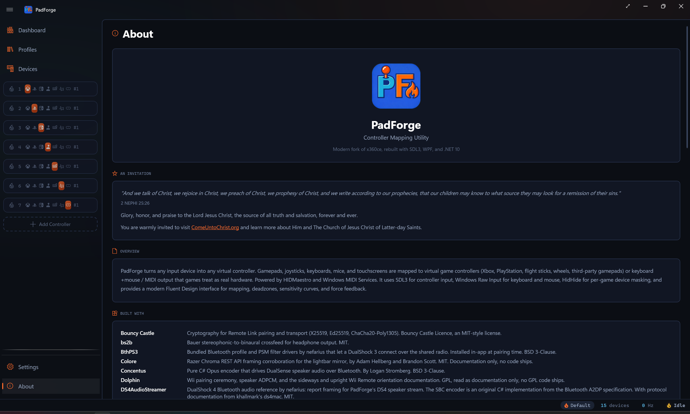
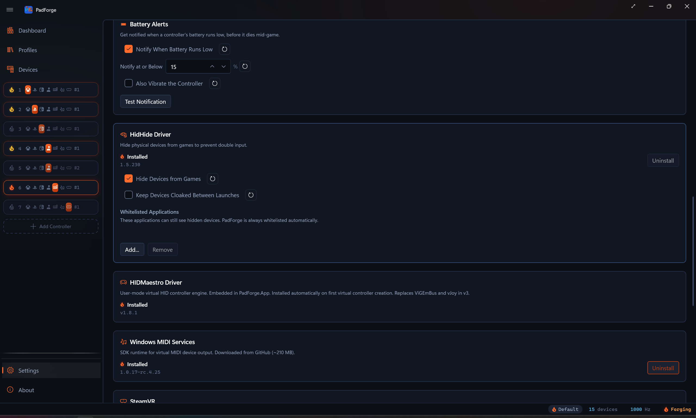

# Installation

*Install PadForge, run it the first time, and set up the optional drivers.*

## Quick start (2 minutes)

1. Download `PadForge-v{version}-win-x64.zip` from the [Releases page](https://github.com/hifihedgehog/PadForge/releases).
2. Extract the zip to any folder (e.g. `C:\PadForge\`).
3. Run `PadForge.exe`.
4. Approve the one UAC prompt at startup. PadForge needs administrator rights to run.
5. Back on the [Dashboard](../features/dashboard.md), click **Add Controller** and pick a type (Xbox, PlayStation, Nintendo, Extended, Keyboard + Mouse, MIDI, or VR). The first Xbox, PlayStation, Nintendo, or Extended controller you add installs HIDMaestro automatically. No button to click.
6. Plug in a physical controller. It appears on the **[Devices](../features/devices.md)** page. Click the slot badge on its card to assign it.
7. Done. Games now see a virtual controller.

> **Upgrading from PadForge v2?** On first launch, PadForge detects ViGEmBus and vJoy and offers to uninstall them. HIDMaestro replaces both.

---

## Requirements

| Requirement | Details |
|-------------|---------|
| **OS** | Windows 10 or 11 (x64) |
| **Runtime** | .NET 10 Desktop Runtime, bundled. No separate install. |
| **Format** | Portable single-file executable. No installer. Extract and run. |

Settings live in `PadForge.xml` next to the executable. To move PadForge, move the whole folder.

---

## First launch

PadForge opens the [Dashboard](../features/dashboard.md) after first launch. It shows one UAC prompt at startup because it needs administrator rights. A short welcome tour appears the first time and highlights the main areas. Follow it or skip it, then set things up in this order.

1. **Create a virtual controller.** On the Dashboard, click **Add Controller** and pick a type. Xbox, PlayStation, Nintendo, Extended (flight sticks, wheels, third-party gamepads, custom HID), Keyboard + Mouse, MIDI, or VR. The first Xbox, PlayStation, Nintendo, or Extended controller you add installs HIDMaestro automatically. The VR type stays disabled until SteamVR is installed, and one VR slot is the maximum because it drives both hands.
2. **Check devices.** Open **[Devices](../features/devices.md)**. PadForge auto-detects every connected gamepad, joystick, keyboard, and mouse.
3. **Assign a device.** Click the slot badge on a device card to route that physical controller through the virtual one.

Games now see the virtual controller as a standard gamepad.

The **About** page, at the bottom of the sidebar, lists the projects PadForge is built on, along with its license and a short description of what it does. Your app version lives on **[Settings](../features/settings.md)** under **Diagnostics > App Version**. Note it when filing an issue.

---

## HIDMaestro

HIDMaestro is the user-mode driver that creates the virtual controllers. PadForge needs it for the Xbox, PlayStation, Nintendo, and Extended controller types. Keyboard + Mouse and MIDI use their own paths and do not need it. The VR type rides HIDMaestro's OpenVR driver, which registers itself with SteamVR instead of creating a HID device.

The driver ships embedded in `PadForge.exe`. It installs automatically the first time you add an Xbox, PlayStation, Nintendo, or Extended controller. There's no button to click, and the startup UAC prompt covers it. On the [Settings](../features/settings.md) page, the HIDMaestro card lights its status indicator and shows the version once installation completes. After that, every Xbox, PlayStation, Nintendo, or Extended controller you add on the Dashboard becomes a fresh HIDMaestro device. Delete the slot and the device disappears. Slots and devices stay 1:1.

If you upgraded from PadForge v2, HIDMaestro replaces ViGEmBus and vJoy. The legacy driver cleanup dialog on first launch handles uninstalling them.

See [HIDMaestro Deep Dive](../reference/hidmaestro-deep-dive.md) for how PadForge talks to the driver under the hood.

---

## Optional add-ons

Three optional installs live on **[Settings](../features/settings.md)**. HidHide is bundled. Windows MIDI Services and SteamVR download on demand. Each card lights its status indicator once installed and swaps its **Install** button for **Uninstall**.

<!-- SCREENSHOT: settings-driver-cards -->

### HidHide

Hides physical controllers from games so only the virtual ones are visible. Install it if a game sees both your physical pad and the PadForge virtual one at the same time and treats each input twice. Skip it if you do not see double input.

### Windows MIDI Services

Creates virtual MIDI endpoints for the MIDI virtual controller type. Install it if you want to send MIDI to DAWs, synthesizers, or VJ tools. Skip it if you do not need MIDI output. Requires Windows 11 24H2 (build 26100) or later. The Install button is disabled on older versions.

### SteamVR

The VR runtime the virtual VR controllers need. PadForge installs it straight from Valve's servers, with no Steam account and no Steam client. It is several gigabytes, so pick the **Install Location** before starting. Skip it unless you want VR slots. **Uninstall** appears only for the Steam-free install PadForge created. A SteamVR that came with the Steam client belongs to Steam and shows no uninstall.

### Keyboard + Mouse

Always on. Maps controller inputs to keyboard keys and mouse moves. No driver required.

### OpenXInput

PadForge bundles a build of [OpenXInput](https://github.com/hifihedgehog/OpenXinput) so it keeps its own virtual controllers out of its own view. Without it, PadForge would try to map a virtual controller through itself. Games and Steam still see the virtual controllers normally. Nothing to install.

---

## Administrator privileges

PadForge needs administrator rights and shows a UAC prompt at startup. HIDMaestro driver registration (automatic, with no in-app uninstall path), HidHide install / uninstall / whitelist edits, and Windows MIDI Services and SteamVR install / uninstall all need administrator access. Reading physical controllers needs it too. Declining the prompt means PadForge does not start.

The UAC shield is on the EXE icon as a hint. PadForge prompts once per launch.

---

## Start at login

Turn on **Settings > Window > Start at Login** to launch PadForge on sign-in.

To run PadForge silently in the background, turn on all three options.

| Option | Effect |
|--------|--------|
| **Start at Login** | Launches PadForge on sign-in. |
| **Start Minimized** | Skips showing the main window. |
| **Minimize to System Tray** | Keeps PadForge in the notification area instead of the taskbar. |

With all three on, PadForge runs in the background with only a tray icon.

---

## Uninstalling

There is no installer, so removal is short.

1. Open **[Settings](../features/settings.md)** and click **Uninstall** next to HidHide, Windows MIDI Services, and SteamVR if you installed them. HIDMaestro has no Uninstall button and stays registered.
2. Close PadForge.
3. Delete the PadForge folder.

If you previously had ViGEmBus or vJoy installed from PadForge v2, the legacy driver cleanup dialog on first launch removes them for you.

---

## Related pages

- [Settings](../features/settings.md): install and manage optional drivers.
- [Dashboard](../features/dashboard.md): main control panel after first launch.
- [Devices](../features/devices.md): view detected physical controllers.
- [Controller Slots](../features/controller-slots.md): create and configure virtual controllers.
- [Driver Management](../features/driver-management.md): detailed driver information.
- [HIDMaestro Deep Dive](../reference/hidmaestro-deep-dive.md): how PadForge talks to HIDMaestro under the hood.

---

*Last updated for PadForge 4.3.0.*
